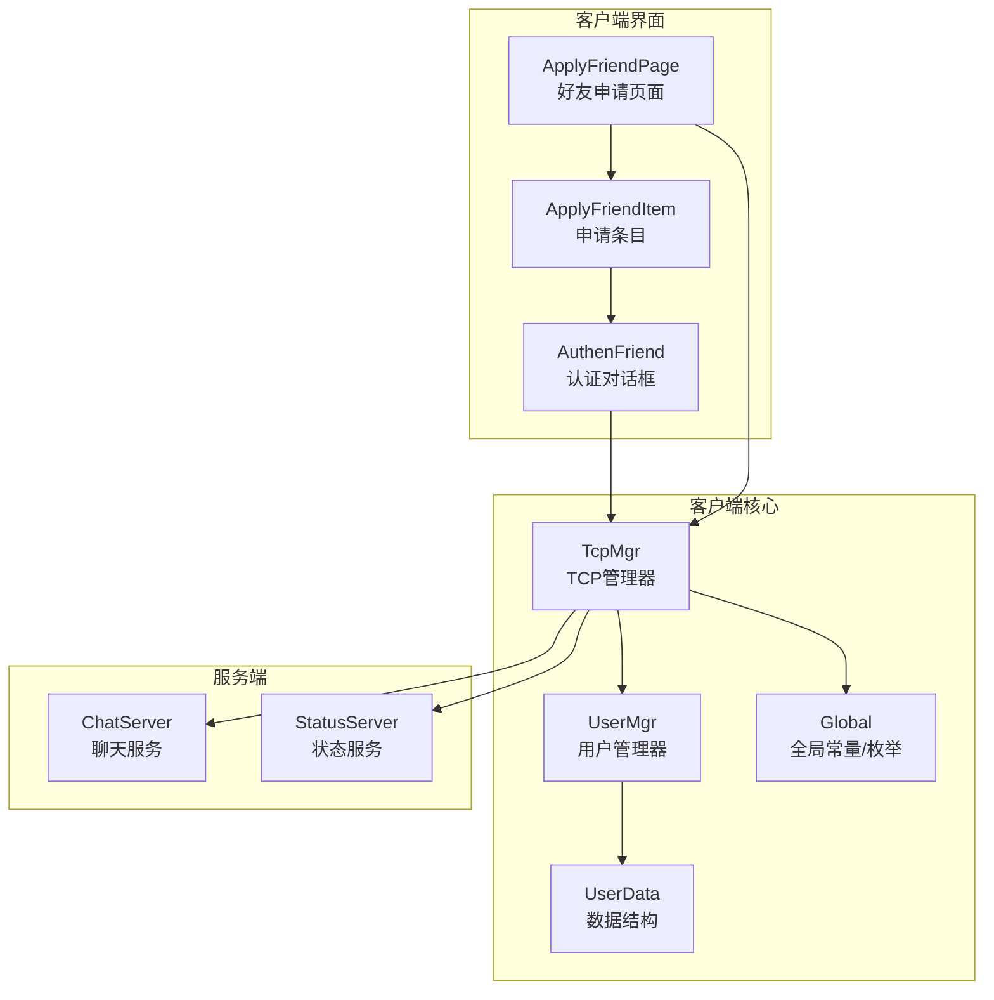
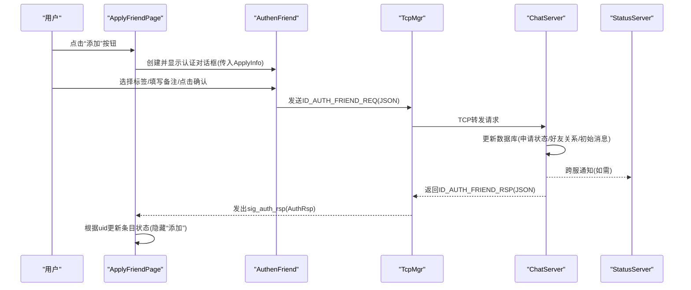
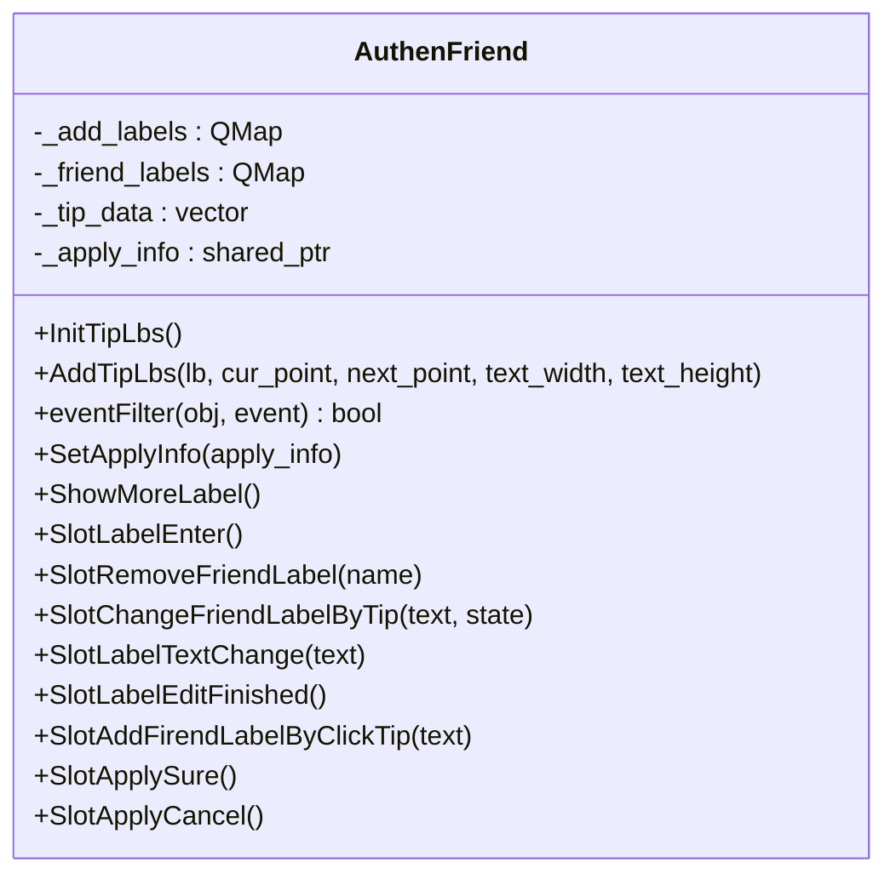
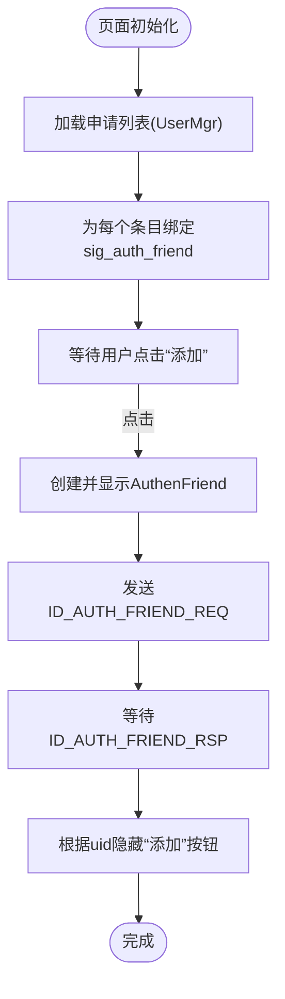
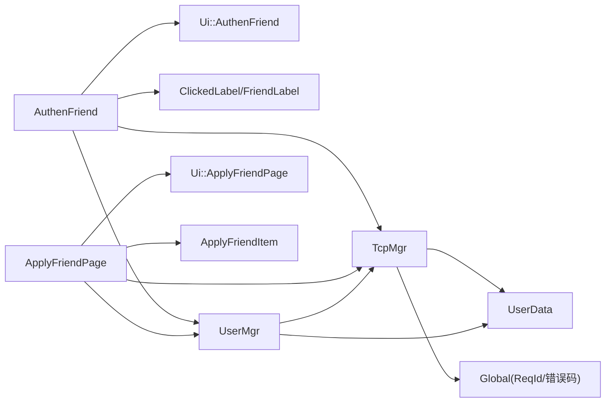

# 好友认证功能

<cite>
**本文引用的文件**   
- [authenfriend.h](file://client/llfcchat/include/authenfriend.h)
- [authenfriend.cpp](file://client/llfcchat/src/authenfriend.cpp)
- [applyfriendpage.h](file://client/llfcchat/include/applyfriendpage.h)
- [applyfriendpage.cpp](file://client/llfcchat/src/applyfriendpage.cpp)
- [applyfrienditem.h](file://client/llfcchat/include/applyfrienditem.h)
- [userdata.h](file://client/llfcchat/include/userdata.h)
- [tcpmgr.h](file://client/llfcchat/include/tcpmgr.h)
- [usermgr.h](file://client/llfcchat/include/usermgr.h)
- [global.h](file://client/llfcchat/include/global.h)
- [authenfriend.ui](file://client/llfcchat/ui/authenfriend.ui)
- [applyfriendpage.ui](file://client/llfcchat/ui/applyfriendpage.ui)
- [day29-好友认证和聊天通信.md](file://开发文档/day29-好友认证和聊天通信.md)
- [day37-聊天信息存储方案.md](file://开发文档/day37-聊天信息存储方案.md)
</cite>

## 目录
1. [简介](#简介)
2. [项目结构](#项目结构)
3. [核心组件](#核心组件)
4. [架构总览](#架构总览)
5. [详细组件分析](#详细组件分析)
6. [依赖关系分析](#依赖关系分析)
7. [性能考虑](#性能考虑)
8. [故障排查指南](#故障排查指南)
9. [结论](#结论)
10. [附录](#附录)

## 简介
本技术文档聚焦于LLFCChat客户端的“好友认证”功能，围绕AuthenFriend对话框与ApplyFriendPage页面的实现进行深入说明。内容涵盖：
- 认证请求的构造与发送、认证结果的接收与反馈、认证状态的同步更新
- 调用关系、接口定义、事件处理与状态管理
- 与UserManager、TcpMgr以及服务器端ChatServer/StatusServer的关系
- 常见问题与解决方案
- 认证流程的完整性保证与异常处理机制

该文档既适合初学者理解整体流程，也为有经验的开发者提供足够的代码级细节与优化建议。

## 项目结构
与好友认证相关的客户端代码主要位于client/llfcchat目录下，关键文件包括：
- UI层：AuthenFriend对话框（authenfriend.*）、ApplyFriendPage页面（applyfriendpage.*）
- 数据模型：用户与申请相关的数据结构（userdata.h）
- 网络层：TCP管理器（tcpmgr.h），负责消息收发与分发
- 用户状态管理：UserMgr（usermgr.h），维护好友列表、申请列表等
- 全局常量与枚举：ReqId、错误码、UI常量等（global.h）
- UI布局：authenfriend.ui、applyfriendpage.ui

图表来源
- [applyfriendpage.cpp:14-23](file://client/llfcchat/src/applyfriendpage.cpp#L14-L23)
- [authenfriend.cpp:9-49](file://client/llfcchat/src/authenfriend.cpp#L9-L49)
- [tcpmgr.h:22-87](file://client/llfcchat/include/tcpmgr.h#L22-L87)
- [usermgr.h:12-113](file://client/llfcchat/include/usermgr.h#L12-L113)
- [userdata.h:41-106](file://client/llfcchat/include/userdata.h#L41-L106)
- [global.h:43-88](file://client/llfcchat/include/global.h#L43-L88)

章节来源
- [applyfriendpage.cpp:14-23](file://client/llfcchat/src/applyfriendpage.cpp#L14-L23)
- [authenfriend.cpp:9-49](file://client/llfcchat/src/authenfriend.cpp#L9-L49)
- [tcpmgr.h:22-87](file://client/llfcchat/include/tcpmgr.h#L22-L87)
- [usermgr.h:12-113](file://client/llfcchat/include/usermgr.h#L12-L113)
- [userdata.h:41-106](file://client/llfcchat/include/userdata.h#L41-L106)
- [global.h:43-88](file://client/llfcchat/include/global.h#L43-L88)

## 核心组件
- AuthenFriend：认证对话框，负责标签选择、备注输入、确认/取消交互，并发送认证请求。
- ApplyFriendPage：好友申请页面，展示申请列表，触发认证对话框，订阅认证结果信号以更新UI状态。
- TcpMgr：TCP消息总线，封装发送与接收，按ReqId分发到对应处理器，向上层发出信号。
- UserMgr：用户状态管理，维护申请列表、好友列表、会话映射等，提供查询与更新接口。
- UserData：数据模型，包含AddFriendApply、ApplyInfo、AuthRsp、AuthInfo等结构。
- Global：全局常量与枚举，如ReqId（ID_AUTH_FRIEND_REQ/RSP、ID_NOTIFY_AUTH_FRIEND_REQ等）、错误码、UI常量。

章节来源
- [authenfriend.h:13-61](file://client/llfcchat/include/authenfriend.h#L13-L61)
- [applyfriendpage.h:15-33](file://client/llfcchat/include/applyfriendpage.h#L15-L33)
- [tcpmgr.h:22-87](file://client/llfcchat/include/tcpmgr.h#L22-L87)
- [usermgr.h:12-113](file://client/llfcchat/include/usermgr.h#L12-L113)
- [userdata.h:26-106](file://client/llfcchat/include/userdata.h#L26-L106)
- [global.h:43-88](file://client/llfcchat/include/global.h#L43-L88)

## 架构总览
好友认证的端到端流程如下：
- 用户在ApplyFriendPage点击某条申请的“添加”按钮，触发sig_auth_friend信号。
- ApplyFriendPage创建并显示AuthenFriend对话框，传入ApplyInfo。
- 用户在AuthenFriend中选择标签、填写备注，点击“确认”。
- AuthenFriend构造JSON载荷，通过TcpMgr发送ID_AUTH_FRIEND_REQ请求。
- ChatServer处理请求，更新数据库（申请状态、好友关系、初始消息），并向对方推送通知（ID_NOTIFY_AUTH_FRIEND_REQ）。
- 对方向客户端返回ID_AUTH_FRIEND_RSP，TcpMgr解析后发出sig_auth_rsp信号。
- ApplyFriendPage订阅该信号，根据uid找到未认证条目并隐藏“添加”按钮，完成状态同步。

图表来源
- [applyfriendpage.cpp:48-53](file://client/llfcchat/src/applyfriendpage.cpp#L48-L53)
- [authenfriend.cpp:412-436](file://client/llfcchat/src/authenfriend.cpp#L412-L436)
- [tcpmgr.h:67-74](file://client/llfcchat/include/tcpmgr.h#L67-L74)
- [day29-好友认证和聊天通信.md:340-379](file://开发文档/day29-好友认证和聊天通信.md#L340-L379)
- [day37-聊天信息存储方案.md:1785-1900](file://开发文档/day37-聊天信息存储方案.md#L1785-L1900)

## 详细组件分析

### AuthenFriend类分析
职责与交互：
- 初始化UI、提示标签、滚动区域事件过滤、按钮状态设置。
- 支持从输入框回车添加标签、从提示框点击添加标签、从已有标签切换选中/取消。
- 确认时构造JSON载荷（fromuid、touid、back），通过TcpMgr发送ID_AUTH_FRIEND_REQ。
- 取消则直接关闭对话框。

关键方法与槽：
- SetApplyInfo：设置待认证的目标信息，用于预填备注名。
- SlotApplySure：组装请求数据并发送；随后隐藏并延迟删除对话框。
- SlotApplyCancel：取消操作。
- SlotChangeFriendLabelByTip：根据点击状态在标签栏增删标签。
- SlotLabelTextChange/SlotLabelEditFinished：输入框文本变化与完成时的提示框控制。
- ShowMoreLabel：展开更多标签并重新布局。

图表来源
- [authenfriend.h:13-61](file://client/llfcchat/include/authenfriend.h#L13-L61)
- [authenfriend.cpp:57-121](file://client/llfcchat/src/authenfriend.cpp#L57-L121)
- [authenfriend.cpp:123-192](file://client/llfcchat/src/authenfriend.cpp#L123-L192)
- [authenfriend.cpp:194-266](file://client/llfcchat/src/authenfriend.cpp#L194-L266)
- [authenfriend.cpp:268-340](file://client/llfcchat/src/authenfriend.cpp#L268-L340)
- [authenfriend.cpp:342-410](file://client/llfcchat/src/authenfriend.cpp#L342-L410)
- [authenfriend.cpp:412-443](file://client/llfcchat/src/authenfriend.cpp#L412-L443)

章节来源
- [authenfriend.h:13-61](file://client/llfcchat/include/authenfriend.h#L13-L61)
- [authenfriend.cpp:9-49](file://client/llfcchat/src/authenfriend.cpp#L9-L49)
- [authenfriend.cpp:412-436](file://client/llfcchat/src/authenfriend.cpp#L412-L436)

### ApplyFriendPage类分析
职责与交互：
- 加载申请列表（从UserMgr获取或模拟数据），为每个条目绑定“添加”按钮点击事件。
- 点击“添加”时弹出AuthenFriend对话框，并传入ApplyInfo。
- 订阅TcpMgr的sig_auth_rsp信号，收到认证结果后根据uid定位未认证条目并隐藏“添加”按钮。

关键方法与槽：
- AddNewApply：动态添加新申请条目，绑定sig_auth_friend信号。
- loadApplyList：初始化列表，区分已认证/未认证状态。
- slot_auth_rsp：处理认证结果，更新UI状态。

图表来源
- [applyfriendpage.cpp:30-54](file://client/llfcchat/src/applyfriendpage.cpp#L30-L54)
- [applyfriendpage.cpp:64-122](file://client/llfcchat/src/applyfriendpage.cpp#L64-L122)
- [applyfriendpage.cpp:124-132](file://client/llfcchat/src/applyfriendpage.cpp#L124-L132)

章节来源
- [applyfriendpage.h:15-33](file://client/llfcchat/include/applyfriendpage.h#L15-L33)
- [applyfriendpage.cpp:14-23](file://client/llfcchat/src/applyfriendpage.cpp#L14-L23)
- [applyfriendpage.cpp:30-54](file://client/llfcchat/src/applyfriendpage.cpp#L30-L54)
- [applyfriendpage.cpp:64-122](file://client/llfcchat/src/applyfriendpage.cpp#L64-L122)
- [applyfriendpage.cpp:124-132](file://client/llfcchat/src/applyfriendpage.cpp#L124-L132)

### 数据模型与协议
- AddFriendApply：发起申请的基本信息（from_uid、name、desc、icon、nick、sex）。
- ApplyInfo：申请条目展示信息（uid、name、desc、icon、nick、sex、status）。
- AuthRsp：认证结果响应（peer uid/name/nick/icon/sex，可选chat_datas）。
- AuthInfo：通知型认证信息（用于被通知方）。
- ReqId：消息类型标识，包括ID_AUTH_FRIEND_REQ、ID_AUTH_FRIEND_RSP、ID_NOTIFY_AUTH_FRIEND_REQ等。

章节来源
- [userdata.h:26-106](file://client/llfcchat/include/userdata.h#L26-L106)
- [global.h:43-88](file://client/llfcchat/include/global.h#L43-L88)

### 网络与事件流
- AuthenFriend通过TcpMgr::sig_send_data发送ID_AUTH_FRIEND_REQ。
- TcpMgr内部注册处理器，解析ID_AUTH_FRIEND_RSP，构造AuthRsp并发出sig_auth_rsp。
- ApplyFriendPage订阅sig_auth_rsp，依据uid更新条目状态。
- 服务器侧（ChatServer）处理认证请求，更新数据库并可能向StatusServer或其他ChatServer节点转发通知。

章节来源
- [authenfriend.cpp:412-436](file://client/llfcchat/src/authenfriend.cpp#L412-L436)
- [tcpmgr.h:67-74](file://client/llfcchat/include/tcpmgr.h#L67-L74)
- [day29-好友认证和聊天通信.md:340-379](file://开发文档/day29-好友认证和聊天通信.md#L340-L379)
- [day37-聊天信息存储方案.md:1785-1900](file://开发文档/day37-聊天信息存储方案.md#L1785-L1900)

## 依赖关系分析
- AuthenFriend依赖：
  - Ui::AuthenFriend（UI布局）
  - ClickedLabel/FriendLabel（自定义控件）
  - UserMgr（获取当前用户uid）
  - TcpMgr（发送认证请求）
- ApplyFriendPage依赖：
  - Ui::ApplyFriendPage（UI布局）
  - ApplyFriendItem（条目控件）
  - TcpMgr（订阅认证结果信号）
  - UserMgr（获取申请列表）
- TcpMgr依赖：
  - global.h（ReqId、错误码）
  - userdata.h（数据结构）
- UserMgr依赖：
  - userdata.h（数据结构）
  - tcpmgr.h（订阅认证结果信号）

图表来源
- [authenfriend.cpp:9-49](file://client/llfcchat/src/authenfriend.cpp#L9-L49)
- [applyfriendpage.cpp:14-23](file://client/llfcchat/src/applyfriendpage.cpp#L14-L23)
- [tcpmgr.h:22-87](file://client/llfcchat/include/tcpmgr.h#L22-L87)
- [usermgr.h:12-113](file://client/llfcchat/include/usermgr.h#L12-L113)
- [global.h:43-88](file://client/llfcchat/include/global.h#L43-L88)
- [userdata.h:26-106](file://client/llfcchat/include/userdata.h#L26-L106)

章节来源
- [authenfriend.cpp:9-49](file://client/llfcchat/src/authenfriend.cpp#L9-L49)
- [applyfriendpage.cpp:14-23](file://client/llfcchat/src/applyfriendpage.cpp#L14-L23)
- [tcpmgr.h:22-87](file://client/llfcchat/include/tcpmgr.h#L22-L87)
- [usermgr.h:12-113](file://client/llfcchat/include/usermgr.h#L12-L113)
- [global.h:43-88](file://client/llfcchat/include/global.h#L43-L88)
- [userdata.h:26-106](file://client/llfcchat/include/userdata.h#L26-L106)

## 性能考虑
- 标签布局重算：ShowMoreLabel与resetLabels中频繁计算字体宽度与位置，建议在大量标签场景下缓存度量结果以减少重复计算。
- 滚动区域事件过滤：仅在鼠标进入/离开时显示/隐藏滚动条，避免不必要的重绘。
- 信号连接：ApplyFriendPage为每个条目绑定信号，注意条目销毁时断开连接，防止悬空指针与内存泄漏。
- JSON序列化：认证请求使用QJsonDocument紧凑格式，减少网络传输开销。

[本节为通用指导，不直接分析具体文件]

## 故障排查指南
常见问题与解决思路：
- 认证请求未发送或无响应：
  - 检查TcpMgr::sig_send_data是否正确发射，确认ReqId为ID_AUTH_FRIEND_REQ。
  - 查看TcpMgr的处理器是否注册ID_AUTH_FRIEND_RSP，确保能解析并抛出sig_auth_rsp。
- 认证结果未更新UI：
  - 确认ApplyFriendPage已连接sig_auth_rsp，且uid匹配正确。
  - 检查_unauth_items映射是否包含目标uid。
- 标签交互异常：
  - 检查SlotChangeFriendLabelByTip的状态判断逻辑，确保Selected/Normal分支正确。
  - 验证AddTipLbs与resetLabels中的坐标计算与边界条件。
- 服务器端事务失败：
  - 参考服务器日志，确认数据库事务回滚原因（如记录不存在、更新行数不符）。
  - 检查Redis中目标用户在线信息与跨服通知路径。

章节来源
- [authenfriend.cpp:412-436](file://client/llfcchat/src/authenfriend.cpp#L412-L436)
- [applyfriendpage.cpp:124-132](file://client/llfcchat/src/applyfriendpage.cpp#L124-L132)
- [tcpmgr.h:67-74](file://client/llfcchat/include/tcpmgr.h#L67-L74)
- [day29-好友认证和聊天通信.md:340-379](file://开发文档/day29-好友认证和聊天通信.md#L340-L379)
- [day37-聊天信息存储方案.md:1785-1900](file://开发文档/day37-聊天信息存储方案.md#L1785-L1900)

## 结论
AuthenFriend与ApplyFriendPage共同实现了完整的好友认证流程：从用户交互、请求构造、网络传输到结果反馈与UI状态同步。通过TcpMgr的事件驱动与UserMgr的状态管理，系统具备良好的可扩展性与可维护性。服务器端采用事务与分布式通知保障一致性，客户端通过信号与槽机制实现解耦与实时响应。建议在大规模标签与高频交互场景下进行性能优化，并完善错误提示与重试机制以提升用户体验。

[本节为总结，不直接分析具体文件]

## 附录
- 配置选项与参数：
  - 认证请求JSON字段：fromuid、touid、back（备注名）
  - 认证响应JSON字段：error、uid、name、nick、icon、sex、chat_datas（可选）
  - 通知消息字段：error、fromuid、touid、name、nick、icon、sex
- 返回值与状态：
  - error=0表示成功，非0表示失败（ERR_JSON、UidInvalid等）
  - 申请状态status：0未认证，1已认证
- 与UserManager、ChatServer、StatusServer的关系：
  - UserMgr维护申请列表与好友映射，供ApplyFriendPage读取与更新
  - ChatServer处理认证请求，更新数据库并可能通过StatusServer进行跨服通知
  - StatusServer协助状态同步与在线信息查询

章节来源
- [global.h:43-88](file://client/llfcchat/include/global.h#L43-L88)
- [userdata.h:26-106](file://client/llfcchat/include/userdata.h#L26-L106)
- [day29-好友认证和聊天通信.md:340-379](file://开发文档/day29-好友认证和聊天通信.md#L340-L379)
- [day37-聊天信息存储方案.md:1785-1900](file://开发文档/day37-聊天信息存储方案.md#L1785-L1900)