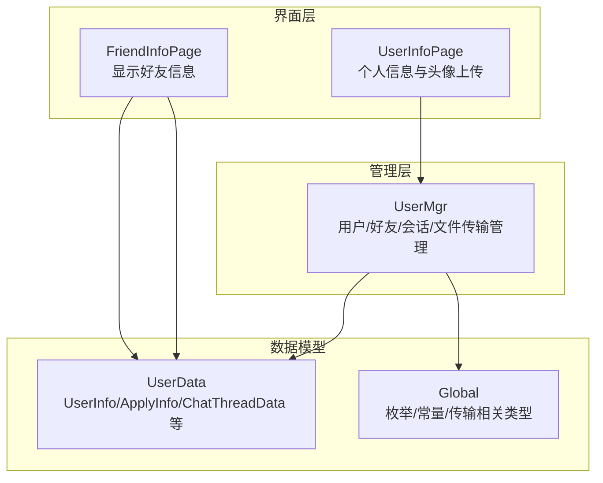
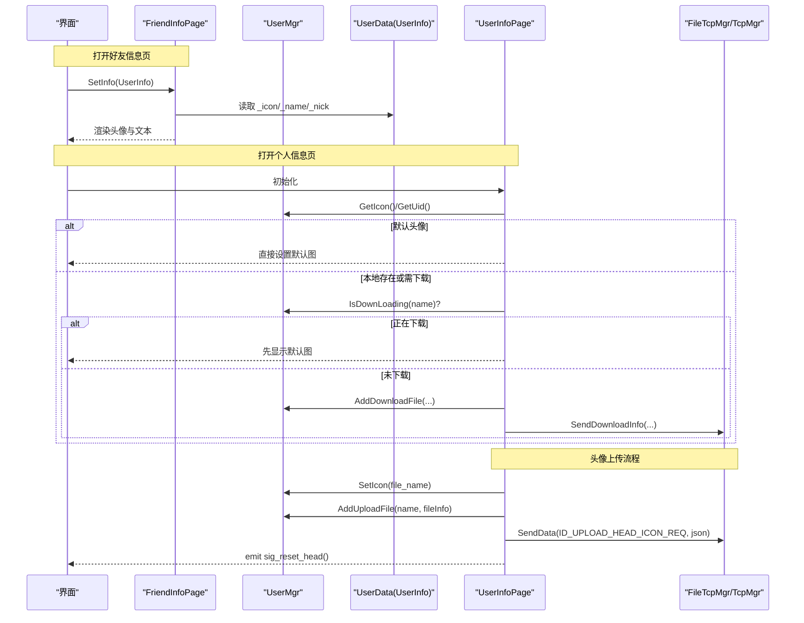
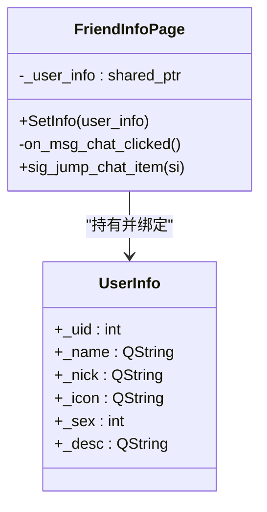
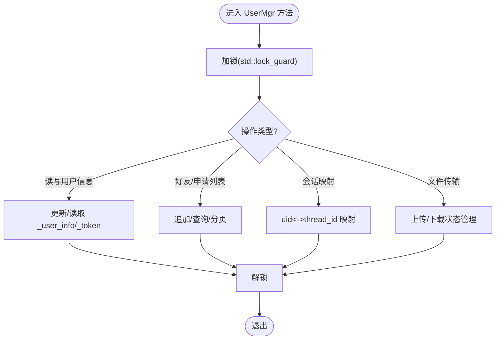
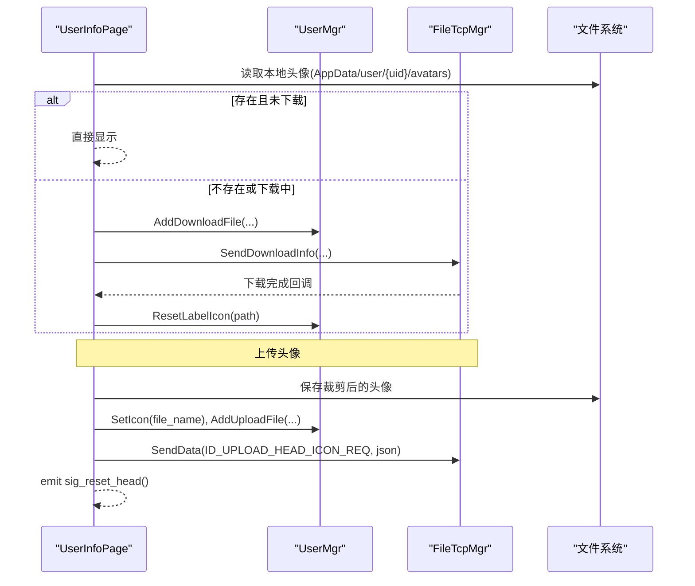
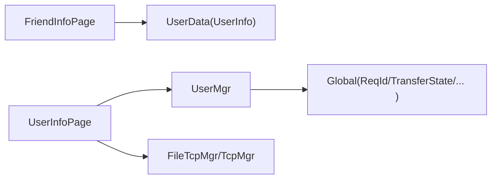

# 用户信息管理

<cite>
**本文引用的文件**   
- [friendinfopage.h](file://client/llfcchat/include/friendinfopage.h)
- [friendinfopage.cpp](file://client/llfcchat/src/friendinfopage.cpp)
- [userdata.h](file://client/llfcchat/include/userdata.h)
- [userdata.cpp](file://client/llfcchat/src/userdata.cpp)
- [usermgr.h](file://client/llfcchat/include/usermgr.h)
- [usermgr.cpp](file://client/llfcchat/src/usermgr.cpp)
- [global.h](file://client/llfcchat/include/global.h)
- [userinfopage.h](file://client/llfcchat/include/userinfopage.h)
- [userinfopage.cpp](file://client/llfcchat/src/userinfopage.cpp)
- [friendinfopage.ui](file://client/llfcchat/ui/friendinfopage.ui)
</cite>

## 目录
1. [简介](#简介)
2. [项目结构](#项目结构)
3. [核心组件](#核心组件)
4. [架构总览](#架构总览)
5. [详细组件分析](#详细组件分析)
6. [依赖关系分析](#依赖关系分析)
7. [性能与一致性](#性能与一致性)
8. [故障排查指南](#故障排查指南)
9. [结论](#结论)
10. [附录：接口与数据模型](#附录接口与数据模型)

## 简介
本技术文档围绕 LLFCChat 客户端的用户信息管理功能，深入解析以下关键实现：
- FriendInfoPage：好友信息展示页，负责将 UserInfo 绑定到 UI，并触发聊天跳转。
- UserInfo：用户信息数据模型，承载头像、昵称、备注等字段。
- UserMgr：单例式用户管理器，维护当前登录用户、好友列表、会话映射、下载/上传状态及标签重置队列等。
- UserInfoPage：个人信息页，负责头像本地缓存、加载与上传流程。

文档涵盖调用关系、接口定义、数据模型、缓存策略、远程同步协议要点、常见问题与解决方案，并提供面向初学者的渐进式说明与面向资深开发者的深度细节。

## 项目结构
与用户信息管理相关的代码主要位于 client/llfcchat 模块中，采用 Qt 的 MVC 风格组织：UI（.ui）+ 视图类（QWidget）+ 数据模型 + 管理器（UserMgr）。

图表来源
- [friendinfopage.h:11-27](file://client/llfcchat/include/friendinfopage.h#L11-L27)
- [userinfopage.h:11-28](file://client/llfcchat/include/userinfopage.h#L11-L28)
- [userdata.h:108-142](file://client/llfcchat/include/userdata.h#L108-L142)
- [usermgr.h:12-113](file://client/llfcchat/include/usermgr.h#L12-L113)
- [global.h:145-200](file://client/llfcchat/include/global.h#L145-L200)

章节来源
- [friendinfopage.h:11-27](file://client/llfcchat/include/friendinfopage.h#L11-L27)
- [userinfopage.h:11-28](file://client/llfcchat/include/userinfopage.h#L11-L28)
- [userdata.h:108-142](file://client/llfcchat/include/userdata.h#L108-L142)
- [usermgr.h:12-113](file://client/llfcchat/include/usermgr.h#L12-L113)
- [global.h:145-200](file://client/llfcchat/include/global.h#L145-L200)

## 核心组件
- FriendInfoPage：提供 SetInfo() 将 UserInfo 绑定到 UI；点击消息按钮后通过信号跳转到聊天项。
- UserInfo：轻量数据模型，包含 uid、name、nick、icon、sex、desc 等字段，支持从多种来源构造。
- UserMgr：单例，集中管理：
  - 当前用户信息与 Token
  - 好友列表与查询（按页获取、是否已加载完成）
  - 申请列表与重复申请检查
  - 会话映射（uid <-> thread_id）、会话数据缓存
  - 头像/文件下载与上传状态管理
  - 标签重置队列（用于头像更新后刷新所有引用）

章节来源
- [friendinfopage.cpp:20-33](file://client/llfcchat/src/friendinfopage.cpp#L20-L33)
- [userdata.h:108-142](file://client/llfcchat/include/userdata.h#L108-L142)
- [usermgr.h:12-113](file://client/llfcchat/include/usermgr.h#L12-L113)
- [usermgr.cpp:10-65](file://client/llfcchat/src/usermgr.cpp#L10-L65)

## 架构总览
下图展示了“好友信息展示”和“个人信息页头像加载/上传”的关键交互路径。

图表来源
- [friendinfopage.cpp:20-33](file://client/llfcchat/src/friendinfopage.cpp#L20-L33)
- [userinfopage.cpp:22-89](file://client/llfcchat/src/userinfopage.cpp#L22-L89)
- [userinfopage.cpp:96-124](file://client/llfcchat/src/userinfopage.cpp#L96-L124)
- [userinfopage.cpp:127-270](file://client/llfcchat/src/userinfopage.cpp#L127-L270)
- [usermgr.cpp:426-459](file://client/llfcchat/src/usermgr.cpp#L426-L459)

## 详细组件分析

### FriendInfoPage：好友信息展示
- 职责
  - 接收 std::shared_ptr<UserInfo>，将头像、名称、昵称、备注绑定到 UI。
  - 点击“发消息”按钮时，发射 sig_jump_chat_item(UserInfo)，由上层处理跳转逻辑。
- 数据绑定
  - 头像：直接使用 user_info->_icon 构造 QPixmap，并按比例缩放。
  - 文本：_name、_nick 分别绑定到 name_lb、nick_lb；bak_lb 使用 _nick 作为备注占位。
- 事件处理
  - on_msg_chat_clicked() 触发跳转信号。

图表来源
- [friendinfopage.h:11-27](file://client/llfcchat/include/friendinfopage.h#L11-L27)
- [friendinfopage.cpp:20-33](file://client/llfcchat/src/friendinfopage.cpp#L20-L33)
- [userdata.h:108-142](file://client/llfcchat/include/userdata.h#L108-L142)

章节来源
- [friendinfopage.h:11-27](file://client/llfcchat/include/friendinfopage.h#L11-L27)
- [friendinfopage.cpp:20-33](file://client/llfcchat/src/friendinfopage.cpp#L20-L33)
- [friendinfopage.ui:33-50](file://client/llfcchat/ui/friendinfopage.ui#L33-L50)

### UserInfo：用户信息数据模型
- 字段
  - _uid、_name、_nick、_icon、_sex、_desc
- 构造方式
  - 支持从 AuthInfo、AuthRsp、SearchInfo 等多种来源构造，便于统一展示。
- 复杂度
  - 纯数据结构，无复杂算法，时间复杂度 O(1)。

章节来源
- [userdata.h:108-142](file://client/llfcchat/include/userdata.h#L108-L142)

### UserMgr：用户管理与缓存
- 当前用户与 Token
  - SetUserInfo/SetToken/GetToken/GetUid/GetName/GetNick/GetIcon/GetDesc/SetIcon
- 好友与申请列表
  - AppendFriendList/AppendApplyList：从 JSON 数组解析为对象并缓存
  - GetChatListPerPage/GetConListPerPage：分页返回
  - AlreadyApply/CheckFriendById：去重与存在性检查
- 会话映射与数据
  - AddChatThreadData/GetChatThreadByThreadId/GetChatThreadByUid/GetThreadIdByUid
  - GetCurLoadData/GetNextLoadData：顺序加载会话数据
- 头像与文件传输
  - AddLabelToReset/ResetLabelIcon：头像更新后批量刷新 UI
  - AddDownloadFile/IsDownLoading/GetDownloadInfo：下载状态管理
  - AddUploadFile/RmvUploadFile/GetUploadInfoByName：上传元信息
  - TransFileIsUploading/PauseTransFileByName/ResumeTransFileByName：传输控制
- 并发安全
  - 关键方法使用 std::mutex 保护共享状态，避免竞态。

图表来源
- [usermgr.cpp:10-65](file://client/llfcchat/src/usermgr.cpp#L10-L65)
- [usermgr.cpp:67-102](file://client/llfcchat/src/usermgr.cpp#L67-L102)
- [usermgr.cpp:128-167](file://client/llfcchat/src/usermgr.cpp#L128-L167)
- [usermgr.cpp:288-335](file://client/llfcchat/src/usermgr.cpp#L288-L335)
- [usermgr.cpp:369-528](file://client/llfcchat/src/usermgr.cpp#L369-L528)

章节来源
- [usermgr.h:12-113](file://client/llfcchat/include/usermgr.h#L12-L113)
- [usermgr.cpp:10-65](file://client/llfcchat/src/usermgr.cpp#L10-L65)
- [usermgr.cpp:67-102](file://client/llfcchat/src/usermgr.cpp#L67-L102)
- [usermgr.cpp:128-167](file://client/llfcchat/src/usermgr.cpp#L128-L167)
- [usermgr.cpp:288-335](file://client/llfcchat/src/usermgr.cpp#L288-L335)
- [usermgr.cpp:369-528](file://client/llfcchat/src/usermgr.cpp#L369-L528)

### UserInfoPage：个人信息与头像缓存/上传
- 初始化与头像加载
  - 判断是否为默认头像（正则匹配），若是则直接设置；否则尝试从本地 AppData/user/{uid}/avatars 加载。
  - 若本地不存在或正在下载，先显示默认图，再发起下载请求。
- 下载流程
  - 通过 UserMgr.AddDownloadFile 记录下载信息，调用 FileTcpMgr.SendDownloadInfo 发起下载。
  - 下载完成后，UserMgr.ResetLabelIcon 会批量刷新对应 QLabel 的头像。
- 上传流程
  - 选择图片 -> 裁剪 -> 保存到本地 -> 计算 MD5 -> 分块 Base64 发送 ID_UPLOAD_HEAD_ICON_REQ。
  - 上传前更新 UserMgr.SetIcon(file_name)，并在成功后 emit sig_reset_head() 通知刷新。

图表来源
- [userinfopage.cpp:22-89](file://client/llfcchat/src/userinfopage.cpp#L22-L89)
- [userinfopage.cpp:96-124](file://client/llfcchat/src/userinfopage.cpp#L96-L124)
- [userinfopage.cpp:127-270](file://client/llfcchat/src/userinfopage.cpp#L127-L270)
- [usermgr.cpp:426-459](file://client/llfcchat/src/usermgr.cpp#L426-L459)

章节来源
- [userinfopage.h:11-28](file://client/llfcchat/include/userinfopage.h#L11-L28)
- [userinfopage.cpp:22-89](file://client/llfcchat/src/userinfopage.cpp#L22-L89)
- [userinfopage.cpp:96-124](file://client/llfcchat/src/userinfopage.cpp#L96-L124)
- [userinfopage.cpp:127-270](file://client/llfcchat/src/userinfopage.cpp#L127-L270)

## 依赖关系分析
- FriendInfoPage 依赖 UserData.Userinfo 进行 UI 绑定。
- UserInfoPage 依赖 UserMgr 进行头像状态管理与资源下载/上传协调。
- UserMgr 依赖 Global 中的枚举与常量（如 ReqId、TransferState、MsgType、CHAT_COUNT_PER_PAGE 等）。
- 文件传输依赖 TcpMgr/FileTcpMgr（在源码中包含头文件并使用其接口）。

图表来源
- [friendinfopage.h:11-27](file://client/llfcchat/include/friendinfopage.h#L11-L27)
- [userinfopage.h:11-28](file://client/llfcchat/include/userinfopage.h#L11-L28)
- [usermgr.h:12-113](file://client/llfcchat/include/usermgr.h#L12-L113)
- [global.h:43-88](file://client/llfcchat/include/global.h#L43-L88)

章节来源
- [friendinfopage.h:11-27](file://client/llfcchat/include/friendinfopage.h#L11-L27)
- [userinfopage.h:11-28](file://client/llfcchat/include/userinfopage.h#L11-L28)
- [usermgr.h:12-113](file://client/llfcchat/include/usermgr.h#L12-L113)
- [global.h:43-88](file://client/llfcchat/include/global.h#L43-L88)

## 性能与一致性
- 分页加载
  - CHAT_COUNT_PER_PAGE=13，GetChatListPerPage/GetConListPerPage 基于索引分页，避免一次性加载大量数据。
- 并发安全
  - UserMgr 内部对共享容器与方法使用 std::mutex 保护，保证多线程访问的一致性。
- 头像缓存策略
  - 本地优先：AppData/user/{uid}/avatars 下优先读取本地头像。
  - 下载中回退：若检测到正在下载，先显示默认头像，避免闪烁。
  - 批量刷新：UserMgr.ResetLabelIcon 根据路径批量刷新所有引用该头像的 QLabel，减少重复 IO。
- 一致性保证
  - 上传成功后立即更新 UserMgr._user_info._icon，并通过信号触发 UI 刷新，确保多视图一致。
  - 下载状态通过 UserMgr.IsDownLoading 避免重复下载。

章节来源
- [global.h:255](file://client/llfcchat/include/global.h#L255)
- [usermgr.cpp:426-459](file://client/llfcchat/src/usermgr.cpp#L426-L459)
- [userinfopage.cpp:22-89](file://client/llfcchat/src/userinfopage.cpp#L22-L89)

## 故障排查指南
- 头像无法加载
  - 检查本地路径是否存在：AppData/user/{uid}/avatars
  - 若正在下载，确认 FileTcpMgr 是否正确发送下载请求并收到回调。
  - 查看 UserMgr.ResetLabelIcon 是否被调用以刷新 UI。
- 上传失败
  - 确认文件可读取、MD5 计算成功、分块大小与 last_seq 正确。
  - 检查 ID_UPLOAD_HEAD_ICON_REQ 的 JSON 字段是否完整（md5、name、seq、trans_size、total_size、last、data、last_seq、token、uid）。
- 好友列表为空或重复
  - 检查 AppendFriendList/AppendApplyList 的 JSON 解析键名是否与后端一致。
  - 使用 AlreadyApply/CheckFriendById 做去重校验。
- 会话映射异常
  - 确认 AddChatThreadData 时 other_uid 是否正确传入，uid_to_thread_id 映射是否建立。

章节来源
- [userinfopage.cpp:96-124](file://client/llfcchat/src/userinfopage.cpp#L96-L124)
- [userinfopage.cpp:127-270](file://client/llfcchat/src/userinfopage.cpp#L127-L270)
- [usermgr.cpp:67-102](file://client/llfcchat/src/usermgr.cpp#L67-L102)
- [usermgr.cpp:288-335](file://client/llfcchat/src/usermgr.cpp#L288-L335)

## 结论
LLFCChat 的用户信息管理模块通过清晰的数据模型（UserInfo）、统一的界面组件（FriendInfoPage/UserInfoPage）以及集中的管理器（UserMgr），实现了用户信息的展示、本地缓存、远程同步与一致性保障。分页加载、并发安全、头像缓存与批量刷新等机制确保了良好的用户体验与系统稳定性。后续可在以下方面进一步优化：
- 引入更细粒度的缓存失效策略（如 TTL、版本号）。
- 增加异步下载进度与错误重试机制。
- 扩展更多用户属性与动态更新能力。

## 附录：接口与数据模型

### 关键接口（UserMgr）
- 用户信息
  - SetUserInfo(GetUserInfo)、SetToken(GetToken)、GetUid/GetName/GetNick/GetIcon/GetDesc/SetIcon
- 好友与申请
  - AppendFriendList/AppendApplyList、GetChatListPerPage/GetConListPerPage、AlreadyApply/CheckFriendById
- 会话映射
  - AddChatThreadData/GetChatThreadByThreadId/GetChatThreadByUid/GetThreadIdByUid
- 文件传输
  - AddDownloadFile/IsDownLoading/GetDownloadInfo、AddUploadFile/RmvUploadFile/GetUploadInfoByName、PauseTransFileByName/ResumeTransFileByName、TransFileIsUploading

章节来源
- [usermgr.h:12-113](file://client/llfcchat/include/usermgr.h#L12-L113)
- [usermgr.cpp:10-65](file://client/llfcchat/src/usermgr.cpp#L10-L65)
- [usermgr.cpp:67-102](file://client/llfcchat/src/usermgr.cpp#L67-L102)
- [usermgr.cpp:128-167](file://client/llfcchat/src/usermgr.cpp#L128-L167)
- [usermgr.cpp:288-335](file://client/llfcchat/src/usermgr.cpp#L288-L335)
- [usermgr.cpp:369-528](file://client/llfcchat/src/usermgr.cpp#L369-L528)

### 数据模型（UserData）
- UserInfo：_uid、_name、_nick、_icon、_sex、_desc
- ChatDataBase/TextChatData/ImgChatData：聊天消息基类与具体类型
- ChatThreadData：会话消息缓存、最后消息、未回复消息等

章节来源
- [userdata.h:108-142](file://client/llfcchat/include/userdata.h#L108-L142)
- [userdata.h:144-216](file://client/llfcchat/include/userdata.h#L144-L216)
- [userdata.h:237-284](file://client/llfcchat/include/userdata.h#L237-L284)
- [userdata.cpp:49-82](file://client/llfcchat/src/userdata.cpp#L49-L82)

### 全局常量与枚举（Global）
- ReqId：通信请求/响应标识（如 ID_UPLOAD_HEAD_ICON_REQ）
- TransferState/TransferType：传输状态与类型
- MsgType/ChatFormType/ChatMsgType：消息类型与聊天形式
- CHAT_COUNT_PER_PAGE：分页大小

章节来源
- [global.h:43-88](file://client/llfcchat/include/global.h#L43-L88)
- [global.h:145-200](file://client/llfcchat/include/global.h#L145-L200)
- [global.h:255](file://client/llfcchat/include/global.h#L255)