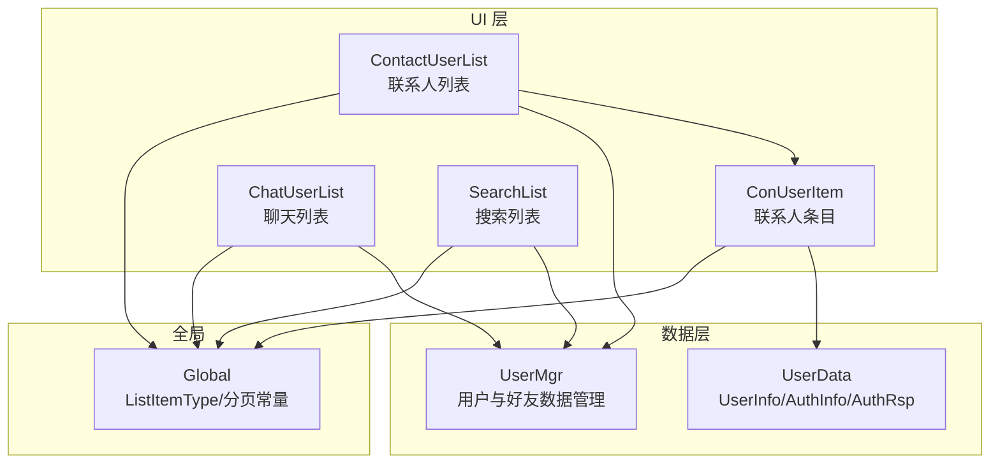
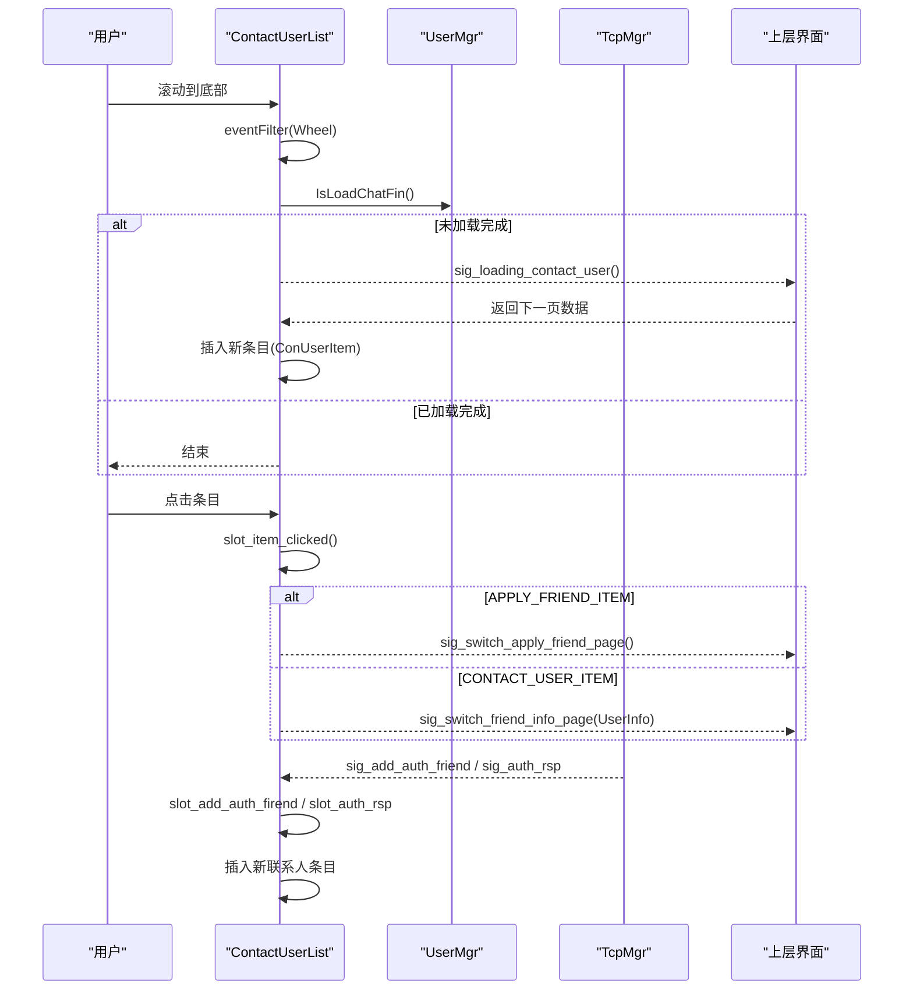
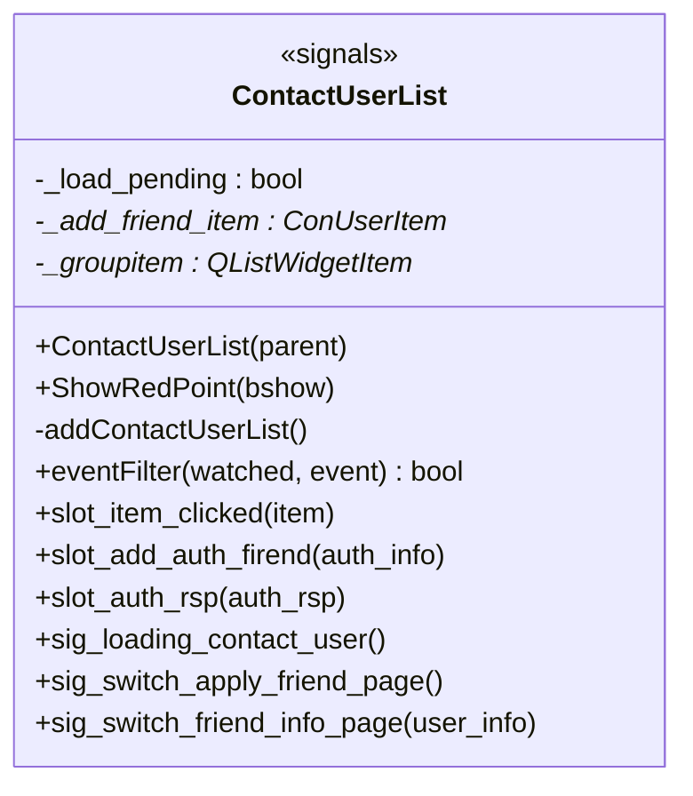
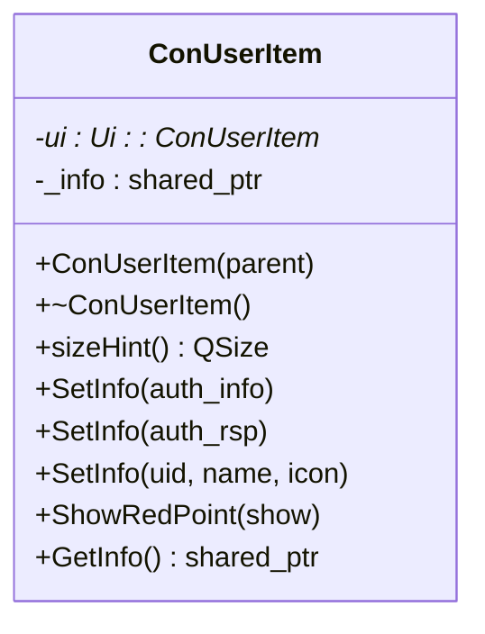
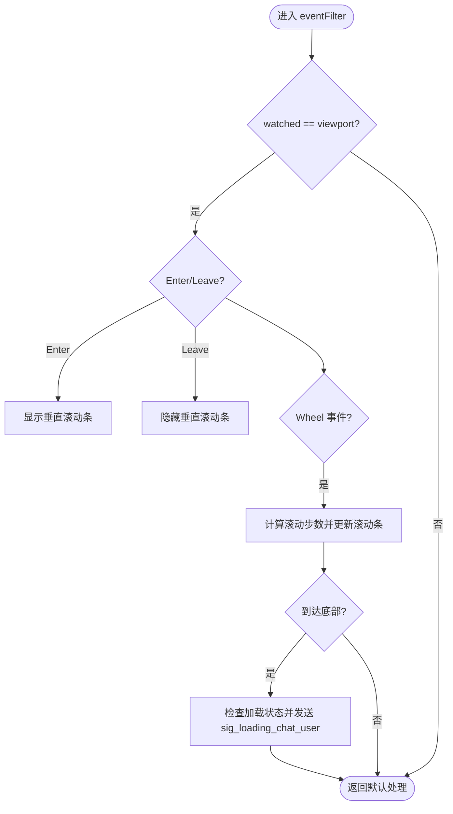
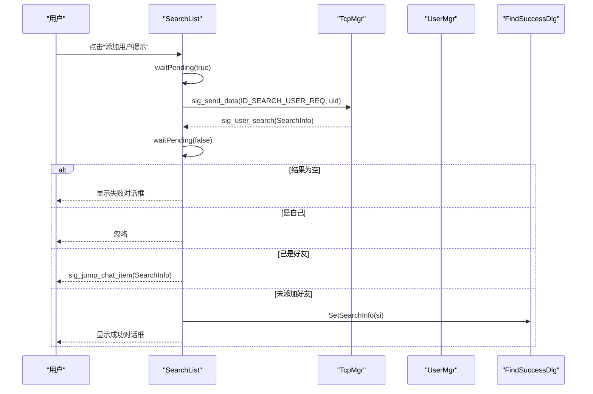
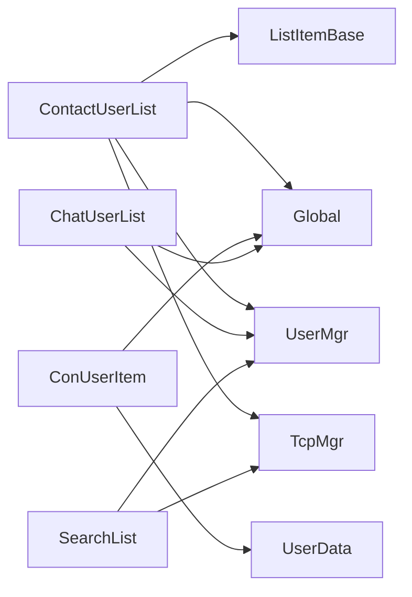

# 联系人管理

<cite>
**本文引用的文件**   
- [contactuserlist.h](file://client/llfcchat/include/contactuserlist.h)
- [contactuserlist.cpp](file://client/llfcchat/src/contactuserlist.cpp)
- [conuseritem.h](file://client/llfcchat/include/conuseritem.h)
- [conuseritem.cpp](file://client/llfcchat/src/conuseritem.cpp)
- [chatuserlist.h](file://client/llfcchat/include/chatuserlist.h)
- [chatuserlist.cpp](file://client/llfcchat/src/chatuserlist.cpp)
- [usermgr.h](file://client/llfcchat/include/usermgr.h)
- [usermgr.cpp](file://client/llfcchat/src/usermgr.cpp)
- [userdata.h](file://client/llfcchat/include/userdata.h)
- [global.h](file://client/llfcchat/include/global.h)
- [listitembase.h](file://client/llfcchat/include/listitembase.h)
- [searchlist.h](file://client/llfcchat/include/searchlist.h)
- [searchlist.cpp](file://client/llfcchat/src/searchlist.cpp)
- [conuseritem.ui](file://client/llfcchat/ui/conuseritem.ui)
</cite>

## 目录
1. [简介](#简介)
2. [项目结构](#项目结构)
3. [核心组件](#核心组件)
4. [架构总览](#架构总览)
5. [详细组件分析](#详细组件分析)
6. [依赖关系分析](#依赖关系分析)
7. [性能与内存优化](#性能与内存优化)
8. [故障排查指南](#故障排查指南)
9. [结论](#结论)
10. [附录：接口与配置](#附录接口与配置)

## 简介
本技术文档聚焦于 LLFCChat 的“联系人管理”功能，围绕 ContactUserList、ConUserItem、ChatUserList 三大类展开，系统阐述联系人列表的显示、联系人项目的渲染、滚动加载、搜索与过滤、以及与 UserMgr 的数据同步机制。文档同时给出调用关系图、数据流图、以及大数据量下的性能优化策略，帮助初学者快速上手，并为有经验的开发者提供深入的技术细节。

## 项目结构
联系人管理相关代码位于客户端模块 client/llfcchat 下，采用 Qt 框架组织：
- UI 层：ContactUserList、ChatUserList 继承自 QListWidget，负责列表展示与交互；ConUserItem 为自定义列表项 Widget，承载头像、名称、红点等元素。
- 数据层：UserMgr 作为单例集中管理好友列表、分页计数、会话映射等；UserData 定义用户信息、认证信息等数据结构。
- 全局常量与类型：Global.h 定义了 ListItemType、CHAT_COUNT_PER_PAGE 等关键枚举与常量。
- 搜索能力：SearchList 提供用户搜索入口，结果可联动跳转至聊天或联系人界面。

图表来源
- [contactuserlist.h:12-35](file://client/llfcchat/include/contactuserlist.h#L12-L35)
- [conuseritem.h:12-28](file://client/llfcchat/include/conuseritem.h#L12-L28)
- [chatuserlist.h:9-21](file://client/llfcchat/include/chatuserlist.h#L9-L21)
- [usermgr.h:12-48](file://client/llfcchat/include/usermgr.h#L12-L48)
- [userdata.h:108-142](file://client/llfcchat/include/userdata.h#L108-L142)
- [global.h:210-256](file://client/llfcchat/include/global.h#L210-L256)

章节来源
- [contactuserlist.h:12-35](file://client/llfcchat/include/contactuserlist.h#L12-L35)
- [conuseritem.h:12-28](file://client/llfcchat/include/conuseritem.h#L12-L28)
- [chatuserlist.h:9-21](file://client/llfcchat/include/chatuserlist.h#L9-L21)
- [usermgr.h:12-48](file://client/llfcchat/include/usermgr.h#L12-L48)
- [userdata.h:108-142](file://client/llfcchat/include/userdata.h#L108-L142)
- [global.h:210-256](file://client/llfcchat/include/global.h#L210-L256)

## 核心组件
- ContactUserList：联系人列表容器，负责初始化分组提示、“新的朋友”入口、联系人条目渲染、滚动到底部触发加载更多、点击事件分发（跳转到好友申请页或好友信息页）、接收认证响应动态插入新联系人。
- ConUserItem：联系人条目项，封装头像、用户名、红点显示逻辑，支持从 AuthInfo、AuthRsp、uid/name/icon 三种方式设置数据。
- ChatUserList：聊天列表容器，实现与 ContactUserList 类似的滚动条显隐与底部加载更多逻辑，通过信号通知上层加载更多聊天用户。
- UserMgr：单例数据管理器，维护好友列表、分页索引、查询是否已加载完成、添加好友、按 uid 查找等。
- SearchList：搜索列表，提供搜索输入与结果弹窗，支持跳转到聊天或联系人界面。

章节来源
- [contactuserlist.cpp:13-33](file://client/llfcchat/src/contactuserlist.cpp#L13-L33)
- [conuseritem.cpp:4-12](file://client/llfcchat/src/conuseritem.cpp#L4-L12)
- [chatuserlist.cpp:7-14](file://client/llfcchat/src/chatuserlist.cpp#L7-L14)
- [usermgr.cpp:128-167](file://client/llfcchat/src/usermgr.cpp#L128-L167)
- [searchlist.cpp:13-26](file://client/llfcchat/src/searchlist.cpp#L13-L26)

## 架构总览
联系人管理的整体流程如下：
- 初始化阶段：ContactUserList 构造时隐藏滚动条并安装事件过滤器，随后调用 addContactUserList() 构建分组提示、“新的朋友”入口、联系人条目，并从 UserMgr 获取分页数据填充列表。
- 交互阶段：鼠标滚轮事件经 eventFilter 处理，当滚动到底部且未加载完成时，触发 sig_loading_contact_user 信号，由上层负责拉取下一页数据并追加到列表。
- 点击事件：根据 ListItemType 判断条目类型，分别跳转到好友申请页面或打开好友信息页（携带 UserInfo）。
- 认证回调：TcpMgr 推送的认证请求/响应被 ContactUserList 捕获，检查是否重复后在“联系人”分组后动态插入新条目。

图表来源
- [contactuserlist.cpp:103-160](file://client/llfcchat/src/contactuserlist.cpp#L103-L160)
- [contactuserlist.cpp:162-203](file://client/llfcchat/src/contactuserlist.cpp#L162-L203)
- [contactuserlist.cpp:205-257](file://client/llfcchat/src/contactuserlist.cpp#L205-L257)
- [usermgr.cpp:185-200](file://client/llfcchat/src/usermgr.cpp#L185-L200)

章节来源
- [contactuserlist.cpp:103-160](file://client/llfcchat/src/contactuserlist.cpp#L103-L160)
- [contactuserlist.cpp:162-203](file://client/llfcchat/src/contactuserlist.cpp#L162-L203)
- [contactuserlist.cpp:205-257](file://client/llfcchat/src/contactuserlist.cpp#L205-L257)
- [usermgr.cpp:185-200](file://client/llfcchat/src/usermgr.cpp#L185-L200)

## 详细组件分析

### ContactUserList 类
- 职责：联系人列表容器，管理分组提示、新增好友入口、联系人条目渲染、滚动加载、点击事件分发、认证回调更新。
- 关键方法：
  - ShowRedPoint(bool): 控制“新的朋友”条目的红点显示。
  - addContactUserList(): 初始化分组、新增好友入口、联系人条目，并从 UserMgr 获取分页数据。
  - eventFilter(QObject*, QEvent*): 拦截滚轮事件，检测底部位置，触发加载更多信号。
  - slot_item_clicked(QListWidgetItem*): 根据条目类型执行不同动作。
  - slot_add_auth_firend(std::shared_ptr<AuthInfo>): 收到对端同意认证后插入新联系人。
  - slot_auth_rsp(std::shared_ptr<AuthRsp>): 自己同意认证后插入新联系人。
- 信号：
  - sig_loading_contact_user(): 通知上层加载下一页联系人。
  - sig_switch_apply_friend_page(): 切换到好友申请页面。
  - sig_switch_friend_info_page(std::shared_ptr<UserInfo>): 切换到好友信息页面并传递用户信息。

图表来源
- [contactuserlist.h:12-35](file://client/llfcchat/include/contactuserlist.h#L12-L35)

章节来源
- [contactuserlist.h:12-35](file://client/llfcchat/include/contactuserlist.h#L12-L35)
- [contactuserlist.cpp:13-33](file://client/llfcchat/src/contactuserlist.cpp#L13-L33)
- [contactuserlist.cpp:41-101](file://client/llfcchat/src/contactuserlist.cpp#L41-L101)
- [contactuserlist.cpp:103-160](file://client/llfcchat/src/contactuserlist.cpp#L103-L160)
- [contactuserlist.cpp:162-203](file://client/llfcchat/src/contactuserlist.cpp#L162-L203)
- [contactuserlist.cpp:205-257](file://client/llfcchat/src/contactuserlist.cpp#L205-L257)

### ConUserItem 类
- 职责：联系人条目项，渲染头像、用户名、红点，并提供多种 SetInfo 重载以适配不同数据来源。
- 关键方法：
  - sizeHint(): 返回条目尺寸（宽250，高70）。
  - SetInfo(AuthInfo|AuthRsp|uid,name,icon): 设置条目数据并渲染头像与名称。
  - ShowRedPoint(bool): 控制红点显示。
  - GetInfo(): 返回当前条目对应的 UserInfo。
- UI 布局：基于 conuseritem.ui，包含 icon_lb、red_point、user_name_lb 三个控件。

图表来源
- [conuseritem.h:12-28](file://client/llfcchat/include/conuseritem.h#L12-L28)
- [conuseritem.ui:1-122](file://client/llfcchat/ui/conuseritem.ui#L1-L122)

章节来源
- [conuseritem.h:12-28](file://client/llfcchat/include/conuseritem.h#L12-L28)
- [conuseritem.cpp:4-12](file://client/llfcchat/src/conuseritem.cpp#L4-L12)
- [conuseritem.cpp:19-22](file://client/llfcchat/src/conuseritem.cpp#L19-L22)
- [conuseritem.cpp:24-62](file://client/llfcchat/src/conuseritem.cpp#L24-L62)
- [conuseritem.cpp:64-77](file://client/llfcchat/src/conuseritem.cpp#L64-L77)
- [conuseritem.ui:1-122](file://client/llfcchat/ui/conuseritem.ui#L1-L122)

### ChatUserList 类
- 职责：聊天列表容器，实现与 ContactUserList 类似的滚动条显隐与底部加载更多逻辑，通过 sig_loading_chat_user 通知上层加载更多聊天用户。
- 关键方法：
  - eventFilter(QObject*, QEvent*): 拦截滚轮事件，检测底部位置，触发加载更多信号。

图表来源
- [chatuserlist.cpp:16-69](file://client/llfcchat/src/chatuserlist.cpp#L16-L69)

章节来源
- [chatuserlist.h:9-21](file://client/llfcchat/include/chatuserlist.h#L9-L21)
- [chatuserlist.cpp:7-14](file://client/llfcchat/src/chatuserlist.cpp#L7-L14)
- [chatuserlist.cpp:16-69](file://client/llfcchat/src/chatuserlist.cpp#L16-L69)

### 搜索与过滤（SearchList）
- 职责：提供搜索输入框与结果弹窗，支持跳转到聊天或联系人界面。
- 关键方法：
  - slot_item_clicked(QListWidgetItem*): 处理“添加用户提示”条目，发起搜索请求。
  - slot_user_search(std::shared_ptr<SearchInfo>): 处理搜索结果，若已是好友则跳转聊天，否则弹出成功对话框供后续操作。
- 与 TcpMgr 集成：通过 sig_send_data 发送 ID_SEARCH_USER_REQ 请求，接收 sig_user_search 响应。

图表来源
- [searchlist.cpp:75-122](file://client/llfcchat/src/searchlist.cpp#L75-L122)
- [searchlist.cpp:124-151](file://client/llfcchat/src/searchlist.cpp#L124-L151)

章节来源
- [searchlist.h:13-59](file://client/llfcchat/include/searchlist.h#L13-L59)
- [searchlist.cpp:13-26](file://client/llfcchat/src/searchlist.cpp#L13-L26)
- [searchlist.cpp:75-122](file://client/llfcchat/src/searchlist.cpp#L75-L122)
- [searchlist.cpp:124-151](file://client/llfcchat/src/searchlist.cpp#L124-L151)

## 依赖关系分析
- ContactUserList 依赖：
  - ListItemBase：用于条目类型识别与统一基类转换。
  - Global：ListItemType、CHAT_COUNT_PER_PAGE 等常量。
  - UserMgr：获取联系人分页数据、检查是否已加载完成、检查是否已为好友。
  - TcpMgr：接收认证相关信号。
- ConUserItem 依赖：
  - UserData：UserInfo、AuthInfo、AuthRsp 数据结构。
  - Global：ListItemType 设置条目类型。
- ChatUserList 依赖：
  - UserMgr：检查是否已加载完成。
  - Global：滚动行为与常量。
- SearchList 依赖：
  - TcpMgr：发送搜索请求与接收搜索结果。
  - UserMgr：检查是否已是好友。

图表来源
- [contactuserlist.cpp:1-11](file://client/llfcchat/src/contactuserlist.cpp#L1-L11)
- [conuseritem.cpp:1-2](file://client/llfcchat/src/conuseritem.cpp#L1-L2)
- [chatuserlist.cpp:1-5](file://client/llfcchat/src/chatuserlist.cpp#L1-L5)
- [searchlist.cpp:1-11](file://client/llfcchat/src/searchlist.cpp#L1-L11)

章节来源
- [contactuserlist.cpp:1-11](file://client/llfcchat/src/contactuserlist.cpp#L1-L11)
- [conuseritem.cpp:1-2](file://client/llfcchat/src/conuseritem.cpp#L1-L2)
- [chatuserlist.cpp:1-5](file://client/llfcchat/src/chatuserlist.cpp#L1-L5)
- [searchlist.cpp:1-11](file://client/llfcchat/src/searchlist.cpp#L1-L11)

## 性能与内存优化
- 分页加载：UserMgr 使用 _contact_loaded/_chat_loaded 记录已加载数量，每次仅返回 CHAT_COUNT_PER_PAGE（13）条数据，避免一次性加载大量数据导致卡顿。
- 滚动节流：ContactUserList/ChatUserList 在 eventFilter 中通过 _load_pending 标志位与 QTimer 延迟复位，防止频繁触发加载更多。
- 滚动条显隐：仅在鼠标进入 viewport 时显示垂直滚动条，离开时隐藏，减少视觉干扰与重绘开销。
- 条目复用与尺寸：ConUserItem 固定 sizeHint（250x70），有利于列表渲染性能；头像图片使用平滑缩放与自动缩放，避免大图导致的绘制压力。
- 内存管理：使用 std::shared_ptr 管理 UserInfo/AuthInfo/AuthRsp，避免手动释放；QListWidgetItem 与自定义 widget 成对创建与销毁，确保资源正确释放。
- 去重与校验：插入新联系人前通过 UserMgr::CheckFriendById 检查是否已存在，避免重复条目。

[本节为通用指导，不直接分析具体文件]

## 故障排查指南
- 滚动到底部无加载更多：
  - 检查 UserMgr::IsLoadChatFin() 是否返回 true（已加载完成）。
  - 确认 _load_pending 未被错误置位，导致重复拦截。
  - 验证 sig_loading_contact_user/sig_loading_chat_user 是否被上层正确连接与处理。
- 点击条目无响应：
  - 确认 itemWidget 非空且能转换为 ListItemBase。
  - 检查 ListItemType 是否为 INVALID_ITEM/GROUP_TIP_ITEM，这些类型会被忽略。
- 认证回调未插入新联系人：
  - 检查 TcpMgr 信号是否正确连接。
  - 确认 UserMgr::CheckFriendById 未误判为已存在。
- 头像显示异常：
  - 确认图片路径有效，QPixmap 加载成功。
  - 检查 ui->icon_lb 的尺寸与缩放设置。

章节来源
- [contactuserlist.cpp:103-160](file://client/llfcchat/src/contactuserlist.cpp#L103-L160)
- [contactuserlist.cpp:162-203](file://client/llfcchat/src/contactuserlist.cpp#L162-L203)
- [contactuserlist.cpp:205-257](file://client/llfcchat/src/contactuserlist.cpp#L205-L257)
- [usermgr.cpp:185-200](file://client/llfcchat/src/usermgr.cpp#L185-L200)
- [conuseritem.cpp:24-62](file://client/llfcchat/src/conuseritem.cpp#L24-L62)

## 结论
ContactUserList、ConUserItem、ChatUserList 共同构成了 LLFCChat 联系人管理的核心 UI 与交互逻辑。通过分页加载、滚动节流、条目尺寸固定、图片缩放等手段，系统在大数据量场景下保持了良好的性能与用户体验。与 UserMgr 的数据同步机制确保了联系人状态的实时性与一致性。SearchList 提供了灵活的搜索与过滤能力，进一步增强了联系人管理的易用性。

[本节为总结，不直接分析具体文件]

## 附录：接口与配置
- ContactUserList 接口
  - ShowRedPoint(bool): 控制“新的朋友”红点显示。
  - sig_loading_contact_user(): 加载更多联系人信号。
  - sig_switch_apply_friend_page(): 切换好友申请页面信号。
  - sig_switch_friend_info_page(std::shared_ptr<UserInfo>): 切换好友信息页面信号。
- ConUserItem 接口
  - SetInfo(AuthInfo|AuthRsp|uid,name,icon): 设置条目数据。
  - ShowRedPoint(bool): 控制红点显示。
  - GetInfo(): 获取 UserInfo。
- ChatUserList 接口
  - sig_loading_chat_user(): 加载更多聊天用户信号。
- UserMgr 关键方法
  - GetConListPerPage(): 获取联系人分页数据。
  - UpdateContactLoadedCount(): 更新联系人加载计数。
  - IsLoadChatFin(): 检查是否已加载完成。
  - CheckFriendById(int): 检查是否已为好友。
- Global 配置
  - ListItemType: 条目类型枚举。
  - CHAT_COUNT_PER_PAGE: 每页加载数量（13）。

章节来源
- [contactuserlist.h:16-30](file://client/llfcchat/include/contactuserlist.h#L16-L30)
- [conuseritem.h:17-24](file://client/llfcchat/include/conuseritem.h#L17-L24)
- [chatuserlist.h:12-21](file://client/llfcchat/include/chatuserlist.h#L12-L21)
- [usermgr.h:34-48](file://client/llfcchat/include/usermgr.h#L34-L48)
- [global.h:210-256](file://client/llfcchat/include/global.h#L210-L256)