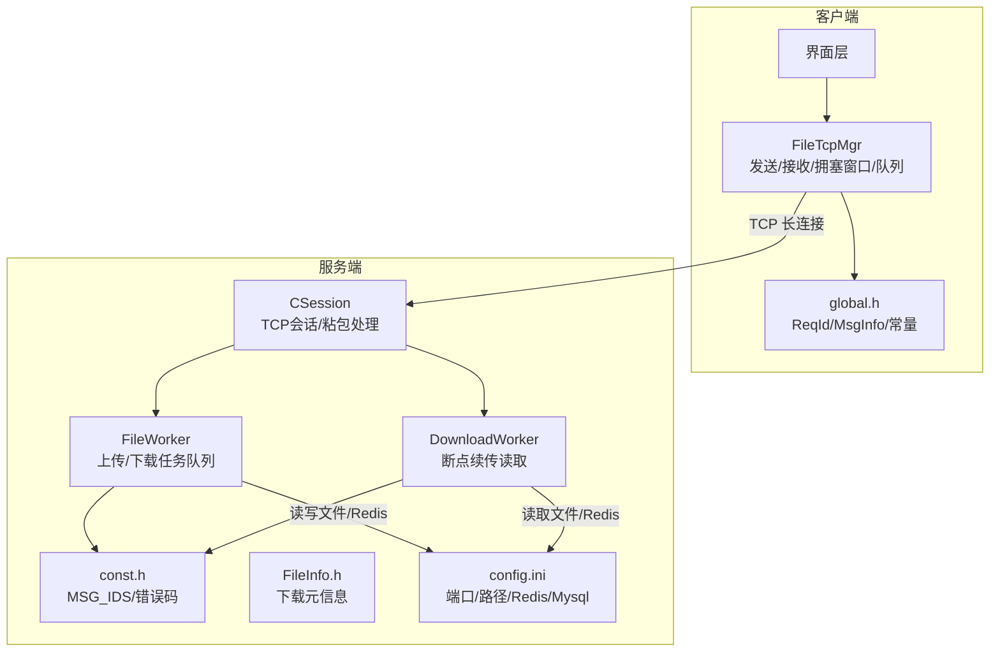
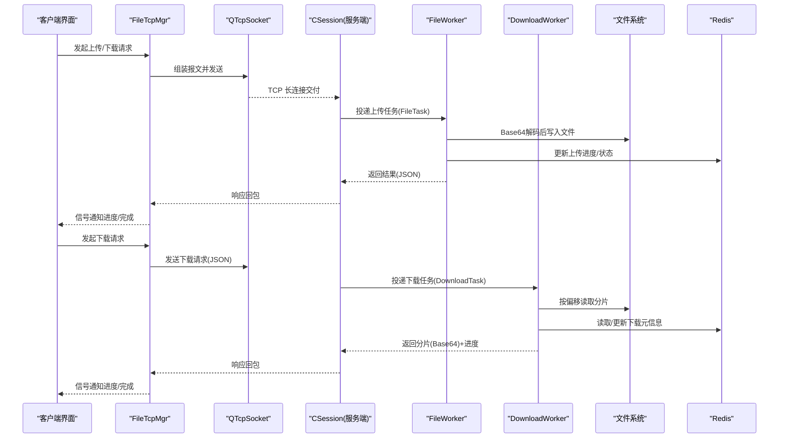
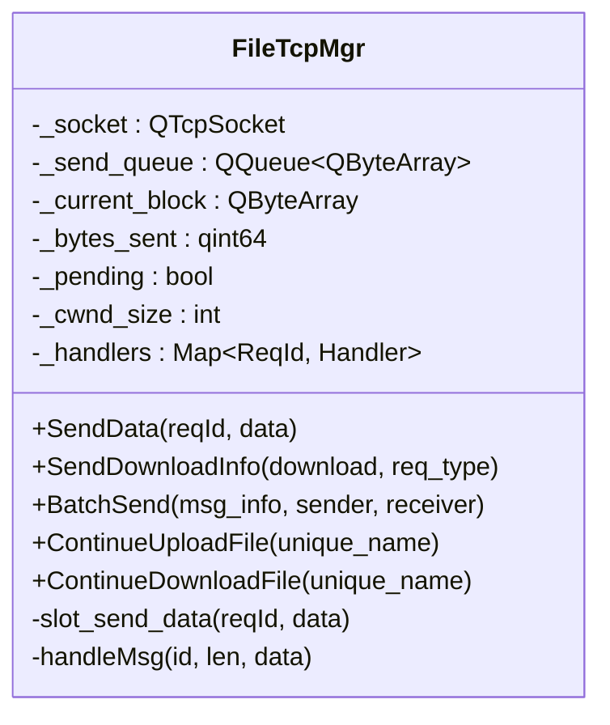
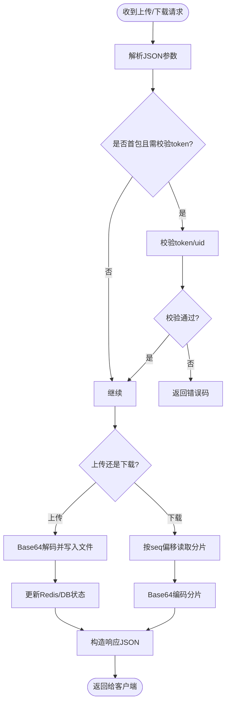
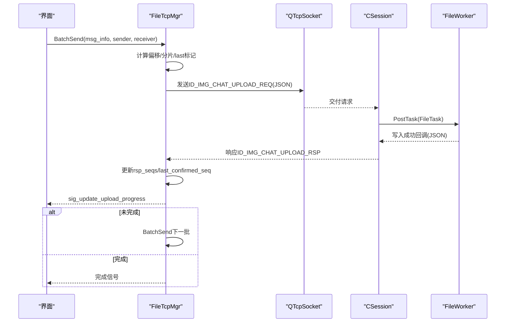
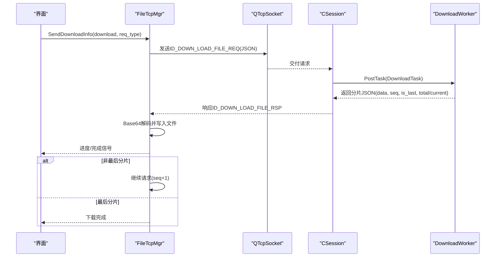
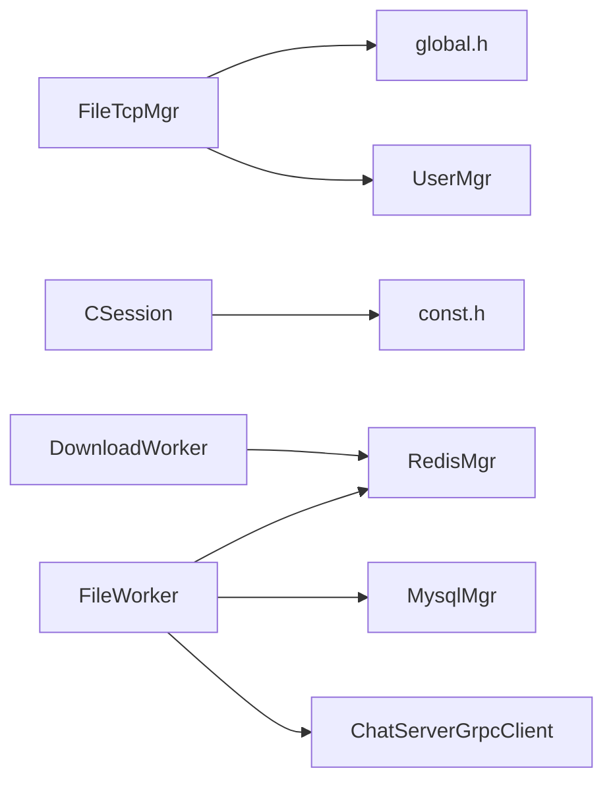

# 文件上传下载

<cite>
**本文引用的文件**   
- [filetcpmgr.h](file://client/llfcchat/include/filetcpmgr.h)
- [filetcpmgr.cpp](file://client/llfcchat/src/filetcpmgr.cpp)
- [global.h](file://client/llfcchat/include/global.h)
- [FileWorker.h](file://server/ResourceServer/include/FileWorker.h)
- [FileWorker.cpp](file://server/ResourceServer/src/FileWorker.cpp)
- [const.h](file://server/ResourceServer/include/const.h)
- [FileInfo.h](file://server/ResourceServer/include/FileInfo.h)
- [CSession.h](file://server/ResourceServer/include/CSession.h)
- [config.ini](file://server/ResourceServer/config/config.ini)
</cite>

## 目录
1. [简介](#简介)
2. [项目结构](#项目结构)
3. [核心组件](#核心组件)
4. [架构总览](#架构总览)
5. [详细组件分析](#详细组件分析)
6. [依赖关系分析](#依赖关系分析)
7. [性能与并发特性](#性能与并发特性)
8. [故障排查指南](#故障排查指南)
9. [结论](#结论)
10. [附录：协议与数据帧格式](#附录协议与数据帧格式)

## 简介
本技术文档聚焦于 LLFCChat 的文件上传/下载功能，重点解析客户端 FileTcpManager（简称 FileTcpMgr）与服务端 FileWorker 的实现机制，涵盖以下方面：
- 客户端侧 SendData、SendDownloadInfo、BatchSend、ContinueUpload/Download 等关键方法的工作原理
- 客户端与服务端的 TCP 传输协议、消息头格式、JSON 载荷字段及处理流程
- 服务端 FileWorker 对上传/下载请求的处理逻辑，包括文件读写、并发控制、错误处理与 Redis 状态管理
- 配置项、参数校验与返回值处理
- 与 TCP 连接管理的关系、连接池管理与资源释放机制
- 使用示例与事件回调说明

## 项目结构
- 客户端（Qt/C++）
  - 文件传输管理器：include/filetcpmgr.h, src/filetcpmgr.cpp
  - 全局常量与类型定义：include/global.h
- 服务端（C++/Boost.Asio）
  - 文件工作者：include/FileWorker.h, src/FileWorker.cpp
  - 会话与网络层：include/CSession.h
  - 常量与错误码：include/const.h
  - 文件信息模型：include/FileInfo.h
  - 服务配置：config/config.ini

图表来源
- [filetcpmgr.h:1-85](file://client/llfcchat/include/filetcpmgr.h#L1-L85)
- [filetcpmgr.cpp:1-1140](file://client/llfcchat/src/filetcpmgr.cpp#L1-L1140)
- [global.h:1-296](file://client/llfcchat/include/global.h#L1-L296)
- [CSession.h:1-64](file://server/ResourceServer/include/CSession.h#L1-L64)
- [FileWorker.h:1-91](file://server/ResourceServer/include/FileWorker.h#L1-L91)
- [FileWorker.cpp:1-660](file://server/ResourceServer/src/FileWorker.cpp#L1-L660)
- [const.h:1-117](file://server/ResourceServer/include/const.h#L1-L117)
- [FileInfo.h:1-26](file://server/ResourceServer/include/FileInfo.h#L1-L26)
- [config.ini:1-27](file://server/ResourceServer/config/config.ini#L1-L27)

章节来源
- [filetcpmgr.h:1-85](file://client/llfcchat/include/filetcpmgr.h#L1-L85)
- [filetcpmgr.cpp:1-1140](file://client/llfcchat/src/filetcpmgr.cpp#L1-L1140)
- [global.h:1-296](file://client/llfcchat/include/global.h#L1-L296)
- [CSession.h:1-64](file://server/ResourceServer/include/CSession.h#L1-L64)
- [FileWorker.h:1-91](file://server/ResourceServer/include/FileWorker.h#L1-L91)
- [FileWorker.cpp:1-660](file://server/ResourceServer/src/FileWorker.cpp#L1-L660)
- [const.h:1-117](file://server/ResourceServer/include/const.h#L1-L117)
- [FileInfo.h:1-26](file://server/ResourceServer/include/FileInfo.h#L1-L26)
- [config.ini:1-27](file://server/ResourceServer/config/config.ini#L1-L27)

## 核心组件
- 客户端 FileTcpMgr
  - 负责建立/维护与资源服务器的 TCP 长连接
  - 实现发送队列、拥塞窗口、粘包/半包处理、消息分发
  - 提供 Upload/Download 的批量发送、断点续传、进度更新与完成回调
- 服务端 FileWorker / DownloadWorker
  - 基于线程+队列的任务调度器，处理上传/下载 I/O
  - 支持分片写入/读取、Base64 编解码、Redis 状态持久化
  - 错误码统一返回，异常路径健壮处理

章节来源
- [filetcpmgr.h:26-82](file://client/llfcchat/include/filetcpmgr.h#L26-L82)
- [filetcpmgr.cpp:1-1140](file://client/llfcchat/src/filetcpmgr.cpp#L1-L1140)
- [FileWorker.h:59-91](file://server/ResourceServer/include/FileWorker.h#L59-L91)
- [FileWorker.cpp:1-660](file://server/ResourceServer/src/FileWorker.cpp#L1-L660)

## 架构总览
下图展示了从客户端发起上传/下载到服务端落盘或读取返回的完整调用链。

图表来源
- [filetcpmgr.cpp:1-1140](file://client/llfcchat/src/filetcpmgr.cpp#L1-L1140)
- [CSession.h:1-64](file://server/ResourceServer/include/CSession.h#L1-L64)
- [FileWorker.cpp:1-660](file://server/ResourceServer/src/FileWorker.cpp#L1-L660)

## 详细组件分析

### 客户端 FileTcpMgr 类
- 职责
  - 管理 QTcpSocket 生命周期、连接成功/失败/断开事件
  - 粘包/半包解析：固定长度头部 + JSON 载荷
  - 发送队列与拥塞窗口：避免写爆缓冲区，限制并发未确认包数
  - 消息路由：根据 ReqId 分发到对应处理器
  - 上传/下载业务封装：批量发送、断点续传、进度回调

- 关键方法与行为
  - SendData(reqId, data)：将 JSON 载荷与 ID 打包，进入发送队列
  - SendDownloadInfo(download, req_type)：构造下载请求 JSON 并发送
  - BatchSend(msg_info, sender, receiver)：按拥塞窗口批量发送分片
  - ContinueUploadFile/ContinueDownloadFile：断点续传入口
  - slot_send_data：实际写 socket，bytesWritten 回调驱动队列出队
  - readyRead：循环解析头部与载荷，handleMsg 分发

- 数据结构与复杂度
  - _send_queue：QQueue<QByteArray>，O(1) 入队/出队
  - _current_block/_bytes_sent/_pending：单次发送状态，O(1)
  - _cwnd_size：拥塞窗口计数，限流 O(1)
  - handleMsg：哈希表查找处理器 O(1)

图表来源
- [filetcpmgr.h:26-82](file://client/llfcchat/include/filetcpmgr.h#L26-L82)
- [filetcpmgr.cpp:186-241](file://client/llfcchat/src/filetcpmgr.cpp#L186-L241)
- [filetcpmgr.cpp:925-996](file://client/llfcchat/src/filetcpmgr.cpp#L925-L996)

章节来源
- [filetcpmgr.h:1-85](file://client/llfcchat/include/filetcpmgr.h#L1-L85)
- [filetcpmgr.cpp:1-1140](file://client/llfcchat/src/filetcpmgr.cpp#L1-L1140)
- [global.h:16-24](file://client/llfcchat/include/global.h#L16-L24)

### 服务端 FileWorker / DownloadWorker
- 职责
  - FileWorker：处理上传相关请求（头像、聊天图片、通用文件），Base64 解码后写入磁盘，必要时更新数据库/Redis，并通过 gRPC 通知 ChatServer
  - DownloadWorker：处理下载请求，按 seq 偏移读取分片，Base64 编码返回，维护 Redis 中的下载进度

- 并发模型
  - 每个 Worker 持有独立线程与任务队列，互斥锁保护队列访问
  - 条件变量唤醒工作线程，析构时安全停止

- 关键流程
  - 上传：解码 -> 创建/追加文件 -> 关闭 -> 回调返回 JSON
  - 下载：校验存在性 -> 计算偏移 -> 读取分片 -> Base64 编码 -> 更新 Redis -> 回调返回 JSON

图表来源
- [FileWorker.cpp:46-455](file://server/ResourceServer/src/FileWorker.cpp#L46-L455)
- [FileWorker.cpp:525-660](file://server/ResourceServer/src/FileWorker.cpp#L525-L660)

章节来源
- [FileWorker.h:15-91](file://server/ResourceServer/include/FileWorker.h#L15-L91)
- [FileWorker.cpp:1-660](file://server/ResourceServer/src/FileWorker.cpp#L1-L660)

### 客户端上传/下载流程时序

#### 上传流程（含断点续传）

图表来源
- [filetcpmgr.cpp:925-996](file://client/llfcchat/src/filetcpmgr.cpp#L925-L996)
- [filetcpmgr.cpp:521-608](file://client/llfcchat/src/filetcpmgr.cpp#L521-L608)
- [FileWorker.cpp:196-280](file://server/ResourceServer/src/FileWorker.cpp#L196-L280)

#### 下载流程（含断点续传）

图表来源
- [filetcpmgr.cpp:1111-1125](file://client/llfcchat/src/filetcpmgr.cpp#L1111-L1125)
- [filetcpmgr.cpp:334-433](file://client/llfcchat/src/filetcpmgr.cpp#L334-L433)
- [FileWorker.cpp:525-660](file://server/ResourceServer/src/FileWorker.cpp#L525-L660)

章节来源
- [filetcpmgr.cpp:1-1140](file://client/llfcchat/src/filetcpmgr.cpp#L1-L1140)
- [FileWorker.cpp:1-660](file://server/ResourceServer/src/FileWorker.cpp#L1-L660)

### 客户端消息处理与粘包/半包
- 接收缓冲 _buffer 累积数据
- 先解析固定长度的头部（ID 2字节 + 长度 4字节 = 6字节）
- 若不足则等待；达到长度后提取载荷，调用 handleMsg 分发
- bytesWritten 回调驱动发送队列出队，保证顺序发送

章节来源
- [filetcpmgr.cpp:16-55](file://client/llfcchat/src/filetcpmgr.cpp#L16-L55)
- [filetcpmgr.cpp:106-132](file://client/llfcchat/src/filetcpmgr.cpp#L106-L132)
- [filetcpmgr.cpp:175-184](file://client/llfcchat/src/filetcpmgr.cpp#L175-L184)

### 服务端会话与网络层
- CSession 负责异步读/写、粘包处理、消息派发至 LogicSystem/FileSystem
- 使用 Boost.Asio 的 io_context 模型，具备高并发能力

章节来源
- [CSession.h:1-64](file://server/ResourceServer/include/CSession.h#L1-L64)

## 依赖关系分析
- 客户端
  - FileTcpMgr 依赖 global.h 中的 ReqId、MsgInfo、常量（MAX_FILE_LEN、MAX_CWND_SIZE）
  - 依赖 UserMgr（获取 uid/token、管理待上传/下载文件集合）
- 服务端
  - FileWorker/DownloadWorker 依赖 const.h 的错误码与 MSG_IDS
  - 依赖 RedisMgr（存储下载元信息、用户 token/IP）、MysqlMgr（更新头像/状态）、ChatServerGrpcClient（通知聊天服务器）
  - 依赖 ConfigMgr（输出路径、服务地址）

图表来源
- [filetcpmgr.cpp:1-1140](file://client/llfcchat/src/filetcpmgr.cpp#L1-L1140)
- [global.h:1-296](file://client/llfcchat/include/global.h#L1-L296)
- [FileWorker.cpp:1-660](file://server/ResourceServer/src/FileWorker.cpp#L1-L660)
- [const.h:1-117](file://server/ResourceServer/include/const.h#L1-L117)

章节来源
- [filetcpmgr.cpp:1-1140](file://client/llfcchat/src/filetcpmgr.cpp#L1-L1140)
- [global.h:1-296](file://client/llfcchat/include/global.h#L1-L296)
- [FileWorker.cpp:1-660](file://server/ResourceServer/src/FileWorker.cpp#L1-L660)
- [const.h:1-117](file://server/ResourceServer/include/const.h#L1-L117)

## 性能与并发特性
- 客户端拥塞窗口
  - 通过 _cwnd_size 限制未确认分片数量，避免写爆内核缓冲区
  - 每次响应回调中 _cwnd_size--，确保稳定吞吐
- 发送队列
  - 使用 QQueue 串行化发送，bytesWritten 回调驱动出队，避免阻塞
- 服务端多线程
  - FileWorker/DownloadWorker 各自线程处理 I/O，降低阻塞
  - Redis 缓存下载元信息，减少重复 IO 与状态丢失风险
- 分片大小
  - MAX_FILE_LEN=32KB，平衡内存占用与网络效率

章节来源
- [filetcpmgr.cpp:925-996](file://client/llfcchat/src/filetcpmgr.cpp#L925-L996)
- [filetcpmgr.cpp:106-132](file://client/llfcchat/src/filetcpmgr.cpp#L106-L132)
- [FileWorker.cpp:480-513](file://server/ResourceServer/src/FileWorker.cpp#L480-L513)
- [global.h:22-24](file://client/llfcchat/include/global.h#L22-L24)
- [const.h:114](file://server/ResourceServer/include/const.h#L114)

## 故障排查指南
- 连接问题
  - 检查 host/port 配置是否正确（config.ini）
  - 关注 QTcpSocket::error 信号，区分拒绝、超时、主机不存在等
- 粘包/半包
  - 确认头部长度一致（6字节），body 长度与实际匹配
  - 调试 _buffer 累积与移除逻辑
- 上传失败
  - 检查权限（FileWritePermissionFailed）、路径创建（CreateFilePathFailed）
  - 校验 token/uid（TokenInvalid/UidInvalid）
- 下载失败
  - 文件不存在（FileNotExists）、读取权限（FileReadPermissionFailed）
  - 序列号不匹配（FileSeqInvalid）、偏移越界（FileOffsetInvalid）
- 进度卡住
  - 检查拥塞窗口是否被占满（_cwnd_size）
  - 确认响应回调是否触发（_cwnd_size--）

章节来源
- [filetcpmgr.cpp:65-93](file://client/llfcchat/src/filetcpmgr.cpp#L65-L93)
- [FileWorker.cpp:64-109](file://server/ResourceServer/src/FileWorker.cpp#L64-L109)
- [const.h:5-29](file://server/ResourceServer/include/const.h#L5-L29)
- [config.ini:1-27](file://server/ResourceServer/config/config.ini#L1-L27)

## 结论
LLFCChat 的文件传输模块在客户端采用拥塞窗口与发送队列保障稳定性，在服务端以多线程 Worker 提升 I/O 吞吐，结合 Redis 实现断点续传与状态一致性。整体设计清晰、可扩展性强，适合大文件与高并发场景。

## 附录：协议与数据帧格式
- TCP 帧头部
  - 消息 ID：2 字节（BigEndian）
  - 消息体长度：4 字节（BigEndian）
  - 总头部长度：6 字节
- 消息体
  - 使用 JSON 文本，包含业务字段（如 name、seq、total_size、trans_size、data、last、token、uid、sender_id、receiver_id、message_id 等）
- 常用 ReqId/MSG_IDS
  - 上传/下载/续传/同步等 ID 定义见 global.h 与 const.h

章节来源
- [global.h:16-24](file://client/llfcchat/include/global.h#L16-L24)
- [global.h:43-88](file://client/llfcchat/include/global.h#L43-L88)
- [const.h:72-95](file://server/ResourceServer/include/const.h#L72-L95)
- [filetcpmgr.cpp:16-55](file://client/llfcchat/src/filetcpmgr.cpp#L16-L55)