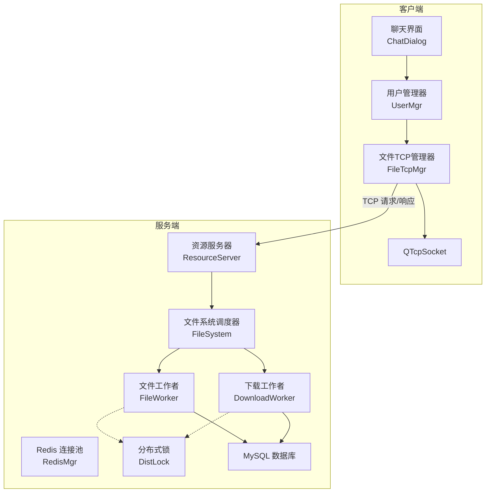
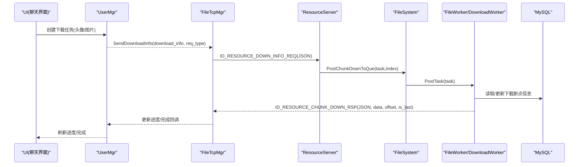
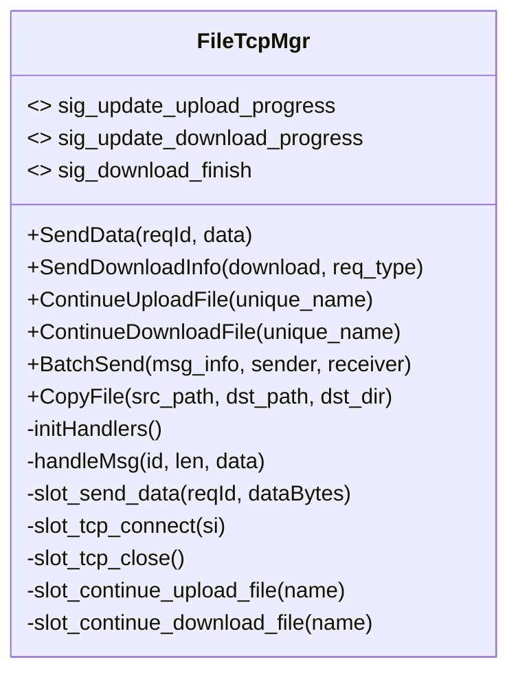
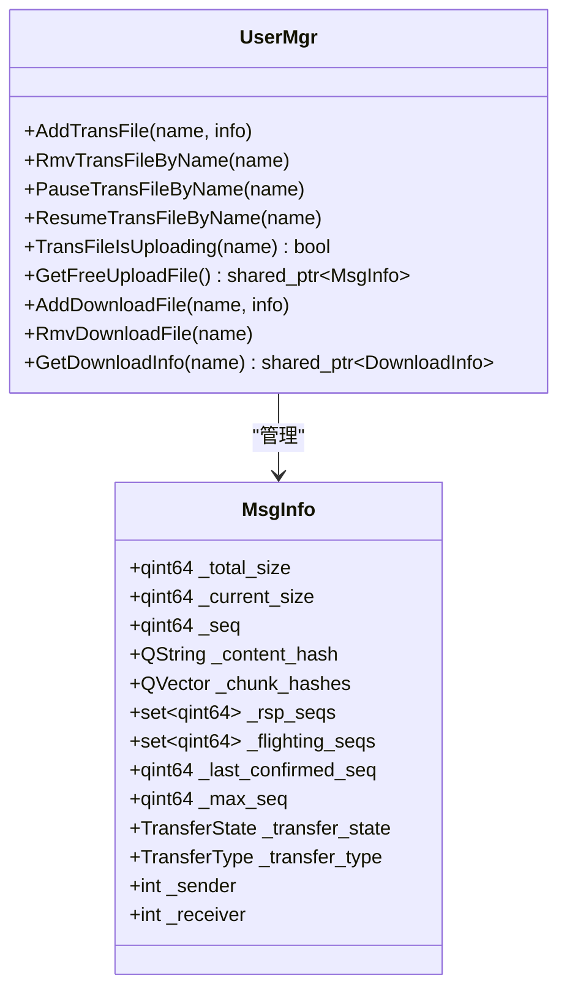
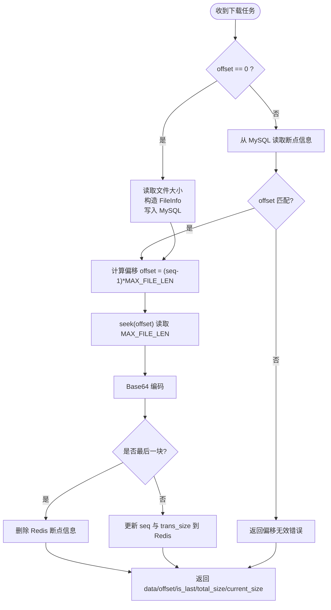
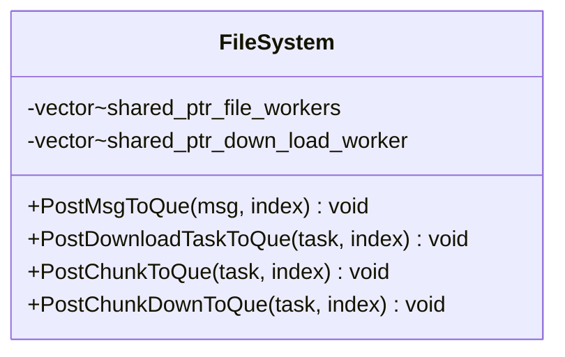
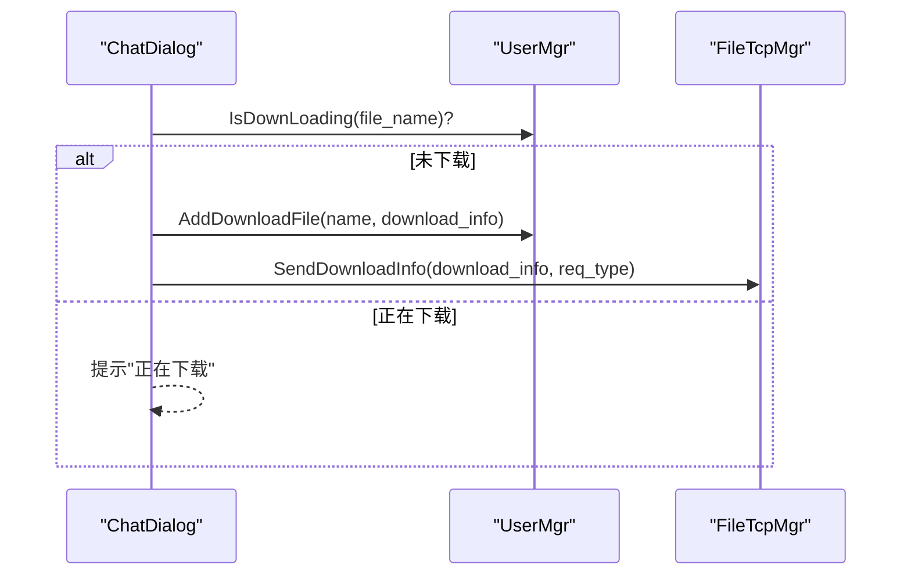
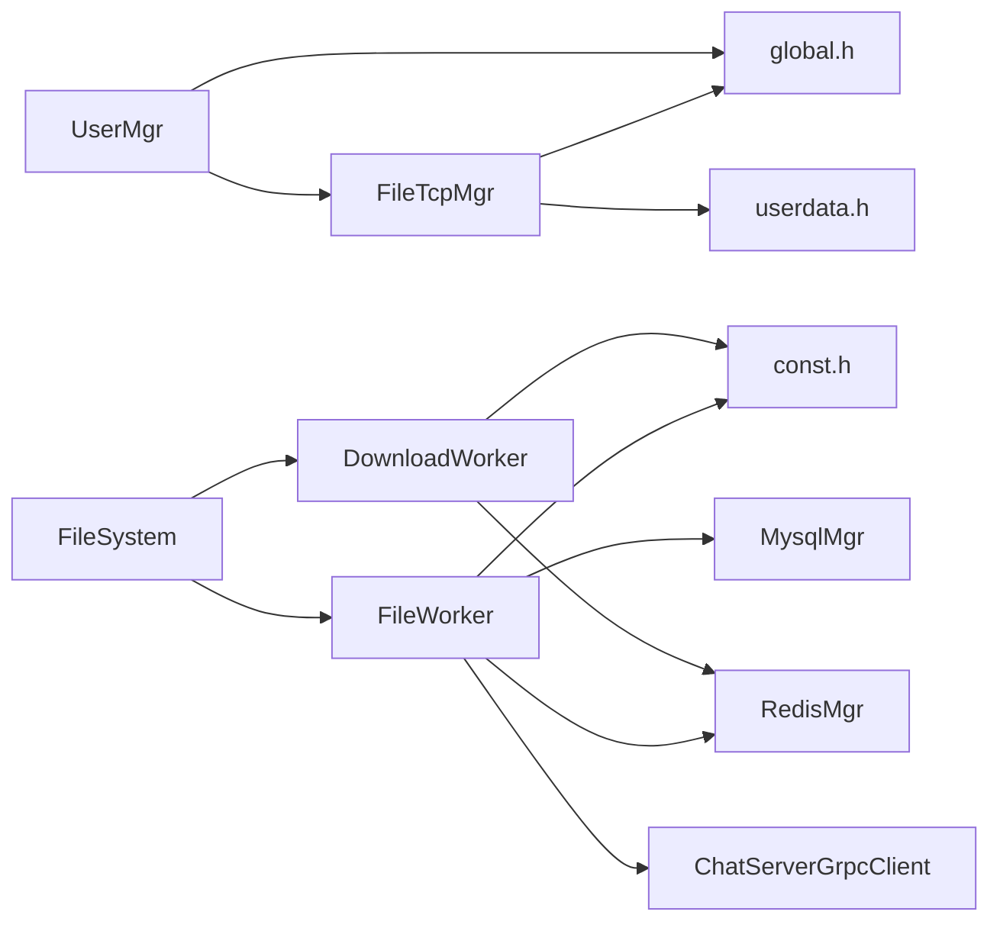

# 文件传输系统

<cite>
**本文引用的文件**   
- [filetcpmgr.h](file://client/llfcchat/include/filetcpmgr.h)
- [filetcpmgr.cpp](file://client/llfcchat/src/filetcpmgr.cpp)
- [global.h](file://client/llfcchat/include/global.h)
- [userdata.h](file://client/llfcchat/include/userdata.h)
- [usermgr.cpp](file://client/llfcchat/src/usermgr.cpp)
- [chatdialog.cpp](file://client/llfcchat/src/chatdialog.cpp)
- [FileWorker.h](file://server/ResourceServer/include/FileWorker.h)
- [FileWorker.cpp](file://server/ResourceServer/src/FileWorker.cpp)
- [FileSystem.h](file://server/ResourceServer/include/FileSystem.h)
- [FileSystem.cpp](file://server/ResourceServer/src/FileSystem.cpp)
- [FileInfo.h](file://server/ResourceServer/include/FileInfo.h)
- [RedisMgr.h](file://server/ResourceServer/include/RedisMgr.h)
- [DistLock.h](file://server/ResourceServer/include/DistLock.h)
- [const.h](file://server/ResourceServer/include/const.h)
</cite>

## 更新摘要
**所做更改**
- 移除了旧的ID_UPLOAD_FILE、ID_SYNC_FILE等遗留协议(1001-1006)，采用新的统一资源传输协议
- 新增32KB分片传输机制，支持SHA-256完整性验证
- 更新了客户端和服务端的文件传输架构，实现统一的资源消息处理
- 增强了断点续传和进度显示功能

## 目录
1. [简介](#简介)
2. [项目结构](#项目结构)
3. [核心组件](#核心组件)
4. [架构总览](#架构总览)
5. [详细组件分析](#详细组件分析)
6. [依赖关系分析](#依赖关系分析)
7. [性能与并发控制](#性能与并发控制)
8. [故障排查指南](#故障排查指南)
9. [结论](#结论)
10. [附录：接口与数据模型](#附录接口与数据模型)

## 简介
本文件为 LLFCChat 文件传输系统的功能与技术文档，覆盖客户端与服务端在文件上传、下载、断点续传、进度显示等方面的实现细节。重点说明调用关系、协议字段、领域模型与使用模式，并结合实际代码路径给出示例引用。系统现已升级为统一的资源传输协议，采用32KB分块传输（Base64编码）、服务端工作线程池与MySQL持久化状态，支持大文件分块、并发控制、断点续传与暂停/恢复，并引入SHA-256完整性验证确保数据传输安全。

## 项目结构
- 客户端（Qt）
  - 文件传输网络层与状态管理：FileTcpMgr、UserMgr、全局常量与数据结构
  - UI 触发下载头像等场景：ChatDialog
- 服务端（C++，ResourceServer）
  - 文件处理工作线程：FileWorker、DownloadWorker
  - 任务分发器：FileSystem
  - 分布式锁与 Redis 连接池：DistLock、RedisMgr
  - 协议与错误码：const.h
  - 下载元信息：FileInfo

**图示来源** 
- [filetcpmgr.cpp:1-143](file://client/llfcchat/src/filetcpmgr.cpp#L1-L143)
- [FileWorker.h:1-164](file://server/ResourceServer/include/FileWorker.h#L1-L164)
- [FileSystem.h:1-20](file://server/ResourceServer/include/FileSystem.h#L1-L20)
- [RedisMgr.h:1-313](file://server/ResourceServer/include/RedisMgr.h#L1-L313)
- [DistLock.h:1-18](file://server/ResourceServer/include/DistLock.h#L1-L18)

**章节来源**
- [filetcpmgr.h:1-118](file://client/llfcchat/include/filetcpmgr.h#L1-L118)
- [filetcpmgr.cpp:1-143](file://client/llfcchat/src/filetcpmgr.cpp#L1-L143)
- [global.h:1-314](file://client/llfcchat/include/global.h#L1-L314)
- [FileWorker.h:1-164](file://server/ResourceServer/include/FileWorker.h#L1-L164)
- [FileSystem.h:1-20](file://server/ResourceServer/include/FileSystem.h#L1-L20)
- [RedisMgr.h:1-313](file://server/ResourceServer/include/RedisMgr.h#L1-L313)
- [DistLock.h:1-18](file://server/ResourceServer/include/DistLock.h#L1-L18)

## 核心组件
- FileTcpMgr（客户端）
  - 负责建立与 ResourceServer 的 TCP 连接、粘包/拆包解析、发送队列与拥塞窗口控制、消息路由与回调处理、上传/下载流程编排、断点续传与进度更新信号。
  - 支持新的统一资源传输协议，包括32KB分片传输和SHA-256验证。
- UserMgr（客户端）
  - 维护上传/下载/传输中的文件元数据与状态（如 MsgInfo），提供暂停/恢复、查询与清理能力。
  - 新增对资源消息的支持，包括content_hash和chunk_hashes字段。
- FileWorker / DownloadWorker（服务端）
  - 基于线程池的任务队列，分别处理上传与下载任务；下载侧通过 MySQL 维护断点信息，按 offset 偏移读取并 Base64 返回。
  - 实现了新的资源分片处理逻辑，支持message_id路由和SHA-256验证。
- FileSystem（服务端）
  - 将任务分发到多个 FileWorker/DownloadWorker 实例，实现水平扩展与负载均衡。
  - 新增资源分片任务的专用处理方法。
- RedisMgr / DistLock（服务端）
  - 提供连接池、键值存取、分布式锁获取/释放，用于下载断点状态与并发访问保护。

**章节来源**
- [filetcpmgr.h:1-118](file://client/llfcchat/include/filetcpmgr.h#L1-L118)
- [filetcpmgr.cpp:1-143](file://client/llfcchat/src/filetcpmgr.cpp#L1-L143)
- [usermgr.cpp:375-528](file://client/llfcchat/src/usermgr.cpp#L375-L528)
- [FileWorker.h:1-164](file://server/ResourceServer/include/FileWorker.h#L1-L164)
- [FileSystem.h:1-20](file://server/ResourceServer/include/FileSystem.h#L1-L20)
- [RedisMgr.h:1-313](file://server/ResourceServer/include/RedisMgr.h#L1-L313)
- [DistLock.h:1-18](file://server/ResourceServer/include/DistLock.h#L1-L18)

## 架构总览
- 客户端发起上传/下载请求，经 FileTcpMgr 封装为 JSON 报文并通过 TCP 发送。
- 服务端由 FileSystem 选择具体 Worker，FileWorker 解码 Base64 写入磁盘；DownloadWorker 根据 offset 和 MySQL 中的断点信息定位偏移量读取数据并返回。
- 下载断点状态保存在 MySQL，确保进程重启或网络中断后可恢复。
- 分布式锁用于关键临界区保护（例如写文件、更新状态）。
- 新增的统一资源传输协议支持32KB分片和SHA-256验证，提供更可靠的数据传输保障。

**图示来源** 
- [filetcpmgr.cpp:860-893](file://client/llfcchat/src/filetcpmgr.cpp#L860-L893)
- [FileWorker.cpp:272-400](file://server/ResourceServer/src/FileWorker.cpp#L272-L400)
- [FileSystem.cpp:1-28](file://server/ResourceServer/src/FileSystem.cpp#L1-L28)
- [RedisMgr.h:269-313](file://server/ResourceServer/include/RedisMgr.h#L269-L313)

## 详细组件分析

### 客户端：FileTcpMgr
- 职责
  - TCP 连接生命周期管理、粘包/拆包解析（固定头长度 + 长度字段）、发送队列与拥塞窗口控制。
  - 注册消息处理器，统一 handleMsg 分发。
  - 上传流程：组织分块 JSON（message_id、offset、chunk_sha256、data等），等待服务器回包后继续下一块。
  - 下载流程：发起下载请求，接收 Base64 数据并写入本地文件，按 offset 追加，最后通知完成。
  - 断点续传：根据 server_offset 与本地 .part 文件大小计算已确认序列，必要时重发未确认块。
  - 进度信号：sig_update_upload_progress、sig_update_download_progress、sig_download_finish。
- 关键方法
  - SendData、SendDownloadInfo、ContinueUploadFile、ContinueDownloadFile、BatchSend、CopyFile
- 重要字段
  - _send_queue、_current_block、_bytes_sent、_pending、_cwnd_size、_handlers

**图示来源** 
- [filetcpmgr.h:26-118](file://client/llfcchat/include/filetcpmgr.h#L26-L118)
- [filetcpmgr.cpp:186-241](file://client/llfcchat/src/filetcpmgr.cpp#L186-L241)

**章节来源**
- [filetcpmgr.h:1-118](file://client/llfcchat/include/filetcpmgr.h#L1-L118)
- [filetcpmgr.cpp:1-143](file://client/llfcchat/src/filetcpmgr.cpp#L1-L143)
- [filetcpmgr.cpp:243-899](file://client/llfcchat/src/filetcpmgr.cpp#L243-L899)

### 客户端：UserMgr 与 MsgInfo
- 职责
  - 维护上传/下载/传输中的文件元数据与状态，提供暂停/恢复、查询与清理。
  - 与 UI 交互，更新进度条与完成状态。
- 关键数据结构
  - MsgInfo：包含 total_size、current_size、seq、content_hash、chunk_hashes、rsp_seqs、flighting_seqs、last_confirmed_seq、max_seq、transfer_state、transfer_type、sender/receiver 等。
  - DownloadInfo：name、total_size、current_size、seq、client_path。
- 关键方法
  - AddTransFile、RmvTransFileByName、PauseTransFileByName、ResumeTransFileByName、TransFileIsUploading、GetFreeUploadFile、AddDownloadFile、RmvDownloadFile、GetDownloadInfo

**图示来源** 
- [global.h:186-219](file://client/llfcchat/include/global.h#L186-L219)
- [usermgr.cpp:375-528](file://client/llfcchat/src/usermgr.cpp#L375-L528)

**章节来源**
- [global.h:186-219](file://client/llfcchat/include/global.h#L186-L219)
- [usermgr.cpp:375-528](file://client/llfcchat/src/usermgr.cpp#L375-L528)

### 服务端：FileWorker / DownloadWorker
- 职责
  - FileWorker：处理上传类请求（头像、聊天图片、通用文件），Base64 解码后按 offset 写入磁盘，最后一个包时更新数据库状态并通过 gRPC 通知 ChatServer。
  - DownloadWorker：按 offset 从指定偏移读取文件，Base64 编码后返回；首次下载初始化 FileInfo 并写入 MySQL，后续续传从 MySQL 读取断点信息校验 offset 与偏移。
- 关键点
  - 使用条件变量与互斥量实现线程安全任务队列。
  - 错误码统一返回，便于客户端判断。
  - 下载完成后删除 Redis 中的断点信息。
  - 新增资源分片处理逻辑，支持message_id路由和SHA-256验证。

**图示来源** 
- [FileWorker.cpp:272-400](file://server/ResourceServer/src/FileWorker.cpp#L272-L400)
- [RedisMgr.h:303-313](file://server/ResourceServer/include/RedisMgr.h#L303-L313)

**章节来源**
- [FileWorker.h:1-164](file://server/ResourceServer/include/FileWorker.h#L1-L164)
- [FileWorker.cpp:1-774](file://server/ResourceServer/src/FileWorker.cpp#L1-L774)

### 服务端：FileSystem
- 职责
  - 维护多实例 FileWorker 与 DownloadWorker，按 index 分发任务，实现水平扩展。
  - 新增资源分片任务的专用处理方法。
- 关键点
  - 构造函数中初始化固定数量的工作线程实例。
  - PostMsgToQue / PostDownloadTaskToQue / PostChunkToQue / PostChunkDownToQue 将任务投递到对应 worker。

**图示来源** 
- [FileSystem.h:1-20](file://server/ResourceServer/include/FileSystem.h#L1-L20)
- [FileSystem.cpp:1-28](file://server/ResourceServer/src/FileSystem.cpp#L1-L28)

**章节来源**
- [FileSystem.h:1-20](file://server/ResourceServer/include/FileSystem.h#L1-L20)
- [FileSystem.cpp:1-28](file://server/ResourceServer/src/FileSystem.cpp#L1-L28)

### 客户端：下载入口（头像）
- 入口逻辑
  - ChatDialog 检查是否正在下载，若否则创建 DownloadInfo 并加入 UserMgr，然后调用 FileTcpMgr::SendDownloadInfo 发起下载。
- 关键点
  - req_type 区分不同用途（如 self_icon、other_icon），影响完成后的 UI 刷新行为。

**图示来源** 
- [chatdialog.cpp:1189-1207](file://client/llfcchat/src/chatdialog.cpp#L1189-L1207)

**章节来源**
- [chatdialog.cpp:1189-1207](file://client/llfcchat/src/chatdialog.cpp#L1189-L1207)

## 依赖关系分析
- 客户端
  - FileTcpMgr 依赖 global.h（ReqId、ErrorCodes、MsgInfo、TransferState、MAX_FILE_LEN 等）与 userdata.h（ImgChatData、ChatThreadData 等）。
  - UserMgr 管理 MsgInfo 与 DownloadInfo，与 UI 交互。
- 服务端
  - FileWorker/DownloadWorker 依赖 const.h（MSG_TYPES、ErrorCodes、MAX_FILE_LEN）、RedisMgr（断点状态）、MysqlMgr（更新状态）、ChatServerGrpcClient（通知）。
  - FileSystem 聚合多个 Worker 实例。
  - DistLock 提供分布式锁能力（可用于关键临界区保护）。

**图示来源** 
- [filetcpmgr.cpp:1-143](file://client/llfcchat/src/filetcpmgr.cpp#L1-L143)
- [global.h:1-314](file://client/llfcchat/include/global.h#L1-L314)
- [FileWorker.cpp:1-774](file://server/ResourceServer/src/FileWorker.cpp#L1-L774)
- [RedisMgr.h:1-313](file://server/ResourceServer/include/RedisMgr.h#L1-L313)
- [const.h:1-126](file://server/ResourceServer/include/const.h#L1-L126)

**章节来源**
- [filetcpmgr.cpp:1-143](file://client/llfcchat/src/filetcpmgr.cpp#L1-L143)
- [global.h:1-314](file://client/llfcchat/include/global.h#L1-L314)
- [FileWorker.cpp:1-774](file://server/ResourceServer/src/FileWorker.cpp#L1-L774)
- [RedisMgr.h:1-313](file://server/ResourceServer/include/RedisMgr.h#L1-L313)
- [const.h:1-126](file://server/ResourceServer/include/const.h#L1-L126)

## 性能与并发控制
- 客户端拥塞窗口
  - 使用 _cwnd_size 控制并发发送块数量，避免拥塞；每次收到上传响应后递减，再批量发送下一批。
- 发送队列
  - 使用 QQueue 缓存待发送块，bytesWritten 回调驱动出队与继续发送。
- 服务端线程池
  - FileWorker/DownloadWorker 各自独立线程与任务队列，互不阻塞；通过 FileSystem 的多实例提升吞吐。
- 断点续传
  - 下载侧以 MySQL 存储 FileInfo（seq、trans_size、total_size、file_path_str），保证跨进程/重启恢复。
- 分块大小
  - MAX_FILE_LEN 定义分块大小（默认 32KB），平衡网络与内存占用。
- SHA-256验证
  - 新增整文件和分片的SHA-256验证，确保数据传输的完整性和安全性。

## 故障排查指南
- 常见问题
  - 连接失败：检查 Host/Port、防火墙、服务是否启动。
  - 下载进度不更新：确认 ID_RESOURCE_CHUNK_DOWN_RSP 处理逻辑是否被调用，检查 offset 与 is_last 字段。
  - 断点续传失败：检查 MySQL 中是否存在断点信息，确认 offset 是否一致。
  - 上传卡住：检查拥塞窗口 _cwnd_size 与 BatchSend 逻辑，确认服务器回包是否正常。
  - 权限问题：服务端写文件失败（FileWritePermissionFailed）或读文件失败（FileReadPermissionFailed）。
  - SHA-256验证失败：检查分片或整文件的SHA-256哈希是否匹配。
- 定位建议
  - 查看 FileTcpMgr 的 readyRead/error/disconnected 回调日志。
  - 检查 FileWorker/DownloadWorker 的错误码与日志输出。
  - 验证 MySQL 键值与过期策略。

**章节来源**
- [filetcpmgr.cpp:64-99](file://client/llfcchat/src/filetcpmgr.cpp#L64-L99)
- [FileWorker.cpp:272-400](file://server/ResourceServer/src/FileWorker.cpp#L272-L400)
- [const.h:6-35](file://server/ResourceServer/include/const.h#L6-L35)

## 结论
LLFCChat 的文件传输系统通过客户端 FileTcpMgr 与服务端 FileWorker/DownloadWorker 的协作，实现了稳定可靠的大文件分块传输、断点续传与进度反馈。现已升级为统一的资源传输协议，支持32KB分片和SHA-256验证，借助 MySQL 的状态持久化与分布式锁，系统在异常恢复与并发控制方面具备良好鲁棒性。建议在后续迭代中完善超时重传机制与更细粒度的拥塞控制策略，进一步提升稳定性与吞吐。

## 附录：接口与数据模型

### 协议字段（上传/下载）
- 上传请求（ID_RESOURCE_CHUNK_UPLOAD_REQ）
  - message_id：消息ID
  - offset：分片偏移量
  - chunk_sha256：分片SHA-256哈希
  - data：Base64编码的分块数据
- 上传响应（ID_RESOURCE_CHUNK_UPLOAD_RSP）
  - error：错误码
  - message_id：消息ID
  - server_offset：服务端确认的偏移量
  - resource_status：资源状态
- 下载请求（ID_RESOURCE_DOWN_INFO_REQ）
  - message_id：消息ID
- 下载响应（ID_RESOURCE_CHUNK_DOWN_RSP）
  - data：Base64编码的分块数据
  - offset：分片偏移量
  - is_last：是否为最后一块
  - total_size：总大小
  - current_size：当前大小
  - chunk_sha256：分片SHA-256哈希

**章节来源**
- [filetcpmgr.cpp:466-766](file://client/llfcchat/src/filetcpmgr.cpp#L466-L766)
- [FileWorker.cpp:272-400](file://server/ResourceServer/src/FileWorker.cpp#L272-L400)

### 领域模型
- MsgInfo（客户端）
  - 字段：msg_type、text_or_url、unique_name、total_size、current_size、seq、content_hash、chunk_hashes、rsp_seqs、flighting_seqs、last_confirmed_seq、max_seq、msg_id、rsp_size、thread_id、transfer_state、transfer_type、sender、receiver
- DownloadInfo（客户端）
  - 字段：name、total_size、current_size、seq、client_path
- FileInfo（服务端）
  - 字段：seq、name、total_size、trans_size、file_path_str

**章节来源**
- [global.h:186-219](file://client/llfcchat/include/global.h#L186-L219)
- [global.h:295-301](file://client/llfcchat/include/global.h#L295-L301)
- [FileInfo.h:1-26](file://server/ResourceServer/include/FileInfo.h#L1-L26)

### 错误码（服务端）
- Success、Error_Json、RPCFailed、VarifyExpired、VarifyCodeErr、UserExist、PasswdErr、EmailNotMatch、PasswdUpFailed、PasswdInvalid、TokenInvalid、UidInvalid、FileNotExists、FileSaveRedisFailed、CreateFilePathFailed、FileWritePermissionFailed、FileReadPermissionFailed、FileSeqInvalid、FileOffsetInvalid、FileReadFailed、RedisReadErr、ServerIpErr、MsgIdErr、FileHashMismatch、FileSizeExceeded、ResourceNotReady、ResourceForbidden、ResourceStateInvalid

**章节来源**
- [const.h:6-35](file://server/ResourceServer/include/const.h#L6-L35)

### 配置与常量
- MAX_FILE_LEN：分块大小（默认 32KB）
- FILE_WORKER_COUNT / DOWN_LOAD_WORKER_COUNT：工作线程实例数量
- LOCK_TIME_OUT / ACQUIRE_TIME_OUT：分布式锁超时与重试时间
- USERIPPREFIX / USERTOKENPREFIX / IPCOUNTPREFIX / USER_BASE_INFO：Redis Key 前缀
- kDefaultMaxImageSize / kDefaultMaxFileSize：资源大小上限（图片20MB，文件100MB）
- kResourceRetentionSeconds：未完成资源保留时长（7天）

**章节来源**
- [const.h:63-126](file://server/ResourceServer/include/const.h#L63-L126)
- [global.h:15-25](file://client/llfcchat/include/global.h#L15-L25)