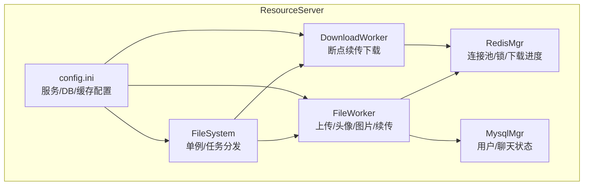
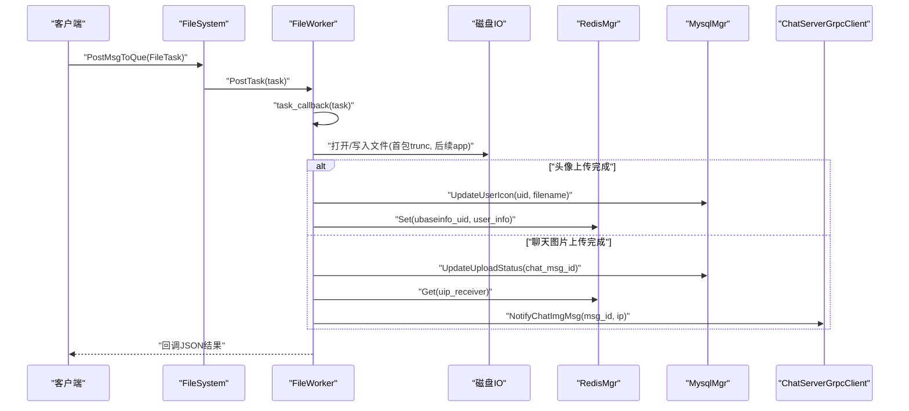
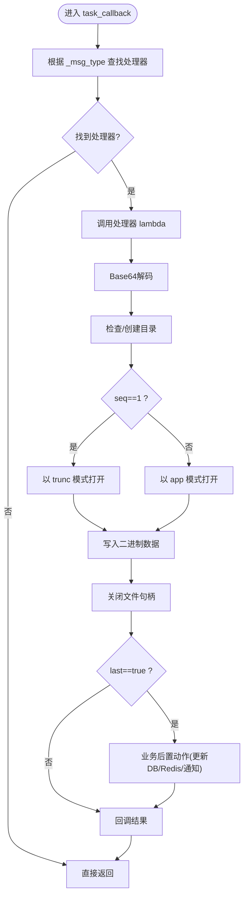
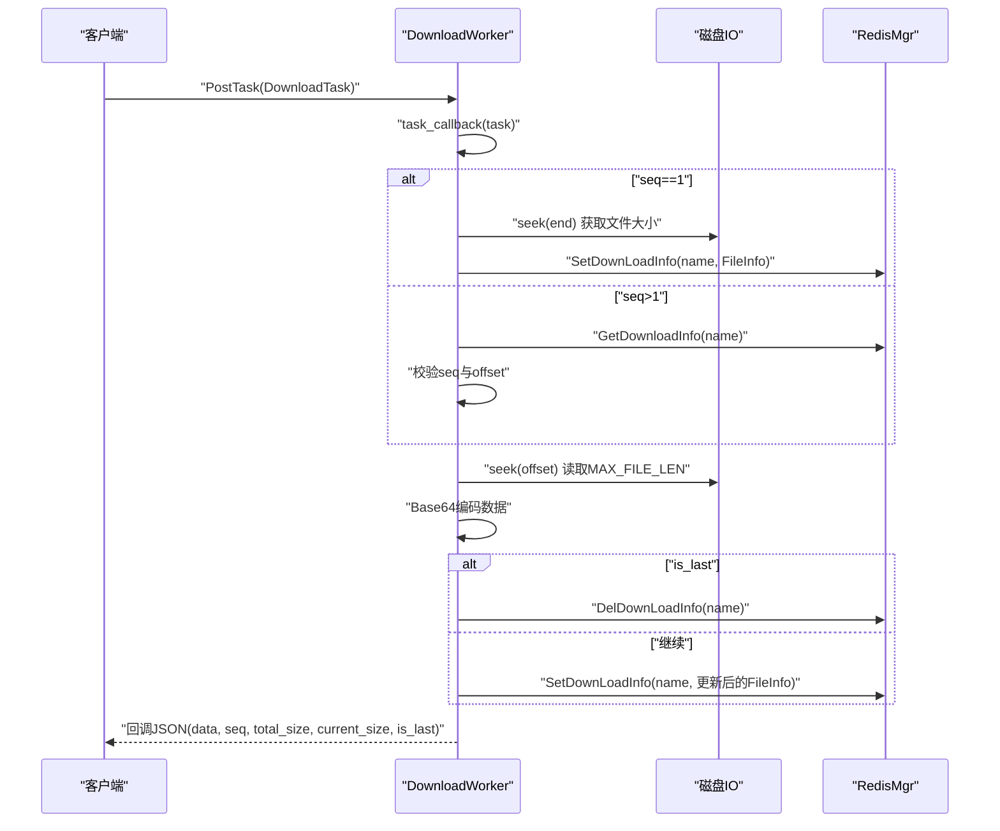
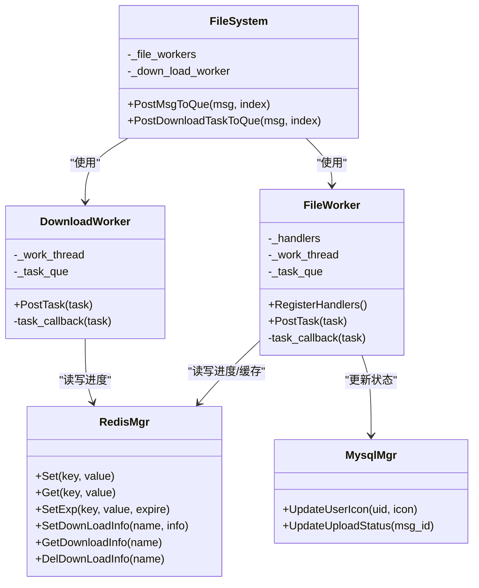

# 文件存储管理

<cite>
**本文引用的文件**   
- [FileSystem.h](file://server/ResourceServer/include/FileSystem.h)
- [FileSystem.cpp](file://server/ResourceServer/src/FileSystem.cpp)
- [FileWorker.h](file://server/ResourceServer/include/FileWorker.h)
- [FileWorker.cpp](file://server/ResourceServer/src/FileWorker.cpp)
- [FileInfo.h](file://server/ResourceServer/include/FileInfo.h)
- [const.h](file://server/ResourceServer/include/const.h)
- [RedisMgr.h](file://server/ResourceServer/include/RedisMgr.h)
- [MysqlMgr.h](file://server/ResourceServer/include/MysqlMgr.h)
- [config.ini](file://server/ResourceServer/config/config.ini)
</cite>

## 目录
1. [简介](#简介)
2. [项目结构](#项目结构)
3. [核心组件](#核心组件)
4. [架构总览](#架构总览)
5. [详细组件分析](#详细组件分析)
6. [依赖关系分析](#依赖关系分析)
7. [性能考量](#性能考量)
8. [故障排查指南](#故障排查指南)
9. [结论](#结论)
10. [附录：使用示例与最佳实践](#附录使用示例与最佳实践)

## 简介
本技术文档聚焦于LLFCChat资源服务端的文件存储管理系统，围绕以下目标展开：
- 深入解析 FileSystem 类的实现、工作线程模型与任务分发机制
- 说明 FileInfo 数据结构的设计与用途（元数据、大小、位置等）
- 详解分块上传/下载机制、命名规范、索引管理与完整性校验策略
- 记录清理策略（过期删除、空间回收、垃圾收集）的现状与建议
- 提供创建、查找、删除与批量操作的代码级示例路径
- 解释分布式环境下的同步策略、数据一致性与故障恢复机制

## 项目结构
资源服务端（ResourceServer）负责文件上传、下载、头像更新、聊天图片处理以及与数据库和缓存的交互。关键目录与文件如下：
- include: 接口与数据结构定义（如 FileSystem、FileWorker、FileInfo、RedisMgr、MysqlMgr、常量与错误码）
- src: 具体实现（文件系统调度、工作线程、下载器、消息处理器）
- config: 运行配置（MySQL、Redis、静态资源路径等）

图表来源 
- [FileSystem.h:1-21](file://server/ResourceServer/include/FileSystem.h#L1-L21)
- [FileSystem.cpp:1-29](file://server/ResourceServer/src/FileSystem.cpp#L1-L29)
- [FileWorker.h:1-91](file://server/ResourceServer/include/FileWorker.h#L1-L91)
- [FileWorker.cpp:1-660](file://server/ResourceServer/src/FileWorker.cpp#L1-L660)
- [RedisMgr.h:1-313](file://server/ResourceServer/include/RedisMgr.h#L1-L313)
- [MysqlMgr.h:1-44](file://server/ResourceServer/include/MysqlMgr.h#L1-L44)
- [config.ini:1-27](file://server/ResourceServer/config/config.ini#L1-L27)

章节来源
- [FileSystem.h:1-21](file://server/ResourceServer/include/FileSystem.h#L1-L21)
- [FileSystem.cpp:1-29](file://server/ResourceServer/src/FileSystem.cpp#L1-L29)
- [FileWorker.h:1-91](file://server/ResourceServer/include/FileWorker.h#L1-L91)
- [FileWorker.cpp:1-660](file://server/ResourceServer/src/FileWorker.cpp#L1-L660)
- [RedisMgr.h:1-313](file://server/ResourceServer/include/RedisMgr.h#L1-L313)
- [MysqlMgr.h:1-44](file://server/ResourceServer/include/MysqlMgr.h#L1-L44)
- [config.ini:1-27](file://server/ResourceServer/config/config.ini#L1-L27)

## 核心组件
- FileSystem：单例式文件服务入口，维护多实例 FileWorker 与 DownloadWorker，按索引将任务投递到对应工作线程队列。
- FileWorker：基于条件变量与互斥量的工作线程，注册多种消息处理器（上传、头像、聊天图片、信息同步、续传），完成二进制写入与回调。
- DownloadWorker：独立下载工作线程，支持断点续传，通过 Redis 持久化下载进度，读取指定偏移并 Base64 编码返回。
- FileInfo：文件元数据载体，包含序列号、文件名、总大小、已传输大小、本地路径等字段；配合 ChatImgInfo 用于聊天图片上下文。
- RedisMgr：Redis 连接池、键值操作、分布式锁、下载进度存取（Set/Get/Del）。
- MysqlMgr：用户信息与聊天消息状态更新（头像、上传状态等）。
- const.h：错误码、消息类型、常量（如 MAX_FILE_LEN、工作者数量等）。

章节来源
- [FileSystem.h:1-21](file://server/ResourceServer/include/FileSystem.h#L1-L21)
- [FileSystem.cpp:1-29](file://server/ResourceServer/src/FileSystem.cpp#L1-L29)
- [FileWorker.h:1-91](file://server/ResourceServer/include/FileWorker.h#L1-L91)
- [FileWorker.cpp:1-660](file://server/ResourceServer/src/FileWorker.cpp#L1-L660)
- [FileInfo.h:1-26](file://server/ResourceServer/include/FileInfo.h#L1-L26)
- [RedisMgr.h:1-313](file://server/ResourceServer/include/RedisMgr.h#L1-L313)
- [MysqlMgr.h:1-44](file://server/ResourceServer/include/MysqlMgr.h#L1-L44)
- [const.h:1-117](file://server/ResourceServer/include/const.h#L1-L117)

## 架构总览
资源服务端采用“单例调度 + 多工作线程”的架构模式：
- FileSystem 作为统一入口，初始化固定数量的 FileWorker 与 DownloadWorker，并通过 PostMsgToQue / PostDownloadTaskToQue 进行任务分发。
- FileWorker 内部维护消息处理器映射表，根据消息类型路由到相应处理逻辑（上传、头像、聊天图片、续传等）。
- DownloadWorker 负责从磁盘读取文件片段，结合 Redis 中的下载进度实现断点续传。
- 与外部系统交互：Redis 用于会话、进度与缓存；MySQL 用于用户与聊天状态；gRPC 客户端用于通知 ChatServer。

图表来源 
- [FileSystem.cpp:1-29](file://server/ResourceServer/src/FileSystem.cpp#L1-L29)
- [FileWorker.cpp:46-454](file://server/ResourceServer/src/FileWorker.cpp#L46-L454)
- [RedisMgr.h:269-313](file://server/ResourceServer/include/RedisMgr.h#L269-L313)
- [MysqlMgr.h:35-36](file://server/ResourceServer/include/MysqlMgr.h#L35-L36)

## 详细组件分析

### FileSystem 类
- 职责：单例入口，维护 FileWorker 与 DownloadWorker 向量，按 index 选择工作线程投递任务。
- 关键点：
  - 构造时初始化固定数量的工作线程（FILE_WORKER_COUNT、DOWN_LOAD_WORKER_COUNT）。
  - PostMsgToQue / PostDownloadTaskToQue 分别向上传与下载队列投递任务。
- 扩展性：可通过增加工作者数量提升并发能力。

章节来源
- [FileSystem.h:1-21](file://server/ResourceServer/include/FileSystem.h#L1-L21)
- [FileSystem.cpp:1-29](file://server/ResourceServer/src/FileSystem.cpp#L1-L29)
- [const.h:63-69](file://server/ResourceServer/include/const.h#L63-L69)

### FileWorker 与消息处理器
- 设计模式：注册式处理器映射（_handlers），以 MSG_TYPES 为键，函数对象为值。
- 主要处理器：
  - ID_UPLOAD_FILE_REQ：通用文件上传（Base64解码、目录创建、首包截断、后续追加、写回回调）。
  - ID_UPLOAD_HEAD_ICON_REQ：头像上传完成后更新用户头像并刷新Redis缓存。
  - ID_IMG_CHAT_UPLOAD_REQ / ID_IMG_CHAT_CONTINUE_UPLOAD_REQ：聊天图片上传与续传，完成后更新数据库状态并根据接收者在线情况通知。
  - ID_FILE_INFO_SYNC_REQ：文件信息同步（类似上传流程，完成后更新状态并通知）。
- 错误处理：对目录创建失败、文件打开失败、写入失败等场景设置错误码并回调。

图表来源 
- [FileWorker.cpp:46-454](file://server/ResourceServer/src/FileWorker.cpp#L46-L454)

章节来源
- [FileWorker.h:15-57](file://server/ResourceServer/include/FileWorker.h#L15-L57)
- [FileWorker.cpp:46-454](file://server/ResourceServer/src/FileWorker.cpp#L46-L454)
- [const.h:72-95](file://server/ResourceServer/include/const.h#L72-L95)

### DownloadWorker 与断点续传
- 工作流程：
  - seq=1：获取文件大小，构造 FileInfo，立即写入 Redis（覆盖旧数据，设置过期时间）。
  - seq>1：从 Redis 读取历史进度，校验序列号，计算偏移量，定位读取 MAX_FILE_LEN 字节，Base64 编码后返回。
  - is_last=true：删除 Redis 中的下载进度；否则更新 seq 与 trans_size 并写回 Redis。
- 错误处理：文件不存在、权限不足、读取失败、偏移越界、Redis读取失败、序列号不匹配等。

图表来源 
- [FileWorker.cpp:525-659](file://server/ResourceServer/src/FileWorker.cpp#L525-L659)
- [RedisMgr.h:303-307](file://server/ResourceServer/include/RedisMgr.h#L303-L307)

章节来源
- [FileWorker.cpp:480-659](file://server/ResourceServer/src/FileWorker.cpp#L480-L659)
- [RedisMgr.h:269-313](file://server/ResourceServer/include/RedisMgr.h#L269-L313)

### FileInfo 数据结构
- 字段说明：
  - _seq：当前分块序列号（用于断点续传）
  - _name：文件名
  - _total_size：文件总大小（字节）
  - _trans_size：已传输大小（字节）
  - _file_path_str：本地完整路径
- ChatImgInfo：聊天图片上下文（发送者、接收者、消息ID、图片名）

章节来源
- [FileInfo.h:1-26](file://server/ResourceServer/include/FileInfo.h#L1-L26)

### 文件目录结构与路径管理
- 目录创建：使用 boost::filesystem 检查并创建父目录，确保路径存在。
- 文件命名：由上层传入完整路径（含扩展名），服务器端直接使用；上传/头像/聊天图片均遵循相同策略。
- 路径安全：未做额外白名单或沙箱限制，建议在生产环境增加路径校验与访问控制。

章节来源
- [FileWorker.cpp:52-71](file://server/ResourceServer/src/FileWorker.cpp#L52-L71)
- [FileWorker.cpp:112-135](file://server/ResourceServer/src/FileWorker.cpp#L112-L135)
- [FileWorker.cpp:196-219](file://server/ResourceServer/src/FileWorker.cpp#L196-L219)
- [FileWorker.cpp:283-306](file://server/ResourceServer/src/FileWorker.cpp#L283-L306)

### 存储空间分配策略
- 当前实现：无显式的配额或分区策略，所有文件写入到配置的静态输出路径下（由配置文件决定）。
- 建议：引入按用户/类型分区的目录结构、配额限制与容量监控，避免单点膨胀。

章节来源
- [config.ini:15-18](file://server/ResourceServer/config/config.ini#L15-L18)

### 文件清理策略
- 现状：
  - 下载进度在 Redis 中设置过期时间，下载完成后主动删除。
  - 文件本身未实现自动过期删除或垃圾回收。
- 建议：
  - 定期扫描目录，清理长时间未访问或超过保留期的文件。
  - 结合业务生命周期（如聊天记录过期策略）执行批量删除。
  - 引入软删除标记与异步回收线程。

章节来源
- [FileWorker.cpp:567-571](file://server/ResourceServer/src/FileWorker.cpp#L567-L571)
- [FileWorker.cpp:643-653](file://server/ResourceServer/src/FileWorker.cpp#L643-L653)

### 分块存储机制与命名规范
- 分块大小：MAX_FILE_LEN（默认 32KB），客户端与服务端均按此大小分块读写。
- 命名规范：由调用方提供完整路径与文件名，服务端不做重命名；建议在业务层生成唯一文件名（如哈希或UUID）以避免冲突。
- 索引管理：上传阶段无显式索引文件；下载阶段通过 Redis 维护下载进度（seq、trans_size、total_size）。
- 完整性校验：当前未实现分块校验（如MD5/SHA），可在首包或尾包附加校验值并在服务端验证。

章节来源
- [const.h](file://server/ResourceServer/include/const.h#L114)
- [FileWorker.cpp:599-653](file://server/ResourceServer/src/FileWorker.cpp#L599-L653)

### 分布式环境下的同步策略与一致性
- 通知机制：聊天图片上传完成后，通过 gRPC 客户端通知 ChatServer，再由其推送给在线接收者。
- 一致性保障：
  - 上传顺序：客户端按 seq 顺序发送，服务端按 seq 判断首包与追加。
  - 断点续传：Redis 保存进度，重启后可恢复；需保证 seq 与 offset 的一致性。
- 故障恢复：
  - 网络中断：客户端重试并携带正确 seq，服务端校验后继续。
  - 服务重启：Redis 中的下载进度可恢复；若过期则需客户端重新发起 seq=1。

章节来源
- [FileWorker.cpp:252-275](file://server/ResourceServer/src/FileWorker.cpp#L252-L275)
- [FileWorker.cpp:337-361](file://server/ResourceServer/src/FileWorker.cpp#L337-L361)
- [FileWorker.cpp:423-447](file://server/ResourceServer/src/FileWorker.cpp#L423-L447)
- [RedisMgr.h:303-307](file://server/ResourceServer/include/RedisMgr.h#L303-L307)

## 依赖关系分析
- FileSystem 依赖 FileWorker 与 DownloadWorker 进行任务处理。
- FileWorker 依赖 RedisMgr（进度/缓存）、MysqlMgr（状态更新）、gRPC 客户端（通知）。
- DownloadWorker 依赖 RedisMgr（进度）与磁盘IO。
- 配置来自 config.ini（服务端口、MySQL、Redis、静态路径）。

图表来源 
- [FileSystem.h:1-21](file://server/ResourceServer/include/FileSystem.h#L1-L21)
- [FileWorker.h:59-74](file://server/ResourceServer/include/FileWorker.h#L59-L74)
- [RedisMgr.h:269-313](file://server/ResourceServer/include/RedisMgr.h#L269-L313)
- [MysqlMgr.h:35-36](file://server/ResourceServer/include/MysqlMgr.h#L35-L36)

章节来源
- [FileSystem.h:1-21](file://server/ResourceServer/include/FileSystem.h#L1-L21)
- [FileWorker.h:59-74](file://server/ResourceServer/include/FileWorker.h#L59-L74)
- [RedisMgr.h:269-313](file://server/ResourceServer/include/RedisMgr.h#L269-L313)
- [MysqlMgr.h:35-36](file://server/ResourceServer/include/MysqlMgr.h#L35-L36)

## 性能考量
- 并发模型：多工作线程（上传/下载各4个），适合高并发I/O场景。
- I/O优化：
  - 使用二进制流直接写入/读取，减少拷贝。
  - 大文件分块（32KB）降低内存占用。
- 缓存与锁：
  - Redis 连接池与PING保活，降低连接开销。
  - 分布式锁接口可用但当前文件处理未使用，可按需引入。
- 潜在瓶颈：
  - 单节点磁盘I/O上限。
  - Redis 序列化/反序列化开销（大对象频繁更新）。
- 优化建议：
  - 引入异步日志与指标采集（QPS、延迟、错误率）。
  - 针对热点文件启用本地缓存或CDN。
  - 调整工作者数量与分块大小以适应不同负载。

[本节为通用指导，无需引用具体文件]

## 故障排查指南
- 常见问题定位：
  - 目录创建失败：检查路径权限与磁盘空间。
  - 文件打开失败：确认路径与权限，避免并发覆盖。
  - 写入失败：检查磁盘I/O与权限。
  - 读取失败：确认文件存在且可读。
  - Redis读取失败：检查连接池与认证。
  - 序列号不匹配：客户端需严格递增 seq。
  - 偏移量越界：校验 total_size 与 seq。
- 错误码参考：ErrorCodes 枚举涵盖文件相关错误（不存在、权限、序列号、偏移、读取失败、Redis错误等）。

章节来源
- [FileWorker.cpp:64-108](file://server/ResourceServer/src/FileWorker.cpp#L64-L108)
- [FileWorker.cpp:127-163](file://server/ResourceServer/src/FileWorker.cpp#L127-L163)
- [FileWorker.cpp:212-247](file://server/ResourceServer/src/FileWorker.cpp#L212-L247)
- [FileWorker.cpp:298-334](file://server/ResourceServer/src/FileWorker.cpp#L298-L334)
- [FileWorker.cpp:384-421](file://server/ResourceServer/src/FileWorker.cpp#L384-L421)
- [FileWorker.cpp:537-550](file://server/ResourceServer/src/FileWorker.cpp#L537-L550)
- [FileWorker.cpp:574-597](file://server/ResourceServer/src/FileWorker.cpp#L574-L597)
- [const.h:5-29](file://server/ResourceServer/include/const.h#L5-L29)

## 结论
资源服务端的文件存储管理采用清晰的分层与多线程模型，实现了稳定的上传、头像更新、聊天图片处理与断点续传下载。通过 Redis 与 MySQL 的配合，保证了进度与状态的持久化与一致性。未来可在路径安全、完整性校验、配额与清理策略方面进一步增强，以提升系统的健壮性与可运维性。

[本节为总结，无需引用具体文件]

## 附录：使用示例与最佳实践
- 文件创建（上传）：
  - 客户端按 MAX_FILE_LEN 分块，依次发送 seq=1,2,...，last=true 表示最后一个分块。
  - 服务端 FileWorker 根据 seq 决定首包截断或后续追加。
  - 参考路径：[FileWorker.cpp:48-109](file://server/ResourceServer/src/FileWorker.cpp#L48-L109)
- 文件查找（下载）：
  - 首次下载 seq=1，服务端返回 total_size 并记录进度；后续按 seq 续传。
  - 参考路径：[FileWorker.cpp:554-597](file://server/ResourceServer/src/FileWorker.cpp#L554-L597)
- 文件删除：
  - 当前未实现删除接口；可在业务层调用文件系统API删除，并结合清理策略。
- 批量操作：
  - 通过并行投递多个 FileTask/DownloadTask 至不同 worker 索引，提高吞吐。
  - 参考路径：[FileSystem.cpp:9-17](file://server/ResourceServer/src/FileSystem.cpp#L9-L17)
- 最佳实践：
  - 文件名唯一性：建议使用哈希或UUID，避免冲突。
  - 完整性校验：在首包或尾包附加校验值，服务端验证。
  - 路径安全：限制允许的路径前缀与字符集。
  - 清理策略：定期扫描与过期删除，释放空间。

章节来源
- [FileWorker.cpp:48-109](file://server/ResourceServer/src/FileWorker.cpp#L48-L109)
- [FileWorker.cpp:554-597](file://server/ResourceServer/src/FileWorker.cpp#L554-L597)
- [FileSystem.cpp:9-17](file://server/ResourceServer/src/FileSystem.cpp#L9-L17)
- [const.h](file://server/ResourceServer/include/const.h#L114)