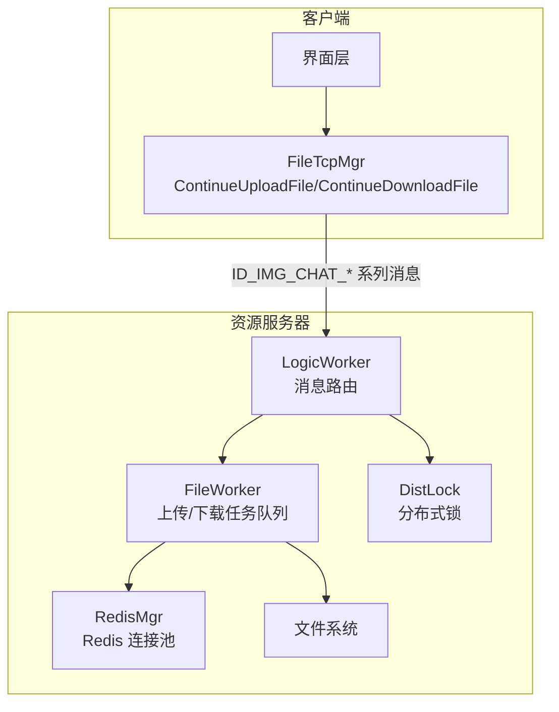
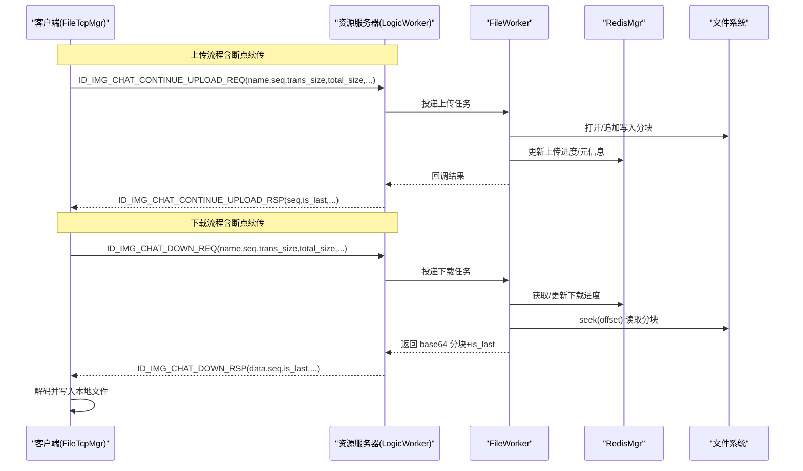
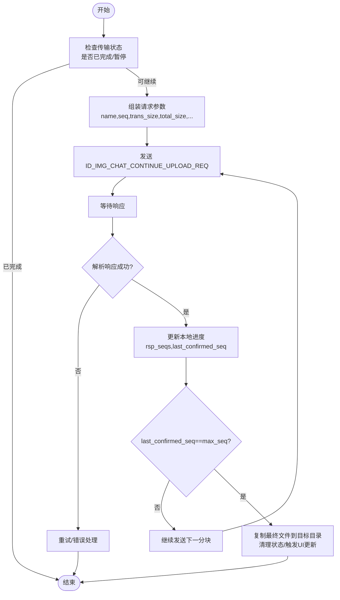
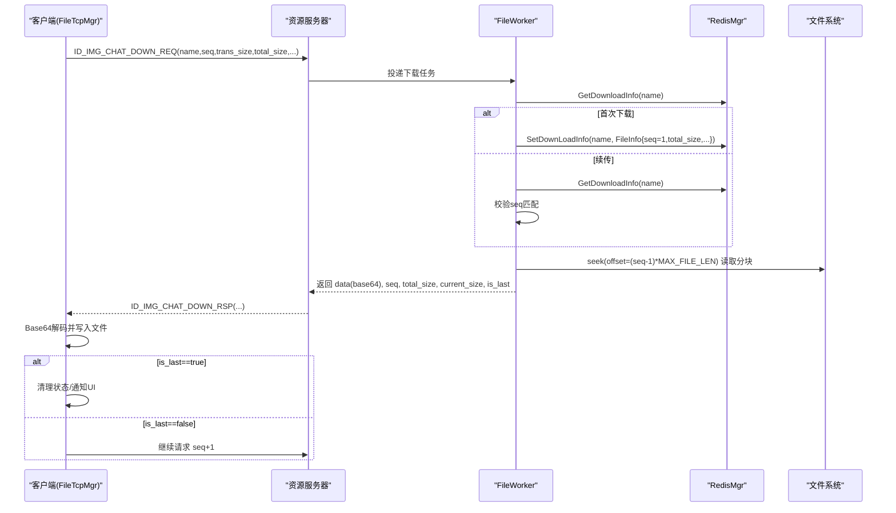
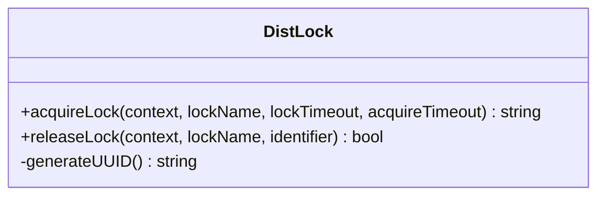
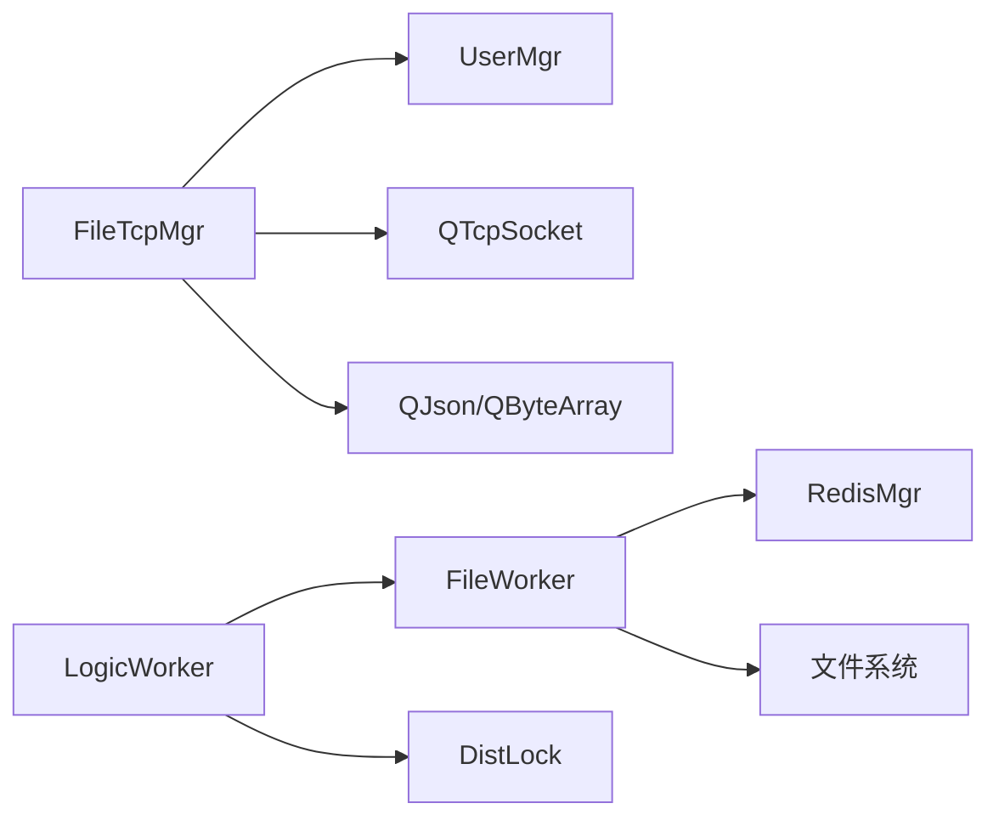

# 断点续传机制

<cite>
**本文引用的文件**   
- [FileWorker.h](file://server/ResourceServer/include/FileWorker.h)
- [FileWorker.cpp](file://server/ResourceServer/src/FileWorker.cpp)
- [DistLock.h](file://server/ResourceServer/include/DistLock.h)
- [DistLock.cpp](file://server/ResourceServer/src/DistLock.cpp)
- [FileInfo.h](file://server/ResourceServer/include/FileInfo.h)
- [RedisMgr.h](file://server/ResourceServer/include/RedisMgr.h)
- [filetcpmgr.h](file://client/llfcchat/include/filetcpmgr.h)
- [filetcpmgr.cpp](file://client/llfcchat/src/filetcpmgr.cpp)
- [global.cpp](file://client/llfcchat/src/global.cpp)
- [day38-断点续传.md](file://开发文档/day38-断点续传.md)
</cite>

## 目录
1. [简介](#简介)
2. [项目结构](#项目结构)
3. [核心组件](#核心组件)
4. [架构总览](#架构总览)
5. [详细组件分析](#详细组件分析)
6. [依赖关系分析](#依赖关系分析)
7. [性能考量](#性能考量)
8. [故障排查指南](#故障排查指南)
9. [结论](#结论)
10. [附录](#附录)

## 简介
本技术文档聚焦于 LLFCChat 的断点续传机制，围绕 ContinueUploadFile 与 ContinueDownloadFile 的实现原理展开，系统阐述：
- 文件分块策略、进度记录与状态同步
- 分布式锁 DistLock 在多进程环境下的数据一致性保障
- unique_name 唯一标识生成规则、分块命名规范与存储位置管理
- 断点信息的持久化方案（Redis 缓存与文件系统备份）
- 断点检测、续传逻辑与异常恢复的具体流程
- 网络中断处理、重试机制与数据完整性校验

## 项目结构
资源服务器端负责文件写入、下载分块读取、断点信息持久化；客户端负责发起上传/下载请求、维护本地进度、控制暂停/继续。关键代码分布如下：
- 服务端：FileWorker（上传/下载任务处理）、DistLock（分布式锁）、RedisMgr（Redis 连接池与操作封装）、FileInfo（断点元数据）
- 客户端：FileTcpMgr（TCP 传输管理器，实现 ContinueUploadFile/ContinueDownloadFile 等接口）

图表来源
- [FileWorker.cpp:46-455](file://server/ResourceServer/src/FileWorker.cpp#L46-L455)
- [filetcpmgr.cpp:243-800](file://client/llfcchat/src/filetcpmgr.cpp#L243-L800)
- [RedisMgr.h:269-311](file://server/ResourceServer/include/RedisMgr.h#L269-L311)
- [DistLock.cpp:27-73](file://server/ResourceServer/src/DistLock.cpp#L27-L73)

章节来源
- [FileWorker.h:15-57](file://server/ResourceServer/include/FileWorker.h#L15-L57)
- [FileWorker.cpp:46-455](file://server/ResourceServer/src/FileWorker.cpp#L46-L455)
- [filetcpmgr.h:26-82](file://client/llfcchat/include/filetcpmgr.h#L26-L82)
- [filetcpmgr.cpp:243-800](file://client/llfcchat/src/filetcpmgr.cpp#L243-L800)

## 核心组件
- FileWorker：接收上传/下载任务，按 seq 分块写入或读取，更新 Redis 中的断点信息，并在最后一片时完成收尾（如通知聊天服务）。
- DistLock：基于 Redis SET NX EX + Lua 原子释放，保证多进程并发对同一文件的互斥访问。
- RedisMgr：提供连接池、键值存取、过期设置、以及 FileInfo/下载进度的序列化存取。
- FileInfo：承载文件名、总大小、已传输大小、当前序列号、路径等断点元数据。
- FileTcpMgr（客户端）：实现 ContinueUploadFile/ContinueDownloadFile，组织请求、解析响应、维护本地进度并驱动重发/继续。

章节来源
- [FileWorker.h:15-57](file://server/ResourceServer/include/FileWorker.h#L15-L57)
- [FileWorker.cpp:46-455](file://server/ResourceServer/src/FileWorker.cpp#L46-L455)
- [DistLock.cpp:27-73](file://server/ResourceServer/src/DistLock.cpp#L27-L73)
- [RedisMgr.h:269-311](file://server/ResourceServer/include/RedisMgr.h#L269-L311)
- [FileInfo.h:1-26](file://server/ResourceServer/include/FileInfo.h#L1-L26)
- [filetcpmgr.h:26-82](file://client/llfcchat/include/filetcpmgr.h#L26-L82)
- [filetcpmgr.cpp:243-800](file://client/llfcchat/src/filetcpmgr.cpp#L243-L800)

## 架构总览
下图展示了“上传”和“下载”两条主流程在客户端与服务端之间的交互，以及 Redis 与文件系统的参与。

图表来源
- [filetcpmgr.cpp:610-800](file://client/llfcchat/src/filetcpmgr.cpp#L610-L800)
- [FileWorker.cpp:368-453](file://server/ResourceServer/src/FileWorker.cpp#L368-L453)
- [FileWorker.cpp:525-659](file://server/ResourceServer/src/FileWorker.cpp#L525-L659)
- [RedisMgr.h:269-311](file://server/ResourceServer/include/RedisMgr.h#L269-L311)

## 详细组件分析

### ContinueUploadFile（客户端）
- 触发入口：FileTcpMgr::ContinueUploadFile(unique_name)
- 行为要点：
  - 从本地传输状态中获取 MsgInfo，判断是否已完成或处于暂停
  - 组装请求体（name、seq、trans_size、total_size、token、sender/receiver/message_id 等）
  - 通过 TCP 发送 ID_IMG_CHAT_CONTINUE_UPLOAD_REQ
  - 收到响应后更新本地进度集合（flighting_seqs/rsp_seqs），计算 last_confirmed_seq
  - 若达到最大确认序列，则拷贝最终文件到用户资源目录，并清理临时状态，触发下一批发送

图表来源
- [filetcpmgr.cpp:610-693](file://client/llfcchat/src/filetcpmgr.cpp#L610-L693)
- [filetcpmgr.cpp:435-519](file://client/llfcchat/src/filetcpmgr.cpp#L435-L519)

章节来源
- [filetcpmgr.h:37-38](file://client/llfcchat/include/filetcpmgr.h#L37-L38)
- [filetcpmgr.cpp:610-693](file://client/llfcchat/src/filetcpmgr.cpp#L610-L693)
- [filetcpmgr.cpp:435-519](file://client/llfcchat/src/filetcpmgr.cpp#L435-L519)

### ContinueDownloadFile（客户端）
- 触发入口：FileTcpMgr::ContinueDownloadFile(unique_name)
- 行为要点：
  - 根据 unique_name 获取本地传输信息，校验 current_size < total_size
  - 组装下载请求（name、seq、trans_size、total_size、token、sender/receiver/message_id、uid）
  - 发送 ID_IMG_CHAT_DOWN_REQ
  - 收到响应后 Base64 解码，按 seq 决定覆盖/追加写入本地文件
  - 若 is_last 为真，清理状态并通知 UI；否则继续请求下一分块

图表来源
- [filetcpmgr.cpp:695-800](file://client/llfcchat/src/filetcpmgr.cpp#L695-L800)
- [FileWorker.cpp:525-659](file://server/ResourceServer/src/FileWorker.cpp#L525-L659)
- [RedisMgr.h:303-307](file://server/ResourceServer/include/RedisMgr.h#L303-L307)

章节来源
- [filetcpmgr.h:38](file://client/llfcchat/include/filetcpmgr.h#L38)
- [filetcpmgr.cpp:695-800](file://client/llfcchat/src/filetcpmgr.cpp#L695-L800)
- [FileWorker.cpp:525-659](file://server/ResourceServer/src/FileWorker.cpp#L525-L659)

### 文件分块策略与存储位置
- 分块大小：固定 MAX_FILE_LEN（服务端读取/客户端发送均按此长度切分）
- 序列号 seq：从 1 开始递增，用于定位偏移 offset = (seq-1)*MAX_FILE_LEN
- 首包与后续包：
  - 上传：seq==1 时 trunc 创建新文件；后续 seq 使用 append 追加
  - 下载：seq==1 时覆盖写；后续 seq 追加写
- 存储位置：
  - 头像/聊天图片：按用户目录组织，例如 user/<uid>/chatimg/<peer_uid>/<unique_name>
  - 其他文件：由配置输出路径拼接 name 形成 file_path_str

章节来源
- [FileWorker.cpp:74-109](file://server/ResourceServer/src/FileWorker.cpp#L74-L109)
- [FileWorker.cpp:196-280](file://server/ResourceServer/src/FileWorker.cpp#L196-L280)
- [FileWorker.cpp:368-453](file://server/ResourceServer/src/FileWorker.cpp#L368-L453)
- [FileWorker.cpp:525-659](file://server/ResourceServer/src/FileWorker.cpp#L525-L659)
- [filetcpmgr.cpp:492-508](file://client/llfcchat/src/filetcpmgr.cpp#L492-L508)

### 分布式锁 DistLock 的作用与实现
- 作用：在多进程并发场景下，确保同一文件在同一时刻仅被一个进程处理，避免竞态条件导致的数据不一致
- 实现要点：
  - 加锁：SET lockKey identifier NX EX lockTimeout（带过期时间，防止死锁）
  - 解锁：EVAL Lua 脚本原子比较并删除（仅当 value 等于 identifier 时才删除）
  - 获取失败：轮询重试直至 acquireTimeout 超时

图表来源
- [DistLock.h:4-16](file://server/ResourceServer/include/DistLock.h#L4-L16)
- [DistLock.cpp:21-73](file://server/ResourceServer/src/DistLock.cpp#L21-L73)

章节来源
- [DistLock.h:4-16](file://server/ResourceServer/include/DistLock.h#L4-L16)
- [DistLock.cpp:27-73](file://server/ResourceServer/src/DistLock.cpp#L27-L73)

### unique_name 生成规则与命名规范
- 头像唯一名：generateUniqueIconName() 生成 UUID（无括号）+ ".png"
- 聊天图片/文件：通常以业务生成的唯一名作为 unique_name，结合 sender/receiver 目录组织存储
- 命名建议：
  - 保持全局唯一且稳定（便于断点续传与去重）
  - 包含扩展名（如 .png/.jpg/.zip）
  - 避免特殊字符，便于跨平台文件系统兼容

章节来源
- [global.cpp:41-44](file://client/llfcchat/src/global.cpp#L41-L44)
- [filetcpmgr.cpp:492-508](file://client/llfcchat/src/filetcpmgr.cpp#L492-L508)

### 断点信息持久化方案
- Redis 缓存：
  - 上传：SetFileInfo(name, FileInfo) 保存/更新元信息（seq、total_size、trans_size、file_path_str）
  - 下载：SetDownLoadInfo(name, FileInfo) 保存下载进度；DelDownLoadInfo(name) 完成后清理
  - 过期策略：可通过 SetExp(key, value, expire_seconds) 设置过期，避免僵尸状态
- 文件系统备份：
  - 分块文件按 seq 顺序写入，最终合并为完整文件
  - 下载侧按 seq 覆盖/追加写入，保证幂等性

章节来源
- [RedisMgr.h:303-307](file://server/ResourceServer/include/RedisMgr.h#L303-L307)
- [RedisMgr.h:269-311](file://server/ResourceServer/include/RedisMgr.h#L269-L311)
- [FileWorker.cpp:525-659](file://server/ResourceServer/src/FileWorker.cpp#L525-L659)
- [FileWorker.cpp:368-453](file://server/ResourceServer/src/FileWorker.cpp#L368-L453)

### 网络中断处理、重试机制与数据完整性校验
- 网络中断：
  - 客户端监听 socket 错误事件（连接拒绝、远程关闭、主机未找到、超时等）
  - 断开后触发信号，上层可决定重连或提示用户
- 重试机制：
  - 上传：根据 last_confirmed_seq 与 rsp_seqs 集合，跳过已确认的分块，重发缺失分块
  - 下载：is_last=false 时自动继续请求下一分块；失败时可指数退避重试
- 数据完整性：
  - 分块大小固定 MAX_FILE_LEN，offset 计算严格一致
  - 服务端校验 seq 与 Redis 中记录的 seq 匹配，防止乱序
  - 可选 MD5/哈希校验（客户端支持 calculateFileHash）

章节来源
- [filetcpmgr.cpp:65-93](file://client/llfcchat/src/filetcpmgr.cpp#L65-L93)
- [filetcpmgr.cpp:435-519](file://client/llfcchat/src/filetcpmgr.cpp#L435-L519)
- [FileWorker.cpp:583-597](file://server/ResourceServer/src/FileWorker.cpp#L583-L597)
- [global.cpp:46-63](file://client/llfcchat/src/global.cpp#L46-L63)

## 依赖关系分析
- 客户端 FileTcpMgr 依赖 UserMgr（传输状态管理）、QJson/QByteArray（编解码）、QTcpSocket（网络IO）
- 服务端 LogicWorker 将消息路由至 FileWorker，后者依赖 RedisMgr（断点元数据）、文件系统（读写分块）
- DistLock 依赖 hiredis 与 Boost UUID，用于分布式互斥

图表来源
- [filetcpmgr.cpp:243-800](file://client/llfcchat/src/filetcpmgr.cpp#L243-L800)
- [FileWorker.cpp:46-455](file://server/ResourceServer/src/FileWorker.cpp#L46-L455)
- [DistLock.cpp:27-73](file://server/ResourceServer/src/DistLock.cpp#L27-L73)

章节来源
- [filetcpmgr.h:26-82](file://client/llfcchat/include/filetcpmgr.h#L26-L82)
- [FileWorker.h:15-57](file://server/ResourceServer/include/FileWorker.h#L15-L57)
- [RedisMgr.h:269-311](file://server/ResourceServer/include/RedisMgr.h#L269-L311)

## 性能考量
- 分块大小：MAX_FILE_LEN 需权衡网络吞吐与内存占用，过大易拥塞，过小增加开销
- 并发控制：客户端使用发送队列与 bytesWritten 回调，避免重复写入；服务端使用线程池/队列解耦 IO
- Redis 连接池：RedisConPool 维护连接与心跳，降低频繁建连成本
- 文件 IO：首包 trunc 创建，后续 append 写入，减少随机 IO；下载侧 seek 精确偏移，避免全量读取

[本节为通用指导，不直接分析具体文件]

## 故障排查指南
- 常见错误码：
  - FileNotExists、FileWritePermissionFailed、FileReadPermissionFailed、RedisReadErr、FileSeqInvalid、FileOffsetInvalid、FileReadFailed
- 排查步骤：
  - 检查 Redis 中是否存在对应 name 的 FileInfo/下载进度
  - 核对 seq 与 trans_size/total_size 的一致性
  - 验证文件路径权限与磁盘空间
  - 查看客户端 socket 错误事件与日志
- 恢复策略：
  - 清理损坏的分块文件，重新从 seq=1 开始
  - 重置 Redis 中的断点信息，强制从头传输
  - 调整 MAX_FILE_LEN 或重试间隔

章节来源
- [FileWorker.cpp:537-549](file://server/ResourceServer/src/FileWorker.cpp#L537-L549)
- [FileWorker.cpp:583-597](file://server/ResourceServer/src/FileWorker.cpp#L583-L597)
- [filetcpmgr.cpp:65-93](file://client/llfcchat/src/filetcpmgr.cpp#L65-L93)

## 结论
LLFCChat 的断点续传机制通过“固定分块 + 序列号 + Redis 断点元数据”的组合，实现了可靠的上传/下载能力。客户端 FileTcpMgr 负责状态管理与请求编排，服务端 FileWorker 负责分块 IO 与进度持久化，DistLock 保障多进程并发安全。该设计具备良好的可扩展性与容错性，适用于大文件与不稳定网络的场景。

[本节为总结，不直接分析具体文件]

## 附录
- 相关开发文档参考：
  - day38-断点续传.md：涵盖上传/下载流程、暂停/续传、单/多线程改造思路
  - day41-通知客户端异步下载聊天图片.md：展示 ContinueDownloadFile 的使用与效果

章节来源
- [day38-断点续传.md:479-1066](file://开发文档/day38-断点续传.md#L479-L1066)
- [day38-断点续传.md:1682-1837](file://开发文档/day38-断点续传.md#L1682-L1837)
- [day41-通知客户端异步下载聊天图片.md:956-1108](file://开发文档/day41-通知客户端异步下载聊天图片.md#L956-L1108)