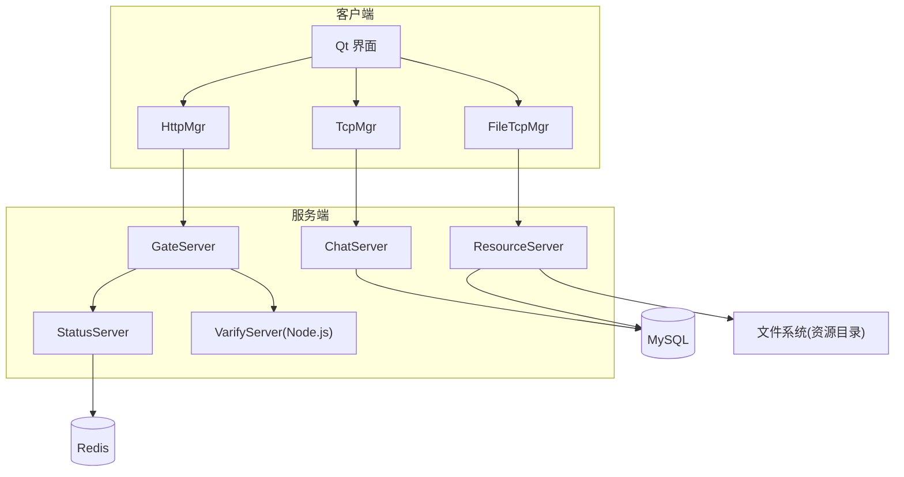
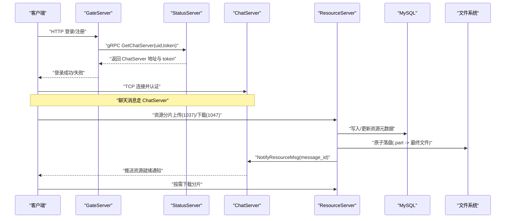
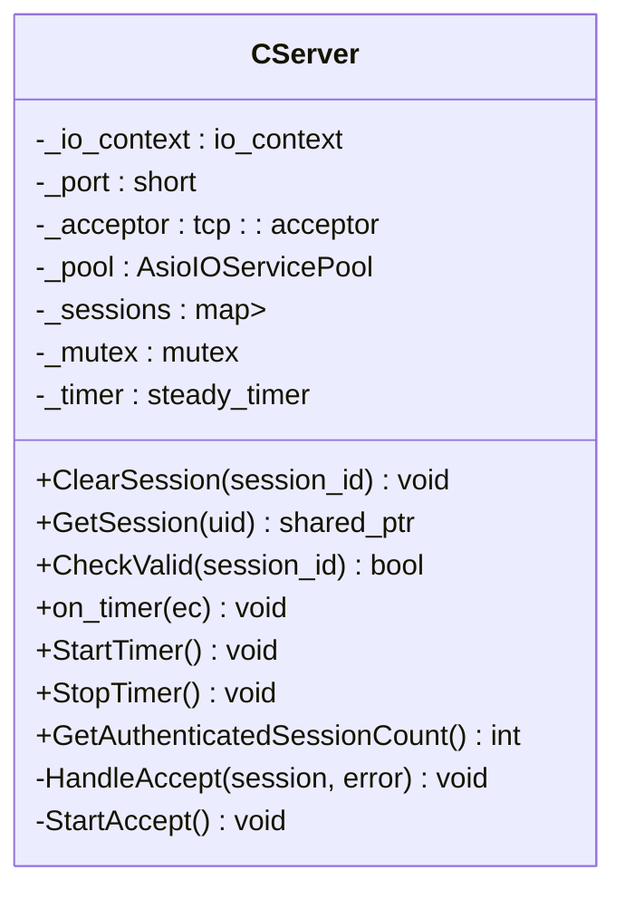
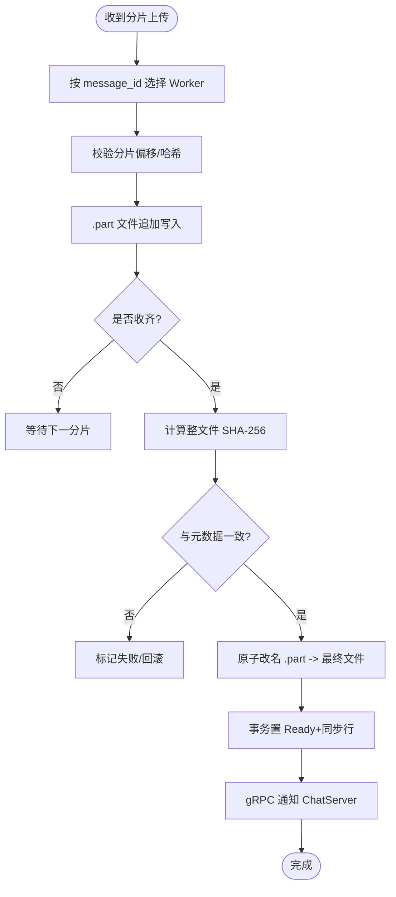
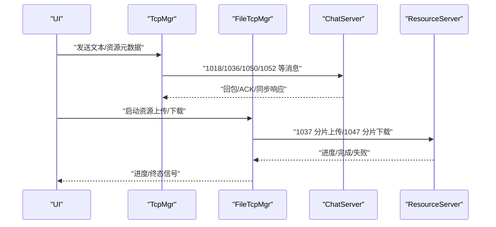
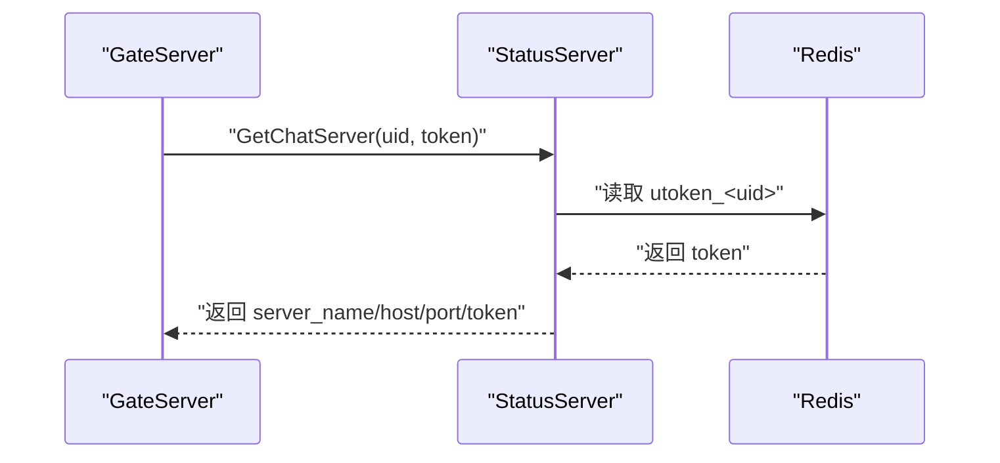
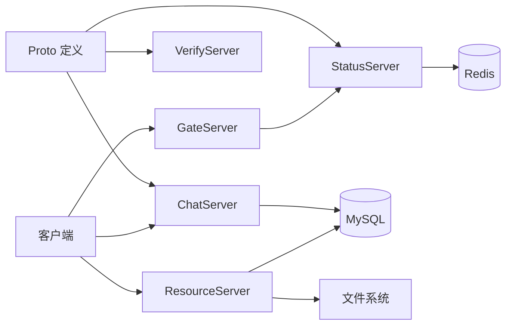

# 统一资源传输系统

<cite>
**本文引用的文件**
- [README.md](file://README.md)
- [CMakeLists.txt](file://CMakeLists.txt)
- [chat.proto](file://proto/chat_service/chat.proto)
- [status.proto](file://proto/status_service/status.proto)
- [verify.proto](file://proto/verify_service/verify.proto)
- [ChatServer CServer.h](file://server/ChatServer/include/CServer.h)
- [GateServer CServer.h](file://server/GateServer/include/CServer.h)
- [ResourceServer CServer.h](file://server(ResourceServer/include/CServer.h)
- [StatusServer.cpp](file://server/StatusServer/src/StatusServer.cpp)
- [ConfigMgr.h](file://server/common/include/ConfigMgr.h)
- [client TcpMgr.h](file://client/llfcchat/include/tcpmgr.h)
- [client HttpMgr.h](file://client/llfcchat/include/httpmgr.h)
- [client FileTcpMgr.h](file://client/llfcchat/include/filetcpmgr.h)
- [ResourceServer FileSystem.h](file://server\ResourceServer\include\FileSystem.h)
- [ResourceServer FileWorker.h](file://server\ResourceServer\include\FileWorker.h)
</cite>

## 目录
1. [简介](#简介)
2. [项目结构](#项目结构)
3. [核心组件](#核心组件)
4. [架构总览](#架构总览)
5. [详细组件分析](#详细组件分析)
6. [依赖关系分析](#依赖关系分析)
7. [性能考量](#性能考量)
8. [故障排查指南](#故障排查指南)
9. [结论](#结论)
10. [附录](#附录)

## 简介
本项目是一个基于 C++/Qt 的即时通讯与统一资源传输系统，采用多服务拆分（聊天、网关、状态、资源、验证）与 gRPC 通信。资源传输在“统一资源”主题下实现了图片与文件的分片上传/下载、断点续传、哈希校验与原子落盘，并通过 ChatServer 进行消息路由与跨服通知。客户端通过 HTTP 管理登录注册等流程，通过 TCP 通道完成消息收发与资源传输。

## 项目结构
- 根构建：使用 CMake 组织子工程 server/client/tests，并启用 vcpkg 与自定义模块。
- 协议定义：proto 目录定义 chat_service、status_service、verify_service 的 gRPC 接口与消息体。
- 服务端：
  - ChatServer：TCP 会话管理与消息转发，gRPC 实现。
  - GateServer：HTTP 网关，负责鉴权与路由。
  - ResourceServer：资源分片上传/下载、文件系统与 Worker 调度。
  - StatusServer：gRPC 状态查询，返回 ChatServer 地址与令牌。
  - VarifyServer：Node.js 验证码服务（邮箱）。
- 客户端：Qt 应用，包含 UI、网络层（Http/TCP）、本地存储与同步逻辑。

图表来源
- [CMakeLists.txt:1-44](file://CMakeLists.txt#L1-L44)
- [chat.proto:1-106](file://proto/chat_service/chat.proto#L1-L106)
- [status.proto:1-23](file://proto/status_service/status.proto#L1-L23)
- [verify.proto:1-19](file://proto/verify_service/verify.proto#L1-L19)

章节来源
- [CMakeLists.txt:1-44](file://CMakeLists.txt#L1-L44)
- [README.md:1-112](file://README.md#L1-L112)

## 核心组件
- 协议层
  - ChatService：好友申请/认证、文本聊天、踢人、资源消息通知。
  - StatusService：根据 uid/token 获取 ChatServer 地址与登录令牌。
  - VerifyService：发送验证码。
- 服务端
  - ChatServer：TCP 会话管理、心跳检测、按 uid 查找/清除会话。
  - GateServer：HTTP 接入与路由。
  - ResourceServer：分片上传/下载、Worker 调度、文件系统操作。
  - StatusServer：gRPC 服务，读取 Redis 中的 utoken_<uid> 并返回 token。
- 客户端
  - TcpMgr：纯传输层，帧收发与分发，连接/重连、消息队列。
  - FileTcpMgr：资源传输专用 TCP 通道，支持断点续传、拥塞控制、进度上报。
  - HttpMgr：HTTP 请求封装，登录/注册等流程。

章节来源
- [chat.proto:1-106](file://proto/chat_service/chat.proto#L1-L106)
- [status.proto:1-23](file://proto/status_service/status.proto#L1-L23)
- [verify.proto:1-19](file://proto/verify_service/verify.proto#L1-L19)
- [ChatServer CServer.h:1-102](file://server/ChatServer/include/CServer.h#L1-L102)
- [ResourceServer CServer.h:1-27](file://server(ResourceServer/include/CServer.h#L1-L27)
- [StatusServer.cpp:1-82](file://server/StatusServer/src/StatusServer.cpp#L1-L82)
- [client TcpMgr.h:1-119](file://client/llfcchat/include/tcpmgr.h#L1-L119)
- [client FileTcpMgr.h:1-118](file://client/llfcchat/include/filetcpmgr.h#L1-L118)
- [client HttpMgr.h:1-35](file://client/llfcchat/include/httpmgr.h#L1-L35)

## 架构总览
系统采用“网关 + 多服务”的分布式架构：
- 客户端通过 HTTP 访问 GateServer 完成注册/登录；随后通过 StatusServer 获取 ChatServer 地址与令牌。
- 聊天消息通过 ChatServer 的 TCP 长连接进行双向通信；资源传输通过独立的 FileTcpMgr 与 ResourceServer 的分片协议完成。
- 资源上传完成后，ResourceServer 通过 ChatService.NotifyResourceMsg 通知 ChatServer，再由 ChatServer 推送给接收端，触发客户端自动下载。

图表来源
- [status.proto:1-23](file://proto/status_service/status.proto#L1-L23)
- [chat.proto:1-106](file://proto/chat_service/chat.proto#L1-L106)
- [StatusServer.cpp:1-82](file://server/StatusServer/src/StatusServer.cpp#L1-L82)
- [ResourceServer FileWorker.h:1-164](file://server\ResourceServer\include\FileWorker.h#L1-L164)

## 详细组件分析

### 聊天服务器（ChatServer）
- 职责：监听端口、接受连接、维护在线会话、心跳检测、按 uid 查找/清除会话，供 gRPC 服务调用。
- 关键能力：
  - 会话生命周期管理（创建、清理、有效性检查）。
  - 定时器驱动的心跳检测与超时断开。
  - 统计已认证会话数用于负载上报。

图表来源
- [ChatServer CServer.h:1-102](file://server/ChatServer/include/CServer.h#L1-L102)

章节来源
- [ChatServer CServer.h:1-102](file://server/ChatServer/include/CServer.h#L1-L102)

### 资源服务器（ResourceServer）
- 职责：处理头像通道与统一资源消息的分片上传/下载，协调文件系统与数据库，完成完整性校验与原子落盘。
- 关键能力：
  - 任务分发到固定 Worker（按 message_id 路由），保证同一资源的串行化。
  - 上传会话缓存与空闲逐出，避免内存泄漏。
  - 分片 SHA-256 校验与整文件哈希校验，确保一致性。
  - .part 原子改名策略，保证崩溃恢复与幂等性。

图表来源
- [ResourceServer FileSystem.h:1-27](file://server\ResourceServer\include\FileSystem.h#L1-L27)
- [ResourceServer FileWorker.h:1-164](file://server\ResourceServer\include\FileWorker.h#L1-L164)

章节来源
- [ResourceServer FileSystem.h:1-27](file://server\ResourceServer\include\FileSystem.h#L1-L27)
- [ResourceServer FileWorker.h:1-164](file://server\ResourceServer\include\FileWorker.h#L1-L164)

### 客户端传输层（TcpMgr / FileTcpMgr）
- TcpMgr：纯传输层，负责 TCP 帧收发、连接/重连、消息分发；将可靠语义移交 OutboxDispatcher/ChatSyncManager。
- FileTcpMgr：资源传输专用通道，支持断点续传、拥塞窗口控制、进度上报、资源登录鉴权（1054）后允许业务帧。

图表来源
- [client TcpMgr.h:1-119](file://client/llfcchat/include/tcpmgr.h#L1-L119)
- [client FileTcpMgr.h:1-118](file://client/llfcchat/include/filetcpmgr.h#L1-L118)

章节来源
- [client TcpMgr.h:1-119](file://client/llfcchat/include/tcpmgr.h#L1-L119)
- [client FileTcpMgr.h:1-118](file://client/llfcchat/include/filetcpmgr.h#L1-L118)

### 状态服务（StatusServer）
- 职责：提供 gRPC 接口查询 ChatServer 地址与登录令牌；从 Redis 中读取 utoken_<uid> 并返回。
- 优雅关闭：捕获 SIGINT/SIGTERM，停止事件循环并关闭服务器。

图表来源
- [status.proto:1-23](file://proto/status_service/status.proto#L1-L23)
- [StatusServer.cpp:1-82](file://server/StatusServer/src/StatusServer.cpp#L1-L82)

章节来源
- [status.proto:1-23](file://proto/status_service/status.proto#L1-L23)
- [StatusServer.cpp:1-82](file://server/StatusServer/src/StatusServer.cpp#L1-L82)

### 配置管理（ConfigMgr）
- 职责：加载 ini 配置文件，提供段名与键值访问接口，供各服务读取运行参数。

章节来源
- [ConfigMgr.h:1-81](file://server/common/include/ConfigMgr.h#L1-L81)

## 依赖关系分析
- 协议依赖：
  - ChatService 定义了资源消息通知接口，作为跨服通知的关键契约。
  - StatusService 为 GateServer 提供路由信息。
  - VerifyService 为注册/重置流程提供验证码。
- 运行时依赖：
  - ChatServer 依赖 Asio 线程池与会话管理。
  - ResourceServer 依赖文件系统与数据库，以及 Worker 调度。
  - StatusServer 依赖 Redis 存储用户令牌。
  - 客户端依赖 Qt 网络栈与本地存储。

图表来源
- [chat.proto:1-106](file://proto/chat_service/chat.proto#L1-L106)
- [status.proto:1-23](file://proto/status_service/status.proto#L1-L23)
- [verify.proto:1-19](file://proto/verify_service/verify.proto#L1-L19)

章节来源
- [chat.proto:1-106](file://proto/chat_service/chat.proto#L1-L106)
- [status.proto:1-23](file://proto/status_service/status.proto#L1-L23)
- [verify.proto:1-19](file://proto/verify_service/verify.proto#L1-L19)

## 性能考量
- 分片路由与串行化：按 message_id 选择固定 Worker，避免并发竞争，提升一致性。
- 原子落盘：.part 文件追加写入，完成后原子改名，降低损坏风险。
- 哈希校验：分片与整文件双重校验，保障数据完整性。
- 拥塞控制：客户端侧拥塞窗口限制批量发送，避免网络拥塞。
- 心跳与超时：服务端定时检测与会话清理，及时释放资源。
- 异步 I/O：Asio 事件循环与线程池提高吞吐。

## 故障排查指南
- 资源上传失败
  - 检查分片偏移与哈希是否匹配，确认 .part 文件大小与元数据一致。
  - 查看 Worker 日志与数据库事务状态，确认是否完成原子改名。
- 资源下载异常
  - 核对服务端返回的分片顺序与大小，确认客户端按 offset 拉取。
  - 检查本地缓存目录隔离是否正确（按 message_id）。
- 连接问题
  - 确认 GateServer 能正确从 StatusServer 获取 ChatServer 地址与 token。
  - 检查客户端 TcpMgr/FileTcpMgr 的重连逻辑与错误回调。
- 状态服务不可用
  - 检查 Redis 中 utoken_<uid> 是否存在且未过期。
  - 确认 StatusServer 进程健康与端口监听正常。

章节来源
- [ResourceServer FileWorker.h:1-164](file://server\ResourceServer\include\FileWorker.h#L1-L164)
- [client FileTcpMgr.h:1-118](file://client/llfcchat/include/filetcpmgr.h#L1-L118)
- [client TcpMgr.h:1-119](file://client/llfcchat/include/tcpmgr.h#L1-L119)
- [StatusServer.cpp:1-82](file://server/StatusServer/src/StatusServer.cpp#L1-L82)

## 结论
统一资源传输系统通过分片协议、Worker 调度、哈希校验与原子落盘，实现了高可靠、可中断续传的图片与文件传输。结合 ChatServer 的消息路由与 StatusServer 的路由发现，系统在可扩展性与稳定性方面具备良好基础。后续可进一步优化拥塞控制策略、监控指标与故障自愈机制。

## 附录
- 构建与环境
  - 使用 CMake 与 vcpkg 管理依赖，要求 Ninja Multi-Config 生成器。
  - 集成测试需外部 Redis/MySQL 环境，默认关闭以避免构建失败。
- 协议参考
  - ChatService：文本聊天、好友申请/认证、资源消息通知。
  - StatusService：查询 ChatServer 地址与令牌。
  - VerifyService：验证码发送。

章节来源
- [CMakeLists.txt:1-44](file://CMakeLists.txt#L1-L44)
- [chat.proto:1-106](file://proto/chat_service/chat.proto#L1-L106)
- [status.proto:1-23](file://proto/status_service/status.proto#L1-L23)
- [verify.proto:1-19](file://proto/verify_service/verify.proto#L1-L19)