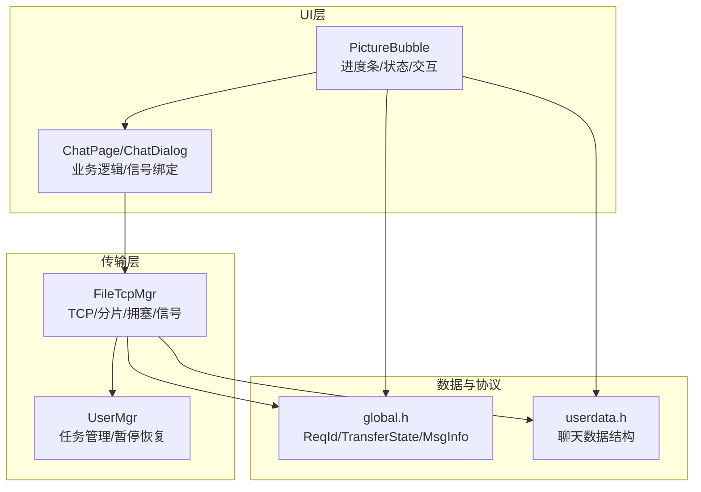
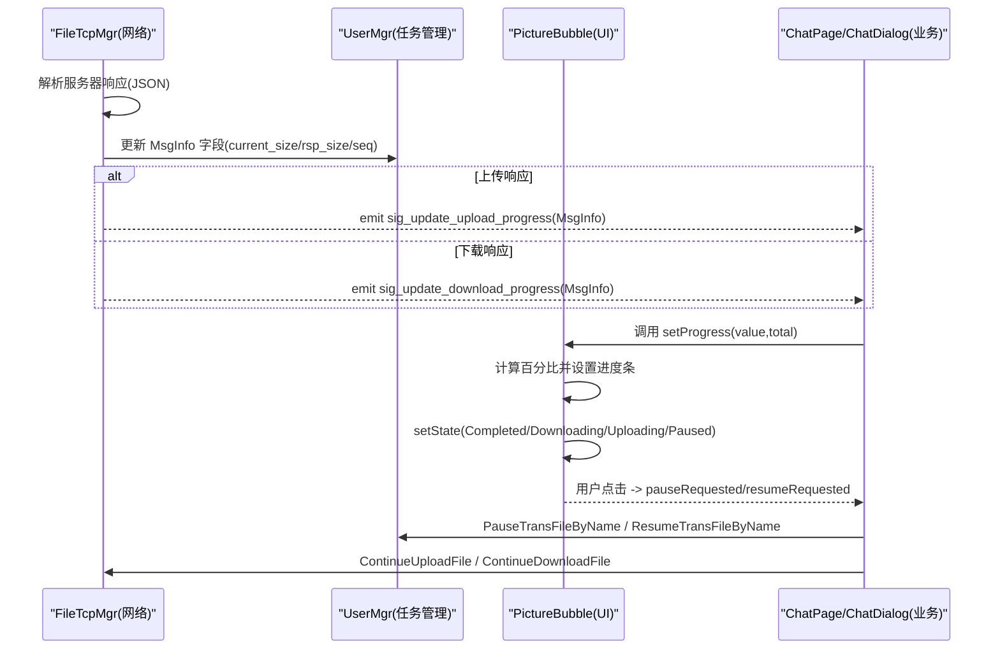
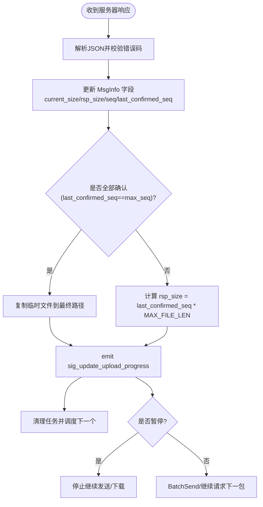
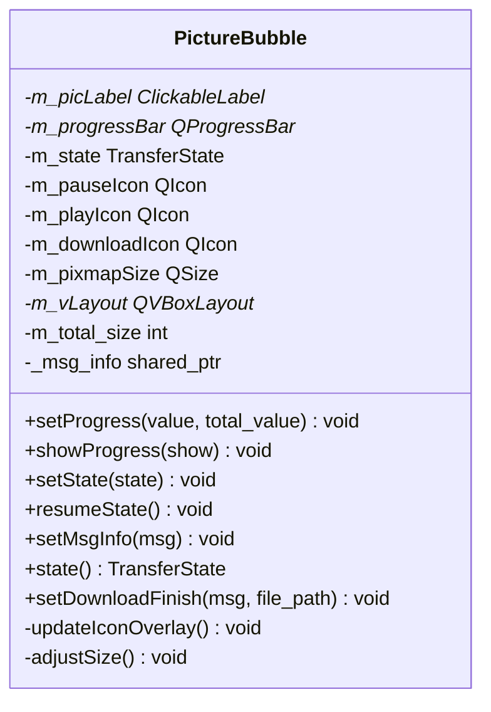
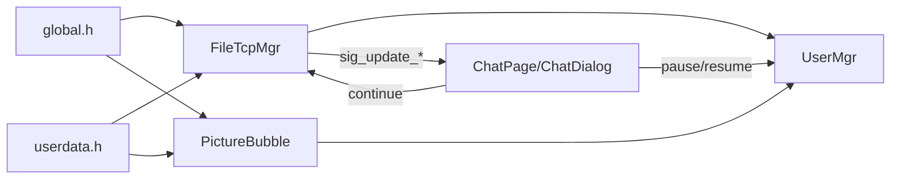

# 进度显示系统

<cite>
**本文引用的文件**   
- [filetcpmgr.h](file://client/llfcchat/include/filetcpmgr.h)
- [filetcpmgr.cpp](file://client/llfcchat/src/filetcpmgr.cpp)
- [global.h](file://client/llfcchat/include/global.h)
- [userdata.h](file://client/llfcchat/include/userdata.h)
- [PictureBubble.h](file://client/llfcchat/include/PictureBubble.h)
- [PictureBubble.cpp](file://client/llfcchat/src/PictureBubble.cpp)
- [usermgr.cpp](file://client/llfcchat/src/usermgr.cpp)
- [day40-聊天图片资源续传和进度显示.md](file://开发文档/day40-聊天图片资源续传和进度显示.md)
- [day41-通知客户端异步下载聊天图片.md](file://开发文档/day41-通知客户端异步下载聊天图片.md)
</cite>

## 目录
1. [简介](#简介)
2. [项目结构](#项目结构)
3. [核心组件](#核心组件)
4. [架构总览](#架构总览)
5. [详细组件分析](#详细组件分析)
6. [依赖关系分析](#依赖关系分析)
7. [性能考虑](#性能考虑)
8. [故障排查指南](#故障排查指南)
9. [结论](#结论)
10. [附录：UI集成示例与最佳实践](#附录ui集成示例与最佳实践)

## 简介
本技术文档聚焦于LLFCChat的文件传输进度显示系统，重点阐述以下方面：
- 信号设计：sig_update_upload_progress 与 sig_update_download_progress 的用途、触发时机与使用模式。
- 进度计算算法：已传输字节数、总大小、百分比更新逻辑，以及基于序列号的分片确认机制。
- Qt 信号槽在进度更新中的应用：跨线程安全更新UI、事件循环驱动、刷新频率控制。
- 状态枚举与状态转换：等待、传输中、暂停、完成、失败等状态的语义与流转。
- UI集成：如何在聊天界面中集成进度条、实时更新显示、用户交互（暂停/继续/重试）。
- 大文件传输的性能考量：内存管理、拥塞窗口、批量发送、I/O与UI刷新频率优化。

## 项目结构
与进度显示相关的代码主要分布在客户端模块：
- 网络与传输层：FileTcpMgr 负责TCP连接、消息收发、分片上传/下载、拥塞控制、进度信号发射。
- 数据模型与全局常量：global.h 定义 ReqId、TransferType、TransferState、MsgInfo 等；userdata.h 提供聊天数据结构。
- UI展示层：PictureBubble 负责图片气泡渲染、进度条显示、用户交互、状态切换。
- 用户会话管理：UserMgr 维护传输任务集合、暂停/恢复、查找空闲任务等。

**图表来源** 
- [filetcpmgr.h:26-84](file://client/llfcchat/include/filetcpmgr.h#L26-L84)
- [filetcpmgr.cpp:175-805](file://client/llfcchat/src/filetcpmgr.cpp#L175-L805)
- [global.h:152-197](file://client/llfcchat/include/global.h#L152-L197)
- [PictureBubble.h:10-52](file://client/llfcchat/include/PictureBubble.h#L10-L52)
- [PictureBubble.cpp:82-149](file://client/llfcchat/src/PictureBubble.cpp#L82-L149)

**章节来源**
- [filetcpmgr.h:26-84](file://client/llfcchat/include/filetcpmgr.h#L26-L84)
- [filetcpmgr.cpp:175-805](file://client/llfcchat/src/filetcpmgr.cpp#L175-L805)
- [global.h:152-197](file://client/llfcchat/include/global.h#L152-L197)
- [PictureBubble.h:10-52](file://client/llfcchat/include/PictureBubble.h#L10-L52)
- [PictureBubble.cpp:82-149](file://client/llfcchat/src/PictureBubble.cpp#L82-L149)

## 核心组件
- FileTcpMgr：封装TCP通信、消息分发、分片上传/下载、拥塞窗口控制、进度信号发射。关键信号包括：
  - sig_update_upload_progress(std::shared_ptr<MsgInfo>)
  - sig_update_download_progress(std::shared_ptr<MsgInfo>)
  - sig_continue_upload_file(QString)
  - sig_continue_download_file(QString)
  - sig_download_finish(std::shared_ptr<MsgInfo>, QString)
- PictureBubble：UI组件，承载图片与进度条，处理用户点击（暂停/继续/重试），根据状态显示/隐藏进度条并更新图标覆盖层。
- UserMgr：集中管理传输任务，支持暂停/恢复、查询空闲任务、按名称获取/删除任务。
- global.h：定义传输类型、传输状态、消息信息结构体、请求ID等。

**章节来源**
- [filetcpmgr.h:26-84](file://client/llfcchat/include/filetcpmgr.h#L26-L84)
- [PictureBubble.h:10-52](file://client/llfcchat/include/PictureBubble.h#L10-L52)
- [usermgr.cpp:474-564](file://client/llfcchat/src/usermgr.cpp#L474-L564)
- [global.h:152-197](file://client/llfcchat/include/global.h#L152-L197)

## 架构总览
下图展示了从网络响应到UI更新的完整流程，突出两个关键信号的触发点与UI消费点。

**图表来源** 
- [filetcpmgr.cpp:521-608](file://client/llfcchat/src/filetcpmgr.cpp#L521-L608)
- [filetcpmgr.cpp:695-805](file://client/llfcchat/src/filetcpmgr.cpp#L695-L805)
- [PictureBubble.cpp:82-149](file://client/llfcchat/src/PictureBubble.cpp#L82-L149)
- [usermgr.cpp:487-514](file://client/llfcchat/src/usermgr.cpp#L487-L514)

## 详细组件分析

### FileTcpMgr：网络与进度信号
- 接收服务器响应后，解析JSON，更新 MsgInfo 的 current_size、rsp_size、total_size、seq、last_confirmed_seq 等字段。
- 上传路径：
  - ID_IMG_CHAT_UPLOAD_RSP、ID_IMG_CHAT_CONTINUE_UPLOAD_RSP、ID_FILE_INFO_SYNC_RSP 均会更新 rsp_seqs 与 last_confirmed_seq，并计算当前已确认大小。
  - 当 last_confirmed_seq == max_seq 时，视为全部完成，复制本地临时文件至最终存储路径，发射 sig_update_upload_progress，清理任务并调度下一个待传文件。
  - 否则，更新 rsp_size = last_confirmed_seq * MAX_FILE_LEN，发射 sig_update_upload_progress，并根据是否仍在上传状态决定是否继续 BatchSend。
- 下载路径：
  - ID_IMG_CHAT_DOWN_RSP 解码Base64数据，按 seq 决定覆盖或追加写入，更新 current_size 与 total_size。
  - is_last 为真时，移除任务并发射 sig_download_finish；否则继续请求下一包。
  - 若处于 Paused 状态，直接返回，不继续请求。
- 拥塞控制：_cwnd_size 限制并发发送包数量，避免网络拥塞。

**图表来源** 
- [filetcpmgr.cpp:521-608](file://client/llfcchat/src/filetcpmgr.cpp#L521-L608)
- [filetcpmgr.cpp:695-805](file://client/llfcchat/src/filetcpmgr.cpp#L695-L805)

**章节来源**
- [filetcpmgr.cpp:521-608](file://client/llfcchat/src/filetcpmgr.cpp#L521-L608)
- [filetcpmgr.cpp:695-805](file://client/llfcchat/src/filetcpmgr.cpp#L695-L805)

### PictureBubble：UI进度与交互
- 构造时创建可点击标签与进度条，设置样式与布局，初始状态为 None。
- setProgress(value, total_value)：计算百分比并设置进度条值；达到100%自动切换到 Completed。
- showProgress(show)：根据状态显示/隐藏进度条，并调整整体尺寸。
- setState(state)：同步 _msg_info 的状态，根据状态显示/隐藏进度条，并在 Completed 后延迟隐藏。
- onPictureClicked()：根据当前状态执行暂停/继续/重试，并发送对应信号给上层。
- updateIconOverlay()：根据状态切换图标覆盖层（暂停/播放/下载图标）。

**图表来源** 
- [PictureBubble.h:10-52](file://client/llfcchat/include/PictureBubble.h#L10-L52)
- [PictureBubble.cpp:82-149](file://client/llfcchat/src/PictureBubble.cpp#L82-L149)

**章节来源**
- [PictureBubble.h:10-52](file://client/llfcchat/include/PictureBubble.h#L10-L52)
- [PictureBubble.cpp:82-149](file://client/llfcchat/src/PictureBubble.cpp#L82-L149)

### UserMgr：任务管理与状态切换
- PauseTransFileByName(name)：将指定任务的 _transfer_state 设置为 Paused。
- ResumeTransFileByName(name)：根据 _transfer_type 恢复为 Downloading 或 Uploading。
- TransFileIsUploading(name)：判断是否处于上传状态，用于控制后续发送逻辑。
- GetFreeUploadFile()/GetFreeDownloadFile()：查找非暂停且类型为上传/下载的任务，供批量发送调度。

**章节来源**
- [usermgr.cpp:487-514](file://client/llfcchat/src/usermgr.cpp#L487-L514)
- [usermgr.cpp:516-564](file://client/llfcchat/src/usermgr.cpp#L516-L564)

### 全局数据模型与状态枚举
- TransferType：None、Download、Upload。
- TransferState：None、Downloading、Uploading、Paused、Completed、Failed。
- MsgInfo：包含消息类型、URL/文本、预览图、唯一名、总大小、当前大小、序列号、MD5、已确认序列集合、飞行中序列集合、最后确认序列、最大序列、消息ID、服务器确认大小、线程ID、传输状态、传输类型、发送者/接收者ID。

**章节来源**
- [global.h:152-197](file://client/llfcchat/include/global.h#L152-L197)

## 依赖关系分析
- FileTcpMgr 依赖 global.h 中的 ReqId、TransferType、TransferState、MsgInfo 等定义。
- PictureBubble 依赖 global.h 中的 TransferType、TransferState、MsgInfo，并通过信号与上层交互。
- UserMgr 通过互斥锁保护传输任务集合，确保多线程安全。
- 信号流：FileTcpMgr 发射进度信号 -> ChatPage/ChatDialog 接收并调用 PictureBubble 更新UI -> 用户交互回调 -> UserMgr 修改状态 -> FileTcpMgr 继续/暂停传输。

**图表来源** 
- [filetcpmgr.h:26-84](file://client/llfcchat/include/filetcpmgr.h#L26-L84)
- [global.h:152-197](file://client/llfcchat/include/global.h#L152-L197)
- [PictureBubble.h:10-52](file://client/llfcchat/include/PictureBubble.h#L10-L52)
- [usermgr.cpp:487-514](file://client/llfcchat/src/usermgr.cpp#L487-L514)

**章节来源**
- [filetcpmgr.h:26-84](file://client/llfcchat/include/filetcpmgr.h#L26-L84)
- [global.h:152-197](file://client/llfcchat/include/global.h#L152-L197)
- [PictureBubble.h:10-52](file://client/llfcchat/include/PictureBubble.h#L10-L52)
- [usermgr.cpp:487-514](file://client/llfcchat/src/usermgr.cpp#L487-L514)

## 性能考虑
- 拥塞窗口控制：MAX_CWND_SIZE 限制并发发送包数量，避免网络拥塞导致丢包重传。
- 分片大小：MAX_FILE_LEN 固定分片大小，平衡I/O效率与内存占用。
- 批量发送：BatchSend 在拥塞窗口允许范围内连续发送多个分片，提高吞吐。
- I/O策略：下载时首包覆盖写入，后续追加写入；上传时 seek 到已发送位置继续读取，减少重复I/O。
- UI刷新频率：进度更新通过Qt事件循环驱动，建议在高频场景下合并更新或使用节流策略，避免频繁重绘。
- 内存管理：使用 std::shared_ptr<MsgInfo> 共享数据，避免拷贝开销；及时清理已完成任务。

[本节为通用性能建议，不直接分析具体文件]

## 故障排查指南
- JSON解析失败：检查服务器响应格式，确保 error 字段存在且值为 SUCCESS。
- 文件路径问题：确认 client_path 与存储目录存在，必要时创建目录。
- 暂停/恢复异常：检查 UserMgr 中状态是否正确切换，确保 continue 信号正确触发。
- 进度不更新：确认 sig_update_* 信号已连接到UI更新槽函数，且 MsgInfo 字段已正确更新。
- 下载未完成：检查 is_last 标志与 seq 递增逻辑，确保最后一包正确处理。

**章节来源**
- [filetcpmgr.cpp:334-433](file://client/llfcchat/src/filetcpmgr.cpp#L334-L433)
- [filetcpmgr.cpp:695-805](file://client/llfcchat/src/filetcpmgr.cpp#L695-L805)
- [usermgr.cpp:487-514](file://client/llfcchat/src/usermgr.cpp#L487-L514)

## 结论
LLFCChat的进度显示系统通过清晰的信号槽机制与状态管理，实现了可靠的文件传输进度反馈。FileTcpMgr负责网络与分片逻辑，PictureBubble负责UI展示与交互，UserMgr协调任务状态。通过拥塞控制、分片策略与I/O优化，系统在大数据量传输场景下具备良好的性能与稳定性。

[本节为总结性内容，不直接分析具体文件]

## 附录：UI集成示例与最佳实践
- 信号连接：在ChatPage/ChatDialog中连接 FileTcpMgr 的 sig_update_upload_progress 与 sig_update_download_progress 到UI更新槽函数。
- 进度更新：槽函数中调用 PictureBubble::setProgress(value, total_value)，并调用 setState(state) 更新状态。
- 用户交互：处理 PictureBubble 的 pauseRequested/resumeRequested 信号，调用 UserMgr 的暂停/恢复方法，并触发 FileTcpMgr 的 continue 方法。
- 状态同步：确保 _msg_info 的状态与UI状态一致，避免不一致导致的显示错误。
- 性能优化：在高频率进度更新场景下，可使用定时器节流或合并多次更新，减少UI重绘次数。

**章节来源**
- [day40-聊天图片资源续传和进度显示.md:633-795](file://开发文档/day40-聊天图片资源续传和进度显示.md#L633-L795)
- [day41-通知客户端异步下载聊天图片.md:956-1020](file://开发文档/day41-通知客户端异步下载聊天图片.md#L956-L1020)
- [PictureBubble.cpp:189-217](file://client/llfcchat/src/PictureBubble.cpp#L189-L217)