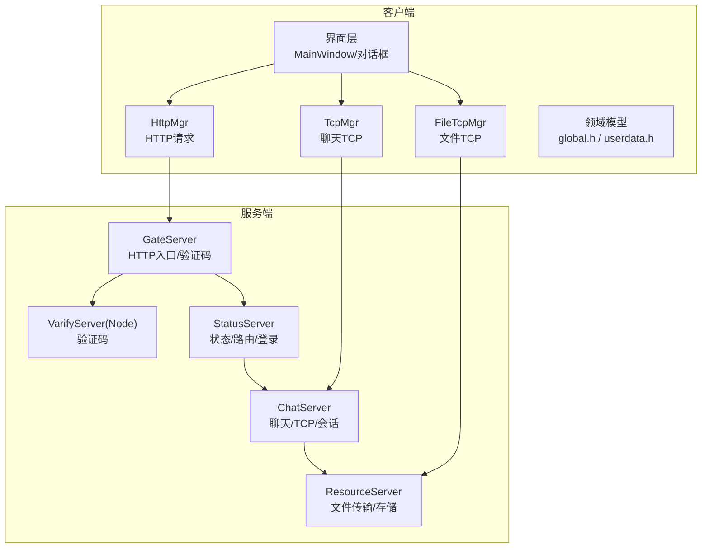
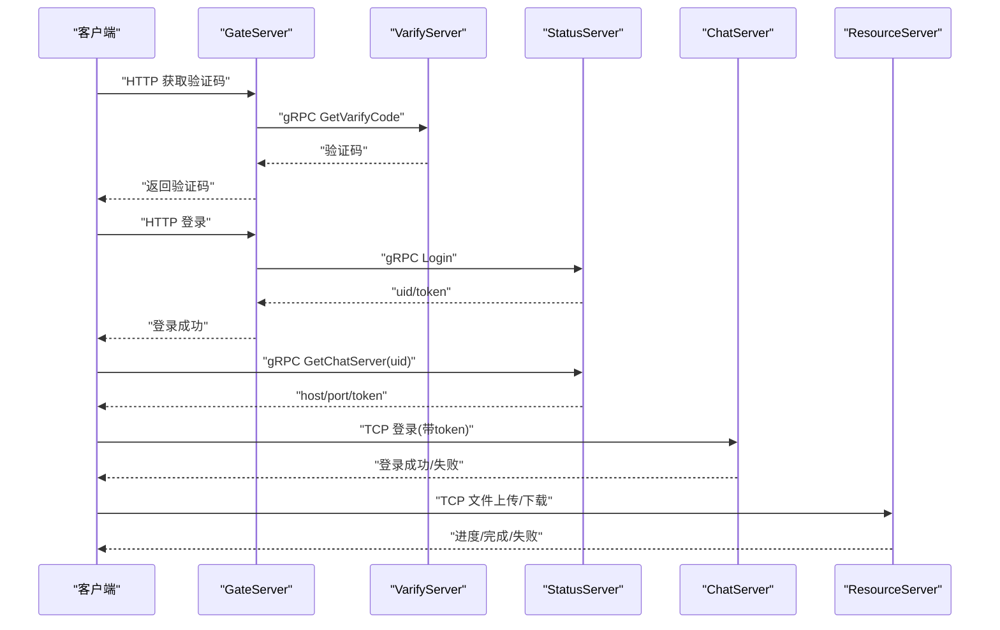
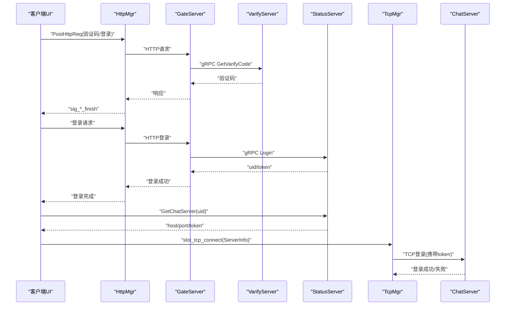
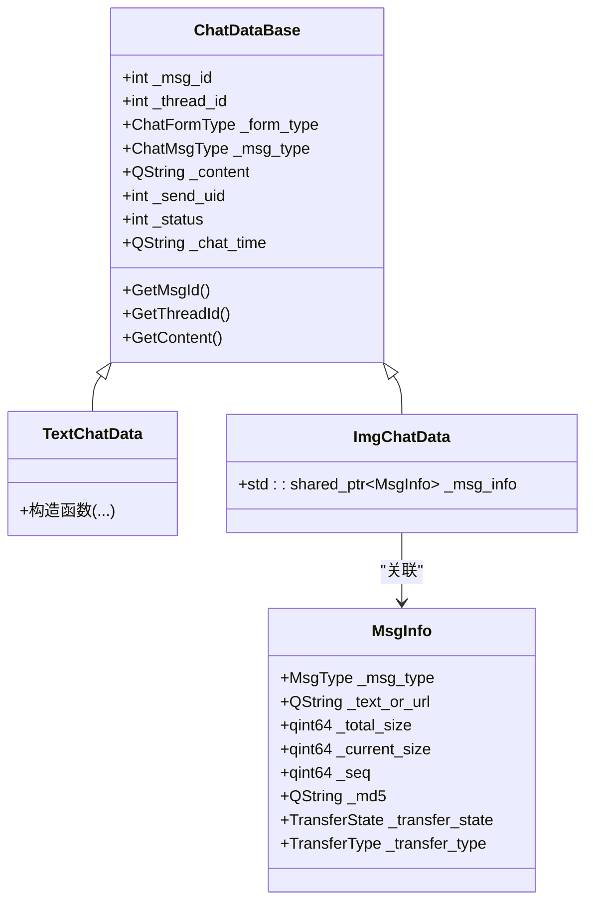
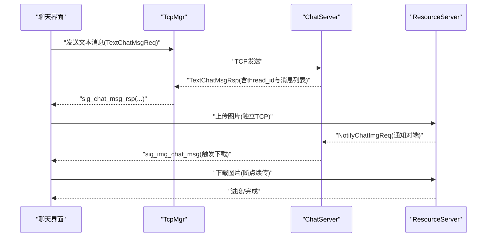
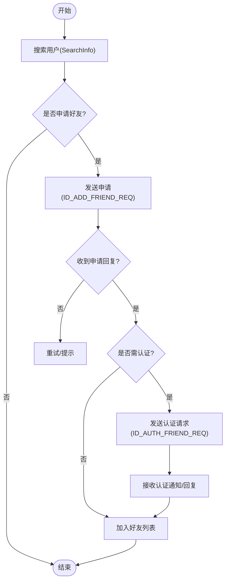
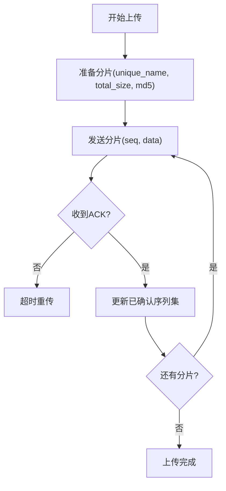
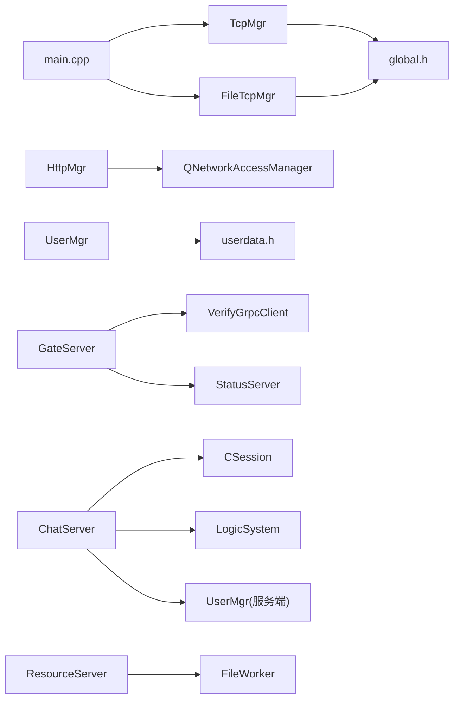

# 核心功能模块

<cite>
**本文引用的文件**   
- [README.md](file://README.md)
- [global.h](file://client/llfcchat/include/global.h)
- [userdata.h](file://client/llfcchat/include/userdata.h)
- [tcpmgr.h](file://client/llfcchat/include/tcpmgr.h)
- [httpmgr.h](file://client/llfcchat/include/httpmgr.h)
- [filetcpmgr.h](file://client/llfcchat/include/filetcpmgr.h)
- [main.cpp](file://client/llfcchat/src/main.cpp)
- [chat.proto](file://proto/chat_service/chat.proto)
- [status.proto](file://proto/status_service/status.proto)
- [verify.proto](file://proto/verify_service/verify.proto)
- [CSession.h](file://server/ChatServer/include/CSession.h)
- [UserMgr.h](file://server/ChatServer/include/UserMgr.h)
- [LogicSystem.h](file://server/ChatServer/include/LogicSystem.h)
- [CServer.h](file://server/ChatServer/include/CServer.h)
- [VerifyGrpcClient.h](file://server/GateServer/include/VerifyGrpcClient.h)
- [StatusServiceImpl.h](file://server/StatusServer/include/StatusServiceImpl.h)
- [FileWorker.h](file://server/ResourceServer/include/FileWorker.h)
</cite>

## 目录
1. [引言](#引言)
2. [项目结构](#项目结构)
3. [核心组件](#核心组件)
4. [架构总览](#架构总览)
5. [详细组件分析](#详细组件分析)
6. [依赖关系分析](#依赖关系分析)
7. [性能与并发](#性能与并发)
8. [故障排查指南](#故障排查指南)
9. [结论](#结论)
10. [附录：接口与数据模型速查](#附录接口与数据模型速查)

## 引言
本文件面向LLFCChat的核心功能模块，系统性阐述用户认证、聊天消息、好友管理与文件传输四大子系统的实现细节。文档从客户端与服务端双向视角出发，覆盖调用关系、协议定义、领域模型、配置项与返回值、并发与实时通信方案，并给出常见问题定位思路与优化建议。内容兼顾初学者可读性与资深开发者的技术深度。

## 项目结构
- 客户端（Qt/C++）
  - UI与业务逻辑位于 client/llfcchat/src 与 include
  - 网络层：HTTP管理（注册/登录/重置等）、TCP长连接（聊天与状态）、独立文件传输TCP通道
  - 领域模型：用户信息、会话、消息、传输状态等集中在 global.h 与 userdata.h
- 服务端（C++/Node.js）
  - GateServer：HTTP入口与验证码分发（对接Node.js验证服务）
  - StatusServer：状态与路由（分配ChatServer实例、登录鉴权）
  - ChatServer：聊天主服务（TCP接入、会话管理、消息转发、心跳、踢人、图片通知）
  - ResourceServer：资源与文件传输（上传/下载、断点续传、进度回调）
  - VarifyServer（Node.js）：验证码生成与派发
- 协议定义（gRPC + 自定义TCP帧）
  - proto/chat_service/chat.proto：聊天相关通知与消息
  - proto/status_service/status.proto：状态与登录路由
  - proto/verify_service/verify.proto：验证码获取

**图表来源** 
- [main.cpp:1-44](file://client/llfcchat/src/main.cpp#L1-L44)
- [httpmgr.h:1-34](file://client/llfcchat/include/httpmgr.h#L1-L34)
- [tcpmgr.h:1-90](file://client/llfcchat/include/tcpmgr.h#L1-L90)
- [filetcpmgr.h:1-85](file://client/llfcchat/include/filetcpmgr.h#L1-L85)
- [status.proto:1-32](file://proto/status_service/status.proto#L1-L32)
- [verify.proto:1-19](file://proto/verify_service/verify.proto#L1-L19)
- [chat.proto:1-105](file://proto/chat_service/chat.proto#L1-L105)

**章节来源**
- [README.md:1-112](file://README.md#L1-L112)
- [main.cpp:1-44](file://client/llfcchat/src/main.cpp#L1-L44)

## 核心组件
- 客户端
  - HttpMgr：封装HTTP请求，统一返回结果与错误码，按模块分发回调
  - TcpMgr：维护与ChatServer的TCP长连接，处理粘包/拆包、消息分发、信号回调
  - FileTcpMgr：独立文件传输通道，支持批量发送、拥塞控制、断点续传、进度回调
  - UserMgr：本地用户信息、好友列表、申请列表、聊天线程缓存、文件传输状态
  - 领域模型：MsgInfo、ChatDataBase/TextChatData/ImgChatData、ChatThreadData、TransferState等
- 服务端
  - CServer/CSession：基于Boost.Asio的异步IO、会话生命周期、心跳检测、异常处理
  - LogicSystem：消息队列+工作线程，按消息ID分派处理器（登录、搜索、好友、聊天、心跳等）
  - UserMgr（服务端）：UID到Session映射，用于消息投递与踢人
  - VerifyGrpcClient：验证码gRPC客户端，连接池复用
  - StatusServiceImpl：状态服务实现，分配ChatServer地址、登录校验
  - FileWorker/DownloadWorker：文件上传/下载任务队列与回调

**章节来源**
- [tcpmgr.h:1-90](file://client/llfcchat/include/tcpmgr.h#L1-L90)
- [filetcpmgr.h:1-85](file://client/llfcchat/include/filetcpmgr.h#L1-L85)
- [httpmgr.h:1-34](file://client/llfcchat/include/httpmgr.h#L1-L34)
- [usermgr.h:1-116](file://client/llfcchat/include/usermgr.h#L1-L116)
- [global.h:1-296](file://client/llfcchat/include/global.h#L1-L296)
- [userdata.h:1-288](file://client/llfcchat/include/userdata.h#L1-L288)
- [CServer.h:1-33](file://server/ChatServer/include/CServer.h#L1-L33)
- [CSession.h:1-86](file://server/ChatServer/include/CSession.h#L1-L86)
- [LogicSystem.h:1-60](file://server/ChatServer/include/LogicSystem.h#L1-L60)
- [UserMgr.h:1-22](file://server/ChatServer/include/UserMgr.h#L1-L22)
- [VerifyGrpcClient.h:1-113](file://server/GateServer/include/VerifyGrpcClient.h#L1-L113)
- [StatusServiceImpl.h:1-52](file://server/StatusServer/include/StatusServiceImpl.h#L1-L52)
- [FileWorker.h:1-91](file://server/ResourceServer/include/FileWorker.h#L1-L91)

## 架构总览
整体采用“网关+状态+聊天+资源”的分布式架构：
- 客户端通过HTTP访问GateServer完成注册/登录/验证码；随后由StatusServer分配ChatServer与Token
- 客户端建立与ChatServer的TCP长连接，进行聊天消息与状态同步
- 文件传输走独立的ResourceServer，支持断点续传与进度上报
- gRPC用于服务间通信（验证码、状态路由、聊天通知）

**图表来源** 
- [verify.proto:1-19](file://proto/verify_service/verify.proto#L1-L19)
- [status.proto:1-32](file://proto/status_service/status.proto#L1-L32)
- [chat.proto:1-105](file://proto/chat_service/chat.proto#L1-L105)
- [VerifyGrpcClient.h:1-113](file://server/GateServer/include/VerifyGrpcClient.h#L1-L113)
- [StatusServiceImpl.h:1-52](file://server/StatusServer/include/StatusServiceImpl.h#L1-L52)

## 详细组件分析

### 用户认证系统
- 流程
  - 客户端通过HttpMgr向GateServer发起验证码、注册、重置、登录请求
  - GateServer调用VerifyGrpcClient获取验证码（gRPC），调用StatusServer进行登录校验与路由
  - StatusServer返回ChatServer的地址与Token，客户端据此建立与ChatServer的TCP连接
- 关键接口与数据
  - 验证码：GetVarifyReq/GetVarifyRsp
  - 登录：LoginReq/LoginRsp、GetChatServerReq/GetChatServerRsp
- 错误码与返回
  - ErrorCodes（JSON解析失败、网络错误等）
  - gRPC返回error字段表示失败

**图表来源** 
- [httpmgr.h:1-34](file://client/llfcchat/include/httpmgr.h#L1-L34)
- [verify.proto:1-19](file://proto/verify_service/verify.proto#L1-L19)
- [status.proto:1-32](file://proto/status_service/status.proto#L1-L32)
- [tcpmgr.h:1-90](file://client/llfcchat/include/tcpmgr.h#L1-L90)

**章节来源**
- [httpmgr.h:1-34](file://client/llfcchat/include/httpmgr.h#L1-L34)
- [verify.proto:1-19](file://proto/verify_service/verify.proto#L1-L19)
- [status.proto:1-32](file://proto/status_service/status.proto#L1-L32)
- [VerifyGrpcClient.h:1-113](file://server/GateServer/include/VerifyGrpcClient.h#L1-L113)
- [StatusServiceImpl.h:1-52](file://server/StatusServer/include/StatusServiceImpl.h#L1-L52)

### 聊天消息系统
- 领域模型
  - MsgType/ChatMsgType：文本、图片、视频、文件
  - ChatDataBase/TextChatData/ImgChatData：消息基类与具体类型
  - ChatThreadData：会话级消息缓存、未回复消息、最后一条消息
  - TransferState/TransferType：传输状态与方向
- 协议与消息流
  - TextChatMsgReq/Rsp：文本消息请求与回复
  - NotifyChatImgReq/Rsp：图片消息通知（先通知后下载）
  - 客户端使用TcpMgr发送/接收消息，并通过信号回调更新UI
- 实时性保障
  - 心跳机制：客户端定时发送心跳，服务端检测过期并踢出异常会话
  - 消息确认：服务端回包包含thread_id与消息列表，客户端根据唯一标识去重与排序

**图表来源** 
- [userdata.h:144-234](file://client/llfcchat/include/userdata.h#L144-L234)
- [global.h:145-200](file://client/llfcchat/include/global.h#L145-L200)

**图表来源** 
- [chat.proto:1-105](file://proto/chat_service/chat.proto#L1-L105)
- [tcpmgr.h:1-90](file://client/llfcchat/include/tcpmgr.h#L1-L90)
- [filetcpmgr.h:1-85](file://client/llfcchat/include/filetcpmgr.h#L1-L85)

**章节来源**
- [global.h:145-200](file://client/llfcchat/include/global.h#L145-L200)
- [userdata.h:144-234](file://client/llfcchat/include/userdata.h#L144-L234)
- [chat.proto:1-105](file://proto/chat_service/chat.proto#L1-L105)
- [tcpmgr.h:1-90](file://client/llfcchat/include/tcpmgr.h#L1-L90)

### 好友管理系统
- 能力范围
  - 搜索用户、提交好友申请、认证好友、维护联系人列表与申请列表
- 数据模型
  - SearchInfo、AddFriendApply、ApplyInfo、AuthInfo/AuthRsp
- 交互流程
  - 客户端通过TcpMgr发送申请/认证请求，服务端通过gRPC通知对方或返回结果
  - 本地UserMgr维护申请列表与好友列表，提供查询与去重

**图表来源** 
- [global.h:43-88](file://client/llfcchat/include/global.h#L43-L88)
- [userdata.h:11-64](file://client/llfcchat/include/userdata.h#L11-L64)
- [chat.proto:14-51](file://proto/chat_service/chat.proto#L14-L51)

**章节来源**
- [userdata.h:11-64](file://client/llfcchat/include/userdata.h#L11-L64)
- [global.h:43-88](file://client/llfcchat/include/global.h#L43-L88)
- [chat.proto:14-51](file://proto/chat_service/chat.proto#L14-L51)

### 文件传输系统
- 设计要点
  - 独立TCP通道（FileTcpMgr），与聊天通道解耦
  - 拥塞控制：cwnd_size限制并发发送量，避免阻塞
  - 断点续传：基于unique_name与序列号，支持暂停/恢复
  - 进度回调：上传/下载进度实时更新UI
- 数据结构
  - DownloadInfo、MsgInfo（含_md5、_total_size、_seq、_rsp_size等）
  - FileWorker/DownloadWorker：任务队列与回调
- 典型流程
  - 上传：批量发送分片，服务器确认序列号，客户端维护已发送未确认集合
  - 下载：根据服务器返回的分片大小与MD5校验，断点续传

**图表来源** 
- [filetcpmgr.h:1-85](file://client/llfcchat/include/filetcpmgr.h#L1-L85)
- [global.h:167-197](file://client/llfcchat/include/global.h#L167-L197)
- [FileWorker.h:1-91](file://server/ResourceServer/include/FileWorker.h#L1-L91)

**章节来源**
- [filetcpmgr.h:1-85](file://client/llfcchat/include/filetcpmgr.h#L1-L85)
- [global.h:167-197](file://client/llfcchat/include/global.h#L167-L197)
- [FileWorker.h:1-91](file://server/ResourceServer/include/FileWorker.h#L1-L91)

## 依赖关系分析
- 客户端内部依赖
  - main.cpp启动样式加载、读取config.ini、创建TcpThread与FileTcpThread
  - HttpMgr依赖QNetworkAccessManager；TcpMgr/FileTcpMgr依赖QTcpSocket与全局常量
  - UserMgr聚合本地状态（用户、好友、申请、聊天线程、文件传输）
- 服务端依赖
  - GateServer依赖VerifyGrpcClient与ConfigMgr
  - StatusServer维护ChatServer注册表与Token映射
  - ChatServer依赖CSession/UserMgr/LogicSystem，通过gRPC与其他服务通信
  - ResourceServer依赖FileWorker/DownloadWorker进行IO调度

**图表来源** 
- [main.cpp:1-44](file://client/llfcchat/src/main.cpp#L1-L44)
- [tcpmgr.h:1-90](file://client/llfcchat/include/tcpmgr.h#L1-L90)
- [filetcpmgr.h:1-85](file://client/llfcchat/include/filetcpmgr.h#L1-L85)
- [httpmgr.h:1-34](file://client/llfcchat/include/httpmgr.h#L1-L34)
- [usermgr.h:1-116](file://client/llfcchat/include/usermgr.h#L1-L116)
- [VerifyGrpcClient.h:1-113](file://server/GateServer/include/VerifyGrpcClient.h#L1-L113)
- [CSession.h:1-86](file://server/ChatServer/include/CSession.h#L1-L86)
- [LogicSystem.h:1-60](file://server/ChatServer/include/LogicSystem.h#L1-L60)
- [UserMgr.h:1-22](file://server/ChatServer/include/UserMgr.h#L1-L22)
- [FileWorker.h:1-91](file://server/ResourceServer/include/FileWorker.h#L1-L91)

**章节来源**
- [main.cpp:1-44](file://client/llfcchat/src/main.cpp#L1-L44)
- [usermgr.h:1-116](file://client/llfcchat/include/usermgr.h#L1-L116)
- [VerifyGrpcClient.h:1-113](file://server/GateServer/include/VerifyGrpcClient.h#L1-L113)
- [CSession.h:1-86](file://server/ChatServer/include/CSession.h#L1-L86)
- [LogicSystem.h:1-60](file://server/ChatServer/include/LogicSystem.h#L1-L60)
- [FileWorker.h:1-91](file://server/ResourceServer/include/FileWorker.h#L1-L91)

## 性能与并发
- 实时通信
  - 心跳机制：CSession维护_last_heartbeat，IsHeartbeatExpired判断过期；LogicSystem定期清理异常会话
  - 异步IO：Boost.Asio事件循环，非阻塞读写，减少线程切换开销
- 数据同步
  - 客户端侧：ChatThreadData维护消息Map与未回复Map，保证顺序与一致性
  - 服务端侧：LogicSystem单消费者队列，避免竞争；UserMgr以unordered_map快速查找Session
- 并发处理
  - 文件传输：FileWorker/DownloadWorker各自工作线程，条件变量驱动任务队列
  - 拥塞控制：FileTcpMgr的_cwnd_size限制并发分片数，避免拥塞
- 内存与I/O
  - 大文件分片传输，降低内存峰值
  - 图片资源异步下载与缩略图占位，提升UI流畅度

[本节为通用性能讨论，不直接分析具体文件]

## 故障排查指南
- 登录失败
  - 检查验证码是否正确、邮箱格式、密码匹配
  - 查看StatusServer返回error字段与Token有效性
- 聊天消息丢失/乱序
  - 核对客户端唯一标识（unique_id）与消息序号（seq）
  - 检查TcpMgr粘包处理与handleMsg分发
- 文件传输中断
  - 确认服务器ACK序列与客户端_flighting_seqs一致
  - 检查_cwnd_size与网络状况，必要时调整拥塞窗口
- 会话掉线
  - 观察心跳间隔与超时阈值，确保客户端定时发送心跳
  - 服务端CSession.IsHeartbeatExpired与DealExceptionSession日志

**章节来源**
- [tcpmgr.h:1-90](file://client/llfcchat/include/tcpmgr.h#L1-L90)
- [filetcpmgr.h:1-85](file://client/llfcchat/include/filetcpmgr.h#L1-L85)
- [CSession.h:1-86](file://server/ChatServer/include/CSession.h#L1-L86)
- [LogicSystem.h:1-60](file://server/ChatServer/include/LogicSystem.h#L1-L60)

## 结论
LLFCChat通过分层清晰的客户端/服务端架构与gRPC+TCP混合通信，实现了稳定的认证、聊天、好友管理与文件传输能力。其并发模型与数据同步策略在保证实时性的同时兼顾了可扩展性与鲁棒性。建议在后续迭代中继续优化拥塞控制参数、增强错误恢复与监控告警，以提升用户体验与运维可观测性。

[本节为总结性内容，不直接分析具体文件]

## 附录：接口与数据模型速查
- gRPC接口
  - 验证码：GetVarifyReq/GetVarifyRsp
  - 状态与登录：GetChatServerReq/Rsp、LoginReq/Rsp
  - 聊天通知：NotifyAddFriend、NotifyAuthFriend、NotifyTextChatMsg、NotifyKickUser、NotifyChatImgMsg
- 客户端消息ID（ReqId）
  - 登录/注册/重置、聊天消息、好友申请/认证、心跳、文件同步/下载等
- 领域模型
  - MsgInfo：传输元数据（大小、MD5、序列、状态）
  - ChatDataBase/TextChatData/ImgChatData：消息抽象与具体类型
  - ChatThreadData：会话消息缓存与未回复消息
  - TransferState/TransferType：传输状态与方向

**章节来源**
- [verify.proto:1-19](file://proto/verify_service/verify.proto#L1-L19)
- [status.proto:1-32](file://proto/status_service/status.proto#L1-L32)
- [chat.proto:1-105](file://proto/chat_service/chat.proto#L1-L105)
- [global.h:43-88](file://client/llfcchat/include/global.h#L43-L88)
- [global.h:145-200](file://client/llfcchat/include/global.h#L145-L200)
- [userdata.h:144-234](file://client/llfcchat/include/userdata.h#L144-L234)