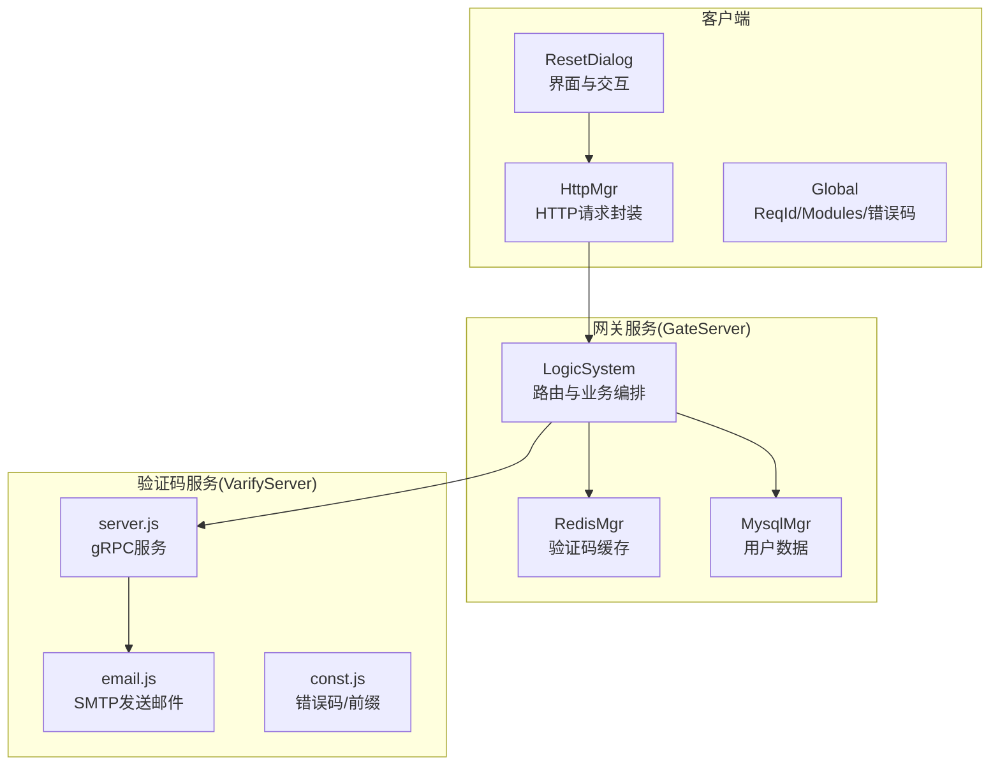
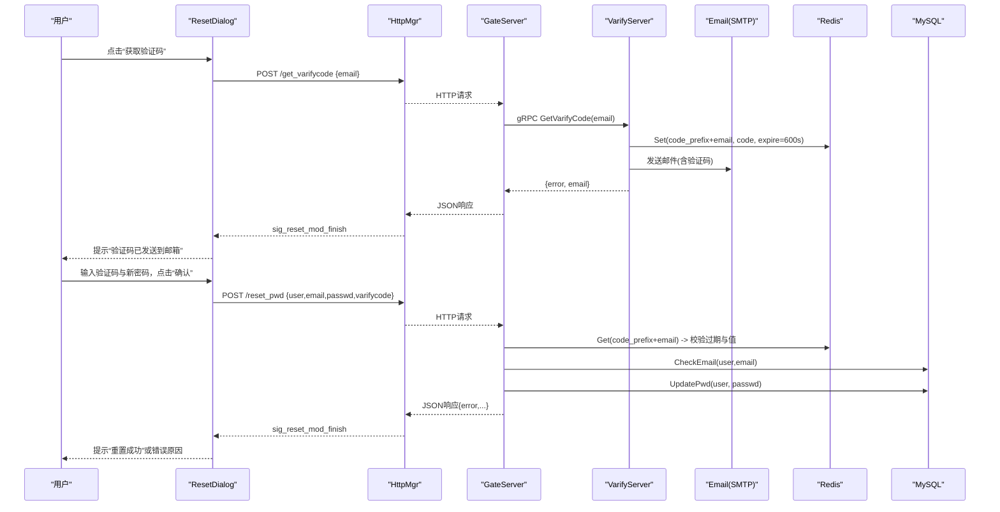
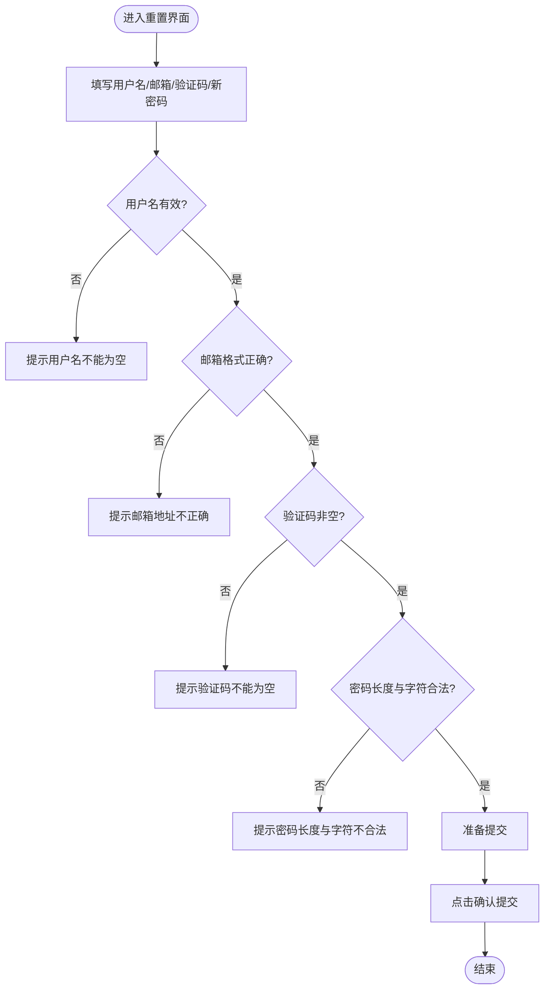
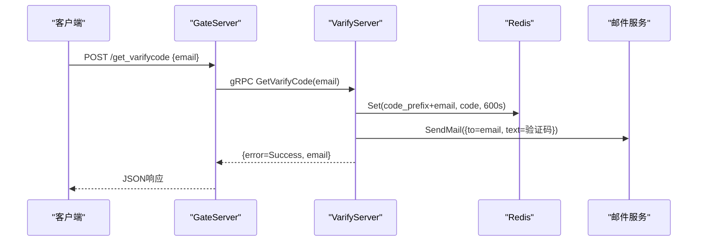
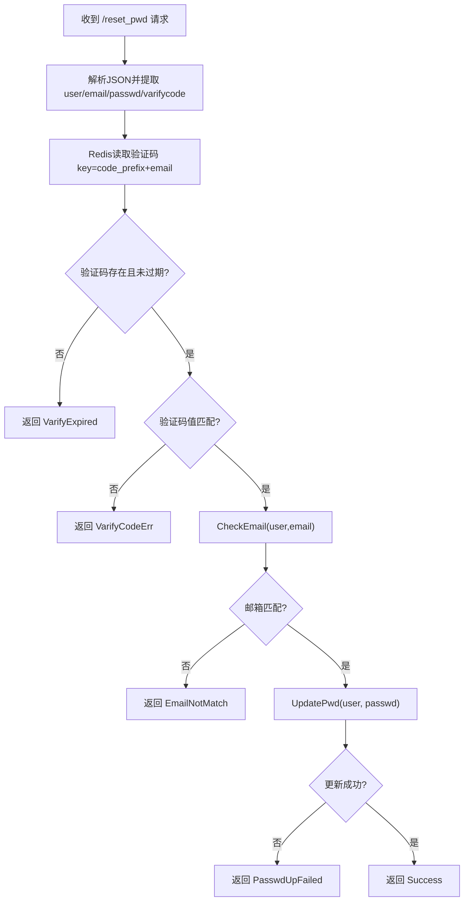
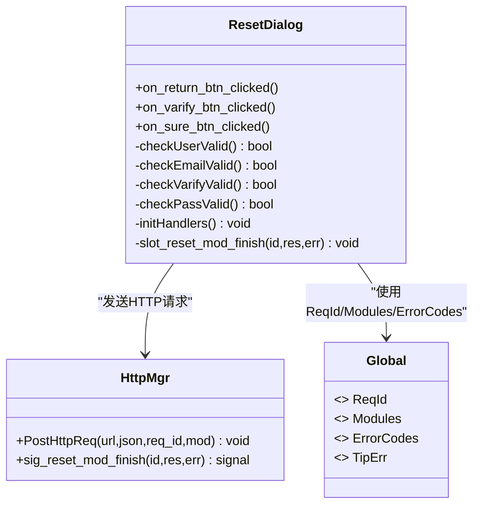
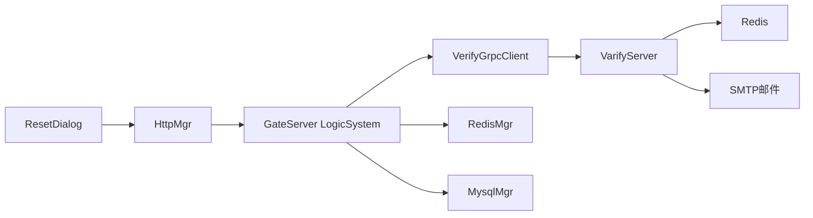

# 密码重置功能

<cite>
**本文引用的文件**   
- [resetdialog.h](file://client/llfcchat/include/resetdialog.h)
- [resetdialog.cpp](file://client/llfcchat/src/resetdialog.cpp)
- [resetdialog.ui](file://client/llfcchat/ui/resetdialog.ui)
- [global.h](file://client/llfcchat/include/global.h)
- [httpmgr.h](file://client/llfcchat/include/httpmgr.h)
- [verify.proto](file://proto/verify_service/verify.proto)
- [server.js](file://server/VarifyServer/server.js)
- [email.js](file://server/VarifyServer/email.js)
- [const.js](file://server/VarifyServer/const.js)
- [LogicSystem.cpp](file://server/GateServer/src/LogicSystem.cpp)
- [const.h](file://server/GateServer/include/const.h)
</cite>

## 目录
1. [简介](#简介)
2. [项目结构](#项目结构)
3. [核心组件](#核心组件)
4. [架构总览](#架构总览)
5. [详细组件分析](#详细组件分析)
6. [依赖关系分析](#依赖关系分析)
7. [性能与安全考虑](#性能与安全考虑)
8. [故障排查指南](#故障排查指南)
9. [结论](#结论)
10. [附录：API与配置](#附录api与配置)

## 简介
本技术文档围绕 LLFCChat 的“密码重置”功能，系统性梳理客户端 ResetDialog 的实现、验证码获取与校验、新密码设置流程，以及服务端 GateServer 与 VarifyServer 的协作机制。重点说明安全策略（验证码有效期、Redis 缓存、邮箱发送）、错误处理策略、接口参数与响应格式，并给出流程图与调用示例，帮助读者快速理解与排障。

## 项目结构
密码重置涉及客户端 UI 与网络层、网关服务、验证码服务与邮件模块、Redis 缓存等。关键文件分布如下：
- 客户端界面与逻辑：resetdialog.h/.cpp/.ui
- 客户端全局常量与 HTTP 管理：global.h、httpmgr.h
- 协议定义：verify.proto
- 验证码服务（Node.js）：server.js、email.js、const.js
- 网关服务（C++）：GateServer LogicSystem.cpp、const.h

图表来源
- [resetdialog.cpp:1-252](file://client/llfcchat/src/resetdialog.cpp#L1-L252)
- [httpmgr.h:1-34](file://client/llfcchat/include/httpmgr.h#L1-L34)
- [global.h:91-111](file://client/llfcchat/include/global.h#L91-L111)
- [LogicSystem.cpp:110-141](file://server/GateServer/src/LogicSystem.cpp#L110-L141)
- [server.js:1-76](file://server/VarifyServer/server.js#L1-L76)
- [email.js:1-37](file://server/VarifyServer/email.js#L1-L37)
- [const.js:1-10](file://server/VarifyServer/const.js#L1-L10)

章节来源
- [resetdialog.h:1-44](file://client/llfcchat/include/resetdialog.h#L1-L44)
- [resetdialog.cpp:1-252](file://client/llfcchat/src/resetdialog.cpp#L1-L252)
- [resetdialog.ui:1-317](file://client/llfcchat/ui/resetdialog.ui#L1-L317)
- [global.h:91-111](file://client/llfcchat/include/global.h#L91-L111)
- [httpmgr.h:1-34](file://client/llfcchat/include/httpmgr.h#L1-L34)
- [verify.proto:1-19](file://proto/verify_service/verify.proto#L1-L19)
- [server.js:1-76](file://server/VarifyServer/server.js#L1-L76)
- [email.js:1-37](file://server/VarifyServer/email.js#L1-L37)
- [const.js:1-10](file://server/VarifyServer/const.js#L1-L10)
- [LogicSystem.cpp:110-141](file://server/GateServer/src/LogicSystem.cpp#L110-L141)
- [const.h:31-44](file://server/GateServer/include/const.h#L31-L44)

## 核心组件
- ResetDialog：负责用户名、邮箱、验证码、新密码输入与校验；触发“获取验证码”和“重置密码”两个 HTTP 请求；根据返回结果提示用户。
- HttpMgr：统一封装 HTTP POST 请求，按 ReqId 分发回调信号，供各模块订阅处理。
- GateServer LogicSystem：注册 /get_varifycode 与 /reset_pwd 两个 HTTP 路由；前者通过 gRPC 调用 VarifyServer 生成验证码并写入 Redis；后者校验验证码、匹配用户邮箱、更新密码。
- VarifyServer：实现 gRPC GetVarifyCode，生成短验证码、存入 Redis（带过期时间），并通过 SMTP 发送邮件。
- 邮件模块 email.js：基于 nodemailer 连接 SMTP 服务器发送邮件。
- 常量与错误码：全局 ReqId、Modules、ErrorCodes 及服务端 ErrorCodes 枚举，用于前后端一致的错误语义。

章节来源
- [resetdialog.cpp:1-252](file://client/llfcchat/src/resetdialog.cpp#L1-L252)
- [httpmgr.h:1-34](file://client/llfcchat/include/httpmgr.h#L1-L34)
- [LogicSystem.cpp:110-141](file://server/GateServer/src/LogicSystem.cpp#L110-L141)
- [server.js:1-76](file://server/VarifyServer/server.js#L1-L76)
- [email.js:1-37](file://server/VarifyServer/email.js#L1-L37)
- [global.h:91-111](file://client/llfcchat/include/global.h#L91-L111)
- [const.h:31-44](file://server/GateServer/include/const.h#L31-L44)

## 架构总览
密码重置的整体交互分为两步：
1) 获取验证码：客户端向 GateServer 发起 /get_varifycode，GateServer 通过 gRPC 调用 VarifyServer，后者生成验证码、写入 Redis、发送邮件。
2) 重置密码：客户端提交用户名、邮箱、验证码与新密码至 /reset_pwd，GateServer 校验验证码（Redis）、校验用户邮箱匹配、更新数据库密码。

图表来源
- [resetdialog.cpp:50-64](file://client/llfcchat/src/resetdialog.cpp#L50-L64)
- [LogicSystem.cpp:110-141](file://server/GateServer/src/LogicSystem.cpp#L110-L141)
- [server.js:15-63](file://server/VarifyServer/server.js#L15-L63)
- [email.js:22-35](file://server/VarifyServer/email.js#L22-L35)
- [const.h:62-62](file://server/GateServer/include/const.h#L62-L62)

## 详细组件分析

### ResetDialog 界面与交互
- 输入项：用户名、邮箱、验证码、新密码。
- 实时校验：
  - 用户名非空
  - 邮箱格式正则校验
  - 验证码非空
  - 新密码长度与字符集限制（6~15位，允许字母、数字与部分特殊字符）
- 按钮行为：
  - “获取验证码”：校验邮箱后，POST /get_varifycode
  - “确认”：校验全部字段后，POST /reset_pwd，密码经 xorString 简单变换后传输
- 结果展示：统一通过 err_tip 显示成功或错误信息

图表来源
- [resetdialog.cpp:94-161](file://client/llfcchat/src/resetdialog.cpp#L94-L161)
- [resetdialog.ui:52-234](file://client/llfcchat/ui/resetdialog.ui#L52-L234)

章节来源
- [resetdialog.h:11-41](file://client/llfcchat/include/resetdialog.h#L11-L41)
- [resetdialog.cpp:1-252](file://client/llfcchat/src/resetdialog.cpp#L1-L252)
- [resetdialog.ui:1-317](file://client/llfcchat/ui/resetdialog.ui#L1-L317)

### 验证码获取流程（/get_varifycode）
- 客户端构造 JSON 包含 email，调用 HttpMgr 发送 POST 请求。
- GateServer 解析请求，提取 email，调用 VerifyGrpcClient.GetVarifyCode。
- VarifyServer 生成随机验证码（取前4位），写入 Redis（key=code_prefix+email，过期时间600秒），通过 email.js 发送邮件。
- 返回 {error, email}，客户端提示“验证码已发送到邮箱”。

图表来源
- [resetdialog.cpp:50-64](file://client/llfcchat/src/resetdialog.cpp#L50-L64)
- [LogicSystem.cpp:110-141](file://server/GateServer/src/LogicSystem.cpp#L110-L141)
- [server.js:15-63](file://server/VarifyServer/server.js#L15-L63)
- [email.js:22-35](file://server/VarifyServer/email.js#L22-L35)
- [const.js:1-10](file://server/VarifyServer/const.js#L1-L10)

章节来源
- [verify.proto:6-18](file://proto/verify_service/verify.proto#L6-L18)
- [server.js:15-63](file://server/VarifyServer/server.js#L15-L63)
- [LogicSystem.cpp:110-141](file://server/GateServer/src/LogicSystem.cpp#L110-L141)

### 密码重置流程（/reset_pwd）
- 客户端校验用户名、邮箱、验证码、新密码通过后，构造 JSON：{user, email, passwd, varifycode}，其中 passwd 经过 xorString 变换。
- GateServer 解析请求，从 Redis 读取验证码并校验是否过期与值是否正确。
- 校验用户名与邮箱是否匹配（CheckEmail）。
- 更新密码（UpdatePwd），成功后返回 {error=0, ...}。

图表来源
- [LogicSystem.cpp:320-395](file://server/GateServer/src/LogicSystem.cpp#L320-L395)
- [const.h:31-44](file://server/GateServer/include/const.h#L31-L44)

章节来源
- [LogicSystem.cpp:320-395](file://server/GateServer/src/LogicSystem.cpp#L320-L395)
- [const.h:31-44](file://server/GateServer/include/const.h#L31-L44)

### 类与关系图（客户端侧）

图表来源
- [resetdialog.h:11-41](file://client/llfcchat/include/resetdialog.h#L11-L41)
- [httpmgr.h:11-31](file://client/llfcchat/include/httpmgr.h#L11-L31)
- [global.h:91-111](file://client/llfcchat/include/global.h#L91-L111)

章节来源
- [resetdialog.h:11-41](file://client/llfcchat/include/resetdialog.h#L11-L41)
- [httpmgr.h:11-31](file://client/llfcchat/include/httpmgr.h#L11-L31)
- [global.h:91-111](file://client/llfcchat/include/global.h#L91-L111)

## 依赖关系分析
- 客户端依赖：
  - ResetDialog 依赖 HttpMgr 进行网络通信，依赖 Global 中的枚举与工具函数（如 xorString）。
- 网关服务依赖：
  - LogicSystem 依赖 VerifyGrpcClient（gRPC 调用 VarifyServer）、RedisMgr（验证码缓存）、MysqlMgr（用户数据）。
- 验证码服务依赖：
  - server.js 依赖 redis 模块与 email 模块，使用 const.js 的错误码与前缀。

图表来源
- [resetdialog.cpp:1-252](file://client/llfcchat/src/resetdialog.cpp#L1-L252)
- [httpmgr.h:1-34](file://client/llfcchat/include/httpmgr.h#L1-L34)
- [LogicSystem.cpp:110-141](file://server/GateServer/src/LogicSystem.cpp#L110-L141)
- [server.js:1-76](file://server/VarifyServer/server.js#L1-L76)

章节来源
- [resetdialog.cpp:1-252](file://client/llfcchat/src/resetdialog.cpp#L1-L252)
- [httpmgr.h:1-34](file://client/llfcchat/include/httpmgr.h#L1-L34)
- [LogicSystem.cpp:110-141](file://server/GateServer/src/LogicSystem.cpp#L110-L141)
- [server.js:1-76](file://server/VarifyServer/server.js#L1-L76)

## 性能与安全考虑
- 验证码有效期控制：
  - Redis 中验证码键设置过期时间为 600 秒，避免长期有效导致的安全风险。
- 防暴力破解保护：
  - 当前实现未对同一邮箱的请求频率进行限流，建议增加速率限制（如每分钟最多N次）与账户锁定策略。
- 密码强度校验：
  - 客户端限制长度为6~15位，允许字母、数字与部分特殊字符；建议服务端再次校验复杂度（大小写、数字、特殊字符组合）。
- 传输安全：
  - 密码在客户端经 xorString 简单变换后传输，建议升级为 HTTPS 并在服务端进行哈希存储（如 bcrypt/argon2）。
- 邮件安全：
  - 确保 SMTP 使用 TLS/SSL，避免明文传输；验证码仅包含必要信息，不包含敏感链接。
- 错误信息最小化：
  - 服务端返回错误码而非具体细节，防止泄露系统内部状态。

[本节为通用指导，无需特定文件引用]

## 故障排查指南
- 网络请求错误：
  - 检查 HttpMgr 的网络状态与 URL 前缀 gate_url_prefix 配置。
- JSON 解析错误：
  - 检查请求体与响应体 JSON 结构是否符合预期。
- 验证码过期：
  - 检查 Redis 中验证码是否被清理或超时；确认客户端在有效期内提交。
- 验证码错误：
  - 核对用户输入的验证码与 Redis 中存储的值是否一致。
- 邮箱不匹配：
  - 检查用户名与邮箱是否在数据库中匹配。
- 更新密码失败：
  - 检查数据库连接与权限，确认 UpdatePwd 执行成功。

章节来源
- [resetdialog.cpp:66-92](file://client/llfcchat/src/resetdialog.cpp#L66-L92)
- [LogicSystem.cpp:320-395](file://server/GateServer/src/LogicSystem.cpp#L320-L395)
- [const.h:31-44](file://server/GateServer/include/const.h#L31-L44)

## 结论
LLFCChat 的密码重置功能通过客户端 ResetDialog、网关 GateServer、验证码服务 VarifyServer 与邮件模块协同完成。整体流程清晰，具备验证码有效期控制与基础错误处理。为提升安全性与健壮性，建议补充速率限制、HTTPS 传输、服务端密码强度校验与更严格的错误信息控制。

[本节为总结，无需特定文件引用]

## 附录：API与配置

### API 定义
- 获取验证码
  - 路径：/get_varifycode
  - 方法：POST
  - 请求体：{"email": "用户邮箱"}
  - 响应体：{"error": 0, "email": "用户邮箱"}
  - 错误码：Error_Json、RPCFailed、RedisErr、Exception（由 VarifyServer 返回）

- 重置密码
  - 路径：/reset_pwd
  - 方法：POST
  - 请求体：{"user": "用户名", "email": "用户邮箱", "passwd": "变换后的密码", "varifycode": "验证码"}
  - 响应体：{"error": 0, "email": "用户邮箱", "user": "用户名", "passwd": "密码", "varifycode": "验证码"}
  - 错误码：Error_Json、VarifyExpired、VarifyCodeErr、EmailNotMatch、PasswdUpFailed

章节来源
- [LogicSystem.cpp:110-141](file://server/GateServer/src/LogicSystem.cpp#L110-L141)
- [LogicSystem.cpp:320-395](file://server/GateServer/src/LogicSystem.cpp#L320-L395)
- [const.h:31-44](file://server/GateServer/include/const.h#L31-L44)

### 错误码对照
- 客户端 ErrorCodes（global.h）：SUCCESS、ERR_JSON、ERR_NETWORK
- 服务端 ErrorCodes（const.h）：Success、Error_Json、RPCFailed、VarifyExpired、VarifyCodeErr、UserExist、PasswdErr、EmailNotMatch、PasswdUpFailed、PasswdInvalid、TokenInvalid、UidInvalid

章节来源
- [global.h:91-95](file://client/llfcchat/include/global.h#L91-L95)
- [const.h:31-44](file://server/GateServer/include/const.h#L31-L44)

### 配置选项与建议
- GateServer
  - gate_url_prefix：客户端 HTTP 前缀，需与服务端监听地址一致。
  - CODEPREFIX：验证码 Redis Key 前缀（默认 "code_"）。
- VarifyServer
  - code_prefix：验证码 Redis Key 前缀（默认 "code_"）。
  - Errors：Success、RedisErr、Exception。
- 邮件服务
  - SMTP 主机、端口、认证信息需在 email.js 与 config_module 中配置，建议使用 TLS/SSL。

章节来源
- [global.h:119-119](file://client/llfcchat/include/global.h#L119-L119)
- [const.h:62-62](file://server/GateServer/include/const.h#L62-L62)
- [const.js:1-10](file://server/VarifyServer/const.js#L1-L10)
- [email.js:7-15](file://server/VarifyServer/email.js#L7-L15)