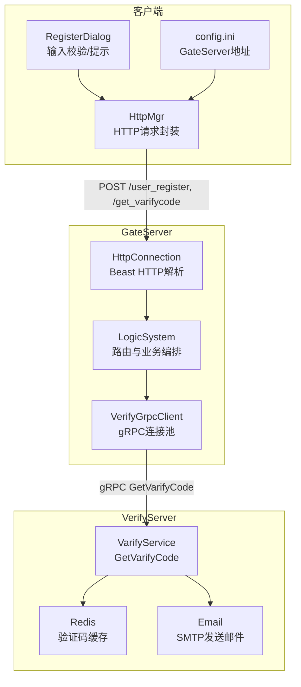
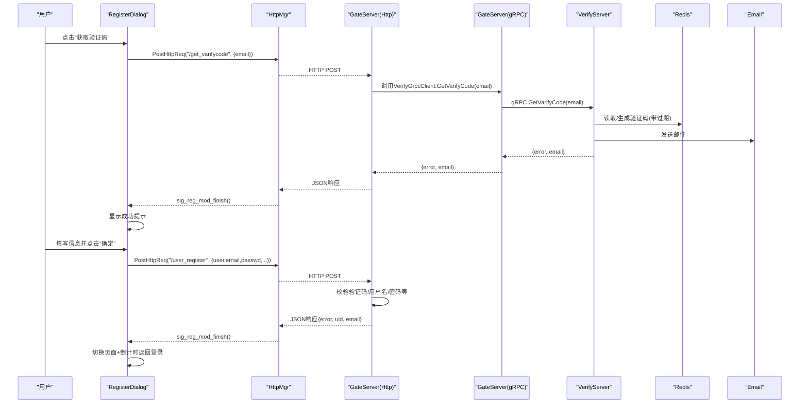
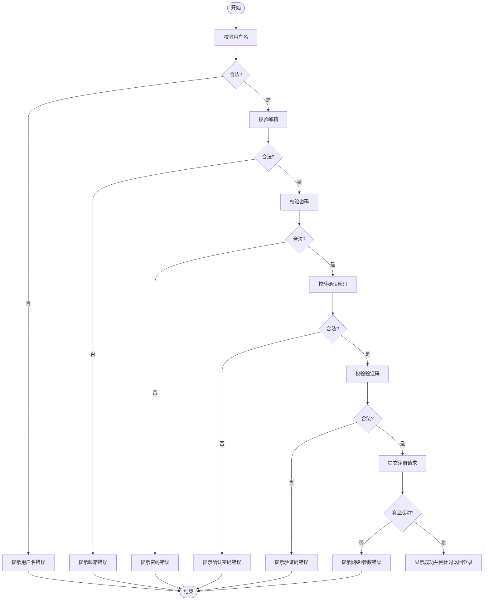
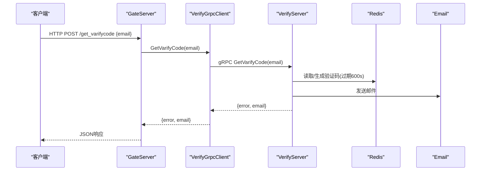
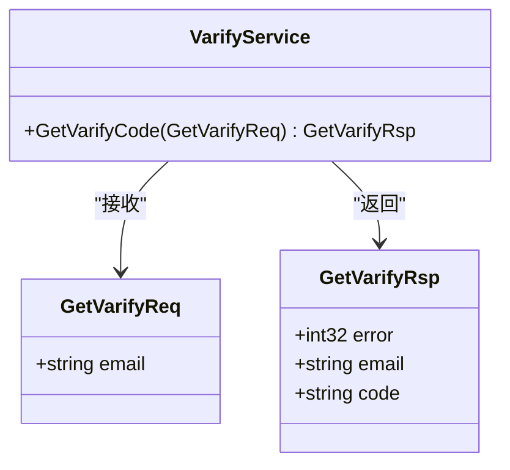
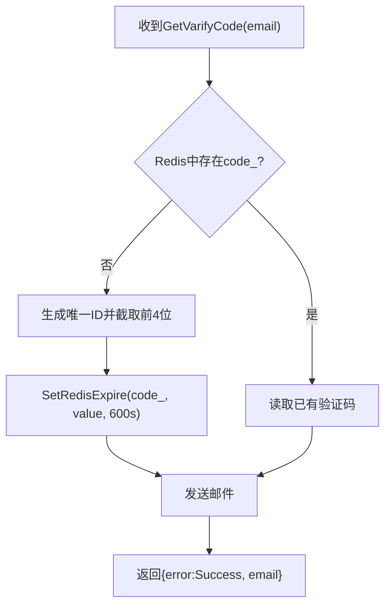
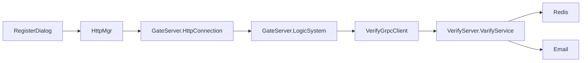

# 用户注册功能

<cite>
**本文引用的文件**   
- [registerdialog.h](file://client/llfcchat/include/registerdialog.h)
- [registerdialog.cpp](file://client/llfcchat/src/registerdialog.cpp)
- [httpmgr.h](file://client/llfcchat/include/httpmgr.h)
- [global.h](file://client/llfcchat/include/global.h)
- [config.ini](file://client/llfcchat/config/config.ini)
- [verify.proto](file://proto/verify_service/verify.proto)
- [VerifyGrpcClient.h](file://server/GateServer/include/VerifyGrpcClient.h)
- [VerifyGrpcClient.cpp](file://server/GateServer/src/VerifyGrpcClient.cpp)
- [HttpConnection.cpp](file://server/GateServer/src/HttpConnection.cpp)
- [const.h](file://server/GateServer/include/const.h)
- [server.js](file://server/VarifyServer/server.js)
- [email.js](file://server/VarifyServer/email.js)
- [redis.js](file://server/VarifyServer/redis.js)
- [const.js](file://server/VarifyServer/const.js)
</cite>

## 目录
1. [简介](#简介)
2. [项目结构](#项目结构)
3. [核心组件](#核心组件)
4. [架构总览](#架构总览)
5. [详细组件分析](#详细组件分析)
6. [依赖关系分析](#依赖关系分析)
7. [性能考虑](#性能考虑)
8. [故障排查指南](#故障排查指南)
9. [结论](#结论)
10. [附录](#附录)

## 简介
本文面向LLFCChat的用户注册功能，围绕客户端RegisterDialog的实现、与GateServer的HTTP交互、GateServer到VerifyServer的gRPC调用、以及验证码的生成/存储/校验进行系统化说明。文档包含完整的注册流程图、接口参数与响应格式、错误码定义、异常处理策略，以及可配置项与扩展点，帮助读者快速理解并安全地集成或二次开发该模块。

## 项目结构
注册功能涉及客户端UI与网络层、网关服务、验证服务三部分：
- 客户端（Qt/C++）：RegisterDialog负责界面与输入校验；HttpMgr封装HTTP请求；全局常量定义ReqId、Modules、TipErr等。
- GateServer（C++/Boost.Beast）：接收HTTP POST请求，路由到业务逻辑，并通过gRPC调用VerifyServer获取验证码。
- VerifyServer（Node.js/gRPC）：实现验证码生成、Redis缓存、邮件发送。

**图表来源** 
- [registerdialog.cpp:98-111](file://client/llfcchat/src/registerdialog.cpp#L98-L111)
- [HttpConnection.cpp:133-194](file://server/GateServer/src/HttpConnection.cpp#L133-L194)
- [VerifyGrpcClient.h:80-110](file://server/GateServer/include/VerifyGrpcClient.h#L80-L110)
- [server.js:15-64](file://server/VarifyServer/server.js#L15-L64)

**章节来源**
- [registerdialog.h:16-52](file://client/llfcchat/include/registerdialog.h#L16-L52)
- [registerdialog.cpp:1-111](file://client/llfcchat/src/registerdialog.cpp#L1-L111)
- [httpmgr.h:11-31](file://client/llfcchat/include/httpmgr.h#L11-L31)
- [global.h:43-111](file://client/llfcchat/include/global.h#L43-L111)
- [config.ini:1-4](file://client/llfcchat/config/config.ini#L1-L4)

## 核心组件
- RegisterDialog：注册界面与交互逻辑，负责输入校验、验证码发送、注册提交、倒计时返回登录。
- HttpMgr：统一HTTP请求入口，按模块分发回调信号。
- GateServer.HttpConnection：HTTP协议解析与路由转发。
- GateServer.VerifyGrpcClient：gRPC客户端连接池与验证码调用。
- VerifyServer：验证码生成、Redis存取、邮件发送。

关键职责与协作：
- 前端输入校验在RegisterDialog内完成，减少无效请求。
- 验证码通过GateServer->VerifyServer gRPC获取，避免跨域与直连风险。
- 注册数据经GateServer持久化（由GateServer内部逻辑完成），返回统一JSON结果。

**章节来源**
- [registerdialog.cpp:142-248](file://client/llfcchat/src/registerdialog.cpp#L142-L248)
- [httpmgr.h:18-31](file://client/llfcchat/include/httpmgr.h#L18-L31)
- [VerifyGrpcClient.h:80-110](file://server/GateServer/include/VerifyGrpcClient.h#L80-L110)
- [server.js:15-64](file://server/VarifyServer/server.js#L15-L64)

## 架构总览
注册流程分为两条主线：
- 获取验证码：客户端 -> GateServer HTTP -> GateServer gRPC -> VerifyServer -> Redis/Email
- 注册用户：客户端 -> GateServer HTTP -> GateServer业务逻辑（含验证码校验）-> 数据库持久化 -> 返回结果

**图表来源** 
- [registerdialog.cpp:98-111](file://client/llfcchat/src/registerdialog.cpp#L98-L111)
- [registerdialog.cpp:319-362](file://client/llfcchat/src/registerdialog.cpp#L319-L362)
- [HttpConnection.cpp:133-194](file://server/GateServer/src/HttpConnection.cpp#L133-L194)
- [VerifyGrpcClient.h:87-104](file://server/GateServer/include/VerifyGrpcClient.h#L87-L104)
- [server.js:15-64](file://server/VarifyServer/server.js#L15-L64)

## 详细组件分析

### RegisterDialog 实现细节
- 输入校验
  - 用户名：非空
  - 邮箱：正则匹配
  - 密码/确认密码：长度6~15，字符集限制，两者一致
  - 验证码：非空
- 验证码发送
  - 触发后构造JSON {email}，通过HttpMgr.PostHttpReq发送至GateServer的/get_varifycode
  - 成功后提示“验证码已发送到邮箱，注意查收”
- 注册提交
  - 组装JSON字段：user、email、passwd（xor加密）、sex=0、icon（随机头像）、nick、confirm（xor加密）、varifycode
  - 发送至GateServer的/user_register
  - 成功后进入“注册成功”页，启动倒计时返回登录
- 错误提示
  - 使用TipErr枚举与_tip_errs映射，动态显示错误信息

**图表来源** 
- [registerdialog.cpp:142-248](file://client/llfcchat/src/registerdialog.cpp#L142-L248)
- [registerdialog.cpp:319-362](file://client/llfcchat/src/registerdialog.cpp#L319-L362)

**章节来源**
- [registerdialog.cpp:142-248](file://client/llfcchat/src/registerdialog.cpp#L142-L248)
- [registerdialog.cpp:319-362](file://client/llfcchat/src/registerdialog.cpp#L319-L362)
- [global.h:103-111](file://client/llfcchat/include/global.h#L103-L111)

### 邮箱验证码发送流程（GateServer + VerifyServer）
- GateServer收到HTTP GET/POST后，交由LogicSystem路由处理（此处为HTTP连接层通用处理）。
- GateServer通过VerifyGrpcClient发起gRPC调用GetVarifyCode。
- VerifyServer从Redis读取或生成验证码，设置过期时间，并发送邮件。
- 返回统一JSON给客户端。

**图表来源** 
- [HttpConnection.cpp:133-194](file://server/GateServer/src/HttpConnection.cpp#L133-L194)
- [VerifyGrpcClient.h:87-104](file://server/GateServer/include/VerifyGrpcClient.h#L87-L104)
- [server.js:15-64](file://server/VarifyServer/server.js#L15-L64)
- [redis.js:87-98](file://server/VarifyServer/redis.js#L87-L98)
- [email.js:22-35](file://server/VarifyServer/email.js#L22-L35)

**章节来源**
- [VerifyGrpcClient.h:80-110](file://server/GateServer/include/VerifyGrpcClient.h#L80-L110)
- [VerifyGrpcClient.cpp:4-9](file://server/GateServer/src/VerifyGrpcClient.cpp#L4-L9)
- [server.js:15-64](file://server/VarifyServer/server.js#L15-L64)
- [redis.js:41-98](file://server/VarifyServer/redis.js#L41-L98)
- [email.js:22-35](file://server/VarifyServer/email.js#L22-L35)

### gRPC 通信机制（verify.proto）
- 服务与方法：VarifyService.GetVarifyCode
- 请求消息：GetVarifyReq.email
- 响应消息：GetVarifyRsp.error, email, code
- GateServer侧使用连接池管理Stub，失败时返回RPCFailed错误码

**图表来源** 
- [verify.proto:6-18](file://proto/verify_service/verify.proto#L6-L18)

**章节来源**
- [verify.proto:1-19](file://proto/verify_service/verify.proto#L1-L19)
- [VerifyGrpcClient.h:14-16](file://server/GateServer/include/VerifyGrpcClient.h#L14-L16)

### 注册接口规范（GateServer HTTP）
- 端点
  - 获取验证码：POST /get_varifycode
  - 注册用户：POST /user_register
- 请求参数（JSON）
  - /get_varifycode
    - email: string（必填）
  - /user_register
    - user: string（用户名）
    - email: string（邮箱）
    - passwd: string（经过xorString加密）
    - sex: int（示例中固定为0）
    - icon: string（头像资源路径，示例中随机选择）
    - nick: string（昵称）
    - confirm: string（确认密码，经过xorString加密）
    - varifycode: string（验证码）
- 响应格式（JSON）
  - error: int（错误码，SUCCESS表示成功）
  - email: string（用于回显）
  - uid: string（注册成功时返回用户ID）
- 错误码（客户端ErrorCodes）
  - SUCCESS = 0
  - ERR_JSON = 1
  - ERR_NETWORK = 2
- 服务器端错误码（GateServer const.h）
  - Success = 0
  - Error_Json = 1001
  - RPCFailed = 1002
  - VarifyExpired = 1003
  - VarifyCodeErr = 1004
  - UserExist = 1005
  - PasswdErr = 1006
  - EmailNotMatch = 1007
  - PasswdUpFailed = 1008
  - PasswdInvalid = 1009
  - TokenInvalid = 1010
  - UidInvalid = 1011

**章节来源**
- [registerdialog.cpp:98-111](file://client/llfcchat/src/registerdialog.cpp#L98-L111)
- [registerdialog.cpp:319-362](file://client/llfcchat/src/registerdialog.cpp#L319-L362)
- [global.h:91-95](file://client/llfcchat/include/global.h#L91-L95)
- [const.h:31-44](file://server/GateServer/include/const.h#L31-L44)

### 验证码生成、存储与验证逻辑
- 生成规则：若Redis不存在对应key则生成唯一ID，截取前4位作为验证码
- 存储策略：以“code_”为前缀，键为邮箱，值为验证码，设置过期时间600秒
- 验证时机：GateServer在注册接口中校验验证码是否匹配且未过期（错误码VarifyExpired/VarifyCodeErr）
- 邮件内容：包含验证码与有效期提示

**图表来源** 
- [server.js:15-64](file://server/VarifyServer/server.js#L15-L64)
- [redis.js:87-98](file://server/VarifyServer/redis.js#L87-L98)
- [const.js:1-10](file://server/VarifyServer/const.js#L1-L10)

**章节来源**
- [server.js:15-64](file://server/VarifyServer/server.js#L15-L64)
- [redis.js:41-98](file://server/VarifyServer/redis.js#L41-L98)
- [const.js:1-10](file://server/VarifyServer/const.js#L1-L10)

### 异常处理与边界情况
- 网络错误：HttpMgr回调err != SUCCESS时提示“网络请求错误”
- JSON解析错误：客户端判空与isObject检查，提示“json解析错误”
- 参数错误：error != SUCCESS时提示“参数错误”
- 验证码相关：
  - 验证码过期：服务器返回VarifyExpired
  - 验证码错误：服务器返回VarifyCodeErr
- 用户已存在：服务器返回UserExist
- 密码问题：PasswdErr、PasswdUpFailed、PasswdInvalid
- 邮箱不匹配：EmailNotMatch
- 其他：TokenInvalid、UidInvalid

**章节来源**
- [registerdialog.cpp:113-139](file://client/llfcchat/src/registerdialog.cpp#L113-L139)
- [const.h:31-44](file://server/GateServer/include/const.h#L31-L44)

### 配置选项与自定义方法
- 客户端配置
  - config.ini：GateServer host/port
  - global.h：ReqId、Modules、TipErr、heads等常量
- GateServer配置
  - VerifyGrpcClient.cpp：从ConfigMgr读取VarifyServer Host/Port，初始化连接池大小
- VerifyServer配置
  - redis.js：Redis主机、端口、密码
  - email.js：SMTP主机、端口、认证信息
  - const.js：错误码与验证码前缀

**章节来源**
- [config.ini:1-4](file://client/llfcchat/config/config.ini#L1-L4)
- [global.h:43-111](file://client/llfcchat/include/global.h#L43-L111)
- [VerifyGrpcClient.cpp:4-9](file://server/GateServer/src/VerifyGrpcClient.cpp#L4-L9)
- [redis.js:6-13](file://server/VarifyServer/redis.js#L6-L13)
- [email.js:7-15](file://server/VarifyServer/email.js#L7-L15)
- [const.js:1-10](file://server/VarifyServer/const.js#L1-L10)

## 依赖关系分析
- 客户端依赖
  - RegisterDialog依赖HttpMgr发送HTTP请求，依赖global.h中的常量与工具函数
- GateServer依赖
  - HttpConnection依赖LogicSystem进行路由处理
  - VerifyGrpcClient依赖gRPC生成的Stub与ConfigMgr
- VerifyServer依赖
  - server.js依赖redis.js与email.js，使用const.js的错误码与前缀

**图表来源** 
- [registerdialog.cpp:98-111](file://client/llfcchat/src/registerdialog.cpp#L98-L111)
- [HttpConnection.cpp:133-194](file://server/GateServer/src/HttpConnection.cpp#L133-L194)
- [VerifyGrpcClient.h:80-110](file://server/GateServer/include/VerifyGrpcClient.h#L80-L110)
- [server.js:15-64](file://server/VarifyServer/server.js#L15-L64)

**章节来源**
- [registerdialog.cpp:98-111](file://client/llfcchat/src/registerdialog.cpp#L98-L111)
- [HttpConnection.cpp:133-194](file://server/GateServer/src/HttpConnection.cpp#L133-L194)
- [VerifyGrpcClient.h:80-110](file://server/GateServer/include/VerifyGrpcClient.h#L80-L110)
- [server.js:15-64](file://server/VarifyServer/server.js#L15-L64)

## 性能考虑
- 连接池：GateServer的VerifyGrpcClient维护gRPC连接池，降低握手开销，提高并发能力
- 异步I/O：GateServer使用Boost.Asio/Beast异步读写，提升吞吐
- 验证码缓存：Redis短TTL（600s）减少重复计算与邮件发送压力
- 前端校验：RegisterDialog前置校验减少无效请求
- 建议优化
  - GateServer注册接口增加限流与防刷（IP/邮箱维度）
  - 验证码长度与复杂度策略可调
  - 邮件发送采用队列与重试机制

[本节为通用指导，不直接分析具体文件]

## 故障排查指南
- 客户端提示“网络请求错误”
  - 检查GateServer地址配置（config.ini）
  - 检查HttpMgr回调err是否为SUCCESS
- JSON解析错误
  - 检查服务端返回JSON结构与字段名
- 验证码相关错误
  - 检查VerifyServer日志与Redis key是否存在
  - 检查SMTP配置是否正确
- 用户已存在
  - 检查数据库唯一约束与业务逻辑
- 验证码过期/错误
  - 检查Redis过期时间与用户输入一致性

**章节来源**
- [registerdialog.cpp:113-139](file://client/llfcchat/src/registerdialog.cpp#L113-L139)
- [const.h:31-44](file://server/GateServer/include/const.h#L31-L44)
- [server.js:15-64](file://server/VarifyServer/server.js#L15-L64)

## 结论
LLFCChat的注册功能通过清晰的客户端校验、网关路由与gRPC调用，结合Redis与邮件服务，实现了稳定可靠的验证码发放与注册流程。通过合理的错误码体系与前端提示，提升了用户体验与可维护性。建议在安全性与性能方面继续完善限流、加密与队列机制。

[本节为总结，不直接分析具体文件]

## 附录
- 关键代码片段路径（仅列路径，不包含代码内容）
  - 获取验证码请求：[on_get_code_clicked:98-111](file://client/llfcchat/src/registerdialog.cpp#L98-L111)
  - 注册提交请求：[on_sure_btn_clicked:319-362](file://client/llfcchat/src/registerdialog.cpp#L319-L362)
  - HTTP响应回调：[slot_reg_mod_finish:113-139](file://client/llfcchat/src/registerdialog.cpp#L113-L139)
  - gRPC客户端调用：[GetVarifyCode:87-104](file://server/GateServer/include/VerifyGrpcClient.h#L87-L104)
  - 验证码服务实现：[GetVarifyCode:15-64](file://server/VarifyServer/server.js#L15-L64)
  - Redis操作：[SetRedisExpire:87-98](file://server/VarifyServer/redis.js#L87-L98)
  - 邮件发送：[SendMail:22-35](file://server/VarifyServer/email.js#L22-L35)
  - 错误码定义（客户端）：[ErrorCodes:91-95](file://client/llfcchat/include/global.h#L91-L95)
  - 错误码定义（服务器端）：[ErrorCodes:31-44](file://server/GateServer/include/const.h#L31-L44)