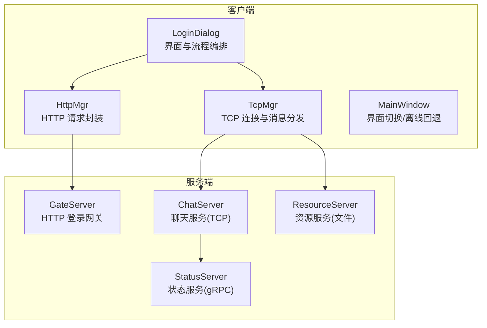
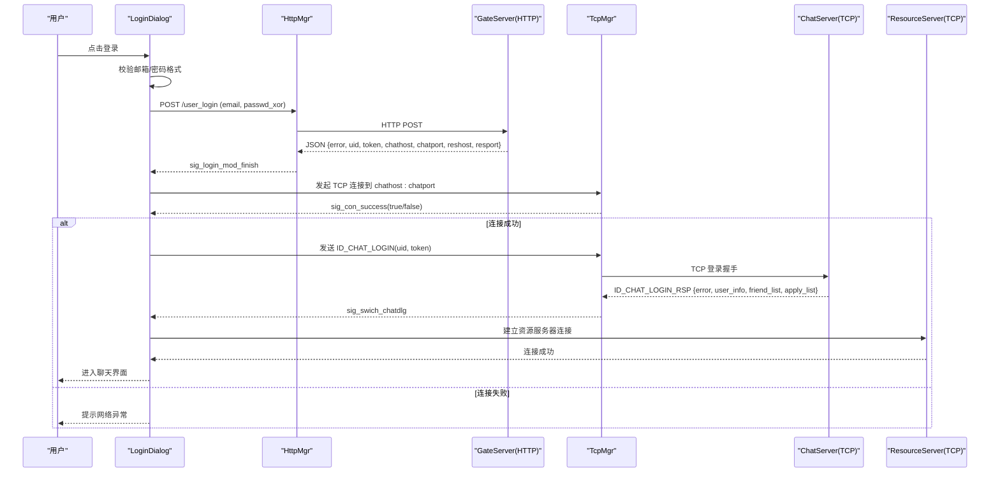
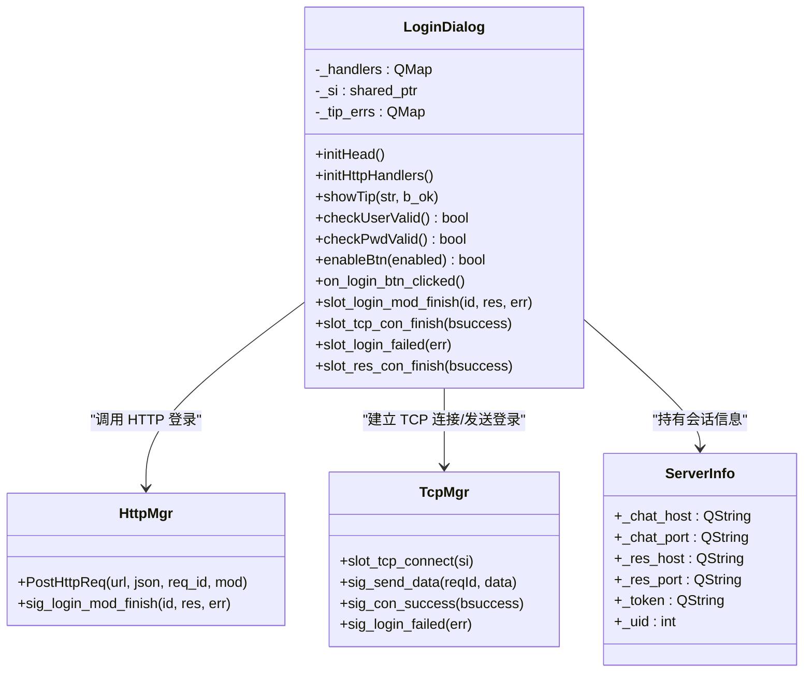
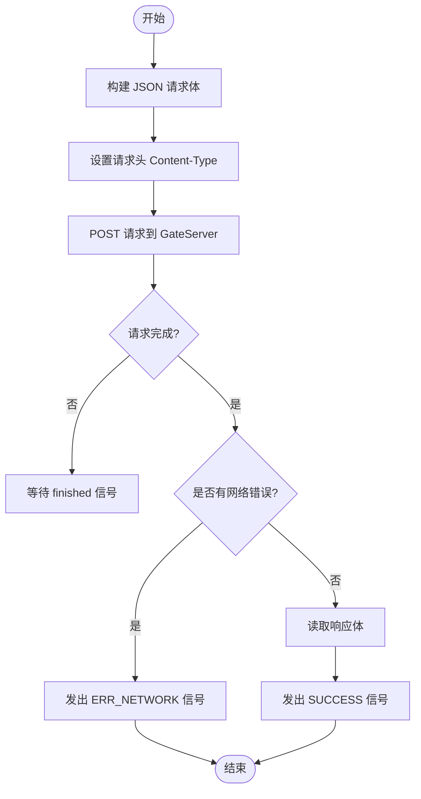
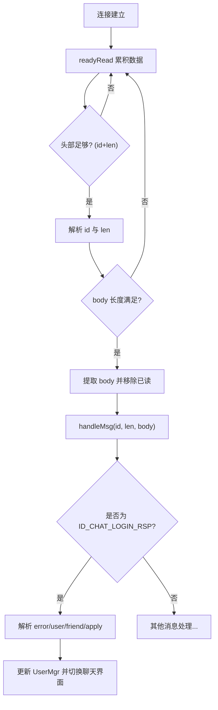
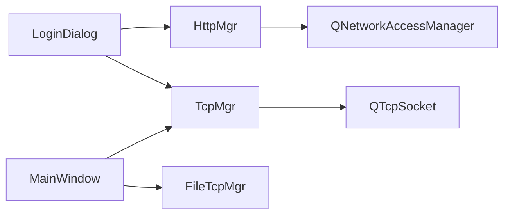

# 用户登录功能

<cite>
**本文引用的文件**   
- [logindialog.h](file://client/llfcchat/include/logindialog.h)
- [logindialog.cpp](file://client/llfcchat/src/logindialog.cpp)
- [httpmgr.h](file://client/llfcchat/include/httpmgr.h)
- [httpmgr.cpp](file://client/llfcchat/src/httpmgr.cpp)
- [tcpmgr.h](file://client/llfcchat/include/tcpmgr.h)
- [tcpmgr.cpp](file://client/llfcchat/src/tcpmgr.cpp)
- [global.h](file://client/llfcchat/include/global.h)
- [global.cpp](file://client/llfcchat/src/global.cpp)
- [mainwindow.cpp](file://client/llfcchat/src/mainwindow.cpp)
- [config.ini](file://client/llfcchat/config/config.ini)
</cite>

## 目录
1. [简介](#简介)
2. [项目结构](#项目结构)
3. [核心组件](#核心组件)
4. [架构总览](#架构总览)
5. [详细组件分析](#详细组件分析)
6. [依赖关系分析](#依赖关系分析)
7. [性能考虑](#性能考虑)
8. [故障排查指南](#故障排查指南)
9. [结论](#结论)
10. [附录](#附录)

## 简介
本技术文档聚焦于 LLFCChat 客户端的用户登录功能，围绕 LoginDialog 的实现展开，系统阐述以下关键主题：
- 用户凭证校验与 HTTP 认证流程
- TCP 长连接建立与聊天服务器登录握手
- 令牌生成与会话保持机制
- 多设备登录支持与状态同步（与 StatusServer）
- 登录失败场景处理（账号锁定、密码错误、网络异常等）
- 登录状态管理与自动重连逻辑
- 登录配置项与安全最佳实践

## 项目结构
登录相关代码主要位于客户端模块的 UI 层与管理器层：
- UI 层：LoginDialog 负责界面交互、输入校验、HTTP/TCP 流程编排
- 网络层：HttpMgr 封装 HTTP POST 请求；TcpMgr 管理 TCP 连接、粘包解析、消息分发
- 全局常量与工具：ReqId、ErrorCodes、Modules、ServerInfo、xorString 等
- 主窗口：MainWindow 负责界面切换与离线回退到登录页

图表来源
- [logindialog.cpp:1-277](file://client/llfcchat/src/logindialog.cpp#L1-L277)
- [httpmgr.cpp:1-62](file://client/llfcchat/src/httpmgr.cpp#L1-L62)
- [tcpmgr.cpp:1-800](file://client/llfcchat/src/tcpmgr.cpp#L1-L800)
- [mainwindow.cpp:1-164](file://client/llfcchat/src/mainwindow.cpp#L1-L164)

章节来源
- [logindialog.h:1-47](file://client/llfcchat/include/logindialog.h#L1-L47)
- [logindialog.cpp:1-277](file://client/llfcchat/src/logindialog.cpp#L1-L277)
- [httpmgr.h:1-34](file://client/llfcchat/include/httpmgr.h#L1-L34)
- [httpmgr.cpp:1-62](file://client/llfcchat/src/httpmgr.cpp#L1-L62)
- [tcpmgr.h:1-90](file://client/llfcchat/include/tcpmgr.h#L1-L90)
- [tcpmgr.cpp:1-800](file://client/llfcchat/src/tcpmgr.cpp#L1-L800)
- [global.h:1-296](file://client/llfcchat/include/global.h#L1-L296)
- [global.cpp:1-91](file://client/llfcchat/src/global.cpp#L1-L91)
- [mainwindow.cpp:1-164](file://client/llfcchat/src/mainwindow.cpp#L1-L164)
- [config.ini:1-4](file://client/llfcchat/config/config.ini#L1-L4)

## 核心组件
- LoginDialog：登录界面与流程编排，负责输入校验、HTTP 登录、TCP 连接、资源服务器连接、登录失败提示与按钮状态控制。
- HttpMgr：基于 QNetworkAccessManager 的 HTTP 管理器，统一发送 POST 请求并分发模块回调信号。
- TcpMgr：基于 QTcpSocket 的 TCP 管理器，实现粘包解析、消息队列发送、错误与断开处理、登录响应分发。
- 全局定义：ReqId、ErrorCodes、Modules、ServerInfo、xorString 等用于跨模块通信与数据承载。
- MainWindow：应用主窗口，负责在登录成功时切换到聊天界面，并在离线/异常时回退到登录界面。

章节来源
- [logindialog.h:1-47](file://client/llfcchat/include/logindialog.h#L1-L47)
- [logindialog.cpp:1-277](file://client/llfcchat/src/logindialog.cpp#L1-L277)
- [httpmgr.h:1-34](file://client/llfcchat/include/httpmgr.h#L1-L34)
- [httpmgr.cpp:1-62](file://client/llfcchat/src/httpmgr.cpp#L1-L62)
- [tcpmgr.h:1-90](file://client/llfcchat/include/tcpmgr.h#L1-L90)
- [tcpmgr.cpp:1-800](file://client/llfcchat/src/tcpmgr.cpp#L1-L800)
- [global.h:1-296](file://client/llfcchat/include/global.h#L1-L296)
- [global.cpp:1-91](file://client/llfcchat/src/global.cpp#L1-L91)
- [mainwindow.cpp:1-164](file://client/llfcchat/src/mainwindow.cpp#L1-L164)

## 架构总览
登录流程采用“HTTP 鉴权 + TCP 长连接”的分阶段设计：
- 第一阶段：通过 GateServer 的 HTTP 接口进行邮箱+密码校验，成功后返回 uid、token、聊天服务器地址与端口、资源服务器地址与端口。
- 第二阶段：使用返回的连接信息建立到 ChatServer 的 TCP 长连接，并通过 ID_CHAT_LOGIN 完成聊天服务器登录握手。
- 第三阶段：建立到 ResourceServer 的 TCP 连接（文件传输），随后进入聊天主界面。

图表来源
- [logindialog.cpp:1-277](file://client/llfcchat/src/logindialog.cpp#L1-L277)
- [httpmgr.cpp:1-62](file://client/llfcchat/src/httpmgr.cpp#L1-L62)
- [tcpmgr.cpp:1-800](file://client/llfcchat/src/tcpmgr.cpp#L1-L800)

## 详细组件分析

### LoginDialog 组件分析
- 输入校验：邮箱非空检查；密码长度 6~15 且仅允许字母、数字与部分特殊字符；错误提示集中管理。
- HTTP 登录：构造 JSON 请求体，对密码执行 xorString 后再发送；根据 ReqId::ID_LOGIN_USER 路由回调。
- 会话信息：从 HTTP 响应中解析 uid、token、聊天/资源服务器地址与端口，保存至 ServerInfo。
- TCP 连接：先连接聊天服务器，成功后再连接资源服务器；完成后发送 ID_CHAT_LOGIN 完成握手。
- 错误处理：网络错误、JSON 解析错误、登录失败均会提示并恢复按钮状态。
- 界面交互：禁用/启用登录与注册按钮；错误提示样式切换；忘记密码跳转重置页面。

图表来源
- [logindialog.h:1-47](file://client/llfcchat/include/logindialog.h#L1-L47)
- [logindialog.cpp:1-277](file://client/llfcchat/src/logindialog.cpp#L1-L277)
- [httpmgr.h:1-34](file://client/llfcchat/include/httpmgr.h#L1-L34)
- [tcpmgr.h:1-90](file://client/llfcchat/include/tcpmgr.h#L1-L90)
- [global.h:1-296](file://client/llfcchat/include/global.h#L1-L296)

章节来源
- [logindialog.cpp:1-277](file://client/llfcchat/src/logindialog.cpp#L1-L277)
- [global.h:1-296](file://client/llfcchat/include/global.h#L1-L296)

### HTTP 认证流程（HttpMgr）
- 请求封装：将 QJsonObject 序列化为 JSON 字符串，设置 Content-Type 为 application/json。
- 异步回调：QNetworkReply::finished 后根据 error 判断是否成功，统一通过 sig_http_finish 分发。
- 模块路由：根据 Modules::LOGINMOD 触发 sig_login_mod_finish，供 LoginDialog 消费。

图表来源
- [httpmgr.cpp:1-62](file://client/llfcchat/src/httpmgr.cpp#L1-L62)

章节来源
- [httpmgr.cpp:1-62](file://client/llfcchat/src/httpmgr.cpp#L1-L62)

### TCP 连接与聊天服务器登录（TcpMgr）
- 连接生命周期：connected 触发连接成功；readyRead 粘包解析；error/disconnected 处理异常与断开。
- 粘包解析：固定头部为 quint16 id + quint16 len，循环读取直到完整消息。
- 登录握手：收到 ID_CHAT_LOGIN_RSP 后解析用户信息与好友列表，更新 UserMgr，并切换聊天界面。
- 发送队列：bytesWritten 驱动队列出队与分片写入，避免阻塞。

图表来源
- [tcpmgr.cpp:1-800](file://client/llfcchat/src/tcpmgr.cpp#L1-L800)

章节来源
- [tcpmgr.cpp:1-800](file://client/llfcchat/src/tcpmgr.cpp#L1-L800)

### 登录状态管理与自动重连逻辑
- 状态管理：LoginDialog 维护 _si(ServerInfo) 保存 uid/token 与服务端地址；TcpMgr 维护连接状态与发送队列。
- 自动重连：当前代码未实现显式重连定时器；但通过 MainWindow 的 offlineLogin 可在异常或心跳超时时回退到登录界面，由用户再次触发登录。
- 多设备支持：当服务器检测到同账号异地登录时，会通过 ID_NOTIFY_OFF_LINE_REQ 通知客户端，客户端弹出提示并断开连接，强制回到登录界面。

章节来源
- [logindialog.cpp:1-277](file://client/llfcchat/src/logindialog.cpp#L1-L277)
- [tcpmgr.cpp:1-800](file://client/llfcchat/src/tcpmgr.cpp#L1-L800)
- [mainwindow.cpp:1-164](file://client/llfcchat/src/mainwindow.cpp#L1-L164)

### 与 StatusServer 的状态同步机制
- 登录成功后，ChatServer 可能通过 gRPC 与 StatusServer 同步在线状态、好友列表与应用状态。
- 客户端侧通过 TcpMgr 接收来自 ChatServer 的通知（如离线通知、好友申请、认证结果等），从而与服务器状态保持一致。

章节来源
- [tcpmgr.cpp:1-800](file://client/llfcchat/src/tcpmgr.cpp#L1-L800)

## 依赖关系分析
- LoginDialog 依赖 HttpMgr 与 TcpMgr 完成网络交互；依赖 global.h 中的类型与工具函数。
- HttpMgr 依赖 Qt 网络栈；TcpMgr 依赖 Qt 套接字与事件循环。
- MainWindow 依赖 TcpMgr/FileTcpMgr 的信号以处理离线与断线场景。

图表来源
- [logindialog.cpp:1-277](file://client/llfcchat/src/logindialog.cpp#L1-L277)
- [httpmgr.cpp:1-62](file://client/llfcchat/src/httpmgr.cpp#L1-L62)
- [tcpmgr.cpp:1-800](file://client/llfcchat/src/tcpmgr.cpp#L1-L800)
- [mainwindow.cpp:1-164](file://client/llfcchat/src/mainwindow.cpp#L1-L164)

章节来源
- [logindialog.cpp:1-277](file://client/llfcchat/src/logindialog.cpp#L1-L277)
- [httpmgr.cpp:1-62](file://client/llfcchat/src/httpmgr.cpp#L1-L62)
- [tcpmgr.cpp:1-800](file://client/llfcchat/src/tcpmgr.cpp#L1-L800)
- [mainwindow.cpp:1-164](file://client/llfcchat/src/mainwindow.cpp#L1-L164)

## 性能考虑
- HTTP 请求：使用 QNetworkAccessManager 异步处理，避免阻塞 UI；合理设置超时与重试策略可提升用户体验。
- TCP 粘包解析：每次解析都创建新的 QDataStream，确保正确性；缓冲区按消息长度切分，避免内存拷贝过多。
- 发送队列：通过 bytesWritten 事件驱动队列出队，减少阻塞与丢包风险。
- 资源服务器连接：独立 FileTcpMgr 管理文件传输，避免与聊天消息通道竞争带宽。

[本节为通用指导，不直接分析具体文件]

## 故障排查指南
- 网络异常：
  - 现象：HTTP 请求失败或 TCP 连接失败，提示“网络异常”。
  - 排查：检查 gate_url_prefix 配置是否正确；确认 GateServer 可达；查看 TcpMgr 的错误分支（ConnectionRefused/HostNotFound/Timeout）。
- JSON 解析错误：
  - 现象：登录回调中提示“json解析错误”。
  - 排查：确认服务端返回的 JSON 字段是否符合预期（error、uid、token、chathost、chatport、reshost、resport）。
- 登录失败：
  - 现象：提示“登录失败”，错误码非 SUCCESS。
  - 排查：检查邮箱/密码格式；确认密码是否被正确 xorString；核对服务端错误码含义。
- 账号锁定/异地登录：
  - 现象：收到离线通知并强制下线。
  - 处理：弹出提示并回退到登录界面，引导用户重新登录。
- 资源服务器连接失败：
  - 现象：提示“网络异常”或资源连接失败。
  - 处理：检查 reshost/resport；确认 FileTcpMgr 连接状态。

章节来源
- [logindialog.cpp:1-277](file://client/llfcchat/src/logindialog.cpp#L1-L277)
- [tcpmgr.cpp:1-800](file://client/llfcchat/src/tcpmgr.cpp#L1-L800)
- [mainwindow.cpp:1-164](file://client/llfcchat/src/mainwindow.cpp#L1-L164)

## 结论
LLFCChat 的登录功能采用清晰的“HTTP 鉴权 + TCP 长连接”架构，LoginDialog 作为流程编排中心，协调 HttpMgr 与 TcpMgr 完成认证、握手与状态同步。当前实现具备完善的输入校验、错误提示与界面状态管理；在多设备登录与异常回退方面已有基础支持。建议后续增强自动重连与更细粒度的错误码映射，以提升健壮性与用户体验。

[本节为总结性内容，不直接分析具体文件]

## 附录

### 登录接口安全机制
- 密码加密：客户端对密码执行 xorString 后再发送，降低明文泄露风险。
- 令牌生成：GateServer 返回 token，客户端在 TCP 登录握手时携带 token 进行身份验证。
- 会话保持：Token 保存在 ServerInfo 中，后续聊天服务器登录与消息交互使用该 Token 维持会话。

章节来源
- [global.cpp:1-91](file://client/llfcchat/src/global.cpp#L1-L91)
- [logindialog.cpp:1-277](file://client/llfcchat/src/logindialog.cpp#L1-L277)
- [tcpmgr.cpp:1-800](file://client/llfcchat/src/tcpmgr.cpp#L1-L800)

### 登录配置与自定义选项
- GateServer 地址与端口：通过 config.ini 配置 host 与 port，并在 main.cpp 中拼接成 gate_url_prefix。
- 扩展点：可在 LoginDialog 中增加更多校验规则或错误提示；在 TcpMgr 中增加重连定时器与指数退避策略。

章节来源
- [config.ini:1-4](file://client/llfcchat/config/config.ini#L1-L4)
- [global.cpp:1-91](file://client/llfcchat/src/global.cpp#L1-L91)
- [logindialog.cpp:1-277](file://client/llfcchat/src/logindialog.cpp#L1-L277)

### 安全最佳实践
- 使用 HTTPS 替代 HTTP，防止中间人攻击。
- 对密码进行更强哈希（如 bcrypt/argon2），避免简单异或。
- 引入短期有效 Token 与刷新机制，限制 Token 泄露影响范围。
- 对登录失败次数进行限流与账户锁定策略。
- 记录审计日志，便于追踪异常登录行为。

[本节为通用指导，不直接分析具体文件]