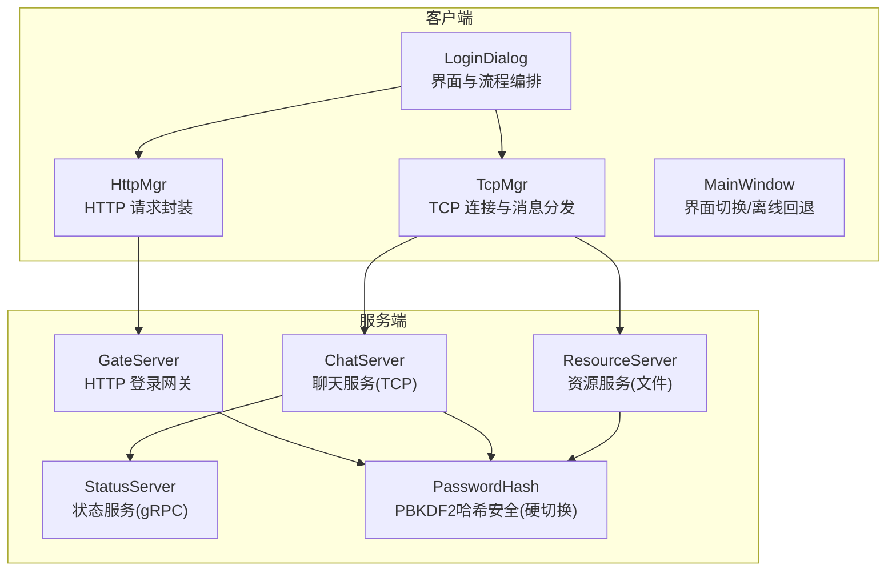
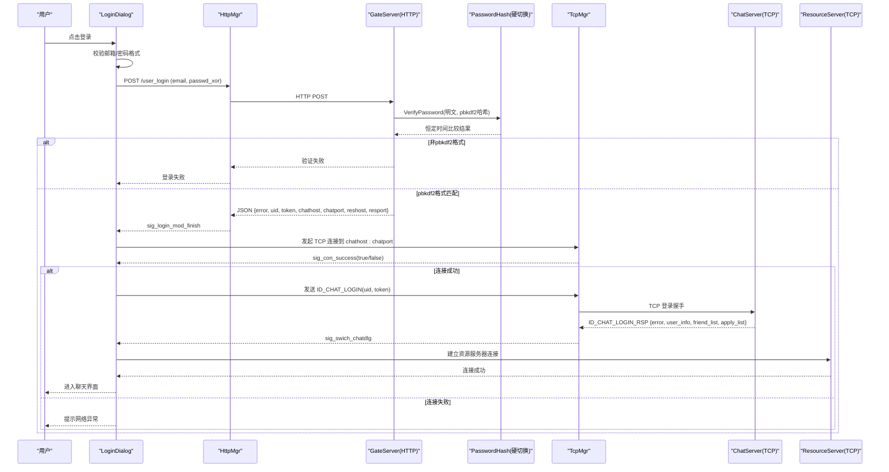
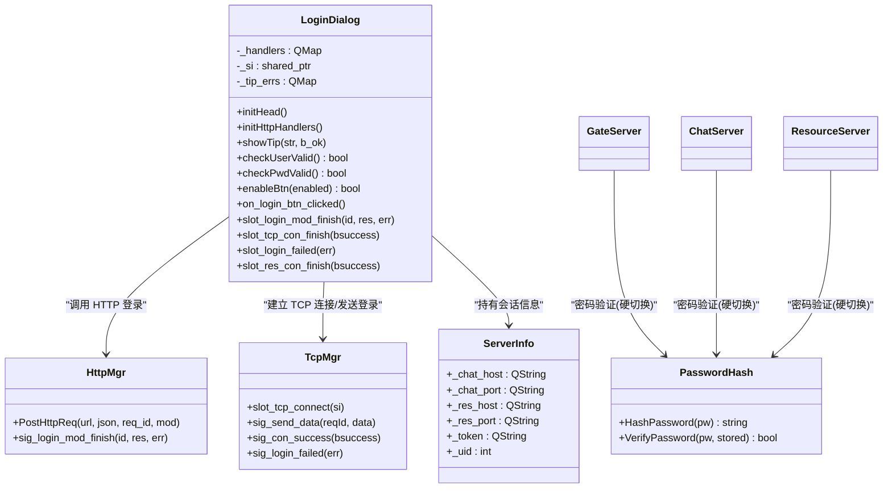
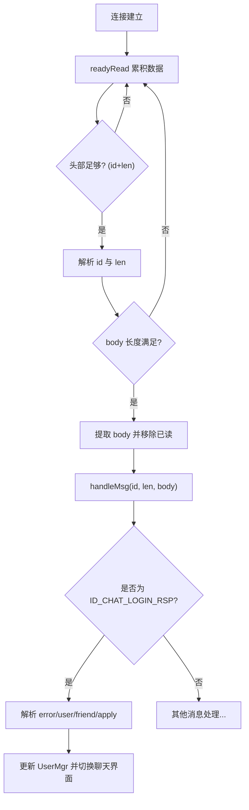
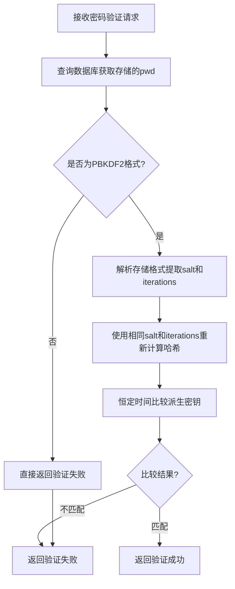
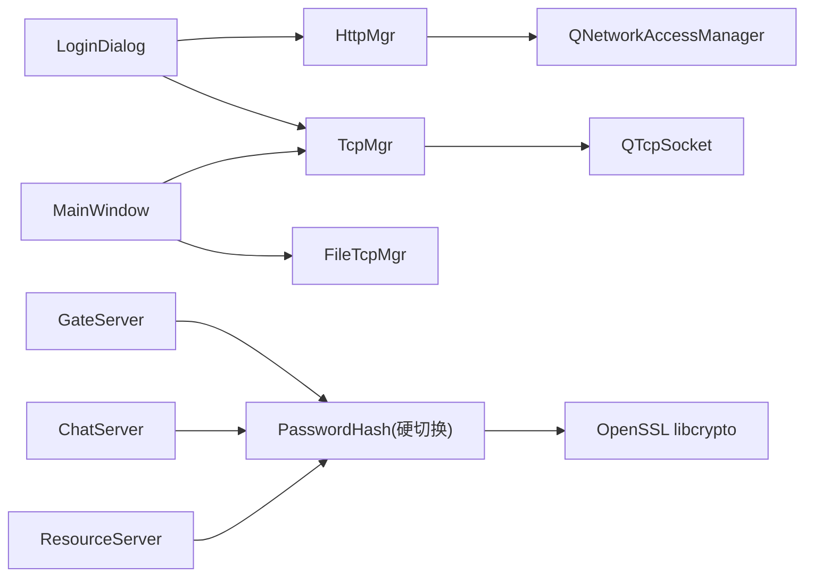

# 用户登录功能

<cite>
**本文引用的文件**   
- [logindialog.h](file://client/llfcchat/include/logindialog.h)
- [logindialog.cpp](file://client/llfcchat/src/logindialog.cpp)
- [httpmgr.h](file://client/llfcchat/include/httpmgr.h)
- [httpmgr.cpp](file://client/llfcchat/src/httpmgr.cpp)
- [tcpmgr.h](file://client/llfcchat/include/tcpmgr.h)
- [tcpmgr.cpp](file://client/llfcchat/src/tcpmgr.cpp)
- [global.h](file://client/llfcchat/include/global.h)
- [global.cpp](file://client/llfcchat/src/global.cpp)
- [mainwindow.cpp](file://client/llfcchat/src/mainwindow.cpp)
- [config.ini](file://client/llfcchat/config/config.ini)
- [PasswordHash.h](file://server/common/include/PasswordHash.h)
- [PasswordHash.cpp](file://server/common/src/PasswordHash.cpp)
- [MysqlDao.cpp](file://server/GateServer/src/MysqlDao.cpp)
- [MysqlDao.cpp](file://server/ChatServer/src/MysqlDao.cpp)
- [MysqlDao.cpp](file://server/ResourceServer/src/MysqlDao.cpp)
- [20260804_pwd_pbkdf2.sql](file://sql备份/20260804_pwd_pbkdf2.sql)
- [password_hash_tests.cpp](file://tests/password_hash_tests.cpp)
</cite>

## 更新摘要
**变更内容**   
- **重大更新**：移除PBKDF2密码哈希的渐进式迁移框架，改为硬切换模式
- 删除了遗留明文密码兼容分支和自动重哈希机制
- VerifyPassword函数现在只接受pbkdf2-sha256格式，非该格式一律校验失败
- 简化了数据库操作，不再有登录时的写操作
- 更新了相关测试用例，移除了legacy相关断言

## 目录
1. [简介](#简介)
2. [项目结构](#项目结构)
3. [核心组件](#核心组件)
4. [架构总览](#架构总览)
5. [详细组件分析](#详细组件分析)
6. [PBKDF2密码哈希安全机制](#pbkdf2密码哈希安全机制)
7. [依赖关系分析](#依赖关系分析)
8. [性能考虑](#性能考虑)
9. [故障排查指南](#故障排查指南)
10. [结论](#结论)
11. [附录](#附录)

## 简介
本技术文档聚焦于 LLFCChat 客户端的用户登录功能，围绕 LoginDialog 的实现展开，系统阐述以下关键主题：
- 用户凭证校验与 HTTP 认证流程
- TCP 长连接建立与聊天服务器登录握手
- 令牌生成与会话保持机制
- 多设备登录支持与状态同步（与 StatusServer）
- 登录失败场景处理（账号锁定、密码错误、网络异常等）
- 登录状态管理与自动重连逻辑
- **PBKDF2密码哈希安全机制（硬切换模式）**
- 登录配置项与安全最佳实践

## 项目结构
登录相关代码主要位于客户端模块的 UI 层与管理器层：
- UI 层：LoginDialog 负责界面交互、输入校验、HTTP/TCP 流程编排
- 网络层：HttpMgr 封装 HTTP POST 请求；TcpMgr 管理 TCP 连接、粘包解析、消息分发
- 全局常量与工具：ReqId、ErrorCodes、Modules、ServerInfo、xorString 等
- 主窗口：MainWindow 负责界面切换与离线回退到登录页
- **服务端安全层：PasswordHash 提供 PBKDF2-HMAC-SHA256 密码哈希与验证（硬切换模式）**



图表来源
- [logindialog.cpp:1-277](file://client/llfcchat/src/logindialog.cpp#L1-L277)
- [httpmgr.cpp:1-62](file://client/llfcchat/src/httpmgr.cpp#L1-L62)
- [tcpmgr.cpp:1-800](file://client/llfcchat/src/tcpmgr.cpp#L1-L800)
- [mainwindow.cpp:1-164](file://client/llfcchat/src/mainwindow.cpp#L1-L164)
- [PasswordHash.h:1-28](file://server/common/include/PasswordHash.h#L1-L28)

章节来源
- [logindialog.h:1-46](file://client/llfcchat/include/logindialog.h#L1-L46)
- [logindialog.cpp:1-200](file://client/llfcchat/src/logindialog.cpp#L1-L200)
- [httpmgr.h:1-34](file://client/llfcchat/include/httpmgr.h#L1-L34)
- [httpmgr.cpp:1-62](file://client/llfcchat/src/httpmgr.cpp#L1-L62)
- [tcpmgr.h:1-90](file://client/llfcchat/include/tcpmgr.h#L1-L90)
- [tcpmgr.cpp:1-800](file://client/llfcchat/src/tcpmgr.cpp#L1-L800)
- [global.h:1-296](file://client/llfcchat/include/global.h#L1-L296)
- [global.cpp:1-91](file://client/llfcchat/src/global.cpp#L1-L91)
- [mainwindow.cpp:1-164](file://client/llfcchat/src/mainwindow.cpp#L1-L164)
- [config.ini:1-4](file://client/llfcchat/config/config.ini#L1-L4)

## 核心组件
- LoginDialog：登录界面与流程编排，负责输入校验、HTTP 登录、TCP 连接、资源服务器连接、登录失败提示与按钮状态控制。
- HttpMgr：基于 QNetworkAccessManager 的 HTTP 管理器，统一发送 POST 请求并分发模块回调信号。
- TcpMgr：基于 QTcpSocket 的 TCP 管理器，实现粘包解析、消息队列发送、错误与断开处理、登录响应分发。
- **PasswordHash：PBKDF2-HMAC-SHA256 密码哈希库，提供安全的密码存储与验证功能（硬切换模式）**
- 全局定义：ReqId、ErrorCodes、Modules、ServerInfo、xorString 等用于跨模块通信与数据承载。
- MainWindow：应用主窗口，负责在登录成功时切换到聊天界面，并在离线/异常时回退到登录界面。

章节来源
- [logindialog.h:1-46](file://client/llfcchat/include/logindialog.h#L1-L46)
- [logindialog.cpp:1-200](file://client/llfcchat/src/logindialog.cpp#L1-L200)
- [httpmgr.h:1-34](file://client/llfcchat/include/httpmgr.h#L1-L34)
- [httpmgr.cpp:1-62](file://client/llfcchat/src/httpmgr.cpp#L1-L62)
- [tcpmgr.h:1-90](file://client/llfcchat/include/tcpmgr.h#L1-L90)
- [tcpmgr.cpp:1-800](file://client/llfcchat/src/tcpmgr.cpp#L1-L800)
- [PasswordHash.h:1-28](file://server/common/include/PasswordHash.h#L1-L28)
- [global.h:1-296](file://client/llfcchat/include/global.h#L1-L296)
- [global.cpp:1-91](file://client/llfcchat/src/global.cpp#L1-L91)
- [mainwindow.cpp:1-164](file://client/llfcchat/src/mainwindow.cpp#L1-L164)

## 架构总览
登录流程采用"HTTP 鉴权 + TCP 长连接"的分阶段设计：
- 第一阶段：通过 GateServer 的 HTTP 接口进行邮箱+密码校验，成功后返回 uid、token、聊天服务器地址与端口、资源服务器地址与端口。
- 第二阶段：使用返回的连接信息建立到 ChatServer 的 TCP 长连接，并通过 ID_CHAT_LOGIN 完成聊天服务器登录握手。
- 第三阶段：建立到 ResourceServer 的 TCP 连接（文件传输），随后进入聊天主界面。
- **安全层：所有密码验证均通过 PasswordHash 库进行严格的 PBKDF2 哈希处理，不再支持遗留明文密码**



图表来源
- [logindialog.cpp:1-200](file://client/llfcchat/src/logindialog.cpp#L1-L200)
- [httpmgr.cpp:1-62](file://client/llfcchat/src/httpmgr.cpp#L1-L62)
- [tcpmgr.cpp:1-800](file://client/llfcchat/src/tcpmgr.cpp#L1-L800)
- [PasswordHash.cpp:117-125](file://server/common/src/PasswordHash.cpp#L117-L125)

## 详细组件分析

### LoginDialog 组件分析
- 输入校验：邮箱非空检查；密码长度 6~15 且仅允许字母、数字与部分特殊字符；错误提示集中管理。
- HTTP 登录：构造 JSON 请求体，对密码执行 xorString 后再发送；根据 ReqId::ID_LOGIN_USER 路由回调。
- 会话信息：从 HTTP 响应中解析 uid、token、聊天/资源服务器地址与端口，保存至 ServerInfo。
- TCP 连接：先连接聊天服务器，成功后再连接资源服务器；完成后发送 ID_CHAT_LOGIN 完成握手。
- 错误处理：网络错误、JSON 解析错误、登录失败均会提示并恢复按钮状态。
- 界面交互：禁用/启用登录与注册按钮；错误提示样式切换；忘记密码跳转重置页面。



图表来源
- [logindialog.h:1-46](file://client/llfcchat/include/logindialog.h#L1-L46)
- [logindialog.cpp:1-200](file://client/llfcchat/src/logindialog.cpp#L1-L200)
- [httpmgr.h:1-34](file://client/llfcchat/include/httpmgr.h#L1-L34)
- [tcpmgr.h:1-90](file://client/llfcchat/include/tcpmgr.h#L1-L90)
- [PasswordHash.h:1-28](file://server/common/include/PasswordHash.h#L1-L28)
- [global.h:1-296](file://client/llfcchat/include/global.h#L1-L296)

章节来源
- [logindialog.cpp:1-200](file://client/llfcchat/src/logindialog.cpp#L1-L200)
- [global.h:1-296](file://client/llfcchat/include/global.h#L1-L296)

### HTTP 认证流程（HttpMgr）
- 请求封装：将 QJsonObject 序列化为 JSON 字符串，设置 Content-Type 为 application/json。
- 异步回调：QNetworkReply::finished 后根据 error 判断是否成功，统一通过 sig_http_finish 分发。
- 模块路由：根据 Modules::LOGINMOD 触发 sig_login_mod_finish，供 LoginDialog 消费。


图表来源
- [httpmgr.cpp:1-62](file://client/llfcchat/src/httpmgr.cpp#L1-L62)

章节来源
- [httpmgr.cpp:1-62](file://client/llfcchat/src/httpmgr.cpp#L1-L62)

### TCP 连接与聊天服务器登录（TcpMgr）
- 连接生命周期：connected 触发连接成功；readyRead 粘包解析；error/disconnected 处理异常与断开。
- 粘包解析：固定头部为 quint16 id + quint16 len，循环读取直到完整消息。
- 登录握手：收到 ID_CHAT_LOGIN_RSP 后解析用户信息与好友列表，更新 UserMgr，并切换聊天界面。
- 发送队列：bytesWritten 驱动队列出队与分片写入，避免阻塞。



图表来源
- [tcpmgr.cpp:1-800](file://client/llfcchat/src/tcpmgr.cpp#L1-L800)

章节来源
- [tcpmgr.cpp:1-800](file://client/llfcchat/src/tcpmgr.cpp#L1-L800)

### 登录状态管理与自动重连逻辑
- 状态管理：LoginDialog 维护 _si(ServerInfo) 保存 uid/token 与服务端地址；TcpMgr 维护连接状态与发送队列。
- 自动重连：当前代码未实现显式重连定时器；但通过 MainWindow 的 offlineLogin 可在异常或心跳超时时回退到登录界面，由用户再次触发登录。
- 多设备支持：当服务器检测到同账号异地登录时，会通过 ID_NOTIFY_OFF_LINE_REQ 通知客户端，客户端弹出提示并断开连接，强制回到登录界面。

章节来源
- [logindialog.cpp:1-200](file://client/llfcchat/src/logindialog.cpp#L1-L200)
- [tcpmgr.cpp:1-800](file://client/llfcchat/src/tcpmgr.cpp#L1-L800)
- [mainwindow.cpp:1-164](file://client/llfcchat/src/mainwindow.cpp#L1-L164)

### 与 StatusServer 的状态同步机制
- 登录成功后，ChatServer 可能通过 gRPC 与 StatusServer 同步在线状态、好友列表与应用状态。
- 客户端侧通过 TcpMgr 接收来自 ChatServer 的通知（如离线通知、好友申请、认证结果等），从而与服务器状态保持一致。

章节来源
- [tcpmgr.cpp:1-800](file://client/llfcchat/src/tcpmgr.cpp#L1-L800)

## PBKDF2密码哈希安全机制

### 安全升级概述（硬切换模式）
LLFCChat 已完成从简单异或加密到 PBKDF2-HMAC-SHA256 密码哈希的全面升级，并提供业界标准的安全防护。**最新变更采用了硬切换模式，完全移除了遗留明文密码兼容性：**

**核心特性：**
- **PBKDF2-HMAC-SHA256 算法**：采用 OWASP 推荐的 600,000 次迭代，有效抵御暴力破解
- **随机盐值**：每次哈希使用 16 字节随机盐，防止彩虹表攻击
- **恒定时间比较**：使用 OpenSSL 的 CRYPTO_memcmp 避免时序攻击
- **自描述格式**：存储格式包含算法标识、迭代次数、盐值和派生密钥
- **严格格式验证**：只接受 pbkdf2-sha256 格式，明文/畸形值一律拒绝

### 密码存储格式
```
pbkdf2-sha256$i=<迭代次数>$<盐值十六进制>$<派生密钥十六进制>
```

示例：`pbkdf2-sha256$i=600000$7f3a2b1c...$d4e5f6a7...`

### 验证流程（硬切换）


图表来源
- [PasswordHash.cpp:117-125](file://server/common/src/PasswordHash.cpp#L117-L125)
- [MysqlDao.cpp:270-274](file://server/GateServer/src/MysqlDao.cpp#L270-L274)

### 硬切换后的行为
**重要变更：**
- `VerifyPassword` 只接受 `pbkdf2-sha256$...` 格式；明文/畸形值一律返回 false
- 移除了 `ShouldRehash` 函数和相关自动重哈希逻辑
- 删除了遗留明文密码的恒定时间比较分支
- 登录流程中不再有数据库写操作
- 存量明文密码用户登录失败（需通过忘记密码重置）

### 测试覆盖
完整的单元测试确保安全性：
- 基本哈希和验证功能
- 边界情况处理（空值、非法格式）
- 二进制密码支持
- 迭代次数不匹配检测
- **移除了legacy明文密码相关测试**

章节来源
- [PasswordHash.h:1-28](file://server/common/include/PasswordHash.h#L1-L28)
- [PasswordHash.cpp:1-128](file://server/common/src/PasswordHash.cpp#L1-L128)
- [MysqlDao.cpp:270-274](file://server/GateServer/src/MysqlDao.cpp#L270-L274)
- [MysqlDao.cpp:163-166](file://server/ChatServer/src/MysqlDao.cpp#L163-L166)
- [MysqlDao.cpp:164-167](file://server/ResourceServer/src/MysqlDao.cpp#L164-L167)
- [password_hash_tests.cpp:1-60](file://tests/password_hash_tests.cpp#L1-L60)

## 依赖关系分析
- LoginDialog 依赖 HttpMgr 与 TcpMgr 完成网络交互；依赖 global.h 中的类型与工具函数。
- HttpMgr 依赖 Qt 网络栈；TcpMgr 依赖 Qt 套接字与事件循环。
- **PasswordHash 依赖 OpenSSL libcrypto 提供底层密码学原语**
- MainWindow 依赖 TcpMgr/FileTcpMgr 的信号以处理离线与断线场景。



图表来源
- [logindialog.cpp:1-200](file://client/llfcchat/src/logindialog.cpp#L1-L200)
- [httpmgr.cpp:1-62](file://client/llfcchat/src/httpmgr.cpp#L1-L62)
- [tcpmgr.cpp:1-800](file://client/llfcchat/src/tcpmgr.cpp#L1-L800)
- [PasswordHash.cpp:1-10](file://server/common/src/PasswordHash.cpp#L1-L10)
- [mainwindow.cpp:1-164](file://client/llfcchat/src/mainwindow.cpp#L1-L164)

章节来源
- [logindialog.cpp:1-200](file://client/llfcchat/src/logindialog.cpp#L1-L200)
- [httpmgr.cpp:1-62](file://client/llfcchat/src/httpmgr.cpp#L1-L62)
- [tcpmgr.cpp:1-800](file://client/llfcchat/src/tcpmgr.cpp#L1-L800)
- [PasswordHash.cpp:1-10](file://server/common/src/PasswordHash.cpp#L1-L10)
- [mainwindow.cpp:1-164](file://client/llfcchat/src/mainwindow.cpp#L1-L164)

## 性能考虑
- HTTP 请求：使用 QNetworkAccessManager 异步处理，避免阻塞 UI；合理设置超时与重试策略可提升用户体验。
- TCP 粘包解析：每次解析都创建新的 QDataStream，确保正确性；缓冲区按消息长度切分，避免内存拷贝过多。
- 发送队列：通过 bytesWritten 事件驱动队列出队，减少阻塞与丢包风险。
- 资源服务器连接：独立 FileTcpMgr 管理文件传输，避免与聊天消息通道竞争带宽。
- **PBKDF2 哈希性能：600,000 次迭代约需 1 秒计算时间，平衡安全性与用户体验**
- **硬切换优化：移除了数据库写操作，减少了登录时的额外开销**

[本节为通用指导，不直接分析具体文件]

## 故障排查指南
- 网络异常：
  - 现象：HTTP 请求失败或 TCP 连接失败，提示"网络异常"。
  - 排查：检查 gate_url_prefix 配置是否正确；确认 GateServer 可达；查看 TcpMgr 的错误分支（ConnectionRefused/HostNotFound/Timeout）。
- JSON 解析错误：
  - 现象：登录回调中提示"json解析错误"。
  - 排查：确认服务端返回的 JSON 字段是否符合预期（error、uid、token、chathost、chatport、reshost、resport）。
- 登录失败：
  - 现象：提示"登录失败"，错误码非 SUCCESS。
  - 排查：检查邮箱/密码格式；确认密码是否被正确 xorString；核对服务端错误码含义。
- **PBKDF2 验证失败（硬切换模式）：**
  - 现象：密码验证失败但密码正确
  - 排查：检查数据库 pwd 字段格式是否为 pbkdf2-sha256；确认 PasswordHash 库正确编译链接；查看 OpenSSL 初始化状态
  - **注意**：存量明文密码用户将无法登录，需要通过忘记密码功能重置
- 账号锁定/异地登录：
  - 现象：收到离线通知并强制下线。
  - 处理：弹出提示并回退到登录界面，引导用户重新登录。
- 资源服务器连接失败：
  - 现象：提示"网络异常"或资源连接失败。
  - 处理：检查 reshost/resport；确认 FileTcpMgr 连接状态。

章节来源
- [logindialog.cpp:1-200](file://client/llfcchat/src/logindialog.cpp#L1-L200)
- [tcpmgr.cpp:1-800](file://client/llfcchat/src/tcpmgr.cpp#L1-L800)
- [mainwindow.cpp:1-164](file://client/llfcchat/src/mainwindow.cpp#L1-L164)
- [password_hash_tests.cpp:39-58](file://tests/password_hash_tests.cpp#L39-L58)

## 结论
LLFCChat 的登录功能采用清晰的"HTTP 鉴权 + TCP 长连接"架构，LoginDialog 作为流程编排中心，协调 HttpMgr 与 TcpMgr 完成认证、握手与状态同步。**最新的安全升级采用了硬切换模式，完全移除了遗留明文密码兼容性，提供了更加严格和安全的密码保护机制。**

当前实现具备完善的输入校验、错误提示与界面状态管理；在多设备登录与异常回退方面已有基础支持。建议后续增强自动重连与更细粒度的错误码映射，以提升健壮性与用户体验。

[本节为总结性内容，不直接分析具体文件]

## 附录

### 登录接口安全机制
- **密码哈希升级：从简单异或加密全面升级到 PBKDF2-HMAC-SHA256，符合 OWASP 安全标准**
- **硬切换模式：只接受 pbkdf2-sha256 格式，明文/畸形值一律拒绝**
- **恒定时间比较：使用 OpenSSL 的 CRYPTO_memcmp 避免时序攻击**
- **随机盐值：每次哈希使用 16 字节随机盐，防止彩虹表攻击**
- **自描述格式：存储格式包含算法标识、迭代次数、盐值和派生密钥**
- **令牌生成：GateServer 返回 token，客户端在 TCP 登录握手时携带 token 进行身份验证**
- **会话保持：Token 保存在 ServerInfo 中，后续聊天服务器登录与消息交互使用该 Token 维持会话**

章节来源
- [PasswordHash.h:1-28](file://server/common/include/PasswordHash.h#L1-L28)
- [PasswordHash.cpp:1-128](file://server/common/src/PasswordHash.cpp#L1-L128)
- [global.cpp:12-22](file://client/llfcchat/src/global.cpp#L12-L22)
- [logindialog.cpp:1-200](file://client/llfcchat/src/logindialog.cpp#L1-L200)
- [tcpmgr.cpp:1-800](file://client/llfcchat/src/tcpmgr.cpp#L1-L800)

### 登录配置与自定义选项
- GateServer 地址与端口：通过 config.ini 配置 host 与 port，并在 main.cpp 中拼接成 gate_url_prefix。
- **PBKDF2 迭代次数：默认 600,000 次，可根据硬件性能调整 kPbkdf2Iterations 常量**
- **数据库字符集：建议使用 utf8mb4_bin 确保大小写敏感比较**
- **迁移策略：存量明文密码用户需通过忘记密码功能重置为新格式**
- 扩展点：可在 LoginDialog 中增加更多校验规则或错误提示；在 TcpMgr 中增加重连定时器与指数退避策略。

章节来源
- [config.ini:1-4](file://client/llfcchat/config/config.ini#L1-L4)
- [PasswordHash.h:12-13](file://server/common/include/PasswordHash.h#L12-L13)
- [20260804_pwd_pbkdf2.sql:13-14](file://sql备份/20260804_pwd_pbkdf2.sql#L13-L14)
- [global.cpp:12-22](file://client/llfcchat/src/global.cpp#L12-L22)
- [logindialog.cpp:1-200](file://client/llfcchat/src/logindialog.cpp#L1-L200)

### 安全最佳实践
- **使用 HTTPS 替代 HTTP，防止中间人攻击**
- **PBKDF2-HMAC-SHA256 密码哈希：OWASP 推荐的安全标准，600,000 次迭代**
- **恒定时间比较：避免时序攻击，使用 CRYPTO_memcmp 而非普通字符串比较**
- **随机盐值：每次哈希使用不同的随机盐，防止彩虹表攻击**
- **硬切换模式：完全摒弃遗留明文密码，提升整体安全性**
- **短期有效 Token 与刷新机制，限制 Token 泄露影响范围**
- **登录失败次数限流与账户锁定策略**
- **审计日志记录：追踪异常登录行为和安全事件**
- **数据库安全：使用 utf8mb4_bin 确保密码比较的安全性**

[本节为通用指导，不直接分析具体文件]

### PBKDF2 实施细节（硬切换模式）
**算法参数：**
- 哈希算法：HMAC-SHA256
- 迭代次数：600,000（OWASP 推荐）
- 盐值长度：16 字节随机数
- 派生密钥长度：32 字节（256位）

**存储格式：**
```
pbkdf2-sha256$i=600000$salt_hex$dk_hex
```

**核心函数：**
- `HashPassword(pw)`：生成 PBKDF2 哈希
- `VerifyPassword(pw, stored)`：恒定时间验证（只接受pbkdf2格式）
- **移除了 `ShouldRehash` 函数**

**硬切换后的变更：**
- 移除了遗留明文密码的恒定时间比较分支
- 删除了自动重哈希机制
- 非pbkdf2格式一律返回验证失败
- 登录流程中不再有数据库写操作

章节来源
- [PasswordHash.h:1-28](file://server/common/include/PasswordHash.h#L1-L28)
- [PasswordHash.cpp:14-16](file://server/common/src/PasswordHash.cpp#L14-L16)
- [password_hash_tests.cpp:29-37](file://tests/password_hash_tests.cpp#L29-L37)