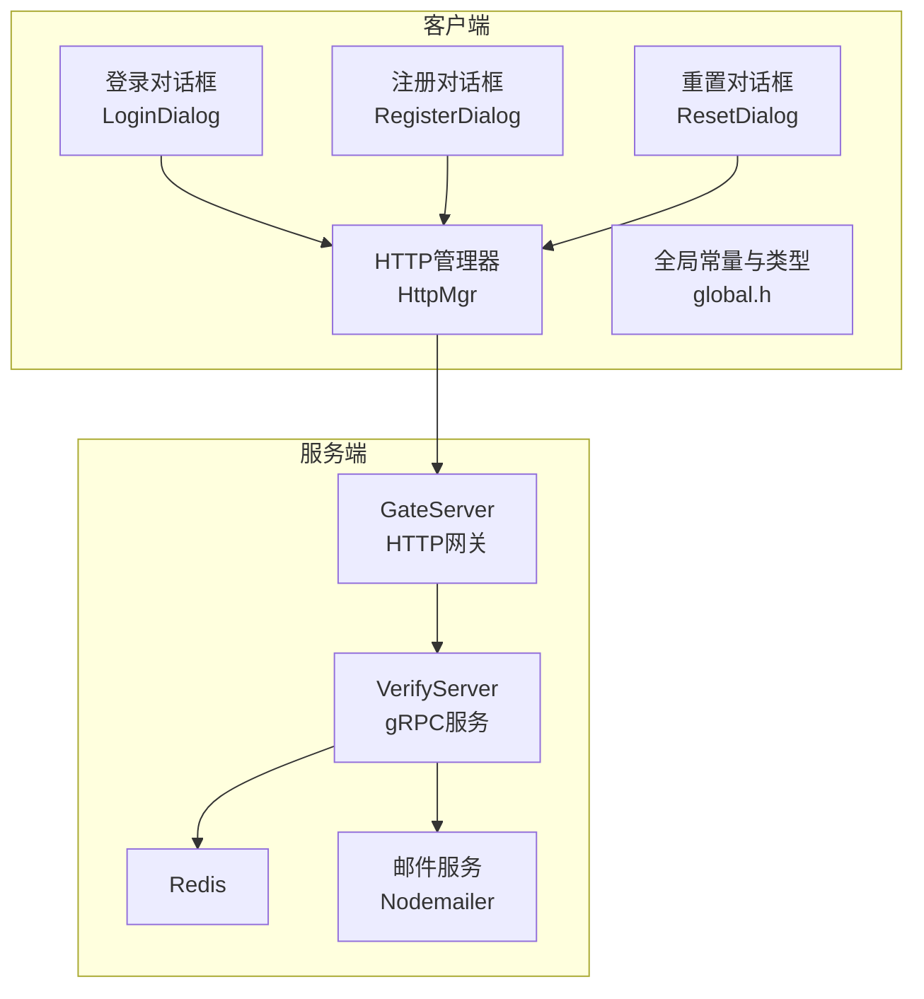
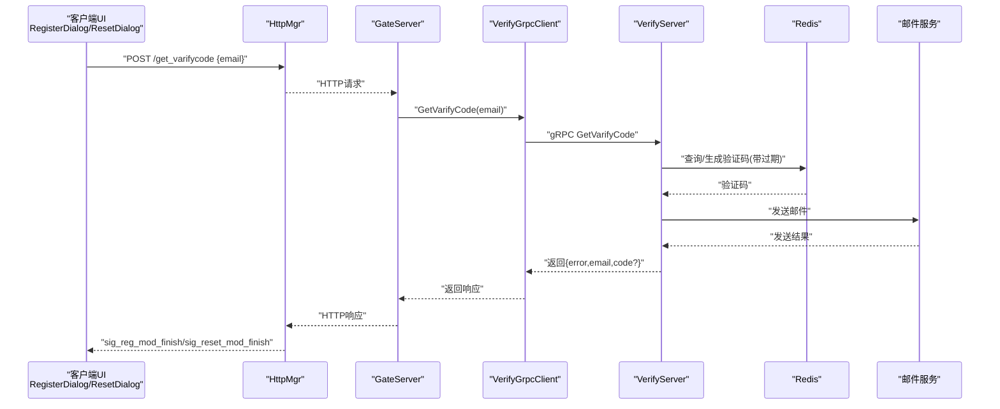
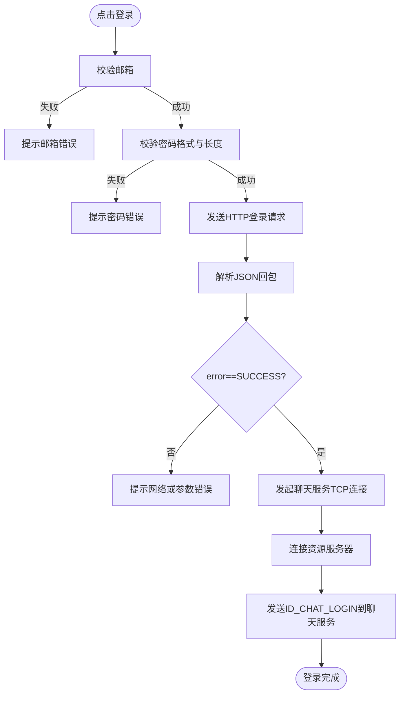
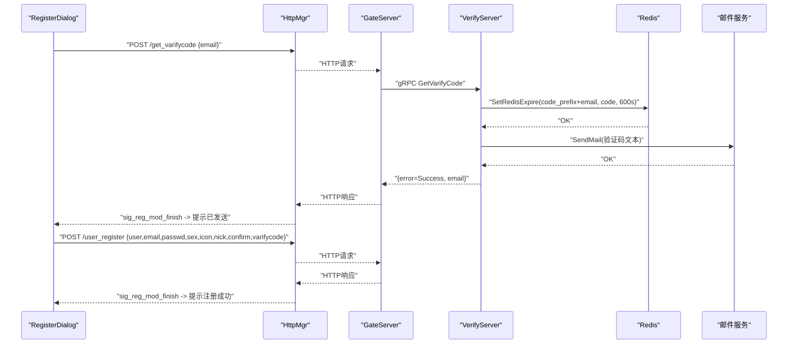
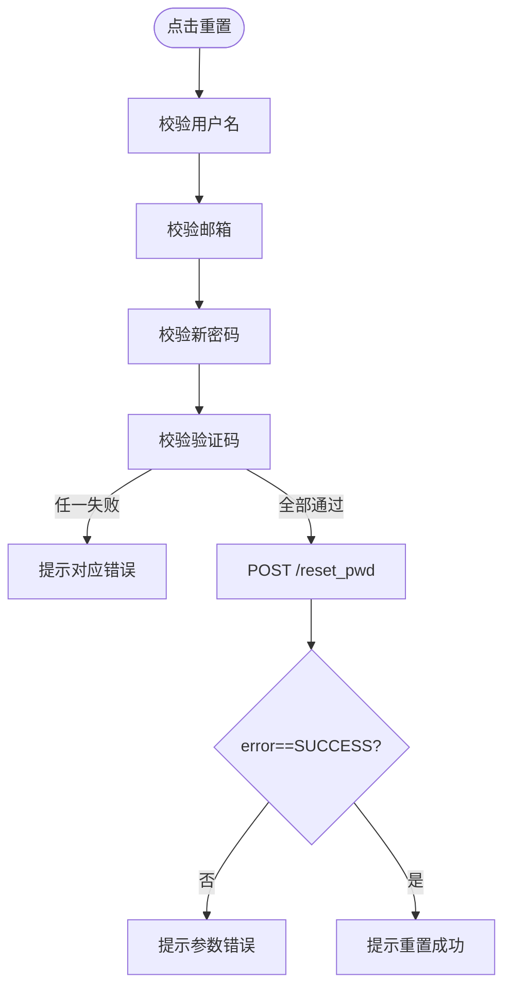
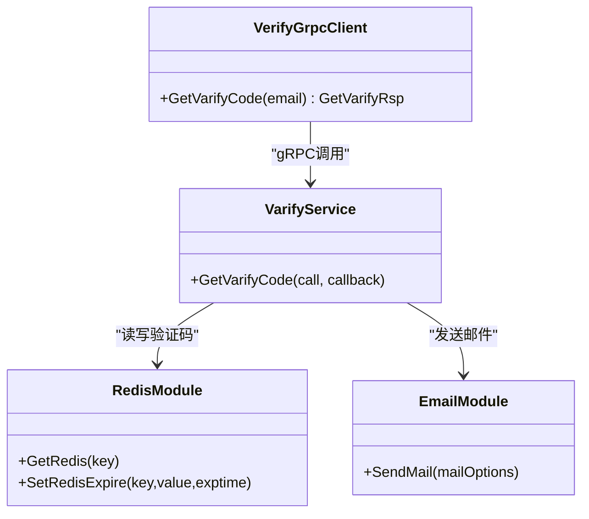
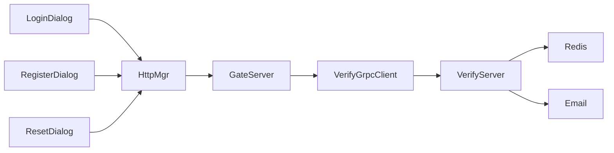

# 用户认证系统

<cite>
**本文引用的文件**   
- [logindialog.h](file://client/llfcchat/include/logindialog.h)
- [logindialog.cpp](file://client/llfcchat/src/logindialog.cpp)
- [registerdialog.h](file://client/llfcchat/include/registerdialog.h)
- [registerdialog.cpp](file://client/llfcchat/src/registerdialog.cpp)
- [resetdialog.h](file://client/llfcchat/include/resetdialog.h)
- [resetdialog.cpp](file://client/llfcchat/src/resetdialog.cpp)
- [httpmgr.h](file://client/llfcchat/include/httpmgr.h)
- [global.h](file://client/llfcchat/include/global.h)
- [config.ini](file://client/llfcchat/config/config.ini)
- [verify.proto](file://proto/verify_service/verify.proto)
- [VerifyGrpcClient.h](file://server/GateServer/include/VerifyGrpcClient.h)
- [server.js](file://server/VarifyServer/server.js)
- [email.js](file://server/VarifyServer/email.js)
- [redis.js](file://server/VarifyServer/redis.js)
</cite>

## 目录
1. [简介](#简介)
2. [项目结构](#项目结构)
3. [核心组件](#核心组件)
4. [架构总览](#架构总览)
5. [详细组件分析](#详细组件分析)
6. [依赖关系分析](#依赖关系分析)
7. [性能与扩展性](#性能与扩展性)
8. [故障排查指南](#故障排查指南)
9. [结论](#结论)
10. [附录：接口与数据模型](#附录接口与数据模型)

## 简介
本文件为 LLFCChat 用户认证系统的功能文档，覆盖用户注册、登录、密码重置与邮箱验证码流程。文档从客户端 UI 对话框（LoginDialog、RegisterDialog、ResetDialog）出发，说明 HTTP 调用、领域模型、错误处理、以及与 GateServer 和 VerifyServer 的交互关系。同时给出配置项、参数与返回值约定，并提供常见问题定位方法。

## 项目结构
认证相关代码主要分布在客户端 Qt 工程与服务端 GateServer/VerifyServer 中：
- 客户端
  - UI 层：登录、注册、重置三个对话框
  - HTTP 管理层：统一封装 HTTP 请求与回调分发
  - 全局定义：ReqId、ErrorCodes、Modules、TipErr、ServerInfo 等
- 服务端
  - GateServer：HTTP 网关，负责鉴权、路由、与 VerifyServer gRPC 通信
  - VerifyServer：Node.js 服务，基于 Redis 生成并缓存验证码，通过邮件发送

**图表来源** 
- [logindialog.cpp:175-195](file://client/llfcchat/src/logindialog.cpp#L175-L195)
- [registerdialog.cpp:98-111](file://client/llfcchat/src/registerdialog.cpp#L98-L111)
- [resetdialog.cpp:50-64](file://client/llfcchat/src/resetdialog.cpp#L50-L64)
- [httpmgr.h:18-31](file://client/llfcchat/include/httpmgr.h#L18-L31)
- [VerifyGrpcClient.h:87-104](file://server/GateServer/include/VerifyGrpcClient.h#L87-L104)
- [server.js:15-64](file://server/VarifyServer/server.js#L15-L64)
- [redis.js:87-98](file://server/VarifyServer/redis.js#L87-L98)
- [email.js:22-35](file://server/VarifyServer/email.js#L22-L35)

**章节来源**
- [logindialog.h:11-44](file://client/llfcchat/include/logindialog.h#L11-L44)
- [registerdialog.h:16-52](file://client/llfcchat/include/registerdialog.h#L16-L52)
- [resetdialog.h:11-41](file://client/llfcchat/include/resetdialog.h#L11-L41)
- [httpmgr.h:11-31](file://client/llfcchat/include/httpmgr.h#L11-L31)
- [global.h:43-101](file://client/llfcchat/include/global.h#L43-L101)
- [config.ini:1-4](file://client/llfcchat/config/config.ini#L1-L4)

## 核心组件
- LoginDialog：处理用户登录输入校验、HTTP 登录请求、解析回包、建立聊天与资源服务器 TCP 连接。
- RegisterDialog：处理注册输入校验、获取验证码、提交注册请求、成功后倒计时返回登录。
- ResetDialog：处理重置密码输入校验、获取验证码、提交重置请求。
- HttpMgr：单例 HTTP 管理器，封装 QNetworkAccessManager，按模块分发完成信号（注册/重置/登录）。
- global.h：集中定义 ReqId、ErrorCodes、Modules、TipErr、ServerInfo 等关键枚举与数据结构。
- VerifyGrpcClient：GateServer 侧 gRPC 客户端，连接 VerifyServer 获取验证码。
- VerifyServer：Node.js 实现，使用 Redis 存储验证码，发送邮件。

**章节来源**
- [logindialog.cpp:12-39](file://client/llfcchat/src/logindialog.cpp#L12-L39)
- [registerdialog.cpp:9-25](file://client/llfcchat/src/registerdialog.cpp#L9-L25)
- [resetdialog.cpp:8-36](file://client/llfcchat/src/resetdialog.cpp#L8-L36)
- [httpmgr.h:11-31](file://client/llfcchat/include/httpmgr.h#L11-L31)
- [global.h:43-136](file://client/llfcchat/include/global.h#L43-L136)
- [VerifyGrpcClient.h:80-110](file://server/GateServer/include/VerifyGrpcClient.h#L80-L110)
- [server.js:66-76](file://server/VarifyServer/server.js#L66-L76)

## 架构总览
认证链路涉及客户端 HTTP、GateServer 网关、VerifyServer gRPC、Redis 与邮件服务。下图展示“获取验证码”的核心时序。

**图表来源** 
- [registerdialog.cpp:98-111](file://client/llfcchat/src/registerdialog.cpp#L98-L111)
- [resetdialog.cpp:50-64](file://client/llfcchat/src/resetdialog.cpp#L50-L64)
- [VerifyGrpcClient.h:87-104](file://server/GateServer/include/VerifyGrpcClient.h#L87-L104)
- [server.js:15-64](file://server/VarifyServer/server.js#L15-L64)
- [redis.js:87-98](file://server/VarifyServer/redis.js#L87-L98)
- [email.js:22-35](file://server/VarifyServer/email.js#L22-L35)

## 详细组件分析

### 登录流程（LoginDialog）
- 输入校验：邮箱非空；密码长度 6~15，且仅允许字母、数字与部分特殊字符。
- HTTP 登录：构造 JSON 包含 email 与 passwd（passwd 经 xorString 加密），发送至 GateServer 的 user_login 接口。
- 回包处理：解析 error、uid、token、chathost/chatport、reshost/resport，随后触发连接聊天与资源服务器。
- 多设备支持：登录成功后下发 token，后续聊天/TCP 登录携带 token，便于多设备并发登录与会话管理。

**图表来源** 
- [logindialog.cpp:175-195](file://client/llfcchat/src/logindialog.cpp#L175-L195)
- [logindialog.cpp:197-223](file://client/llfcchat/src/logindialog.cpp#L197-L223)
- [logindialog.cpp:225-262](file://client/llfcchat/src/logindialog.cpp#L225-L262)
- [global.h:43-88](file://client/llfcchat/include/global.h#L43-L88)

**章节来源**
- [logindialog.cpp:131-166](file://client/llfcchat/src/logindialog.cpp#L131-L166)
- [logindialog.cpp:175-195](file://client/llfcchat/src/logindialog.cpp#L175-L195)
- [logindialog.cpp:197-223](file://client/llfcchat/src/logindialog.cpp#L197-L223)
- [logindialog.cpp:225-262](file://client/llfcchat/src/logindialog.cpp#L225-L262)

### 注册流程（RegisterDialog）
- 输入校验：用户名非空；邮箱正则匹配；密码与确认密码一致且符合规则；验证码非空。
- 获取验证码：点击按钮后发送 GET_VARIFY_CODE 请求，成功后提示“已发送到邮箱”。
- 提交注册：组装 user、email、passwd（xor）、sex、icon、nick、confirm（xor）、varifycode，发送至 user_register。
- 成功反馈：显示“注册成功”，进入倒计时页面自动返回登录。

**图表来源** 
- [registerdialog.cpp:98-111](file://client/llfcchat/src/registerdialog.cpp#L98-L111)
- [registerdialog.cpp:319-362](file://client/llfcchat/src/registerdialog.cpp#L319-L362)
- [server.js:15-64](file://server/VarifyServer/server.js#L15-L64)
- [redis.js:87-98](file://server/VarifyServer/redis.js#L87-L98)
- [email.js:22-35](file://server/VarifyServer/email.js#L22-L35)

**章节来源**
- [registerdialog.cpp:142-248](file://client/llfcchat/src/registerdialog.cpp#L142-L248)
- [registerdialog.cpp:250-277](file://client/llfcchat/src/registerdialog.cpp#L250-L277)
- [registerdialog.cpp:319-362](file://client/llfcchat/src/registerdialog.cpp#L319-L362)

### 密码重置流程（ResetDialog）
- 输入校验：用户名非空；邮箱正则匹配；新密码符合规则；验证码非空。
- 获取验证码：同注册流程，复用 /get_varifycode。
- 提交重置：发送 reset_pwd，包含 user、email、passwd（xor）、varifycode。
- 成功反馈：提示“重置成功”，可返回登录。

**图表来源** 
- [resetdialog.cpp:50-64](file://client/llfcchat/src/resetdialog.cpp#L50-L64)
- [resetdialog.cpp:221-251](file://client/llfcchat/src/resetdialog.cpp#L221-L251)

**章节来源**
- [resetdialog.cpp:94-161](file://client/llfcchat/src/resetdialog.cpp#L94-L161)
- [resetdialog.cpp:180-206](file://client/llfcchat/src/resetdialog.cpp#L180-L206)
- [resetdialog.cpp:221-251](file://client/llfcchat/src/resetdialog.cpp#L221-L251)

### 邮箱验证码流程（VerifyServer + Redis + Email）
- 生成策略：若 Redis 不存在该邮箱的验证码，则生成短码（UUID前4位），设置过期时间（如 600 秒）。
- 邮件发送：构造邮件内容，包含验证码与有效期提示，通过 Nodemailer 发送。
- 错误处理：Redis 写入失败或异常时返回相应错误码。

**图表来源** 
- [VerifyGrpcClient.h:87-104](file://server/GateServer/include/VerifyGrpcClient.h#L87-L104)
- [server.js:15-64](file://server/VarifyServer/server.js#L15-L64)
- [redis.js:41-98](file://server/VarifyServer/redis.js#L41-L98)
- [email.js:22-35](file://server/VarifyServer/email.js#L22-L35)

**章节来源**
- [verify.proto:1-19](file://proto/verify_service/verify.proto#L1-L19)
- [server.js:15-64](file://server/VarifyServer/server.js#L15-L64)
- [redis.js:87-98](file://server/VarifyServer/redis.js#L87-L98)
- [email.js:22-35](file://server/VarifyServer/email.js#L22-L35)

### 多设备登录支持
- 登录成功后，GateServer 返回 token；客户端在连接聊天服务时携带 uid 与 token。
- 服务端可通过 token 进行会话管理与权限校验，允许多设备同时在线。
- 建议结合服务端日志与 Redis 中的 token 映射表进行调试。

**章节来源**
- [logindialog.cpp:197-223](file://client/llfcchat/src/logindialog.cpp#L197-L223)
- [logindialog.cpp:243-262](file://client/llfcchat/src/logindialog.cpp#L243-L262)
- [global.h:122-136](file://client/llfcchat/include/global.h#L122-L136)

## 依赖关系分析
- 客户端
  - LoginDialog/RegisterDialog/ResetDialog 依赖 HttpMgr 发送 HTTP 请求。
  - HttpMgr 通过 QNetworkAccessManager 发出请求，并按 Modules 分发完成信号。
  - 全局枚举 ReqId/ErrorCodes/Modules/TipErr 贯穿各对话框与回调。
- 服务端
  - GateServer 作为 HTTP 网关，调用 VerifyGrpcClient 访问 VerifyServer。
  - VerifyServer 依赖 Redis 与邮件服务。

**图表来源** 
- [logindialog.cpp:175-195](file://client/llfcchat/src/logindialog.cpp#L175-L195)
- [registerdialog.cpp:98-111](file://client/llfcchat/src/registerdialog.cpp#L98-L111)
- [resetdialog.cpp:50-64](file://client/llfcchat/src/resetdialog.cpp#L50-L64)
- [httpmgr.h:18-31](file://client/llfcchat/include/httpmgr.h#L18-L31)
- [VerifyGrpcClient.h:87-104](file://server/GateServer/include/VerifyGrpcClient.h#L87-L104)
- [server.js:15-64](file://server/VarifyServer/server.js#L15-L64)

**章节来源**
- [global.h:43-101](file://client/llfcchat/include/global.h#L43-L101)
- [httpmgr.h:11-31](file://client/llfcchat/include/httpmgr.h#L11-L31)
- [VerifyGrpcClient.h:80-110](file://server/GateServer/include/VerifyGrpcClient.h#L80-L110)

## 性能与扩展性
- 验证码缓存：Redis 设置过期时间，避免重复生成与频繁邮件发送。
- gRPC 连接池：VerifyGrpcClient 维护连接池，提升并发能力。
- 异步处理：客户端使用 Qt 信号槽与定时器，避免阻塞 UI。
- 可扩展点：
  - 增加验证码复杂度策略（长度、字符集、频率限制）。
  - 引入短信/第三方验证通道。
  - 对 token 增加刷新机制与黑名单。

[本节为通用指导，不直接分析具体文件]

## 故障排查指南
- 网络请求错误
  - 检查 gate_url_prefix 配置是否正确（host/port）。
  - 查看 HttpMgr 的错误码与网络状态。
- JSON 解析错误
  - 确认服务端返回 JSON 结构与字段名是否一致。
- 验证码相关问题
  - 检查 Redis 连接与 key 是否存在/过期。
  - 检查邮件服务配置（SMTP host/port/auth）。
- 登录失败
  - 核对 passwd 是否经过 xorString 处理。
  - 检查 GateServer 返回的 error 值与消息。

**章节来源**
- [config.ini:1-4](file://client/llfcchat/config/config.ini#L1-L4)
- [logindialog.cpp:197-223](file://client/llfcchat/src/logindialog.cpp#L197-L223)
- [registerdialog.cpp:113-139](file://client/llfcchat/src/registerdialog.cpp#L113-L139)
- [resetdialog.cpp:66-92](file://client/llfcchat/src/resetdialog.cpp#L66-L92)
- [server.js:56-64](file://server/VarifyServer/server.js#L56-L64)
- [redis.js:41-56](file://server/VarifyServer/redis.js#L41-L56)
- [email.js:22-35](file://server/VarifyServer/email.js#L22-L35)

## 结论
LLFCChat 的用户认证系统以清晰的客户端 UI 对话框与 HTTP 管理层为核心，配合 GateServer 与 VerifyServer 的协作，实现了安全的注册、登录与密码重置流程。通过 Redis 缓存验证码与邮件服务集成，保证了用户体验与安全性。多设备登录通过 token 机制支持，具备较好的扩展性与可维护性。

[本节为总结，不直接分析具体文件]

## 附录：接口与数据模型
- 客户端配置
  - GateServer 地址与端口：host、port（config.ini）
- HTTP 接口（客户端调用）
  - /get_varifycode：请求体 {email}，响应 {error, email[, code]}
  - /user_register：请求体 {user, email, passwd, sex, icon, nick, confirm, varifycode}，响应 {error, email[, uid]}
  - /reset_pwd：请求体 {user, email, passwd, varifycode}，响应 {error, email[, uuid]}
  - /user_login：请求体 {email, passwd}，响应 {error, uid, token, chathost, chatport, reshost, resport}
- gRPC 接口（GateServer -> VerifyServer）
  - VarifyService.GetVarifyCode：请求 {email}，响应 {error, email, code}
- 全局枚举与类型
  - ReqId：ID_GET_VARIFY_CODE、ID_REG_USER、ID_RESET_PWD、ID_LOGIN_USER、ID_CHAT_LOGIN 等
  - ErrorCodes：SUCCESS、ERR_JSON、ERR_NETWORK 等
  - Modules：REGISTERMOD、RESETMOD、LOGINMOD
  - ServerInfo：_chat_host/_chat_port/_res_host/_res_port/_token/_uid

**章节来源**
- [config.ini:1-4](file://client/llfcchat/config/config.ini#L1-L4)
- [registerdialog.cpp:98-111](file://client/llfcchat/src/registerdialog.cpp#L98-L111)
- [registerdialog.cpp:319-362](file://client/llfcchat/src/registerdialog.cpp#L319-L362)
- [resetdialog.cpp:50-64](file://client/llfcchat/src/resetdialog.cpp#L50-L64)
- [resetdialog.cpp:221-251](file://client/llfcchat/src/resetdialog.cpp#L221-L251)
- [logindialog.cpp:175-195](file://client/llfcchat/src/logindialog.cpp#L175-L195)
- [verify.proto:1-19](file://proto/verify_service/verify.proto#L1-L19)
- [global.h:43-136](file://client/llfcchat/include/global.h#L43-L136)