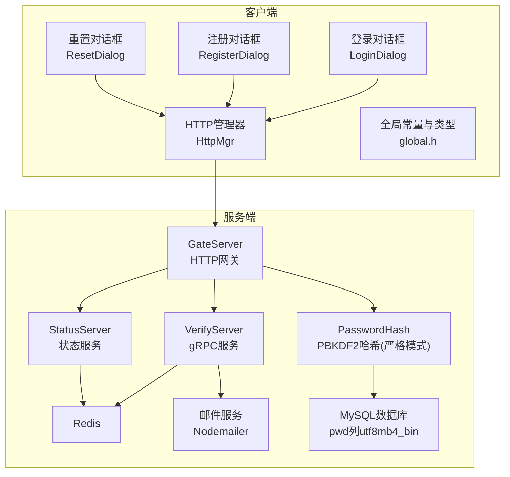
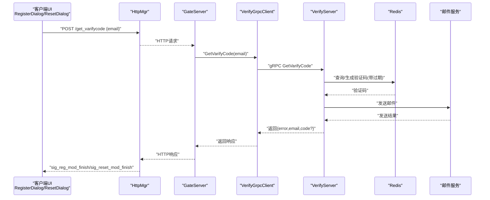
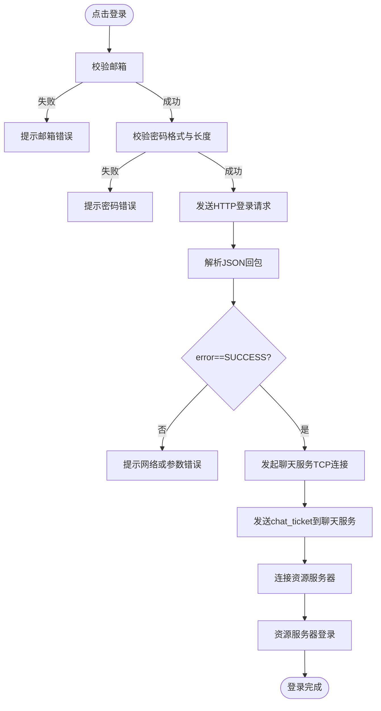
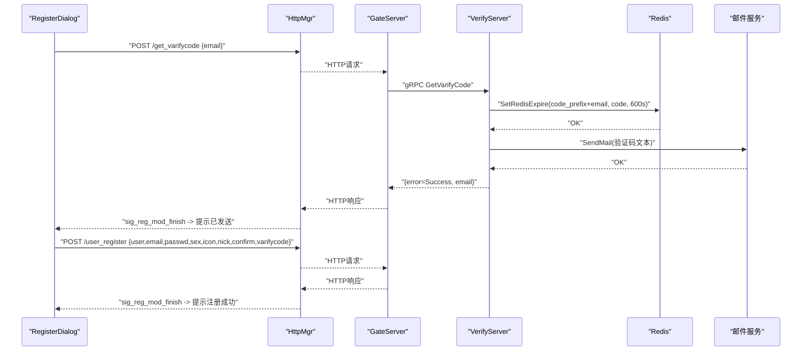
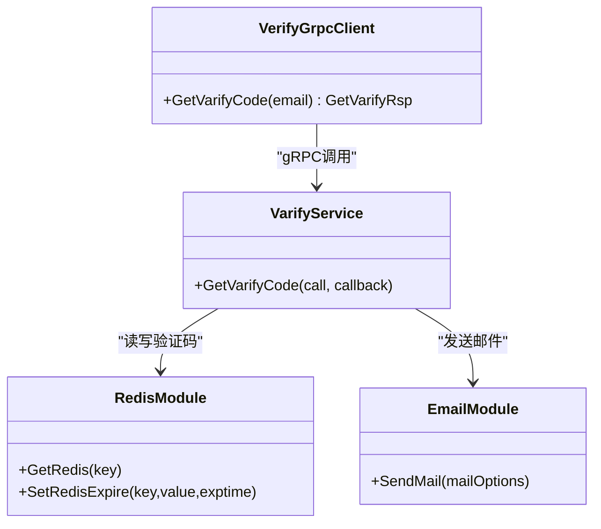
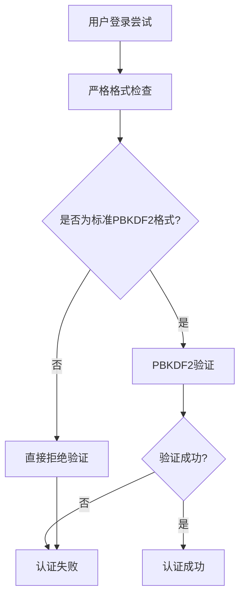
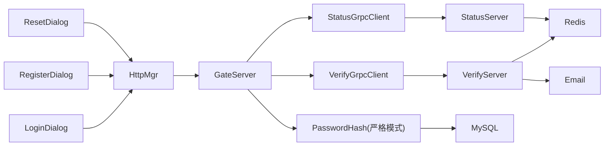

# 用户认证系统

<cite>
**本文引用的文件**   
- [logindialog.h](file://client/llfcchat/include/logindialog.h)
- [logindialog.cpp](file://client/llfcchat/src/logindialog.cpp)
- [registerdialog.h](file://client/llfcchat/include/registerdialog.h)
- [registerdialog.cpp](file://client/llfcchat/src/registerdialog.cpp)
- [resetdialog.h](file://client/llfcchat/include/resetdialog.h)
- [resetdialog.cpp](file://client/llfcchat/src/resetdialog.cpp)
- [httpmgr.h](file://client/llfcchat/include/httpmgr.h)
- [global.h](file://client/llfcchat/include/global.h)
- [config.ini](file://client/llfcchat/config/config.ini)
- [verify.proto](file://proto/verify_service/verify.proto)
- [status.proto](file://proto/status_service/status.proto)
- [VerifyGrpcClient.h](file://server/GateServer/include/VerifyGrpcClient.h)
- [StatusGrpcClient.h](file://server/GateServer/include/StatusGrpcClient.h)
- [server.js](file://server/VarifyServer/server.js)
- [email.js](file://server/VarifyServer/email.js)
- [redis.js](file://server/VarifyServer/redis.js)
- [PasswordHash.h](file://server/common/include/PasswordHash.h)
- [PasswordHash.cpp](file://server/common/src/PasswordHash.cpp)
- [MysqlDao.cpp (GateServer)](file://server/GateServer/src/MysqlDao.cpp)
- [MysqlDao.cpp (ChatServer)](file://server/ChatServer/src/MysqlDao.cpp)
- [MysqlDao.cpp (ResourceServer)](file://server/ResourceServer/src/MysqlDao.cpp)
- [20260804_pwd_pbkdf2.sql](file://sql备份/20260804_pwd_pbkdf2.sql)
- [password_hash_tests.cpp](file://tests/password_hash_tests.cpp)
</cite>

## 更新摘要
**所做更改**   
- **重大安全升级**：移除了明文密码支持和自动迁移机制，采用硬切换策略
- **简化密码验证**：VerifyPassword函数现在严格只接受PBKDF2-SHA256格式的哈希值
- **移除遗留兼容**：删除了ShouldRehash函数和渐进式迁移框架
- **增强安全性**：任何非标准格式的密码存储都会导致验证失败
- **保持向后兼容**：现有PBKDF2格式的用户不受影响，存量明文用户需通过重置密码功能升级

## 目录
1. [简介](#简介)
2. [项目结构](#项目结构)
3. [核心组件](#核心组件)
4. [架构总览](#架构总览)
5. [详细组件分析](#详细组件分析)
6. [依赖关系分析](#依赖关系分析)
7. [性能与扩展性](#性能与扩展性)
8. [故障排查指南](#故障排查指南)
9. [结论](#结论)
10. [附录：接口与数据模型](#附录接口与数据模型)

## 简介
本文件为 LLFCChat 用户认证系统的功能文档，覆盖用户注册、登录、密码重置与邮箱验证码流程。**重要更新**：认证系统已全面升级为严格的PBKDF2-HMAC-SHA256密码哈希机制，移除了所有明文密码支持和自动迁移功能。系统现在采用硬切换策略，VerifyPassword函数仅接受标准的`pbkdf2-sha256$i=<iter>$<salt_hex>$<dk_hex>`格式，任何非标准格式（包括明文密码）都会直接拒绝验证。文档从客户端 UI 对话框（LoginDialog、RegisterDialog、ResetDialog）出发，说明 HTTP 调用、领域模型、错误处理、以及与 GateServer 和 VerifyServer 的交互关系。

## 项目结构
认证相关代码主要分布在客户端 Qt 工程与服务端 GateServer/VerifyServer 中：
- 客户端
  - UI 层：登录、注册、重置三个对话框
  - HTTP 管理层：统一封装 HTTP 请求与回调分发
  - 全局定义：ReqId、ErrorCodes、Modules、TipErr、ServerInfo 等
- 服务端
  - GateServer：HTTP 网关，负责鉴权、路由、与 VerifyServer gRPC 通信
  - VerifyServer：Node.js 服务，基于 Redis 生成并缓存验证码，通过邮件发送
  - StatusServer：状态服务器，提供 ChatServer 分配和一次性票据签发
  - **强化**：PasswordHash 模块，仅提供 PBKDF2 密码哈希功能，无遗留兼容

**图表来源** 
- [logindialog.cpp:175-195](file://client/llfcchat/src/logindialog.cpp#L175-L195)
- [registerdialog.cpp:98-111](file://client/llfcchat/src/registerdialog.cpp#L98-L111)
- [resetdialog.cpp:50-64](file://client/llfcchat/src/resetdialog.cpp#L50-64)
- [httpmgr.h:18-31](file://client/llfcchat/include/httpmgr.h#L18-L31)
- [VerifyGrpcClient.h:87-104](file://server/GateServer/include/VerifyGrpcClient.h#L87-L104)
- [StatusGrpcClient.h:28-29](file://server/GateServer/include/StatusGrpcClient.h#L28-L29)
- [server.js:15-64](file://server/VarifyServer/server.js#L15-L64)
- [redis.js:87-98](file://server/VarifyServer/redis.js#L87-L98)
- [email.js:22-35](file://server/VarifyServer/email.js#L22-35)
- [PasswordHash.h:1-28](file://server/common/include/PasswordHash.h#L1-28)

**章节来源**
- [logindialog.h:11-44](file://client/llfcchat/include/logindialog.h#L11-L44)
- [registerdialog.h:16-52](file://client/llfcchat/include/registerdialog.h#L16-L52)
- [resetdialog.h:11-41](file://client/llfcchat/include/resetdialog.h#L11-L41)
- [httpmgr.h:11-31](file://client/llfcchat/include/httpmgr.h#L11-L31)
- [global.h:43-101](file://client/llfcchat/include/global.h#L43-L101)
- [config.ini:1-4](file://client/llfcchat/config/config.ini#L1-L4)

## 核心组件
- LoginDialog：处理用户登录输入校验、HTTP 登录请求、解析回包、建立聊天与资源服务器 TCP 连接。**更新**：现在直接使用 chat_ticket 进行登录，支持严格的 PBKDF2 密码验证，不再支持明文密码。
- RegisterDialog：处理注册输入校验、获取验证码、提交注册请求、成功后倒计时返回登录。**更新**：注册时密码经过 PBKDF2 哈希处理，确保新账户使用安全的密码存储格式。
- ResetDialog：处理重置密码输入校验、获取验证码、提交重置请求。**更新**：重置密码时使用 PBKDF2 哈希存储，帮助存量明文用户升级到安全格式。
- HttpMgr：单例 HTTP 管理器，封装 QNetworkAccessManager，按模块分发完成信号（注册/重置/登录）。
- global.h：集中定义 ReqId、ErrorCodes、Modules、TipErr、ServerInfo 等关键枚举与数据结构。
- VerifyGrpcClient：GateServer 侧 gRPC 客户端，连接 VerifyServer 获取验证码。
- StatusGrpcClient：**更新**：仅保留 GetChatServer 方法，用于获取 ChatServer 地址和一次性票据。
- VerifyServer：Node.js 实现，使用 Redis 存储验证码，发送邮件。
- StatusServer：**更新**：简化后的状态服务，专注于 ChatServer 分配和票据管理。
- **强化** PasswordHash：纯 PBKDF2-HMAC-SHA256 密码哈希模块，不提供任何遗留兼容，确保最高安全性。

**章节来源**
- [logindialog.cpp:12-39](file://client/llfcchat/src/logindialog.cpp#L12-L39)
- [registerdialog.cpp:9-25](file://client/llfcchat/src/registerdialog.cpp#L9-L25)
- [resetdialog.cpp:8-36](file://client/llfcchat/src/resetdialog.cpp#L8-L36)
- [httpmgr.h:11-31](file://client/llfcchat/include/httpmgr.h#L11-L31)
- [global.h:43-136](file://client/llfcchat/include/global.h#L43-L136)
- [VerifyGrpcClient.h:80-110](file://server/GateServer/include/VerifyGrpcClient.h#L80-L110)
- [StatusGrpcClient.h:24-29](file://server/GateServer/include/StatusGrpcClient.h#L24-L29)
- [server.js:66-76](file://server/VarifyServer/server.js#L66-L76)
- [PasswordHash.h:1-28](file://server/common/include/PasswordHash.h#L1-28)

## 架构总览
认证链路涉及客户端 HTTP、GateServer 网关、VerifyServer gRPC、StatusServer gRPC、Redis 与邮件服务。**更新**：移除了复杂的 token 验证流程和遗留密码兼容机制，采用简化的硬性安全策略。下图展示"获取验证码"的核心时序。

**图表来源** 
- [registerdialog.cpp:98-111](file://client/llfcchat/src/registerdialog.cpp#L98-L111)
- [resetdialog.cpp:50-64](file://client/llfcchat/src/resetdialog.cpp#L50-64)
- [VerifyGrpcClient.h:87-104](file://server/GateServer/include/VerifyGrpcClient.h#L87-L104)
- [server.js:15-64](file://server/VarifyServer/server.js#L15-64)
- [redis.js:87-98](file://server/VarifyServer/redis.js#L87-L98)
- [email.js:22-35](file://server/VarifyServer/email.js#L22-35)

## 详细组件分析

### 登录流程（LoginDialog）
**更新**：登录流程已大幅简化，移除了 StatusServer Login 验证步骤，集成严格的 PBKDF2 密码验证。
- 输入校验：邮箱非空；密码长度 6~15，且仅允许字母、数字与部分特殊字符。
- HTTP 登录：构造 JSON 包含 email 与 passwd（passwd 经 xorString 加密），发送至 GateServer 的 user_login 接口。
- 回包处理：解析 error、uid、chat_ticket、chathost/chatport、reshost/resport，随后触发连接聊天与资源服务器。
- 多设备支持：登录成功后下发 chat_ticket，后续聊天/TCP 登录携带 ticket，便于多设备并发登录与会话管理。
- **严格验证**：密码验证使用严格的 PBKDF2 哈希，不再支持明文密码或遗留格式。

**图表来源** 
- [logindialog.cpp:175-195](file://client/llfcchat/src/logindialog.cpp#L175-L195)
- [logindialog.cpp:197-223](file://client/llfcchat/src/logindialog.cpp#L197-L223)
- [logindialog.cpp:225-262](file://client/llfcchat/src/logindialog.cpp#L225-L262)
- [logindialog.cpp:240-249](file://client/llfcchat/src/logindialog.cpp#L240-L249)
- [global.h:43-88](file://client/llfcchat/include/global.h#L43-L88)

**章节来源**
- [logindialog.cpp:131-166](file://client/llfcchat/src/logindialog.cpp#L131-L166)
- [logindialog.cpp:175-195](file://client/llfcchat/src/logindialog.cpp#L175-L195)
- [logindialog.cpp:197-223](file://client/llfcchat/src/logindialog.cpp#L197-L223)
- [logindialog.cpp:225-262](file://client/llfcchat/src/logindialog.cpp#L225-L262)
- [logindialog.cpp:240-249](file://client/llfcchat/src/logindialog.cpp#L240-L249)

### 注册流程（RegisterDialog）
- 输入校验：用户名非空；邮箱正则匹配；密码与确认密码一致且符合规则；验证码非空。
- 获取验证码：点击按钮后发送 GET_VARIFY_CODE 请求，成功后提示"已发送到邮箱"。
- 提交注册：组装 user、email、passwd（xor）、sex、icon、nick、confirm（xor）、varifycode，发送至 user_register。
- 成功反馈：显示"注册成功"，进入倒计时页面自动返回登录。
- **严格存储**：注册时密码使用 PBKDF2 哈希存储，格式为 `pbkdf2-sha256$i=<iter>$<salt_hex>$<dk_hex>`，确保新账户的安全性。

**图表来源** 
- [registerdialog.cpp:98-111](file://client/llfcchat/src/registerdialog.cpp#L98-L111)
- [registerdialog.cpp:319-362](file://client/llfcchat/src/registerdialog.cpp#L319-362)
- [server.js:15-64](file://server/VarifyServer/server.js#L15-64)
- [redis.js:87-98](file://server/VarifyServer/redis.js#L87-98)
- [email.js:22-35](file://server/VarifyServer/email.js#L22-35)

**章节来源**
- [registerdialog.cpp:142-248](file://client/llfcchat/src/registerdialog.cpp#L142-L248)
- [registerdialog.cpp:250-277](file://client/llfcchat/src/registerdialog.cpp#L250-L277)
- [registerdialog.cpp:319-362](file://client/llfcchat/src/registerdialog.cpp#L319-362)

### 密码重置流程（ResetDialog）
- 输入校验：用户名非空；邮箱正则匹配；新密码符合规则；验证码非空。
- 获取验证码：同注册流程，复用 /get_varifycode。
- 提交重置：发送 reset_pwd，包含 user、email、passwd（xor）、varifycode。
- 成功反馈：提示"重置成功"，可返回登录。
- **强制升级**：重置密码时使用 PBKDF2 哈希存储，帮助存量明文用户升级到安全格式。

**图表来源** 
- [resetdialog.cpp:50-64](file://client/llfcchat/src/resetdialog.cpp#L50-64)
- [resetdialog.cpp:221-251](file://client/llfcchat/src/resetdialog.cpp#L221-251)

**章节来源**
- [resetdialog.cpp:94-161](file://client/llfcchat/src/resetdialog.cpp#L94-L161)
- [resetdialog.cpp:180-206](file://client/llfcchat/src/resetdialog.cpp#L180-L206)
- [resetdialog.cpp:221-251](file://client/llfcchat/src/resetdialog.cpp#L221-L251)

### 邮箱验证码流程（VerifyServer + Redis + Email）
- 生成策略：若 Redis 不存在该邮箱的验证码，则生成短码（UUID前4位），设置过期时间（如 600 秒）。
- 邮件发送：构造邮件内容，包含验证码与有效期提示，通过 Nodemailer 发送。
- 错误处理：Redis 写入失败或异常时返回相应错误码。

**图表来源** 
- [VerifyGrpcClient.h:87-104](file://server/GateServer/include/VerifyGrpcClient.h#L87-104)
- [server.js:15-64](file://server/VarifyServer/server.js#L15-64)
- [redis.js:41-98](file://server/VarifyServer/redis.js#L41-98)
- [email.js:22-35](file://server/VarifyServer/email.js#L22-35)

**章节来源**
- [verify.proto:1-19](file://proto/verify_service/verify.proto#L1-19)
- [server.js:15-64](file://server/VarifyServer/server.js#L15-64)
- [redis.js:87-98](file://server/VarifyServer/redis.js#L87-L98)
- [email.js:22-35](file://server/VarifyServer/email.js#L22-L35)

### 简化的多设备登录支持
**更新**：移除了复杂的 StatusServer Login 验证，采用基于 chat_ticket 的简化机制。
- 登录成功后，GateServer 返回 chat_ticket（一次性票据，60s TTL）；客户端在连接聊天服务时携带 uid 与 chat_ticket。
- StatusServer 通过 Redis 管理票据的生命周期，确保安全性。
- 建议结合服务端日志与 Redis 中的票据映射表进行调试。

**章节来源**
- [logindialog.cpp:197-223](file://client/llfcchat/src/logindialog.cpp#L197-L223)
- [logindialog.cpp:240-249](file://client/llfcchat/src/logindialog.cpp#L240-L249)
- [global.h:122-136](file://client/llfcchat/include/global.h#L122-L136)
- [status.proto:23-30](file://proto/status_service/status.proto#L23-L30)

### 严格的 PBKDF2 密码哈希与安全机制
**重大更新**：系统现在采用严格的 PBKDF2-HMAC-SHA256 密码哈希算法，移除了所有遗留兼容功能。
- **哈希格式**：`pbkdf2-sha256$i=<iter>$<salt_hex>$<dk_hex>`，其中 iter=600000（OWASP推荐值），salt为16字节随机数，dk为32字节派生密钥。
- **恒定时间比较**：使用 OpenSSL 的 CRYPTO_memcmp 函数，防止时序攻击。
- **严格验证**：VerifyPassword 函数现在只接受标准的 PBKDF2 格式，明文密码和任何非标准格式都会直接返回 false。
- **移除迁移机制**：删除了 ShouldRehash 函数和自动迁移逻辑，不再有渐进式升级。
- **数据库加固**：user 表的 pwd 列设置为 utf8mb4_bin 排序规则，防止大小写敏感问题。

**图表来源** 
- [PasswordHash.h:1-28](file://server/common/include/PasswordHash.h#L1-28)
- [PasswordHash.cpp:117-125](file://server/common/src/PasswordHash.cpp#L117-L125)
- [MysqlDao.cpp (GateServer):270-274](file://server/GateServer/src/MysqlDao.cpp#L270-L274)
- [MysqlDao.cpp (ChatServer):163-166](file://server/ChatServer/src/MysqlDao.cpp#L163-L166)
- [MysqlDao.cpp (ResourceServer):164-167](file://server/ResourceServer/src/MysqlDao.cpp#L164-L167)

**章节来源**
- [PasswordHash.h:1-28](file://server/common/include/PasswordHash.h#L1-L28)
- [PasswordHash.cpp:1-128](file://server/common/src/PasswordHash.cpp#L1-L128)
- [MysqlDao.cpp (GateServer):260-282](file://server/GateServer/src/MysqlDao.cpp#L260-L282)
- [MysqlDao.cpp (ChatServer):150-178](file://server/ChatServer/src/MysqlDao.cpp#L150-L178)
- [MysqlDao.cpp (ResourceServer):150-179](file://server/ResourceServer/src/MysqlDao.cpp#L150-L179)
- [20260804_pwd_pbkdf2.sql:1-15](file://sql备份/20260804_pwd_pbkdf2.sql#L1-L15)

## 依赖关系分析
**更新**：移除了 StatusServer Login 相关的依赖和遗留密码兼容逻辑，新增严格的 PasswordHash 模块依赖。
- 客户端
  - LoginDialog/RegisterDialog/ResetDialog 依赖 HttpMgr 发送 HTTP 请求。
  - HttpMgr 通过 QNetworkAccessManager 发出请求，并按 Modules 分发完成信号。
  - 全局枚举 ReqId/ErrorCodes/Modules/TipErr 贯穿各对话框与回调。
- 服务端
  - GateServer 作为 HTTP 网关，调用 VerifyGrpcClient 访问 VerifyServer。
  - GateServer 调用 StatusGrpcClient 访问 StatusServer 获取 ChatServer 地址和票据。
  - VerifyServer 依赖 Redis 与邮件服务。
  - StatusServer 依赖 Redis 进行票据管理。
  - **严格化**：所有 DAO 层依赖 PasswordHash 模块进行严格的密码哈希处理，无遗留兼容。

**图表来源** 
- [logindialog.cpp:175-195](file://client/llfcchat/src/logindialog.cpp#L175-L195)
- [registerdialog.cpp:98-111](file://client/llfcchat/src/registerdialog.cpp#L98-L111)
- [resetdialog.cpp:50-64](file://client/llfcchat/src/resetdialog.cpp#L50-64)
- [httpmgr.h:18-31](file://client/llfcchat/include/httpmgr.h#L18-L31)
- [VerifyGrpcClient.h:87-104](file://server/GateServer/include/VerifyGrpcClient.h#L87-L104)
- [StatusGrpcClient.h:28-29](file://server/GateServer/include/StatusGrpcClient.h#L28-L29)
- [server.js:15-64](file://server/VarifyServer/server.js#L15-64)
- [PasswordHash.h:1-28](file://server/common/include/PasswordHash.h#L1-L28)

**章节来源**
- [global.h:43-101](file://client/llfcchat/include/global.h#L43-L101)
- [httpmgr.h:11-31](file://client/llfcchat/include/httpmgr.h#L11-L31)
- [VerifyGrpcClient.h:80-110](file://server/GateServer/include/VerifyGrpcClient.h#L80-L110)
- [StatusGrpcClient.h:24-29](file://server/GateServer/include/StatusGrpcClient.h#L24-L29)
- [PasswordHash.h:1-28](file://server/common/include/PasswordHash.h#L1-L28)

## 性能与扩展性
**更新**：简化后的架构具有更好的性能和可扩展性，同时增强了安全性。
- 验证码缓存：Redis 设置过期时间，避免重复生成与频繁邮件发送。
- gRPC 连接池：VerifyGrpcClient 和 StatusGrpcClient 维护连接池，提升并发能力。
- 异步处理：客户端使用 Qt 信号槽与定时器，避免阻塞 UI。
- 票据机制：一次性 chat_ticket 提高了安全性，减少了服务器状态管理开销。
- **优化**：PBKDF2 哈希性能优化，600k 迭代次数在 OWASP 推荐范围内，平衡了安全性和性能。
- **安全增强**：恒定时间比较避免时序攻击，不影响整体性能。
- **简化架构**：移除了复杂的迁移逻辑，降低了系统复杂度。
- 可扩展点：
  - 增加验证码复杂度策略（长度、字符集、频率限制）。
  - 引入短信/第三方验证通道。
  - 对票据增加刷新机制和黑名单。
  - **调整**：根据硬件性能提升调整 PBKDF2 迭代次数。

## 故障排查指南
**更新**：新增了严格的 PBKDF2 密码哈希相关的故障排查指导。
- 网络请求错误
  - 检查 gate_url_prefix 配置是否正确（host/port）。
  - 查看 HttpMgr 的错误码与网络状态。
- JSON 解析错误
  - 确认服务端返回 JSON 结构与字段名是否一致。
- 验证码相关问题
  - 检查 Redis 连接与 key 是否存在/过期。
  - 检查邮件服务配置（SMTP host/port/auth）。
- 登录失败
  - 核对 passwd 是否经过 xorString 处理。
  - 检查 GateServer 返回的 error 值与消息。
- **新增** 票据相关问题
  - 检查 StatusServer 是否正常运行。
  - 验证 Redis 中的票据是否有效且未过期。
  - 确认 chat_ticket 是否被正确使用（一次性使用）。
- **新增** PBKDF2 相关问题
  - 检查 OpenSSL 库是否正确链接。
  - 验证数据库 pwd 列是否为 utf8mb4_bin 排序规则。
  - 确认 HashPassword 函数返回值不为空。
  - **重要**：任何非 pbkdf2-sha256 格式的密码存储都会导致验证失败。
  - **重要**：存量明文用户需要重新设置密码才能登录。

**章节来源**
- [config.ini:1-4](file://client/llfcchat/config/config.ini#L1-L4)
- [logindialog.cpp:197-223](file://client/llfcchat/src/logindialog.cpp#L197-L223)
- [registerdialog.cpp:113-139](file://client/llfcchat/src/registerdialog.cpp#L113-L139)
- [resetdialog.cpp:66-92](file://client/llfcchat/src/resetdialog.cpp#L66-L92)
- [server.js:56-64](file://server/VarifyServer/server.js#L56-L64)
- [redis.js:41-56](file://server/VarifyServer/redis.js#L41-L56)
- [email.js:22-35](file://server/VarifyServer/email.js#L22-L35)
- [PasswordHash.cpp:117-125](file://server/common/src/PasswordHash.cpp#L117-L125)
- [20260804_pwd_pbkdf2.sql:13-15](file://sql备份/20260804_pwd_pbkdf2.sql#L13-L15)

## 结论
LLFCChat 的用户认证系统经过重大安全升级，移除了复杂的 StatusServer Login 验证流程和遗留密码兼容机制，采用基于一次性票据（chat_ticket）的简化认证机制和严格的 PBKDF2-HMAC-SHA256 密码哈希算法。新的架构以清晰的客户端 UI 对话框与 HTTP 管理层为核心，配合 GateServer 与 VerifyServer 的协作，实现了安全的注册、登录与密码重置流程。通过 Redis 缓存验证码与邮件服务集成，保证了用户体验与安全性。简化的票据机制支持多设备登录，具备更好的性能和可维护性。严格的 PBKDF2 密码哈希提供了企业级的安全保护，确保所有用户都使用安全的密码存储格式，存量明文用户需要通过重置密码功能升级到安全格式。

## 附录：接口与数据模型
**更新**：移除了 Login 相关的接口定义和遗留兼容说明，强化了 PBKDF2 密码哈希相关说明。
- 客户端配置
  - GateServer 地址与端口：host、port（config.ini）
- HTTP 接口（客户端调用）
  - /get_varifycode：请求体 {email}，响应 {error, email[, code]}
  - /user_register：请求体 {user, email, passwd, sex, icon, nick, confirm, varifycode}，响应 {error, email[, uid]}
  - /reset_pwd：请求体 {user, email, passwd, varifycode}，响应 {error, email[, uuid]}
  - /user_login：请求体 {email, passwd}，响应 {error, uid, chat_ticket, chathost, chatport, reshost, resport}
- gRPC 接口（GateServer -> VerifyServer）
  - VarifyService.GetVarifyCode：请求 {email}，响应 {error, email, code}
- gRPC 接口（GateServer -> StatusServer）**更新**
  - StatusService.GetChatServer：请求 {uid, intent, session_token_sha256}，响应 {error, server_name, host, port, chat_ticket}
- **强化** PBKDF2 密码哈希接口
  - HashPassword(pw)：返回自描述格式的哈希字符串 `pbkdf2-sha256$i=<iter>$<salt_hex>$<dk_hex>`
  - VerifyPassword(pw, stored)：**严格模式**，只接受标准 PBKDF2 格式，明文和非标准格式一律返回 false
  - **移除**：ShouldRehash 函数已删除，不再有自动迁移功能
- 全局枚举与类型
  - ReqId：ID_GET_VARIFY_CODE、ID_REG_USER、ID_RESET_PWD、ID_LOGIN_USER、ID_CHAT_LOGIN 等
  - ErrorCodes：SUCCESS、ERR_JSON、ERR_NETWORK 等
  - Modules：REGISTERMOD、RESETMOD、LOGINMOD
  - ServerInfo：_chat_host/_chat_port/_res_host/_res_port/_chat_ticket/_uid
- **强化** 数据库变更
  - user 表 pwd 列：VARCHAR(255) CHARACTER SET utf8mb4 COLLATE utf8mb4_bin NOT NULL DEFAULT ''
  - **注意**：存量明文用户需要重新设置密码才能登录

**章节来源**
- [config.ini:1-4](file://client/llfcchat/config/config.ini#L1-L4)
- [registerdialog.cpp:98-111](file://client/llfcchat/src/registerdialog.cpp#L98-L111)
- [registerdialog.cpp:319-362](file://client/llfcchat/src/registerdialog.cpp#L319-L362)
- [resetdialog.cpp:50-64](file://client/llfcchat/src/resetdialog.cpp#L50-L64)
- [resetdialog.cpp:221-251](file://client/llfcchat/src/resetdialog.cpp#L221-L251)
- [logindialog.cpp:175-195](file://client/llfcchat/src/logindialog.cpp#L175-L195)
- [verify.proto:1-19](file://proto/verify_service/verify.proto#L1-L19)
- [status.proto:1-31](file://proto/status_service/status.proto#L1-L31)
- [global.h:43-136](file://client/llfcchat/include/global.h#L43-L136)
- [PasswordHash.h:1-28](file://server/common/include/PasswordHash.h#L1-L28)
- [20260804_pwd_pbkdf2.sql:13-15](file://sql备份/20260804_pwd_pbkdf2.sql#L13-L15)