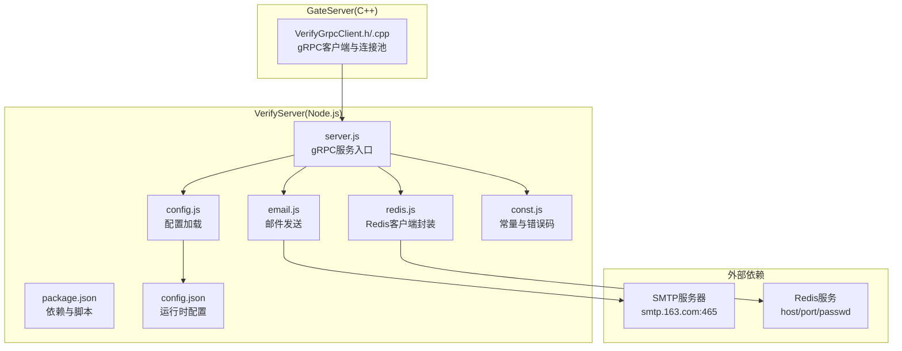
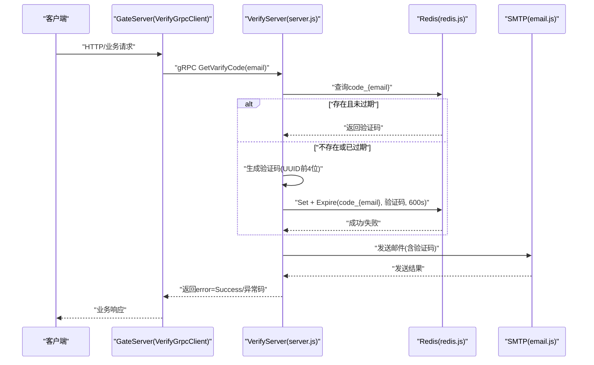
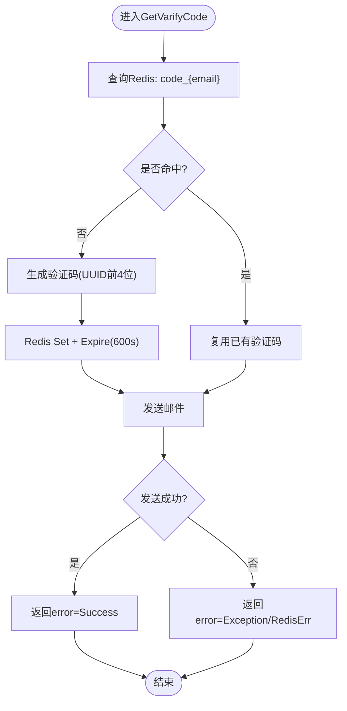
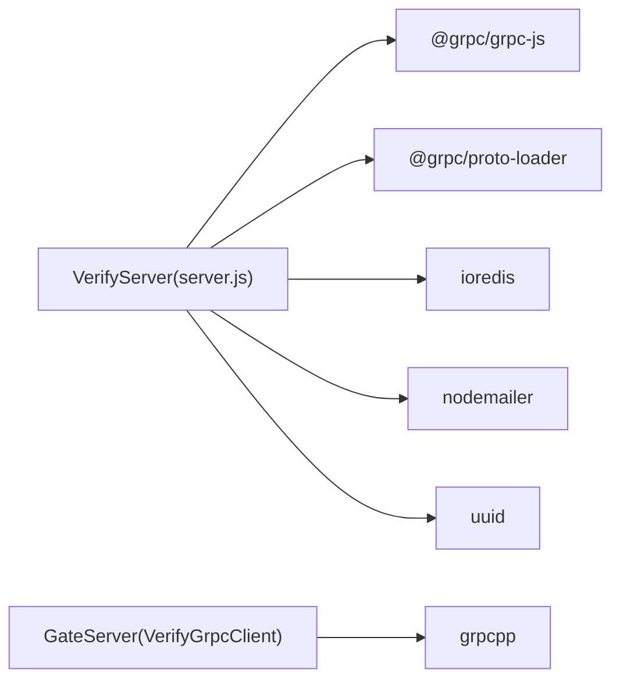

# 邮箱验证系统

<cite>
**本文引用的文件**   
- [server.js](file://server/VarifyServer/server.js)
- [email.js](file://server/VarifyServer/email.js)
- [redis.js](file://server/VarifyServer/redis.js)
- [config.js](file://server/VarifyServer/config.js)
- [const.js](file://server/VarifyServer/const.js)
- [package.json](file://server/VarifyServer/package.json)
- [config.json](file://server/VarifyServer/config.json)
- [verify.proto](file://proto/verify_service/verify.proto)
- [VerifyGrpcClient.h](file://server/GateServer/include/VerifyGrpcClient.h)
- [VerifyGrpcClient.cpp](file://server/GateServer/src/VerifyGrpcClient.cpp)
- [day08-邮箱认证服务.md](file://开发文档/day08-邮箱认证服务.md)
- [day10-多服务验证码派发功能调试.md](file://开发文档/day10-多服务验证码派发功能调试.md)
</cite>

## 目录
1. [简介](#简介)
2. [项目结构](#项目结构)
3. [核心组件](#核心组件)
4. [架构总览](#架构总览)
5. [详细组件分析](#详细组件分析)
6. [依赖关系分析](#依赖关系分析)
7. [性能与可扩展性](#性能与可扩展性)
8. [故障排查指南](#故障排查指南)
9. [结论](#结论)
10. [附录：配置项说明](#附录配置项说明)

## 简介
本技术文档围绕 LLFCChat 的邮箱验证系统，重点阐述 VerifyServer（Node.js）的实现架构与完整流程。内容涵盖：
- 邮件发送、验证码生成与缓存管理
- Redis 存储与过期策略
- gRPC 接口定义与 GateServer 调用方式
- 错误处理与重试机制
- 配置管理与性能优化建议

该服务通过 gRPC 暴露 GetVarifyCode 接口，GateServer 作为客户端发起请求，VerifyServer 负责从 Redis 获取或生成验证码、写入缓存并发送邮件，最终返回统一错误码供上层处理。

## 项目结构
VerifyServer 采用模块化设计，核心文件职责清晰：
- server.js：gRPC 服务入口，实现 GetVarifyCode 业务逻辑
- email.js：基于 nodemailer 的邮件发送封装
- redis.js：ioredis 客户端封装，提供 get/exists/set+expire 等能力
- config.js：读取 config.json 中的 SMTP、Redis、MySQL 等配置
- const.js：常量与错误码定义
- package.json：依赖声明与启动脚本
- config.json：运行时配置（SMTP、Redis、MySQL）

图表来源
- [server.js:1-76](file://server/VarifyServer/server.js#L1-L76)
- [email.js:1-37](file://server/VarifyServer/email.js#L1-L37)
- [redis.js:1-101](file://server/VarifyServer/redis.js#L1-L101)
- [config.js:1-15](file://server/VarifyServer/config.js#L1-L15)
- [const.js:1-10](file://server/VarifyServer/const.js#L1-L10)
- [package.json:1-19](file://server/VarifyServer/package.json#L1-L19)
- [config.json:1-21](file://server/VarifyServer/config.json#L1-L21)
- [VerifyGrpcClient.h:1-113](file://server/GateServer/include/VerifyGrpcClient.h#L1-L113)
- [VerifyGrpcClient.cpp:1-9](file://server/GateServer/src/VerifyGrpcClient.cpp#L1-L9)

章节来源
- [server.js:1-76](file://server/VarifyServer/server.js#L1-L76)
- [email.js:1-37](file://server/VarifyServer/email.js#L1-L37)
- [redis.js:1-101](file://server/VarifyServer/redis.js#L1-L101)
- [config.js:1-15](file://server/VarifyServer/config.js#L1-L15)
- [const.js:1-10](file://server/VarifyServer/const.js#L1-L10)
- [package.json:1-19](file://server/VarifyServer/package.json#L1-L19)
- [config.json:1-21](file://server/VarifyServer/config.json#L1-L21)
- [VerifyGrpcClient.h:1-113](file://server/GateServer/include/VerifyGrpcClient.h#L1-L113)
- [VerifyGrpcClient.cpp:1-9](file://server/GateServer/src/VerifyGrpcClient.cpp#L1-L9)

## 核心组件
- gRPC 服务与接口
  - 服务名：VarifyService
  - RPC：GetVarifyCode(GetVarifyReq) -> GetVarifyRsp
  - 请求体包含 email；响应包含 error、email、code（当前实现未填充 code 字段）
- 验证码生成与缓存
  - 首次请求时生成唯一验证码（UUID前4位），写入 Redis，设置过期时间（秒级）
  - 后续相同邮箱在有效期内复用同一验证码
- 邮件发送
  - 使用 nodemailer 通过 SMTP 发送纯文本邮件
  - 模板为固定文本，包含验证码与提示语
- Redis 交互
  - 提供 get、exists、set+expire 等方法
  - 心跳与健康检查：定时写入 heartbeat key
- 配置与常量
  - 配置来源于 config.json，包括 email、mysql、redis 等
  - 错误码集中定义于 const.js

章节来源
- [verify.proto:1-19](file://proto/verify_service/verify.proto#L1-L19)
- [server.js:15-64](file://server/VarifyServer/server.js#L15-L64)
- [redis.js:41-98](file://server/VarifyServer/redis.js#L41-L98)
- [email.js:22-35](file://server/VarifyServer/email.js#L22-L35)
- [config.js:1-15](file://server/VarifyServer/config.js#L1-L15)
- [const.js:1-10](file://server/VarifyServer/const.js#L1-L10)

## 架构总览
整体调用链：客户端 -> GateServer(gRPC客户端) -> VerifyServer(gRPC服务端) -> Redis/SMTP -> 返回结果。

图表来源
- [server.js:15-64](file://server/VarifyServer/server.js#L15-L64)
- [redis.js:41-98](file://server/VarifyServer/redis.js#L41-L98)
- [email.js:22-35](file://server/VarifyServer/email.js#L22-L35)
- [VerifyGrpcClient.h:87-104](file://server/GateServer/include/VerifyGrpcClient.h#L87-L104)
- [verify.proto:6-18](file://proto/verify_service/verify.proto#L6-L18)

## 详细组件分析

### gRPC 接口与服务端实现
- 接口定义
  - VarifyService.GetVarifyCode：接收 email，返回 error、email、code
- 服务端处理流程
  - 读取 Redis 中 code_{email}
  - 若为空则生成验证码（UUID截取前4位），写入 Redis 并设置过期时间（600秒）
  - 构造邮件内容并调用 email.SendMail
  - 根据结果返回 Success 或异常码

图表来源
- [server.js:15-64](file://server/VarifyServer/server.js#L15-L64)
- [redis.js:87-98](file://server/VarifyServer/redis.js#L87-L98)
- [const.js:3-7](file://server/VarifyServer/const.js#L3-L7)

章节来源
- [verify.proto:6-18](file://proto/verify_service/verify.proto#L6-L18)
- [server.js:15-64](file://server/VarifyServer/server.js#L15-L64)

### 邮件发送模块
- 使用 nodemailer 创建 transport，配置 SMTP 主机、端口、安全模式与授权码
- SendMail 函数以 Promise 封装异步发送，成功 resolve，失败 reject
- 邮件内容为纯文本，包含验证码与提示语

章节来源
- [email.js:1-37](file://server/VarifyServer/email.js#L1-L37)
- [config.json:1-21](file://server/VarifyServer/config.json#L1-L21)

### Redis 缓存模块
- ioredis 客户端初始化，支持连接错误与断开事件监听
- 提供 GetRedis、QueryRedis、SetRedisExpire 三个方法
- 心跳机制：定时写入 heartbeat key，便于健康检查
- 验证码键命名：code_{email}，过期时间由业务控制（默认600秒）

章节来源
- [redis.js:1-101](file://server/VarifyServer/redis.js#L1-L101)

### 配置与常量
- config.js 读取 config.json，暴露 email、mysql、redis、code_prefix 等
- const.js 定义 Errors 枚举（Success、RedisErr、Exception）与 code_prefix

章节来源
- [config.js:1-15](file://server/VarifyServer/config.js#L1-L15)
- [const.js:1-10](file://server/VarifyServer/const.js#L1-L10)
- [config.json:1-21](file://server/VarifyServer/config.json#L1-L21)

### GateServer 客户端与连接池
- VerifyGrpcClient 单例维护 RPConPool 连接池，预创建多个 gRPC Channel/Stub
- getConnection 阻塞等待可用连接，returnConnection 归还连接
- GetVarifyCode 方法组装请求、调用远端服务、处理状态码并返回统一错误码

章节来源
- [VerifyGrpcClient.h:18-113](file://server/GateServer/include/VerifyGrpcClient.h#L18-L113)
- [VerifyGrpcClient.cpp:1-9](file://server/GateServer/src/VerifyGrpcClient.cpp#L1-L9)

## 依赖关系分析
- Node.js 依赖
  - @grpc/grpc-js：gRPC 服务端
  - @grpc/proto-loader：动态解析 proto
  - ioredis：Redis 客户端
  - nodemailer：邮件发送
  - uuid：验证码生成
- C++ 依赖
  - grpcpp：gRPC 客户端库
  - 自定义 ConfigMgr、Singleton 等基础设施

图表来源
- [package.json:11-17](file://server/VarifyServer/package.json#L11-L17)
- [VerifyGrpcClient.h:1-10](file://server/GateServer/include/VerifyGrpcClient.h#L1-L10)

章节来源
- [package.json:1-19](file://server/VarifyServer/package.json#L1-L19)
- [VerifyGrpcClient.h:1-10](file://server/GateServer/include/VerifyGrpcClient.h#L1-L10)

## 性能与可扩展性
- 连接池与并发
  - GateServer 侧使用 RPConPool 管理 gRPC 连接，避免频繁握手开销
  - 可结合 AsioIOServicePool 提升 GateServer 整体并发处理能力
- Redis 操作
  - 使用 set+expire 原子化设置过期时间，减少额外命令
  - 心跳键用于监控存活，便于快速定位问题
- 邮件发送
  - 当前为同步阻塞式发送，高并发下可能成为瓶颈
  - 建议引入消息队列（如 Bull/Kue）将发送任务异步化，提高吞吐
- 验证码策略
  - 有效期 600 秒，适合注册场景；可根据业务调整
  - 限制同一邮箱单位时间内请求次数，防止滥用（可在 Redis 中计数）
- 扩展点
  - 增加验证码长度、复杂度策略
  - 支持 HTML 邮件模板与多语言
  - 接入第三方短信/邮箱网关，实现多通道冗余

[本节为通用指导，不直接分析具体文件]

## 故障排查指南
- Redis 连接异常
  - 现象：GetRedis/SetRedisExpire 返回 null/false
  - 排查：检查 host/port/passwd、网络连通性、Redis 服务状态
  - 日志：redis.js 中 error/end 事件输出
- 邮件发送失败
  - 现象：SendMail reject 或返回错误
  - 排查：SMTP 配置（host/port/secure/auth）、授权码有效性、防火墙/反垃圾策略
  - 日志：email.js 中 console.log(error)
- gRPC 调用失败
  - 现象：GateServer 返回 RPCFailed
  - 排查：VerifyServer 是否启动、端口是否正确、防火墙规则
  - 日志：VerifyGrpcClient 中 status.ok() 判断
- 验证码未生效或重复
  - 现象：多次请求返回不同验证码或无效
  - 排查：Redis 键是否存在、过期时间是否合理、是否被其他进程覆盖
  - 日志：server.js 中 query_res 与 uniqueId 打印

章节来源
- [redis.js:16-28](file://server/VarifyServer/redis.js#L16-L28)
- [email.js:22-35](file://server/VarifyServer/email.js#L22-L35)
- [server.js:56-62](file://server/VarifyServer/server.js#L56-L62)
- [VerifyGrpcClient.h:95-104](file://server/GateServer/include/VerifyGrpcClient.h#L95-L104)

## 结论
VerifyServer 以简洁清晰的模块化设计实现了邮箱验证码的核心能力：通过 Redis 保证验证码的一致性与生命周期，通过 nodemailer 完成邮件投递，并通过 gRPC 与 GateServer 解耦集成。建议在现有基础上引入异步队列、限流与更完善的错误码体系，以提升稳定性与可观测性。

[本节为总结性内容，不直接分析具体文件]

## 附录：配置项说明
- SMTP 配置（email）
  - user：发件人邮箱地址
  - pass：邮箱授权码（非登录密码）
- Redis 配置（redis）
  - host：Redis 主机
  - port：Redis 端口
  - passwd：Redis 密码
- MySQL 配置（mysql）
  - host/port/passwd：预留配置，当前未使用
- 其他
  - code_prefix：验证码键前缀，默认“code_”
  - 过期时间：验证码有效期 600 秒

章节来源
- [config.json:1-21](file://server/VarifyServer/config.json#L1-L21)
- [config.js:1-15](file://server/VarifyServer/config.js#L1-L15)
- [const.js:1-10](file://server/VarifyServer/const.js#L1-L10)