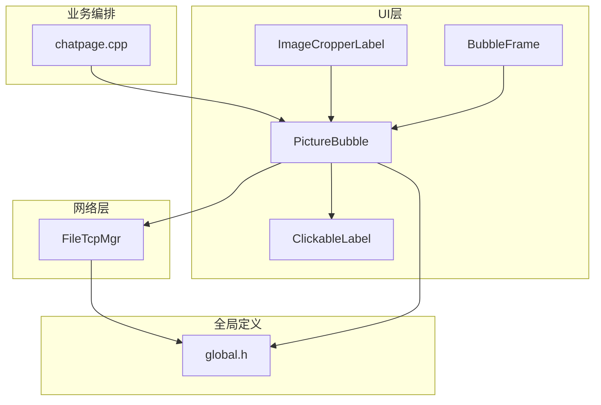
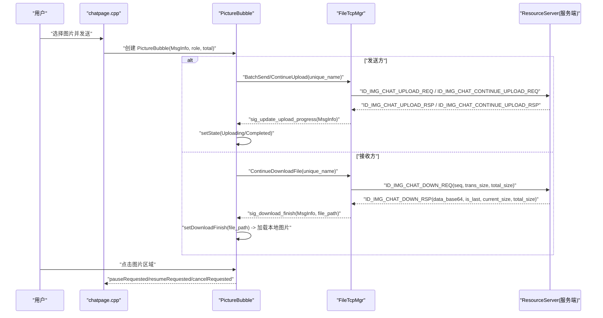
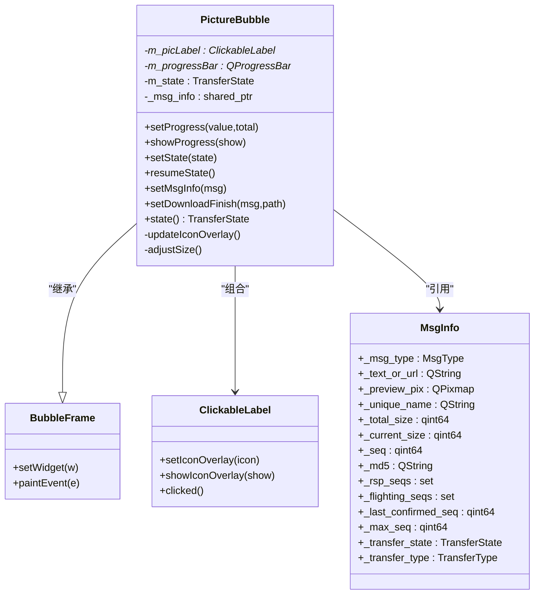
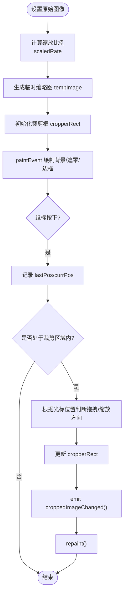
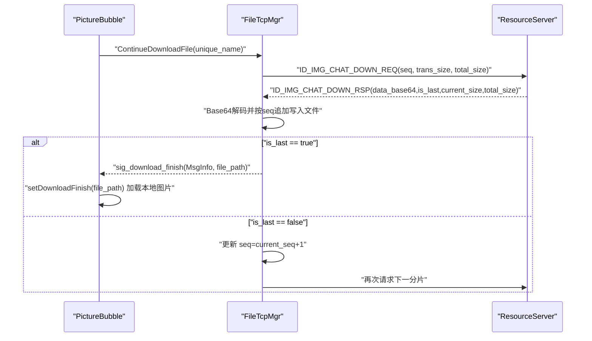
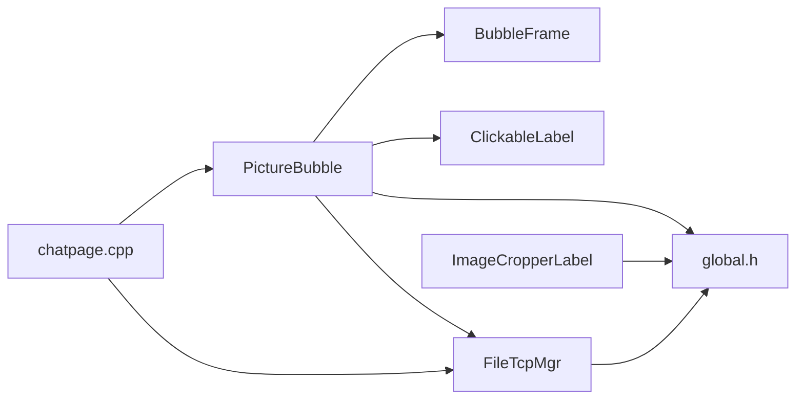

# 图片消息处理

<cite>
**本文引用的文件**   
- [PictureBubble.h](file://client/llfcchat/include/PictureBubble.h)
- [PictureBubble.cpp](file://client/llfcchat/src/PictureBubble.cpp)
- [ImageCropperLabel.h](file://client/llfcchat/include/ImageCropperLabel.h)
- [ImageCropperLabel.cpp](file://client/llfcchat/src/ImageCropperLabel.cpp)
- [FileTcpMgr.h](file://client/llfcchat/include/FileTcpMgr.h)
- [FileTcpMgr.cpp](file://client/llfcchat/src/FileTcpMgr.cpp)
- [global.h](file://client/llfcchat/include/global.h)
- [BubbleFrame.h](file://client/llfcchat/include/BubbleFrame.h)
- [BubbleFrame.cpp](file://client/llfcchat/src/BubbleFrame.cpp)
- [ClickableLabel.h](file://client/llfcchat/include/ClickableLabel.h)
- [ChatView.h](file://client/llfcchat/include/ChatView.h)
- [chatpage.cpp](file://client/llfcchat/src/chatpage.cpp)
</cite>

## 目录
1. [简介](#简介)
2. [项目结构](#项目结构)
3. [核心组件](#核心组件)
4. [架构总览](#架构总览)
5. [详细组件分析](#详细组件分析)
6. [依赖关系分析](#依赖关系分析)
7. [性能与内存管理](#性能与内存管理)
8. [故障排查指南](#故障排查指南)
9. [结论](#结论)
10. [附录：接口与配置说明](#附录接口与配置说明)

## 简介
本技术文档聚焦于 LLFCChat 客户端的图片消息处理功能，围绕 PictureBubble 组件、图片裁剪 ImageCropperLabel、以及基于 TCP 的文件传输管理器 FileTcpMgr 展开。文档将系统阐述图片消息的上传、下载、预览、编辑（裁剪）全流程，解释调用关系、接口设计、状态机、进度显示机制、断点续传策略以及与资源服务器 ResourceServer 的交互方式。内容兼顾初学者可读性与资深开发者的技术深度。

## 项目结构
- 前端 UI 层：BubbleFrame、ClickableLabel、PictureBubble 负责气泡展示、点击交互与进度反馈。
- 图片编辑层：ImageCropperLabel 提供多种裁剪形状与交互能力。
- 网络传输层：FileTcpMgr 封装 TCP 连接、粘包处理、分片上传/下载、进度回调与断点续传。
- 全局定义：global.h 统一消息类型、传输状态、请求 ID、数据结构等。
- 业务编排：chatpage.cpp 在聊天页面中创建 PictureBubble 并绑定信号槽，驱动上传/下载流程。

图表来源 
- [BubbleFrame.h:1-24](file://client/llfcchat/include/BubbleFrame.h#L1-L24)
- [BubbleFrame.cpp:1-73](file://client/llfcchat/src/BubbleFrame.cpp#L1-L73)
- [ClickableLabel.h:1-29](file://client/llfcchat/include/ClickableLabel.h#L1-L29)
- [PictureBubble.h:1-53](file://client/llfcchat/include/PictureBubble.h#L1-L53)
- [PictureBubble.cpp:1-243](file://client/llfcchat/src/PictureBubble.cpp#L1-L243)
- [ImageCropperLabel.h:1-167](file://client/llfcchat/include/ImageCropperLabel.h#L1-L167)
- [ImageCropperLabel.cpp:1-715](file://client/llfcchat/src/ImageCropperLabel.cpp#L1-L715)
- [FileTcpMgr.h:1-85](file://client/llfcchat/include/FileTcpMgr.h#L1-L85)
- [FileTcpMgr.cpp:1-800](file://client/llfcchat/src/FileTcpMgr.cpp#L1-L800)
- [global.h:1-296](file://client/llfcchat/include/global.h#L1-L296)
- [chatpage.cpp:70-200](file://client/llfcchat/src/chatpage.cpp#L70-L200)

章节来源
- [BubbleFrame.h:1-24](file://client/llfcchat/include/BubbleFrame.h#L1-L24)
- [BubbleFrame.cpp:1-73](file://client/llfcchat/src/BubbleFrame.cpp#L1-L73)
- [ClickableLabel.h:1-29](file://client/llfcchat/include/ClickableLabel.h#L1-L29)
- [PictureBubble.h:1-53](file://client/llfcchat/include/PictureBubble.h#L1-L53)
- [PictureBubble.cpp:1-243](file://client/llfcchat/src/PictureBubble.cpp#L1-L243)
- [ImageCropperLabel.h:1-167](file://client/llfcchat/include/ImageCropperLabel.h#L1-L167)
- [ImageCropperLabel.cpp:1-715](file://client/llfcchat/src/ImageCropperLabel.cpp#L1-L715)
- [FileTcpMgr.h:1-85](file://client/llfcchat/include/FileTcpMgr.h#L1-L85)
- [FileTcpMgr.cpp:1-800](file://client/llfcchat/src/FileTcpMgr.cpp#L1-L800)
- [global.h:1-296](file://client/llfcchat/include/global.h#L1-L296)
- [chatpage.cpp:70-200](file://client/llfcchat/src/chatpage.cpp#L70-L200)

## 核心组件
- PictureBubble：气泡容器，承载缩略图、进度条、状态图标覆盖层；响应点击进行暂停/继续/重试等操作；维护 MsgInfo 以同步传输状态与进度。
- ImageCropperLabel：可拖拽、缩放、切换形状的图像裁剪控件，支持矩形、正方形、椭圆、圆形及固定尺寸裁剪，输出矩形或椭圆遮罩结果。
- FileTcpMgr：TCP 单例管理器，负责连接、粘包解析、分片上传/下载、拥塞窗口控制、进度回调、断点续传、完成通知。
- global.h：集中定义 ReqId、MsgType、TransferState、TransferType、MsgInfo、DownloadInfo 等关键枚举与结构体。
- BubbleFrame/ClickableLabel：气泡基类与可点击标签，为 PictureBubble 提供样式与交互基础。

章节来源
- [PictureBubble.h:1-53](file://client/llfcchat/include/PictureBubble.h#L1-L53)
- [PictureBubble.cpp:1-243](file://client/llfcchat/src/PictureBubble.cpp#L1-L243)
- [ImageCropperLabel.h:1-167](file://client/llfcchat/include/ImageCropperLabel.h#L1-L167)
- [ImageCropperLabel.cpp:1-715](file://client/llfcchat/src/ImageCropperLabel.cpp#L1-L715)
- [FileTcpMgr.h:1-85](file://client/llfcchat/include/FileTcpMgr.h#L1-L85)
- [FileTcpMgr.cpp:1-800](file://client/llfcchat/src/FileTcpMgr.cpp#L1-L800)
- [global.h:1-296](file://client/llfcchat/include/global.h#L1-L296)
- [BubbleFrame.h:1-24](file://client/llfcchat/include/BubbleFrame.h#L1-L24)
- [BubbleFrame.cpp:1-73](file://client/llfcchat/src/BubbleFrame.cpp#L1-L73)
- [ClickableLabel.h:1-29](file://client/llfcchat/include/ClickableLabel.h#L1-L29)

## 架构总览
图片消息从选择到最终展示的完整链路如下：
- 用户在聊天界面选择图片后，生成唯一文件名与预览缩略图，构造 MsgInfo。
- chatpage.cpp 根据角色创建 PictureBubble，并将 MsgInfo 注入。
- 若为发送方，触发上传流程：FileTcpMgr 通过 ID_IMG_CHAT_UPLOAD_REQ/ID_IMG_CHAT_CONTINUE_UPLOAD_REQ 分片上传，服务端返回确认序列号，客户端更新进度与状态。
- 若为接收方，触发下载流程：FileTcpMgr 通过 ID_IMG_CHAT_DOWN_REQ 分片下载，Base64 解码后按 seq 追加写入本地文件，完成后通过 sig_download_finish 通知 PictureBubble 加载本地图片并替换缩略图。
- 用户点击 PictureBubble 中的图片区域，根据当前状态执行暂停/继续/重试操作，并通过信号回传到上层控制器。

图表来源 
- [chatpage.cpp:70-200](file://client/llfcchat/src/chatpage.cpp#L70-L200)
- [PictureBubble.cpp:1-243](file://client/llfcchat/src/PictureBubble.cpp#L1-L243)
- [FileTcpMgr.cpp:1-800](file://client/llfcchat/src/FileTcpMgr.cpp#L1-L800)
- [global.h:1-296](file://client/llfcchat/include/global.h#L1-L296)

## 详细组件分析

### PictureBubble 组件
- 职责
  - 渲染图片缩略图与进度条，维护传输状态与图标覆盖层。
  - 响应点击事件，触发暂停/继续/重试等动作，向上层发出信号。
  - 接收下载完成信号，加载本地图片并替换缩略图。
- 关键实现要点
  - 缩略图缩放：使用 Qt::KeepAspectRatio 与平滑变换，限制最大宽高常量。
  - 进度计算：根据当前字节数与总大小计算百分比，达到 100% 时进入 Completed 状态。
  - 状态机：None/Downloading/Uploading/Paused/Completed/Failed，不同状态控制进度条显隐与覆盖图标。
  - 消息关联：持有 std::shared_ptr<MsgInfo>，同步 _current_size/_total_size/_transfer_state/_transfer_type。
- 接口与参数
  - setProgress(value, total_value)：设置进度百分比。
  - showProgress(show)：显示/隐藏进度条。
  - setState(state)：设置传输状态。
  - resumeState()：恢复暂停的传输状态。
  - setMsgInfo(msg)：注入消息信息并初始化进度与状态。
  - setDownloadFinish(msg, file_path)：下载完成后加载本地图片并刷新 UI。
  - 信号：pauseRequested/resumeRequested/cancelRequested。

图表来源 
- [BubbleFrame.h:1-24](file://client/llfcchat/include/BubbleFrame.h#L1-L24)
- [BubbleFrame.cpp:1-73](file://client/llfcchat/src/BubbleFrame.cpp#L1-L73)
- [ClickableLabel.h:1-29](file://client/llfcchat/include/ClickableLabel.h#L1-L29)
- [PictureBubble.h:1-53](file://client/llfcchat/include/PictureBubble.h#L1-L53)
- [PictureBubble.cpp:1-243](file://client/llfcchat/src/PictureBubble.cpp#L1-L243)
- [global.h:167-199](file://client/llfcchat/include/global.h#L167-L199)

章节来源
- [PictureBubble.h:1-53](file://client/llfcchat/include/PictureBubble.h#L1-L53)
- [PictureBubble.cpp:1-243](file://client/llfcchat/src/PictureBubble.cpp#L1-L243)
- [global.h:167-199](file://client/llfcchat/include/global.h#L167-L199)

### ImageCropperLabel 组件
- 职责
  - 提供丰富的裁剪形状与交互能力，支持拖动、缩放、最小尺寸约束、透明度遮罩效果。
  - 输出裁剪后的 QPixmap，支持矩形或椭圆遮罩。
- 关键实现要点
  - 图像适配：根据 QLabel 尺寸计算缩放比例 scaledRate，保持纵横比。
  - 裁剪框：cropperRect 表示裁剪区域，支持固定尺寸与自适应尺寸。
  - 鼠标事件：按下、移动、释放事件处理拖拽与缩放逻辑，发射 croppedImageChanged 信号。
  - 绘制：paintEvent 中绘制背景、遮罩、边框与拖拽方块。
- 接口与参数
  - setOriginalImage(pixmap)：设置原始图像。
  - setOutputShape(shape)：设置输出形状（矩形/椭圆）。
  - getCroppedImage()/getCroppedImage(OutputShape)：获取裁剪结果。
  - setRectCropper/setSquareCropper/setEllipseCropper/setCircleCropper：设置裁剪形状。
  - setCropperFixedSize/fixedWidth/fixedHeight：设置固定尺寸。
  - setShowRectBorder/showDragSquare：控制边框与拖拽方块可见性。
  - enableOpacity/setOpacity：透明度效果开关与强度。

图表来源 
- [ImageCropperLabel.cpp:21-55](file://client/llfcchat/src/ImageCropperLabel.cpp#L21-L55)
- [ImageCropperLabel.cpp:184-222](file://client/llfcchat/src/ImageCropperLabel.cpp#L184-L222)
- [ImageCropperLabel.cpp:426-713](file://client/llfcchat/src/ImageCropperLabel.cpp#L426-L713)

章节来源
- [ImageCropperLabel.h:1-167](file://client/llfcchat/include/ImageCropperLabel.h#L1-L167)
- [ImageCropperLabel.cpp:1-715](file://client/llfcchat/src/ImageCropperLabel.cpp#L1-L715)

### FileTcpMgr 组件
- 职责
  - 管理 TCP 连接、粘包解析、分片上传/下载、拥塞窗口控制、进度回调、断点续传、完成通知。
- 关键实现要点
  - 粘包处理：读取头部（ReqId+长度），循环解析消息体，避免半包/粘包问题。
  - 上传流程：ID_IMG_CHAT_UPLOAD_REQ/ID_IMG_CHAT_CONTINUE_UPLOAD_REQ，服务端返回确认序列号，客户端维护 _flighting_seqs/_rsp_seqs/_last_confirmed_seq。
  - 下载流程：ID_IMG_CHAT_DOWN_REQ，Base64 解码后按 seq 追加写入，is_last 标志完成，触发 sig_download_finish。
  - 进度与状态：通过 sig_update_upload_progress/sig_update_download_progress 通知 UI。
  - 拥塞控制：_cwnd_size 控制并发发送数量，MAX_CWND_SIZE 限制上限。
- 接口与参数
  - SendData(reqId, data)：发送数据。
  - ContinueUploadFile(unique_name)/ContinueDownloadFile(unique_name)：断点续传入口。
  - BatchSend(msg_info, sender, receiver)：批量发送待上传文件。
  - CopyFile(src, dst, dst_dir)：复制文件到目标目录。
  - 信号：sig_update_upload_progress/sig_download_finish/sig_continue_* 等。

图表来源 
- [FileTcpMgr.cpp:695-800](file://client/llfcchat/src/FileTcpMgr.cpp#L695-L800)
- [PictureBubble.cpp:175-187](file://client/llfcchat/src/PictureBubble.cpp#L175-L187)

章节来源
- [FileTcpMgr.h:1-85](file://client/llfcchat/include/FileTcpMgr.h#L1-L85)
- [FileTcpMgr.cpp:1-800](file://client/llfcchat/src/FileTcpMgr.cpp#L1-L800)
- [global.h:43-88](file://client/llfcchat/include/global.h#L43-L88)

### 聊天页面集成（chatpage.cpp）
- 在聊天页面中根据消息类型创建 PictureBubble，并绑定 pauseRequested/resumeRequested 信号，驱动上传/下载控制。
- 将 MsgInfo 的 preview_pix 与 total_size 传入 PictureBubble 构造函数，用于初始缩略图与进度范围。

章节来源
- [chatpage.cpp:70-200](file://client/llfcchat/src/chatpage.cpp#L70-L200)

## 依赖关系分析
- PictureBubble 依赖 BubbleFrame（父类）、ClickableLabel（子组件）、QProgressBar（进度条）、global.h（MsgInfo/TransferState）。
- ImageCropperLabel 依赖 Qt 绘图与事件系统，不直接依赖网络模块。
- FileTcpMgr 依赖 QTcpSocket、QJsonDocument、UserMgr（文件元数据管理）、global.h（ReqId/MsgInfo）。
- chatpage.cpp 作为业务编排层，协调 PictureBubble 与 FileTcpMgr 的交互。

图表来源 
- [PictureBubble.h:1-53](file://client/llfcchat/include/PictureBubble.h#L1-L53)
- [BubbleFrame.h:1-24](file://client/llfcchat/include/BubbleFrame.h#L1-L24)
- [ClickableLabel.h:1-29](file://client/llfcchat/include/ClickableLabel.h#L1-L29)
- [FileTcpMgr.h:1-85](file://client/llfcchat/include/FileTcpMgr.h#L1-L85)
- [global.h:1-296](file://client/llfcchat/include/global.h#L1-L296)
- [chatpage.cpp:70-200](file://client/llfcchat/src/chatpage.cpp#L70-L200)

章节来源
- [PictureBubble.h:1-53](file://client/llfcchat/include/PictureBubble.h#L1-L53)
- [BubbleFrame.h:1-24](file://client/llfcchat/include/BubbleFrame.h#L1-L24)
- [ClickableLabel.h:1-29](file://client/llfcchat/include/ClickableLabel.h#L1-L29)
- [FileTcpMgr.h:1-85](file://client/llfcchat/include/FileTcpMgr.h#L1-L85)
- [global.h:1-296](file://client/llfcchat/include/global.h#L1-L296)
- [chatpage.cpp:70-200](file://client/llfcchat/src/chatpage.cpp#L70-L200)

## 性能与内存管理
- 图片缩放与缓存
  - 缩略图采用 KeepAspectRatio 与 SmoothTransformation，限制最大宽高常量，减少内存占用与渲染开销。
  - 下载完成后加载本地图片替换缩略图，避免重复网络请求。
- 分片传输与拥塞控制
  - MAX_FILE_LEN 分片大小，MAX_CWND_SIZE 限制并发发送数量，防止拥塞。
  - 使用队列与 bytesWritten 回调实现可靠发送，避免阻塞 UI。
- 断点续传
  - 上传/下载均维护 seq 与已确认序列集合，支持中断后从上次位置继续。
  - 下载按 seq 追加写入，确保大文件稳定落盘。
- 进度显示
  - 进度条百分比由 current_size/total_size 计算，Completed 状态延迟隐藏，提升用户体验。
- 内存管理建议
  - 及时释放不再使用的 QPixmap，避免内存泄漏。
  - 对超大图片建议在上传前进行压缩（如降低分辨率/质量），以减少带宽与存储压力。

[本节为通用性能指导，不直接分析具体文件]

## 故障排查指南
- 常见问题
  - 进度不更新：检查 FileTcpMgr 是否正确触发 sig_update_upload_progress/sig_download_progress，PictureBubble 是否正确调用 setProgress。
  - 下载失败：确认 is_last 标志与服务端返回的 current_size/total_size 一致性，检查 Base64 解码与文件写入路径权限。
  - 上传卡住：检查拥塞窗口 _cwnd_size 与队列状态，确认服务端 ACK 序列号正确返回。
  - 图片未显示：确认 setDownloadFinish 被调用且 file_path 有效，检查缩略图缩放与固定尺寸设置。
- 调试建议
  - 打印 FileTcpMgr 的 handleMsg 日志，确认消息头解析与分片顺序。
  - 在 PictureBubble 的状态切换处添加日志，观察状态机流转。
  - 验证 global.h 中的 ReqId 与 JSON 字段是否与协议一致。

章节来源
- [FileTcpMgr.cpp:175-184](file://client/llfcchat/src/FileTcpMgr.cpp#L175-L184)
- [PictureBubble.cpp:121-149](file://client/llfcchat/src/PictureBubble.cpp#L121-L149)
- [global.h:43-88](file://client/llfcchat/include/global.h#L43-L88)

## 结论
LLFCChat 的图片消息处理通过 PictureBubble、ImageCropperLabel 与 FileTcpMgr 的协同工作，实现了完整的上传、下载、预览、编辑与进度反馈闭环。其设计清晰、职责分离良好，具备断点续传、拥塞控制与良好的用户体验。未来可进一步优化图片压缩算法、引入更智能的缓存策略与错误恢复机制，以提升整体性能与稳定性。

[本节为总结性内容，不直接分析具体文件]

## 附录：接口与配置说明
- PictureBubble 接口
  - setProgress(value, total_value)：设置进度百分比。
  - showProgress(show)：显示/隐藏进度条。
  - setState(state)：设置传输状态。
  - resumeState()：恢复暂停状态。
  - setMsgInfo(msg)：注入消息信息。
  - setDownloadFinish(msg, file_path)：下载完成后加载本地图片。
  - 信号：pauseRequested/resumeRequested/cancelRequested。
- ImageCropperLabel 接口
  - setOriginalImage(pixmap)：设置原始图像。
  - setOutputShape(shape)：设置输出形状。
  - getCroppedImage()/getCroppedImage(OutputShape)：获取裁剪结果。
  - setRectCropper/setSquareCropper/setEllipseCropper/setCircleCropper：设置裁剪形状。
  - setCropperFixedSize/fixedWidth/fixedHeight：设置固定尺寸。
  - setShowRectBorder/showDragSquare：控制边框与拖拽方块可见性。
  - enableOpacity/setOpacity：透明度效果。
- FileTcpMgr 接口
  - SendData(reqId, data)：发送数据。
  - ContinueUploadFile(unique_name)/ContinueDownloadFile(unique_name)：断点续传。
  - BatchSend(msg_info, sender, receiver)：批量发送。
  - CopyFile(src, dst, dst_dir)：复制文件。
  - 信号：sig_update_upload_progress/sig_download_finish/sig_continue_*。
- 全局配置（global.h）
  - ReqId：请求 ID 枚举，涵盖文本、图片、文件传输相关。
  - MsgType/TransferState/TransferType：消息类型、传输状态与类型。
  - MsgInfo/DownloadInfo：消息与下载信息结构体。
  - 常量：FILE_UPLOAD_HEAD_LEN/MAX_FILE_LEN/MAX_CWND_SIZE。

章节来源
- [PictureBubble.h:1-53](file://client/llfcchat/include/PictureBubble.h#L1-L53)
- [PictureBubble.cpp:1-243](file://client/llfcchat/src/PictureBubble.cpp#L1-L243)
- [ImageCropperLabel.h:1-167](file://client/llfcchat/include/ImageCropperLabel.h#L1-L167)
- [ImageCropperLabel.cpp:1-715](file://client/llfcchat/src/ImageCropperLabel.cpp#L1-L715)
- [FileTcpMgr.h:1-85](file://client/llfcchat/include/FileTcpMgr.h#L1-L85)
- [FileTcpMgr.cpp:1-800](file://client/llfcchat/src/FileTcpMgr.cpp#L1-L800)
- [global.h:1-296](file://client/llfcchat/include/global.h#L1-L296)