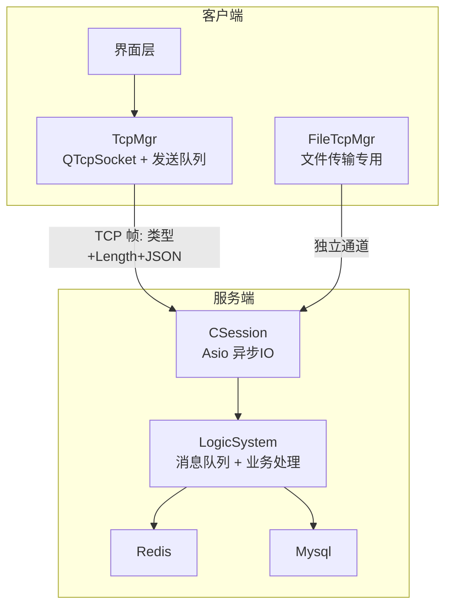
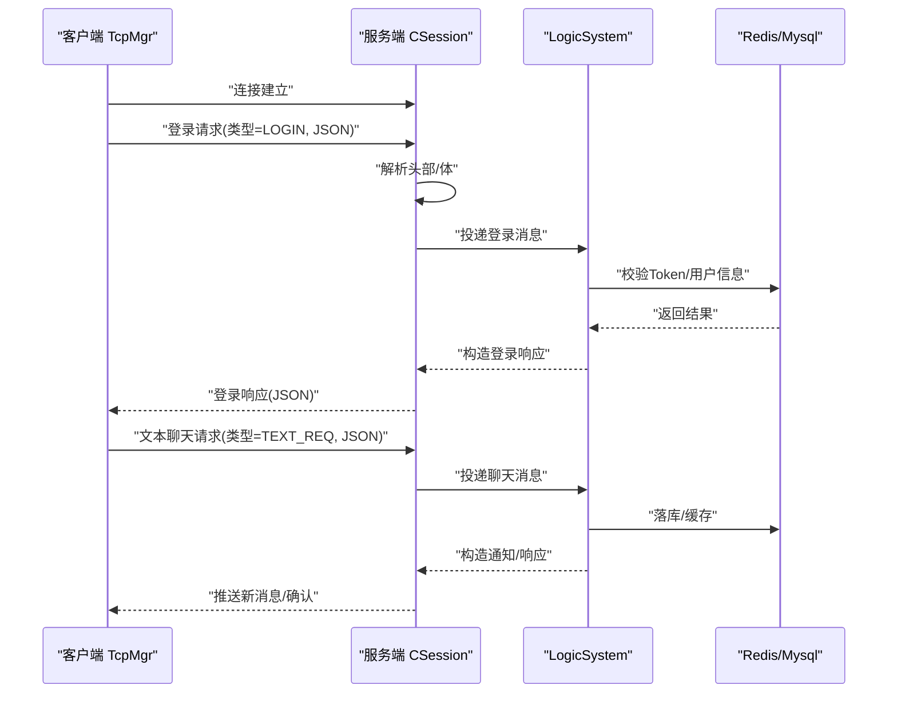
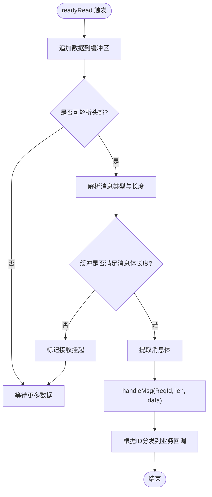
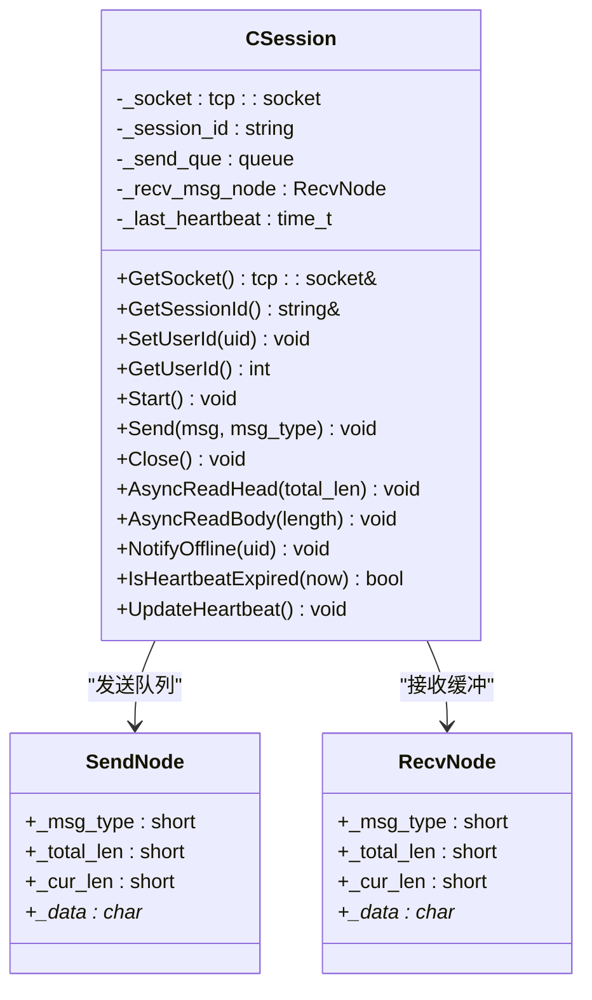
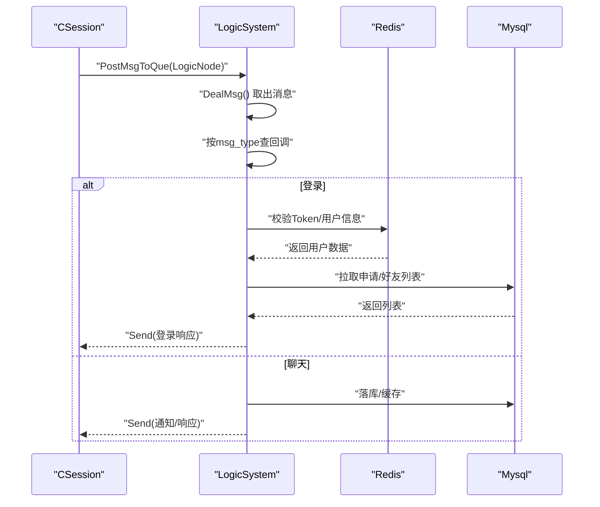
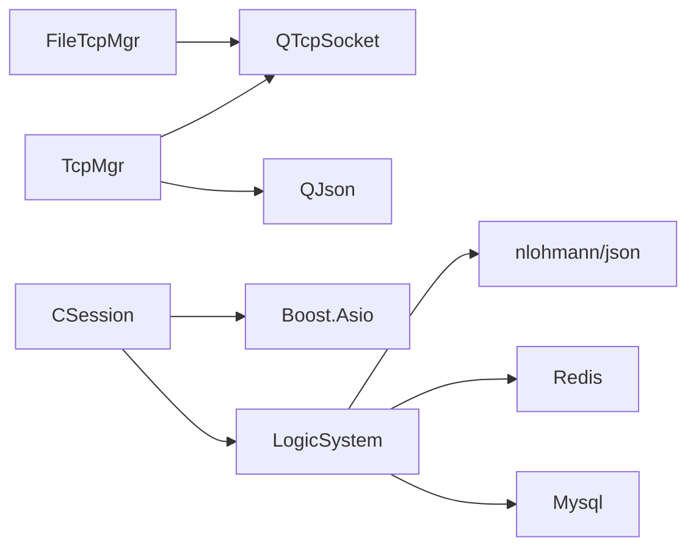

# 实时消息同步

<cite>
**本文引用的文件**   
- [tcpmgr.h](file://client/llfcchat/include/tcpmgr.h)
- [tcpmgr.cpp](file://client/llfcchat/src/tcpmgr.cpp)
- [filetcpmgr.cpp](file://client/llfcchat/src/filetcpmgr.cpp)
- [global.h](file://client/llfcchat/include/global.h)
- [userdata.h](file://client/llfcchat/include/userdata.h)
- [CSession.h](file://server/ChatServer/include/CSession.h)
- [CSession.cpp](file://server/ChatServer/src/CSession.cpp)
- [LogicSystem.h](file://server/ChatServer/include/LogicSystem.h)
- [LogicSystem.cpp](file://server/ChatServer/src/LogicSystem.cpp)
- [const.h](file://server/ChatServer/include/const.h)
- [MsgNode.h](file://server/ChatServer/include/MsgNode.h)
- [chat.proto](file://proto/chat_service/chat.proto)
</cite>

## 目录
1. [简介](#简介)
2. [项目结构](#项目结构)
3. [核心组件](#核心组件)
4. [架构总览](#架构总览)
5. [详细组件分析](#详细组件分析)
6. [依赖关系分析](#依赖关系分析)
7. [性能考量](#性能考量)
8. [故障排查指南](#故障排查指南)
9. [结论](#结论)
10. [附录](#附录)

## 简介
本技术文档聚焦于 LLFCChat 的“实时消息同步”能力，围绕 TCP 连接管理、消息队列处理与并发控制机制展开。内容涵盖客户端 TcpMgr 的消息收发流程、服务端 CSession 的异步 IO 模型、LogicSystem 的消息分发与持久化交互、以及与 ChatServer 的通信协议和确认机制。同时给出网络异常、重连逻辑、消息丢失与乱序处理的实践建议，并解释异步 IO、消息持久化、冲突解决与一致性保证的实现要点。

## 项目结构
- 客户端（Qt）：通过 QTcpSocket 实现长连接，使用 QQueue 做发送队列，readyRead 事件驱动粘包/半包解析，信号槽机制将解析后的消息分发给业务层。
- 服务端（C++/Boost.Asio）：基于 Boost.Asio 的异步读写，CSession 负责会话级 IO，LogicSystem 负责消息入队与业务处理，Redis/Mysql 用于状态与数据持久化。
- 协议定义：聊天相关 RPC 接口在 chat.proto 中定义；TCP 帧头采用固定长度（类型+Length），JSON 作为消息体。

**图表来源** 
- [tcpmgr.h:22-87](file://client/llfcchat/include/tcpmgr.h#L22-L87)
- [tcpmgr.cpp:1-137](file://client/llfcchat/src/tcpmgr.cpp#L1-L137)
- [CSession.h:28-76](file://server/ChatServer/include/CSession.h#L28-L76)
- [CSession.cpp:1-120](file://server/ChatServer/src/CSession.cpp#L1-L120)
- [LogicSystem.h:17-58](file://server/ChatServer/include/LogicSystem.h#L17-L58)

**章节来源**
- [tcpmgr.h:22-87](file://client/llfcchat/include/tcpmgr.h#L22-L87)
- [tcpmgr.cpp:1-137](file://client/llfcchat/src/tcpmgr.cpp#L1-L137)
- [CSession.h:28-76](file://server/ChatServer/include/CSession.h#L28-L76)
- [CSession.cpp:1-120](file://server/ChatServer/src/CSession.cpp#L1-L120)
- [LogicSystem.h:17-58](file://server/ChatServer/include/LogicSystem.h#L17-L58)

## 核心组件
- 客户端 TcpMgr：封装 QTcpSocket 生命周期、粘包/半包解析、发送队列与 bytesWritten 驱动的流式发送、错误与断开处理、消息注册与分发。
- 客户端 FileTcpMgr：文件传输专用通道，复用类似 TCP 帧解析与发送队列机制，支持断点续传与进度回调。
- 服务端 CSession：封装 Asio 异步读写、消息头/体读取、心跳更新、发送队列与写回调、异常会话清理。
- 服务端 LogicSystem：单例工作线程消费消息队列，按 msg_type 路由到具体处理器，完成登录、好友、聊天、图片等逻辑，并与 Redis/Mysql 交互。
- 协议与常量：全局 ReqId/MSG_TYPES 枚举、错误码、头部长度、最大队列长度等。

**章节来源**
- [tcpmgr.h:22-87](file://client/llfcchat/include/tcpmgr.h#L22-L87)
- [tcpmgr.cpp:1-137](file://client/llfcchat/src/tcpmgr.cpp#L1-L137)
- [filetcpmgr.cpp:1-143](file://client/llfcchat/src/filetcpmgr.cpp#L1-L143)
- [CSession.h:28-76](file://server/ChatServer/include/CSession.h#L28-L76)
- [CSession.cpp:1-120](file://server/ChatServer/src/CSession.cpp#L1-L120)
- [LogicSystem.h:17-58](file://server/ChatServer/include/LogicSystem.h#L17-L58)
- [const.h:38-79](file://server/ChatServer/include/const.h#L38-L79)
- [global.h:43-88](file://client/llfcchat/include/global.h#L43-L88)

## 架构总览
整体采用“客户端长连接 + 服务端异步 IO + 逻辑队列解耦”的架构。客户端通过 TcpMgr 维护与 ChatServer 的 TCP 连接，以 JSON 为消息体、固定长度的帧头承载消息类型与长度。服务端 CSession 负责非阻塞 I/O，将完整消息投递至 LogicSystem 的工作队列，由单线程顺序处理，避免竞态。Redis 用于会话、Token、分布式锁与在线状态；Mysql 用于持久化聊天记录与好友关系。

**图表来源** 
- [tcpmgr.cpp:18-55](file://client/llfcchat/src/tcpmgr.cpp#L18-L55)
- [CSession.cpp:130-191](file://server/ChatServer/src/CSession.cpp#L130-L191)
- [LogicSystem.cpp:116-252](file://server/ChatServer/src/LogicSystem.cpp#L116-L252)
- [chat.proto:6-12](file://proto/chat_service/chat.proto#L6-L12)

## 详细组件分析

### 客户端 TcpMgr：连接与消息收发
- 连接管理：构造函数内绑定 connected/readyRead/error/disconnected 信号，统一处理连接成功、数据可读、错误与断开。
- 粘包/半包解析：readyRead 中将所有数据追加到缓冲区，循环解析头部（消息类型+长度），再读取消息体，确保边界正确。
- 发送队列：bytesWritten 回调驱动发送队列出队，未发送完则继续写入，发送完成后清空状态并处理下一个块。
- 消息分发：内部 _handlers 映射 ReqId 到处理函数，handleMsg 根据 ID 调用对应回调，解析 JSON 后发出信号给 UI。
- 错误处理：区分连接拒绝、远程关闭、主机未找到、超时、网络错误等，向上抛出连接失败信号。

**图表来源** 
- [tcpmgr.cpp:18-55](file://client/llfcchat/src/tcpmgr.cpp#L18-L55)

**章节来源**
- [tcpmgr.h:22-87](file://client/llfcchat/include/tcpmgr.h#L22-L87)
- [tcpmgr.cpp:18-137](file://client/llfcchat/src/tcpmgr.cpp#L18-L137)

### 客户端 FileTcpMgr：文件传输通道
- 与 TcpMgr 类似的粘包/半包解析与发送队列机制，但使用独立的 FILE_UPLOAD_HEAD_LEN 与字节序设置。
- 支持断点续传与进度回调，结合 MsgInfo 中的 seq、rsp_seqs、flighting_seqs 等字段进行可靠传输。
- 通过 sig_continue_upload_file/sig_continue_download_file 等信号与上层协作。

**章节来源**
- [filetcpmgr.cpp:1-143](file://client/llfcchat/src/filetcpmgr.cpp#L1-L143)
- [global.h:167-197](file://client/llfcchat/include/global.h#L167-L197)

### 服务端 CSession：异步 IO 与发送队列
- 异步读：AsyncReadHead 读取固定长度头部，校验 msg_type/msg_len，分配 RecvNode 并进入 AsyncReadBody 读取消息体。
- 异步写：Send 将消息节点推入 _send_que，若队列为空则立即发起 async_write，HandleWrite 回调弹出已发送项并继续下一项。
- 心跳：UpdateHeartbeat 记录最近一次接收时间，IsHeartbeatExpired 判断是否超时。
- 异常处理：read/write 错误时 Close 并 DealExceptionSession，清理 Redis 中的 session/ip/token 等键。

**图表来源** 
- [CSession.h:28-76](file://server/ChatServer/include/CSession.h#L28-L76)
- [MsgNode.h:1-48](file://server/ChatServer/include/MsgNode.h#L1-L48)
- [CSession.cpp:43-75](file://server/ChatServer/src/CSession.cpp#L43-L75)

**章节来源**
- [CSession.h:28-76](file://server/ChatServer/include/CSession.h#L28-L76)
- [CSession.cpp:130-217](file://server/ChatServer/src/CSession.cpp#L130-L217)
- [MsgNode.h:1-48](file://server/ChatServer/include/MsgNode.h#L1-L48)

### 服务端 LogicSystem：消息队列与业务处理
- 工作线程：DealMsg 从 _msg_que 取出 LogicNode，按 _recvnode->_msg_type 查找回调并执行。
- 回调注册：RegisterCallBacks 将 MSG_TYPES 映射到具体处理方法（登录、搜索、好友申请、认证、聊天、心跳、加载线程/消息、图片消息）。
- 登录流程：校验 Token、获取用户基础信息、拉取申请列表与好友列表，设置 IP/Session 绑定，必要时踢掉旧连接。
- 聊天流程：接收文本/图片消息，落库/缓存，构造响应或通知，跨服通过 gRPC 转发。

**图表来源** 
- [LogicSystem.cpp:27-81](file://server/ChatServer/src/LogicSystem.cpp#L27-L81)
- [LogicSystem.cpp:116-252](file://server/ChatServer/src/LogicSystem.cpp#L116-L252)

**章节来源**
- [LogicSystem.h:17-58](file://server/ChatServer/include/LogicSystem.h#L17-L58)
- [LogicSystem.cpp:27-114](file://server/ChatServer/src/LogicSystem.cpp#L27-L114)
- [LogicSystem.cpp:116-252](file://server/ChatServer/src/LogicSystem.cpp#L116-L252)

### 协议与消息确认机制
- 帧格式：头部固定长度（类型+Length），消息体为 JSON。客户端与服务端均按此格式解析与组装。
- 消息类型：客户端使用 ReqId 枚举，服务端使用 MSG_TYPES 枚举，两者保持一致。
- 确认机制：文本聊天与图片消息均有对应的 REQ/RSP 与 NOTIFY 类型，服务器在处理成功后回发响应或推送通知。
- gRPC 扩展：跨服务场景通过 chat.proto 定义的 ChatService 进行通知转发（如好友申请、认证、图片消息通知）。

**章节来源**
- [global.h:43-88](file://client/llfcchat/include/global.h#L43-L88)
- [const.h:49-79](file://server/ChatServer/include/const.h#L49-L79)
- [chat.proto:6-12](file://proto/chat_service/chat.proto#L6-L12)

### 消息ID生成与重复检测
- 客户端：每条消息携带 unique_id（字符串）与 msg_id（整数），unique_id 用于去重与幂等，msg_id 用于排序与确认。
- 服务端：收到消息后落库并返回 msg_id，客户端据此更新本地未响应队列，避免重复发送。
- 图片消息：通过 NotifyChatImgReq/NotifyChatImgRsp 通知下载，结合 unique_id 与 message_id 进行去重。

**章节来源**
- [userdata.h:144-234](file://client/llfcchat/include/userdata.h#L144-L234)
- [chat.proto:86-104](file://proto/chat_service/chat.proto#L86-L104)

### 并发控制与一致性保证
- 客户端：发送队列串行化 write，避免粘包；readyRead 循环解析保证完整性；信号槽跨线程安全传递数据。
- 服务端：LogicSystem 单线程消费队列，避免并发竞争；CSession 写队列加互斥锁保护；异常路径通过分布式锁清理会话。
- 一致性：登录时使用 Redis 分布式锁防止多实例冲突；会话绑定与 IP 记录支持踢人；消息落库后再回写缓存，保证最终一致。

**章节来源**
- [tcpmgr.cpp:103-137](file://client/llfcchat/src/tcpmgr.cpp#L103-L137)
- [CSession.cpp:43-75](file://server/ChatServer/src/CSession.cpp#L43-L75)
- [LogicSystem.cpp:116-252](file://server/ChatServer/src/LogicSystem.cpp#L116-L252)

## 依赖关系分析
- 客户端依赖 Qt 网络与 JSON 库，使用 QQueue 与 QByteArray 实现高效缓冲。
- 服务端依赖 Boost.Asio 与 nlohmann/json，使用 std::queue 与 mutex 实现线程安全。
- 外部依赖：Redis 用于会话、Token、分布式锁；Mysql 用于持久化；gRPC 用于跨服务通信。

**图表来源** 
- [tcpmgr.h:1-12](file://client/llfcchat/include/tcpmgr.h#L1-L12)
- [CSession.h:1-16](file://server/ChatServer/include/CSession.h#L1-L16)
- [LogicSystem.h:1-14](file://server/ChatServer/include/LogicSystem.h#L1-L14)

**章节来源**
- [tcpmgr.h:1-12](file://client/llfcchat/include/tcpmgr.h#L1-L12)
- [CSession.h:1-16](file://server/ChatServer/include/CSession.h#L1-L16)
- [LogicSystem.h:1-14](file://server/ChatServer/include/LogicSystem.h#L1-L14)

## 性能考量
- 发送队列：客户端与服务器均采用队列串行化写入，减少系统调用次数，提高吞吐。
- 粘包处理：循环解析避免频繁内存拷贝，合理设置缓冲区大小。
- 异步 IO：服务端使用 Asio 非阻塞读写，提升并发能力。
- 心跳与超时：定期更新心跳时间，及时清理空闲连接，释放资源。
- 缓存策略：Redis 缓存热点数据（用户信息、好友列表），降低数据库压力。

[本节为通用指导，不直接分析具体文件]

## 故障排查指南
- 连接失败：检查 host/port 配置与防火墙；查看 error 信号分类（连接拒绝、主机未找到、超时等）。
- 粘包/半包：确认头部长度与字节序一致；检查 readyRead 循环是否正确移除已解析部分。
- 消息丢失：检查发送队列是否完整写出；确认服务器是否返回响应；核对 unique_id 去重逻辑。
- 心跳超时：确认客户端定时发送心跳；服务端 IsHeartbeatExpired 阈值合理。
- 异常会话：查看 DealExceptionSession 是否清理 Redis 中的 session/ip/token；确认分布式锁释放。

**章节来源**
- [tcpmgr.cpp:63-91](file://client/llfcchat/src/tcpmgr.cpp#L63-L91)
- [CSession.cpp:301-335](file://server/ChatServer/src/CSession.cpp#L301-L335)

## 结论
LLFCChat 的实时消息同步通过稳定的 TCP 帧格式、异步 IO 与队列解耦，实现了高吞吐与低延迟。客户端 TcpMgr 与服务端 CSession/LogicSystem 分工明确，配合 Redis/Mysql 提供一致的会话与数据状态。通过 unique_id 与 msg_id 的组合，有效解决了重复与乱序问题。建议在后续迭代中增强监控与日志，优化大消息分片与重试策略，进一步提升鲁棒性。

[本节为总结，不直接分析具体文件]

## 附录
- 配置选项：服务器名称、端口、Redis/Mysql 连接参数、心跳超时阈值等。
- 参数与返回值：登录、搜索、好友申请、认证、聊天、图片消息的请求/响应字段见 proto 与 JSON 解析逻辑。
- 使用模式：客户端先 HTTP 登录获取 Token，再建立 TCP 长连接；登录后周期性发送心跳；聊天消息通过 Req/Resp/Notify 三态协同。

[本节为补充说明，不直接分析具体文件]