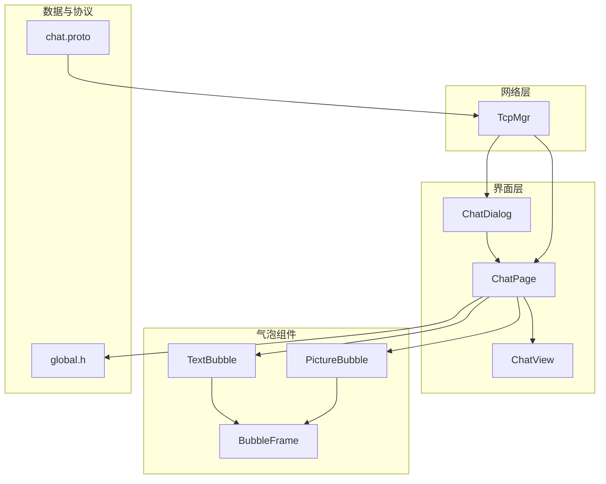
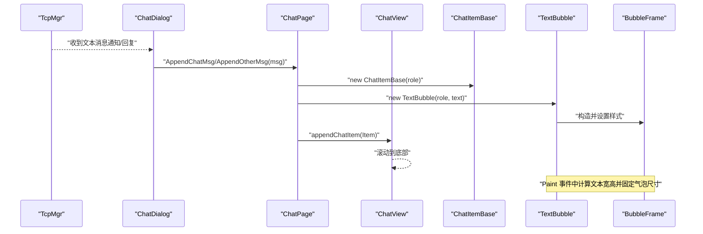
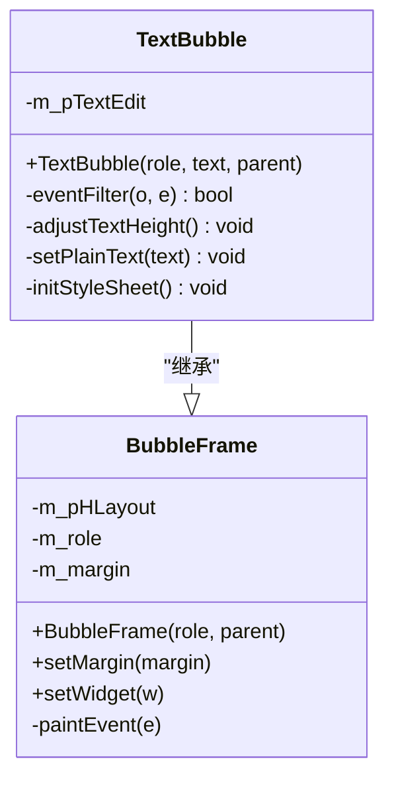
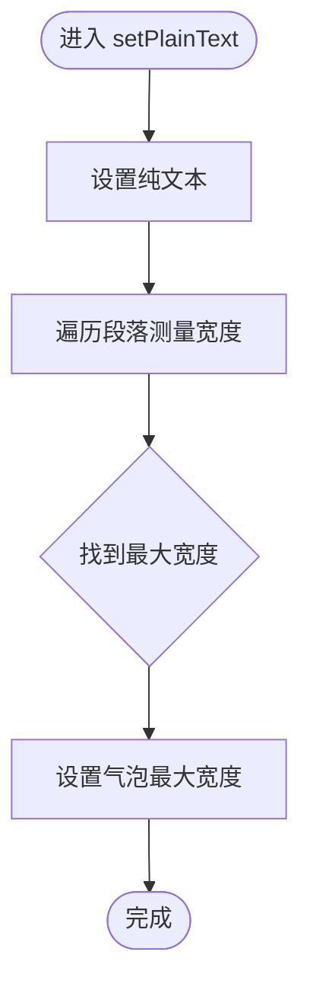
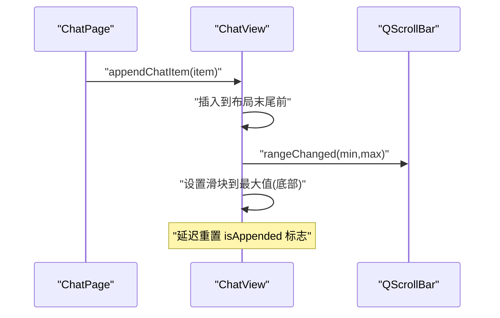
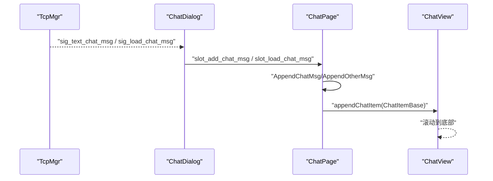
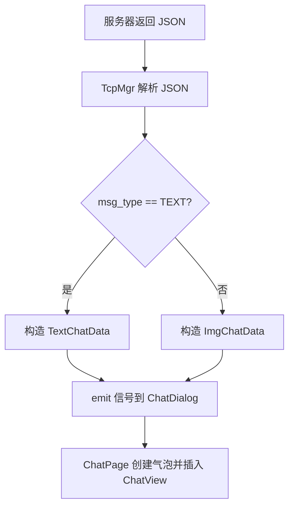
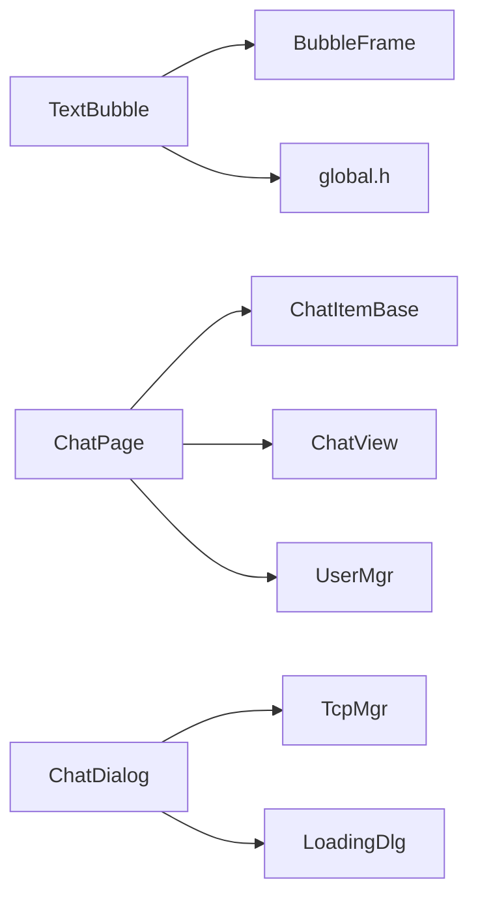

# 文本消息处理

<cite>
**本文引用的文件**   
- [TextBubble.h](file://client/llfcchat/include/TextBubble.h)
- [TextBubble.cpp](file://client/llfcchat/src/TextBubble.cpp)
- [BubbleFrame.h](file://client/llfcchat/include/BubbleFrame.h)
- [BubbleFrame.cpp](file://client/llfcchat/src/BubbleFrame.cpp)
- [ChatView.h](file://client/llfcchat/include/ChatView.h)
- [ChatView.cpp](file://client/llfcchat/src/ChatView.cpp)
- [chatdialog.h](file://client/llfcchat/include/chatdialog.h)
- [chatdialog.cpp](file://client/llfcchat/src/chatdialog.cpp)
- [chatpage.cpp](file://client/llfcchat/src/chatpage.cpp)
- [ChatItemBase.h](file://client/llfcchat/include/ChatItemBase.h)
- [global.h](file://client/llfcchat/include/global.h)
- [tcpmgr.cpp](file://client/llfcchat/src/tcpmgr.cpp)
- [chat.proto](file://proto/chat_service/chat.proto)
</cite>

## 目录
1. [简介](#简介)
2. [项目结构](#项目结构)
3. [核心组件](#核心组件)
4. [架构总览](#架构总览)
5. [详细组件分析](#详细组件分析)
6. [依赖关系分析](#依赖关系分析)
7. [性能考虑](#性能考虑)
8. [故障排查指南](#故障排查指南)
9. [结论](#结论)
10. [附录](#附录)

## 简介
本技术文档聚焦于 LLFCChat 客户端的文本消息处理功能，重点解析 TextBubble 气泡组件的实现原理、文本渲染与格式化显示机制、与 ChatDialog/ChatView 的关系、以及消息从网络到界面的完整调用链。文档同时覆盖粘贴/复制/选择等交互能力、序列化格式、异步加载机制与性能优化策略，既适合初学者快速上手，也为有经验的开发者提供深入的技术细节。

## 项目结构
与文本消息处理相关的关键代码位于 client/llfcchat 子模块中：
- UI 层：ChatDialog（主对话框）、ChatPage（聊天页面）、ChatView（滚动视图容器）
- 气泡组件：BubbleFrame（气泡基类）、TextBubble（文本气泡）、PictureBubble（图片气泡）
- 数据与协议：global.h（枚举与通用类型）、chat.proto（gRPC 消息定义）
- 网络层：tcpmgr.cpp（TCP 消息收发与解析）

图表来源 
- [chatdialog.cpp:1-200](file://client/llfcchat/src/chatdialog.cpp#L1-L200)
- [chatpage.cpp:1-300](file://client/llfcchat/src/chatpage.cpp#L1-L300)
- [ChatView.cpp:1-133](file://client/llfcchat/src/ChatView.cpp#L1-L133)
- [BubbleFrame.cpp:1-73](file://client/llfcchat/src/BubbleFrame.cpp#L1-L73)
- [TextBubble.cpp:1-79](file://client/llfcchat/src/TextBubble.cpp#L1-L79)
- [tcpmgr.cpp:731-753](file://client/llfcchat/src/tcpmgr.cpp#L731-L753)
- [chat.proto:52-104](file://proto/chat_service/chat.proto#L52-L104)

章节来源
- [chatdialog.h:1-98](file://client/llfcchat/include/chatdialog.h#L1-L98)
- [chatdialog.cpp:1-200](file://client/llfcchat/src/chatdialog.cpp#L1-L200)
- [chatpage.cpp:1-300](file://client/llfcchat/src/chatpage.cpp#L1-L300)
- [ChatView.h:1-33](file://client/llfcchat/include/ChatView.h#L1-L33)
- [ChatView.cpp:1-133](file://client/llfcchat/src/ChatView.cpp#L1-L133)
- [BubbleFrame.h:1-24](file://client/llfcchat/include/BubbleFrame.h#L1-L24)
- [BubbleFrame.cpp:1-73](file://client/llfcchat/src/BubbleFrame.cpp#L1-L73)
- [TextBubble.h:1-24](file://client/llfcchat/include/TextBubble.h#L1-L24)
- [TextBubble.cpp:1-79](file://client/llfcchat/src/TextBubble.cpp#L1-L79)
- [global.h:1-296](file://client/llfcchat/include/global.h#L1-L296)
- [tcpmgr.cpp:731-753](file://client/llfcchat/src/tcpmgr.cpp#L731-L753)
- [chat.proto:52-104](file://proto/chat_service/chat.proto#L52-L104)

## 核心组件
- BubbleFrame：气泡容器基类，负责绘制左右三角箭头与圆角背景，区分“自己/对方”角色布局。
- TextBubble：文本气泡实现，基于 QTextEdit 进行只读文本渲染，自动计算最大宽度与高度，适配不同字体与行高。
- ChatView：聊天内容滚动容器，管理垂直滚动条隐藏/显示、尾插追加消息并自动滚动到底部。
- ChatPage：将网络消息转换为 UI 气泡（TextBubble/PictureBubble），并插入 ChatView。
- ChatDialog：顶层对话框，协调各页面与网络事件，分发消息回调至 ChatPage。

章节来源
- [BubbleFrame.h:1-24](file://client/llfcchat/include/BubbleFrame.h#L1-L24)
- [BubbleFrame.cpp:1-73](file://client/llfcchat/src/BubbleFrame.cpp#L1-L73)
- [TextBubble.h:1-24](file://client/llfcchat/include/TextBubble.h#L1-L24)
- [TextBubble.cpp:1-79](file://client/llfcchat/src/TextBubble.cpp#L1-L79)
- [ChatView.h:1-33](file://client/llfcchat/include/ChatView.h#L1-L33)
- [ChatView.cpp:1-133](file://client/llfcchat/src/ChatView.cpp#L1-L133)
- [chatpage.cpp:1-300](file://client/llfcchat/src/chatpage.cpp#L1-L300)
- [chatdialog.h:1-98](file://client/llfcchat/include/chatdialog.h#L1-L98)

## 架构总览
文本消息从网络到达客户端，经 TcpMgr 解析为 ChatDataBase 派生对象（如 TextChatData），再由 ChatDialog 回调分发到 ChatPage。ChatPage 根据消息类型创建对应的气泡（TextBubble 或 PictureBubble），并通过 ChatView 追加到滚动区域。TextBubble 内部使用 QTextEdit 渲染纯文本，并在 Paint 事件中动态计算尺寸，确保气泡自适应文本长度与行数。

图表来源 
- [tcpmgr.cpp:731-753](file://client/llfcchat/src/tcpmgr.cpp#L731-L753)
- [chatdialog.cpp:1-200](file://client/llfcchat/src/chatdialog.cpp#L1-L200)
- [chatpage.cpp:1-300](file://client/llfcchat/src/chatpage.cpp#L1-L300)
- [ChatView.cpp:1-133](file://client/llfcchat/src/ChatView.cpp#L1-L133)
- [TextBubble.cpp:1-79](file://client/llfcchat/src/TextBubble.cpp#L1-L79)
- [BubbleFrame.cpp:1-73](file://client/llfcchat/src/BubbleFrame.cpp#L1-L73)

## 详细组件分析

### TextBubble 组件分析
TextBubble 继承自 BubbleFrame，封装了 QTextEdit 用于只读文本展示。其关键行为包括：
- 初始化：设置字体、禁用滚动条、安装事件过滤器、设置样式表。
- 文本宽度计算：遍历文档段落，取最宽段落作为气泡最大宽度。
- 高度自适应：在 Paint 事件中累加每段布局高度，得到文本总高度并固定气泡高度。
- 样式：透明背景无边框，使气泡背景由 BubbleFrame 绘制。

图表来源 
- [BubbleFrame.h:1-24](file://client/llfcchat/include/BubbleFrame.h#L1-L24)
- [BubbleFrame.cpp:1-73](file://client/llfcchat/src/BubbleFrame.cpp#L1-L73)
- [TextBubble.h:1-24](file://client/llfcchat/include/TextBubble.h#L1-L24)
- [TextBubble.cpp:1-79](file://client/llfcchat/src/TextBubble.cpp#L1-L79)

#### 文本渲染与格式化
- 渲染方式：当前实现使用 setPlainText，未启用 HTML 渲染；如需富文本可切换为 setHtml。
- 字体样式：默认微软雅黑 12pt，可通过 initStyleSheet 扩展 QSS。
- 段落宽度：通过 QFontMetricsF 测量每段文本宽度，取最大值作为气泡最大宽度。
- 行高计算：遍历 QTextBlock，累加 QTextLayout 的 boundingRect 高度，得到总高度。

图表来源 
- [TextBubble.cpp:37-56](file://client/llfcchat/src/TextBubble.cpp#L37-L56)

章节来源
- [TextBubble.h:1-24](file://client/llfcchat/include/TextBubble.h#L1-L24)
- [TextBubble.cpp:1-79](file://client/llfcchat/src/TextBubble.cpp#L1-L79)

### ChatView 组件分析
ChatView 是聊天内容的滚动容器，核心职责：
- 管理 QScrollArea 与自定义垂直滚动条位置（右侧）。
- 提供 appendChatItem/prependChatItem/insertChatItem 接口插入消息项。
- 监听滚动条范围变化，在批量追加时自动滚动到底部。
- 鼠标进入/离开时控制滚动条显隐。

图表来源 
- [ChatView.cpp:46-120](file://client/llfcchat/src/ChatView.cpp#L46-L120)

章节来源
- [ChatView.h:1-33](file://client/llfcchat/include/ChatView.h#L1-L33)
- [ChatView.cpp:1-133](file://client/llfcchat/src/ChatView.cpp#L1-L133)

### ChatPage 与 ChatDialog 协作
- ChatDialog：接收 TcpMgr 的信号（文本/图片消息），转发给 ChatPage 进行 UI 更新。
- ChatPage：根据消息类型创建对应气泡（TextBubble/PictureBubble），设置用户名与头像，插入 ChatView。
- ChatItemBase：承载用户信息（名称、头像）与气泡控件，支持状态标记（发送中/已读等）。

图表来源 
- [chatdialog.cpp:1-200](file://client/llfcchat/src/chatdialog.cpp#L1-L200)
- [chatpage.cpp:1-300](file://client/llfcchat/src/chatpage.cpp#L1-L300)

章节来源
- [chatdialog.h:1-98](file://client/llfcchat/include/chatdialog.h#L1-L98)
- [chatdialog.cpp:1-200](file://client/llfcchat/src/chatdialog.cpp#L1-L200)
- [chatpage.cpp:1-300](file://client/llfcchat/src/chatpage.cpp#L1-L300)
- [ChatItemBase.h:1-30](file://client/llfcchat/include/ChatItemBase.h#L1-L30)

### 消息序列化与网络流程
- 协议定义：chat.proto 定义了 TextChatData、TextChatMsgReq/Rsp 等消息结构，包含 unique_id、msg_id、msgcontent、chat_time 等字段。
- 客户端解析：tcpmgr.cpp 将 JSON 数据解析为 ChatDataBase 派生对象（TextChatData/ImgChatData），并触发 UI 更新。
- 本地存储：ChatThreadData 维护会话消息映射与未响应消息集合，便于重放与状态同步。

图表来源 
- [chat.proto:52-104](file://proto/chat_service/chat.proto#L52-L104)
- [tcpmgr.cpp:731-753](file://client/llfcchat/src/tcpmgr.cpp#L731-L753)
- [chatpage.cpp:1-300](file://client/llfcchat/src/chatpage.cpp#L1-L300)

章节来源
- [chat.proto:52-104](file://proto/chat_service/chat.proto#L52-L104)
- [tcpmgr.cpp:731-753](file://client/llfcchat/src/tcpmgr.cpp#L731-L753)
- [global.h:1-296](file://client/llfcchat/include/global.h#L1-L296)

## 依赖关系分析
- TextBubble 依赖 BubbleFrame（气泡外观）、QTextEdit（文本渲染）、global.h（ChatRole 等枚举）。
- ChatPage 依赖 ChatItemBase（消息项容器）、ChatView（滚动容器）、UserMgr（用户信息）、FileTcpMgr（头像下载）。
- ChatDialog 依赖 TcpMgr（网络通信）、LoadingDlg（加载提示）、全局定时器（心跳）。
- ChatView 依赖 QScrollArea、QVBoxLayout、QScrollBar。

图表来源 
- [TextBubble.cpp:1-79](file://client/llfcchat/src/TextBubble.cpp#L1-L79)
- [BubbleFrame.cpp:1-73](file://client/llfcchat/src/BubbleFrame.cpp#L1-L73)
- [chatpage.cpp:1-300](file://client/llfcchat/src/chatpage.cpp#L1-L300)
- [ChatView.cpp:1-133](file://client/llfcchat/src/ChatView.cpp#L1-L133)
- [chatdialog.cpp:1-200](file://client/llfcchat/src/chatdialog.cpp#L1-L200)

章节来源
- [TextBubble.h:1-24](file://client/llfcchat/include/TextBubble.h#L1-L24)
- [BubbleFrame.h:1-24](file://client/llfcchat/include/BubbleFrame.h#L1-L24)
- [ChatItemBase.h:1-30](file://client/llfcchat/include/ChatItemBase.h#L1-L30)
- [ChatView.h:1-33](file://client/llfcchat/include/ChatView.h#L1-L33)
- [chatdialog.h:1-98](file://client/llfcchat/include/chatdialog.h#L1-L98)

## 性能考虑
- 文本宽度与高度计算：
  - 宽度计算仅在 setPlainText 时执行一次，避免重复测量。
  - 高度计算在 Paint 事件中执行，注意频繁重绘可能带来开销；可考虑缓存布局结果或使用 QTimer 节流。
- 滚动性能：
  - ChatView 在批量追加时使用 isAppended 标志与定时器延迟复位，减少多次滚动导致的重排。
- 资源加载：
  - 头像异步下载与占位图显示，避免阻塞 UI。
- 内存管理：
  - ChatView::removeAllItem 正确释放 widget 与 layout item，防止内存泄漏。

[本节为通用性能建议，不直接分析具体文件]

## 故障排查指南
- 气泡高度不正确：
  - 检查 adjustTextHeight 是否在 Paint 事件中调用，确认 QTextLayout 的 boundingRect 累加逻辑。
- 气泡宽度异常：
  - 检查 setPlainText 中的段落宽度测量是否包含 documentMargin 与布局边距。
- 滚动条不显示或位置错误：
  - 确认 onVScrollBarMoved 中 sliderPosition 设置为最大值，且 isAppended 标志被正确复位。
- 头像加载失败：
  - 检查 UserMgr 下载队列与路径生成逻辑，确认目录存在与权限。

章节来源
- [TextBubble.cpp:28-35](file://client/llfcchat/src/TextBubble.cpp#L28-L35)
- [TextBubble.cpp:57-73](file://client/llfcchat/src/TextBubble.cpp#L57-L73)
- [ChatView.cpp:108-120](file://client/llfcchat/src/ChatView.cpp#L108-L120)
- [chatpage.cpp:276-300](file://client/llfcchat/src/chatpage.cpp#L276-L300)

## 结论
TextBubble 以简洁高效的纯文本渲染方案实现了聊天气泡的核心需求，结合 BubbleFrame 的外观绘制与 ChatView 的滚动管理，形成了稳定可靠的文本消息展示链路。通过与 ChatDialog/ChatPage 的协作以及与 TcpMgr 的网络集成，系统实现了从协议解析到 UI 渲染的完整闭环。未来可在富文本渲染、性能缓存与交互增强方面进一步优化。

[本节为总结性内容，不直接分析具体文件]

## 附录
- 配置选项与参数：
  - TextBubble：role（Self/Other）、text（字符串内容）、parent（父窗口）
  - ChatView：appendChatItem/prependChatItem/insertChatItem（插入消息项）
  - ChatDialog：slot_add_chat_msg/slot_load_chat_msg（消息槽函数）
- 返回值说明：
  - TextBubble：无返回值，构造后自动渲染
  - ChatView：void 方法，操作布局
  - ChatDialog：槽函数无返回值，仅触发 UI 更新
- 交互操作：
  - 粘贴/复制/选择：QTextEdit 默认支持，但当前设为只读；如需编辑可移除 readOnly 并启用相应动作。

章节来源
- [TextBubble.h:1-24](file://client/llfcchat/include/TextBubble.h#L1-L24)
- [ChatView.h:1-33](file://client/llfcchat/include/ChatView.h#L1-L33)
- [chatdialog.h:1-98](file://client/llfcchat/include/chatdialog.h#L1-L98)