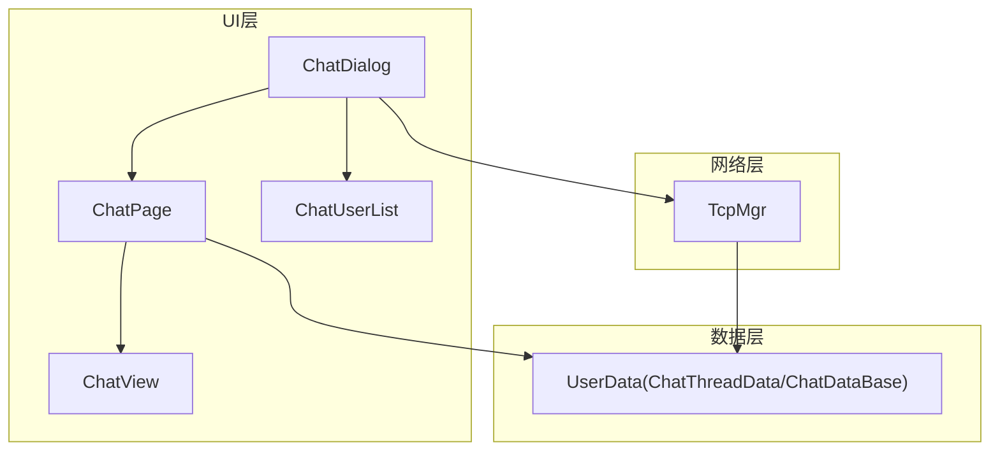
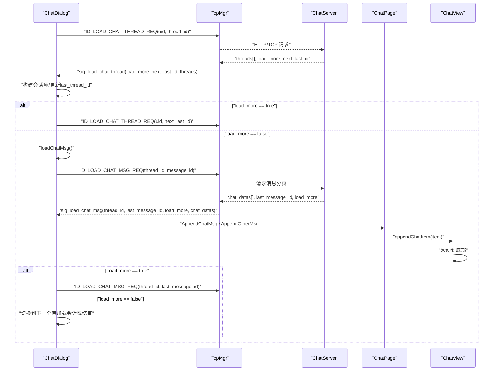
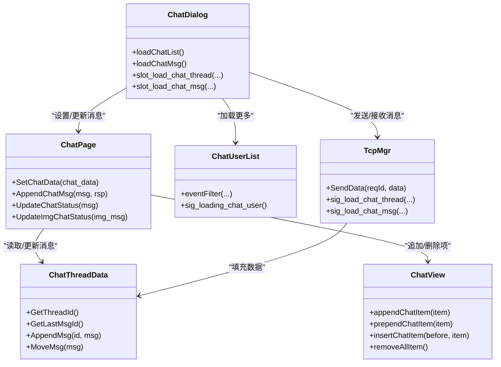

# 消息历史加载

<cite>
**本文引用的文件**   
- [ChatView.h](file://client/llfcchat/include/ChatView.h)
- [ChatView.cpp](file://client/llfcchat/src/ChatView.cpp)
- [tcpmgr.h](file://client/llfcchat/include/tcpmgr.h)
- [tcpmgr.cpp](file://client/llfcchat/src/tcpmgr.cpp)
- [chatdialog.h](file://client/llfcchat/include/chatdialog.h)
- [chatdialog.cpp](file://client/llfcchat/src/chatdialog.cpp)
- [chatpage.h](file://client/llfcchat/include/chatpage.h)
- [chatpage.cpp](file://client/llfcchat/src/chatpage.cpp)
- [userdata.h](file://client/llfcchat/include/userdata.h)
- [userdata.cpp](file://client/llfcchat/src/userdata.cpp)
- [chatuserlist.h](file://client/llfcchat/include/chatuserlist.h)
- [chatuserlist.cpp](file://client/llfcchat/src/chatuserlist.cpp)
- [day20-动态加载聊天列表.md](file://开发文档/day20-动态加载聊天列表.md)
- [day42-用户加载聊天资源.md](file://开发文档/day42-用户加载聊天资源.md)
</cite>

## 目录
1. [简介](#简介)
2. [项目结构](#项目结构)
3. [核心组件](#核心组件)
4. [架构总览](#架构总览)
5. [详细组件分析](#详细组件分析)
6. [依赖关系分析](#依赖关系分析)
7. [性能与内存优化](#性能与内存优化)
8. [故障排查指南](#故障排查指南)
9. [结论](#结论)
10. [附录：接口与参数说明](#附录接口与参数说明)

## 简介
本技术文档聚焦于 LLFCChat 客户端的消息历史加载能力，重点阐述以下方面：
- 聊天会话列表的分页加载机制（按 thread_id 分页）
- 聊天消息的历史分页加载（按 message_id 分页）
- 滚动区域的事件监听与“加载更多”触发策略
- 虚拟滚动与增量渲染思路（当前实现为全量追加 + 滚动位置保持，后续可扩展为虚拟列表）
- 与 TcpMgr 和后端服务的交互流程（JSON 协议、请求/响应字段、错误码处理）
- 大量消息数据的内存管理、加载状态提示与错误恢复机制
- 用户体验优化：滚动到底部自动定位、图片占位与异步下载、未回复消息状态同步

## 项目结构
围绕消息历史加载的关键代码分布在客户端 UI、网络管理与数据模型三个层次：
- UI 层：ChatDialog（主界面）、ChatPage（聊天页面）、ChatView（滚动容器）、ChatUserList（聊天列表）
- 网络层：TcpMgr（TCP 连接、收发、消息分发）
- 数据层：ChatThreadData、ChatDataBase、TextChatData、ImgChatData（会话与消息模型）

图表来源
- [chatdialog.cpp:203-243](file://client/llfcchat/src/chatdialog.cpp#L203-L243)
- [chatpage.cpp:38-64](file://client/llfcchat/src/chatpage.cpp#L38-L64)
- [ChatView.cpp:11-44](file://client/llfcchat/src/ChatView.cpp#L11-L44)
- [chatuserlist.cpp:16-69](file://client/llfcchat/src/chatuserlist.cpp#L16-L69)
- [tcpmgr.cpp:615-798](file://client/llfcchat/src/tcpmgr.cpp#L615-L798)

章节来源
- [chatdialog.cpp:203-243](file://client/llfcchat/src/chatdialog.cpp#L203-L243)
- [chatpage.cpp:38-64](file://client/llfcchat/src/chatpage.cpp#L38-L64)
- [ChatView.cpp:11-44](file://client/llfcchat/src/ChatView.cpp#L11-L44)
- [chatuserlist.cpp:16-69](file://client/llfcchat/src/chatuserlist.cpp#L16-L69)
- [tcpmgr.cpp:615-798](file://client/llfcchat/src/tcpmgr.cpp#L615-L798)

## 核心组件
- ChatDialog：负责会话列表与消息的加载编排、显示 Loading 对话框、维护当前会话上下文。
- ChatPage：负责将消息对象渲染为气泡并插入到 ChatView；维护已发送/未回复消息映射。
- ChatView：封装 QScrollArea，提供 append/prepend/insert/remove 等 API，并在追加后自动滚动到底部。
- ChatUserList：监听滚轮事件，在滚动到底部时触发“加载更多”信号。
- TcpMgr：统一 TCP 收发、协议解析、消息分发，将服务端返回的数据转换为 Qt 信号。
- UserData：会话与消息数据结构（ChatThreadData、ChatDataBase、TextChatData、ImgChatData）。

章节来源
- [chatdialog.h:25-90](file://client/llfcchat/include/chatdialog.h#L25-L90)
- [chatpage.h:13-50](file://client/llfcchat/include/chatpage.h#L13-L50)
- [ChatView.h:7-30](file://client/llfcchat/include/ChatView.h#L7-L30)
- [chatuserlist.h:9-21](file://client/llfcchat/include/chatuserlist.h#L9-L21)
- [tcpmgr.h:22-87](file://client/llfcchat/include/tcpmgr.h#L22-L87)
- [userdata.h:144-284](file://client/llfcchat/include/userdata.h#L144-L284)

## 架构总览
整体加载流程分为两条主线：
- 会话列表分页加载：根据 last_thread_id 分页获取会话，构建左侧列表项，必要时继续拉取下一页。
- 消息历史分页加载：对每个会话按 last_msg_id 分页拉取消息，构建气泡并追加到 ChatView，必要时继续拉取下一页。

图表来源
- [chatdialog.cpp:203-243](file://client/llfcchat/src/chatdialog.cpp#L203-L243)
- [chatdialog.cpp:437-485](file://client/llfcchat/src/chatdialog.cpp#L437-L485)
- [tcpmgr.cpp:615-798](file://client/llfcchat/src/tcpmgr.cpp#L615-L798)
- [chatpage.cpp:66-176](file://client/llfcchat/src/chatpage.cpp#L66-L176)
- [ChatView.cpp:46-52](file://client/llfcchat/src/ChatView.cpp#L46-L52)

## 详细组件分析

### 聊天列表分页加载（会话维度）
- 触发入口：登录后进入聊天界面，调用 loadChatList() 发起 ID_LOAD_CHAT_THREAD_REQ。
- 请求参数：uid、thread_id（上次最后会话 id，用于分页）。
- 响应字段：threads[]、load_more、next_last_id。
- 处理逻辑：
  - 遍历 threads，构造 ChatThreadData 并添加到 UserMgr。
  - 为每个会话创建 ChatUserWid 并插入 QListWidget。
  - 若 load_more 为真，使用 next_last_id 继续请求。
  - 全部会话加载完成后，进入消息加载阶段。

章节来源
- [chatdialog.cpp:203-243](file://client/llfcchat/src/chatdialog.cpp#L203-L243)
- [chatdialog.cpp:358-410](file://client/llfcchat/src/chatdialog.cpp#L358-L410)
- [tcpmgr.cpp:615-658](file://client/llfcchat/src/tcpmgr.cpp#L615-L658)

### 消息历史分页加载（消息维度）
- 触发入口：会话列表加载完成后，调用 loadChatMsg() 发起 ID_LOAD_CHAT_MSG_REQ。
- 请求参数：thread_id、message_id（上次最后消息 id，用于分页）。
- 响应字段：chat_datas[]、last_message_id、load_more。
- 处理逻辑：
  - 将每条消息加入 _cur_load_chat 的 msg_map，并记录 last_message_id。
  - 若 load_more 为真，继续使用 last_message_id 拉取下一页。
  - 否则，切换至下一个待加载会话或结束。
  - 对于图片消息，若本地不存在则生成占位符并触发异步下载。

章节来源
- [chatdialog.cpp:222-243](file://client/llfcchat/src/chatdialog.cpp#L222-L243)
- [chatdialog.cpp:437-485](file://client/llfcchat/src/chatdialog.cpp#L437-L485)
- [tcpmgr.cpp:699-798](file://client/llfcchat/src/tcpmgr.cpp#L699-L798)

### 滚动与“加载更多”触发
- 聊天列表（ChatUserList）：
  - 通过 eventFilter 捕获 viewport 的 Wheel 事件。
  - 当 verticalScrollBar 到达底部时，发出 sig_loading_chat_user。
  - 使用 _load_pending 防抖，避免重复触发。
- 聊天消息（ChatView）：
  - appendChatItem 后，onVScrollBarMoved 将滑块置底，保证最新可见。
  - 使用 isAppended 标记与 QTimer 延迟复位，避免频繁滚动抖动。

章节来源
- [chatuserlist.cpp:16-69](file://client/llfcchat/src/chatuserlist.cpp#L16-L69)
- [ChatView.cpp:46-52](file://client/llfcchat/src/ChatView.cpp#L46-L52)
- [ChatView.cpp:108-120](file://client/llfcchat/src/ChatView.cpp#L108-L120)
- [day20-动态加载聊天列表.md:1-44](file://开发文档/day20-动态加载聊天列表.md#L1-L44)

### 消息渲染与状态同步
- ChatPage::AppendChatMsg：
  - 根据发送者角色选择头像与气泡类型（文本/图片）。
  - 将 ChatItemBase 插入 ui->chat_data_list（即 ChatView），并维护 _base_item_map 与 _unrsp_item_map。
- 状态更新：
  - slot_add_chat_msg/slot_add_img_msg：将未回复消息移动到已回复映射，更新状态。
  - UpdateImgChatStatus：图片下载完成后替换预览图并更新进度。

章节来源
- [chatpage.cpp:66-176](file://client/llfcchat/src/chatpage.cpp#L66-L176)
- [chatdialog.cpp:488-521](file://client/llfcchat/src/chatdialog.cpp#L488-L521)
- [chatpage.cpp:305-332](file://client/llfcchat/src/chatpage.cpp#L305-L332)

### 图片消息与资源下载
- 图片消息加载：
  - 若本地路径不存在或图片加载失败，创建占位符消息并触发异步下载。
  - 下载完成后回调更新 PictureBubble 的预览图与传输状态。
- 头像加载：
  - 优先使用默认头像，若为用户上传头像则异步下载并缓存。

章节来源
- [tcpmgr.cpp:749-793](file://client/llfcchat/src/tcpmgr.cpp#L749-L793)
- [chatpage.cpp:276-303](file://client/llfcchat/src/chatpage.cpp#L276-L303)
- [chatpage.cpp:348-367](file://client/llfcchat/src/chatpage.cpp#L348-L367)

### 数据模型与内存管理
- ChatThreadData：
  - 维护 _msg_map（按 msg_id 索引）与 _msg_unrsp_map（按 unique_id 索引）。
  - MoveMsg 将未回复消息迁移到已回复映射，更新状态与 msg_id。
- ChatDataBase 派生类：
  - TextChatData：文本消息。
  - ImgChatData：图片消息，包含 MsgInfo（大小、进度、路径等）。

章节来源
- [userdata.cpp:49-68](file://client/llfcchat/src/userdata.cpp#L49-L68)
- [userdata.h:248-284](file://client/llfcchat/include/userdata.h#L248-L284)

## 依赖关系分析
- ChatDialog 依赖 TcpMgr 进行网络通信，依赖 UserMgr 管理会话与消息数据。
- ChatPage 依赖 ChatView 进行消息渲染，依赖 UserMgr 获取用户信息与头像。
- TcpMgr 依赖全局 ReqId 枚举与 JSON 解析，将服务端响应转换为 Qt 信号。
- ChatUserList 依赖 UserMgr 判断是否已加载完成，避免重复请求。

图表来源
- [chatdialog.cpp:203-243](file://client/llfcchat/src/chatdialog.cpp#L203-L243)
- [chatpage.cpp:38-64](file://client/llfcchat/src/chatpage.cpp#L38-L64)
- [ChatView.cpp:46-52](file://client/llfcchat/src/ChatView.cpp#L46-L52)
- [chatuserlist.cpp:16-69](file://client/llfcchat/src/chatuserlist.cpp#L16-L69)
- [tcpmgr.cpp:615-798](file://client/llfcchat/src/tcpmgr.cpp#L615-L798)
- [userdata.cpp:49-68](file://client/llfcchat/src/userdata.cpp#L49-L68)

章节来源
- [chatdialog.cpp:203-243](file://client/llfcchat/src/chatdialog.cpp#L203-L243)
- [chatpage.cpp:38-64](file://client/llfcchat/src/chatpage.cpp#L38-L64)
- [ChatView.cpp:46-52](file://client/llfcchat/src/ChatView.cpp#L46-L52)
- [chatuserlist.cpp:16-69](file://client/llfcchat/src/chatuserlist.cpp#L16-L69)
- [tcpmgr.cpp:615-798](file://client/llfcchat/src/tcpmgr.cpp#L615-L798)
- [userdata.cpp:49-68](file://client/llfcchat/src/userdata.cpp#L49-L68)

## 性能与内存优化
- 当前实现特点：
  - 聊天列表与消息均采用全量追加模式，适合中小规模数据。
  - 通过 isAppended 与 QTimer 控制滚动频率，减少重绘抖动。
  - 图片消息采用占位符+异步下载，避免阻塞 UI。
- 可改进方向（虚拟滚动）：
  - 在 ChatView 中引入可视区域计算，仅渲染可见范围内的气泡。
  - 使用 QStandardItemModel 或自定义模型配合 QListView/QTableView 实现高效虚拟化。
  - 对大数据集启用懒加载与回收机制，降低内存占用。
- 增量加载算法建议：
  - 基于 last_message_id 的游标式分页，避免偏移量带来的性能退化。
  - 合并多次小批量响应，减少 UI 刷新次数。
- 用户体验优化：
  - 滚动到底部自动定位，确保最新消息可见。
  - 加载状态提示（LoadingDlg）与错误恢复（重试/降级展示）。

[本节为通用指导，不直接分析具体文件]

## 故障排查指南
- 网络连接问题：
  - 检查 TcpMgr 的错误处理分支（连接拒绝、超时、主机未找到等），确认 sig_con_success 与 sig_connection_closed 信号是否正确转发。
- JSON 解析失败：
  - 检查 handleMsg 中的 QJsonDocument 转换与 error 字段校验，确保字段存在性与类型正确。
- 图片加载异常：
  - 确认本地路径是否存在，QPixmap 是否为空；若为空则走占位符与下载流程。
- 滚动位置丢失：
  - 检查 onVScrollBarMoved 的 isAppended 标志与 QTimer 延时复位逻辑，避免频繁滚动导致位置错乱。
- 重复加载更多：
  - 确认 ChatUserList 的 _load_pending 防抖与 UserMgr 的 IsLoadChatFin 判断。

章节来源
- [tcpmgr.cpp:64-91](file://client/llfcchat/src/tcpmgr.cpp#L64-L91)
- [tcpmgr.cpp:699-798](file://client/llfcchat/src/tcpmgr.cpp#L699-L798)
- [chatpage.cpp:276-303](file://client/llfcchat/src/chatpage.cpp#L276-L303)
- [ChatView.cpp:108-120](file://client/llfcchat/src/ChatView.cpp#L108-L120)
- [chatuserlist.cpp:44-63](file://client/llfcchat/src/chatuserlist.cpp#L44-L63)

## 结论
LLFCChat 的消息历史加载功能以清晰的职责划分与信号槽机制实现了会话与消息的分页加载、渲染与状态同步。当前方案在中小规模数据下表现稳定，具备较好的扩展性。未来可通过引入虚拟滚动与更精细的增量渲染策略，进一步提升大规模数据下的性能与用户体验。

[本节为总结，不直接分析具体文件]

## 附录：接口与参数说明
- 会话列表加载
  - 请求：ID_LOAD_CHAT_THREAD_REQ
    - 字段：uid, thread_id
  - 响应：ID_LOAD_CHAT_THREAD_RSP
    - 字段：threads[], load_more, next_last_id
- 消息历史加载
  - 请求：ID_LOAD_CHAT_MSG_REQ
    - 字段：thread_id, message_id
  - 响应：ID_LOAD_CHAT_MSG_RSP
    - 字段：chat_datas[], last_message_id, load_more
- 实时消息通知
  - 文本消息：ID_NOTIFY_TEXT_CHAT_MSG_REQ -> sig_text_chat_msg
  - 图片消息：ID_IMG_CHAT_MSG_RSP -> sig_chat_img_rsp
- 关键方法
  - loadMoreChatUser()：预留的聊天列表加载更多接口（当前未启用）
  - slot_load_chat_msg()：处理消息分页响应并渲染
  - appendChatItem()/prependChatItem()/insertChatItem()：ChatView 的插入接口
  - onVScrollBarMoved()：滚动到底部保持逻辑

章节来源
- [chatdialog.cpp:203-243](file://client/llfcchat/src/chatdialog.cpp#L203-L243)
- [chatdialog.cpp:437-485](file://client/llfcchat/src/chatdialog.cpp#L437-L485)
- [tcpmgr.cpp:615-798](file://client/llfcchat/src/tcpmgr.cpp#L615-L798)
- [ChatView.h:12-15](file://client/llfcchat/include/ChatView.h#L12-L15)
- [ChatView.cpp:108-120](file://client/llfcchat/src/ChatView.cpp#L108-L120)
- [chatdialog.cpp:600-622](file://client/llfcchat/src/chatdialog.cpp#L600-L622)