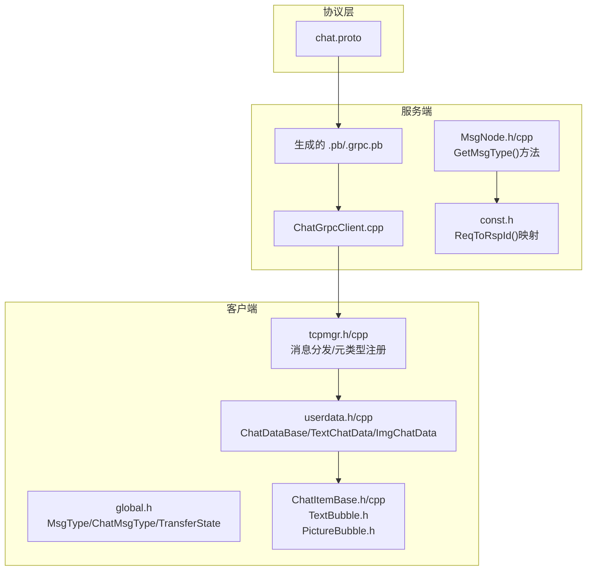
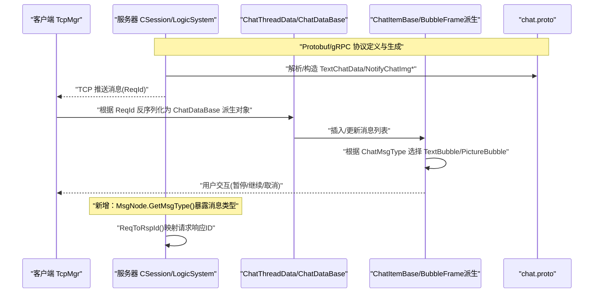
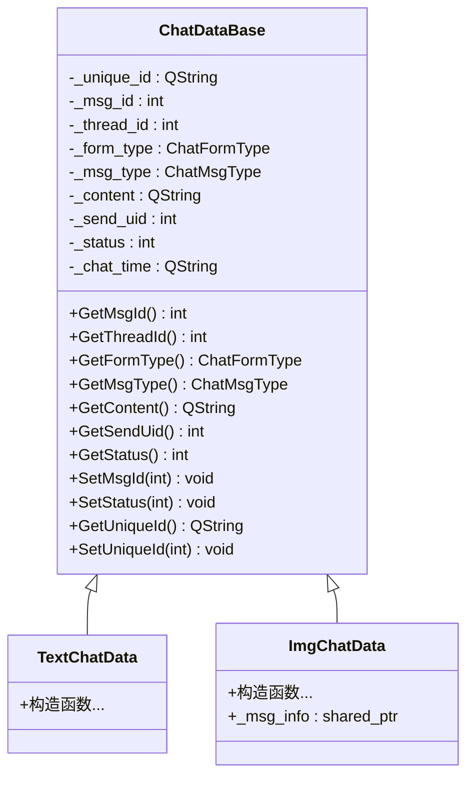
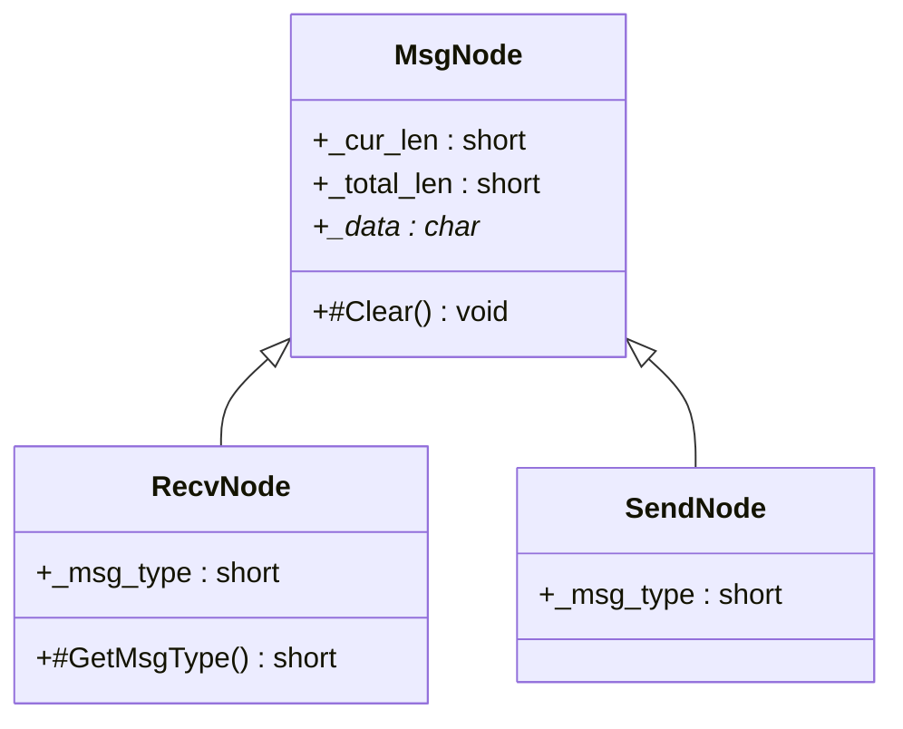
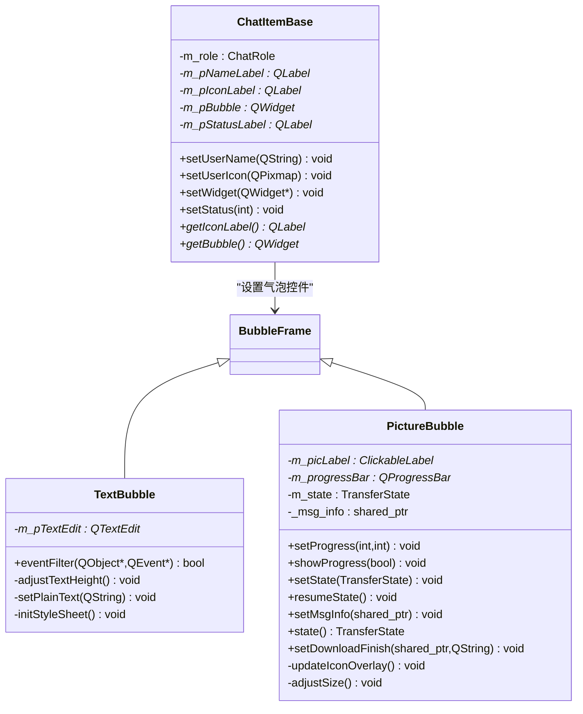
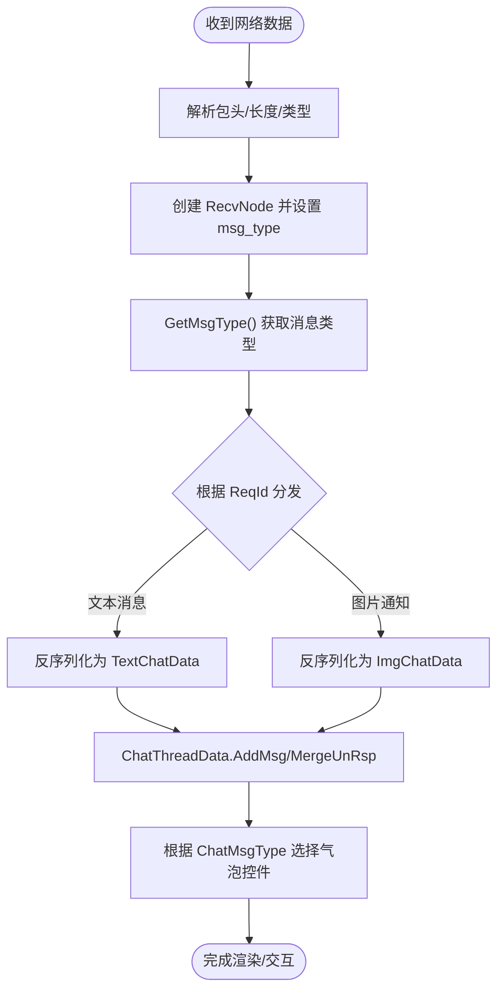
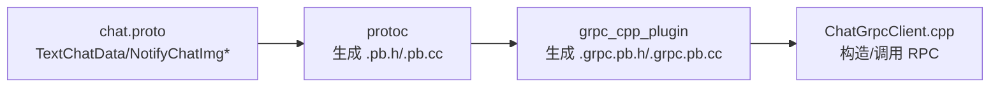
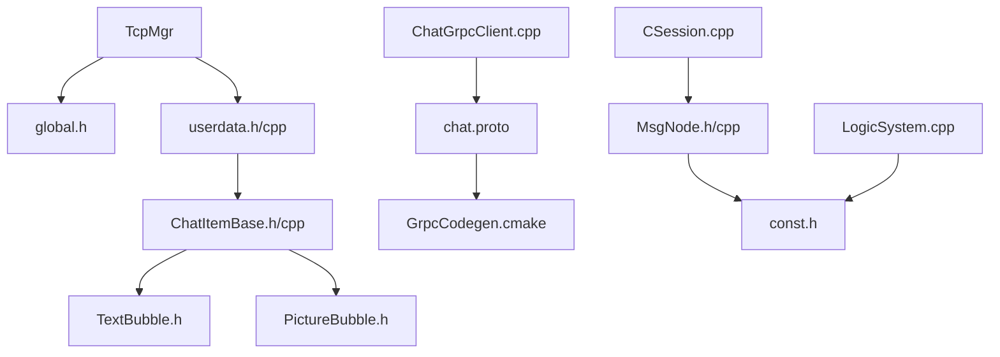

# 消息类型系统

<cite>
**本文引用的文件**   
- [ChatItemBase.h](file://client/llfcchat/include/ChatItemBase.h)
- [ChatItemBase.cpp](file://client/llfcchat/src/ChatItemBase.cpp)
- [TextBubble.h](file://client/llfcchat/include/TextBubble.h)
- [PictureBubble.h](file://client/llfcchat/include/PictureBubble.h)
- [global.h](file://client/llfcchat/include/global.h)
- [userdata.h](file://client/llfcchat/include/userdata.h)
- [userdata.cpp](file://client/llfcchat/src/userdata.cpp)
- [tcpmgr.h](file://client/llfcchat/include/tcpmgr.h)
- [tcpmgr.cpp](file://client/llfcchat/src/tcpmgr.cpp)
- [chat.proto](file://proto/chat_service/chat.proto)
- [GrpcCodegen.cmake](file://cmake/GrpcCodegen.cmake)
- [ChatGrpcClient.cpp](file://server/ChatServer/src/ChatGrpcClient.cpp)
- [MsgNode.h](file://server/ChatServer/include/MsgNode.h)
- [MsgNode.cpp](file://server/ChatServer/src/MsgNode.cpp)
- [const.h](file://server/ChatServer/include/const.h)
- [CSession.cpp](file://server/ChatServer/src/CSession.cpp)
- [LogicSystem.cpp](file://server/ChatServer/src/LogicSystem.cpp)
- [day37-聊天信息存储方案.md](file://开发文档/day37-聊天信息存储方案.md)
- [day41-通知客户端异步下载聊天图片.md](file://开发文档/day41-通知客户端异步下载聊天图片.md)
</cite>

## 更新摘要
**所做更改**
- 新增 MsgNode 类的 GetMsgType() 方法章节，详细说明 IO 线程消息路由机制
- 更新 ReqToRspId() 函数映射机制，说明请求响应消息ID的对应关系
- 增强服务器端消息处理流程，包含错误处理和连接管理
- 完善消息节点架构，支持接收和发送节点的统一管理

## 目录
1. [简介](#简介)
2. [项目结构](#项目结构)
3. [核心组件](#核心组件)
4. [架构总览](#架构总览)
5. [详细组件分析](#详细组件分析)
6. [依赖关系分析](#依赖关系分析)
7. [性能考量](#性能考量)
8. [故障排查指南](#故障排查指南)
9. [结论](#结论)
10. [附录](#附录)

## 简介
本技术文档围绕 LLFCChat 的消息类型系统，系统性阐述基类 ChatDataBase 的设计模式、消息类型的继承体系与扩展机制；说明客户端 UI 层（ChatItemBase、BubbleFrame 派生）如何承载不同消息类型；解释消息的序列化/反序列化流程，以及与 Protocol Buffers 和 gRPC 协议的映射关系。同时给出工厂模式实现思路、消息路由机制、类型安全保证、兼容性处理与版本升级策略，帮助初学者快速上手，并为有经验的开发者提供深入的技术细节。

**最新更新**：增强了服务器端消息处理能力，通过 MsgNode 类的 GetMsgType() 方法暴露消息类型给IO线程，支持ReqToRspId()函数进行请求响应消息ID映射，提升了系统的稳定性和错误处理能力。

## 项目结构
本项目采用分层与按功能组织相结合的结构：
- proto 目录定义跨进程协议（gRPC + Protobuf），如 chat.proto。
- client 端包含 Qt 界面与业务逻辑，使用 userdata.h/cpp 定义消息数据模型，使用 global.h 定义枚举与通用结构，使用 ChatItemBase 及 BubbleFrame 派生类渲染消息气泡。
- server 端通过 CMake 生成 protobuf/grpc 代码，并使用 ChatGrpcClient 等模块进行 RPC 调用。
- **新增**：服务器端 MsgNode 类提供统一的消息节点管理，支持 IO 线程和业务线程间的高效通信。



**图表来源** 
- [chat.proto:1-105](file://proto/chat_service/chat.proto#L1-L105)
- [GrpcCodegen.cmake:1-37](file://cmake/GrpcCodegen.cmake#L1-L37)
- [ChatGrpcClient.cpp:143-202](file://server/ChatServer/src/ChatGrpcClient.cpp#L143-L202)
- [MsgNode.h:17-91](file://server/ChatServer/include/MsgNode.h#L17-L91)
- [const.h:117-132](file://server/ChatServer/include/const.h#L117-L132)
- [userdata.h:144-245](file://client/llfcchat/include/userdata.h#L144-L245)
- [global.h:145-176](file://client/llfcchat/include/global.h#L145-176)
- [ChatItemBase.h:1-30](file://client/llfcchat/include/ChatItemBase.h#L1-L30)
- [TextBubble.h:1-24](file://client/llfcchat/include/TextBubble.h#L1-L24)
- [PictureBubble.h:1-53](file://client/llfcchat/include/PictureBubble.h#L1-L53)
- [tcpmgr.h:31-70](file://client/llfcchat/include/tcpmgr.h#L31-L70)

## 核心组件
- ChatDataBase 抽象基类：统一封装消息 ID、会话 ID、表单类型（私聊/群聊）、消息类型、内容、发送者、状态、时间等公共字段，并提供虚析构以支持多态。
- TextChatData：文本消息具体实现，继承自 ChatDataBase。
- ImgChatData：图片消息具体实现，继承自 ChatDataBase，并持有 MsgInfo 用于传输进度与资源管理。
- ChatThreadData：会话线程的数据容器，维护已确认消息与未回复消息的映射，支持移动消息、更新进度等操作。
- ChatItemBase：UI 层消息项基类，负责头像、用户名、气泡容器与状态图标布局。
- TextBubble / PictureBubble：基于 BubbleFrame 的具体气泡控件，分别承载文本和图片展示与交互。
- global.h：集中定义 MsgType、ChatMsgType、TransferState、ReqId 等枚举与通用结构。
- tcpmgr.h/cpp：网络层消息分发与元类型注册，确保跨线程信号槽能正确传递自定义类型。
- **新增**：MsgNode 类族：包括基类 MsgNode、接收节点 RecvNode 和发送节点 SendNode，提供统一的内存管理和消息类型访问接口。

**章节来源**
- [userdata.h:144-245](file://client/llfcchat/include/userdata.h#L144-L245)
- [userdata.cpp:30-74](file://client/llfcchat/src/userdata.cpp#L30-L74)
- [ChatItemBase.h:1-30](file://client/llfcchat/include/ChatItemBase.h#L1-L30)
- [ChatItemBase.cpp:1-99](file://client/llfcchat/src/ChatItemBase.cpp#L1-L99)
- [TextBubble.h:1-24](file://client/llfcchat/include/TextBubble.h#L1-L24)
- [PictureBubble.h:1-53](file://client/llfcchat/include/PictureBubble.h#L1-L53)
- [global.h:145-176](file://client/llfcchat/include/global.h#L145-176)
- [tcpmgr.h:31-70](file://client/llfcchat/include/tcpmgr.h#L31-L70)
- [tcpmgr.cpp:123-159](file://client/llfcchat/src/tcpmgr.cpp#L123-L159)
- [MsgNode.h:17-91](file://server/ChatServer/include/MsgNode.h#L17-L91)

## 架构总览
下图展示了从协议到客户端 UI 的整体数据流与组件交互，**新增了服务器端消息节点处理流程**：



**图表来源** 
- [chat.proto:53-105](file://proto/chat_service/chat.proto#L53-L105)
- [ChatGrpcClient.cpp:143-202](file://server/ChatServer/src/ChatGrpcClient.cpp#L143-L202)
- [MsgNode.h:62-66](file://server/ChatServer/include/MsgNode.h#L62-L66)
- [const.h:117-132](file://server/ChatServer/include/const.h#L117-L132)
- [CSession.cpp:201-212](file://server/ChatServer/src/CSession.cpp#L201-L212)
- [LogicSystem.cpp:132-137](file://server/ChatServer/src/LogicSystem.cpp#L132-L137)
- [tcpmgr.h:31-70](file://client/llfcchat/include/tcpmgr.h#L31-L70)
- [userdata.h:144-245](file://client/llfcchat/include/userdata.h#L144-L245)
- [ChatItemBase.h:1-30](file://client/llfcchat/include/ChatItemBase.h#L1-L30)
- [TextBubble.h:1-24](file://client/llfcchat/include/TextBubble.h#L1-L24)
- [PictureBubble.h:1-53](file://client/llfcchat/include/PictureBubble.h#L1-L53)

## 详细组件分析

### ChatDataBase 继承体系与扩展机制
- 设计要点
  - 抽象基类统一字段与接口，子类仅关注特定内容的扩展。
  - 虚析构确保多态删除安全。
  - 通过 ChatMsgType 区分消息类型，便于后续扩展（视频、文件等）。
- 扩展方式
  - 新增消息类型时，定义新的 ChatDataBase 派生类，并在消息路由中增加对应分支。
  - 在 UI 层为新的消息类型创建对应的 BubbleFrame 派生控件。



**图表来源** 
- [userdata.h:144-245](file://client/llfcchat/include/userdata.h#L144-L245)

**章节来源**
- [userdata.h:144-245](file://client/llfcchat/include/userdata.h#L144-L245)
- [userdata.cpp:30-74](file://client/llfcchat/src/userdata.cpp#L30-L74)

### 服务器端消息节点架构（新增）
**MsgNode 类族设计**：
- **MsgNode 基类**：提供统一的缓冲区管理，包括内存分配、释放和清空操作。
- **RecvNode 接收节点**：存储从客户端接收的完整消息，包含消息类型和数据体，**新增 GetMsgType() 方法**暴露消息类型给IO线程。
- **SendNode 发送节点**：存储待发送给客户端的消息，包含消息头（类型+长度）和数据体。

**关键特性**：
- GetMsgType() 方法允许 IO 线程获取消息类型，用于路由分片绑定（计划1.3）
- 支持网络字节序转换，确保跨平台兼容性
- 智能内存管理，避免内存泄漏



**图表来源** 
- [MsgNode.h:17-91](file://server/ChatServer/include/MsgNode.h#L17-L91)
- [MsgNode.cpp:1-18](file://server/ChatServer/src/MsgNode.cpp#L1-L18)

**章节来源**
- [MsgNode.h:17-91](file://server/ChatServer/include/MsgNode.h#L17-L91)
- [MsgNode.cpp:1-18](file://server/ChatServer/src/MsgNode.cpp#L1-L18)

### ReqToRspId() 请求响应映射机制（新增）
**功能说明**：
- 提供客户端请求消息ID到响应消息ID的显式映射表
- 在无法正常进入 handler（如服务端停机/队列拒绝）时，仍能向客户端回送对应类型的错误响应
- 比依赖"req+1"约定更安全，避免硬编码导致的维护问题

**支持的映射关系**：
- MSG_CHAT_LOGIN (1005) → MSG_CHAT_LOGIN_RSP (1006)
- ID_SEARCH_USER_REQ (1007) → ID_SEARCH_USER_RSP (1008)
- ID_ADD_FRIEND_REQ (1009) → ID_ADD_FRIEND_RSP (1010)
- ID_TEXT_CHAT_MSG_REQ (1017) → ID_TEXT_CHAT_MSG_RSP (1018)
- 以及其他所有请求-响应对应关系

**错误处理**：
- 当 rsp_id 为 0 时，表示无法回送响应（如通知类消息），直接关闭连接
- 当 rsp_id 不为 0 时，发送 SERVER_BUSY 错误响应后关闭连接

**章节来源**
- [const.h:117-132](file://server/ChatServer/include/const.h#L117-L132)
- [CSession.cpp:201-212](file://server/ChatServer/src/CSession.cpp#L201-L212)
- [LogicSystem.cpp:132-137](file://server/ChatServer/src/LogicSystem.cpp#L132-L137)

### UI 层消息项与气泡渲染
- ChatItemBase 负责整体布局：头像、用户名、气泡容器、状态图标；根据角色（Self/Other）调整对齐与列拉伸。
- setWidget 将具体的 BubbleFrame 派生控件替换到气泡区域，实现"消息类型即控件"的解耦。
- TextBubble 承载文本编辑与样式初始化；PictureBubble 承载图片显示、进度条与传输状态控制。



**图表来源** 
- [ChatItemBase.h:1-30](file://client/llfcchat/include/ChatItemBase.h#L1-L30)
- [ChatItemBase.cpp:1-99](file://client/llfcchat/src/ChatItemBase.cpp#L1-L99)
- [TextBubble.h:1-24](file://client/llfcchat/include/TextBubble.h#L1-L24)
- [PictureBubble.h:1-53](file://client/llfcchat/include/PictureBubble.h#L1-L53)

**章节来源**
- [ChatItemBase.h:1-30](file://client/llfcchat/include/ChatItemBase.h#L1-L30)
- [ChatItemBase.cpp:1-99](file://client/llfcchat/src/ChatItemBase.cpp#L1-L99)
- [TextBubble.h:1-24](file://client/llfcchat/include/TextBubble.h#L1-L24)
- [PictureBubble.h:1-53](file://client/llfcchat/include/PictureBubble.h#L1-L53)

### 消息序列化与反序列化流程
- 服务端侧
  - 通过 ChatGrpcClient 将 TextChatData 或 NotifyChatImg* 组装为 gRPC 请求/响应。
  - **新增**：使用 MsgNode 类族管理消息节点，支持 GetMsgType() 获取消息类型。
- 客户端侧
  - TcpMgr 接收 TCP 包，依据 ReqId 分发给对应处理器，反序列化为 ChatDataBase 派生对象。
  - ChatThreadData 维护消息集合，支持 MoveMsg、UpdateProgress 等操作。



**图表来源** 
- [MsgNode.h:62-66](file://server/ChatServer/include/MsgNode.h#L62-L66)
- [MsgNode.cpp:1-18](file://server/ChatServer/src/MsgNode.cpp#L1-L18)
- [tcpmgr.h:31-70](file://client/llfcchat/include/tcpmgr.h#L31-L70)
- [tcpmgr.cpp:123-159](file://client/llfcchat/src/tcpmgr.cpp#L123-L159)
- [userdata.cpp:30-74](file://client/llfcchat/src/userdata.cpp#L30-L74)
- [ChatGrpcClient.cpp:143-202](file://server/ChatServer/src/ChatGrpcClient.cpp#L143-L202)

**章节来源**
- [MsgNode.h:62-66](file://server/ChatServer/include/MsgNode.h#L62-L66)
- [MsgNode.cpp:1-18](file://server/ChatServer/src/MsgNode.cpp#L1-L18)
- [tcpmgr.h:31-70](file://client/llfcchat/include/tcpmgr.h#L31-L70)
- [tcpmgr.cpp:123-159](file://client/llfcchat/src/tcpmgr.cpp#L123-L159)
- [userdata.cpp:30-74](file://client/llfcchat/src/userdata.cpp#L30-L74)
- [ChatGrpcClient.cpp:143-202](file://server/ChatServer/src/ChatGrpcClient.cpp#L143-L202)

### 与 Protobuf 和 gRPC 的映射关系
- chat.proto 定义了 ChatService 及其方法，包括文本消息与图片通知。
- TextChatData、TextChatMsgReq/Rsp、NotifyChatImgReq/Rsp 等消息体直接映射到 C++ 生成的 pb 类型。
- CMake 脚本 llfc_add_proto_library 自动执行 protoc 与 grpc_cpp_plugin 生成 .pb/.grpc.pb 源码。



**图表来源** 
- [chat.proto:53-105](file://proto/chat_service/chat.proto#L53-L105)
- [GrpcCodegen.cmake:1-37](file://cmake/GrpcCodegen.cmake#L1-L37)
- [ChatGrpcClient.cpp:143-202](file://server/ChatServer/src/ChatGrpcClient.cpp#L143-L202)

**章节来源**
- [chat.proto:53-105](file://proto/chat_service/chat.proto#L53-L105)
- [GrpcCodegen.cmake:1-37](file://cmake/GrpcCodegen.cmake#L1-L37)
- [ChatGrpcClient.cpp:143-202](file://server/ChatServer/src/ChatGrpcClient.cpp#L143-L202)

### 工厂模式与消息路由机制
- 工厂模式建议
  - 在 TcpMgr::handleMsg 中根据 ReqId 构建 ChatDataBase 派生对象（例如 TextChatData、ImgChatData），避免大量 if-else 散落在业务层。
  - 可引入一个注册表（map<ReqId, FactoryFunc>）集中管理消息类型与构造器。
- 路由机制
  - 使用全局 ReqId 枚举作为路由键，配合 initHandlers 注册回调函数。
  - 跨线程信号槽需通过 qRegisterMetaType 注册自定义类型，确保参数打包/解包成功。
  - **新增**：服务器端使用 MsgNode.GetMsgType() 进行 IO 线程的路由分片绑定。

```mermaid
flowchart TD
RStart(["TcpMgr::handleMsg"]) --> Lookup["查找 ReqId -> Handler"]
Lookup --> Found{"找到处理器?"}
Found --> |否| Err["返回错误/忽略"]
Found --> |是| Build["调用工厂构建 ChatDataBase 派生对象"]
Build --> Thread["ChatThreadData 合并/追加消息"]
Thread --> Render["UI 层根据 ChatMsgType 渲染气泡"]
Render --> REnd(["完成"])
Note over RStart,REnd : "服务器端：MsgNode.GetMsgType() 用于路由分片"
```

**图表来源** 
- [tcpmgr.h:31-70](file://client/llfcchat/include/tcpmgr.h#L31-L70)
- [tcpmgr.cpp:123-159](file://client/llfcchat/src/tcpmgr.cpp#L123-L159)
- [MsgNode.h:62-66](file://server/ChatServer/include/MsgNode.h#L62-L66)
- [userdata.h:144-245](file://client/llfcchat/include/userdata.h#L144-L245)

**章节来源**
- [tcpmgr.h:31-70](file://client/llfcchat/include/tcpmgr.h#L31-L70)
- [tcpmgr.cpp:123-159](file://client/llfcchat/src/tcpmgr.cpp#L123-L159)
- [MsgNode.h:62-66](file://server/ChatServer/include/MsgNode.h#L62-L66)
- [userdata.h:144-245](file://client/llfcchat/include/userdata.h#L144-L245)

### 类型安全保证
- 使用 ChatMsgType 与 MsgType 明确区分消息类别，避免误用。
- ChatDataBase 虚析构确保多态删除安全。
- 动态转换 dynamic_pointer_cast 仅在已知类型路径中使用（如 ImgChatData 进度更新）。
- 元类型注册保障跨线程信号槽传递自定义类型时的类型安全。
- **新增**：MsgNode 类族提供类型安全的消息节点管理，避免原始指针操作。

**章节来源**
- [global.h:145-176](file://client/llfcchat/include/global.h#L145-176)
- [userdata.h:144-245](file://client/llfcchat/include/userdata.h#L144-L245)
- [userdata.cpp:76-82](file://client/llfcchat/src/userdata.cpp#L76-L82)
- [tcpmgr.cpp:139-159](file://client/llfcchat/src/tcpmgr.cpp#L139-L159)
- [MsgNode.h:17-91](file://server/ChatServer/include/MsgNode.h#L17-L91)

### 配置选项、参数与返回值
- 协议层（chat.proto）
  - TextChatMsgReq：fromuid、touid、thread_id、repeated TextChatData
  - TextChatMsgRsp：error、fromuid、touid、thread_id、repeated TextChatData
  - NotifyChatImgReq/Rsp：from_uid、to_uid、message_id、file_name、total_size、thread_id、error
- 客户端层
  - global.h：ReqId、MsgType、ChatMsgType、TransferState、TransferType、MsgInfo、MsgStatus
  - userdata.h：ChatDataBase/TextChatData/ImgChatData 字段与构造参数
- 服务端层
  - ChatGrpcClient：构造/填充请求/响应，处理 RPC 状态码
  - **新增**：const.h 中的 MSG_TYPES 枚举和 ReqToRspId() 映射函数

**章节来源**
- [chat.proto:53-105](file://proto/chat_service/chat.proto#L53-L105)
- [global.h:145-176](file://client/llfcchat/include/global.h#L145-176)
- [userdata.h:144-245](file://client/llfcchat/include/userdata.h#L144-L245)
- [ChatGrpcClient.cpp:143-202](file://server/ChatServer/src/ChatGrpcClient.cpp#L143-L202)
- [const.h:77-132](file://server/ChatServer/include/const.h#L77-L132)

### 新消息类型的添加、兼容性与版本升级
- 添加步骤
  - 在 userdata.h 中新增 ChatDataBase 派生类，定义必要字段。
  - 在 tcpmgr 的路由表中注册新 ReqId 与工厂函数。
  - 在 UI 层新增 BubbleFrame 派生控件，并在渲染分支中处理新 ChatMsgType。
  - 若涉及网络协议，在 chat.proto 中新增消息体，重新生成 pb/grpc 代码。
  - **新增**：在 const.h 的 MSG_TYPES 枚举中添加新的消息类型，并在 ReqToRspId() 中添加映射关系。
- 兼容性处理
  - Protobuf 向后兼容：新增字段默认值不影响旧版本解析。
  - 客户端/服务端对未知字段应忽略而非报错。
  - **新增**：ReqToRspId() 返回 0 时，调用方应直接关闭连接，避免无限等待。
- 版本升级机制
  - 在消息体中加入 version 字段，或在 ReqId 层面做版本化（如 ID_TEXT_CHAT_MSG_REQ_V2）。
  - 服务端根据版本选择不同处理逻辑，逐步灰度切换。

**章节来源**
- [chat.proto:53-105](file://proto/chat_service/chat.proto#L53-L105)
- [GrpcCodegen.cmake:1-37](file://cmake/GrpcCodegen.cmake#L1-L37)
- [tcpmgr.h:31-70](file://client/llfcchat/include/tcpmgr.h#L31-L70)
- [userdata.h:144-245](file://client/llfcchat/include/userdata.h#L144-L245)
- [const.h:77-132](file://server/ChatServer/include/const.h#L77-L132)

## 依赖关系分析
- 客户端内部依赖
  - ChatItemBase 依赖 BubbleFrame 派生控件（TextBubble、PictureBubble）。
  - ChatThreadData 依赖 ChatDataBase 派生类，并通过 MsgInfo 关联传输状态。
  - TcpMgr 依赖 global.h 中的枚举与结构，以及 userdata.h 中的消息类型。
- 外部依赖
  - Protobuf/gRPC 通过 CMake 自动生成代码，ChatGrpcClient 调用服务接口。
- **新增**：服务器端依赖
  - MsgNode 类族依赖 const.h 中的消息类型定义和网络字节序转换。
  - CSession 和 LogicSystem 依赖 ReqToRspId() 进行错误处理和连接管理。



**图表来源** 
- [tcpmgr.h:31-70](file://client/llfcchat/include/tcpmgr.h#L31-L70)
- [userdata.h:144-245](file://client/llfcchat/include/userdata.h#L144-L245)
- [ChatItemBase.h:1-30](file://client/llfcchat/include/ChatItemBase.h#L1-L30)
- [TextBubble.h:1-24](file://client/llfcchat/include/TextBubble.h#L1-L24)
- [PictureBubble.h:1-53](file://client/llfcchat/include/PictureBubble.h#L1-L53)
- [chat.proto:53-105](file://proto/chat_service/chat.proto#L53-L105)
- [GrpcCodegen.cmake:1-37](file://cmake/GrpcCodegen.cmake#L1-L37)
- [ChatGrpcClient.cpp:143-202](file://server/ChatServer/src/ChatGrpcClient.cpp#L143-L202)
- [MsgNode.h:17-91](file://server/ChatServer/include/MsgNode.h#L17-L91)
- [const.h:77-132](file://server/ChatServer/include/const.h#L77-L132)
- [CSession.cpp:201-212](file://server/ChatServer/src/CSession.cpp#L201-L212)
- [LogicSystem.cpp:132-137](file://server/ChatServer/src/LogicSystem.cpp#L132-L137)

**章节来源**
- [tcpmgr.h:31-70](file://client/llfcchat/include/tcpmgr.h#L31-L70)
- [userdata.h:144-245](file://client/llfcchat/include/userdata.h#L144-L245)
- [ChatItemBase.h:1-30](file://client/llfcchat/include/ChatItemBase.h#L1-L30)
- [TextBubble.h:1-24](file://client/llfcchat/include/TextBubble.h#L1-L24)
- [PictureBubble.h:1-53](file://client/llfcchat/include/PictureBubble.h#L1-L53)
- [chat.proto:53-105](file://proto/chat_service/chat.proto#L53-L105)
- [GrpcCodegen.cmake:1-37](file://cmake/GrpcCodegen.cmake#L1-L37)
- [ChatGrpcClient.cpp:143-202](file://server/ChatServer/src/ChatGrpcClient.cpp#L143-L202)
- [MsgNode.h:17-91](file://server/ChatServer/include/MsgNode.h#L17-L91)
- [const.h:77-132](file://server/ChatServer/include/const.h#L77-L132)
- [CSession.cpp:201-212](file://server/ChatServer/src/CSession.cpp#L201-L212)
- [LogicSystem.cpp:132-137](file://server/ChatServer/src/LogicSystem.cpp#L132-L137)

## 性能考量
- 网络层
  - 使用发送队列与粘包处理，避免阻塞 UI 线程。
  - 合理设置 MAX_FILE_LEN 与拥塞窗口大小，提升大文件传输效率。
  - **新增**：MsgNode 类族提供高效的内存管理，减少内存分配开销。
- 内存与对象生命周期
  - 使用 std::shared_ptr 管理消息对象，避免重复拷贝。
  - ChatDataBase 虚析构确保多态释放安全。
  - **新增**：MsgNode 基类统一管理缓冲区生命周期，避免内存泄漏。
- UI 渲染
  - 气泡控件按需创建与替换，减少不必要的重绘。
  - 图片缩略图与占位符降低首屏加载压力。
- **新增**：服务器端性能优化
  - 使用 ReqToRspId() 快速判断是否需要响应，避免不必要的处理。
  - MsgNode.GetMsgType() 支持 IO 线程的路由分片，提升并发处理能力。

**章节来源**
- [global.h:16-24](file://client/llfcchat/include/global.h#L16-L24)
- [userdata.cpp:76-82](file://client/llfcchat/src/userdata.cpp#L76-L82)
- [ChatItemBase.cpp:1-99](file://client/llfcchat/src/ChatItemBase.cpp#L1-L99)
- [MsgNode.h:17-91](file://server/ChatServer/include/MsgNode.h#L17-L91)
- [const.h:117-132](file://server/ChatServer/include/const.h#L117-L132)

## 故障排查指南
- 常见问题
  - 跨线程信号槽传递自定义类型失败：检查是否使用 Q_DECLARE_METATYPE 与 qRegisterMetaType 注册。
  - 消息路由错误：核对 ReqId 与处理器注册是否一致。
  - Protobuf 字段不匹配：检查 chat.proto 与生成代码是否同步。
  - **新增**：服务器端连接异常：检查 ReqToRspId() 映射是否正确，确认 rsp_id 是否为 0。
  - **新增**：消息节点内存问题：检查 MsgNode 的 Clear() 方法是否正确调用，避免内存泄漏。
- 定位手段
  - 打印 TcpMgr 的 handleMsg 日志，确认 ReqId 与数据长度。
  - 检查 ChatThreadData 的 AddMsg/MoveMsg 是否按预期更新 _msg_map 与 _msg_unrsp_map。
  - 查看 ChatGrpcClient 的 RPC 状态码与错误码。
  - **新增**：检查 CSession 中的 AsyncReadHead 和 HandleWrite 方法，确认消息读取和发送流程。
  - **新增**：验证 LogicSystem 中的认证检查和路由逻辑，确保用户身份验证正确。

**章节来源**
- [tcpmgr.cpp:139-159](file://client/llfcchat/src/tcpmgr.cpp#L139-L159)
- [userdata.cpp:30-74](file://client/llfcchat/src/userdata.cpp#L30-L74)
- [ChatGrpcClient.cpp:143-202](file://server/ChatServer/src/ChatGrpcClient.cpp#L143-L202)
- [CSession.cpp:201-212](file://server/ChatServer/src/CSession.cpp#L201-L212)
- [LogicSystem.cpp:132-137](file://server/ChatServer/src/LogicSystem.cpp#L132-L137)
- [MsgNode.h:35-39](file://server/ChatServer/include/MsgNode.h#L35-L39)

## 结论
LLFCChat 的消息类型系统以 ChatDataBase 为核心，结合 Protobuf/gRPC 协议与 Qt 的 UI 框架，实现了可扩展、类型安全且易于维护的消息体系。**最新的增强**包括 MsgNode 类族的引入和 ReqToRspId() 映射机制，显著提升了服务器的稳定性和错误处理能力。通过工厂模式与消息路由机制，新增消息类型只需在数据模型、网络协议与 UI 层三处扩展，即可无缝集成。合理的元类型注册与发送队列设计保障了跨线程通信与高并发场景下的稳定性。未来可通过版本化与灰度发布进一步提升系统的兼容性与演进能力。

**新增特性总结**：
- MsgNode.GetMsgType() 方法为 IO 线程提供了消息类型访问能力
- ReqToRspId() 函数实现了健壮的请求响应映射机制
- 服务器端错误处理更加完善，支持优雅的连接关闭
- 内存管理更加安全可靠，避免了潜在的内存泄漏问题

## 附录
- 相关开发文档参考
  - day37-聊天信息存储方案.md：消息存储与 gRPC 协议完善
  - day41-通知客户端异步下载聊天图片.md：图片消息通知流程

**章节来源**
- [day37-聊天信息存储方案.md:3462-3528](file://开发文档/day37-聊天信息存储方案.md#L3462-L3528)
- [day41-通知客户端异步下载聊天图片.md:1-59](file://开发文档/day41-通知客户端异步下载聊天图片.md#L1-L59)