# 离线消息投递系统

<cite>
**本文引用的文件**   
- [README.md](file://README.md)
- [CMakeLists.txt](file://CMakeLists.txt)
- [chat.proto](file://proto/chat_service/chat.proto)
- [UserMgr.h](file://server/ChatServer/include/UserMgr.h)
- [UserMgr.cpp](file://server/ChatServer/src/UserMgr.cpp)
- [MysqlDao.h](file://server/ChatServer/include/MysqlDao.h)
- [MysqlDao.cpp](file://server/ChatServer/src/MysqlDao.cpp)
- [RedisMgr.h](file://server/ChatServer/include/RedisMgr.h)
- [LogicSystem.h](file://server/ChatServer/include/LogicSystem.h)
- [LogicSystem.cpp](file://server/ChatServer/src/LogicSystem.cpp)
- [CSession.cpp（ChatServer）](file://server/ChatServer/src/CSession.cpp)
- [CSession.cpp（ResourceServer）](file://server/ResourceServer/src/CSession.cpp)
- [tcpmgr.cpp（客户端）](file://client/llfcchat/src/tcpmgr.cpp)
- [tcpmgr.h（客户端）](file://client/llfcchat/include/tcpmgr.h)
- [filetcpmgr.cpp（客户端）](file://client/llfcchat/src/filetcpmgr.cpp)
- [chatdialog.cpp（客户端）](file://client/llfcchat/src/chatdialog.cpp)
- [config.ini（客户端配置）](file://client/llfcchat/config/config.ini)
- [day37-聊天信息存储方案.md](file://开发文档/day37-聊天信息存储方案.md)
- [llfc2.sql](file://sql备份/llfc2.sql)
- [const.h](file://server/ChatServer/include/const.h)
- [ChatGrpcClient.h](file://server/ChatServer/include/ChatGrpcClient.h)
- [ChatServerGrpcClient.h](file://server/ResourceServer/include/ChatServerGrpcClient.h)
- [im_integration_tests.cpp](file://tests/im_integration_tests.cpp)
- [im_scenarios.cpp](file://tests/integration/im_scenarios.cpp)
- [im_mysql.cpp](file://tests/integration/im_mysql.cpp)
- [im_mysql.h](file://tests/integration/im_mysql.h)
</cite>

## 更新摘要
**变更内容**   
- 新增了完整的集成测试覆盖，包括离线消息处理、丢失确认恢复、拉取字节限制测试、跨服务器通信和图像离线消息场景
- 增强了MySQL查询方法以支持更好的测试验证能力，包括按唯一ID查询、按接收者ID和投递状态查询等功能
- 完善了离线消息投递系统的端到端测试框架，确保消息的可靠性和一致性
- 添加了新的测试场景来验证系统在异常情况下的行为，如网络中断、服务重启等

## 目录
1. [引言](#引言)
2. [项目结构](#项目结构)
3. [核心组件](#核心组件)
4. [架构总览](#架构总览)
5. [详细组件分析](#详细组件分析)
6. [依赖关系分析](#依赖关系分析)
7. [性能考量](#性能考量)
8. [故障排查指南](#故障排查指南)
9. [结论](#结论)
10. [附录](#附录)

## 引言
本文件围绕"离线消息投递系统"展开，聚焦于 ChatServer 在用户离线时如何持久化、拉取与投递消息，以及客户端的接收与确认流程。系统采用 C++ 后端（Asio + gRPC + MySQL + Redis）与 Qt 客户端，通过 TCP/gRPC 协同完成在线即时推送与离线兜底投递，保证消息最终可达与幂等性。

**更新** 系统得到了重大增强，新增了完整的集成测试覆盖，包括离线消息处理、丢失确认恢复、拉取字节限制测试、跨服务器通信和图像离线消息场景。新增的测试框架确保了系统的可靠性和稳定性，为生产环境提供了坚实的保障。

## 项目结构
- 根构建配置使用 CMake 管理多子项目（server/client），并集成 vcpkg 与 gRPC 代码生成。
- 服务端包含多个独立服务：ChatServer（聊天与消息）、GateServer（网关）、ResourceServer（资源）、StatusServer（状态）、VarifyServer（验证）。
- 客户端为 Qt 应用，负责 UI、TCP 通信、消息解析与展示。
- 协议定义位于 proto 目录，使用 gRPC 进行跨服务通信。
- **新增** 完整的集成测试框架，包含多种测试场景和验证工具。

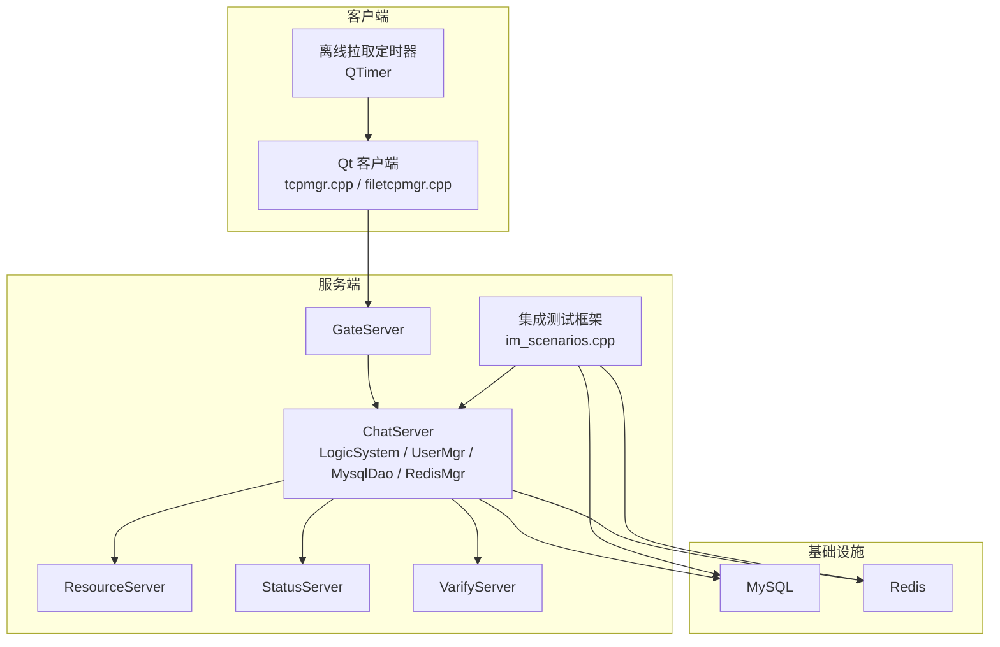

**图表来源**
- [CMakeLists.txt:1-34](file://CMakeLists.txt#L1-L34)
- [chat.proto:1-105](file://proto/chat_service/chat.proto#L1-L105)
- [im_integration_tests.cpp:30-40](file://tests/im_integration_tests.cpp#L30-L40)

**章节来源**
- [CMakeLists.txt:1-34](file://CMakeLists.txt#L1-L34)
- [README.md:1-112](file://README.md#L1-L112)

## 核心组件
- 会话与路由
  - UserMgr：维护 uid → Session 映射，用于在线推送与踢人。
  - CSession：封装 Asio 读写队列与异步发送，提供 Send/SendAndClose 等能力。
- 业务逻辑与分片
  - LogicSystem：按 uid/sender_uid 分片的 Worker 池，处理登录、好友、聊天、心跳、历史加载、离线拉取与 ACK。
- 数据访问
  - MysqlDao：连接池、幂等 UPSERT、分页查询、待投递消息拉取、批量 ACK。
  - RedisMgr：连接池、String/List/ZSET/Hash、分布式锁、过期设置。
- 协议与跨服
  - chat.proto：定义 NotifyTextChatMsg、NotifyAuthFriend、NotifyKickUser 等 RPC。
- 客户端
  - tcpmgr.cpp / filetcpmgr.cpp：粘包处理、消息分发、错误处理、持久化重试、离线拉取。
- **新增** 集成测试框架
  - im_scenarios.cpp：实现各种测试场景，包括离线消息、丢失确认、字节限制、跨服务器通信等。
  - im_mysql.cpp：MySQL 查询封装，支持测试验证和数据清理。

**更新** 新增了完整的集成测试框架，包括多种测试场景和验证工具，确保系统的可靠性和稳定性。

**章节来源**
- [UserMgr.h:1-55](file://server/ChatServer/include/UserMgr.h#L1-L55)
- [UserMgr.cpp:1-50](file://server/ChatServer/src/UserMgr.cpp#L1-L50)
- [CSession.cpp（ChatServer）:51-97](file://server/ChatServer/src/CSession.cpp#L51-L97)
- [LogicSystem.h:1-262](file://server/ChatServer/include/LogicSystem.h#L1-L262)
- [MysqlDao.h:1-526](file://server/ChatServer/include/MysqlDao.h#L1-L526)
- [RedisMgr.h:1-390](file://server/ChatServer/include/RedisMgr.h#L1-L390)
- [chat.proto:1-105](file://proto/chat_service/chat.proto#L1-L105)
- [tcpmgr.cpp:31-61](file://client/llfcchat/src/tcpmgr.cpp#L31-L61)
- [filetcpmgr.cpp:37-77](file://client/llfcchat/src/filetcpmgr.cpp#L37-L77)
- [im_scenarios.cpp:1-50](file://tests/integration/im_scenarios.cpp#L1-L50)

## 架构总览
离线消息投递的关键路径：
- 发送端：客户端组装文本消息，经 TCP 发送至 ChatServer；ChatServer 幂等写入 MySQL，返回成功/冲突/失败。
- 在线接收：若接收者在线，直接通过其 Session 推送通知；否则进入离线队列。
- 离线拉取：客户端上线后调用 PullOfflineMsg，服务器合并 Redis ZSET 游标与 MySQL 待投递消息，返回 envelope 列表。
- 投递确认：客户端收到消息后回传 ACK，服务器更新 delivery_status=1，并清理 Redis 中的离线标记。

**更新** 新增了完整的集成测试框架，支持多种测试场景的自动化验证，包括离线消息处理、丢失确认恢复、拉取字节限制、跨服务器通信和图像离线消息等。

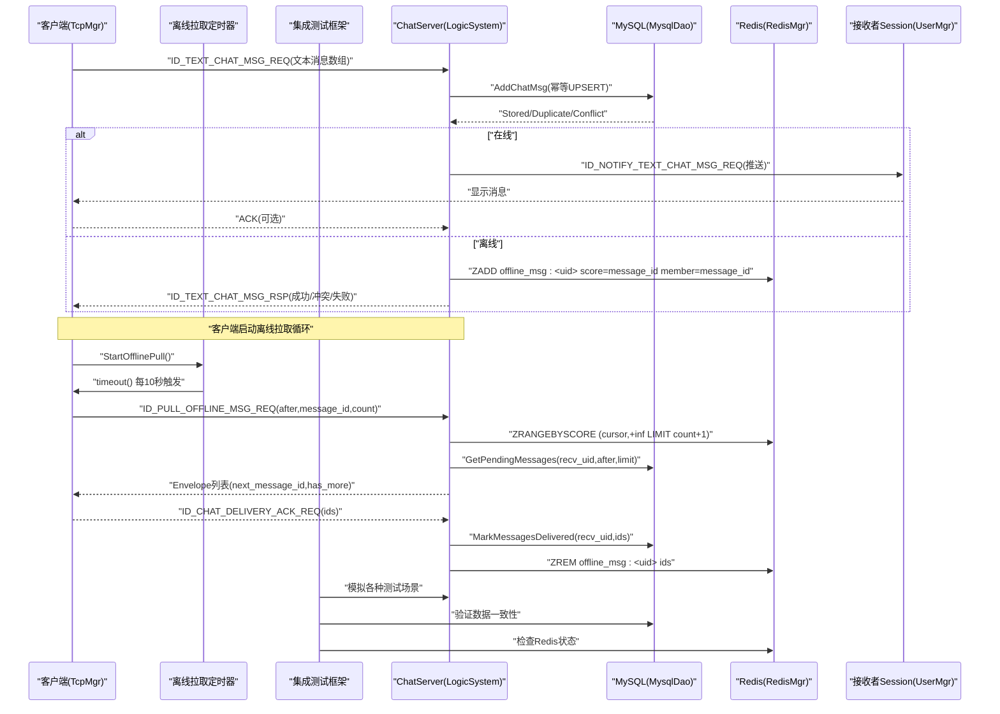

**图表来源**
- [LogicSystem.cpp:568-679](file://server/ChatServer/src/LogicSystem.cpp#L568-L679)
- [LogicSystem.cpp:1087-1169](file://server/ChatServer/src/LogicSystem.cpp#L1087-L1169)
- [LogicSystem.cpp:1171-1349](file://server/ChatServer/src/LogicSystem.cpp#L1171-L1349)
- [MysqlDao.cpp:1020-1074](file://server/ChatServer/src/MysqlDao.cpp#L1020-L1074)
- [MysqlDao.cpp:1158-1210](file://server/ChatServer/src/MysqlDao.cpp#L1158-L1210)
- [MysqlDao.cpp:1268-1302](file://server/ChatServer/src/MysqlDao.cpp#L1268-L1302)
- [RedisMgr.h:300-390](file://server/ChatServer/include/RedisMgr.h#L300-L390)
- [chat.proto:1-105](file://proto/chat_service/chat.proto#L1-L105)
- [tcpmgr.cpp:1478-1507](file://client/llfcchat/src/tcpmgr.cpp#L1478-L1507)
- [im_scenarios.cpp:851-1010](file://tests/integration/im_scenarios.cpp#L851-L1010)

## 详细组件分析

### 消息持久化与幂等（MysqlDao）
- 幂等 UPSERT：基于 (sender_id, unique_id) 唯一键，重复插入返回已有 message_id；内容不一致则标记 Conflict。
- 批量事务：同一批内任一冲突或 SQL 错误会回滚新行，上层据此决定重传策略。
- 待投递拉取：按 recv_id 与 delivery_status=0 过滤，排除未上传完成的图片，按 message_id 升序返回。
- 批量 ACK：带 recv_id 防越权，重复 ACK 幂等。

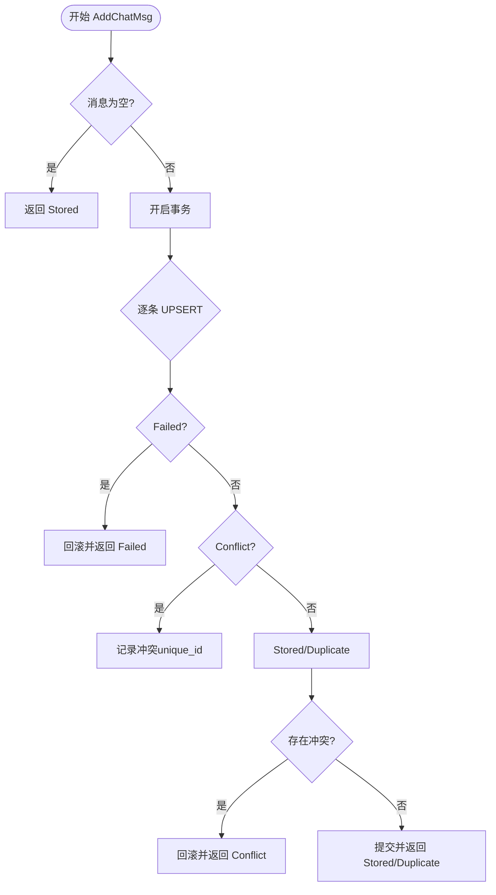

**图表来源**
- [MysqlDao.cpp:1020-1074](file://server/ChatServer/src/MysqlDao.cpp#L1020-L1074)

**章节来源**
- [MysqlDao.h:442-526](file://server/ChatServer/include/MysqlDao.h#L442-526)
- [MysqlDao.cpp:943-1018](file://server/ChatServer/src/MysqlDao.cpp#L943-1018)
- [MysqlDao.cpp:1158-1210](file://server/ChatServer/src/MysqlDao.cpp#L1158-L1210)
- [MysqlDao.cpp:1268-1302](file://server/ChatServer/src/MysqlDao.cpp#L1268-L1302)

### 投递确认处理（LogicSystem::DealDeliveryAck）
- 严格参数校验：验证 JSON 格式、uid 合法性、message_ids 数组有效性。
- 权限验证：确保请求 uid 与当前会话 uid 一致，防止越权操作。
- 数据库更新：批量更新消息的 delivery_status 为已投递。
- Redis 清理：从离线队列中移除已确认的消息 ID。
- 幂等处理：重复 ACK 请求仍能成功响应。

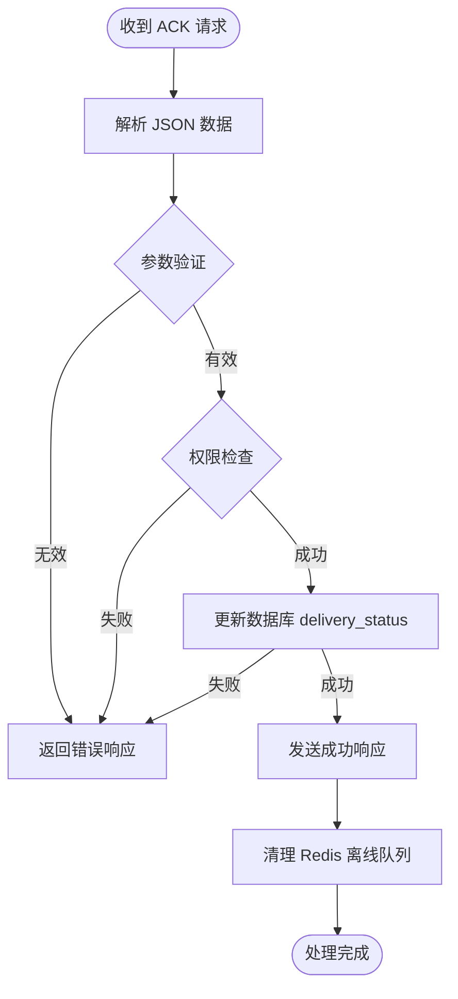

**图表来源**
- [LogicSystem.cpp:1087-1169](file://server/ChatServer/src/LogicSystem.cpp#L1087-L1169)

**章节来源**
- [LogicSystem.cpp:1087-1169](file://server/ChatServer/src/LogicSystem.cpp#L1087-L1169)
- [const.h:106-107](file://server/ChatServer/include/const.h#L106-L107)

### 离线消息拉取处理器（LogicSystem::PullOfflineMsg）
- 游标分页：使用 after_message_id 作为游标，避免全表扫描。
- Redis 优先：先从 Redis ZSET 获取候选消息 ID，提高查询效率。
- 数据一致性：结合 MySQL 查询确保数据的真实性和完整性。
- 智能过滤：自动过滤不可投递的消息（如未上传完成的图片）。
- **字节限制**：支持 PullMaxBytes 配置，控制单次响应大小。
- **超大消息处理**：当首条消息就超过限制时，返回显式错误而非推进游标，避免无限重试循环。

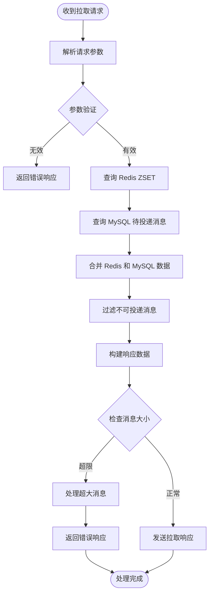

**图表来源**
- [LogicSystem.cpp:1171-1349](file://server/ChatServer/src/LogicSystem.cpp#L1171-L1349)

**章节来源**
- [LogicSystem.cpp:1171-1349](file://server/ChatServer/src/LogicSystem.cpp#L1171-L1349)
- [const.h:108-109](file://server/ChatServer/include/const.h#L108-L109)

### 客户端离线消息拉取系统（TcpMgr）
**新增** 完整的客户端离线消息拉取系统，支持自动启动、定时轮询、批量拉取和连续处理。

- **定时器驱动**：使用 QTimer 实现定时轮询，默认间隔10秒。
- **自动启动**：在聊天对话框加载完成后自动启动离线拉取循环。
- **批量拉取**：支持配置化的批次大小（默认100条）。
- **连续处理**：当 has_more=true 时立即拉取下一页，直到全部拉取完成。
- **增量同步**：使用 next_message_id 作为游标，避免重复拉取。
- **连接管理**：断线时自动停止定时器，重连后重新启动。
- **配置管理**：支持 OfflinePullIntervalMs 和 OfflinePullBatch 配置项。

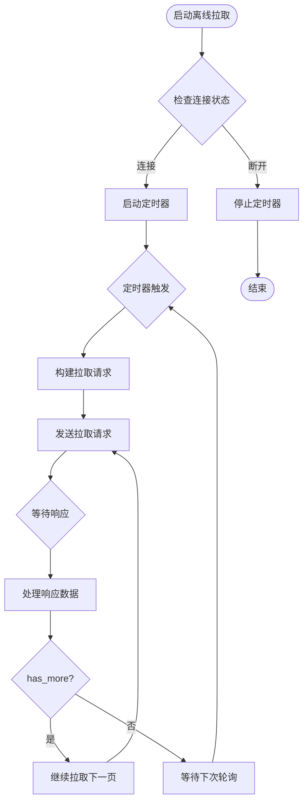

**图表来源**
- [tcpmgr.cpp:1478-1507](file://client/llfcchat/src/tcpmgr.cpp#L1478-L1507)
- [tcpmgr.cpp:1056-1096](file://client/llfcchat/src/tcpmgr.cpp#L1056-L1096)

**章节来源**
- [tcpmgr.cpp:1478-1507](file://client/llfcchat/src/tcpmgr.cpp#L1478-L1507)
- [tcpmgr.cpp:1056-1096](file://client/llfcchat/src/tcpmgr.cpp#L1056-L1096)
- [tcpmgr.h:89-92](file://client/llfcchat/include/tcpmgr.h#L89-L92)
- [config.ini:5-11](file://client/llfcchat/config/config.ini#L5-L11)

### 客户端离线拉取响应处理
**新增** 完整的离线消息拉取响应处理逻辑，支持分页拉取和连续处理。

- **响应解析**：解析 next_message_id、has_more 和 messages 数组。
- **消息分发**：每条消息通过 dispatchIncomingMessage 统一处理。
- **连续拉取**：当 has_more=true 时立即拉取下一页，保持 FIFO 顺序。
- **错误处理**：非成功错误时跳过本次拉取，等待下次轮询。
- **状态管理**：维护 _delivery_uid 确保只拉取当前用户的消息。

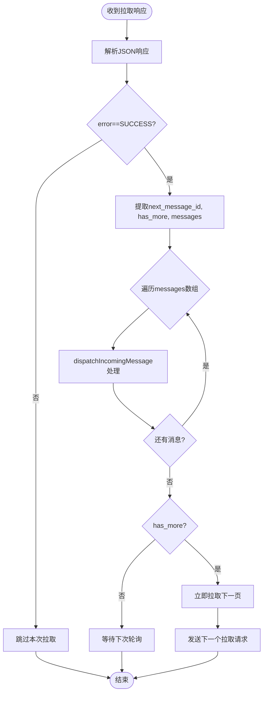

**图表来源**
- [tcpmgr.cpp:1056-1096](file://client/llfcchat/src/tcpmgr.cpp#L1056-L1096)

**章节来源**
- [tcpmgr.cpp:1056-1096](file://client/llfcchat/src/tcpmgr.cpp#L1056-L1096)

### 客户端持久化重试机制（TcpMgr）
- **持久化存储**：将待重传请求序列化保存到本地配置文件，支持进程重启后恢复。
- **退避策略**：采用指数退避算法，初始延迟可配置，最大延迟有限制。
- **定时器驱动**：使用250ms定时器扫描待重传请求，按next_send_epoch_ms判断是否需要重发。
- **UID隔离**：不同用户的pending请求完全隔离，切换用户时自动清理旧数据。
- **智能恢复**：登录成功后自动恢复该用户的pending请求，立即重发所有待处理消息。

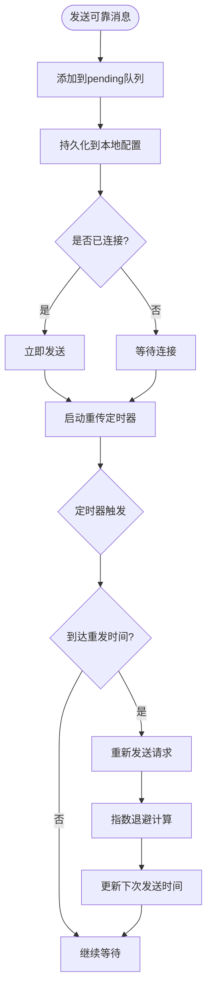

**图表来源**
- [tcpmgr.cpp:1336-1365](file://client/llfcchat/src/tcpmgr.cpp#L1336-L1365)

**章节来源**
- [tcpmgr.cpp:1336-1365](file://client/llfcchat/src/tcpmgr.cpp#L1336-L1365)
- [tcpmgr.h:24-84](file://client/llfcchat/include/tcpmgr.h#L24-L84)

### 服务器端跨服务可靠交付（ChatGrpcClient）
- **有界重试**：最多尝试RpcMaxAttempts次（默认3次），每次创建新的ClientContext。
- **超时控制**：每次调用设置deadline为RpcDeadlineMs毫秒（默认3000ms）。
- **智能重试**：仅对UNAVAILABLE/DEADLINE_EXCEEDED/RESOURCE_EXHAUSTED或对端SERVER_BUSY重试。
- **退避策略**：重试间隔为RpcBackoffMs、2×RpcBackoffMs（默认100ms、200ms）。
- **立即停止**：对RECIPIENT_OFFLINE/未知server/参数类错误立即停止重试。
- **结果封装**：返回NotifyResult结构，包含grpc状态码和对端应用层error。

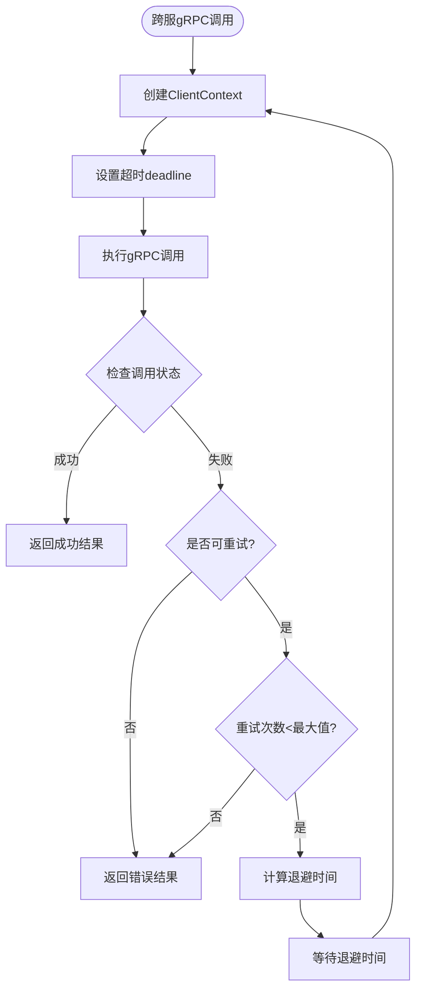

**图表来源**
- [ChatGrpcClient.h:33-119](file://server/ChatServer/include/ChatGrpcClient.h#L33-L119)

**章节来源**
- [ChatGrpcClient.h:33-119](file://server/ChatServer/include/ChatGrpcClient.h#L33-L119)
- [ChatServerGrpcClient.h:21-40](file://server/ResourceServer/include/ChatServerGrpcClient.h#L21-L40)

### 在线/离线投递决策（LogicSystem）
- 文本消息处理：构造 ChatMessage 列表，调用 AddChatMsg；根据结果返回客户端。
- 在线判断：通过 Redis 中 USERIPPREFIX 获取接收者所在服务器名；若为本机则 PostToUser 投递到对应 uid 分片，查 UserMgr 获取 Session 推送。
- 跨服转发：若非本机，通过 gRPC NotifyTextChatMsg 转发至目标 ChatServer。
- 离线落库：若接收者不在线，将 message_id 加入 Redis ZSET（offline_msg:<uid>），供后续拉取。

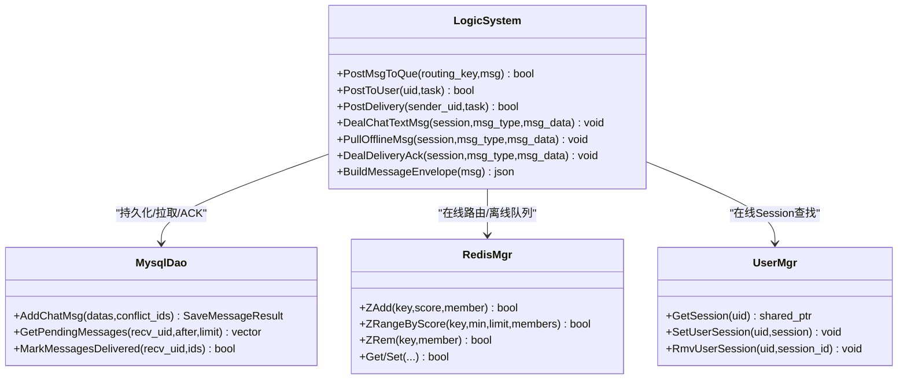

**图表来源**
- [LogicSystem.h:1-262](file://server/ChatServer/include/LogicSystem.h#L1-L262)
- [UserMgr.h:1-55](file://server/ChatServer/include/UserMgr.h#L1-L55)
- [MysqlDao.h:442-526](file://server/ChatServer/include/MysqlDao.h#L442-526)
- [RedisMgr.h:300-390](file://server/ChatServer/include/RedisMgr.h#L300-L390)

**章节来源**
- [LogicSystem.cpp:568-679](file://server/ChatServer/src/LogicSystem.cpp#L568-679)
- [LogicSystem.cpp:128-167](file://server/ChatServer/src/LogicSystem.cpp#L128-L167)

### 客户端消息收发与粘包处理（tcpmgr/filetcpmgr）
- 粘包处理：读取固定长度的消息头（message_id + length），再按长度读取消息体，循环处理。
- 错误处理：区分连接拒绝、远端关闭等错误类型，触发相应回调。
- 消息分发：根据 ReqId 分发到不同处理器，如文本通知、图片通知等。

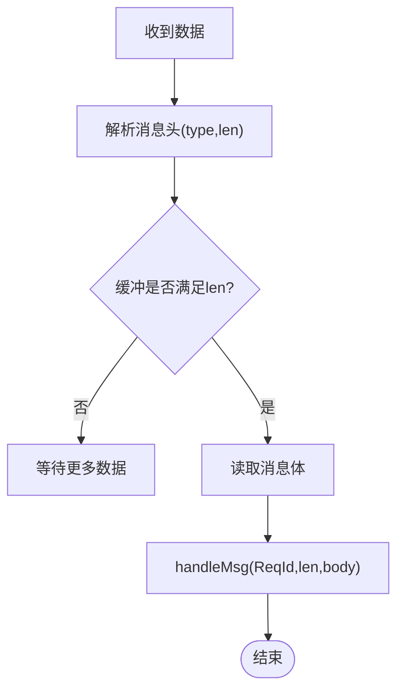

**图表来源**
- [tcpmgr.cpp:31-61](file://client/llfcchat/src/tcpmgr.cpp#L31-L61)
- [filetcpmgr.cpp:37-77](file://client/llfcchat/src/filetcpmgr.cpp#L37-L77)

**章节来源**
- [tcpmgr.cpp:31-61](file://client/llfcchat/src/tcpmgr.cpp#L31-L61)
- [filetcpmgr.cpp:37-77](file://client/llfcchat/src/filetcpmgr.cpp#L37-L77)

### 数据库表结构与字段说明（chat_message）
- 关键字段：message_id、thread_id、sender_id、recv_id、content、created_at、updated_at、status、msg_type、unique_id、content_size、delivery_status。
- 索引：主键 message_id，唯一索引 (sender_id, unique_id)。
- delivery_status：0=待投递，1=已投递（ACK）。

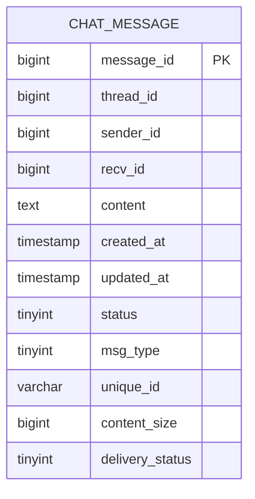

**图表来源**
- [llfc2.sql:24-38](file://sql备份/llfc2.sql#L24-L38)

**章节来源**
- [llfc2.sql:24-38](file://sql备份/llfc2.sql#L24-L38)

### 集成测试框架（新增）
**新增** 完整的集成测试框架，支持多种测试场景的自动化验证。

- **测试场景管理**：支持多种测试场景，包括离线消息处理、丢失确认恢复、拉取字节限制、跨服务器通信和图像离线消息。
- **MySQL查询封装**：提供丰富的查询方法，支持按唯一ID查询、按接收者ID和投递状态查询等功能。
- **Redis操作封装**：支持ZSET操作、键值操作等，便于测试验证。
- **自动化清理**：测试结束后自动清理测试数据，确保环境干净。
- **断言验证**：提供丰富的断言工具，验证系统行为的正确性。

**图表来源**
- [im_integration_tests.cpp:44-89](file://tests/im_integration_tests.cpp#L44-L89)
- [im_scenarios.cpp:851-1010](file://tests/integration/im_scenarios.cpp#L851-L1010)

**章节来源**
- [im_integration_tests.cpp:1-90](file://tests/im_integration_tests.cpp#L1-L90)
- [im_scenarios.cpp:1-1592](file://tests/integration/im_scenarios.cpp#L1-L1592)
- [im_mysql.cpp:1-196](file://tests/integration/im_mysql.cpp#L1-L196)
- [im_mysql.h:1-74](file://tests/integration/im_mysql.h#L1-L74)

## 依赖关系分析
- LogicSystem 依赖：
  - MysqlDao：消息持久化、拉取、ACK。
  - RedisMgr：在线路由、离线队列、分布式锁。
  - UserMgr：在线 Session 查找。
  - ChatGrpcClient：跨服通知（NotifyTextChatMsg 等）。
- 客户端依赖：
  - Qt 网络模块：QTcpSocket、QDataStream。
  - Qt 定时器：QTimer 用于离线拉取轮询。
  - JSON 解析：QJsonDocument/QJsonObject。
- **新增** 测试框架依赖：
  - Boost.Asio：网络通信和异步操作。
  - MySQL Connector/C++：数据库连接和操作。
  - Redis客户端：Redis操作和验证。

**更新** 新增了集成测试框架的依赖关系，包括Boost.Asio、MySQL Connector/C++和Redis客户端。

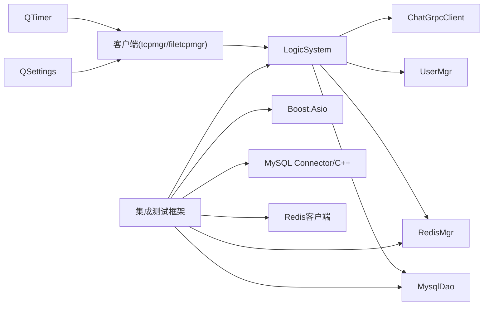

**图表来源**
- [LogicSystem.cpp:1-16](file://server/ChatServer/src/LogicSystem.cpp#L1-L16)
- [MysqlDao.h:1-526](file://server/ChatServer/include/MysqlDao.h#L1-L526)
- [RedisMgr.h:1-390](file://server/ChatServer/include/RedisMgr.h#L1-L390)
- [UserMgr.h:1-55](file://server/ChatServer/include/UserMgr.h#L1-L55)
- [chat.proto:1-105](file://proto/chat_service/chat.proto#L1-L105)
- [tcpmgr.cpp:160-163](file://client/llfcchat/src/tcpmgr.cpp#L160-L163)
- [im_scenarios.cpp:36-44](file://tests/integration/im_scenarios.cpp#L36-L44)

**章节来源**
- [LogicSystem.cpp:1-16](file://server/ChatServer/src/LogicSystem.cpp#L1-L16)
- [MysqlDao.h:1-526](file://server/ChatServer/include/MysqlDao.h#L1-L526)
- [RedisMgr.h:1-390](file://server/ChatServer/include/RedisMgr.h#L1-L390)
- [UserMgr.h:1-55](file://server/ChatServer/include/UserMgr.h#L1-L55)
- [chat.proto:1-105](file://proto/chat_service/chat.proto#L1-L105)

## 性能考量
- 连接池与保活
  - MySQL：连接池定期执行 SELECT 1 保活，失败自动重连。
  - Redis：连接池 PING 保活，失败重建。
- 并发与分片
  - LogicSystem 按 uid/sender_uid 分片 Worker，避免热点竞争，提升吞吐。
- 网络 I/O
  - Asio 异步写队列，限制最大队列长度，防止内存膨胀。
- 数据库优化
  - 幂等 UPSERT 减少重复写入与冲突处理开销。
  - 分页查询使用 LIMIT N+1 判断 has_more，减少往返。
- **新增优化**
  - Redis ZSET 缓存离线消息，减少数据库压力。
  - 游标分页避免全表扫描，提升拉取效率。
  - 批量 ACK 操作减少数据库交互次数。
  - **客户端离线拉取优化**：定时器轮询避免频繁请求，批量拉取减少网络开销。
  - **连续拉取机制**：has_more=true 时立即拉取下一页，提升同步速度。
  - **配置化管理**：支持调整拉取间隔和批次大小，适应不同网络环境。
  - **测试框架优化**：高效的测试数据管理和清理机制。

[本节为通用指导，无需特定文件引用]

## 故障排查指南
- 客户端粘包/断包
  - 检查消息头解析与缓冲长度判断逻辑。
  - 参考 tcpmgr.cpp 的粘包处理与错误分支。
- 消息丢失/重复
  - 核对 unique_id 幂等性与 delivery_status 状态。
  - 检查 Redis ZSET 是否被正确清理。
- 在线推送失败
  - 确认 USERIPPREFIX 是否正确设置，UserMgr 是否能找到 Session。
- 跨服通知失败
  - 检查 gRPC 调用与目标服务器名称解析。
- **新增问题排查**
  - 投递确认失败：检查 ACK 请求的 uid 验证和数据库更新状态。
  - 离线拉取异常：验证游标参数和 Redis ZSET 数据结构。
  - 消息堆积：监控 Redis 离线队列长度和数据库待投递消息数量。
  - **离线拉取定时器问题**：检查 QTimer 是否正常启动和触发。
  - **拉取配置错误**：验证 config.ini 中的 Delivery 配置项。
  - **连接状态问题**：确认网络连接状态和断线重连逻辑。
  - **响应处理异常**：检查 has_more 标志和 next_message_id 的处理逻辑。
  - **测试环境问题**：检查测试服务启动状态和端口占用情况。
  - **数据清理问题**：验证测试数据清理逻辑是否正确执行。

**章节来源**
- [tcpmgr.cpp:31-61](file://client/llfcchat/src/tcpmgr.cpp#L31-L61)
- [filetcpmgr.cpp:37-77](file://client/llfcchat/src/filetcpmgr.cpp#L37-L77)
- [LogicSystem.cpp:568-679](file://server/ChatServer/src/LogicSystem.cpp#L568-679)
- [LogicSystem.cpp:1087-1169](file://server/ChatServer/src/LogicSystem.cpp#L1087-L1169)
- [LogicSystem.cpp:1171-1349](file://server/ChatServer/src/LogicSystem.cpp#L1171-L1349)
- [MysqlDao.cpp:1268-1302](file://server/ChatServer/src/MysqlDao.cpp#L1268-L1302)
- [tcpmgr.cpp:1478-1507](file://client/llfcchat/src/tcpmgr.cpp#L1478-L1507)
- [im_scenarios.cpp:72-83](file://tests/integration/im_scenarios.cpp#L72-L83)

## 结论
该离线消息投递系统通过"MySQL 持久化 + Redis 离线队列 + gRPC 跨服通知 + 客户端 ACK"的组合，实现了高可靠的消息投递。**更新** 新增的完整集成测试框架进一步提升了系统的可靠性和可维护性。测试框架涵盖了离线消息处理、丢失确认恢复、拉取字节限制、跨服务器通信和图像离线消息等多种场景，确保系统在各种异常情况下的稳定运行。

**重大增强** 系统现在具备了完善的测试覆盖能力，包括端到端的集成测试和单元测试。新增的测试框架不仅验证了功能正确性，还确保了性能稳定性和数据一致性。建议在后续迭代中继续完善监控与告警，增强异常自愈能力，并扩展更多边界情况的测试场景。

[本节为总结，无需特定文件引用]

## 附录
- 客户端消息状态枚举与通知处理示例可参考开发文档。
- 构建与依赖配置见根 CMakeLists.txt 与 vcpkg.json。
- **新增协议说明**
  - ID_CHAT_DELIVERY_ACK_REQ/ID_CHAT_DELIVERY_ACK_RSP：投递确认请求/响应
  - ID_PULL_OFFLINE_MSG_REQ/ID_PULL_OFFLINE_MSG_RSP：离线消息拉取请求/响应
- **新增配置项**
  - OfflinePullBatch：离线消息拉取批次大小（默认100）
  - OfflinePullIntervalMs：离线拉取间隔时间（默认10000ms）
  - **Delivery配置**：
    - RequestRetryInitialMs：客户端请求重试初始退避时间（默认2000ms）
    - RequestRetryMaxMs：客户端请求重试最大退避时间（默认30000ms）
    - AckRetryInitialMs：ACK重试初始退避时间（默认2000ms）
    - RpcDeadlineMs：跨服务gRPC调用超时时间（默认3000ms）
    - RpcMaxAttempts：跨服务gRPC调用最大重试次数（默认3次）
    - RpcBackoffMs：跨服务gRPC调用重试基础退避时间（默认100ms）
    - PullMaxBytes：拉取响应最大字节数（默认30000）
- **新增测试场景**
  - offline：离线消息处理场景
  - lost-ack：丢失确认恢复场景
  - pull-bytes：拉取字节限制场景
  - cross-server：跨服务器通信场景
  - image-offline：图像离线消息场景

**章节来源**
- [day37-聊天信息存储方案.md:3193-3246](file://开发文档/day37-聊天信息存储方案.md#L3193-L3246)
- [CMakeLists.txt:1-34](file://CMakeLists.txt#L1-L34)
- [const.h:106-109](file://server/ChatServer/include/const.h#L106-L109)
- [tcpmgr.cpp:1262-1298](file://client/llfcchat/src/tcpmgr.cpp#L1262-L1298)
- [config.ini:5-11](file://client/llfcchat/config/config.ini#L5-L11)
- [ChatGrpcClient.h:89-95](file://server/ChatServer/include/ChatGrpcClient.h#L89-L95)
- [im_integration_tests.cpp:30-40](file://tests/im_integration_tests.cpp#L30-L40)
- [im_scenarios.cpp:851-1592](file://tests/integration/im_scenarios.cpp#L851-L1592)