# 离线消息投递系统

<cite>
**本文引用的文件**   
- [README.md](file://README.md)
- [CMakeLists.txt](file://CMakeLists.txt)
- [chat.proto](file://proto/chat_service/chat.proto)
- [UserMgr.h](file://server/ChatServer/include/UserMgr.h)
- [UserMgr.cpp](file://server/ChatServer/src/UserMgr.cpp)
- [MysqlDao.h](file://server/ChatServer/include/MysqlDao.h)
- [MysqlDao.cpp](file://server/ChatServer/src/MysqlDao.cpp)
- [RedisMgr.h](file://server/ChatServer/include/RedisMgr.h)
- [LogicSystem.h](file://server/ChatServer/include/LogicSystem.h)
- [LogicSystem.cpp](file://server/ChatServer/src/LogicSystem.cpp)
- [CSession.cpp（ChatServer）](file://server/ChatServer/src/CSession.cpp)
- [CSession.cpp（ResourceServer）](file://server/ResourceServer/src/CSession.cpp)
- [tcpmgr.cpp（客户端）](file://client/llfcchat/src/tcpmgr.cpp)
- [tcpmgr.h（客户端）](file://client/llfcchat/include/tcpmgr.h)
- [filetcpmgr.cpp（客户端）](file://client/llfcchat/src/filetcpmgr.cpp)
- [chatdialog.cpp（客户端）](file://client/llfcchat/src/chatdialog.cpp)
- [config.ini（客户端配置）](file://client/llfcchat/config/config.ini)
- [chatsyncmanager.cpp](file://client/llfcchat/src/chatsyncmanager.cpp)
- [localchatdb.h](file://client/llfcchat/include/localchatdb.h)
- [localchatstore.h](file://client/llfcchat/include/localchatstore.h)
- [20260813_user_message_sync.sql](file://sql备份/20260813_user_message_sync.sql)
- [im_integration_tests.cpp](file://tests/im_integration_tests.cpp)
- [im_scenarios.cpp](file://tests/integration/im_scenarios.cpp)
- [im_mysql.cpp](file://tests/integration/im_mysql.cpp)
- [im_mysql.h](file://tests/integration/im_mysql.h)
</cite>

## 更新摘要
**变更内容**   
- **架构重大迁移**：从基于 Redis ZSET 的离线队列方案完全迁移到 MySQL 权威存储 + SQLite 客户端持久化的新架构
- **移除旧机制**：移除了 GetPendingMessages 方法和 Redis offline_msg 队列，消除了 Redis 依赖
- **新增增量同步**：实现了基于 checkpoint 的增量同步机制，通过 user_message_sync 表提供严格的顺序保证
- **客户端增强**：新增 LocalChatStore 和 ChatSyncManager，实现 SQLite 本地持久化和智能同步状态管理
- **测试覆盖**：完善了集成测试框架，支持多种同步场景验证，包括分页、字节限制、跨服务器通信等

## 目录
1. [引言](#引言)
2. [项目结构](#项目结构)
3. [核心组件](#核心组件)
4. [架构总览](#架构总览)
5. [详细组件分析](#详细组件分析)
6. [依赖关系分析](#依赖关系分析)
7. [性能考量](#性能考量)
8. [故障排查指南](#故障排查指南)
9. [结论](#结论)
10. [附录](#附录)

## 引言
本文件围绕"离线消息投递系统"展开，聚焦于 ChatServer 在用户离线时如何持久化、拉取与投递消息，以及客户端的接收与确认流程。系统已完成重大架构升级，从原来的 Redis ZSET 方案迁移到基于 MySQL 权威存储 + SQLite 客户端持久化的新架构，采用 checkpoint 驱动的增量同步机制，确保消息的顺序性和一致性。

**重大更新** 系统现在完全摆脱了对 Redis 的依赖，通过 MySQL 的 user_message_sync 表提供严格的同步序号保证，结合客户端的 SQLite 持久化，实现了更加可靠和可恢复的消息同步机制。

## 项目结构
- 根构建配置使用 CMake 管理多子项目（server/client），并集成 vcpkg 与 gRPC 代码生成。
- 服务端包含多个独立服务：ChatServer（聊天与消息）、GateServer（网关）、ResourceServer（资源）、StatusServer（状态）、VarifyServer（验证）。
- 客户端为 Qt 应用，负责 UI、TCP 通信、消息解析与展示，新增 SQLite 本地存储能力。
- 协议定义位于 proto 目录，使用 gRPC 进行跨服务通信。
- **新增** 完整的集成测试框架，包含多种测试场景和验证工具。

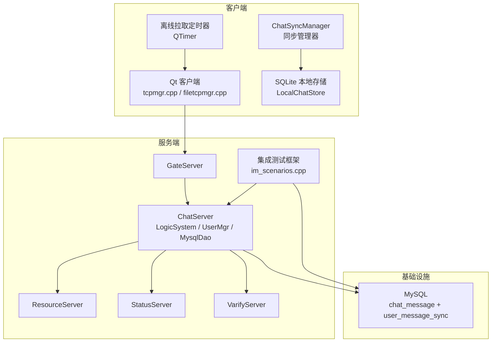

**图表来源**
- [CMakeLists.txt:1-34](file://CMakeLists.txt#L1-L34)
- [chat.proto:1-105](file://proto/chat_service/chat.proto#L1-L105)
- [im_integration_tests.cpp:30-40](file://tests/im_integration_tests.cpp#L30-L40)

**章节来源**
- [CMakeLists.txt:1-34](file://CMakeLists.txt#L1-L34)
- [README.md:1-112](file://README.md#L1-L112)

## 核心组件
- 会话与路由
  - UserMgr：维护 uid → Session 映射，用于在线推送与踢人。
  - CSession：封装 Asio 读写队列与异步发送，提供 Send/SendAndClose 等能力。
- 业务逻辑与分片
  - LogicSystem：按 uid/sender_uid 分片的 Worker 池，处理登录、好友、聊天、心跳、历史加载、增量同步与 ACK。
- 数据访问
  - MysqlDao：连接池、幂等 UPSERT、分页查询、增量同步拉取、批量 ACK。
  - **新增** LocalChatDb：SQLite 本地数据库操作，支持消息持久化、同步状态管理、outbox 重试。
  - **新增** LocalChatStore：SQLite 操作的线程安全封装，提供异步 API。
- 协议与跨服
  - chat.proto：定义 NotifyTextChatMsg、NotifyAuthFriend、NotifyKickUser 等 RPC。
- 客户端
  - tcpmgr.cpp / filetcpmgr.cpp：粘包处理、消息分发、错误处理、持久化重试、增量同步。
  - **新增** ChatSyncManager：增量同步管理器，协调 bootstrap 和增量拉取流程。
- **新增** 集成测试框架
  - im_scenarios.cpp：实现各种测试场景，包括离线消息、丢失确认、字节限制、跨服务器通信等。
  - im_mysql.cpp：MySQL 查询封装，支持测试验证和数据清理。

**重大更新** 新增了完整的增量同步机制，包括服务端 MySQL 同步表和客户端 SQLite 持久化，完全替代了原有的 Redis ZSET 方案。

**章节来源**
- [UserMgr.h:1-55](file://server/ChatServer/include/UserMgr.h#L1-L55)
- [UserMgr.cpp:1-50](file://server/ChatServer/src/UserMgr.cpp#L1-L50)
- [CSession.cpp（ChatServer）:51-97](file://server/ChatServer/src/CSession.cpp#L51-L97)
- [LogicSystem.h:1-262](file://server/ChatServer/include/LogicSystem.h#L1-L262)
- [MysqlDao.h:1-526](file://server/ChatServer/include/MysqlDao.h#L1-L526)
- [localchatdb.h:1-94](file://client/llfcchat/include/localchatdb.h#L1-L94)
- [localchatstore.h:1-160](file://client/llfcchat/include/localchatstore.h#L1-L160)
- [chatsyncmanager.cpp:1-270](file://client/llfcchat/src/chatsyncmanager.cpp#L1-L270)
- [chat.proto:1-105](file://proto/chat_service/chat.proto#L1-L105)
- [tcpmgr.cpp:31-61](file://client/llfcchat/src/tcpmgr.cpp#L31-L61)
- [filetcpmgr.cpp:37-77](file://client/llfcchat/src/filetcpmgr.cpp#L37-L77)
- [im_scenarios.cpp:1-50](file://tests/integration/im_scenarios.cpp#L1-L50)

## 架构总览
新的增量同步关键路径：
- 发送端：客户端组装文本消息，经 TCP 发送至 ChatServer；ChatServer 幂等写入 MySQL，同时在 user_message_sync 表中记录同步行，返回成功/冲突/失败。
- 在线接收：若接收者在线，直接通过其 Session 推送通知；否则等待客户端同步。
- 增量同步：客户端启动后先执行 bootstrap 获取 checkpoint，然后按 after_sync_seq 增量拉取消息。
- 本地持久化：消息通过 applySyncPage 原子性地插入 SQLite 并推进 sync_state 游标。
- 投递确认：客户端收到消息后回传 ACK，服务器更新 delivery_status=1。

**重大更新** 完全移除了 Redis ZSET 离线队列，改用 MySQL user_message_sync 表作为权威同步源，提供严格的顺序保证和 checkpoint 机制。

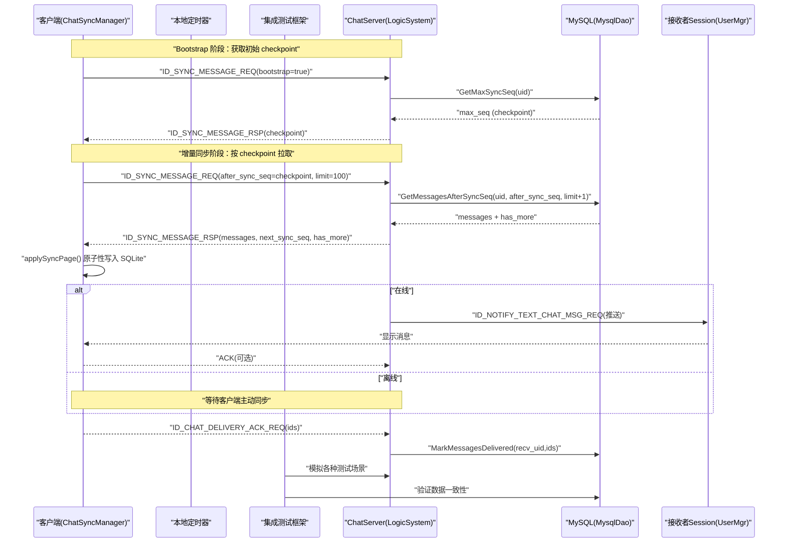

**图表来源**
- [LogicSystem.cpp:1400-1487](file://server/ChatServer/src/LogicSystem.cpp#L1400-L1487)
- [MysqlDao.cpp:1113-1154](file://server/ChatServer/src/MysqlDao.cpp#L1113-L1154)
- [MysqlDao.cpp:1173-1202](file://server/ChatServer/src/MysqlDao.cpp#L1173-L1202)
- [MysqlDao.cpp:1310-1347](file://server/ChatServer/src/MysqlDao.cpp#L1310-L1347)
- [chatsyncmanager.cpp:78-135](file://client/llfcchat/src/chatsyncmanager.cpp#L78-L135)
- [im_scenarios.cpp:1143-1183](file://tests/integration/im_scenarios.cpp#L1143-L1183)

## 详细组件分析

### 增量同步核心（MysqlDao）
- **同步表设计**：user_message_sync 表提供每用户的严格递增 sync_seq，确保消息顺序性。
- **幂等 UPSERT**：基于 (sender_id, unique_id) 唯一键，重复插入返回已有 message_id；内容不一致则标记 Conflict。
- **增量查询**：GetMessagesAfterSyncSeq 按 sync_seq 严格升序查询，支持分页和 has_more 判断。
- **Checkpoint 查询**：GetMaxSyncSeq 获取用户当前最大同步序号，用于 bootstrap 初始化。
- **批量 ACK**：带 recv_id 防越权，重复 ACK 幂等。

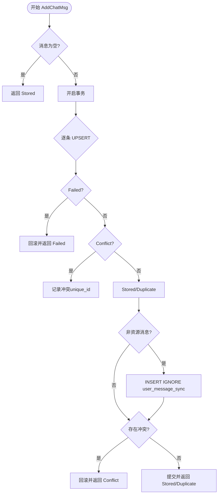

**图表来源**
- [MysqlDao.cpp:1083-1111](file://server/ChatServer/src/MysqlDao.cpp#L1083-L1111)

**章节来源**
- [MysqlDao.h:200-271](file://server/ChatServer/include/MysqlDao.h#L200-L271)
- [MysqlDao.cpp:1083-1111](file://server/ChatServer/src/MysqlDao.cpp#L1083-L1111)
- [MysqlDao.cpp:1113-1154](file://server/ChatServer/src/MysqlDao.cpp#L1113-L1154)
- [MysqlDao.cpp:1173-1202](file://server/ChatServer/src/MysqlDao.cpp#L1173-L1202)
- [MysqlDao.cpp:1310-1347](file://server/ChatServer/src/MysqlDao.cpp#L1310-L1347)

### 增量同步处理器（LogicSystem::PullOfflineMsg）
- **Bootstrap 变体**：当 bootstrap=true 时只返回 checkpoint，供客户端首启建立同步起点。
- **增量拉取**：after_sync_seq 作为游标，limit 控制批次大小（默认100，上限200）。
- **顺序保证**：按 sync_seq 严格升序返回，next_sync_seq 为本页最后一条的 sync_seq。
- **分页处理**：多取一条供 has_more 判断，空页时 next_sync_seq 保持 after_sync_seq。
- **错误处理**：DAO 失败不能当作空页，避免客户端误判已同步到最新。

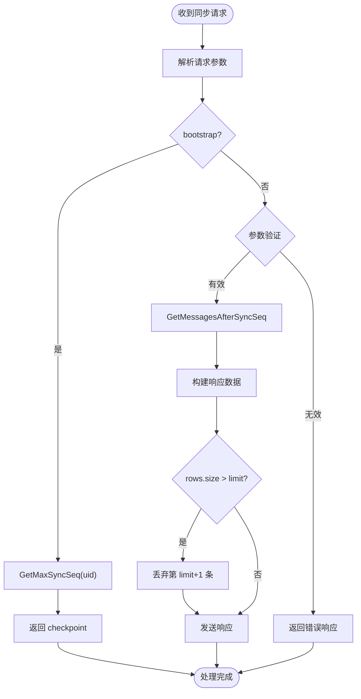

**图表来源**
- [LogicSystem.cpp:1400-1487](file://server/ChatServer/src/LogicSystem.cpp#L1400-L1487)

**章节来源**
- [LogicSystem.cpp:1400-1487](file://server/ChatServer/src/LogicSystem.cpp#L1400-L1487)

### 客户端同步管理器（ChatSyncManager）
**新增** 完整的增量同步管理器，协调 bootstrap 和增量拉取流程。

- **状态机管理**：SYNC_IDLE → SYNC_WAIT_STATE → SYNC_WAIT_BOOTSTRAP → SYNC_BOOTSTRAP_THREADS → SYNC_WAIT_UPSERT → SYNC_WAIT_PAGE → SYNC_IDLE。
- **Bootstrap 流程**：获取 checkpoint → 拉取会话列表 → 写入本地 → 标记 bootstrap 完成 → 进入增量同步。
- **增量同步**：按 last_sync_seq 拉取消息 → applySyncPage 原子性写入 → 推进游标 → 处理 has_more。
- **实时兜底**：监听本地入库事件，触发补拉确保实时推送的可靠性。
- **断线恢复**：连接断开时重置状态，重连后重新驱动同步流程。

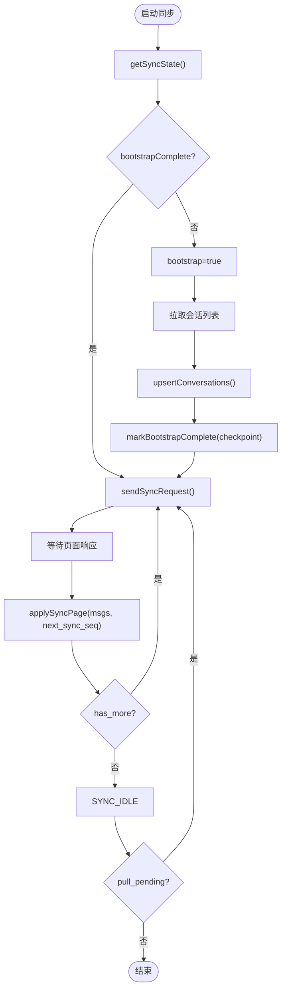

**图表来源**
- [chatsyncmanager.cpp:59-219](file://client/llfcchat/src/chatsyncmanager.cpp#L59-L219)

**章节来源**
- [chatsyncmanager.cpp:59-219](file://client/llfcchat/src/chatsyncmanager.cpp#L59-L219)
- [chatsyncmanager.cpp:229-239](file://client/llfcchat/src/chatsyncmanager.cpp#L229-L239)

### 客户端 SQLite 持久化（LocalChatStore）
**新增** 完整的 SQLite 本地存储层，提供线程安全的消息持久化能力。

- **线程隔离**：LocalChatWorker 独占命名连接 QSQLITE，只在专用线程执行。
- **原子操作**：applySyncPage 整页 + 推进 sync_state 游标，同一事务；失败整体回滚游标不动。
- **Outbox 机制**：支持发送重试、资源上传状态跟踪、失败标记等完整生命周期。
- **会话管理**：UPSERT conversations，维护 unread/preview/last_server_message_id。
- **同步状态**：sync_state 单行 UPSERT，记录 lastSyncSeq 和 bootstrapComplete。

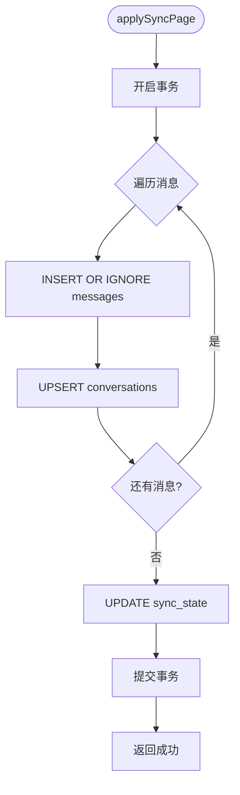

**图表来源**
- [localchatdb.h:52-67](file://client/llfcchat/include/localchatdb.h#L52-L67)

**章节来源**
- [localchatdb.h:25-94](file://client/llfcchat/include/localchatdb.h#L25-L94)
- [localchatstore.h:12-63](file://client/llfcchat/include/localchatstore.h#L12-L63)
- [localchatstore.h:67-148](file://client/llfcchat/include/localchatstore.h#L67-L148)

### 投递确认处理（LogicSystem::DealDeliveryAck）
- 严格参数校验：验证 JSON 格式、uid 合法性、message_ids 数组有效性。
- 权限验证：确保请求 uid 与当前会话 uid 一致，防止越权操作。
- 数据库更新：批量更新消息的 delivery_status 为已投递。
- 幂等处理：重复 ACK 请求仍能成功响应。

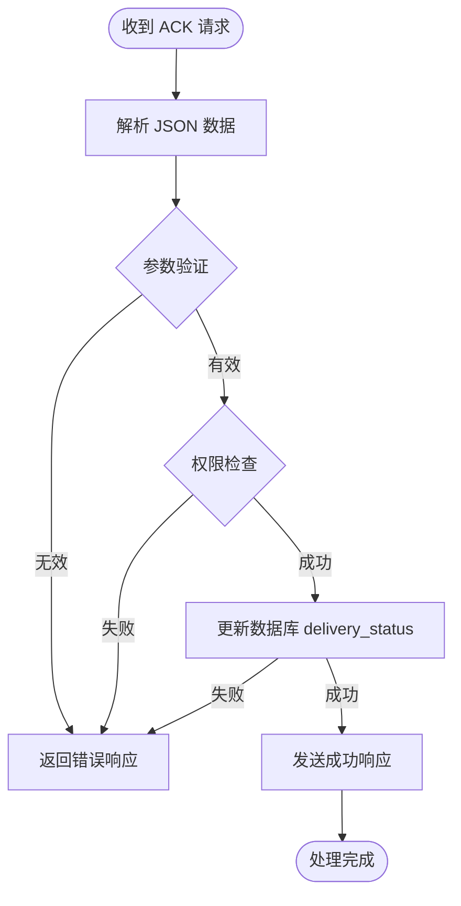

**图表来源**
- [LogicSystem.cpp:1316-1348](file://server/ChatServer/src/LogicSystem.cpp#L1316-L1348)

**章节来源**
- [LogicSystem.cpp:1316-1348](file://server/ChatServer/src/LogicSystem.cpp#L1316-L1348)

### 在线/离线投递决策（LogicSystem）
- 文本消息处理：构造 ChatMessage 列表，调用 AddChatMsg；根据结果返回客户端。
- 在线判断：通过 Redis 中 USERIPPREFIX 获取接收者所在服务器名；若为本机则 PostToUser 投递到对应 uid 分片，查 UserMgr 获取 Session 推送。
- 跨服转发：若非本机，通过 gRPC NotifyTextChatMsg 转发至目标 ChatServer。
- **新架构**：不再需要 Redis offline_msg 队列，所有离线消息通过增量同步机制处理。

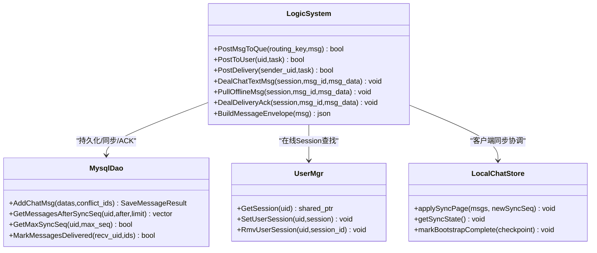

**图表来源**
- [LogicSystem.h:1-262](file://server/ChatServer/include/LogicSystem.h#L1-L262)
- [UserMgr.h:1-55](file://server/ChatServer/include/UserMgr.h#L1-L55)
- [MysqlDao.h:200-271](file://server/ChatServer/include/MysqlDao.h#L200-L271)
- [localchatstore.h:67-148](file://client/llfcchat/include/localchatstore.h#L67-L148)

**章节来源**
- [LogicSystem.cpp:657-679](file://server/ChatServer/src/LogicSystem.cpp#L657-L679)
- [LogicSystem.cpp:128-167](file://server/ChatServer/src/LogicSystem.cpp#L128-L167)

### 数据库表结构与字段说明
- **chat_message**：主消息表，包含 message_id、thread_id、sender_id、recv_id、content、created_at、updated_at、status、msg_type、unique_id、content_size、delivery_status。
- **user_message_sync**：**新增** 同步辅助表，提供每用户的严格递增 sync_seq，用于增量同步。
- **索引**：chat_message 主键 message_id，唯一索引 (sender_id, unique_id)。
- **delivery_status**：0=待投递，1=已投递（ACK）。

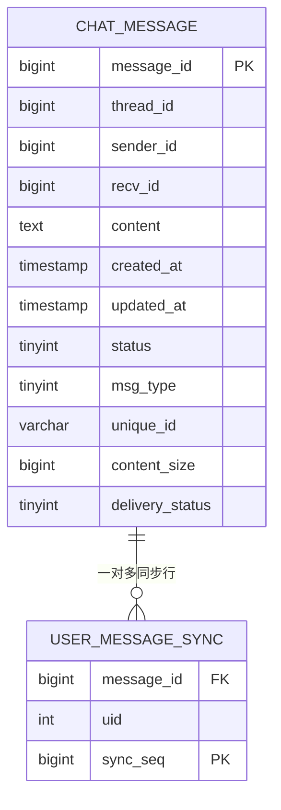

**图表来源**
- [20260813_user_message_sync.sql:39-50](file://sql备份/20260813_user_message_sync.sql#L39-L50)

**章节来源**
- [20260813_user_message_sync.sql:39-50](file://sql备份/20260813_user_message_sync.sql#L39-L50)

### 集成测试框架（新增）
**新增** 完整的增量同步测试框架，支持多种测试场景的自动化验证。

- **测试场景管理**：支持多种测试场景，包括离线消息处理、丢失确认恢复、拉取字节限制、跨服务器通信和图像离线消息。
- **MySQL查询封装**：提供丰富的查询方法，支持按唯一ID查询、按接收者ID和投递状态查询等功能。
- **Redis操作封装**：支持ZSET操作、键值操作等，便于测试验证。
- **自动化清理**：测试结束后自动清理测试数据，确保环境干净。
- **断言验证**：提供丰富的断言工具，验证系统行为的正确性。

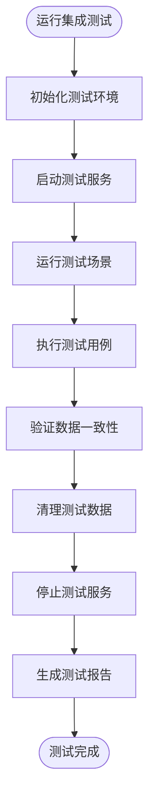

**图表来源**
- [im_integration_tests.cpp:44-89](file://tests/im_integration_tests.cpp#L44-L89)
- [im_scenarios.cpp:1143-1183](file://tests/integration/im_scenarios.cpp#L1143-L1183)

**章节来源**
- [im_integration_tests.cpp:1-90](file://tests/im_integration_tests.cpp#L1-L90)
- [im_scenarios.cpp:1-1592](file://tests/integration/im_scenarios.cpp#L1-L1592)
- [im_mysql.cpp:1-196](file://tests/integration/im_mysql.cpp#L1-L196)
- [im_mysql.h:1-74](file://tests/integration/im_mysql.h#L1-L74)

## 依赖关系分析
- LogicSystem 依赖：
  - MysqlDao：消息持久化、增量同步、ACK。
  - UserMgr：在线 Session 查找。
  - ChatGrpcClient：跨服通知（NotifyTextChatMsg 等）。
- 客户端依赖：
  - Qt 网络模块：QTcpSocket、QDataStream。
  - Qt 定时器：QTimer 用于离线拉取轮询。
  - JSON 解析：QJsonDocument/QJsonObject。
  - **新增** SQLite 存储：QSqlDatabase、QSqlQuery。
- **新增** 测试框架依赖：
  - Boost.Asio：网络通信和异步操作。
  - MySQL Connector/C++：数据库连接和操作。
  - Redis客户端：Redis操作和验证。

**重大更新** 移除了对 Redis 的依赖，新增了 SQLite 本地存储依赖。

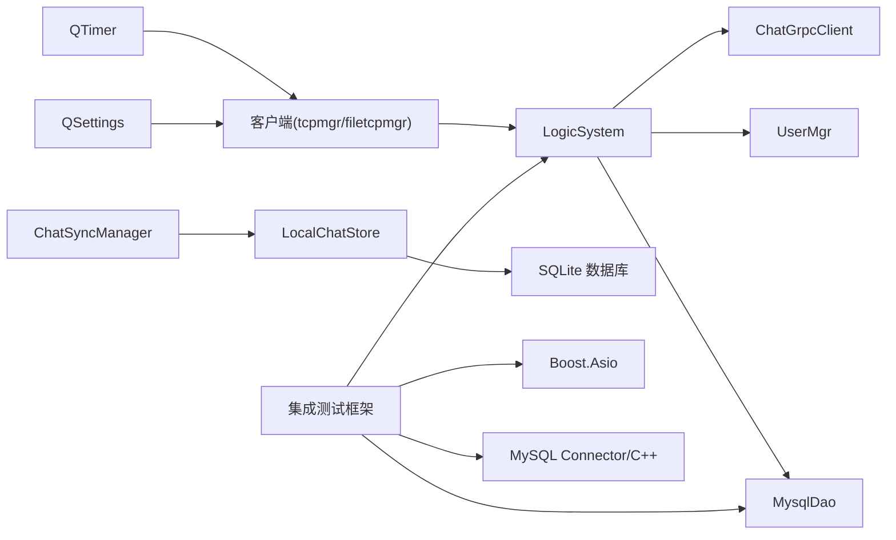

**图表来源**
- [LogicSystem.cpp:1-16](file://server/ChatServer/src/LogicSystem.cpp#L1-L16)
- [MysqlDao.h:200-271](file://server/ChatServer/include/MysqlDao.h#L200-L271)
- [UserMgr.h:1-55](file://server/ChatServer/include/UserMgr.h#L1-L55)
- [chat.proto:1-105](file://proto/chat_service/chat.proto#L1-L105)
- [tcpmgr.cpp:160-163](file://client/llfcchat/src/tcpmgr.cpp#L160-L163)
- [localchatstore.h:67-148](file://client/llfcchat/include/localchatstore.h#L67-L148)
- [im_scenarios.cpp:36-44](file://tests/integration/im_scenarios.cpp#L36-L44)

**章节来源**
- [LogicSystem.cpp:1-16](file://server/ChatServer/src/LogicSystem.cpp#L1-L16)
- [MysqlDao.h:200-271](file://server/ChatServer/include/MysqlDao.h#L200-L271)
- [UserMgr.h:1-55](file://server/ChatServer/include/UserMgr.h#L1-L55)
- [chat.proto:1-105](file://proto/chat_service/chat.proto#L1-L105)

## 性能考量
- 连接池与保活
  - MySQL：连接池定期执行 SELECT 1 保活，失败自动重连。
- 并发与分片
  - LogicSystem 按 uid/sender_uid 分片 Worker，避免热点竞争，提升吞吐。
- 网络 I/O
  - Asio 异步写队列，限制最大队列长度，防止内存膨胀。
- 数据库优化
  - 幂等 UPSERT 减少重复写入与冲突处理开销。
  - 增量同步使用 sync_seq 严格排序，避免全表扫描。
  - 分页查询使用 LIMIT N+1 判断 has_more，减少往返。
- **新架构优化**
  - **MySQL 权威存储**：user_message_sync 表提供严格的顺序保证，避免 Redis 一致性风险。
  - **客户端 SQLite 缓存**：减少重复拉取和网络开销，支持离线浏览。
  - **原子性同步**：applySyncPage 整页原子操作，失败时回滚游标，保证数据一致性。
  - **智能分页**：limit 默认100，上限200，平衡性能和用户体验。
  - **测试框架优化**：高效的测试数据管理和清理机制。

## 故障排查指南
- 客户端粘包/断包
  - 检查消息头解析与缓冲长度判断逻辑。
  - 参考 tcpmgr.cpp 的粘包处理与错误分支。
- 消息丢失/重复
  - 核对 unique_id 幂等性与 delivery_status 状态。
  - 检查 user_message_sync 表的 sync_seq 是否严格递增。
- 在线推送失败
  - 确认 USERIPPREFIX 是否正确设置，UserMgr 是否能找到 Session。
- 跨服通知失败
  - 检查 gRPC 调用与目标服务器名称解析。
- **新架构问题排查**
  - **同步状态异常**：检查 sync_state 表的 lastSyncSeq 和 bootstrapComplete 字段。
  - **增量同步卡住**：验证 after_sync_seq 参数和 user_message_sync 表数据。
  - **Bootstrap 失败**：检查 GetMaxSyncSeq 查询和 checkpoint 获取逻辑。
  - **本地存储问题**：验证 SQLite 数据库连接和 applySyncPage 事务完整性。
  - **测试环境问题**：检查测试服务启动状态和端口占用情况。
  - **数据清理问题**：验证测试数据清理逻辑是否正确执行。

**章节来源**
- [tcpmgr.cpp:31-61](file://client/llfcchat/src/tcpmgr.cpp#L31-L61)
- [filetcpmgr.cpp:37-77](file://client/llfcchat/src/filetcpmgr.cpp#L37-L77)
- [LogicSystem.cpp:1400-1487](file://server/ChatServer/src/LogicSystem.cpp#L1400-L1487)
- [LogicSystem.cpp:1316-1348](file://server/ChatServer/src/LogicSystem.cpp#L1316-L1348)
- [MysqlDao.cpp:1113-1154](file://server/ChatServer/src/MysqlDao.cpp#L1113-L1154)
- [MysqlDao.cpp:1173-1202](file://server/ChatServer/src/MysqlDao.cpp#L1173-L1202)
- [chatsyncmanager.cpp:78-219](file://client/llfcchat/src/chatsyncmanager.cpp#L78-L219)
- [im_scenarios.cpp:1143-1183](file://tests/integration/im_scenarios.cpp#L1143-L1183)

## 结论
该离线消息投递系统已完成重大架构升级，从原来的 Redis ZSET 方案迁移到基于 MySQL 权威存储 + SQLite 客户端持久化的新架构，通过 checkpoint 驱动的增量同步机制，实现了更加可靠和可恢复的消息投递。**重大改进** 新架构完全摆脱了对 Redis 的依赖，通过 MySQL 的 user_message_sync 表提供严格的顺序保证，结合客户端的 SQLite 持久化，确保了消息的最终可达性和一致性。

**架构优势** 
- **数据一致性**：MySQL 作为权威数据源，避免了 Redis 与数据库之间的数据不一致问题。
- **顺序保证**：user_message_sync 表的 sync_seq 提供严格的递增顺序，确保消息不重不漏。
- **可恢复性**：客户端 SQLite 持久化支持进程重启后的状态恢复。
- **性能优化**：增量同步避免全量拉取，分页机制平衡性能和用户体验。
- **测试完善**：完整的集成测试框架覆盖各种边界情况和异常场景。

建议在后续迭代中继续完善监控与告警，增强异常自愈能力，并扩展更多边界情况的测试场景。

## 附录
- 客户端消息状态枚举与通知处理示例可参考开发文档。
- 构建与依赖配置见根 CMakeLists.txt 与 vcpkg.json。
- **新增协议说明**
  - ID_SYNC_MESSAGE_REQ/ID_SYNC_MESSAGE_RSP：增量同步请求/响应
  - ID_CHAT_DELIVERY_ACK_REQ/ID_CHAT_DELIVERY_ACK_RSP：投递确认请求/响应
- **新增配置项**
  - **Delivery配置**：
    - RequestRetryInitialMs：客户端请求重试初始退避时间（默认2000ms）
    - RequestRetryMaxMs：客户端请求重试最大退避时间（默认30000ms）
    - AckRetryInitialMs：ACK重试初始退避时间（默认2000ms）
    - RpcDeadlineMs：跨服务gRPC调用超时时间（默认3000ms）
    - RpcMaxAttempts：跨服务gRPC调用最大重试次数（默认3次）
    - RpcBackoffMs：跨服务gRPC调用重试基础退避时间（默认100ms）
    - PullMaxBytes：拉取响应最大字节数（默认30000）
- **新增测试场景**
  - offline：离线消息处理场景
  - lost-ack：丢失确认恢复场景
  - pull-bytes：拉取字节限制场景
  - cross-server：跨服务器通信场景
  - image-offline：图像离线消息场景

**章节来源**
- [CMakeLists.txt:1-34](file://CMakeLists.txt#L1-L34)
- [const.h:106-109](file://server/ChatServer/include/const.h#L106-L109)
- [tcpmgr.cpp:1262-1298](file://client/llfcchat/src/tcpmgr.cpp#L1262-L1298)
- [config.ini:5-11](file://client/llfcchat/config/config.ini#L5-L11)
- [ChatGrpcClient.h:89-95](file://server/ChatServer/include/ChatGrpcClient.h#L89-L95)
- [im_integration_tests.cpp:30-40](file://tests/im_integration_tests.cpp#L30-L40)
- [im_scenarios.cpp:1143-1592](file://tests/integration/im_scenarios.cpp#L1143-L1592)