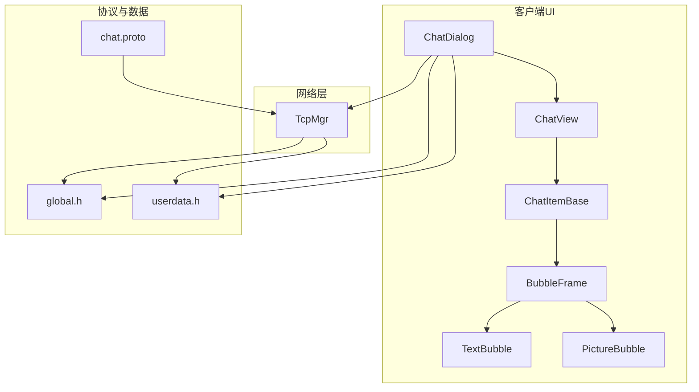
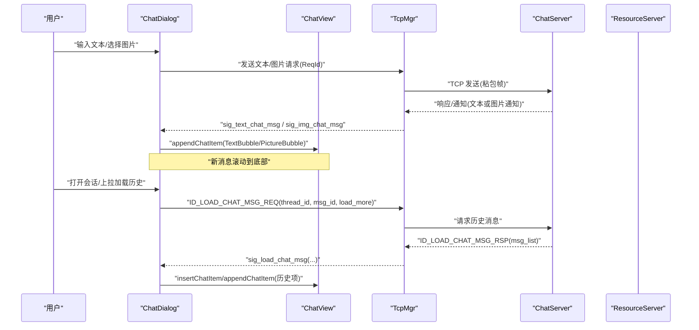
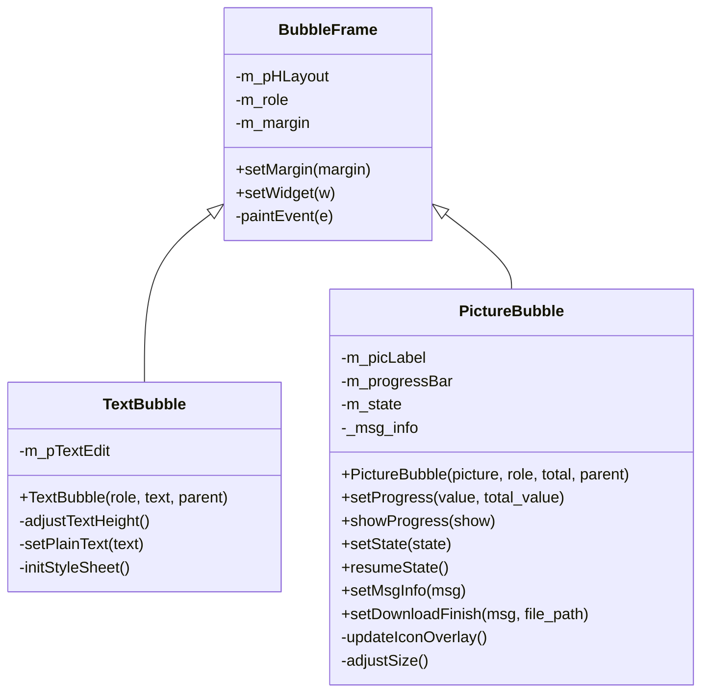
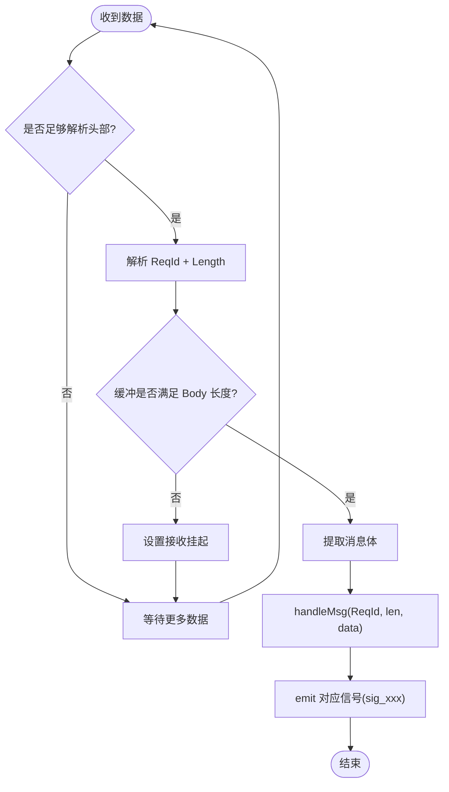
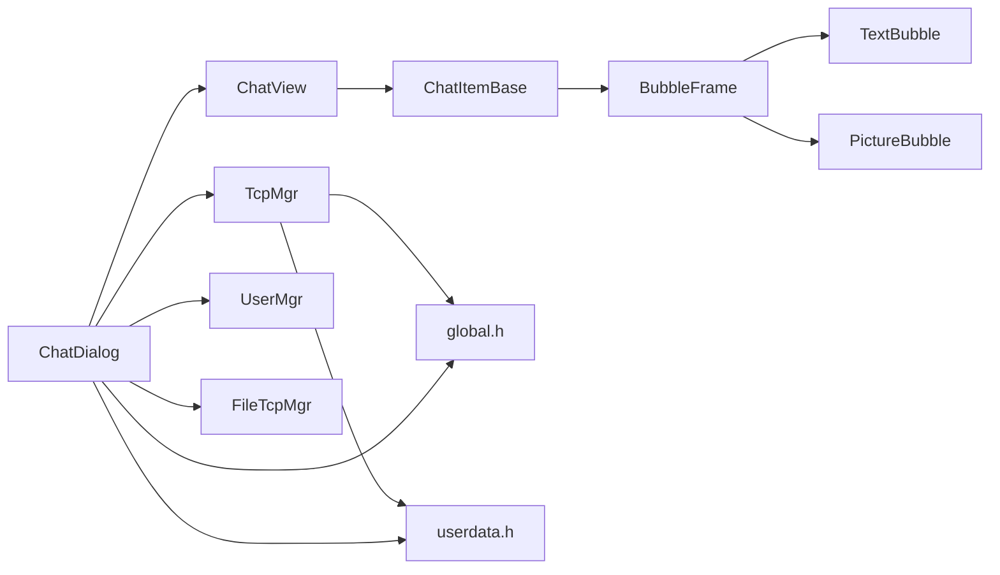

# 聊天消息系统

<cite>
**本文引用的文件**   
- [chatdialog.h](file://client/llfcchat/include/chatdialog.h)
- [chatdialog.cpp](file://client/llfcchat/src/chatdialog.cpp)
- [ChatView.h](file://client/llfcchat/include/ChatView.h)
- [ChatView.cpp](file://client/llfcchat/src/ChatView.cpp)
- [TextBubble.h](file://client/llfcchat/include/TextBubble.h)
- [TextBubble.cpp](file://client/llfcchat/src/TextBubble.cpp)
- [PictureBubble.h](file://client/llfcchat/include/PictureBubble.h)
- [PictureBubble.cpp](file://client/llfcchat/src/PictureBubble.cpp)
- [BubbleFrame.h](file://client/llfcchat/include/BubbleFrame.h)
- [BubbleFrame.cpp](file://client/llfcchat/src/BubbleFrame.cpp)
- [ChatItemBase.h](file://client/llfcchat/include/ChatItemBase.h)
- [ChatItemBase.cpp](file://client/llfcchat/src/ChatItemBase.cpp)
- [tcpmgr.h](file://client/llfcchat/include/tcpmgr.h)
- [tcpmgr.cpp](file://client/llfcchat/src/tcpmgr.cpp)
- [global.h](file://client/llfcchat/include/global.h)
- [userdata.h](file://client/llfcchat/include/userdata.h)
- [chat.proto](file://proto/chat_service/chat.proto)
</cite>

## 目录
1. [简介](#简介)
2. [项目结构](#项目结构)
3. [核心组件](#核心组件)
4. [架构总览](#架构总览)
5. [详细组件分析](#详细组件分析)
6. [依赖关系分析](#依赖关系分析)
7. [性能考虑](#性能考虑)
8. [故障排查指南](#故障排查指南)
9. [结论](#结论)
10. [附录](#附录)

## 简介
本文件为 LLFCChat 聊天消息系统的功能文档，聚焦于实时文本聊天、图片消息、消息历史加载与消息类型处理。文档从客户端视角出发，结合 ChatDialog、ChatView、TextBubble、PictureBubble 等关键 UI 组件，以及 TcpMgr 网络层与协议定义（chat.proto），系统性说明调用关系、接口契约、领域模型与使用模式。同时覆盖消息序列化、异步加载、气泡界面设计与消息状态管理，并给出常见问题与解决方案，帮助初学者快速上手，也为有经验的开发者提供深入的技术细节。

## 项目结构
客户端聊天模块主要位于 client/llfcchat 下，UI 层由 Qt 实现，网络层通过 QTcpSocket 与服务器通信，协议采用自定义二进制帧（ReqId + 长度 + JSON 体）。核心文件组织如下：
- UI 层：ChatDialog、ChatView、BubbleFrame、TextBubble、PictureBubble、ChatItemBase
- 数据与协议：global.h、userdata.h、chat.proto
- 网络层：TcpMgr（单例）封装连接、粘包处理、消息分发与信号转发

图表来源 
- [chatdialog.h:1-98](file://client/llfcchat/include/chatdialog.h#L1-L98)
- [ChatView.h:1-33](file://client/llfcchat/include/ChatView.h#L1-L33)
- [BubbleFrame.h:1-24](file://client/llfcchat/include/BubbleFrame.h#L1-L24)
- [TextBubble.h:1-24](file://client/llfcchat/include/TextBubble.h#L1-L24)
- [PictureBubble.h:1-53](file://client/llfcchat/include/PictureBubble.h#L1-L53)
- [ChatItemBase.h:1-30](file://client/llfcchat/include/ChatItemBase.h#L1-L30)
- [tcpmgr.h:1-90](file://client/llfcchat/include/tcpmgr.h#L1-L90)
- [global.h:1-296](file://client/llfcchat/include/global.h#L1-L296)
- [userdata.h:1-288](file://client/llfcchat/include/userdata.h#L1-L288)
- [chat.proto:1-105](file://proto/chat_service/chat.proto#L1-L105)

章节来源
- [chatdialog.h:1-98](file://client/llfcchat/include/chatdialog.h#L1-L98)
- [ChatView.h:1-33](file://client/llfcchat/include/ChatView.h#L1-L33)
- [BubbleFrame.h:1-24](file://client/llfcchat/include/BubbleFrame.h#L1-L24)
- [TextBubble.h:1-24](file://client/llfcchat/include/TextBubble.h#L1-L24)
- [PictureBubble.h:1-53](file://client/llfcchat/include/PictureBubble.h#L1-L53)
- [ChatItemBase.h:1-30](file://client/llfcchat/include/ChatItemBase.h#L1-L30)
- [tcpmgr.h:1-90](file://client/llfcchat/include/tcpmgr.h#L1-L90)
- [global.h:1-296](file://client/llfcchat/include/global.h#L1-L296)
- [userdata.h:1-288](file://client/llfcchat/include/userdata.h#L1-L288)
- [chat.proto:1-105](file://proto/chat_service/chat.proto#L1-L105)

## 核心组件
- ChatDialog：聊天主对话框，负责会话列表、消息加载、发送与接收、头像刷新、上传下载进度更新、心跳定时器等。
- ChatView：聊天消息滚动容器，支持尾插、头插、中间插入与清理，自动滚动到底部。
- BubbleFrame：气泡基类，根据角色（自己/对方）绘制不同背景与三角箭头。
- TextBubble：文本气泡，自适应宽度与高度，只读显示。
- PictureBubble：图片气泡，支持缩略图、进度条、暂停/继续/失败重试、完成延迟隐藏进度。
- ChatItemBase：消息行基础布局，包含头像、用户名、状态图标与气泡区域。
- TcpMgr：TCP 单例管理器，负责连接、粘包解析、消息分发、信号广播到 UI。
- global.h / userdata.h：全局枚举、数据结构（MsgInfo、TransferState、ChatRole、ChatMsgType、ChatDataBase 派生类等）。
- chat.proto：服务端 gRPC 协议定义（文本消息通知、图片消息通知、好友申请/认证等）。

章节来源
- [chatdialog.cpp:1-200](file://client/llfcchat/src/chatdialog.cpp#L1-L200)
- [ChatView.cpp:1-133](file://client/llfcchat/src/ChatView.cpp#L1-L133)
- [BubbleFrame.cpp:1-73](file://client/llfcchat/src/BubbleFrame.cpp#L1-L73)
- [TextBubble.cpp:1-79](file://client/llfcchat/src/TextBubble.cpp#L1-L79)
- [PictureBubble.cpp:1-243](file://client/llfcchat/src/PictureBubble.cpp#L1-L243)
- [ChatItemBase.cpp:1-99](file://client/llfcchat/src/ChatItemBase.cpp#L1-L99)
- [tcpmgr.cpp:1-200](file://client/llfcchat/src/tcpmgr.cpp#L1-L200)
- [global.h:1-296](file://client/llfcchat/include/global.h#L1-L296)
- [userdata.h:1-288](file://client/llfcchat/include/userdata.h#L1-L288)
- [chat.proto:1-105](file://proto/chat_service/chat.proto#L1-L105)

## 架构总览
整体流程：
- 用户输入文本或选择图片后，ChatDialog 构造对应消息对象（TextChatData 或 ImgChatData），并通过 TcpMgr 发送请求（ID_TEXT_CHAT_MSG_REQ / ID_IMG_CHAT_MSG_REQ）。
- 服务器处理后返回响应或推送通知（sig_text_chat_msg / sig_img_chat_msg），TcpMgr 将数据转换为领域模型并触发信号。
- ChatDialog 槽函数接收消息，创建 ChatItemBase + TextBubble/PictureBubble 插入 ChatView，并处理历史加载（ID_LOAD_CHAT_MSG_REQ/RSP）。
- 图片消息涉及资源服务（ResourceServer）与断点续传，PictureBubble 展示进度与状态，FileTcpMgr 回调更新 UI。

图表来源 
- [chatdialog.cpp:160-195](file://client/llfcchat/src/chatdialog.cpp#L160-L195)
- [tcpmgr.cpp:18-55](file://client/llfcchat/src/tcpmgr.cpp#L18-L55)
- [chat.proto:53-105](file://proto/chat_service/chat.proto#L53-L105)

章节来源
- [chatdialog.cpp:150-195](file://client/llfcchat/src/chatdialog.cpp#L150-L195)
- [tcpmgr.cpp:18-55](file://client/llfcchat/src/tcpmgr.cpp#L18-L55)
- [chat.proto:53-105](file://proto/chat_service/chat.proto#L53-L105)

## 详细组件分析

### ChatDialog：会话与消息编排
- 职责：初始化 UI、绑定事件、发起心跳、加载会话列表与消息、处理 TCP 信号（文本/图片消息、历史加载、上传下载进度）、切换页面与搜索联动。
- 关键槽函数：
  - slot_text_chat_msg：接收文本消息，构建 TextChatData 列表并渲染。
  - slot_img_chat_msg：接收图片通知，创建 ImgChatData 与 PictureBubble，启动下载。
  - slot_load_chat_thread / slot_create_private_chat：加载会话列表与创建私聊。
  - slot_load_chat_msg：历史消息加载，按 thread_id 与 last_msg_id 分页。
  - slot_add_chat_msg / slot_add_img_msg：追加已确认的消息到当前会话。
  - slot_update_upload_progress / slot_update_download_progress / slot_download_finish：与 FileTcpMgr 协作更新 PictureBubble 状态。
- 使用模式：通过 TcpMgr::GetInstance() 订阅信号，避免直接耦合网络细节；所有 UI 更新在主线程执行。

章节来源
- [chatdialog.h:58-93](file://client/llfcchat/include/chatdialog.h#L58-L93)
- [chatdialog.cpp:150-195](file://client/llfcchat/src/chatdialog.cpp#L150-L195)

### ChatView：滚动容器与插入策略
- 职责：维护 QScrollArea 与 QVBoxLayout，提供 append/prepend/insert/remove 接口；监听滚动条变化，添加消息时自动滚动到底部。
- 关键点：
  - appendChatItem：在布局末尾插入，设置 isAppended=true 以触发滚动。
  - onVScrollBarMoved：当 isAppended 为真时，将滑块置底，并使用 QTimer 延时复位标志，防止频繁重排。
  - eventFilter：控制滚动条显隐，提升视觉体验。
- 性能：批量插入时使用固定布局，避免重复计算；必要时可合并多次 append。

章节来源
- [ChatView.h:10-30](file://client/llfcchat/include/ChatView.h#L10-L30)
- [ChatView.cpp:46-120](file://client/llfcchat/src/ChatView.cpp#L46-L120)

### BubbleFrame / TextBubble / PictureBubble：气泡界面设计
- BubbleFrame：根据 ChatRole 决定左右边距与三角方向，绘制圆角矩形与箭头。
- TextBubble：
  - setPlainText：遍历 QTextBlock 计算最大宽度，设置气泡最大宽度。
  - adjustTextHeight：累加每段布局高度，设置固定高度，避免动态重排。
  - initStyleSheet：透明背景无边框。
- PictureBubble：
  - 构造函数：创建 ClickableLabel 与 QProgressBar，缩放图片至固定尺寸，设置样式。
  - setProgress / showProgress：更新进度百分比与可见性，完成后延迟隐藏。
  - setState：根据 TransferState 切换进度条与图标覆盖（暂停/播放/下载）。
  - setMsgInfo / resumeState：恢复传输状态（上传/下载），同步 _msg_info 的 transfer_state。
  - onPictureClicked：点击触发暂停/继续/重试，发射 pauseRequested/resumeRequested/cancelRequested 信号。
  - setDownloadFinish：下载完成后替换缩略图为真实图片并调整尺寸。

图表来源 
- [BubbleFrame.h:1-24](file://client/llfcchat/include/BubbleFrame.h#L1-L24)
- [BubbleFrame.cpp:1-73](file://client/llfcchat/src/BubbleFrame.cpp#L1-L73)
- [TextBubble.h:1-24](file://client/llfcchat/include/TextBubble.h#L1-L24)
- [TextBubble.cpp:1-79](file://client/llfcchat/src/TextBubble.cpp#L1-L79)
- [PictureBubble.h:1-53](file://client/llfcchat/include/PictureBubble.h#L1-L53)
- [PictureBubble.cpp:1-243](file://client/llfcchat/src/PictureBubble.cpp#L1-L243)

章节来源
- [BubbleFrame.cpp:1-73](file://client/llfcchat/src/BubbleFrame.cpp#L1-L73)
- [TextBubble.cpp:1-79](file://client/llfcchat/src/TextBubble.cpp#L1-L79)
- [PictureBubble.cpp:1-243](file://client/llfcchat/src/PictureBubble.cpp#L1-L243)

### ChatItemBase：消息行布局
- 职责：组合头像、用户名、状态图标与气泡区域；根据角色调整对齐与列拉伸。
- 关键点：
  - setStatus：根据 MsgStatus 设置未读/发送失败/已读图标。
  - setWidget：替换气泡区域为具体 BubbleFrame 派生类。
- 使用模式：每个消息行一个 ChatItemBase，内部嵌入 TextBubble 或 PictureBubble。

章节来源
- [ChatItemBase.h:10-27](file://client/llfcchat/include/ChatItemBase.h#L10-L27)
- [ChatItemBase.cpp:1-99](file://client/llfcchat/src/ChatItemBase.cpp#L1-L99)

### TcpMgr：网络层与消息分发
- 职责：QTcpSocket 生命周期管理、粘包解析、发送队列、错误处理、信号广播。
- 关键点：
  - readyRead：读取缓冲区，先解析头部（ReqId + 长度），再读取消息体，循环处理多包。
  - handleMsg：根据 ReqId 分发给对应处理器（JSON 解析、构造领域对象、emit 信号）。
  - bytesWritten：流控发送，队列出队，记录已发送字节数。
  - registerMetaType：注册跨线程信号槽所需的自定义类型。
  - 信号：sig_text_chat_msg、sig_img_chat_msg、sig_load_chat_msg、sig_chat_msg_rsp、sig_chat_img_rsp 等。
- 与 ChatServer 的关系：通过 ReqId 与服务器约定消息类型，文本消息使用 ID_TEXT_CHAT_MSG_REQ/RSP，图片消息使用 ID_IMG_CHAT_MSG_REQ/RSP 与通知 ID_NOTIFY_IMG_CHAT_MSG_REQ。

图表来源 
- [tcpmgr.cpp:18-55](file://client/llfcchat/src/tcpmgr.cpp#L18-L55)

章节来源
- [tcpmgr.h:22-87](file://client/llfcchat/include/tcpmgr.h#L22-L87)
- [tcpmgr.cpp:1-200](file://client/llfcchat/src/tcpmgr.cpp#L1-L200)

### 领域模型与协议
- global.h：
  - ChatRole：Self/Other
  - MsgType：TEXT_MSG/IMG_MSG/VIDEO_MSG/FILE_MSG
  - TransferType：None/Download/Upload
  - TransferState：None/Downloading/Uploading/Paused/Completed/Failed
  - MsgInfo：文件/图片传输元数据（大小、序列号、MD5、状态等）
  - ChatMsgType：TEXT/PIC/VIDEO/FILE
  - MsgStatus：UN_READ/SEND_FAILED/READED/UN_UPLOAD
- userdata.h：
  - ChatDataBase 基类：统一消息抽象（unique_id、thread_id、form_type、msg_type、content、send_uid、status、chat_time）
  - TextChatData：文本消息
  - ImgChatData：图片消息，关联 MsgInfo
  - ChatThreadInfo / ChatThreadData：会话信息与本地缓存
- chat.proto：
  - TextChatData：unique_id、msg_id、msgcontent、chat_time
  - TextChatMsgReq/Rsp：fromuid、touid、thread_id、textmsgs
  - NotifyChatImgReq/Rsp：from_uid、to_uid、message_id、file_name、total_size、thread_id

章节来源
- [global.h:138-200](file://client/llfcchat/include/global.h#L138-L200)
- [userdata.h:144-234](file://client/llfcchat/include/userdata.h#L144-L234)
- [chat.proto:53-105](file://proto/chat_service/chat.proto#L53-L105)

## 依赖关系分析
- ChatDialog 依赖 TcpMgr（信号订阅）、UserMgr（用户信息）、FileTcpMgr（文件传输进度）、ChatView（消息渲染）。
- ChatView 依赖 Qt ScrollArea 与 Layout，不直接依赖网络。
- BubbleFrame/TextBubble/PictureBubble 依赖 global.h 中的枚举与样式。
- TcpMgr 依赖 QTcpSocket、QJsonDocument、QDataStream，并与服务器通过 ReqId 约定。
- 领域模型集中在 global.h 与 userdata.h，被 UI 与网络层共同使用。

图表来源 
- [chatdialog.cpp:150-195](file://client/llfcchat/src/chatdialog.cpp#L150-L195)
- [ChatView.cpp:1-133](file://client/llfcchat/src/ChatView.cpp#L1-L133)
- [BubbleFrame.cpp:1-73](file://client/llfcchat/src/BubbleFrame.cpp#L1-L73)
- [TextBubble.cpp:1-79](file://client/llfcchat/src/TextBubble.cpp#L1-L79)
- [PictureBubble.cpp:1-243](file://client/llfcchat/src/PictureBubble.cpp#L1-L243)
- [tcpmgr.cpp:1-200](file://client/llfcchat/src/tcpmgr.cpp#L1-L200)
- [global.h:1-296](file://client/llfcchat/include/global.h#L1-L296)
- [userdata.h:1-288](file://client/llfcchat/include/userdata.h#L1-L288)

章节来源
- [chatdialog.cpp:150-195](file://client/llfcchat/src/chatdialog.cpp#L150-L195)
- [ChatView.cpp:1-133](file://client/llfcchat/src/ChatView.cpp#L1-L133)
- [BubbleFrame.cpp:1-73](file://client/llfcchat/src/BubbleFrame.cpp#L1-L73)
- [TextBubble.cpp:1-79](file://client/llfcchat/src/TextBubble.cpp#L1-L79)
- [PictureBubble.cpp:1-243](file://client/llfcchat/src/PictureBubble.cpp#L1-L243)
- [tcpmgr.cpp:1-200](file://client/llfcchat/src/tcpmgr.cpp#L1-L200)
- [global.h:1-296](file://client/llfcchat/include/global.h#L1-L296)
- [userdata.h:1-288](file://client/llfcchat/include/userdata.h#L1-L288)

## 性能考虑
- 文本气泡高度计算：在 PaintEvent 中计算，避免频繁重排；一次性设置最大宽度与固定高度。
- 图片气泡缩放：使用 KeepAspectRatio 与 SmoothTransformation，限制最大宽高，减少内存占用。
- 滚动优化：isAppended 标志与 QTimer 延时复位，避免连续 append 导致多次滚动计算。
- 网络层粘包处理：循环解析，避免阻塞；发送队列与 bytesWritten 回调保证顺序与流控。
- 历史加载分页：按 last_msg_id 分页，减少单次数据量。

[本节为通用指导，无需特定文件引用]

## 故障排查指南
- 连接失败/超时：检查 TcpMgr error 分支，确认主机与端口配置；查看 sig_con_success(false) 触发原因。
- 消息丢失/乱序：确认粘包解析逻辑（头部长度与 body 长度匹配）；检查 handleMsg 中 ReqId 映射是否正确。
- 图片进度不更新：确认 FileTcpMgr 信号（sig_update_upload_progress/sig_update_download_progress/sig_download_finish）是否连接到 ChatDialog 槽；检查 PictureBubble.setState 与 setProgress 调用时机。
- 气泡高度异常：检查 TextBubble.adjustTextHeight 是否在 PaintEvent 中调用；确认 documentMargin 与布局边距计算。
- 历史加载无响应：确认 slot_load_chat_msg 参数（thread_id、msg_id、load_more）是否正确传递；检查服务器返回的 msg_list 是否为空。

章节来源
- [tcpmgr.cpp:64-98](file://client/llfcchat/src/tcpmgr.cpp#L64-L98)
- [PictureBubble.cpp:122-149](file://client/llfcchat/src/PictureBubble.cpp#L122-L149)
- [TextBubble.cpp:58-73](file://client/llfcchat/src/TextBubble.cpp#L58-L73)
- [chatdialog.cpp:176-183](file://client/llfcchat/src/chatdialog.cpp#L176-L183)

## 结论
LLFCChat 聊天消息系统通过清晰的 UI 分层（ChatDialog/ChatView/BubbleFrame 派生类）与健壮的网络层（TcpMgr 粘包处理与信号分发），实现了文本与图片消息的实时交互与历史加载。领域模型（global.h/userdata.h）与协议（chat.proto）解耦了前后端，便于扩展视频与文件消息。通过合理的性能优化与状态管理，系统在用户体验与稳定性之间取得平衡。建议后续完善错误提示、增加消息去重与离线同步机制，进一步提升可靠性。

[本节为总结，无需特定文件引用]

## 附录
- 配置选项：
  - TcpMgr：host/port 由 ServerInfo 提供；发送队列与流控参数在内部维护。
  - 图片尺寸：PIC_MAX_WIDTH=160，PIC_MAX_HEIGHT=90（PictureBubble.cpp）。
  - 心跳间隔：10 秒（ChatDialog.cpp 定时器）。
- 参数与返回值：
  - 文本消息：TextChatMsgReq/Rsp（chat.proto），字段包括 fromuid、touid、thread_id、textmsgs。
  - 图片消息：NotifyChatImgReq/Rsp，字段包括 from_uid、to_uid、message_id、file_name、total_size、thread_id。
  - 历史加载：ID_LOAD_CHAT_MSG_REQ/RSP，参数 thread_id、message_id、load_more，返回 msg_list。
- 使用模式示例：
  - 发送文本：ChatDialog 构造 TextChatData -> TcpMgr::SendData(ID_TEXT_CHAT_MSG_REQ) -> 服务器响应 -> sig_text_chat_msg -> ChatDialog 渲染。
  - 发送图片：ChatDialog 构造 ImgChatData + MsgInfo -> TcpMgr::SendData(ID_IMG_CHAT_MSG_REQ) -> 服务器通知 -> sig_img_chat_msg -> PictureBubble 下载与进度更新。

章节来源
- [chat.proto:53-105](file://proto/chat_service/chat.proto#L53-L105)
- [PictureBubble.cpp:1-64](file://client/llfcchat/src/PictureBubble.cpp#L1-L64)
- [chatdialog.cpp:156-166](file://client/llfcchat/src/chatdialog.cpp#L156-L166)