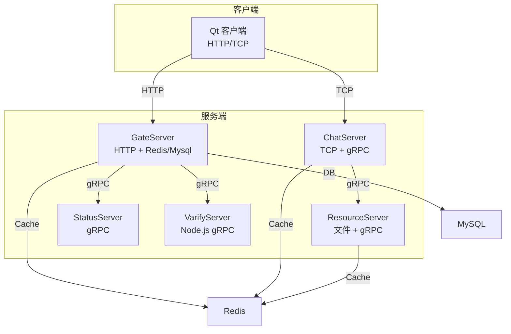
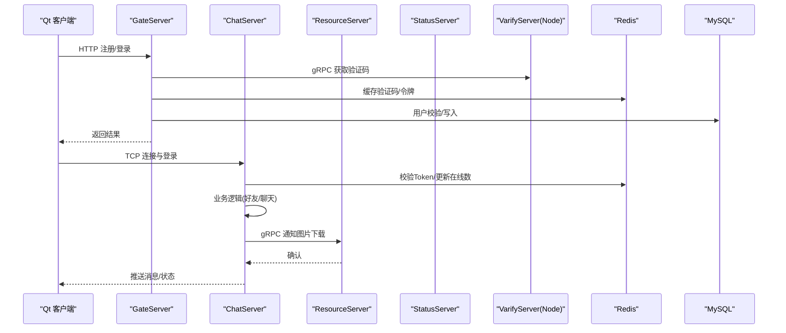
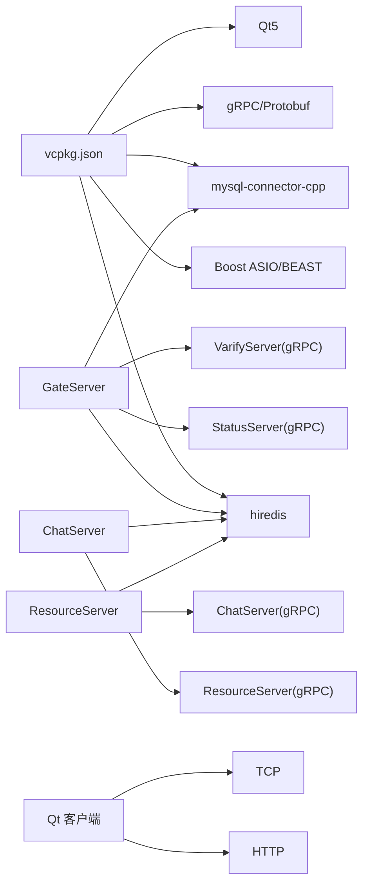

# 测试策略

<cite>
**本文引用的文件**
- [CMakeLists.txt](file://CMakeLists.txt)
- [CMakePresets.json](file://CMakePresets.json)
- [vcpkg.json](file://vcpkg.json)
- [.gitignore](file://.gitignore)
- [GrpcCodegen.cmake](file://cmake/GrpcCodegen.cmake)
- [server/CMakeLists.txt](file://server/CMakeLists.txt)
- [client CMakeLists.txt](file://client/llfcchat/CMakeLists.txt)
- [ChatServer CMakeLists.txt](file://server/ChatServer/CMakeLists.txt)
- [GateServer CMakeLists.txt](file://server/GateServer/CMakeLists.txt)
- [ResourceServer CMakeLists.txt](file://server\ResourceServer\CMakeLists.txt)
- [StatusServer CMakeLists.txt](file://server\StatusServer\CMakeLists.txt)
- [ChatServer.cpp](file://server/ChatServer/src/ChatServer.cpp)
- [GateServer.cpp](file://server/GateServer/src/GateServer.cpp)
- [LogicSystem.h](file://server/ChatServer/include/LogicSystem.h)
- [AsioIOServicePool.h](file://server/ChatServer/include/AsioIOServicePool.h)
- [RedisMgr.h（ChatServer）](file://server/ChatServer/include/RedisMgr.h)
- [RedisMgr.h（GateServer）](file://server/GateServer/include/RedisMgr.h)
- [RedisMgr.h（ResourceServer）](file://server/ResourceServer/include/RedisMgr.h)
- [CSession.cpp（ChatServer）](file://server/ChatServer/src/CSession.cpp)
- [CSession.cpp（ResourceServer）](file://server/ResourceServer/src/CSession.cpp)
- [main.cpp（客户端）](file://client/llfcchat/src/main.cpp)
- [mainwindow.cpp](file://client/llfcchat/src/mainwindow.cpp)
- [tcpmgr.cpp](file://client/llfcchat/src/tcpmgr.cpp)
- [userdata.h](file://client/llfcchat/include/userdata.h)
- [message.proto（控制协议）](file://server/proto/control/message.proto)
- [message.proto（聊天协议）](file://server/proto/chat/message.proto)
- [message.proto（资源协议）](file://server/proto/resource/message.proto)
- [VarifyServer proto.js](file://server/VarifyServer/proto.js)
- [webrtc-demo server package.json](file://webrtc-demo/server/package.json)
- [llfc.sql](file://sql备份/llfc.sql)
</cite>

## 目录
1. [引言](#引言)
2. [项目结构](#项目结构)
3. [核心组件](#核心组件)
4. [架构总览](#架构总览)
5. [详细组件分析](#详细组件分析)
6. [依赖分析](#依赖分析)
7. [性能考虑](#性能考虑)
8. [故障排查指南](#故障排查指南)
9. [结论](#结论)
10. [附录](#附录)

## 引言
本测试策略面向LLFCChat项目的多语言、多服务、跨网络与数据库的复杂系统，覆盖单元测试、集成测试、端到端测试、性能与压力测试、自动化CI流水线、测试数据与环境管理、覆盖率与质量门禁等。目标是建立可重复、可度量、可扩展的测试体系，确保在分布式通信、异步I/O、gRPC/HTTP交互、Redis/Mysql持久化等关键路径上的稳定性与正确性。

## 项目结构
- 构建系统与依赖
  - 根CMake与子模块CMake：统一使用Ninja Multi-Config生成器，强制非源码目录构建，vcpkg作为包管理器。
  - gRPC/Protobuf代码生成：通过自定义CMake函数集中生成proto源并链接库。
  - 预设配置：提供Windows下Debug/Release构建预设。
- 服务端
  - GateServer：HTTP入口，负责鉴权、路由、与Redis/Mysql交互。
  - ChatServer：TCP长连接与聊天业务逻辑，gRPC服务暴露给其他服务。
  - ResourceServer：文件与图片资源处理，gRPC通知聊天服务。
  - StatusServer：状态查询服务，gRPC接口。
  - VarifyServer：Node.js实现的验证码服务，gRPC实现。
- 客户端
  - Qt GUI应用，基于QNetworkAccessManager进行HTTP请求，基于QTcpSocket进行TCP通信。
- 协议与数据
  - Protobuf定义位于server/proto，分别对应control、chat、resource三个域。
  - SQL脚本位于sql备份，包含用户表、消息表等结构与存储过程。

图表来源
- [CMakeLists.txt:1-34](file://CMakeLists.txt#L1-L34)
- [GrpcCodegen.cmake:1-71](file://cmake/GrpcCodegen.cmake#L1-L71)
- [server/CMakeLists.txt:1-37](file://server/CMakeLists.txt#L1-L37)
- [client CMakeLists.txt:1-32](file://client/llfcchat/CMakeLists.txt#L1-L32)

章节来源
- [CMakeLists.txt:1-34](file://CMakeLists.txt#L1-L34)
- [CMakePresets.json:1-35](file://CMakePresets.json#L1-L35)
- [vcpkg.json:1-32](file://vcpkg.json#L1-L32)
- [.gitignore:1-77](file://.gitignore#L1-L77)

## 核心组件
- 网络与并发
  - AsioIOServicePool：为各服务提供多线程io_context池，支撑高并发异步I/O。
  - CSession：封装读写队列、粘包处理、错误处理与异常会话清理。
- 业务逻辑
  - LogicSystem：消息分发、登录认证、好友申请、聊天消息处理、心跳等。
- 外部依赖
  - RedisMgr：Redis连接池、锁、计数器等操作封装。
  - MysqlMgr：数据库连接与常用操作封装。
  - gRPC客户端/服务端：跨服务通信（Chat/Resource/Status/Verify）。
- 客户端
  - HttpMgr/TcpMgr：HTTP与TCP通信抽象；MainWindow负责界面与事件绑定。

章节来源
- [AsioIOServicePool.h:1-27](file://server/ChatServer/include/AsioIOServicePool.h#L1-L27)
- [CSession.cpp（ChatServer）:187-227](file://server/ChatServer/src/CSession.cpp#L187-L227)
- [LogicSystem.h:1-61](file://server/ChatServer/include/LogicSystem.h#L1-L61)
- [RedisMgr.h（ChatServer）:281-304](file://server/ChatServer/include/RedisMgr.h#L281-L304)
- [RedisMgr.h（GateServer）:281-304](file://server/GateServer/include/RedisMgr.h#L281-L304)
- [RedisMgr.h（ResourceServer）:243-282](file://server/ResourceServer/include/RedisMgr.h#L243-L282)
- [main.cpp（客户端）:1-43](file://client/llfcchat/src/main.cpp#L1-L43)
- [mainwindow.cpp:1-39](file://client/llfcchat/src/mainwindow.cpp#L1-L39)

## 架构总览
下图展示从客户端到各服务及外部依赖的整体调用关系，便于定位测试边界与模拟点。

图表来源
- [GateServer.cpp:131-163](file://server/GateServer/src/GateServer.cpp#L131-L163)
- [ChatServer.cpp:20-81](file://server/ChatServer/src/ChatServer.cpp#L20-L81)
- [VarifyServer proto.js:1-12](file://server/VarifyServer/proto.js#L1-L12)
- [LogicSystem.h:1-61](file://server/ChatServer/include/LogicSystem.h#L1-L61)

## 详细组件分析

### 单元测试策略
- 目标范围
  - 纯函数与工具类：JSON解析、字符串处理、时间戳转换、ID生成等。
  - 数据结构与算法：消息队列、会话状态机、分页加载、断点续传计算。
  - 单例与线程池：Singleton初始化与线程安全、AsioIOServicePool生命周期。
- 框架选择与配置
  - 推荐Google Test（gtest）或Catch2，二者均与CMake良好集成；建议以独立测试工程加入CMake树，避免污染主构建。
  - 在根CMake中新增add_subdirectory(tests)，按模块组织测试用例。
- 实施方法
  - 核心模块测试：对LogicSystem中的纯逻辑分支（如isPureDigit、GetBaseInfo的数据组装）编写白盒用例。
  - 网络模拟测试：使用Mock对象替换gRPC Stub与HTTP客户端，验证请求构造与响应解析。
  - 数据库测试：使用内存数据库（SQLite）或测试专用MySQL实例，结合事务回滚保证隔离。
  - Redis测试：启动本地Redis容器，使用独立Key前缀隔离测试数据。
- 示例要点
  - 针对CSession的粘包处理：构造不同长度与边界的消息序列，验证分帧与重组。
  - 针对RedisMgr：覆盖Set/Get/HSet/LPush/RPop/Del/ExistsKey等路径，含异常与超时场景。
  - 客户端HttpMgr/TcpMgr：模拟网络错误（连接拒绝、超时、主机未找到），验证信号回调与UI提示。

章节来源
- [LogicSystem.h:1-61](file://server/ChatServer/include/LogicSystem.h#L1-L61)
- [CSession.cpp（ChatServer）:187-227](file://server/ChatServer/src/CSession.cpp#L187-L227)
- [RedisMgr.h（GateServer）:281-304](file://server/GateServer/include/RedisMgr.h#L281-L304)
- [tcpmgr.cpp:63-91](file://client/llfcchat/src/tcpmgr.cpp#L63-L91)

### 集成测试策略
- 服务间通信测试
  - 使用真实gRPC通道，但将下游依赖（Redis/MySQL）替换为Testcontainers或本地测试实例。
  - 针对ChatServiceImpl的NotifyTextChatMsg、NotifyChatImgMsg等接口，构造完整请求-响应流。
- 端到端测试
  - 启动Gate/Chat/Resource/Status/Verify全链路，使用自动化脚本驱动Qt客户端或轻量HTTP/TCP客户端执行注册、登录、聊天、文件上传下载流程。
  - 验证消息一致性、状态同步、踢人逻辑、心跳超时处理。
- 第三方服务集成测试
  - 验证码服务（VarifyServer）：使用Docker镜像或本地进程，注入邮箱SMTP Mock。
  - WebRTC信令服务器：使用webrtc-demo中的Node服务进行信令交换测试。

章节来源
- [ChatServer.cpp:20-81](file://server/ChatServer/src/ChatServer.cpp#L20-L81)
- [GateServer.cpp:131-163](file://server/GateServer/src/GateServer.cpp#L131-L163)
- [VarifyServer proto.js:1-12](file://server/VarifyServer/proto.js#L1-L12)
- [webrtc-demo server package.json:1-17](file://webrtc-demo/server/package.json#L1-L17)

### 性能与压力测试
- 负载测试
  - 使用Locust/JMeter对GateServer HTTP接口进行压测；使用自定义gRPC客户端对Chat/Resource接口压测。
  - 指标：吞吐（RPS）、延迟分布（P50/P95/P99）、错误率、CPU/内存占用。
- 稳定性测试
  - 长时间运行（7x24）监控内存泄漏、句柄泄露、连接池耗尽；引入健康检查与自动重启。
- 容量规划
  - 逐步增加并发用户与消息量，观察Redis/Mysql瓶颈，评估水平扩展策略（多ChatServer实例+网关路由）。
- 关键路径优化
  - CSession写队列批处理、AsioIOServicePool线程数调优、Redis连接池大小、Mysql连接池与索引优化。

[本节为通用指导，不直接分析具体文件]

### 自动化测试流程（CI/CD）
- 持续集成
  - 在GitHub Actions/GitLab CI中配置Ninja Multi-Config构建，安装vcpkg依赖，执行单元测试与集成测试。
  - 并行执行：单元测试（快速反馈）、集成测试（慢速稳定）、性能基准（按需触发）。
- 自动化构建
  - 使用CMake Presets统一配置与构建参数，输出标准化产物与日志。
- 测试报告
  - 生成JUnit XML与HTML覆盖率报告（gcov/lcov或Visual Studio Coverage），归档至CI工件。
- 质量门禁
  - 设置最低覆盖率阈值、静态扫描（clang-tidy/Cppcheck）、依赖漏洞扫描（vcpkg audit）。

章节来源
- [CMakePresets.json:1-35](file://CMakePresets.json#L1-L35)
- [CMakeLists.txt:1-34](file://CMakeLists.txt#L1-L34)
- [vcpkg.json:1-32](file://vcpkg.json#L1-L32)

### 测试数据管理与环境搭建
- 测试数据库
  - 使用SQL脚本初始化测试库，包含用户、消息、私聊表等；每个测试用例前后自动创建/清理。
- Mock服务
  - 验证码服务、邮件发送、WebRTC信令均可用Mock替代，确保测试可离线运行。
- 配置管理
  - 通过配置文件（config.ini）注入Gate/Chat端口、Redis/MySQL地址；测试环境使用独立配置。
- 隔离与幂等
  - 所有测试数据使用前缀隔离（如test_），支持并发执行互不干扰。

章节来源
- [llfc.sql:430-480](file://sql备份/llfc.sql#L430-L480)
- [llfc.sql:668-712](file://sql备份/llfc.sql#L668-L712)
- [main.cpp（客户端）:24-43](file://client/llfcchat/src/main.cpp#L24-L43)

### 覆盖率分析与质量保证
- 覆盖率采集
  - Windows MSVC可使用/coverage选项生成覆盖率数据；Linux可用gcov/lcov。
  - 聚合各模块覆盖率，设定阈值（如行覆盖率≥80%，分支覆盖率≥70%）。
- 回归测试
  - 每次提交触发全量单元测试；重大变更触发集成与性能回归。
- 代码质量
  - 静态分析、格式化、头文件依赖检查；禁止循环依赖与未使用变量。

[本节为通用指导，不直接分析具体文件]

## 依赖分析
- 构建依赖
  - vcpkg管理Boost、gRPC、protobuf、hiredis、mysql-connector-cpp、Qt5等。
- 服务依赖
  - GateServer依赖Redis/Mysql与gRPC（Status/Verify）。
  - ChatServer依赖Redis与gRPC（Resource）。
  - ResourceServer依赖Redis与gRPC（Chat）。
  - StatusServer提供gRPC接口。
- 客户端依赖
  - Qt网络库、HTTP与TCP套接字。

图表来源
- [vcpkg.json:1-32](file://vcpkg.json#L1-L32)
- [server/CMakeLists.txt:1-37](file://server/CMakeLists.txt#L1-L37)
- [client CMakeLists.txt:1-32](file://client/llfcchat/CMakeLists.txt#L1-L32)

章节来源
- [vcpkg.json:1-32](file://vcpkg.json#L1-L32)
- [server/CMakeLists.txt:1-37](file://server/CMakeLists.txt#L1-L37)
- [client CMakeLists.txt:1-32](file://client/llfcchat/CMakeLists.txt#L1-L32)

## 性能考虑
- 网络层
  - CSession写队列合并与批量发送，减少系统调用次数。
  - AsioIOServicePool线程数根据CPU核数与I/O特性调优。
- 缓存层
  - Redis连接池大小与超时策略；热点Key分片与过期策略。
- 数据库层
  - Mysql连接池、索引优化、事务粒度控制；避免大事务与锁竞争。
- 客户端
  - 图片下载断点续传与并发线程数限制；UI渲染节流与懒加载。

[本节为通用指导，不直接分析具体文件]

## 故障排查指南
- 常见问题
  - 连接失败：检查端口、防火墙、服务是否启动；查看tcpmgr错误码与日志。
  - 粘包/丢包：验证CSession长度解析与队列顺序；抓包分析。
  - Redis/Mysql连接池耗尽：监控连接数与等待队列；扩容或优化查询。
  - gRPC超时：调整超时与重试策略；检查下游服务健康。
- 调试手段
  - 启用详细日志与Trace ID；使用Wireshark抓包；使用Valgrind/AddressSanitizer检测内存问题。
  - 使用CMake Presets切换Debug/Release，配合IDE断点调试。

章节来源
- [tcpmgr.cpp:63-91](file://client/llfcchat/src/tcpmgr.cpp#L63-L91)
- [CSession.cpp（ChatServer）:187-227](file://server/ChatServer/src/CSession.cpp#L187-L227)
- [CSession.cpp（ResourceServer）:162-203](file://server/ResourceServer/src/CSession.cpp#L162-L203)

## 结论
本测试策略围绕LLFCChat的多服务、异步I/O、gRPC/HTTP、Redis/Mysql等关键路径，构建了从单元到端到端、从功能到性能的完整测试体系。通过CMake/vcpkg统一管理构建与依赖，借助CI/CD实现自动化与质量门禁，确保系统在演进过程中的稳定性与可维护性。建议逐步落地单元测试与集成测试，优先覆盖高风险路径（登录认证、消息收发、文件传输），再扩展到性能与容量验证。

[本节为总结性内容，不直接分析具体文件]

## 附录
- 协议与数据模型
  - control/chat/resource三组proto定义，明确服务间消息契约。
  - SQL脚本提供用户、消息、私聊等表结构与存储过程，便于测试数据准备。

章节来源
- [message.proto（控制协议）](file://server/proto/control/message.proto)
- [message.proto（聊天协议）](file://server/proto/chat/message.proto)
- [message.proto（资源协议）](file://server/proto/resource/message.proto)
- [llfc.sql:430-480](file://sql备份/llfc.sql#L430-L480)
- [llfc.sql:668-712](file://sql备份/llfc.sql#L668-L712)