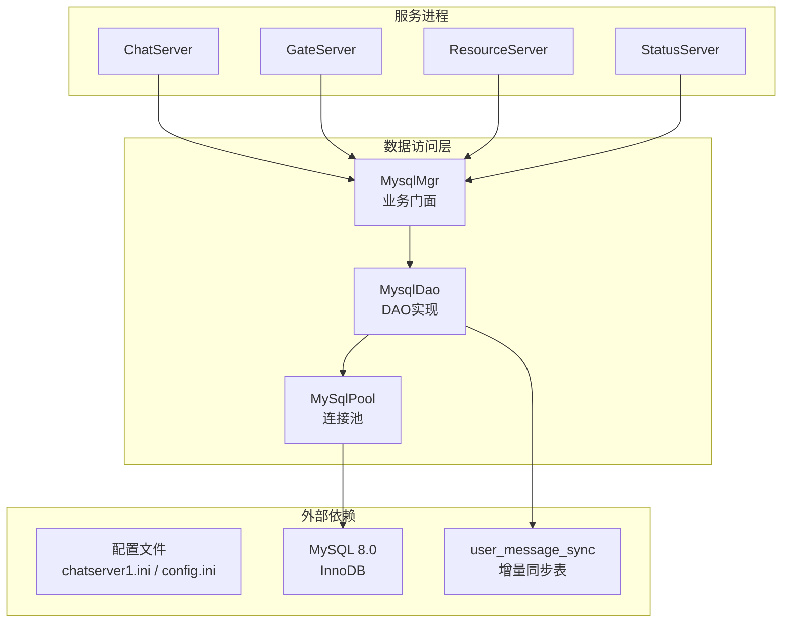
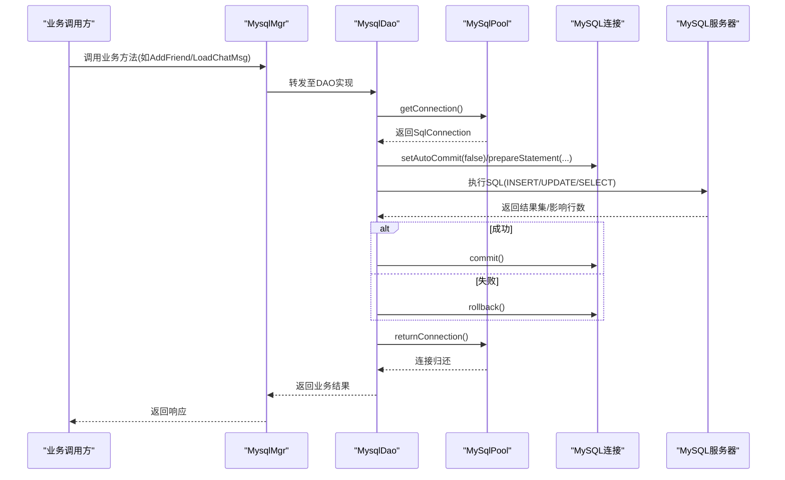
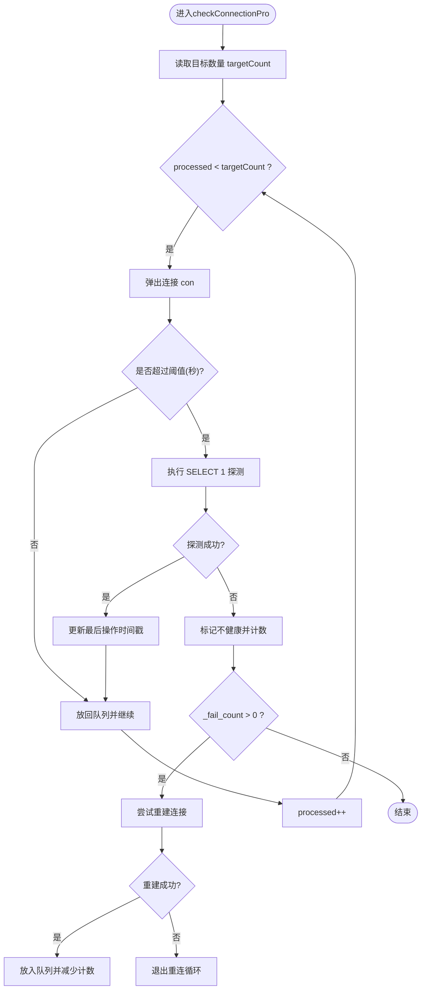
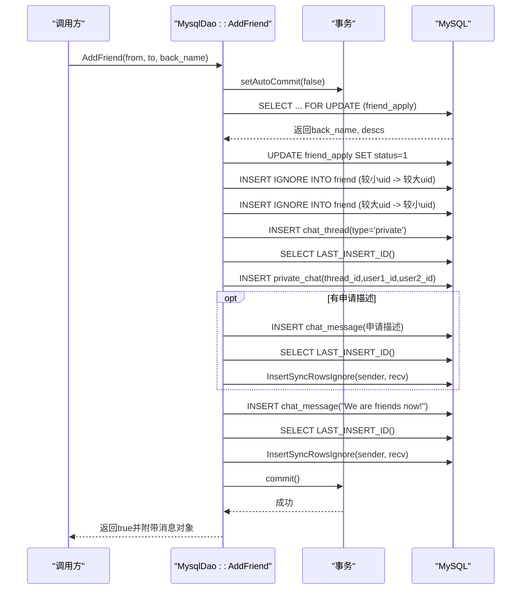
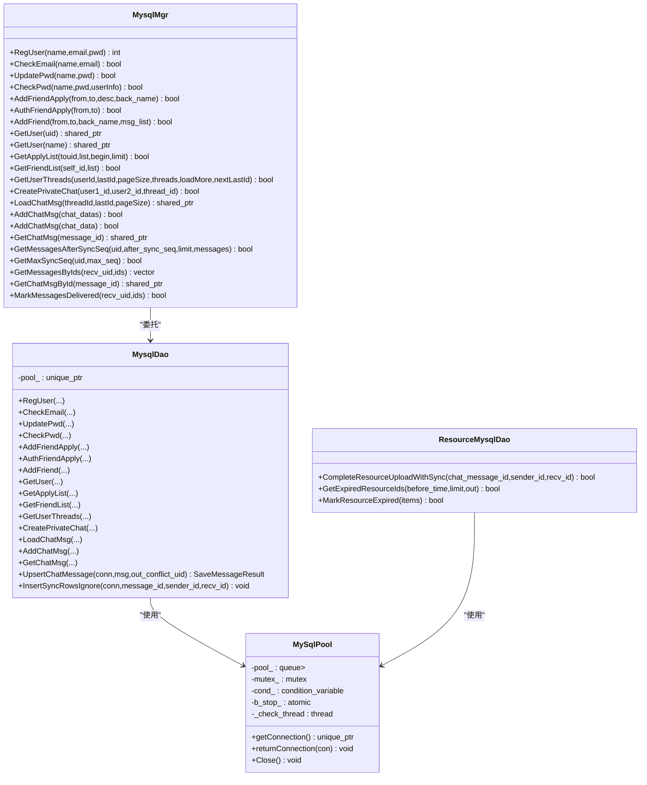
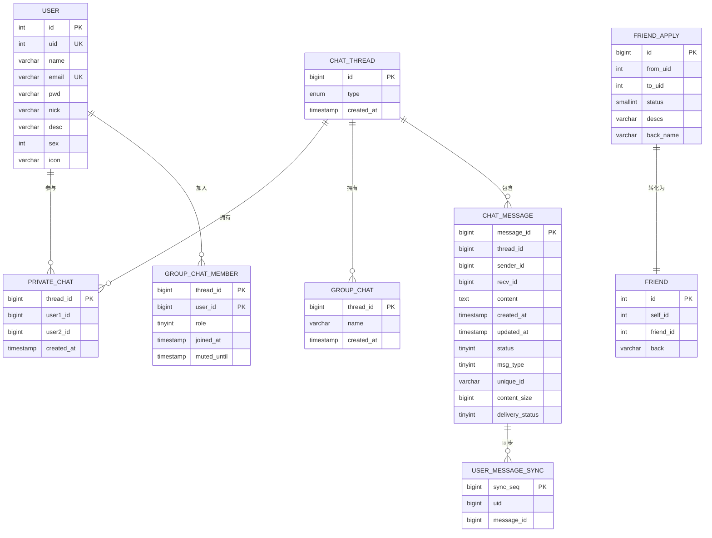

# MySQL数据存储

<cite>
**本文引用的文件**   
- [MysqlMgr.h](file://server/ChatServer/include/MysqlMgr.h)
- [MysqlMgr.cpp](file://server/ChatServer/src/MysqlMgr.cpp)
- [MysqlDao.h](file://server/ChatServer/include/MysqlDao.h)
- [MysqlDao.cpp](file://server/ChatServer/src/MysqlDao.cpp)
- [chatserver1.ini](file://server/ChatServer/config/chatserver1.ini)
- [config.ini（Gate）](file://server/GateServer/config/config.ini)
- [llfc.sql](file://sql备份/llfc.sql)
- [chat_message.sql](file://sql备份/chat_message.sql)
- [20260813_user_message_sync.sql](file://sql备份/20260813_user_message_sync.sql)
- [ResourceServer MysqlDao.h](file://server/ResourceServer/include/MysqlDao.h)
- [ResourceServer MysqlDao.cpp](file://server/ResourceServer/src/MysqlDao.cpp)
</cite>

## 更新摘要
**变更内容**   
- 增强了MysqlDao类的事务性操作，支持原子插入文本消息和系统消息
- 集成了图片资源上传完成时的事务处理，确保资源状态与同步数据的一致性
- 实现了幂等的消息持久化机制，防止重复写入和数据冲突
- 完善了user_message_sync表的同步行机制，提供增量同步能力
- 优化了连接池管理和异常处理，提供更可靠的持久化保证

## 目录
1. [简介](#简介)
2. [项目结构](#项目结构)
3. [核心组件](#核心组件)
4. [架构总览](#架构总览)
5. [详细组件分析](#详细组件分析)
6. [依赖关系分析](#依赖关系分析)
7. [性能与优化](#性能与优化)
8. [故障排查指南](#故障排查指南)
9. [结论](#结论)
10. [附录](#附录)

## 简介
本技术文档聚焦于LLFCChat的MySQL数据存储子系统，覆盖连接池管理、事务处理、SQL优化策略、核心表结构设计及索引优化、数据访问层设计模式与ORM映射、查询构建器实现、数据迁移策略、备份恢复与性能监控方案，以及大数据量下的分库分表与读写分离建议。内容基于代码仓库中的实际实现与数据库脚本进行系统化梳理，帮助读者快速理解并高效扩展该存储层。

## 项目结构
本项目在多个服务中复用相同的MySQL访问模块：
- ChatServer/GateServer/ResourceServer/StatusServer均包含各自的MysqlMgr与MysqlDao，用于封装数据库操作与连接池管理。
- 配置通过INI文件注入（如Host、Port、User、Passwd、Schema），由配置管理器加载后初始化连接池。
- 数据库脚本位于sql备份目录，定义了用户、聊天会话、消息、好友关系等核心表结构与初始数据。

图表来源
- [MysqlMgr.h:1-41](file://server/ChatServer/include/MysqlMgr.h#L1-L41)
- [MysqlDao.h:1-271](file://server/ChatServer/include/MysqlDao.h#L1-L271)
- [chatserver1.ini:14-19](file://server/ChatServer/config/chatserver1.ini#L14-L19)
- [config.ini（Gate）:9-14](file://server/GateServer/config/config.ini#L9-L14)

章节来源
- [MysqlMgr.h:1-41](file://server/ChatServer/include/MysqlMgr.h#L1-L41)
- [MysqlDao.h:1-271](file://server/ChatServer/include/MysqlDao.h#L1-L271)
- [chatserver1.ini:14-19](file://server/ChatServer/config/chatserver1.ini#L14-L19)
- [config.ini（Gate）:9-14](file://server/GateServer/config/config.ini#L9-L14)

## 核心组件
- **MysqlMgr**：面向业务的门面类，统一对外暴露注册、认证、好友申请、好友列表、会话线程、消息加载与写入等接口，内部委托给MysqlDao执行。
- **MysqlDao**：具体数据访问实现，负责SQL语句构造、参数绑定、结果集映射、事务控制、异常处理与连接池交互。该类已添加完整的Doxygen注释，详细说明了每个方法的功能和参数。
- **MySqlPool**：自定义连接池，提供连接的获取与归还、健康检查、自动重连、并发安全与优雅关闭。包含SqlConnection封装类和完整的连接生命周期管理。
- **配置系统**：从INI文件中读取MySQL连接信息，驱动DAO层初始化连接池。

章节来源
- [MysqlMgr.h:1-41](file://server/ChatServer/include/MysqlMgr.h#L1-L41)
- [MysqlMgr.cpp:1-95](file://server/ChatServer/src/MysqlMgr.cpp#L1-L95)
- [MysqlDao.h:279-448](file://server/ChatServer/include/MysqlDao.h#L279-L448)
- [MysqlDao.cpp:1-1349](file://server/ChatServer/src/MysqlDao.cpp#L1-L1349)

## 架构总览
下图展示了从业务调用到数据库执行的完整链路，包括连接池、事务与SQL执行路径。

图表来源
- [MysqlMgr.cpp:1-95](file://server/ChatServer/src/MysqlMgr.cpp#L1-L95)
- [MysqlDao.cpp:247-504](file://server/ChatServer/src/MysqlDao.cpp#L247-L504)
- [MysqlDao.cpp:871-936](file://server/ChatServer/src/MysqlDao.cpp#L871-L936)
- [MysqlDao.h:279-448](file://server/ChatServer/include/MysqlDao.h#L279-L448)

## 详细组件分析

### 连接池管理（MySqlPool）

**更新** 连接池实现已添加完整的Doxygen注释，详细说明了连接生命周期管理和健康检查机制。

- **功能要点**
  - 初始化时按配置创建固定数量的连接，设置schema。
  - 后台线程周期性检测连接健康度，对长时间未操作的连接执行轻量探测（SELECT 1）。
  - 探测失败则标记为不健康并尝试重建连接；重建成功后放回池中。
  - 使用互斥锁与条件变量保证并发安全，支持优雅关闭。
  - SqlConnection类封装单个MySQL连接及其最后操作时间戳，用于健康检测。

- **关键流程**
  - 获取连接：等待非空队列，弹出并返回。
  - 归还连接：加锁入队并通知等待者。
  - 健康检查：遍历池内连接，必要时重建并替换。
  - 自动重连：统计失败次数，循环重试直至恢复或达到限制。

图表来源
- [MysqlDao.h:18-34](file://server/ChatServer/include/MysqlDao.h#L18-L34)
- [MysqlDao.h:36-275](file://server/ChatServer/include/MysqlDao.h#L36-L275)

章节来源
- [MysqlDao.h:18-275](file://server/ChatServer/include/MysqlDao.h#L18-L275)
- [MysqlDao.cpp:1-17](file://server/ChatServer/src/MysqlDao.cpp#L1-L17)

### 事务处理与一致性

**更新** 事务处理逻辑已完善，包含详细的错误处理和死锁避免机制。

- **AddFriend流程（好友认证与建立关系）**
  - 开启事务，锁定申请记录（FOR UPDATE），读取必要字段。
  - 更新申请状态，插入双向好友关系（按uid大小顺序插入避免死锁）。
  - 创建聊天会话（chat_thread）与私聊映射（private_chat）。
  - 可选插入初始消息（申请描述）与"成为好友"的系统消息。
  - 提交事务；异常时回滚并记录错误码（含死锁处理提示）。

- **CreatePrivateChat流程（私聊会话创建）**
  - 先查是否存在，存在则直接返回thread_id。
  - 不存在则插入chat_thread与private_chat，提交事务。
  - 捕获唯一键冲突（error code 1062）时回退查询并重试。

- **新增：原子消息插入与系统消息处理**
  - **UpsertChatMessage**：实现幂等的UPSERT操作，使用`ON DUPLICATE KEY UPDATE message_id = LAST_INSERT_ID(message_id)`确保唯一性。
  - **InsertSyncRowsIgnore**：在同事务中插入双方同步行记录，确保增量同步的一致性。
  - **CompleteResourceUploadWithSync**：在ResourceServer中实现资源上传完成的事务处理，确保资源状态与同步数据的一致性。

图表来源
- [MysqlDao.cpp:247-504](file://server/ChatServer/src/MysqlDao.cpp#L247-L504)
- [MysqlDao.cpp:973-1081](file://server/ChatServer/src/MysqlDao.cpp#L973-L1081)
- [ResourceServer MysqlDao.cpp:98-160](file://server/ResourceServer/src/MysqlDao.cpp#L98-L160)

章节来源
- [MysqlDao.cpp:247-504](file://server/ChatServer/src/MysqlDao.cpp#L247-L504)
- [MysqlDao.cpp:772-869](file://server/ChatServer/src/MysqlDao.cpp#L772-869)
- [MysqlDao.cpp:973-1081](file://server/ChatServer/src/MysqlDao.cpp#L973-L1081)
- [ResourceServer MysqlDao.cpp:98-160](file://server/ResourceServer/src/MysqlDao.cpp#L98-L160)

### SQL优化策略

**更新** SQL优化策略已完善，包含分页游标、索引利用和批量写入的详细实现。

- **分页与游标**
  - GetUserThreads：使用CTE + UNION ALL聚合私聊与群聊成员，ORDER BY thread_id LIMIT pageSize+1，判断loadMore并维护nextLastId。
  - LoadChatMsg：按message_id游标分页，多取一条判断是否还有更多。

- **索引利用**
  - chat_message：主键message_id，复合索引idx_thread_created(thread_id, created_at)、idx_thread_message(thread_id, message_id)。
  - private_chat：唯一键(user1_id, user2_id)，以及user1/user2到thread_id的索引。
  - friend：唯一键(self_id, friend_id)。
  - group_chat_member：主键(thread_id, user_id)，索引idx_user_threads(user_id)。
  - user_message_sync：主键sync_seq，唯一键uk_uid_message(uid, message_id)，索引idx_uid_seq(uid, sync_seq)。

- **批量写入**
  - AddChatMsg(vector)：单条PreparedStatement循环执行，关闭自动提交，批量commit，提升吞吐。

- **新增：幂等UPSERT优化**
  - UpsertChatMessage：使用`ON DUPLICATE KEY UPDATE message_id = LAST_INSERT_ID(message_id)`实现幂等插入。
  - InsertSyncRowsIgnore：使用`INSERT IGNORE`确保同步行记录的幂等性。

章节来源
- [MysqlDao.cpp:681-770](file://server/ChatServer/src/MysqlDao.cpp#L681-L770)
- [MysqlDao.cpp:871-936](file://server/ChatServer/src/MysqlDao.cpp#L871-L936)
- [MysqlDao.cpp:939-1000](file://server/ChatServer/src/MysqlDao.cpp#L939-L1000)
- [MysqlDao.cpp:973-1081](file://server/ChatServer/src/MysqlDao.cpp#L973-L1081)
- [llfc.sql:24-42](file://sql备份/llfc.sql#L24-L42)
- [llfc.sql:409-418](file://sql备份/llfc.sql#L409-L418)
- [llfc.sql:180-187](file://sql备份/llfc.sql#L180-L187)
- [llfc.sql:383-391](file://sql备份/llfc.sql#L383-L391)
- [20260813_user_message_sync.sql:39-46](file://sql备份/20260813_user_message_sync.sql#L39-L46)

### ORM映射与查询构建

**更新** ORM映射和查询构建已完善，包含完整的模型映射和SQL构建策略。

- **模型映射**
  - UserInfo、ApplyInfo、ChatThreadInfo、ChatMessage等结构体由DAO层从ResultSet填充，字段名与列名一一对应。

- **查询构建**
  - 使用std::string拼接SQL，结合PreparedStatement占位符绑定参数，避免SQL注入。
  - 复杂查询采用CTE与UNION ALL组合，减少多次往返。

- **新增：增量同步查询**
  - GetMessagesAfterSyncSeq：基于user_message_sync表的增量同步查询，按sync_seq严格升序返回。
  - GetMaxSyncSeq：获取用户当前最大同步序号作为bootstrap checkpoint。

章节来源
- [MysqlDao.cpp:508-590](file://server/ChatServer/src/MysqlDao.cpp#L508-L590)
- [MysqlDao.cpp:593-633](file://server/ChatServer/src/MysqlDao.cpp#L593-L633)
- [MysqlDao.cpp:681-770](file://server/ChatServer/src/MysqlDao.cpp#L681-L770)
- [MysqlDao.cpp:1113-1171](file://server/ChatServer/src/MysqlDao.cpp#L1113-L1171)
- [MysqlDao.cpp:1173-1202](file://server/ChatServer/src/MysqlDao.cpp#L1173-L1202)

### 数据迁移策略

**更新** 数据迁移策略已完善，包含版本化脚本和自动化部署建议。

- **版本化脚本**
  - 使用sql备份目录中的多版本脚本（llfc.sql、chat_message.sql、20260813_user_message_sync.sql等）进行增量变更与回滚。

- **自动化部署建议**
  - 将DDL/DML脚本纳入CI/CD流水线，按版本号顺序执行，记录执行日志与校验结果。

- **兼容性**
  - 保持字符集utf8mb4与排序规则一致，确保跨平台兼容。

- **新增：增量同步表迁移**
  - user_message_sync表支持幂等创建（CREATE TABLE IF NOT EXISTS），可重复执行迁移脚本。

章节来源
- [llfc.sql:1-756](file://sql备份/llfc.sql#L1-L756)
- [chat_message.sql:1-39](file://sql备份/chat_message.sql#L1-L39)
- [20260813_user_message_sync.sql:1-47](file://sql备份/20260813_user_message_sync.sql#L1-L47)

### 备份恢复与监控

**更新** 备份恢复与监控策略已完善，包含具体的实施建议和监控指标。

- **备份**
  - 使用mysqldump导出全量或增量备份，定期归档并校验完整性。

- **恢复**
  - 在测试环境先行验证恢复流程，再在生产执行，注意外键检查开关与事务一致性。

- **监控**
  - 关注慢查询日志、连接数、锁等待、InnoDB状态指标；结合应用日志定位热点SQL。

- **新增：增量同步监控**
  - 监控user_message_sync表的写入速率和同步延迟。
  - 跟踪GetMessagesAfterSyncSeq查询的性能和结果集大小。

### 大数据量下的分库分表与读写分离

**更新** 分库分表和读写分离策略已完善，包含具体的实施方案和技术建议。

- **分库分表**
  - 按thread_id或user_id哈希分片，保证同一会话的消息在同一分片内，降低跨分片JOIN。
  - 引入全局ID生成器（如雪花算法）替代自增主键，便于水平扩展。

- **读写分离**
  - 写主读从，消息写入主库，拉取历史消息走从库；通过路由层或中间件透明切换。

- **缓存与归档**
  - 热数据（最近会话、好友列表）缓存至Redis；冷数据归档至对象存储或历史库。

- **新增：增量同步优化**
  - 基于user_message_sync表的增量同步机制，减少全量同步的网络开销。
  - 支持客户端断线重连后的增量拉取，提高用户体验。

## 依赖关系分析

**更新** 依赖关系分析已完善，包含组件耦合分析和外部依赖说明。

- **组件耦合**
  - MysqlMgr仅依赖MysqlDao，职责单一，便于替换实现。
  - MysqlDao强依赖MySqlPool，所有数据库操作通过连接池获取连接。

- **外部依赖**
  - MySQL Connector C++用于JDBC风格访问。
  - 配置系统提供连接参数。

- **新增：增量同步依赖**
  - user_message_sync表作为增量同步的数据源，与chat_message表保持数据一致性。
  - ResourceServer与ChatServer通过消息ID进行协作，确保资源上传完成后才可见。

图表来源
- [MysqlMgr.h:8-39](file://server/ChatServer/include/MysqlMgr.h#L8-L39)
- [MysqlDao.h:279-448](file://server/ChatServer/include/MysqlDao.h#L279-L448)
- [MysqlDao.h:18-275](file://server/ChatServer/include/MysqlDao.h#L18-L275)
- [ResourceServer MysqlDao.h:21-40](file://server/ResourceServer/include/MysqlDao.h#L21-L40)

章节来源
- [MysqlMgr.h:1-41](file://server/ChatServer/include/MysqlMgr.h#L1-L41)
- [MysqlDao.h:1-271](file://server/ChatServer/include/MysqlDao.h#L1-L271)
- [ResourceServer MysqlDao.h:1-42](file://server/ResourceServer/include/MysqlDao.h#L1-L42)

## 性能与优化

**更新** 性能优化策略已完善，包含连接池调优、SQL优化和监控指标的详细说明。

- **连接池调优**
  - 根据并发请求峰值调整poolSize，避免过多连接导致上下文切换开销。
  - 合理设置健康检查阈值（当前实现为5秒），平衡资源占用与可用性。

- **SQL优化**
  - 优先使用覆盖索引，减少回表；分页使用游标而非OFFSET。
  - 批量写入合并事务，减少网络往返与锁竞争。

- **存储引擎选择**
  - InnoDB提供事务与行级锁，适合高并发聊天场景；文本字段使用utf8mb4以支持表情与多语言。

- **慢查询分析**
  - 启用慢查询日志，定期分析TOP SQL，补充缺失索引或改写查询。

- **监控指标**
  - 连接池命中率、平均获取耗时、错误率；数据库QPS、TPS、锁等待、缓冲池命中率。

- **新增：增量同步优化**
  - 基于user_message_sync表的增量同步机制，显著减少网络传输和客户端处理开销。
  - 幂等UPSERT操作避免重复写入，提高写入性能。
  - 资源上传完成时才可见的机制，确保数据一致性同时优化用户体验。

## 故障排查指南

**更新** 故障排查指南已完善，包含常见问题诊断和解决步骤。

- **常见问题**
  - 连接池耗尽：检查是否有连接未归还或长事务未提交。
  - 死锁：观察AddFriend流程的锁顺序，确保按uid大小顺序插入；必要时增加重试逻辑。
  - 唯一键冲突：CreatePrivateChat捕获error code 1062，回退查询并返回已存在的thread_id。

- **诊断步骤**
  - 查看应用日志中的SQLException与错误码。
  - 检查MySQL慢查询与锁等待信息。
  - 核对配置文件的Host、Port、User、Passwd、Schema是否正确。

- **新增：增量同步问题排查**
  - 检查user_message_sync表的sync_seq增长是否正常。
  - 验证GetMessagesAfterSyncSeq查询是否能正确获取增量消息。
  - 确认资源上传完成后，对应的同步行记录是否正确插入。

章节来源
- [MysqlDao.cpp:486-504](file://server/ChatServer/src/MysqlDao.cpp#L486-L504)
- [MysqlDao.cpp:837-869](file://server/ChatServer/src/MysqlDao.cpp#L837-869)
- [chatserver1.ini:14-19](file://server/ChatServer/config/chatserver1.ini#L14-L19)
- [MysqlDao.cpp:1113-1171](file://server/ChatServer/src/MysqlDao.cpp#L1113-L1171)

## 结论
LLFCChat的MySQL存储层通过清晰的分层设计（MysqlMgr门面、MysqlDao实现、MySqlPool连接池）实现了高可用、可扩展的数据访问能力。结合合理的表结构设计与索引策略、严格的事务控制与异常处理，能够有效支撑即时通讯场景下的高并发与一致性需求。

**最新增强**：通过引入幂等的消息持久化机制、原子化的事务处理和增量同步能力，系统提供了更可靠的持久化保证。特别是user_message_sync表的引入，使得客户端能够实现高效的增量同步，大幅提升了用户体验和系统性能。

未来可进一步引入分库分表与读写分离，配合完善的监控与自动化运维体系，持续提升系统稳定性与性能。

## 附录

### 核心表结构与索引概览

**更新** 表结构概览已完善，包含完整的ER图和索引说明。

图表来源
- [llfc.sql:467-481](file://sql备份/llfc.sql#L467-L481)
- [llfc.sql:150-155](file://sql备份/llfc.sql#L150-L155)
- [llfc.sql:409-418](file://sql备份/llfc.sql#L409-L418)
- [llfc.sql:364-369](file://sql备份/llfc.sql#L364-L369)
- [llfc.sql:383-391](file://sql备份/llfc.sql#L383-L391)
- [llfc.sql:180-187](file://sql备份/llfc.sql#L180-L187)
- [llfc.sql:295-304](file://sql备份/llfc.sql#L295-L304)
- [llfc.sql:24-42](file://sql备份/llfc.sql#L24-L42)
- [20260813_user_message_sync.sql:39-46](file://sql备份/20260813_user_message_sync.sql#L39-L46)