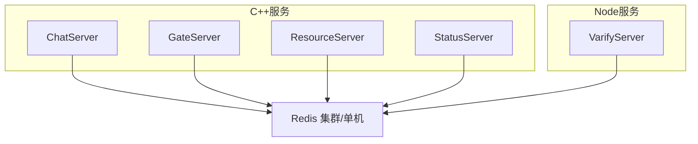
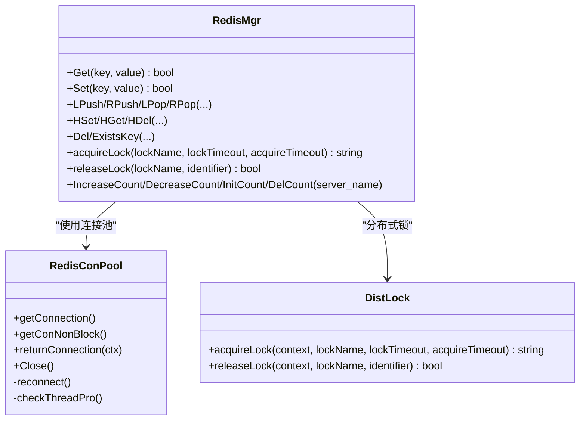
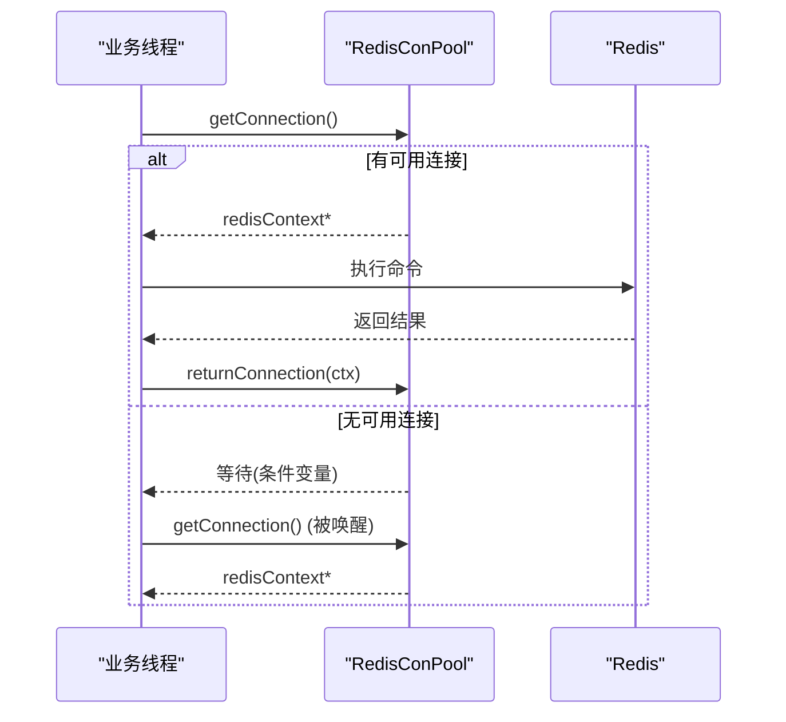
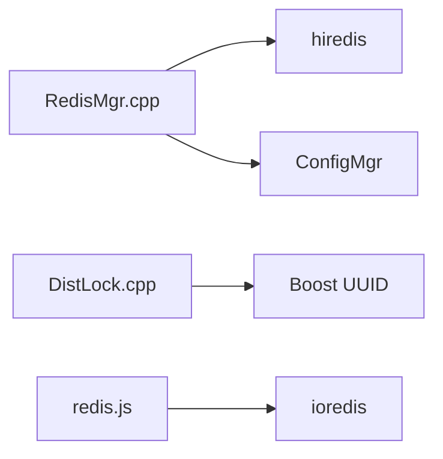

# Redis缓存策略

<cite>
**本文引用的文件**
- [RedisMgr.h](file://server/ChatServer/include/RedisMgr.h)
- [RedisMgr.cpp](file://server/ChatServer/src/RedisMgr.cpp)
- [DistLock.h](file://server/ChatServer/include/DistLock.h)
- [DistLock.cpp](file://server/ChatServer/src/DistLock.cpp)
- [const.h](file://server/ChatServer/include/const.h)
- [chatserver1.ini](file://server/ChatServer/config/chatserver1.ini)
- [config.ini（Gate）](file://server/GateServer/config/config.ini)
- [config.ini（Status）](file://server/StatusServer/config/config.ini)
- [redis.js（VarifyServer）](file://server/VarifyServer/redis.js)
- [day35心跳逻辑.md](file://开发文档/day35心跳逻辑.md)
</cite>

## 目录
1. [简介](#简介)
2. [项目结构](#项目结构)
3. [核心组件](#核心组件)
4. [架构总览](#架构总览)
5. [详细组件分析](#详细组件分析)
6. [依赖关系分析](#依赖关系分析)
7. [性能与内存管理](#性能与内存管理)
8. [故障处理与高可用](#故障处理与高可用)
9. [键命名规范与过期策略](#键命名规范与过期策略)
10. [数据一致性保证](#数据一致性保证)
11. [缓存预热、失效与故障转移](#缓存预热失效与故障转移)
12. [高并发问题治理：穿透、雪崩、击穿](#高并发问题治理穿透雪崩击穿)
13. [监控与调优建议](#监控与调优建议)
14. [结论](#结论)

## 简介
本技术文档围绕 LLFCChat 的 Redis 缓存系统，系统性阐述连接池管理、序列化格式、缓存策略设计，以及用户会话缓存、好友关系缓存、在线状态缓存的实现方案。同时给出键命名规范、过期策略、一致性保障机制，覆盖缓存预热、失效处理与故障转移细节，并提供配置调优、内存管理与性能监控的最佳实践，以及在高并发场景下对缓存穿透、雪崩、击穿的解决方案。

## 项目结构
LLFCChat 在多个服务中复用统一的 Redis 抽象层：
- ChatServer、GateServer、ResourceServer、StatusServer 均包含 RedisMgr 与 RedisConPool 实现，用于连接池与命令封装。
- VarifyServer 使用 Node.js ioredis 客户端进行验证码等辅助功能。
- 常量定义集中存放于 const.h，统一了键前缀与分布式锁参数。
- 配置文件通过 ini 提供 Redis 主机、端口、密码等参数。

图表来源
- [RedisMgr.h](file://server/ChatServer/include/RedisMgr.h)
- [RedisMgr.cpp](file://server/ChatServer/src/RedisMgr.cpp)
- [redis.js（VarifyServer）](file://server/VarifyServer/redis.js)

章节来源
- [chatserver1.ini](file://server/ChatServer/config/chatserver1.ini)
- [config.ini（Gate）](file://server/GateServer/config/config.ini)
- [config.ini（Status）](file://server/StatusServer/config/config.ini)

## 核心组件
- RedisConPool：基于 hiredis 的连接池，负责连接创建、认证、获取/归还、空闲检测、异常重连与资源清理。
- RedisMgr：对外暴露 Get/Set/LPush/RPush/HSet/HGet/HDel/Del/ExistsKey 等原子操作，以及分布式锁 acquire/release 和登录计数统计。
- DistLock：基于 SET NX EX + Lua 脚本的分布式锁实现，确保跨进程/跨服务的互斥访问。
- 常量与配置：统一键前缀（如 USER_SESSION_PREFIX、USERIPPREFIX、LOGIN_COUNT、LOCK_PREFIX 等）与锁超时参数。

章节来源
- [RedisMgr.h](file://server/ChatServer/include/RedisMgr.h)
- [RedisMgr.cpp](file://server/ChatServer/src/RedisMgr.cpp)
- [DistLock.h](file://server/ChatServer/include/DistLock.h)
- [DistLock.cpp](file://server/ChatServer/src/DistLock.cpp)
- [const.h](file://server/ChatServer/include/const.h)

## 架构总览
整体采用“服务进程内单例 RedisMgr + 连接池”模式，所有 Redis 访问通过统一接口完成；分布式锁由 DistLock 提供；业务侧（如心跳、踢人、登录计数）通过 RedisMgr 调用。

图表来源
- [RedisMgr.h](file://server/ChatServer/include/RedisMgr.h)
- [DistLock.h](file://server/ChatServer/include/DistLock.h)

章节来源
- [RedisMgr.h](file://server/ChatServer/include/RedisMgr.h)
- [RedisMgr.cpp](file://server/ChatServer/src/RedisMgr.cpp)
- [DistLock.cpp](file://server/ChatServer/src/DistLock.cpp)

## 详细组件分析

### 连接池与生命周期管理
- 初始化：构造时按配置创建固定数量连接并执行 AUTH。
- 获取/归还：线程安全队列，条件变量唤醒等待者；非阻塞获取用于健康检查。
- 健康检查：后台线程周期性 PING，失败连接释放并计数，随后尝试重建连接。
- 关闭：设置停止标志，通知所有等待线程，回收全部连接。

图表来源
- [RedisMgr.h](file://server/ChatServer/include/RedisMgr.h)

章节来源
- [RedisMgr.h](file://server/ChatServer/include/RedisMgr.h)

### 分布式锁实现
- 加锁：SET key identifier NX EX timeout，带唯一标识与过期时间，避免死锁。
- 解锁：EVAL Lua 脚本比较标识后删除，保证仅持有者可释放。
- 重试：在 acquireTimeout 内轮询，间隔短睡眠降低竞争。

图表来源
- [DistLock.cpp](file://server/ChatServer/src/DistLock.cpp)

章节来源
- [DistLock.cpp](file://server/ChatServer/src/DistLock.cpp)

### 命令封装与错误处理
- 所有命令从连接池获取上下文，执行后统一 freeReplyObject 并归还连接。
- 返回值类型校验（STRING/INTEGER/NIL/STATUS），失败路径打印日志并返回 false/空串。
- 使用 Defer 模式确保异常路径也能归还连接。

章节来源
- [RedisMgr.cpp](file://server/ChatServer/src/RedisMgr.cpp)

### 登录计数与服务器负载统计
- 使用 HASH 存储各服务名对应的当前连接数，定时任务汇总写入。
- 增删计数通过分布式锁保护，避免并发竞态。

章节来源
- [RedisMgr.cpp](file://server/ChatServer/src/RedisMgr.cpp)
- [day35心跳逻辑.md](file://开发文档/day35心跳逻辑.md)

## 依赖关系分析
- C++ 服务依赖 hiredis 库进行网络 I/O 与协议解析。
- RedisMgr 依赖 ConfigMgr 读取 Redis 配置（Host/Port/Passwd）。
- DistLock 依赖 Boost UUID 生成唯一标识。
- VarifyServer 依赖 ioredis 提供异步 API。

图表来源
- [RedisMgr.cpp](file://server/ChatServer/src/RedisMgr.cpp)
- [DistLock.cpp](file://server/ChatServer/src/DistLock.cpp)
- [redis.js（VarifyServer）](file://server/VarifyServer/redis.js)

章节来源
- [RedisMgr.cpp](file://server/ChatServer/src/RedisMgr.cpp)
- [DistLock.cpp](file://server/ChatServer/src/DistLock.cpp)
- [redis.js（VarifyServer）](file://server/VarifyServer/redis.js)

## 性能与内存管理
- 连接池大小：ChatServer 默认 10，GateServer 默认 5，可按 QPS 与延迟目标调整。
- 命令开销：尽量使用批量命令或管道减少往返；当前实现多为单条命令，可在热点路径优化。
- 内存释放：每次命令后显式 freeReplyObject，避免内存泄漏。
- 心跳与健康检查：后台线程每 60 秒触发一次全量 PING，失败连接及时重建。

章节来源
- [RedisMgr.cpp](file://server/ChatServer/src/RedisMgr.cpp)
- [RedisMgr.h](file://server/ChatServer/include/RedisMgr.h)

## 故障处理与高可用
- 连接失败：getConnection 返回 nullptr，上层快速失败；健康检查线程持续重建。
- 认证失败：AUTH 失败跳过该连接，记录日志。
- 重连策略：checkThreadPro 统计失败数，循环尝试 reconnect，直至恢复或达到上限。
- 优雅关闭：Close 设置停止位，唤醒等待线程，join 检查线程，释放所有连接。

章节来源
- [RedisMgr.h](file://server/ChatServer/include/RedisMgr.h)
- [RedisMgr.cpp](file://server/ChatServer/src/RedisMgr.cpp)

## 键命名规范与过期策略
- 键前缀与用途（来自 const.h）：
  - USER_SESSION_PREFIX：用户会话信息（usession_）
  - USERIPPREFIX：用户IP绑定（uip_）
  - USERTOKENPREFIX：令牌（utoken_）
  - IPCOUNTPREFIX：IP计数（ipcount_）
  - USER_BASE_INFO：基础用户信息（ubaseinfo_）
  - NAME_INFO：名称索引（nameinfo_）
  - LOGIN_COUNT：各服务登录计数（logincount）
  - LOCK_PREFIX：分布式锁前缀（lock_）
- 过期策略：
  - 会话与令牌建议使用 EX/PX 设置 TTL，结合心跳刷新。
  - 登录计数为持久型 HASH，不设置过期。
  - 分布式锁通过 EX 自动过期，防止死锁。

章节来源
- [const.h](file://server/ChatServer/include/const.h)
- [redis.js（VarifyServer）](file://server/VarifyServer/redis.js)

## 数据一致性保证
- 分布式锁：加锁-执行业务-解锁三段式，Lua 脚本保证判断与删除原子性。
- 会话一致性：心跳周期内以 Redis 中的 session_id 为准，多端登录冲突时以最新为准。
- 计数一致性：登录计数更新前加锁，避免并发叠加或丢失。

章节来源
- [DistLock.cpp](file://server/ChatServer/src/DistLock.cpp)
- [RedisMgr.cpp](file://server/ChatServer/src/RedisMgr.cpp)
- [day35心跳逻辑.md](file://开发文档/day35心跳逻辑.md)

## 缓存预热、失效与故障转移
- 预热：服务启动后可根据热点键（如热门用户信息、常用配置）批量加载至 Redis。
- 失效：业务变更时主动 Del/HDel 对应键；会话类键通过 TTL 自然失效。
- 故障转移：连接池健康检查与自动重连；若 Redis 不可用，上层应降级（如本地缓存或限流）。

章节来源
- [RedisMgr.h](file://server/ChatServer/include/RedisMgr.h)
- [RedisMgr.cpp](file://server/ChatServer/src/RedisMgr.cpp)

## 高并发问题治理：穿透、雪崩、击穿
- 穿透（查询不存在的数据）：
  - 布隆过滤器拦截非法键；或为不存在键设置短 TTL 的空值占位。
- 雪崩（大量键同时过期）：
  - 过期时间加入随机抖动；热点键采用逻辑过期+后台异步重建。
- 击穿（热点键瞬时失效）：
  - 加分布式锁保证只有一线程回源重建；或使用互斥信号量控制重建并发。

[本节为通用策略说明，不直接分析具体文件]

## 监控与调优建议
- 关键指标：
  - 连接池大小、活跃连接数、命中率、平均/尾延迟、错误率、重连次数。
- 配置调优：
  - 连接池大小按峰值 QPS×平均 RT/1s 估算；适当增大以减少等待。
  - 合理设置心跳与健检频率，平衡 CPU 与可靠性。
- 监控手段：
  - 采集 Redis 服务端 stats（connected_clients、keyspace_hits/misses、used_memory）。
  - 应用侧埋点：命令耗时、失败次数、锁等待时长。

[本节为通用指导，不直接分析具体文件]

## 结论
LLFCChat 的 Redis 子系统以连接池为核心，配合分布式锁与统一命令封装，实现了稳定可靠的缓存与状态管理能力。通过规范的键命名、合理的过期策略与健壮的错误处理，支撑了会话、在线状态与计数等关键场景。面向高并发与高可用，建议进一步引入批量/管道、热点键保护、多级缓存与完善的监控告警体系，持续提升系统吞吐与稳定性。