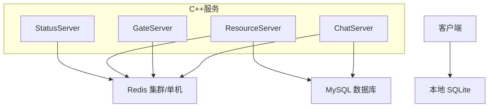
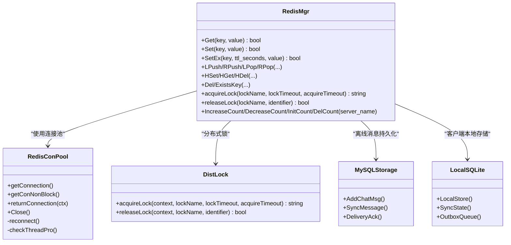
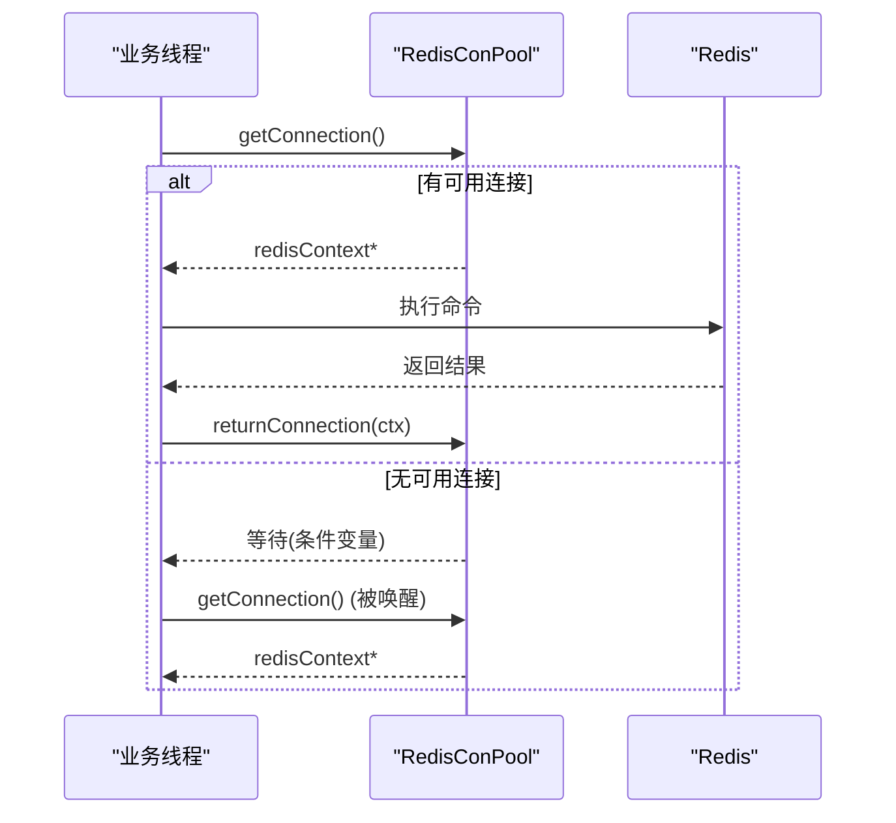
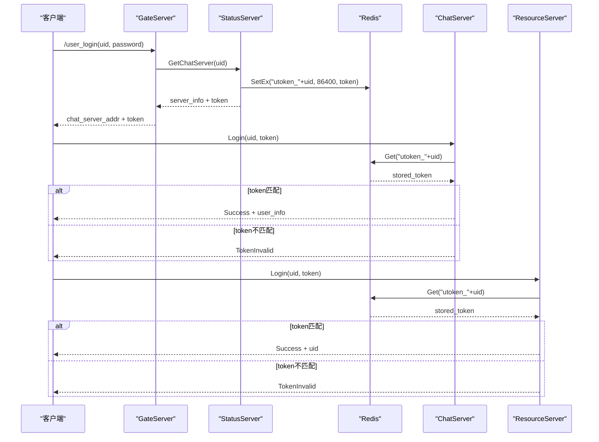
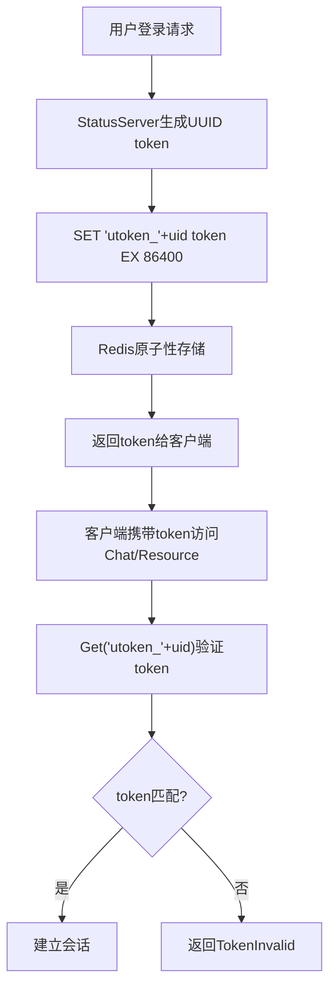
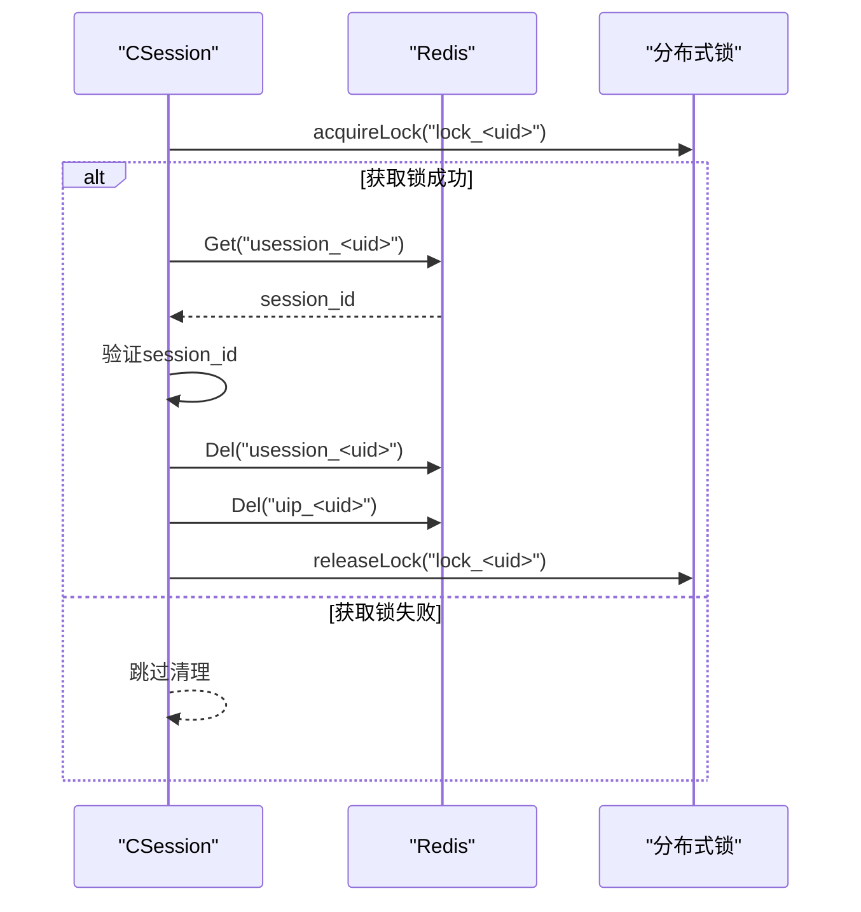
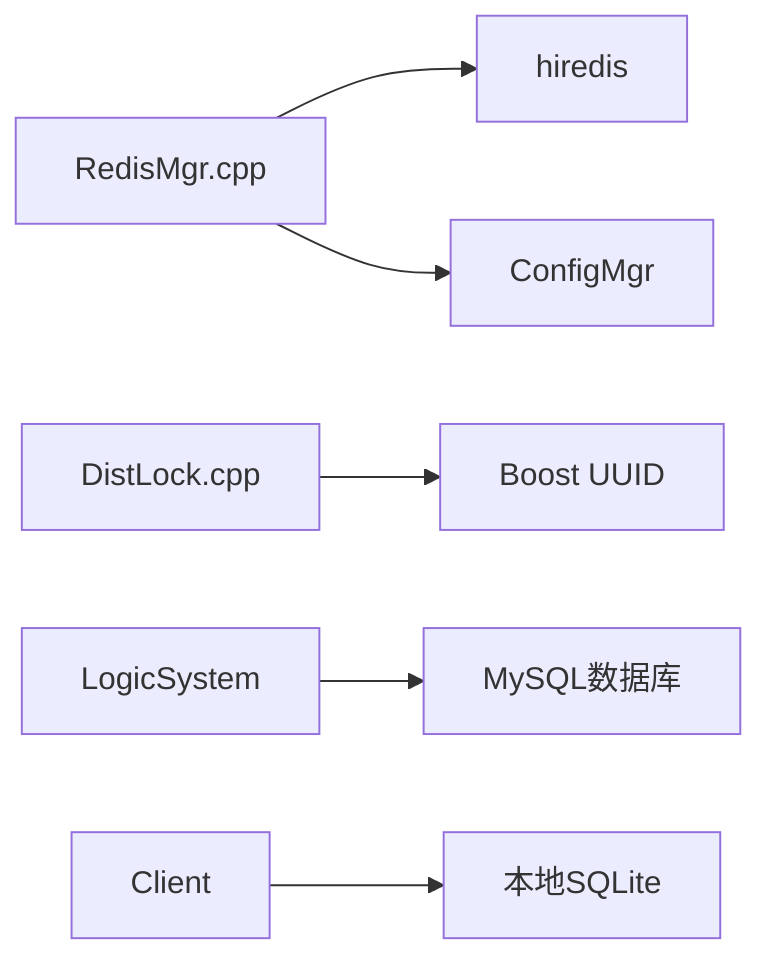

# Redis缓存策略

<cite>
**本文引用的文件**
- [RedisMgr.h](file://server/ChatServer/include/RedisMgr.h)
- [RedisMgr.cpp](file://server/ChatServer/src/RedisMgr.cpp)
- [StatusServiceImpl.cpp](file://server/StatusServer/src/StatusServiceImpl.cpp)
- [LogicSystem.cpp](file://server/ChatServer/src/LogicSystem.cpp)
- [LogicWorker.cpp](file://server/ResourceServer/src/LogicWorker.cpp)
- [const.h](file://server/ChatServer/include/const.h)
- [CSession.cpp](file://server/ChatServer/src/CSession.cpp)
- [CServer.cpp](file://server/ChatServer/src/CServer.cpp)
- [DistLock.h](file://server/common/include/DistLock.h)
- [DistLock.cpp](file://server/common/src/DistLock.cpp)
- [RedisMgr.cpp](file://server/StatusServer/src/RedisMgr.cpp)
- [RedisMgr.cpp](file://server/GateServer/src/RedisMgr.cpp)
- [RedisMgr.cpp](file://server\ResourceServer\src/RedisMgr.cpp)
- [im_redis.cpp](file://tests/integration/im_redis.cpp)
- [AGENTS.md](file://AGENTS.md)
</cite>

## 更新摘要
**变更内容**   
- **移除离线消息队列功能**：完全移除了Redis在离线消息处理中的核心作用，不再使用offline_msg ZSET进行消息排队
- **简化Redis用途**：Redis现在仅用于会话管理和负载均衡统计，大幅简化了系统架构
- **消息持久化迁移**：离线消息处理已迁移到MySQL数据库和客户端本地SQLite存储方案
- **Token验证机制优化**：保持简化的utoken_<uid>键存储方案，TTL统一为86400秒（24小时）
- **SET ... EX语法升级**：所有服务的Redis管理器已全面升级到新的SET ... EX语法

## 目录
1. [简介](#简介)
2. [项目结构](#项目结构)
3. [核心组件](#核心组件)
4. [架构总览](#架构总览)
5. [详细组件分析](#详细组件分析)
6. [依赖关系分析](#依赖关系分析)
7. [性能与内存管理](#性能与内存管理)
8. [故障处理与高可用](#故障处理与高可用)
9. [键命名规范与过期策略](#键命名规范与过期策略)
10. [数据一致性保证](#数据一致性保证)
11. [缓存预热、失效与故障转移](#缓存预热失效与故障转移)
12. [高并发问题治理：穿透、雪崩、击穿](#高并发问题治理穿透雪崩击穿)
13. [监控与调优建议](#监控与调优建议)
14. [结论](#结论)

## 简介
本技术文档围绕 LLFCChat 的 Redis 缓存系统，系统性阐述连接池管理、序列化格式、缓存策略设计，以及用户会话缓存、好友关系缓存、在线状态缓存的实现方案。随着系统架构的重大更新，Redis已从复杂的离线消息队列系统中解耦，专注于会话管理和负载均衡统计的核心职责。

**重大架构变更** 系统已完全移除Redis在离线消息处理中的核心作用，不再使用offline_msg ZSET进行消息排队。离线消息处理已迁移到MySQL数据库和客户端本地SQLite存储方案，通过增量同步机制（1051/1052协议）实现可靠的消息传递。Redis现在专注于会话管理、Token验证和负载均衡统计等轻量级任务。

**最新技术升级** 所有Redis管理器已全面升级到新的SET ... EX语法，替代了已废弃的SETEX命令，确保与新版Redis的完全兼容性，同时提供更好的性能和未来兼容性。

## 项目结构
LLFCChat 在多个服务中复用统一的 Redis 抽象层，但功能范围已大幅精简：
- ChatServer、GateServer、ResourceServer、StatusServer 均包含 RedisMgr 与 RedisConPool 实现，用于连接池与命令封装
- 常量定义集中存放于 const.h，统一了键前缀与分布式锁参数
- 配置文件通过 ini 提供 Redis 主机、端口、密码等参数
- 离线消息处理已完全从Redis中移除，迁移到MySQL和客户端本地存储

**图表来源**
- [RedisMgr.h](file://server/ChatServer/include/RedisMgr.h)
- [RedisMgr.cpp](file://server/ChatServer/src/RedisMgr.cpp)
- [AGENTS.md:54-60](file://AGENTS.md#L54-L60)

**章节来源**
- [const.h](file://server/ChatServer/include/const.h)
- [AGENTS.md:54-60](file://AGENTS.md#L54-L60)

## 核心组件
- **RedisConPool**：基于 hiredis 的连接池，负责连接创建、认证、获取/归还、空闲检测、异常重连与资源清理
- **RedisMgr**：对外暴露 Get/Set/SetEx/LPush/RPush/HSet/HGet/HDel/Del/ExistsKey 等原子操作，以及分布式锁 acquire/release、登录计数统计
- **DistLock**：基于 SET NX EX + Lua 脚本的分布式锁实现，确保跨进程/跨服务的互斥访问
- **常量与配置**：统一键前缀（如 USER_SESSION_PREFIX、USERIPPREFIX、USERTOKENPREFIX、LOGIN_COUNT、LOCK_PREFIX 等）与锁超时参数

**重要更新** Redis功能范围已大幅精简，移除了所有离线消息相关的ZSET操作（ZAdd、ZRangeByScore、ZRem等），专注于会话管理、Token验证和负载均衡统计。离线消息处理已完全迁移到MySQL数据库和客户端本地SQLite存储方案。

**章节来源**
- [RedisMgr.h](file://server/ChatServer/include/RedisMgr.h)
- [RedisMgr.cpp](file://server/ChatServer/src/RedisMgr.cpp)
- [const.h](file://server/ChatServer/include/const.h)

## 架构总览
整体采用"服务进程内单例 RedisMgr + 连接池"模式，所有 Redis 访问通过统一接口完成；分布式锁由 DistLock 提供；业务侧（如心跳、踢人、登录计数）通过 RedisMgr 调用。离线消息处理已完全从Redis中移除，改为基于MySQL和客户端本地SQLite的增量同步机制。

**图表来源**
- [RedisMgr.h](file://server/ChatServer/include/RedisMgr.h)
- [DistLock.h](file://server/common/include/DistLock.h)
- [AGENTS.md:54-60](file://AGENTS.md#L54-L60)

**章节来源**
- [RedisMgr.h](file://server/ChatServer/include/RedisMgr.h)
- [RedisMgr.cpp](file://server/ChatServer/src/RedisMgr.cpp)

## 详细组件分析

### 连接池与生命周期管理
- **初始化**：构造时按配置创建固定数量连接并执行 AUTH
- **获取/归还**：线程安全队列，条件变量唤醒等待者；非阻塞获取用于健康检查
- **健康检查**：后台线程周期性 PING，失败连接释放并计数，随后尝试重建连接
- **关闭**：设置停止标志，通知所有等待线程，回收全部连接

**章节来源**
- [RedisMgr.cpp](file://server/ChatServer/src/RedisMgr.cpp)

### 分布式锁实现
- **加锁**：SET key identifier NX EX timeout，带唯一标识与过期时间，避免死锁
- **解锁**：EVAL Lua 脚本比较标识后删除，保证仅持有者可释放
- **重试**：在 acquireTimeout 内轮询，间隔短睡眠降低竞争

**图表来源**
- [DistLock.cpp](file://server/common/src/DistLock.cpp)

**章节来源**
- [DistLock.cpp](file://server/common/src/DistLock.cpp)

### 简化的Token验证机制

**架构简化** 系统保持了简化的Token验证机制，采用统一的utoken_<uid>键存储方案：

#### Token生成与存储（StatusServer）
- **生成唯一token**：使用UUID生成器创建随机token字符串
- **原子性存储**：通过SetEx命令将token存储在`utoken_<uid>`键中，TTL设置为86400秒（24小时）
- **错误处理**：Redis失败时返回RPCFailed错误码

#### Token验证（ChatServer & ResourceServer）
- **统一验证逻辑**：所有服务都从Redis中读取`utoken_<uid>`键进行验证
- **严格匹配**：必须存在且值完全匹配请求中的token
- **失败处理**：缺失或不匹配一律返回TokenInvalid错误，不建立会话

**图表来源**
- [StatusServiceImpl.cpp](file://server/StatusServer/src/StatusServiceImpl.cpp)
- [LogicSystem.cpp](file://server/ChatServer/src/LogicSystem.cpp)
- [LogicWorker.cpp](file://server/ResourceServer/src/LogicWorker.cpp)

**章节来源**
- [StatusServiceImpl.cpp](file://server/StatusServer/src/StatusServiceImpl.cpp)
- [LogicSystem.cpp](file://server/ChatServer/src/LogicSystem.cpp)
- [LogicWorker.cpp](file://server/ResourceServer/src/LogicWorker.cpp)

### SetEx方法与原子性操作

**重要更新** 所有服务的Redis管理器已全面升级到新的SET ... EX语法：

#### 新语法实现
- **ChatServer**: `redisCommand(connect, "SET %s %s EX %d", key.c_str(), value.c_str(), ttl_seconds)`
- **StatusServer**: `redisCommand(connect, "SET %s %s EX %d", key.c_str(), value.c_str(), ttl_seconds)`
- **ResourceServer**: `redisCommand(connect, "SET %s %s EX %d", key.c_str(), value.c_str(), expire_seconds)`
- **GateServer**: 使用标准的Set方法，不带过期时间

#### 语法对比
- **旧语法（已废弃）**：`SETEX key seconds value`
- **新语法（推荐）**：`SET key value EX seconds`

#### 优势特性
- **原子性保证**：SET ... EX命令同时设置值和过期时间，避免竞态条件
- **统一TTL**：所有token的TTL统一为86400秒（24小时），简化过期管理
- **自动清理**：过期时间到期后自动删除，无需手动清理
- **兼容性**：与新版Redis完全兼容，支持未来的语法扩展

**图表来源**
- [RedisMgr.cpp](file://server/ChatServer/src/RedisMgr.cpp)
- [RedisMgr.cpp](file://server/StatusServer/src/RedisMgr.cpp)
- [RedisMgr.cpp](file://server\ResourceServer\src/RedisMgr.cpp)

**章节来源**
- [RedisMgr.cpp](file://server/ChatServer/src/RedisMgr.cpp)
- [RedisMgr.cpp](file://server/StatusServer/src/RedisMgr.cpp)
- [RedisMgr.cpp](file://server\ResourceServer\src/RedisMgr.cpp)

### 会话管理与在线状态

**核心功能保留** 会话管理仍然是Redis的核心用途之一：

#### 会话存储与管理
- **会话ID映射**：使用`usession_<uid>`键存储用户的当前会话ID
- **IP绑定信息**：使用`uip_<uid>`键存储用户IP地址信息
- **会话清理**：通过分布式锁保护会话清理过程，防止并发冲突
- **心跳检测**：定期检测会话心跳，清理超时会话

#### 异常会话处理
- **分布式锁保护**：使用`lock_<uid>`键进行会话清理的互斥访问
- **会话一致性检查**：确保清理的是正确的会话实例
- **多端登录处理**：支持异地登录时的会话冲突处理

**图表来源**
- [CSession.cpp:423-452](file://server/ChatServer/src/CSession.cpp#L423-L452)

**章节来源**
- [CSession.cpp](file://server/ChatServer/src/CSession.cpp)
- [CServer.cpp](file://server/ChatServer/src/CServer.cpp)

### 负载均衡统计

**统计功能保留** Redis继续承担负载均衡统计的职责：

#### 服务器负载监控
- **连接数统计**：使用HASH结构存储各ChatServer节点的当前连接数
- **IP计数**：使用`ipcount_<ip>`键统计每个IP的连接数量
- **定时汇总**：定期将内存中的统计信息汇总写入Redis
- **负载均衡决策**：基于统计信息进行服务器选择

#### 服务发现支持
- **心跳键维护**：使用`chatserver_heartbeat:<server_ip>`键维护服务节点存活状态
- **节点信息管理**：使用`chatserver_info`键存储服务节点详细信息
- **健康检查**：通过心跳键判断服务节点可用性

**章节来源**
- [RedisMgr.cpp](file://server/ChatServer/src/RedisMgr.cpp)

## 依赖关系分析
- **C++ 服务**依赖 hiredis 库进行网络 I/O 与协议解析
- **RedisMgr**依赖 ConfigMgr 读取 Redis 配置（Host/Port/Passwd）
- **DistLock**依赖 Boost UUID 生成唯一标识
- **MySQL集成**：离线消息持久化依赖MySQL数据库
- **客户端本地存储**：依赖SQLite进行本地消息缓存

**图表来源**
- [RedisMgr.cpp](file://server/ChatServer/src/RedisMgr.cpp)
- [DistLock.cpp](file://server/common/src/DistLock.cpp)
- [AGENTS.md:54-60](file://AGENTS.md#L54-L60)

**章节来源**
- [RedisMgr.cpp](file://server/ChatServer/src/RedisMgr.cpp)
- [DistLock.cpp](file://server/common/src/DistLock.cpp)
- [AGENTS.md:54-60](file://AGENTS.md#L54-L60)

## 性能与内存管理
- **连接池大小**：ChatServer 默认 10，可按 QPS 与延迟目标调整
- **命令开销**：SetEx命令具有原子性，避免了额外的EXPIRE命令调用
- **内存释放**：每次命令后显式 freeReplyObject，避免内存泄漏
- **心跳与健康检查**：后台线程每 60 秒触发一次全量 PING，失败连接及时重建

**性能优化成果** 移除离线消息队列功能后，Redis的内存占用显著降低，命令复杂度大幅下降。由于不再需要维护大量的ZSET数据结构，Redis的性能得到了显著提升。

**最新优化** 新的SET ... EX语法相比旧的SETEX命令提供了更好的性能和未来兼容性，同时保持了相同的功能特性。

**章节来源**
- [RedisMgr.cpp](file://server/ChatServer/src/RedisMgr.cpp)
- [RedisMgr.h](file://server/ChatServer/include/RedisMgr.h)

## 故障处理与高可用
- **连接失败**：getConnection 返回 nullptr，上层快速失败；健康检查线程持续重建
- **认证失败**：AUTH 失败跳过该连接，记录日志
- **重连策略**：checkThreadPro 统计失败数，循环尝试 reconnect，直至恢复或达到上限
- **优雅关闭**：Close 设置停止位，唤醒等待线程，join 检查线程，释放所有连接

**故障处理改进** 由于功能简化，故障处理逻辑也相应简化。Token验证失败时，系统会立即返回TokenInvalid错误，不会建立任何会话，确保了安全性。

**最新改进** 新的SET ... EX语法在故障情况下提供了更好的错误报告和恢复能力。

**章节来源**
- [RedisMgr.h](file://server/ChatServer/include/RedisMgr.h)
- [RedisMgr.cpp](file://server/ChatServer/src/RedisMgr.cpp)

## 键命名规范与过期策略
- **键前缀与用途**（来自 const.h）：
  - USER_SESSION_PREFIX：用户会话信息（usession_）
  - USERIPPREFIX：用户IP绑定（uip_）
  - USERTOKENPREFIX：**用户令牌（utoken_）** - 简化后的统一token存储
  - IPCOUNTPREFIX：IP计数（ipcount_）
  - USER_BASE_INFO：基础用户信息（ubaseinfo_）
  - NAME_INFO：名称索引（nameinfo_）
  - LOGIN_COUNT：各服务登录计数（logincount）
  - LOCK_PREFIX：分布式锁前缀（lock_）
  - CHATSERVER_HEARTBEAT_PREFIX：ChatServer心跳键（chatserver_heartbeat:）
  - CHATSERVER_INFO_KEY：ChatServer节点信息（chatserver_info）

**重大架构变更** 移除了OFFLINE_MSG_PREFIX相关的所有键定义和操作，因为离线消息处理已完全从Redis中移除。

- **过期策略**：
  - **Token统一TTL**：所有utoken_*键的TTL统一设置为86400秒（24小时）
  - 会话与令牌建议使用 EX/PX 设置 TTL，结合心跳刷新
  - 登录计数为持久型 HASH，不设置过期
  - 分布式锁通过 EX 自动过期，防止死锁
  - 心跳键通过 SetWithExpire() 设置TTL，自动清理过期节点

**最新升级** 所有TTL设置现在都使用新的SET ... EX语法，确保与新版Redis的完全兼容性。

**章节来源**
- [const.h](file://server/ChatServer/include/const.h)

## 数据一致性保证
- **分布式锁**：加锁-执行业务-解锁三段式，Lua 脚本保证判断与删除原子性
- **会话一致性**：心跳周期内以 Redis 中的 session_id 为准，多端登录冲突时以最新为准
- **计数一致性**：登录计数更新前加锁，避免并发叠加或丢失
- **Token一致性**：**SetEx命令确保token设置的原子性，Get验证确保token匹配的准确性**

**数据一致性简化** 由于移除了复杂的离线消息队列逻辑，数据一致性保证相对简化。主要关注点集中在会话管理和Token验证的一致性上。

**最新改进** 新的SET ... EX语法提供了更强的原子性保证和更好的错误处理能力。

**章节来源**
- [DistLock.cpp](file://server/common/src/DistLock.cpp)
- [RedisMgr.cpp](file://server/ChatServer/src/RedisMgr.cpp)

## 缓存预热、失效与故障转移
- **预热**：服务启动后可根据热点键（如热门用户信息、常用配置）批量加载至 Redis
- **失效**：业务变更时主动 Del/HDel 对应键；会话类键通过 TTL 自然失效
- **故障转移**：连接池健康检查与自动重连；若 Redis 不可用，上层应降级（如本地缓存或限流）
- **服务发现降级**：当Redis不可用时，StatusServer回退到本地静态配置提供服务

**故障转移简化** 由于功能范围缩小，故障转移逻辑也相应简化。主要关注Redis连接的健康检查和自动重连机制。

**最新增强** 新的SET ... EX语法在故障情况下提供了更好的错误报告和恢复能力。

**章节来源**
- [RedisMgr.h](file://server/ChatServer/include/RedisMgr.h)
- [RedisMgr.cpp](file://server/ChatServer/src/RedisMgr.cpp)

## 高并发问题治理：穿透、雪崩、击穿
- **穿透**（查询不存在的数据）：
  - 布隆过滤器拦截非法键；或为不存在键设置短 TTL 的空值占位
- **雪崩**（大量键同时过期）：
  - 过期时间加入随机抖动；热点键采用逻辑过期+后台异步重建
  - **Token雪崩防护**：86400秒的较长TTL减少了频繁过期的风险
- **击穿**（热点键瞬时失效）：
  - 加分布式锁保证只有一线程回源重建；或使用互斥信号量控制重建并发

**高并发优化成果** 移除离线消息队列后，高并发场景下的复杂性大幅降低。不再需要处理大量的ZSET操作，系统的并发处理能力得到提升。

**最新优化** 新的SET ... EX语法在高并发环境下提供了更好的性能和稳定性。

## 监控与调优建议
- **关键指标**：
  - 连接池大小、活跃连接数、命中率、平均/尾延迟、错误率、重连次数
  - 心跳键存活率、服务发现响应时间
  - **Token验证成功率、Redis SetEx/Get操作延迟**
- **配置调优**：
  - 连接池大小按峰值 QPS×平均 RT/1s 估算；适当增大以减少等待
  - 合理设置心跳与健检频率，平衡 CPU 与可靠性
  - 心跳TTL设置为10-30秒，平衡实时性和网络开销
  - **Token TTL保持86400秒，平衡安全性和用户体验**
- **监控手段**：
  - 采集 Redis 服务端 stats（connected_clients、keyspace_hits/misses、used_memory）
  - 应用侧埋点：命令耗时、失败次数、锁等待时长
  - 监控服务发现成功率，及时发现节点异常
  - **监控Token验证失败率，及时发现安全问题**

**监控重点转移** 由于功能简化，监控重点从复杂的离线消息队列监控转移到会话管理和Token验证的监控上。

**最新建议** 建议监控SET ... EX命令的执行情况，确保新语法的正确部署和性能表现。

## 结论
LLFCChat 的 Redis 子系统经过重大架构重构，已从复杂的离线消息队列系统中解耦，专注于会话管理和负载均衡统计的核心职责。**重大架构变更** 系统已完全移除Redis在离线消息处理中的核心作用，不再使用offline_msg ZSET进行消息排队。离线消息处理已迁移到MySQL数据库和客户端本地SQLite存储方案，通过增量同步机制（1051/1052协议）实现可靠的消息传递。

**架构简化成果** 通过移除复杂的离线消息队列功能，Redis的使用变得更加简洁高效，专注于会话管理、Token验证和负载均衡统计等轻量级任务。这种架构简化不仅降低了系统的复杂度，还提升了整体的性能和可维护性。

**技术升级保障** 所有Redis管理器已全面升级到新的SET ... EX语法，替代了已废弃的SETEX命令，确保与新版Redis的完全兼容性，同时提供更好的性能和未来兼容性。

通过规范的键命名、合理的过期策略与健壮的错误处理，支撑了会话、在线状态、计数和服务发现等关键场景。面向高并发与高可用，建议进一步引入批量/管道、热点键保护、多级缓存与完善的监控告警体系，持续提升系统吞吐与稳定性。

**架构演进方向** 简化的Redis缓存策略为LLFCChat提供了更加可靠和高效的认证与会话管理机制，通过原子性的操作和统一的验证逻辑，实现了跨服务一致的token管理，形成了简洁而强大的分布式认证体系。未来可以继续探索更先进的缓存策略和存储方案，进一步提升系统的性能和可扩展性。