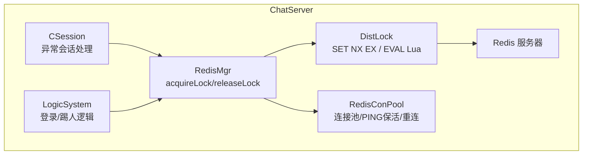
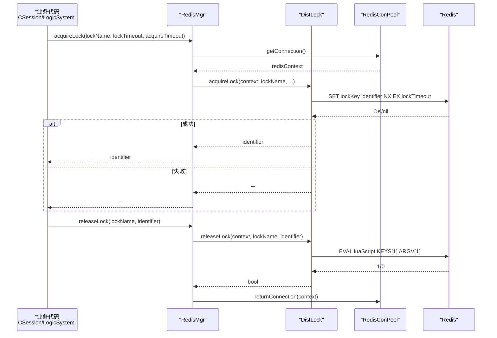
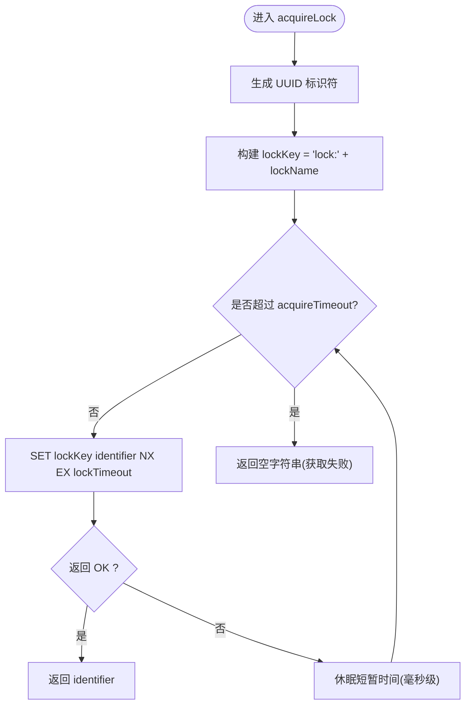
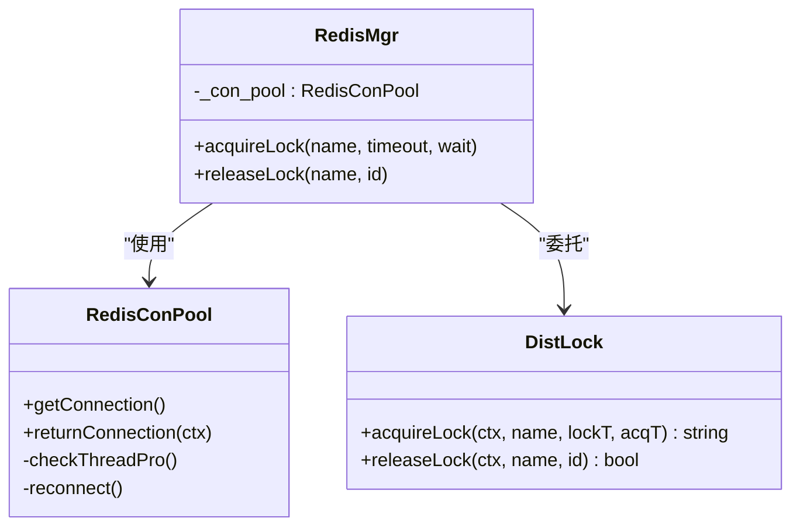
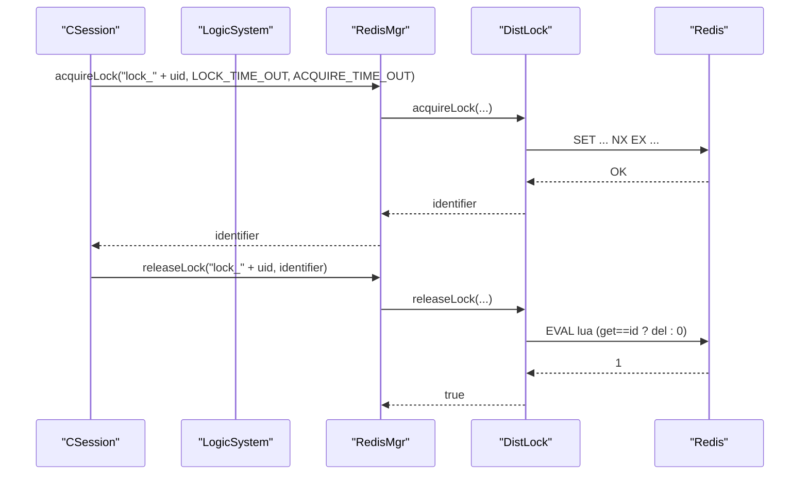
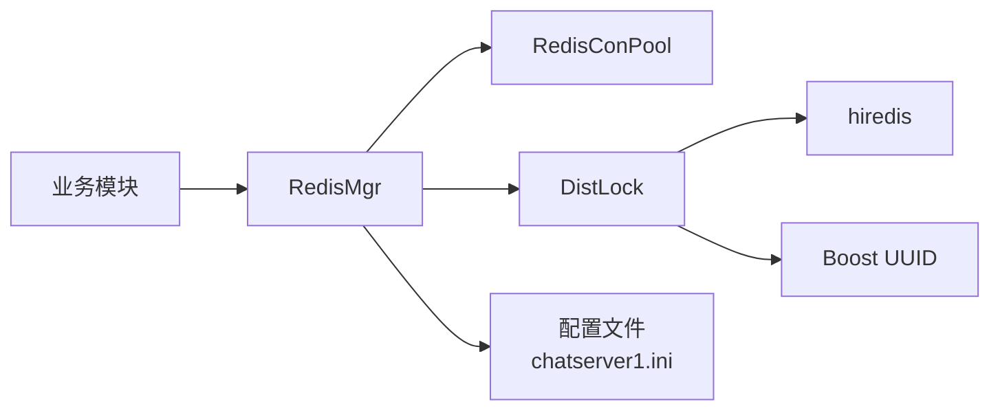

# 分布式锁设计

<cite>
**本文引用的文件**
- [DistLock.h](file://server/ChatServer/include/DistLock.h)
- [DistLock.cpp](file://server/ChatServer/src/DistLock.cpp)
- [RedisMgr.h](file://server/ChatServer/include/RedisMgr.h)
- [RedisMgr.cpp](file://server/ChatServer/src/RedisMgr.cpp)
- [const.h](file://server/ChatServer/include/const.h)
- [CSession.cpp](file://server/ChatServer/src/CSession.cpp)
- [LogicSystem.cpp](file://server/ChatServer/src/LogicSystem.cpp)
- [chatserver1.ini](file://server/ChatServer/config/chatserver1.ini)
- [day32分布式锁设计思路.md](file://开发文档/day32分布式锁设计思路.md)
- [day41-分布式死锁解决方案.md](file://开发文档/day41-分布式死锁解决方案.md)
</cite>

## 更新摘要
**变更内容**   
- 更新了DistLock类的Doxygen注释，包含详细的API文档和使用说明
- 完善了分布式锁的实现原理和技术细节
- 增强了连接池管理和错误处理机制的描述
- 补充了业务使用示例和最佳实践指导

## 目录
1. [引言](#引言)
2. [项目结构](#项目结构)
3. [核心组件](#核心组件)
4. [架构总览](#架构总览)
5. [详细组件分析](#详细组件分析)
6. [依赖关系分析](#依赖关系分析)
7. [性能与高并发优化](#性能与高并发优化)
8. [监控指标与可观测性](#监控指标与可观测性)
9. [故障恢复与容错](#故障恢复与容错)
10. [疑难排查指南](#疑难排查指南)
11. [结论](#结论)

## 引言
本技术文档围绕 LLFCChat 的分布式锁系统，系统性阐述基于 Redis 的锁实现原理、原子性与 Lua 脚本解锁机制、加锁释放流程、超时自动释放与防死锁设计；并记录 UUID 标识符生成、锁持有者校验、跨进程同步方案。同时给出分布式死锁检测思路、锁升级/降级策略、公平锁实现建议，以及在高并发场景下的重试、降级与性能优化、监控指标和故障恢复指导。

**更新** 本次更新重点添加了DistLock类的详细Doxygen注释，包括完整的API文档、参数说明和使用示例，为开发者提供了更清晰的技术参考。

## 项目结构
LLFCChat 在 ChatServer 中实现了分布式锁能力，并通过 Redis 连接池对外提供统一的加锁/解锁接口，业务模块（如会话管理、登录逻辑）通过该接口完成跨进程/跨服务的关键区保护。

**图示来源**
- [CSession.cpp:300-335](file://server/ChatServer/src/CSession.cpp#L300-L335)
- [LogicSystem.cpp:195-252](file://server/ChatServer/src/LogicSystem.cpp#L195-L252)
- [RedisMgr.cpp:362-393](file://server/ChatServer/src/RedisMgr.cpp#L362-L393)
- [DistLock.cpp:27-73](file://server/ChatServer/src/DistLock.cpp#L27-L73)
- [RedisMgr.h:9-265](file://server/ChatServer/include/RedisMgr.h#L9-L265)

## 核心组件
- **DistLock**：封装加锁与解锁的核心算法，使用 SET NX EX 获取锁，EVAL + Lua 脚本安全释放锁，内部生成 UUID 作为锁持有者标识。该类采用单例模式设计，提供线程安全的分布式锁操作。
- **RedisMgr**：对外暴露 acquireLock/releaseLock 接口，负责从连接池获取 redisContext，统一资源管理与生命周期。
- **RedisConPool**：维护 Redis 连接池，包含 PING 保活、失败统计、自动重连等。
- **常量配置**：LOCK_PREFIX、LOCK_TIME_OUT、ACQUIRE_TIME_OUT 等定义锁键前缀、锁有效期与获取超时。

**章节来源**
- [DistLock.h:1-50](file://server/ChatServer/include/DistLock.h#L1-L50)
- [DistLock.cpp:21-73](file://server/ChatServer/src/DistLock.cpp#L21-L73)
- [RedisMgr.h:306-378](file://server/ChatServer/include/RedisMgr.h#L306-L378)
- [RedisMgr.cpp:362-393](file://server/ChatServer/src/RedisMgr.cpp#L362-L393)
- [const.h:115-125](file://server/ChatServer/include/const.h#L115-L125)

## 架构总览
下图展示了从业务调用到 Redis 的完整链路，包括加锁、临界区执行、解锁与连接池回收。

**图示来源**
- [CSession.cpp:300-335](file://server/ChatServer/src/CSession.cpp#L300-L335)
- [LogicSystem.cpp:195-252](file://server/ChatServer/src/LogicSystem.cpp#L195-L252)
- [RedisMgr.cpp:362-393](file://server/ChatServer/src/RedisMgr.cpp#L362-L393)
- [DistLock.cpp:27-73](file://server/ChatServer/src/DistLock.cpp#L27-L73)
- [RedisMgr.h:9-265](file://server/ChatServer/include/RedisMgr.h#L9-L265)

## 详细组件分析

### DistLock：加锁与解锁核心
**更新** 该类已添加完整的Doxygen注释，详细说明了每个方法的功能、参数和返回值。

- **类设计**：采用单例模式，确保全局唯一实例，避免重复初始化开销。
- **UUID生成**：使用Boost库生成全局唯一标识符，保证锁持有者的唯一性。
- **加锁流程**
  - 生成全局唯一标识符 identifier（UUID）。
  - 构造锁键 lockKey = "lock:" + lockName。
  - 循环尝试 SET lockKey identifier NX EX lockTimeout，直到 acquireTimeout 超时或成功。
  - 返回 identifier 供后续解锁使用。
- **解锁流程**
  - 使用 EVAL 执行 Lua 脚本：仅当当前值等于 identifier 时才删除 key，保证"只有持有者能释放"。
- **原子性与一致性**
  - SET NX EX 是原子操作，确保同一时刻只有一个客户端设置成功。
  - Lua 脚本将"判断+删除"合并为一次原子执行，避免竞态条件。
- **防死锁设计**
  - 通过 EX 过期时间自动释放锁，防止进程崩溃导致的永久占用。
  - 获取锁有最大等待时间，避免无限阻塞。

**图示来源**
- [DistLock.cpp:27-49](file://server/ChatServer/src/DistLock.cpp#L27-L49)

**章节来源**
- [DistLock.h:12-48](file://server/ChatServer/include/DistLock.h#L12-L48)
- [DistLock.cpp:21-73](file://server/ChatServer/src/DistLock.cpp#L21-L73)
- [day32分布式锁设计思路.md:51-85](file://开发文档/day32分布式锁设计思路.md#L51-L85)

### RedisMgr：连接池与锁接口封装
- **连接池管理**
  - 初始化时根据配置创建固定数量的 Redis 连接，并进行 AUTH。
  - 后台线程周期性对连接执行 PING 保活，失败则计数并触发重连。
- **锁接口封装**
  - acquireLock/releaseLock 从连接池取用 redisContext，委托 DistLock 实现具体逻辑，并在 finally 语义下归还连接。
  - 使用Defer RAII模式确保连接正确释放，避免内存泄漏。
- **典型用法**
  - 登录计数、用户会话清理等关键路径均通过 RedisMgr 加锁保护。

**图示来源**
- [RedisMgr.h:306-378](file://server/ChatServer/include/RedisMgr.h#L306-L378)
- [RedisMgr.cpp:362-393](file://server/ChatServer/src/RedisMgr.cpp#L362-L393)
- [DistLock.h:12-48](file://server/ChatServer/include/DistLock.h#L12-L48)

**章节来源**
- [RedisMgr.h:306-378](file://server/ChatServer/include/RedisMgr.h#L306-L378)
- [RedisMgr.cpp:362-393](file://server/ChatServer/src/RedisMgr.cpp#L362-L393)

### 业务侧使用示例
**更新** 增加了具体的业务使用场景和代码示例。

- **会话异常清理（异地登录/断线）**
  - 以用户 uid 为维度加锁，清理本地 session 并删除 Redis 中的会话、IP、Token 等信息。
  - 使用Defer确保即使发生异常也能正确释放锁。
- **登录与踢人**
  - 以用户 uid 为维度加锁，检查是否已在其他服务器登录，必要时通过 gRPC 通知远端踢出。
  - 支持同服务器直接踢人和跨服务器远程踢人两种场景。

**图示来源**
- [CSession.cpp:300-335](file://server/ChatServer/src/CSession.cpp#L300-L335)
- [LogicSystem.cpp:195-252](file://server/ChatServer/src/LogicSystem.cpp#L195-L252)
- [RedisMgr.cpp:362-393](file://server/ChatServer/src/RedisMgr.cpp#L362-L393)
- [DistLock.cpp:27-73](file://server/ChatServer/src/DistLock.cpp#L27-L73)

**章节来源**
- [CSession.cpp:300-335](file://server/ChatServer/src/CSession.cpp#L300-L335)
- [LogicSystem.cpp:195-252](file://server/ChatServer/src/LogicSystem.cpp#L195-L252)

## 依赖关系分析
- **组件耦合**
  - RedisMgr 依赖 RedisConPool 管理连接，依赖 DistLock 实现锁逻辑。
  - 业务模块仅依赖 RedisMgr 的 acquireLock/releaseLock，屏蔽底层细节。
- **外部依赖**
  - hiredis 用于 Redis 通信。
  - Boost UUID 用于生成唯一标识符。
- **配置依赖**
  - Redis 主机、端口、密码由配置文件注入。
  - 锁键前缀、超时参数由常量定义。

**图示来源**
- [RedisMgr.cpp:5-11](file://server/ChatServer/src/RedisMgr.cpp#L5-L11)
- [chatserver1.ini:20-23](file://server/ChatServer/config/chatserver1.ini#L20-L23)
- [const.h:115-125](file://server/ChatServer/include/const.h#L115-L125)

**章节来源**
- [RedisMgr.cpp:5-11](file://server/ChatServer/src/RedisMgr.cpp#L5-L11)
- [chatserver1.ini:20-23](file://server/ChatServer/config/chatserver1.ini#L20-L23)
- [const.h:115-125](file://server/ChatServer/include/const.h#L115-L125)

## 性能与高并发优化
- **加锁策略**
  - 使用 SET NX EX 一次性完成"存在性检查+设置+过期"，减少往返与竞争窗口。
  - 短间隔重试（毫秒级）降低忙等 CPU 消耗。
- **连接池优化**
  - 连接复用减少握手开销；PING 保活与失败计数驱动自动重连，提升可用性。
- **超时与退避**
  - acquireTimeout 限制最长等待时间，避免雪崩；可根据负载动态调整。
- **公平锁与锁升级/降级**
  - 当前实现非公平（先 SET 成功者优先）。如需公平，可在 Redis 中使用有序集合维护排队队列，按顺序唤醒；升级/降级需引入版本字段与 CAS 语义（Lua 内比较版本号后更新）。
- **热点键优化**
  - 对高频锁键进行分片（如 hash 取模），分散热点；或使用本地互斥做粗粒度缓冲，再批量落库。

**章节来源**
- [DistLock.cpp:27-49](file://server/ChatServer/src/DistLock.cpp#L27-L49)
- [RedisMgr.h:306-378](file://server/ChatServer/include/RedisMgr.h#L306-L378)
- [RedisMgr.cpp:137-206](file://server/ChatServer/src/RedisMgr.cpp#L137-L206)

## 监控指标与可观测性
建议在 RedisMgr 与 DistLock 层补充以下指标（可通过日志或埋点上报）：
- 加锁成功率、平均耗时、P99 耗时
- 解锁成功率、解锁失败原因分布（标识不匹配、Redis 错误）
- 连接池大小、活跃连接数、PING 失败率、重连次数
- 锁键命中率（重复获取同一锁的比例）、热点键 TopN
- 业务侧重试次数、超时次数

**章节来源**
- [RedisMgr.cpp:137-206](file://server/ChatServer/src/RedisMgr.cpp#L137-L206)
- [RedisMgr.cpp:362-393](file://server/ChatServer/src/RedisMgr.cpp#L362-L393)

## 故障恢复与容错
- **Redis 不可用**
  - 连接池检测到错误后回退并重连；上层可结合熔断/降级策略（如本地内存锁短期兜底，限流降级）。
- **锁未释放**
  - 依靠 EX 过期自动释放；若业务需要更精确控制，可引入续期机制（watchdog 线程在临界区内定时续期）。
- **误释放**
  - Lua 脚本保证仅持有者可释放；若仍出现误判，应加强标识符随机性与长度，并增加审计日志。
- **跨进程/跨服务一致性**
  - 所有节点共享同一 Redis 实例；通过统一常量与命名规范保证锁键一致。

**章节来源**
- [DistLock.cpp:51-73](file://server/ChatServer/src/DistLock.cpp#L51-L73)
- [RedisMgr.h:306-378](file://server/ChatServer/include/RedisMgr.h#L306-L378)

## 疑难排查指南
- **常见问题**
  - 加锁超时：检查 Redis 连通性、网络延迟、锁键热点、acquireTimeout 是否过小。
  - 解锁失败：确认 identifier 是否正确传递；检查是否存在多进程/多线程重复释放。
  - 连接池耗尽：观察 PING 失败率与重连情况；适当增大池大小或优化业务耗时。
- **定位手段**
  - 查看 Redis 键是否存在与过期时间；核对 Lua 脚本返回值。
  - 打印加锁/解锁时序与耗时，定位瓶颈。
- **分布式死锁参考**
  - 数据库层面间隙锁与插入意向锁冲突可能导致死锁，可参考相关分析与优化方案。

**章节来源**
- [RedisMgr.cpp:137-206](file://server/ChatServer/src/RedisMgr.cpp#L137-L206)
- [day41-分布式死锁解决方案.md:1-120](file://开发文档/day41-分布式死锁解决方案.md#L1-L120)

## 结论
LLFCChat 的分布式锁基于 Redis 的原子命令与 Lua 脚本，实现了高可用的跨进程同步能力。通过连接池保活与自动重连、合理的超时与重试策略，系统在多数场景下具备良好稳定性与性能。

**更新** 随着DistLock类Doxygen注释的完善，开发者现在可以获得更清晰的API文档和使用指导。未来可按需引入公平锁、锁升级/降级、续期与更完善的监控体系，进一步提升复杂场景下的可靠性与可观测性。