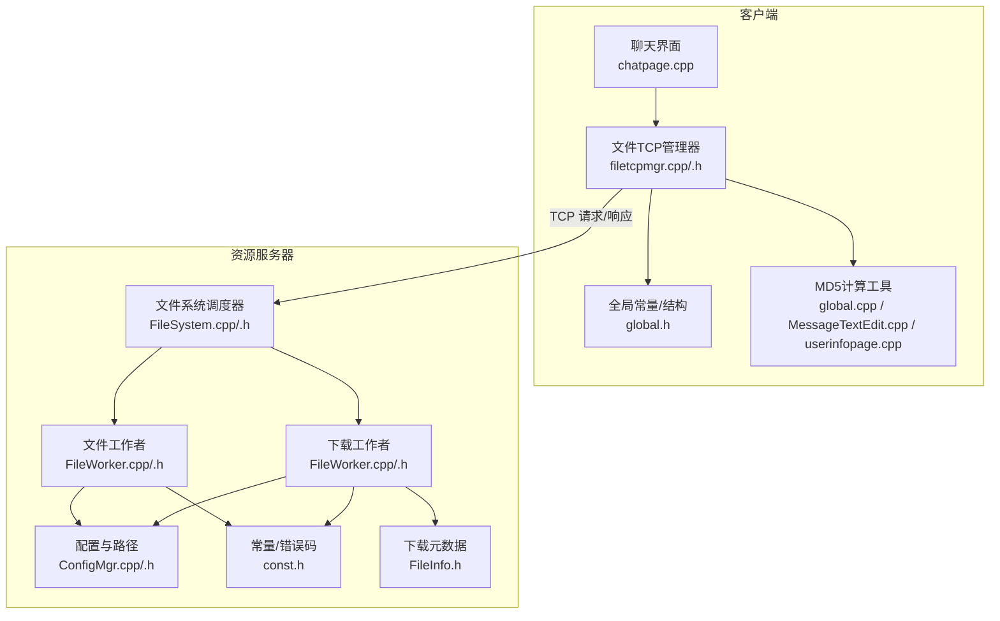
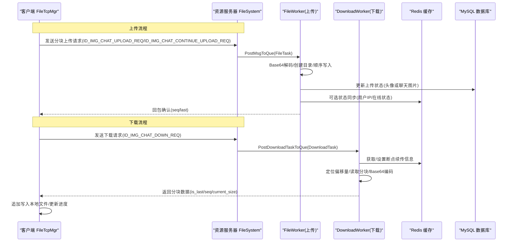
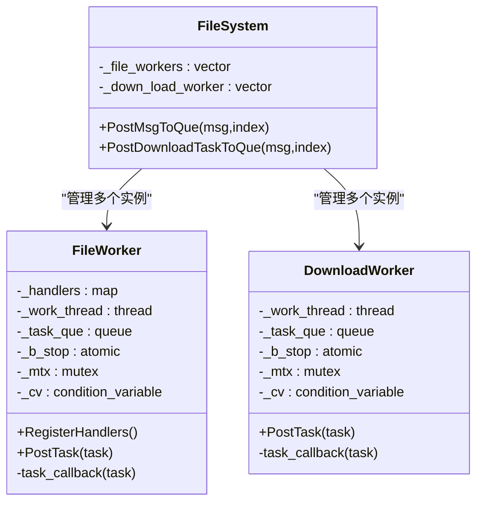
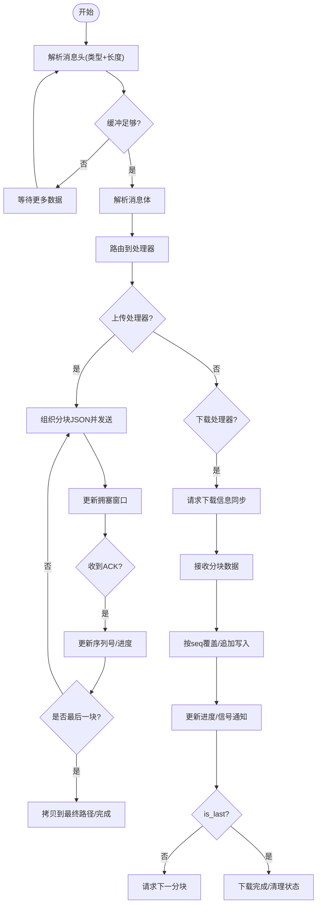
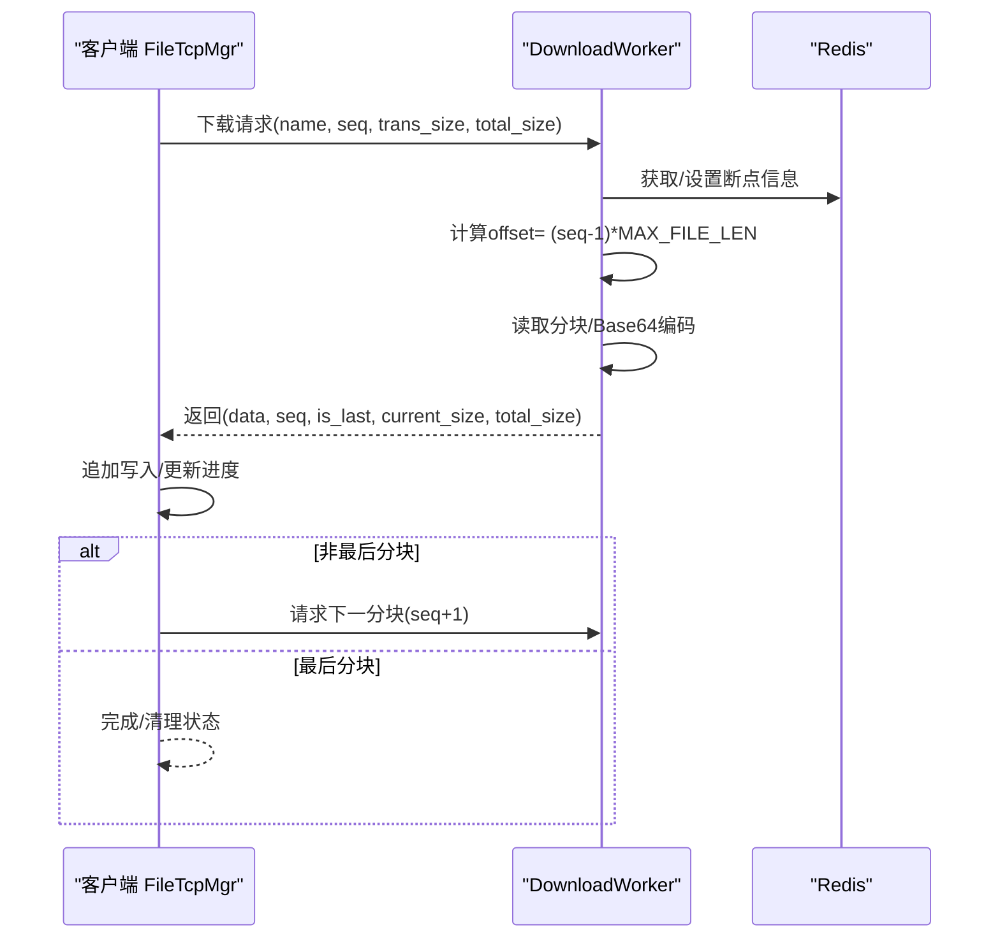
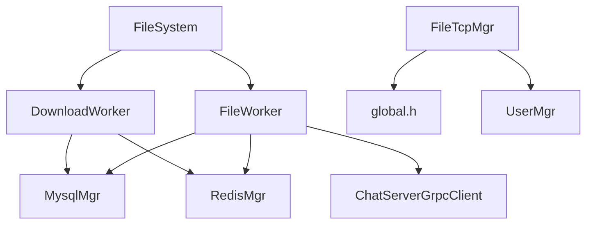

# 文件系统管理

<cite>
**本文引用的文件**   
- [FileSystem.h](file://server/ResourceServer/include/FileSystem.h)
- [FileSystem.cpp](file://server/ResourceServer/src/FileSystem.cpp)
- [FileWorker.h](file://server/ResourceServer/include/FileWorker.h)
- [FileWorker.cpp](file://server/ResourceServer/src/FileWorker.cpp)
- [FileInfo.h](file://server/ResourceServer/include/FileInfo.h)
- [const.h](file://server/ResourceServer/include/const.h)
- [ConfigMgr.h](file://server/ResourceServer/include/ConfigMgr.h)
- [ConfigMgr.cpp](file://server/ResourceServer/src/ConfigMgr.cpp)
- [filetcpmgr.h](file://client/llfcchat/include/filetcpmgr.h)
- [filetcpmgr.cpp](file://client/llfcchat/src/filetcpmgr.cpp)
- [global.h](file://client/llfcchat/include/global.h)
- [MessageTextEdit.cpp](file://client/llfcchat/src/MessageTextEdit.cpp)
- [global.cpp](file://client/llfcchat/src/global.cpp)
- [userinfopage.cpp](file://client/llfcchat/src/userinfopage.cpp)
- [chatpage.cpp](file://client/llfcchat/src/chatpage.cpp)
</cite>

## 目录
1. [简介](#简介)
2. [项目结构](#项目结构)
3. [核心组件](#核心组件)
4. [架构总览](#架构总览)
5. [详细组件分析](#详细组件分析)
6. [依赖关系分析](#依赖关系分析)
7. [性能考量](#性能考量)
8. [故障排查指南](#故障排查指南)
9. [结论](#结论)
10. [附录](#附录)

## 简介
本技术文档围绕 LLFCChat 的文件系统管理模块，系统性阐述文件上传与下载流程、断点续传实现、进度跟踪机制；深入解析文件分块存储、MD5 校验与去重策略；记录文件元数据管理、目录结构与路径映射规则；并给出大文件处理、并发控制、存储空间优化、安全验证（含病毒扫描接入建议）、访问权限控制、清理策略、垃圾回收与容量监控的最佳实践。读者可据此快速理解资源服务器与客户端在文件传输中的协作方式与关键实现细节。

## 项目结构
资源服务器端负责文件持久化、断点续传状态管理与 Redis 缓存交互；客户端侧负责 TCP 协议封装、分块发送/接收、进度更新与本地落盘。核心文件分布如下：
- 资源服务器
  - 工作线程与任务队列：FileWorker、DownloadWorker
  - 全局单例调度：FileSystem
  - 配置与路径：ConfigMgr
  - 常量与错误码：const.h
  - 下载元数据：FileInfo
- 客户端
  - 文件传输管理器：FileTcpMgr
  - 通用常量与数据结构：global.h
  - MD5 计算与工具：global.cpp、MessageTextEdit.cpp、userinfopage.cpp
  - UI 集成与完成回调：chatpage.cpp

**图表来源** 
- [FileSystem.cpp:1-29](file://server/ResourceServer/src/FileSystem.cpp#L1-L29)
- [FileWorker.cpp:1-660](file://server/ResourceServer/src/FileWorker.cpp#L1-L660)
- [ConfigMgr.cpp:33-82](file://server/ResourceServer/src/ConfigMgr.cpp#L33-L82)
- [const.h:1-117](file://server/ResourceServer/include/const.h#L1-L117)
- [filetcpmgr.cpp:1-1140](file://client/llfcchat/src/filetcpmgr.cpp#L1-L1140)
- [global.h:1-296](file://client/llfcchat/include/global.h#L1-L296)

**章节来源**
- [FileSystem.h:1-21](file://server/ResourceServer/include/FileSystem.h#L1-L21)
- [FileSystem.cpp:1-29](file://server/ResourceServer/src/FileSystem.cpp#L1-L29)
- [FileWorker.h:1-91](file://server/ResourceServer/include/FileWorker.h#L1-L91)
- [FileWorker.cpp:1-660](file://server/ResourceServer/src/FileWorker.cpp#L1-L660)
- [ConfigMgr.h:55-89](file://server/ResourceServer/include/ConfigMgr.h#L55-L89)
- [ConfigMgr.cpp:33-82](file://server/ResourceServer/src/ConfigMgr.cpp#L33-L82)
- [const.h:1-117](file://server/ResourceServer/include/const.h#L1-L117)
- [filetcpmgr.h:1-85](file://client/llfcchat/include/filetcpmgr.h#L1-L85)
- [filetcpmgr.cpp:1-1140](file://client/llfcchat/src/filetcpmgr.cpp#L1-L1140)
- [global.h:1-296](file://client/llfcchat/include/global.h#L1-L296)

## 核心组件
- FileSystem：单例调度器，维护多组 FileWorker 与 DownloadWorker，按索引分发任务到对应工作线程，实现上传与下载的并行处理。
- FileWorker：基于线程+条件变量的任务队列，注册多种消息处理器（头像上传、聊天图片上传、文件信息同步、续传等），统一解码 Base64、写入磁盘、状态回写与通知。
- DownloadWorker：独立下载工作线程，按序列号分块读取文件、Base64 编码后返回，使用 Redis 维护断点续传状态（seq、trans_size、total_size）。
- FileInfo：下载元数据模型（名称、总大小、已传输大小、文件路径、当前序列号）。
- FileTcpMgr：客户端 TCP 管理器，负责粘包/拆包、消息路由、拥塞窗口控制、批量发送、续传逻辑、进度信号与 UI 联动。
- ConfigMgr：加载配置文件，初始化静态输出目录，确保文件存储路径存在。
- const.h：定义错误码、消息类型、常量（如 MAX_FILE_LEN、工作线程数量等）。

**章节来源**
- [FileSystem.h:1-21](file://server/ResourceServer/include/FileSystem.h#L1-L21)
- [FileSystem.cpp:1-29](file://server/ResourceServer/src/FileSystem.cpp#L1-L29)
- [FileWorker.h:1-91](file://server/ResourceServer/include/FileWorker.h#L1-L91)
- [FileWorker.cpp:1-660](file://server/ResourceServer/src/FileWorker.cpp#L1-L660)
- [FileInfo.h:1-26](file://server/ResourceServer/include/FileInfo.h#L1-L26)
- [ConfigMgr.h:55-89](file://server/ResourceServer/include/ConfigMgr.h#L55-L89)
- [ConfigMgr.cpp:33-82](file://server/ResourceServer/src/ConfigMgr.cpp#L33-L82)
- [const.h:1-117](file://server/ResourceServer/include/const.h#L1-L117)
- [filetcpmgr.h:1-85](file://client/llfcchat/include/filetcpmgr.h#L1-L85)
- [filetcpmgr.cpp:1-1140](file://client/llfcchat/src/filetcpmgr.cpp#L1-L1140)

## 架构总览
资源服务器通过 FileSystem 将上传与下载任务分别投递至 FileWorker 与 DownloadWorker 队列中，由各自的工作线程串行执行，避免竞争。客户端通过 FileTcpMgr 以 TCP 协议进行分块传输，结合拥塞窗口控制与序列号确认机制，实现可靠、可控的传输。

**图表来源** 
- [FileWorker.cpp:46-455](file://server/ResourceServer/src/FileWorker.cpp#L46-L455)
- [FileWorker.cpp:480-660](file://server/ResourceServer/src/FileWorker.cpp#L480-L660)
- [filetcpmgr.cpp:243-895](file://client/llfcchat/src/filetcpmgr.cpp#L243-L895)

**章节来源**
- [FileSystem.cpp:1-29](file://server/ResourceServer/src/FileSystem.cpp#L1-L29)
- [FileWorker.cpp:1-660](file://server/ResourceServer/src/FileWorker.cpp#L1-L660)
- [filetcpmgr.cpp:1-1140](file://client/llfcchat/src/filetcpmgr.cpp#L1-L1140)

## 详细组件分析

### 上传与下载工作线程（FileWorker/DownloadWorker）
- 任务队列与线程模型：每个 Worker 持有独立线程、互斥锁、条件变量与任务队列，保证任务有序执行与线程安全。
- 上传处理器：支持头像上传、聊天图片上传、文件信息同步、续传图片上传。对首个分块采用覆盖写入，后续分块追加写入；完成后更新数据库状态并通过 gRPC 通知 ChatServer。
- 下载处理器：首次下载时建立 FileInfo 并写入 Redis，后续续传从 Redis 恢复状态；根据 seq 计算偏移量，读取固定长度分块，Base64 编码后返回；最后一个分块完成后删除 Redis 中的续传信息。

**图表来源** 
- [FileWorker.h:1-91](file://server/ResourceServer/include/FileWorker.h#L1-L91)
- [FileWorker.cpp:1-660](file://server/ResourceServer/src/FileWorker.cpp#L1-L660)
- [FileSystem.h:1-21](file://server/ResourceServer/include/FileSystem.h#L1-L21)
- [FileSystem.cpp:1-29](file://server/ResourceServer/src/FileSystem.cpp#L1-L29)

**章节来源**
- [FileWorker.h:1-91](file://server/ResourceServer/include/FileWorker.h#L1-L91)
- [FileWorker.cpp:1-660](file://server/ResourceServer/src/FileWorker.cpp#L1-L660)
- [FileSystem.h:1-21](file://server/ResourceServer/include/FileSystem.h#L1-L21)
- [FileSystem.cpp:1-29](file://server/ResourceServer/src/FileSystem.cpp#L1-L29)

### 客户端文件传输管理器（FileTcpMgr）
- 协议与粘包处理：自定义头部（类型+长度），循环解析缓冲区，确保完整消息体后再分发到处理器。
- 发送队列与拥塞控制：维护发送队列与当前块，bytesWritten 回调驱动继续发送；拥塞窗口 _cwnd_size 限制并发未确认分块数。
- 上传流程：
  - 初始上传：组织 JSON（md5/name/seq/trans_size/total_size/data/last/uid/sender/receiver/message_id），发送 ID_IMG_CHAT_UPLOAD_REQ。
  - 续传上传：若网络中断或暂停恢复，使用 ID_IMG_CHAT_CONTINUE_UPLOAD_REQ 从 last_confirmed_seq 继续发送。
  - 响应处理：根据 seq 更新 rsp_seqs 与 last_confirmed_seq，计算进度，必要时拷贝到最终路径并触发 UI 更新。
- 下载流程：
  - 下载信息同步：ID_IMG_CHAT_DOWN_INFO_SYNC_RSP 提供 message_id/thread_id/sender_id/recv_id/name/total_size 等，构造本地路径并发起下载请求。
  - 分块下载：ID_IMG_CHAT_DOWN_RSP 返回 data/seq/is_last/current_size/total_size，按 seq 决定覆盖或追加写入，最后触发完成信号。
- 进度与 UI：通过信号 sig_update_upload_progress、sig_update_download_progress、sig_download_finish 与 chatpage.cpp 联动，刷新气泡与预览图。

**图表来源** 
- [filetcpmgr.cpp:1-1140](file://client/llfcchat/src/filetcpmgr.cpp#L1-L1140)
- [global.h:1-296](file://client/llfcchat/include/global.h#L1-L296)

**章节来源**
- [filetcpmgr.h:1-85](file://client/llfcchat/include/filetcpmgr.h#L1-L85)
- [filetcpmgr.cpp:1-1140](file://client/llfcchat/src/filetcpmgr.cpp#L1-L1140)
- [global.h:1-296](file://client/llfcchat/include/global.h#L1-L296)

### 断点续传与进度跟踪
- 服务端断点续传：DownloadWorker 使用 Redis 保存 FileInfo（name、seq、trans_size、total_size、file_path_str），每次读取前校验 seq 一致性，计算 offset = (seq-1)*MAX_FILE_LEN，读取分块后更新 trans_size 与 seq，最后一个分块完成后删除 Redis 条目。
- 客户端进度跟踪：FileTcpMgr 维护 MsgInfo（current_size、total_size、seq、last_confirmed_seq、rsp_seqs、flighting_seqs），在 ACK 到达时更新集合与 last_confirmed_seq，计算 rsp_size 并触发 UI 信号；下载时根据 is_last 判断结束，否则继续请求下一分块。

**图表来源** 
- [FileWorker.cpp:525-660](file://server/ResourceServer/src/FileWorker.cpp#L525-L660)
- [filetcpmgr.cpp:695-811](file://client/llfcchat/src/filetcpmgr.cpp#L695-L811)

**章节来源**
- [FileWorker.cpp:480-660](file://server/ResourceServer/src/FileWorker.cpp#L480-L660)
- [filetcpmgr.cpp:695-811](file://client/llfcchat/src/filetcpmgr.cpp#L695-L811)
- [FileInfo.h:1-26](file://server/ResourceServer/include/FileInfo.h#L1-L26)

### 文件分块存储、MD5 校验与去重策略
- 分块存储：MAX_FILE_LEN=32KB，客户端与服务端均按此大小分块；首块覆盖写入，后续追加写入，确保断点续传正确性。
- MD5 校验：客户端在生成唯一文件名与上传前计算文件 MD5，用于标识文件内容与潜在去重；上传请求携带 md5 字段。
- 去重策略：当前实现未在资源服务器端显式实现基于 MD5 的去重逻辑；可在 FileWorker 上传处理器中增加“按 md5 查找已有文件”的步骤，若命中则直接返回成功并复用路径，减少重复存储。

**章节来源**
- [const.h:113-117](file://server/ResourceServer/include/const.h#L113-L117)
- [global.h:21-24](file://client/llfcchat/include/global.h#L21-L24)
- [filetcpmgr.cpp:925-996](file://client/llfcchat/src/filetcpmgr.cpp#L925-L996)
- [global.cpp:51-61](file://client/llfcchat/src/global.cpp#L51-L61)
- [MessageTextEdit.cpp:125-130](file://client/llfcchat/src/MessageTextEdit.cpp#L125-L130)
- [userinfopage.cpp:202-209](file://client/llfcchat/src/userinfopage.cpp#L202-L209)

### 文件元数据管理、目录结构与路径映射
- 服务端路径：ConfigMgr 初始化静态输出目录（static_path），FileWorker 使用 boost::filesystem 创建父目录并写入文件；头像上传成功后更新数据库并写入 Redis 缓存。
- 客户端路径：使用 QStandardPaths::AppDataLocation 作为应用数据目录，聊天图片存储于 user/{uid}/chatimg/{sender_uid}/{unique_name}；下载完成后拷贝到目标路径并更新 UI。
- 元数据：FileInfo（服务端）与 MsgInfo（客户端）分别维护 name、total_size、trans_size、seq、file_path_str、msg_id、sender/receiver 等字段，支撑断点续传与进度展示。

**章节来源**
- [ConfigMgr.cpp:59-82](file://server/ResourceServer/src/ConfigMgr.cpp#L59-L82)
- [FileWorker.cpp:46-193](file://server/ResourceServer/src/FileWorker.cpp#L46-L193)
- [filetcpmgr.cpp:488-508](file://client/llfcchat/src/filetcpmgr.cpp#L488-L508)
- [global.h:167-197](file://client/llfcchat/include/global.h#L167-L197)
- [FileInfo.h:1-26](file://server/ResourceServer/include/FileInfo.h#L1-L26)

### 大文件处理、并发控制与存储空间优化
- 大文件处理：分块大小 32KB，避免一次性加载大内存；客户端使用 seek 定位偏移，服务端按 offset 读取，降低内存占用。
- 并发控制：客户端拥塞窗口 _cwnd_size 限制未确认分块数，防止网络拥塞；服务器端通过多组 Worker 提升吞吐。
- 存储空间优化：建议在服务端引入基于 MD5 的去重存储；对聊天图片可按用户维度归档与压缩；定期清理临时分块与过期续传状态。

**章节来源**
- [const.h:113-117](file://server/ResourceServer/include/const.h#L113-L117)
- [filetcpmgr.cpp:925-996](file://client/llfcchat/src/filetcpmgr.cpp#L925-L996)
- [FileWorker.cpp:525-660](file://server/ResourceServer/src/FileWorker.cpp#L525-L660)

### 文件安全验证、病毒扫描与访问权限控制
- 安全验证：当前实现未包含病毒扫描；可在 FileWorker 上传处理器中接入外部扫描服务（如 ClamAV），扫描通过后才允许落盘。
- 访问权限控制：服务端使用操作系统文件权限（读写失败返回相应错误码）；客户端路径创建失败时提示用户检查权限。
- 建议增强：在服务端增加白名单扩展名校验、内容类型检测、恶意特征扫描；在客户端增加下载完整性校验（MD5 比对）。

**章节来源**
- [const.h:18-26](file://server/ResourceServer/include/const.h#L18-L26)
- [FileWorker.cpp:64-109](file://server/ResourceServer/src/FileWorker.cpp#L64-L109)
- [filetcpmgr.cpp:898-915](file://client/llfcchat/src/filetcpmgr.cpp#L898-L915)

### 文件清理策略、垃圾回收与存储容量监控
- 清理策略：服务端在下载完成后删除 Redis 中的续传信息；客户端在完成下载后移除传输状态对象。
- 垃圾回收：建议定时扫描临时分块目录与未完成的续传状态，清理超时任务；对无引用头像或聊天图片进行回收。
- 容量监控：可定期统计 static_path 与客户端 AppDataLocation 下目录大小，超过阈值触发告警或自动清理策略。

**章节来源**
- [FileWorker.cpp:643-653](file://server/ResourceServer/src/FileWorker.cpp#L643-L653)
- [filetcpmgr.cpp:779-784](file://client/llfcchat/src/filetcpmgr.cpp#L779-L784)

## 依赖关系分析
- 组件耦合：
  - FileSystem 依赖 FileWorker 与 DownloadWorker 实例，按索引分发任务。
  - FileWorker/DownloadWorker 依赖 MysqlMgr、RedisMgr、ChatServerGrpcClient 进行状态同步与通知。
  - FileTcpMgr 依赖 global.h 中的常量与数据结构，以及 UserMgr 进行用户信息与传输状态管理。
- 外部依赖：
  - boost::filesystem（路径操作）、Qt（网络与UI）、nlohmann::json（序列化）、Redis/MySQL/gRPC（后端服务）。

**图表来源** 
- [FileSystem.cpp:1-29](file://server/ResourceServer/src/FileSystem.cpp#L1-L29)
- [FileWorker.cpp:1-660](file://server/ResourceServer/src/FileWorker.cpp#L1-L660)
- [filetcpmgr.cpp:1-1140](file://client/llfcchat/src/filetcpmgr.cpp#L1-L1140)
- [global.h:1-296](file://client/llfcchat/include/global.h#L1-L296)

**章节来源**
- [FileSystem.cpp:1-29](file://server/ResourceServer/src/FileSystem.cpp#L1-L29)
- [FileWorker.cpp:1-660](file://server/ResourceServer/src/FileWorker.cpp#L1-L660)
- [filetcpmgr.cpp:1-1140](file://client/llfcchat/src/filetcpmgr.cpp#L1-L1140)
- [global.h:1-296](file://client/llfcchat/include/global.h#L1-L296)

## 性能考量
- I/O 优化：分块大小 32KB 平衡了网络与磁盘 I/O；服务端使用二进制流写入，避免频繁小 IO。
- 并发模型：多 Worker 实例提升吞吐；客户端拥塞窗口限制避免拥塞。
- 缓存利用：Redis 存储断点续传状态，减少重复计算与状态丢失风险。
- 建议优化：引入异步 I/O（如 io_uring/Boost.Asio 异步文件操作）、连接池与批处理确认、压缩传输（gzip/brotli）以降低带宽占用。

[本节为通用指导，不直接分析具体文件]

## 故障排查指南
- 常见问题
  - 文件不存在：服务端返回 FileNotExists，检查路径与权限。
  - 读写权限不足：FileWritePermissionFailed/FileReadPermissionFailed，检查目录权限。
  - 序列号无效：FileSeqInvalid，核对客户端 seq 与服务端 Redis 状态。
  - 偏移量无效：FileOffsetInvalid，检查 total_size 与 seq 计算。
  - Redis 读取失败：RedisReadErr，检查 Redis 服务与键值是否存在。
- 调试步骤
  - 查看日志：服务端打印文件路径、分块大小、错误码；客户端打印消息类型、长度、进度。
  - 检查 Redis：确认断点续传信息是否正确设置与更新。
  - 校验 MD5：对比客户端与服务端计算的 MD5，确保文件一致。
  - 网络抓包：确认 TCP 粘包/拆包是否正常，消息头长度与内容匹配。

**章节来源**
- [const.h:5-29](file://server/ResourceServer/include/const.h#L5-L29)
- [FileWorker.cpp:537-597](file://server/ResourceServer/src/FileWorker.cpp#L537-L597)
- [filetcpmgr.cpp:175-184](file://client/llfcchat/src/filetcpmgr.cpp#L175-L184)

## 结论
LLFCChat 的文件系统管理模块通过清晰的分层设计与多线程任务队列，实现了稳定可靠的文件上传与下载能力。断点续传借助 Redis 状态持久化，客户端拥塞窗口与序列号确认保障了传输可靠性。未来可在 MD5 去重、病毒扫描、权限控制与容量监控方面进一步增强，以提升安全性与可运维性。

[本节为总结，不直接分析具体文件]

## 附录
- 关键常量与错误码参考：
  - MAX_FILE_LEN：32KB
  - FILE_WORKER_COUNT/DOWN_LOAD_WORKER_COUNT：各 4
  - ErrorCodes：Success/FileNotExists/FileWritePermissionFailed/FileReadPermissionFailed/FileSeqInvalid/FileOffsetInvalid/FileReadFailed/RedisReadErr 等
- 路径规范：
  - 服务端：ConfigMgr.GetFileOutPath() 返回 static_path
  - 客户端：QStandardPaths::AppDataLocation/user/{uid}/chatimg/{sender_uid}/{unique_name}

**章节来源**
- [const.h:63-117](file://server/ResourceServer/include/const.h#L63-L117)
- [ConfigMgr.cpp:54-82](file://server/ResourceServer/src/ConfigMgr.cpp#L54-L82)
- [filetcpmgr.cpp:488-508](file://client/llfcchat/src/filetcpmgr.cpp#L488-L508)