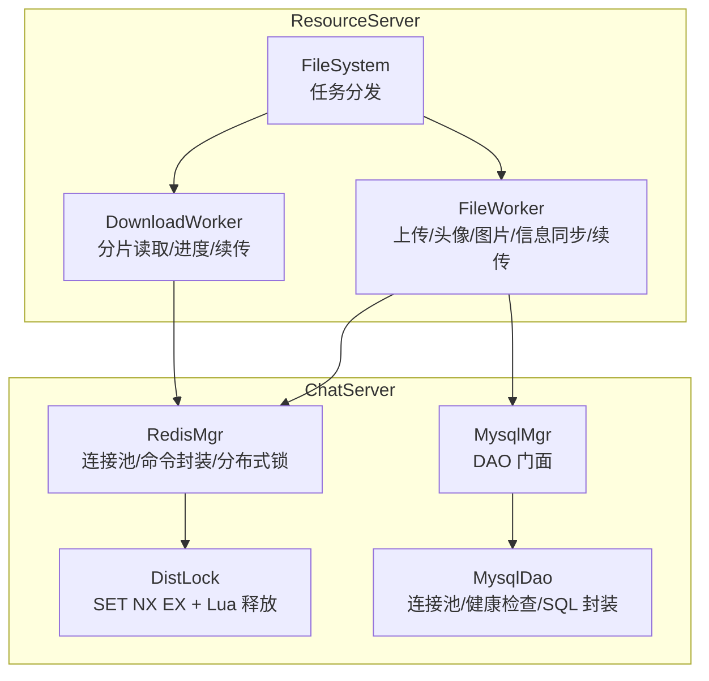
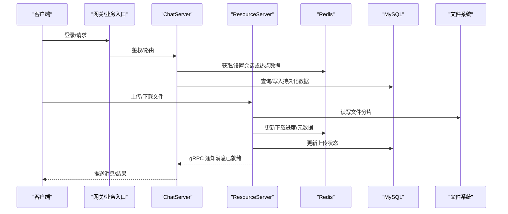
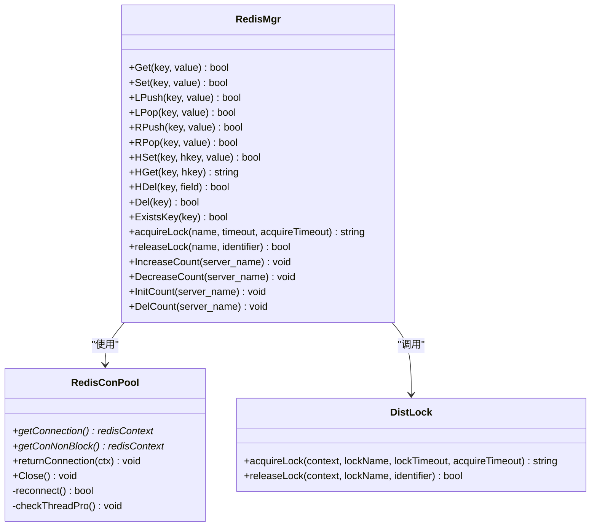
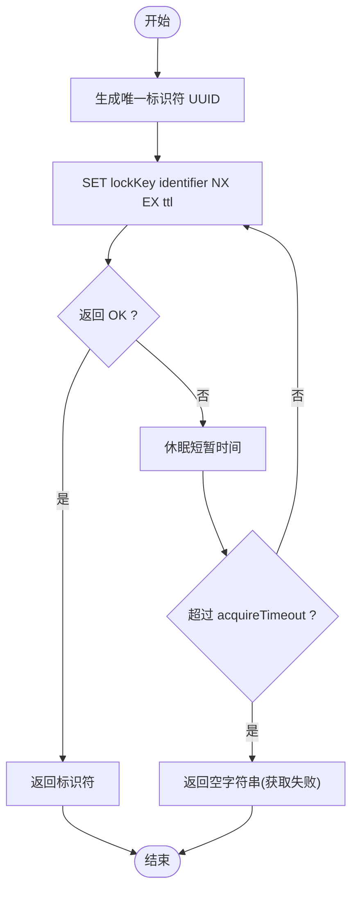
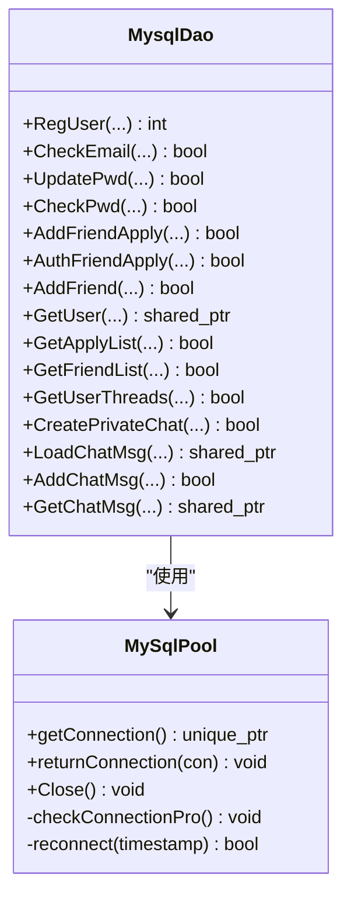
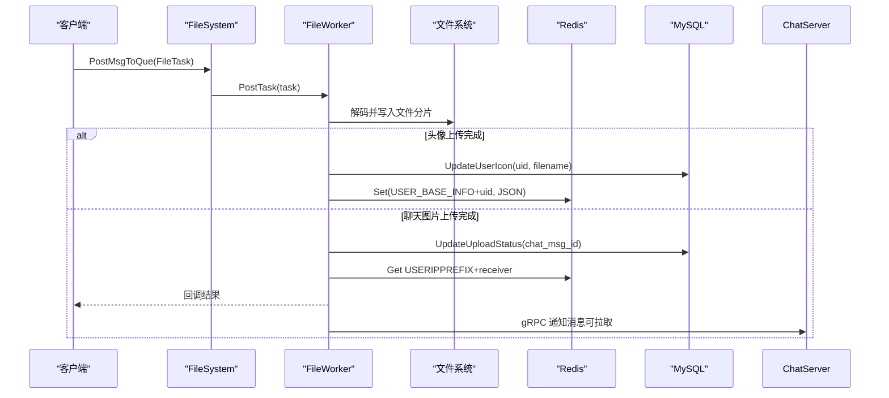
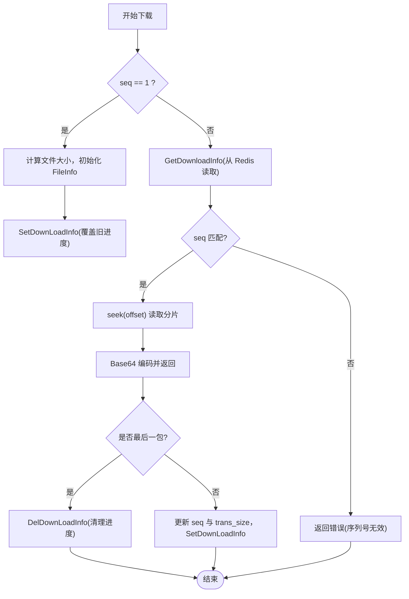
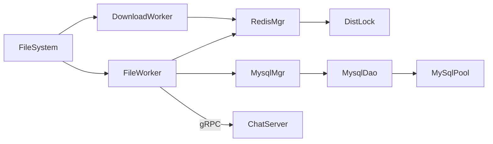

# 缓存和存储

<cite>
**本文引用的文件**   
- [RedisMgr.h](file://server/ChatServer/include/RedisMgr.h)
- [RedisMgr.cpp](file://server/ChatServer/src/RedisMgr.cpp)
- [DistLock.h](file://server/ChatServer/include/DistLock.h)
- [DistLock.cpp](file://server/ChatServer/src/DistLock.cpp)
- [MysqlMgr.h](file://server/ChatServer/include/MysqlMgr.h)
- [MysqlMgr.cpp](file://server/ChatServer/src/MysqlMgr.cpp)
- [MysqlDao.h](file://server/ChatServer/include/MysqlDao.h)
- [FileSystem.h](file://server/ResourceServer/include/FileSystem.h)
- [FileSystem.cpp](file://server/ResourceServer/src/FileSystem.cpp)
- [FileWorker.h](file://server/ResourceServer/include/FileWorker.h)
- [FileWorker.cpp](file://server/ResourceServer/src/FileWorker.cpp)
- [const.h（ChatServer）](file://server/ChatServer/include/const.h)
- [const.h（ResourceServer）](file://server/ResourceServer/include/const.h)
</cite>

## 目录
1. [简介](#简介)
2. [项目结构](#项目结构)
3. [核心组件](#核心组件)
4. [架构总览](#架构总览)
5. [详细组件分析](#详细组件分析)
6. [依赖关系分析](#依赖关系分析)
7. [性能考量与优化](#性能考量与优化)
8. [故障排查指南](#故障排查指南)
9. [结论](#结论)
10. [附录：配置项与扩展点](#附录配置项与扩展点)

## 简介
本技术文档聚焦于 LLFCChat 的缓存与存储子系统，涵盖 Redis 缓存策略、MySQL 数据存储与文件系统管理。重点说明分布式锁设计、数据一致性保证、性能优化、缓存失效策略、数据同步机制与故障恢复方案。同时给出并发访问控制、事务管理与数据完整性的实践建议，并提供热点数据缓存、会话管理与分布式协调的实现思路与调优建议。

## 项目结构
LLFCChat 的存储相关代码主要分布在 ChatServer 与 ResourceServer 两个服务中：
- ChatServer：负责聊天业务逻辑、用户与会话状态、消息读写、Redis 缓存与分布式锁、MySQL 持久化。
- ResourceServer：负责文件上传下载、断点续传、本地文件系统操作，并通过 Redis 与 MySQL 协同完成状态同步与回调通知。

图表来源
- [RedisMgr.h](file://server/ChatServer/include/RedisMgr.h)
- [RedisMgr.cpp](file://server/ChatServer/src/RedisMgr.cpp)
- [DistLock.h](file://server/ChatServer/include/DistLock.h)
- [DistLock.cpp](file://server/ChatServer/src/DistLock.cpp)
- [MysqlMgr.h](file://server/ChatServer/include/MysqlMgr.h)
- [MysqlMgr.cpp](file://server/ChatServer/src/MysqlMgr.cpp)
- [MysqlDao.h](file://server/ChatServer/include/MysqlDao.h)
- [FileSystem.h](file://server/ResourceServer/include/FileSystem.h)
- [FileSystem.cpp](file://server/ResourceServer/src/FileSystem.cpp)
- [FileWorker.h](file://server/ResourceServer/include/FileWorker.h)
- [FileWorker.cpp](file://server/ResourceServer/src/FileWorker.cpp)

章节来源
- [RedisMgr.h](file://server/ChatServer/include/RedisMgr.h)
- [RedisMgr.cpp](file://server/ChatServer/src/RedisMgr.cpp)
- [MysqlMgr.h](file://server/ChatServer/include/MysqlMgr.h)
- [MysqlMgr.cpp](file://server/ChatServer/src/MysqlMgr.cpp)
- [MysqlDao.h](file://server/ChatServer/include/MysqlDao.h)
- [FileSystem.h](file://server/ResourceServer/include/FileSystem.h)
- [FileSystem.cpp](file://server/ResourceServer/src/FileSystem.cpp)
- [FileWorker.h](file://server/ResourceServer/include/FileWorker.h)
- [FileWorker.cpp](file://server/ResourceServer/src/FileWorker.cpp)

## 核心组件
- Redis 连接池与命令封装：提供 Get/Set/LPush/RPush/HSet/HGet/HDel/Del/ExistsKey 等常用操作；内部维护连接池、健康检查与自动重连。
- 分布式锁：基于 Redis SET NX EX 获取锁，Lua 脚本原子释放锁，支持超时与重试。
- MySQL 连接池与 DAO：封装 SQL 操作，提供连接池、健康检查、失败重连与线程安全访问。
- 文件系统与任务队列：上传/下载任务通过 Worker 线程异步处理，支持断点续传、进度跟踪与回调。

章节来源
- [RedisMgr.h](file://server/ChatServer/include/RedisMgr.h)
- [RedisMgr.cpp](file://server/ChatServer/src/RedisMgr.cpp)
- [DistLock.h](file://server/ChatServer/include/DistLock.h)
- [DistLock.cpp](file://server/ChatServer/src/DistLock.cpp)
- [MysqlDao.h](file://server/ChatServer/include/MysqlDao.h)
- [FileWorker.h](file://server/ResourceServer/include/FileWorker.h)
- [FileWorker.cpp](file://server/ResourceServer/src/FileWorker.cpp)

## 架构总览
整体采用“缓存优先、持久化兜底”的策略：
- 热点数据（如用户基础信息、在线 IP）优先走 Redis，降低数据库压力。
- 聊天消息、好友关系等强一致数据落库 MySQL，必要时结合 Redis 做辅助。
- 文件资源由 ResourceServer 本地磁盘存储，通过 Redis 记录元数据与进度，配合 MySQL 更新状态。

图表来源
- [RedisMgr.cpp](file://server/ChatServer/src/RedisMgr.cpp)
- [MysqlMgr.cpp](file://server/ChatServer/src/MysqlMgr.cpp)
- [FileWorker.cpp](file://server/ResourceServer/src/FileWorker.cpp)

## 详细组件分析

### Redis 缓存与连接池
- 连接池：初始化固定数量连接，AUTH 认证，后台线程周期性 PING 检测存活，失败计数驱动重连。
- 命令封装：统一封装 GET/SET/LPUSH/RPUSH/HSET/HGET/HDEL/DEL/EXISTS 等，异常路径释放 reply 并归还连接。
- 分布式锁：acquireLock/releaseLock 委托 DistLock 实现，使用 SET NX EX 与 EVAL Lua 确保原子性。
- 计数器：LOGIN_COUNT 使用 Hash 字段按 server_name 统计，加锁后增减，避免竞态。

图表来源
- [RedisMgr.h](file://server/ChatServer/include/RedisMgr.h)
- [RedisMgr.cpp](file://server/ChatServer/src/RedisMgr.cpp)
- [DistLock.h](file://server/ChatServer/include/DistLock.h)
- [DistLock.cpp](file://server/ChatServer/src/DistLock.cpp)

章节来源
- [RedisMgr.h](file://server/ChatServer/include/RedisMgr.h)
- [RedisMgr.cpp](file://server/ChatServer/src/RedisMgr.cpp)
- [DistLock.h](file://server/ChatServer/include/DistLock.h)
- [DistLock.cpp](file://server/ChatServer/src/DistLock.cpp)

### 分布式锁设计与一致性
- 获取锁：生成唯一标识符（UUID），循环尝试 SET key identifier NX EX ttl，直到成功或达到 acquireTimeout。
- 释放锁：EVAL Lua 脚本比较当前值是否等于标识符，相等则删除，保证仅持有者释放。
- 一致性：利用 Redis 原子命令与 Lua 执行环境，避免误删与其他进程竞争导致的脏释放。

图表来源
- [DistLock.cpp](file://server/ChatServer/src/DistLock.cpp)

章节来源
- [DistLock.cpp](file://server/ChatServer/src/DistLock.cpp)
- [const.h（ChatServer）](file://server/ChatServer/include/const.h)

### MySQL 数据持久化与连接池
- 连接池：MySqlPool 维护连接队列，后台线程定期 SELECT 1 探测健康，失败计数触发重连。
- DAO 层：MysqlDao 封装用户注册、密码校验、好友申请、聊天会话与消息分页加载等 SQL 操作。
- 事务与一致性：在 DAO 层对关键写操作进行事务封装（例如批量插入消息、创建会话），保证原子性与完整性。

图表来源
- [MysqlDao.h](file://server/ChatServer/include/MysqlDao.h)

章节来源
- [MysqlDao.h](file://server/ChatServer/include/MysqlDao.h)
- [MysqlMgr.h](file://server/ChatServer/include/MysqlMgr.h)
- [MysqlMgr.cpp](file://server/ChatServer/src/MysqlMgr.cpp)

### 文件系统与任务调度
- FileSystem：维护多个 FileWorker 与 DownloadWorker，按索引分发任务，提升并发处理能力。
- FileWorker：根据消息类型路由到不同处理器（普通上传、头像上传、聊天图片上传、文件信息同步、续传图片）。
- DownloadWorker：按分片读取文件，Base64 编码回传，更新 Redis 中的下载进度，最后清理进度信息。

图表来源
- [FileSystem.cpp](file://server/ResourceServer/src/FileSystem.cpp)
- [FileWorker.cpp](file://server/ResourceServer/src/FileWorker.cpp)

章节来源
- [FileSystem.h](file://server/ResourceServer/include/FileSystem.h)
- [FileSystem.cpp](file://server/ResourceServer/src/FileSystem.cpp)
- [FileWorker.h](file://server/ResourceServer/include/FileWorker.h)
- [FileWorker.cpp](file://server/ResourceServer/src/FileWorker.cpp)

### 热点数据缓存与失效策略
- 热点数据：用户基础信息以 USER_BASE_INFO+uid 为键存储在 Redis，头像更新后刷新缓存。
- 失效策略：
  - TTL 过期：下载进度等临时状态设置过期时间，避免脏数据长期存在。
  - 主动失效：头像更新后覆盖旧值；下载完成后删除进度键。
- 一致性：先更新 MySQL，再更新 Redis，保证读多写少场景下的最终一致性。

章节来源
- [FileWorker.cpp](file://server/ResourceServer/src/FileWorker.cpp)
- [RedisMgr.cpp](file://server/ChatServer/src/RedisMgr.cpp)

### 会话管理与分布式协调
- 会话状态：通过 Redis 存储用户在线 IP（USERIPPREFIX+uid），用于消息推送判断。
- 分布式协调：分布式锁保护 LOGIN_COUNT 的增减，避免多实例并发导致计数错误。
- 心跳与过期：服务端定时扫描会话心跳，过期则清理，释放资源。

章节来源
- [RedisMgr.cpp](file://server/ChatServer/src/RedisMgr.cpp)
- [FileWorker.cpp](file://server/ResourceServer/src/FileWorker.cpp)

### 断点续传与进度跟踪
- 进度存储：DownloadWorker 将下载进度（文件名、序列号、已传输字节）写入 Redis，作为续传依据。
- 流程：首次下载建立进度；后续请求从 Redis 读取进度，校验序列号，定位偏移量读取分片；完成时清理进度。

图表来源
- [FileWorker.cpp](file://server/ResourceServer/src/FileWorker.cpp)

章节来源
- [FileWorker.cpp](file://server/ResourceServer/src/FileWorker.cpp)

## 依赖关系分析
- ChatServer 内：RedisMgr 依赖 DistLock 与 Redis 连接池；MysqlMgr 依赖 MysqlDao；MysqlDao 依赖 MySqlPool。
- ResourceServer 内：FileSystem 聚合 FileWorker 与 DownloadWorker；两者均依赖 RedisMgr 与 MysqlMgr。
- 跨服务：ResourceServer 通过 gRPC 通知 ChatServer 消息就绪，形成异步解耦。

图表来源
- [RedisMgr.h](file://server/ChatServer/include/RedisMgr.h)
- [RedisMgr.cpp](file://server/ChatServer/src/RedisMgr.cpp)
- [DistLock.h](file://server/ChatServer/include/DistLock.h)
- [DistLock.cpp](file://server/ChatServer/src/DistLock.cpp)
- [MysqlMgr.h](file://server/ChatServer/include/MysqlMgr.h)
- [MysqlMgr.cpp](file://server/ChatServer/src/MysqlMgr.cpp)
- [MysqlDao.h](file://server/ChatServer/include/MysqlDao.h)
- [FileSystem.h](file://server/ResourceServer/include/FileSystem.h)
- [FileSystem.cpp](file://server/ResourceServer/src/FileSystem.cpp)
- [FileWorker.h](file://server/ResourceServer/include/FileWorker.h)
- [FileWorker.cpp](file://server/ResourceServer/src/FileWorker.cpp)

章节来源
- [RedisMgr.h](file://server/ChatServer/include/RedisMgr.h)
- [RedisMgr.cpp](file://server/ChatServer/src/RedisMgr.cpp)
- [MysqlMgr.h](file://server/ChatServer/include/MysqlMgr.h)
- [MysqlMgr.cpp](file://server/ChatServer/src/MysqlMgr.cpp)
- [MysqlDao.h](file://server/ChatServer/include/MysqlDao.h)
- [FileSystem.h](file://server/ResourceServer/include/FileSystem.h)
- [FileSystem.cpp](file://server/ResourceServer/src/FileSystem.cpp)
- [FileWorker.h](file://server/ResourceServer/include/FileWorker.h)
- [FileWorker.cpp](file://server/ResourceServer/src/FileWorker.cpp)

## 性能考量与优化
- Redis 连接池：合理设置 poolSize，减少频繁连接开销；PING 间隔与失败阈值平衡健康检查与负载。
- MySQL 连接池：根据 QPS 调整连接数；SELECT 1 健康检查间隔与重连策略避免雪崩。
- 缓存命中率：热点数据（用户信息、在线 IP）优先命中 Redis，降低 DB 压力。
- 异步处理：文件上传/下载通过 Worker 线程队列异步执行，避免阻塞主流程。
- 批量化：消息写入尽量批量插入，减少往返次数。
- 序列化：JSON 序列化体积较大，考虑二进制协议或压缩以降低带宽占用。
- 超时与重试：分布式锁 acquireTimeout 不宜过长，避免长时间阻塞；网络异常需退避重试。

[本节为通用指导，不直接分析具体文件]

## 故障排查指南
- Redis 连接问题：
  - 现象：Get/Set 失败，日志打印命令失败。
  - 排查：检查 AUTH 是否成功；查看连接池健康检查线程是否重连；确认 Redis 服务可用。
- 分布式锁异常：
  - 现象：获取锁失败或释放失败。
  - 排查：确认标识符唯一性；检查 Lua 脚本返回值；观察锁键是否存在且值匹配。
- MySQL 连接问题：
  - 现象：DAO 方法抛出异常或返回失败。
  - 排查：检查连接池健康检查线程；确认数据库账号权限与 schema；查看重连日志。
- 文件上传/下载失败：
  - 现象：回调返回错误码（权限不足、文件不存在、序列号无效、偏移越界）。
  - 排查：检查目录权限；确认 Redis 进度信息是否存在且 seq 匹配；验证文件大小与偏移计算。

章节来源
- [RedisMgr.cpp](file://server/ChatServer/src/RedisMgr.cpp)
- [DistLock.cpp](file://server/ChatServer/src/DistLock.cpp)
- [MysqlDao.h](file://server/ChatServer/include/MysqlDao.h)
- [FileWorker.cpp](file://server/ResourceServer/src/FileWorker.cpp)

## 结论
LLFCChat 的缓存与存储系统通过 Redis 连接池与命令封装、分布式锁、MySQL 连接池与 DAO、以及文件系统 Worker 队列，实现了高并发、可扩展与高可用的数据存取能力。热点数据优先缓存、持久化兜底、异步任务处理与断点续传等策略有效提升了用户体验与系统稳定性。建议在部署时合理配置连接池大小、超时与重试策略，并结合监控指标持续优化性能。

[本节为总结，不直接分析具体文件]

## 附录：配置项与扩展点
- Redis 配置（示例键名）：
  - Host、Port、Passwd：连接参数，用于初始化连接池与 AUTH。
  - 键空间：LOGIN_COUNT（服务器登录计数）、USER_BASE_INFO+uid（用户基础信息）、USERIPPREFIX+uid（在线 IP）。
- MySQL 配置（示例键名）：
  - url、user、pass、schema：连接参数，用于初始化连接池与设置 schema。
- 分布式锁常量：
  - LOCK_TIME_OUT、ACQUIRE_TIME_OUT：锁超时与获取超时。
- 扩展点：
  - FileWorker 处理器映射：新增消息类型可在 RegisterHandlers 中注册新 handler。
  - Redis 命令封装：按需增加新的数据结构操作（如 ZSET、Stream）。
  - MySQL DAO：新增业务表时补充 DAO 方法与事务封装。

章节来源
- [RedisMgr.cpp](file://server/ChatServer/src/RedisMgr.cpp)
- [MysqlDao.h](file://server/ChatServer/include/MysqlDao.h)
- [const.h（ChatServer）](file://server/ChatServer/include/const.h)
- [const.h（ResourceServer）](file://server/ResourceServer/include/const.h)
- [FileWorker.cpp](file://server/ResourceServer/src/FileWorker.cpp)