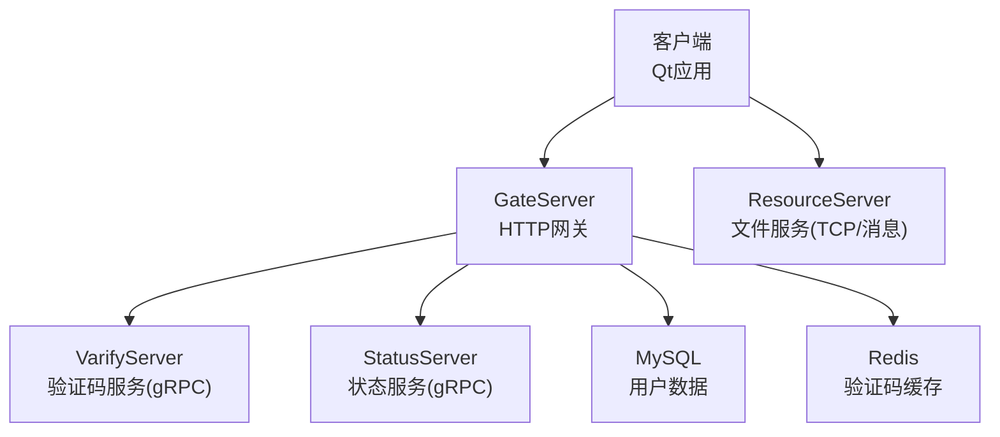
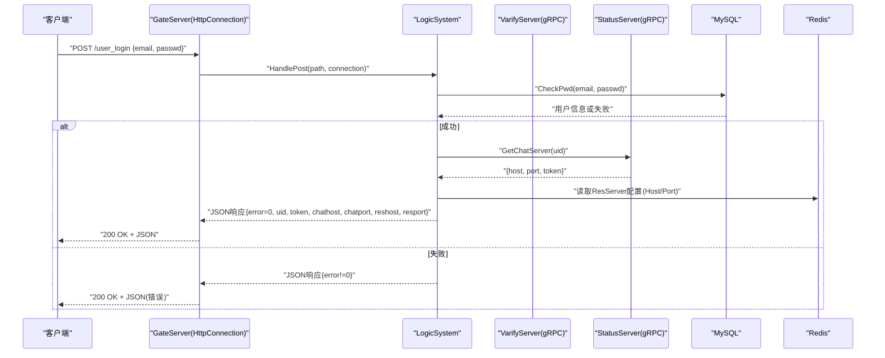
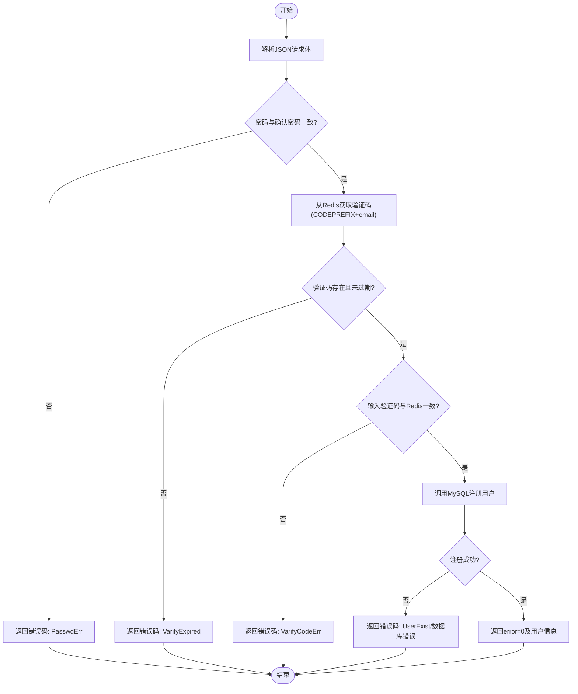
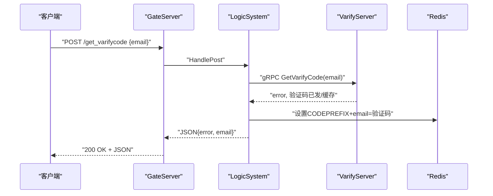
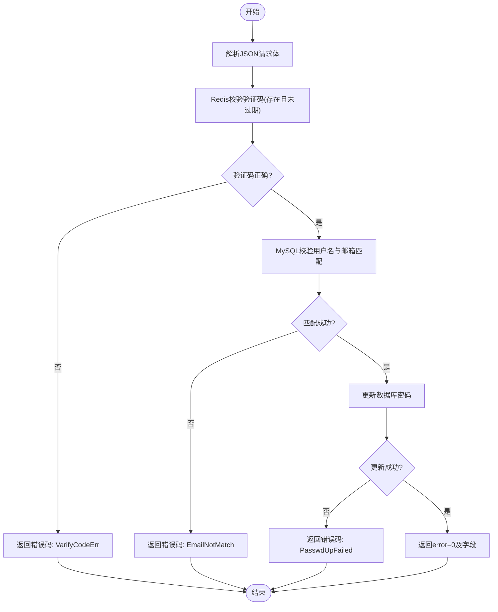
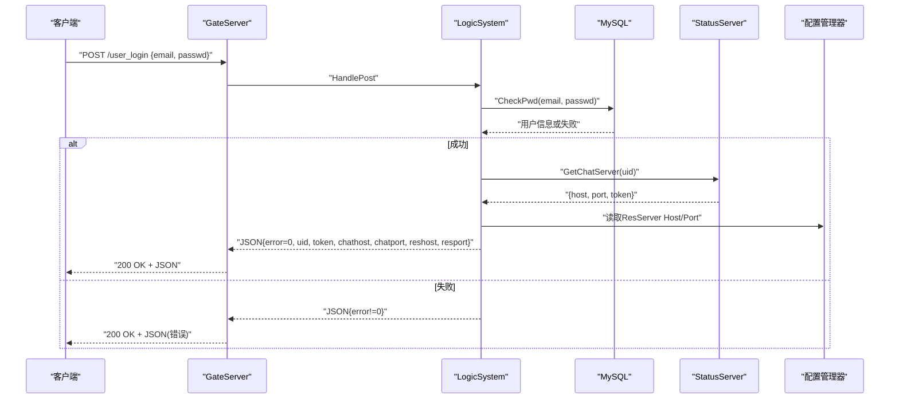
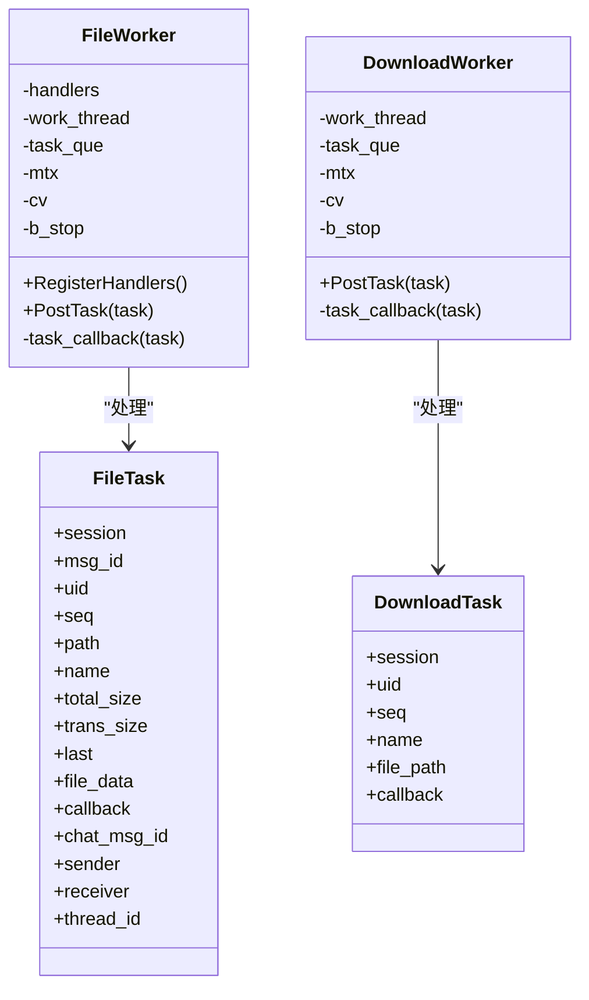
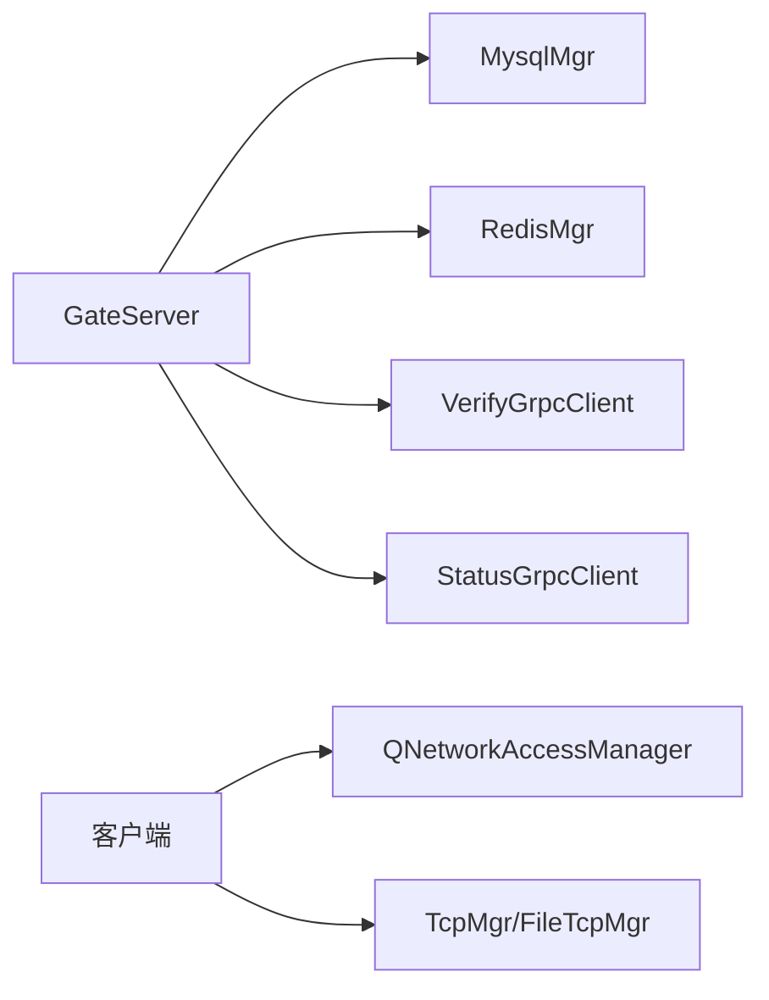

# HTTP API接口

<cite>
**本文引用的文件**
- [HttpConnection.cpp](file://server/GateServer/src/HttpConnection.cpp)
- [HttpConnection.h](file://server/GateServer/include/HttpConnection.h)
- [LogicSystem.cpp](file://server/GateServer/src/LogicSystem.cpp)
- [LogicSystem.h](file://server/GateServer/include/LogicSystem.h)
- [const.h（GateServer）](file://server/GateServer/include/const.h)
- [httpmgr.cpp](file://client/llfcchat/src/httpmgr.cpp)
- [httpmgr.h](file://client/llfcchat/include/httpmgr.h)
- [logindialog.cpp](file://client/llfcchat/src/logindialog.cpp)
- [registerdialog.cpp](file://client/llfcchat/src/registerdialog.cpp)
- [FileWorker.cpp](file://server/ResourceServer/src/FileWorker.cpp)
- [FileWorker.h](file://server/ResourceServer/include/FileWorker.h)
- [const.h（ResourceServer）](file://server/ResourceServer/include/const.h)
</cite>

## 目录
1. [简介](#简介)
2. [项目结构](#项目结构)
3. [核心组件](#核心组件)
4. [架构总览](#架构总览)
5. [详细组件分析](#详细组件分析)
6. [依赖关系分析](#依赖关系分析)
7. [性能考虑](#性能考虑)
8. [故障排查指南](#故障排查指南)
9. [结论](#结论)
10. [附录：API参考与示例](#附录api参考与示例)

## 简介
本文件为 LLFCChat 的 HTTP API 接口文档，覆盖用户注册、登录、验证码获取、密码重置等 RESTful 端点。同时说明身份认证机制（JWT令牌）、数据验证规则、错误处理策略，并提供 curl 命令与 JavaScript/Python 客户端调用示例。此外，记录 API 版本管理、限流策略与安全防护措施建议。

## 项目结构
LLFCChat 采用多服务架构：
- GateServer：HTTP 网关，负责请求路由、参数解析、业务编排与 gRPC 转发。
- ResourceServer：资源服务器，提供文件上传/下载、头像更新、聊天图片资源管理等能力（内部通过 TCP/消息协议实现）。
- StatusServer：状态服务，负责 ChatServer 分配与鉴权 token 发放。
- VarifyServer：验证码服务，生成并发送邮箱验证码，缓存至 Redis。
- Client：Qt 客户端，封装 HTTP 请求与后续 TCP 连接流程。

**图示来源**
- [LogicSystem.cpp:36-396](file://server/GateServer/src/LogicSystem.cpp#L36-L396)
- [HttpConnection.cpp:132-194](file://server/GateServer/src/HttpConnection.cpp#L132-L194)

**章节来源**
- [LogicSystem.cpp:36-396](file://server/GateServer/src/LogicSystem.cpp#L36-L396)
- [HttpConnection.cpp:132-194](file://server/GateServer/src/HttpConnection.cpp#L132-L194)

## 核心组件
- GateServer HTTP 网关
  - HttpConnection：基于 Boost.Beast 的 HTTP 连接处理，支持 GET/POST、CORS、超时控制、响应写入。
  - LogicSystem：路由注册与分发，将 URL 映射到具体处理函数，统一 JSON 解析与错误码返回。
- 客户端 HTTP 管理器
  - HttpMgr：Qt 网络模块封装，统一 POST 请求、错误回调与模块信号分发。
- 资源服务
  - FileWorker：文件上传/下载工作线程，支持断点续传、Base64编解码、Redis进度同步、数据库状态更新。

**章节来源**
- [HttpConnection.h:1-36](file://server/GateServer/include/HttpConnection.h#L1-L36)
- [HttpConnection.cpp:1-225](file://server/GateServer/src/HttpConnection.cpp#L1-L225)
- [LogicSystem.h:1-24](file://server/GateServer/include/LogicSystem.h#L1-L24)
- [LogicSystem.cpp:36-396](file://server/GateServer/src/LogicSystem.cpp#L36-L396)
- [httpmgr.h:1-34](file://client/llfcchat/include/httpmgr.h#L1-L34)
- [httpmgr.cpp:1-62](file://client/llfcchat/src/httpmgr.cpp#L1-L62)
- [FileWorker.h:1-91](file://server/ResourceServer/include/FileWorker.h#L1-L91)
- [FileWorker.cpp:1-660](file://server/ResourceServer/src/FileWorker.cpp#L1-L660)

## 架构总览
GateServer 作为唯一 HTTP 入口，接收客户端请求后：
- GET：解析查询参数，分发给对应 handler。
- POST：解析 JSON 请求体，校验字段，调用后端 gRPC（验证码、状态服务），访问 MySQL/Redis，返回统一 JSON 响应。
- 错误：未匹配路由返回 404；JSON 解析失败、参数校验失败、验证码过期/错误、数据库异常等使用统一错误码。

**图示来源**
- [LogicSystem.cpp:318-396](file://server/GateServer/src/LogicSystem.cpp#L318-L396)
- [HttpConnection.cpp:169-194](file://server/GateServer/src/HttpConnection.cpp#L169-L194)

## 详细组件分析

### 用户注册接口
- 方法：POST
- 路径：/user_register
- 请求体（JSON）：
  - email: 字符串，必填
  - user: 字符串，用户名/昵称，必填
  - passwd: 字符串，密码，必填
  - confirm: 字符串，确认密码，必填
  - icon: 字符串，头像（base64或路径），可选
  - varifycode: 字符串，验证码，必填
- 响应体（JSON）：
  - error: 整数，0表示成功，其他为错误码
  - 成功时包含 uid、email、user、passwd、confirm、icon、varifycode 等字段
- 主要逻辑：
  - 校验两次密码一致
  - 从 Redis 中按 CODEPREFIX+email 获取验证码并校验是否过期与正确
  - 调用 MySQL 注册用户，检查用户名/邮箱是否存在
  - 成功后返回用户信息与错误码
- 错误码：
  - Error_Json、PasswdErr、VarifyExpired、VarifyCodeErr、UserExist、数据库相关错误

**图示来源**
- [LogicSystem.cpp:148-233](file://server/GateServer/src/LogicSystem.cpp#L148-L233)
- [const.h（GateServer）:31-44](file://server/GateServer/include/const.h#L31-L44)

**章节来源**
- [LogicSystem.cpp:148-233](file://server/GateServer/src/LogicSystem.cpp#L148-L233)
- [const.h（GateServer）:31-44](file://server/GateServer/include/const.h#L31-L44)

### 验证码获取接口
- 方法：POST
- 路径：/get_varifycode
- 请求体（JSON）：
  - email: 字符串，必填
- 响应体（JSON）：
  - error: 整数，0表示成功
  - email: 回显邮箱地址
- 主要逻辑：
  - 解析 JSON，校验 email 字段
  - 通过 gRPC 调用 VarifyServer 生成验证码、发送邮件，并将验证码存入 Redis（key: CODEPREFIX+email）
  - 返回 VarifyServer 的错误码与邮箱

**图示来源**
- [LogicSystem.cpp:105-147](file://server/GateServer/src/LogicSystem.cpp#L105-L147)

**章节来源**
- [LogicSystem.cpp:105-147](file://server/GateServer/src/LogicSystem.cpp#L105-L147)

### 重置密码接口
- 方法：POST
- 路径：/reset_pwd
- 请求体（JSON）：
  - email: 字符串，必填
  - user: 字符串，用户名，必填
  - passwd: 字符串，新密码，必填
  - varifycode: 字符串，验证码，必填
- 响应体（JSON）：
  - error: 整数，0表示成功
  - 成功时包含 email、user、passwd、varifycode 等字段
- 主要逻辑：
  - 从 Redis 校验验证码是否过期与正确
  - 查询 MySQL 验证用户名与邮箱是否匹配
  - 更新数据库中的密码
  - 返回成功或错误码

**图示来源**
- [LogicSystem.cpp:235-316](file://server/GateServer/src/LogicSystem.cpp#L235-L316)

**章节来源**
- [LogicSystem.cpp:235-316](file://server/GateServer/src/LogicSystem.cpp#L235-L316)

### 用户登录接口
- 方法：POST
- 路径：/user_login
- 请求体（JSON）：
  - email: 字符串，必填
  - passwd: 字符串，必填
- 响应体（JSON）：
  - error: 整数，0表示成功
  - 成功时包含 uid、token、chathost、chatport、reshost、resport 等字段
- 主要逻辑：
  - 校验邮箱与密码（MySQL）
  - 通过 gRPC 调用 StatusServer 为用户分配 ChatServer，返回 host、port、token
  - 从配置文件读取 ResourceServer 的地址
  - 返回登录结果与连接信息

**图示来源**
- [LogicSystem.cpp:318-396](file://server/GateServer/src/LogicSystem.cpp#L318-L396)

**章节来源**
- [LogicSystem.cpp:318-396](file://server/GateServer/src/LogicSystem.cpp#L318-L396)

### 文件上传与下载（ResourceServer）
注意：文件上传/下载在 ResourceServer 中通过 TCP/消息协议实现，并非 HTTP 直接暴露。但客户端在登录后会获取 ResourceServer 的连接信息并进行交互。

- 上传类型：
  - 普通文件上传（ID_UPLOAD_FILE_REQ）
  - 头像上传（ID_UPLOAD_HEAD_ICON_REQ）
  - 聊天图片上传（ID_IMG_CHAT_UPLOAD_REQ）
  - 聊天图片续传（ID_IMG_CHAT_CONTINUE_UPLOAD_REQ）
  - 文件信息同步（ID_FILE_INFO_SYNC_REQ）
- 下载：
  - 支持断点续传，基于 Redis 保存下载进度（seq、trans_size、total_size）
  - 每次读取固定大小（MAX_FILE_LEN）进行 Base64 编码返回

**图示来源**
- [FileWorker.h:15-57](file://server/ResourceServer/include/FileWorker.h#L15-L57)
- [FileWorker.h:59-91](file://server/ResourceServer/include/FileWorker.h#L59-L91)

**章节来源**
- [FileWorker.cpp:1-660](file://server/ResourceServer/src/FileWorker.cpp#L1-L660)
- [const.h（ResourceServer）:72-95](file://server/ResourceServer/include/const.h#L72-L95)

## 依赖关系分析
- GateServer 依赖：
  - MysqlMgr：用户数据持久化
  - RedisMgr：验证码缓存、下载进度、用户会话
  - VerifyGrpcClient：验证码服务
  - StatusGrpcClient：状态服务（ChatServer分配与token）
- 客户端依赖：
  - QNetworkAccessManager：HTTP 请求
  - TcpMgr/FileTcpMgr：TCP 长连接（聊天与资源服务）

**图示来源**
- [LogicSystem.cpp:22-27](file://server/GateServer/src/LogicSystem.cpp#L22-L27)
- [httpmgr.h:1-34](file://client/llfcchat/include/httpmgr.h#L1-L34)

**章节来源**
- [LogicSystem.cpp:22-27](file://server/GateServer/src/LogicSystem.cpp#L22-L27)
- [httpmgr.h:1-34](file://client/llfcchat/include/httpmgr.h#L1-L34)

## 性能考虑
- HTTP 短连接：默认 keep_alive=false，减少连接保持开销。
- 超时控制：每个连接设置60秒超时，避免僵尸连接。
- 异步读写：使用 Boost.Asio 异步 I/O，提高并发处理能力。
- 文件传输：分块上传/下载，Base64 编解码，Redis 维护进度，支持断点续传。
- 数据库与缓存：MySQL 用于持久化，Redis 用于验证码与下载进度，降低热点数据压力。

[本节为通用指导，不直接分析具体文件]

## 故障排查指南
- 常见错误码（GateServer）：
  - Error_Json：JSON 解析失败
  - RPCFailed：gRPC 调用失败
  - VarifyExpired：验证码过期
  - VarifyCodeErr：验证码错误
  - UserExist：用户已存在
  - PasswdErr：密码不一致
  - EmailNotMatch：邮箱不匹配
  - PasswdUpFailed：密码更新失败
  - TokenInvalid：Token失效
  - UidInvalid：UID无效
- 常见错误码（ResourceServer）：
  - FileNotExists：文件不存在
  - FileWritePermissionFailed：写权限不足
  - FileReadPermissionFailed：读权限不足
  - FileSeqInvalid：序列号无效
  - FileOffsetInvalid：偏移量无效
  - FileReadFailed：读取失败
  - RedisReadErr：Redis读取失败
- 排查步骤：
  - 检查请求 JSON 格式与必填字段
  - 查看 Redis 中验证码键是否存在且未过期
  - 检查 MySQL 用户记录与密码匹配
  - 确认 gRPC 服务可用性与返回值
  - 对于文件操作，检查文件系统权限与路径创建

**章节来源**
- [const.h（GateServer）:31-44](file://server/GateServer/include/const.h#L31-L44)
- [const.h（ResourceServer）:5-29](file://server/ResourceServer/include/const.h#L5-L29)

## 结论
LLFCChat 的 HTTP API 以 GateServer 为核心，提供统一的注册、登录、验证码与密码重置接口。文件传输由 ResourceServer 通过 TCP/消息协议实现，支持断点续传与进度同步。系统采用 Redis 与 MySQL 协同，结合 gRPC 微服务，具备良好的扩展性与可维护性。建议在生产环境中增加 JWT 校验、限流与更严格的 CORS 策略以提升安全性。

[本节为总结，不直接分析具体文件]

## 附录：API参考与示例

### 通用约定
- 内容类型：application/json
- 响应状态码：HTTP 200 OK（业务错误通过 error 字段表达）
- 错误码：见各模块 const.h 定义

### 用户注册
- 方法：POST
- 路径：/user_register
- 请求体：{email, user, passwd, confirm, icon?, varifycode}
- 响应体：{error, uid?, email?, user?, passwd?, confirm?, icon?, varifycode?}

curl 示例：
- curl -X POST http://gate_host/user_register -H "Content-Type: application/json" -d '{"email":"test@example.com","user":"alice","passwd":"Pass123!","confirm":"Pass123!","icon":"","varifycode":"123456"}'

JavaScript 示例（fetch）：
- fetch("http://gate_host/user_register", {method:"POST",headers:{"Content-Type":"application/json"},body:JSON.stringify({email:"test@example.com",user:"alice",passwd:"Pass123!",confirm:"Pass123!",icon:"",varifycode:"123456"})}).then(r=>r.json()).then(console.log)

Python 示例（requests）：
- requests.post("http://gate_host/user_register", json={"email":"test@example.com","user":"alice","passwd":"Pass123!","confirm":"Pass123!","icon":"","varifycode":"123456"}).json()

**章节来源**
- [LogicSystem.cpp:148-233](file://server/GateServer/src/LogicSystem.cpp#L148-L233)

### 验证码获取
- 方法：POST
- 路径：/get_varifycode
- 请求体：{email}
- 响应体：{error, email}

curl 示例：
- curl -X POST http://gate_host/get_varifycode -H "Content-Type: application/json" -d '{"email":"test@example.com"}'

JavaScript 示例（fetch）：
- fetch("http://gate_host/get_varifycode", {method:"POST",headers:{"Content-Type":"application/json"},body:JSON.stringify({email:"test@example.com"})}).then(r=>r.json()).then(console.log)

Python 示例（requests）：
- requests.post("http://gate_host/get_varifycode", json={"email":"test@example.com"}).json()

**章节来源**
- [LogicSystem.cpp:105-147](file://server/GateServer/src/LogicSystem.cpp#L105-L147)

### 重置密码
- 方法：POST
- 路径：/reset_pwd
- 请求体：{email, user, passwd, varifycode}
- 响应体：{error, email?, user?, passwd?, varifycode?}

curl 示例：
- curl -X POST http://gate_host/reset_pwd -H "Content-Type: application/json" -d '{"email":"test@example.com","user":"alice","passwd":"NewPass123!","varifycode":"123456"}'

JavaScript 示例（fetch）：
- fetch("http://gate_host/reset_pwd", {method:"POST",headers:{"Content-Type":"application/json"},body:JSON.stringify({email:"test@example.com",user:"alice",passwd:"NewPass123!",varifycode:"123456"})}).then(r=>r.json()).then(console.log)

Python 示例（requests）：
- requests.post("http://gate_host/reset_pwd", json={"email":"test@example.com","user":"alice","passwd":"NewPass123!","varifycode":"123456"}).json()

**章节来源**
- [LogicSystem.cpp:235-316](file://server/GateServer/src/LogicSystem.cpp#L235-L316)

### 用户登录
- 方法：POST
- 路径：/user_login
- 请求体：{email, passwd}
- 响应体：{error, uid?, token?, chathost?, chatport?, reshost?, resport?}

curl 示例：
- curl -X POST http://gate_host/user_login -H "Content-Type: application/json" -d '{"email":"test@example.com","passwd":"Pass123!"}'

JavaScript 示例（fetch）：
- fetch("http://gate_host/user_login", {method:"POST",headers:{"Content-Type":"application/json"},body:JSON.stringify({email:"test@example.com",passwd:"Pass123!"})}).then(r=>r.json()).then(console.log)

Python 示例（requests）：
- requests.post("http://gate_host/user_login", json={"email":"test@example.com","passwd":"Pass123!"}).json()

**章节来源**
- [LogicSystem.cpp:318-396](file://server/GateServer/src/LogicSystem.cpp#L318-L396)

### 身份认证机制（JWT令牌）
- 登录成功后返回 token，用于后续 TCP 连接认证（由 StatusServer 生成）。
- 建议在后续 HTTP 接口中增加 JWT 校验（当前代码未实现 HTTP 层 JWT 校验）。
- 安全建议：
  - 使用 HTTPS
  - 限制 CORS 来源
  - 对敏感接口增加签名或二次校验

[本节为概念性说明，不直接分析具体文件]

### 数据验证规则
- 邮箱：正则校验（客户端与服务器均进行基础校验）
- 密码：长度6~15，允许字母、数字与特定特殊字符
- 验证码：必须存在且与 Redis 中一致，防止过期与错误
- 用户名/邮箱唯一性：注册时检查数据库

**章节来源**
- [registerdialog.cpp:153-200](file://client/llfcchat/src/registerdialog.cpp#L153-L200)
- [logindialog.cpp:131-166](file://client/llfcchat/src/logindialog.cpp#L131-L166)

### 错误处理策略
- 统一 JSON 响应结构：{error, ...}
- 未匹配路由：HTTP 404 Not Found
- 业务错误：error 非零，客户端根据错误码提示

**章节来源**
- [HttpConnection.cpp:142-194](file://server/GateServer/src/HttpConnection.cpp#L142-L194)
- [const.h（GateServer）:31-44](file://server/GateServer/include/const.h#L31-L44)

### API版本管理
- 当前未在 URL 或 Header 中体现版本控制。
- 建议：在 URL 中加入版本前缀（如 /api/v1/...）或在请求头中指定 X-API-Version。

[本节为通用建议，不直接分析具体文件]

### 限流策略
- 当前未实现限流。
- 建议：基于 IP 或用户 ID 在 Redis 中计数，配合 Nginx 或网关层实现速率限制。

[本节为通用建议，不直接分析具体文件]

### 安全防护措施
- 启用 HTTPS
- 严格 CORS 白名单
- 输入校验与输出编码
- 防暴力破解（验证码、登录重试限制）
- 敏感信息加密存储（密码哈希）

[本节为通用建议，不直接分析具体文件]