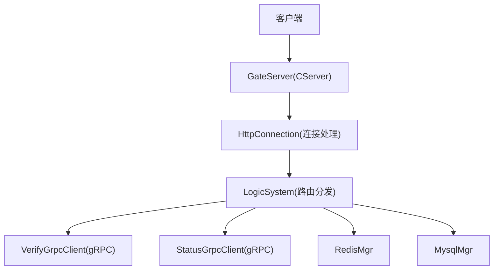
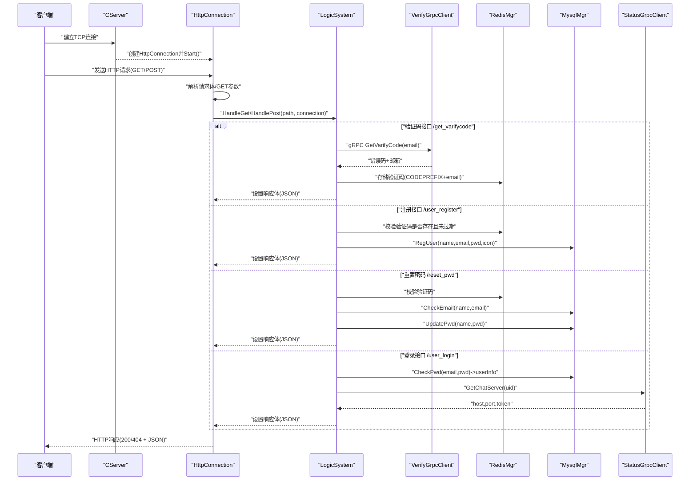
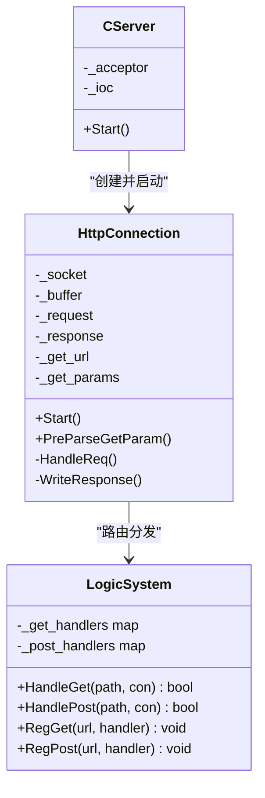
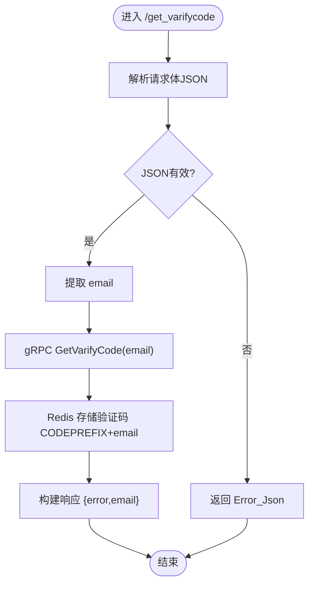
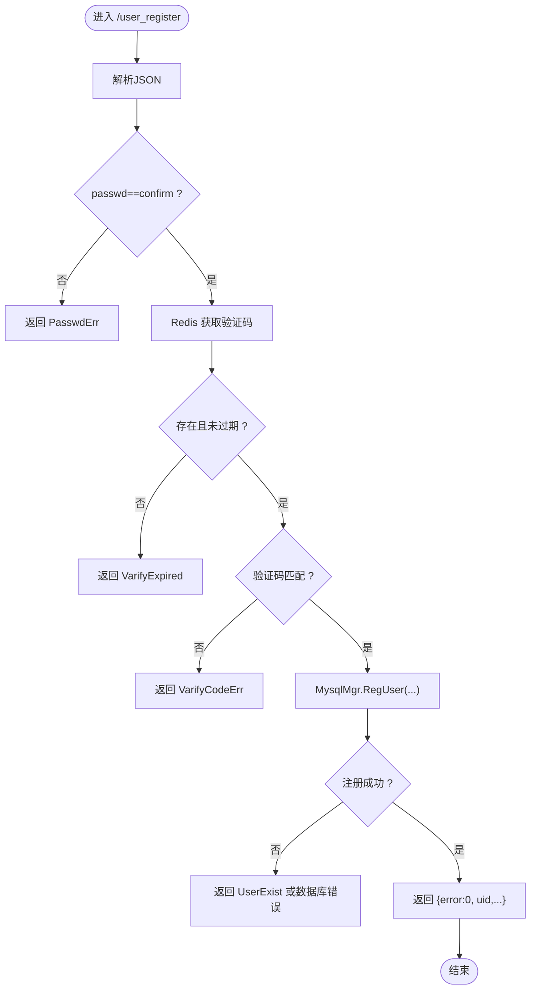
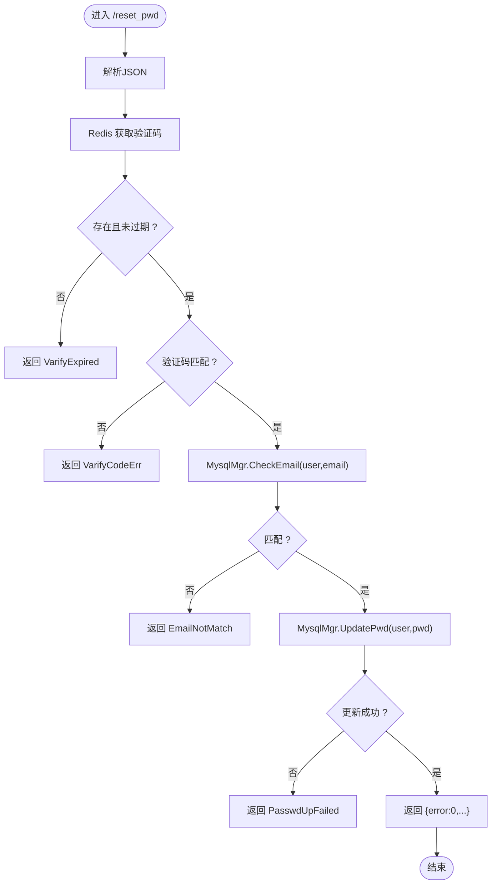
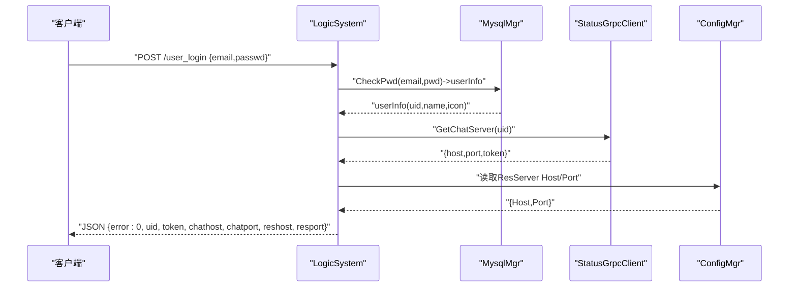
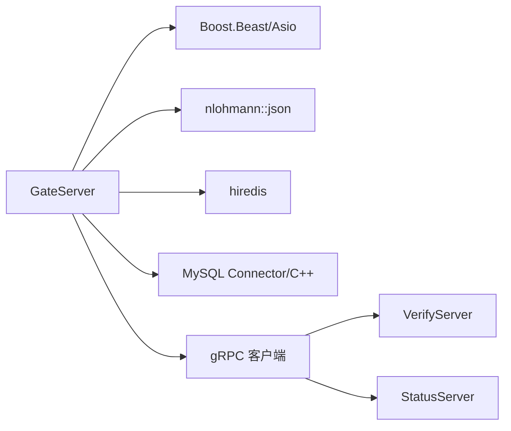

# 业务接口

<cite>
**本文引用的文件**   
- [HttpConnection.h](file://server/GateServer/include/HttpConnection.h)
- [HttpConnection.cpp](file://server/GateServer/src/HttpConnection.cpp)
- [LogicSystem.h](file://server/GateServer/include/LogicSystem.h)
- [LogicSystem.cpp](file://server/GateServer/src/LogicSystem.cpp)
- [CServer.h](file://server/GateServer/include/CServer.h)
- [CServer.cpp](file://server/GateServer/src/CServer.cpp)
- [GateServer.cpp](file://server/GateServer/src/GateServer.cpp)
- [const.h](file://server/GateServer/include/const.h)
</cite>

## 目录
1. [简介](#简介)
2. [项目结构](#项目结构)
3. [核心组件](#核心组件)
4. [架构总览](#架构总览)
5. [详细组件分析](#详细组件分析)
6. [依赖分析](#依赖分析)
7. [性能考虑](#性能考虑)
8. [故障排查指南](#故障排查指南)
9. [结论](#结论)
10. [附录：RESTful规范与通用约定](#附录restful规范与通用约定)

## 简介
本文件为 LLFCChat 的业务相关 HTTP API 提供完整文档，覆盖网关层（GateServer）的HTTP路由、请求解析、响应封装以及与gRPC微服务的调用关系。当前已实现的HTTP接口包括验证码获取、用户注册、重置密码和用户登录等；好友管理、消息查询、用户信息获取等业务接口尚未在GateServer中暴露HTTP端点，将在后续扩展。

## 项目结构
GateServer作为HTTP入口，采用Boost.Beast实现异步HTTP服务，通过LogicSystem进行URL路由分发，并借助Redis、MySQL以及gRPC客户端与后端服务交互。

**图示来源** 
- [CServer.cpp:10-33](file://server/GateServer/src/CServer.cpp#L10-L33)
- [HttpConnection.cpp:132-194](file://server/GateServer/src/HttpConnection.cpp#L132-L194)
- [LogicSystem.cpp:36-396](file://server/GateServer/src/LogicSystem.cpp#L36-L396)

**章节来源**
- [CServer.h:1-16](file://server/GateServer/include/CServer.h#L1-L16)
- [CServer.cpp:1-36](file://server/GateServer/src/CServer.cpp#L1-L36)
- [GateServer.cpp:128-160](file://server/GateServer/src/GateServer.cpp#L128-L160)

## 核心组件
- CServer：基于Boost.Asio的TCP监听器，负责接受新连接并创建HttpConnection实例。
- HttpConnection：封装单个HTTP连接的读写、超时控制、GET参数预解析与响应写入。
- LogicSystem：单例路由系统，维护GET/POST处理器映射，按路径分发到对应业务逻辑。
- gRPC客户端：VerifyGrpcClient（验证码服务）、StatusGrpcClient（状态服务）。
- 数据访问：RedisMgr（验证码缓存）、MysqlMgr（用户数据持久化）。

**章节来源**
- [HttpConnection.h:1-36](file://server/GateServer/include/HttpConnection.h#L1-L36)
- [HttpConnection.cpp:1-225](file://server/GateServer/src/HttpConnection.cpp#L1-L225)
- [LogicSystem.h:1-24](file://server/GateServer/include/LogicSystem.h#L1-L24)
- [LogicSystem.cpp:1-467](file://server/GateServer/src/LogicSystem.cpp#L1-L467)

## 架构总览
GateServer接收HTTP请求后，由HttpConnection完成协议层处理，随后将请求交由LogicSystem根据URL路径分发给具体handler。业务handler内部可能调用Redis、MySQL或gRPC服务，最终统一以JSON格式返回响应。

**图示来源** 
- [HttpConnection.cpp:132-194](file://server/GateServer/src/HttpConnection.cpp#L132-L194)
- [LogicSystem.cpp:105-396](file://server/GateServer/src/LogicSystem.cpp#L105-L396)

## 详细组件分析

### HTTP连接与路由分发
- HttpConnection负责读取请求、解析GET参数、设置响应头与内容类型、异步写回响应，并在无匹配路由时返回404。
- LogicSystem在构造阶段注册所有GET/POST处理器，使用std::map维护url到处理函数的映射。

**图示来源** 
- [HttpConnection.h:1-36](file://server/GateServer/include/HttpConnection.h#L1-L36)
- [LogicSystem.h:1-24](file://server/GateServer/include/LogicSystem.h#L1-L24)
- [CServer.h:1-16](file://server/GateServer/include/CServer.h#L1-L16)

**章节来源**
- [HttpConnection.cpp:1-225](file://server/GateServer/src/HttpConnection.cpp#L1-L225)
- [LogicSystem.cpp:405-467](file://server/GateServer/src/LogicSystem.cpp#L405-L467)

### 验证码获取接口 GET/POST
- URL：/get_varifycode
- 方法：POST
- 请求体字段：email
- 处理流程：解析JSON -> 提取email -> gRPC调用VerifyGrpcClient.GetVarifyCode -> 将验证码存入Redis（key=CODEPREFIX+email）-> 返回error与email
- 成功响应示例（JSON）：{"error":0,"email":"xxx@xxx.com"}
- 失败场景：JSON解析失败返回Error_Json；gRPC失败返回RPCFailed

**图示来源** 
- [LogicSystem.cpp:105-147](file://server/GateServer/src/LogicSystem.cpp#L105-L147)

**章节来源**
- [LogicSystem.cpp:105-147](file://server/GateServer/src/LogicSystem.cpp#L105-L147)

### 用户注册接口 POST
- URL：/user_register
- 方法：POST
- 请求体字段：email、user、passwd、confirm、icon、varifycode
- 处理流程：
  1) 校验两次密码一致
  2) 从Redis获取验证码并校验是否过期
  3) 比对验证码是否正确
  4) 调用MysqlMgr.RegUser注册用户（检查重复）
  5) 返回包含uid及输入字段的JSON
- 成功响应示例（JSON）：{"error":0,"uid":123,"email":"...","user":"...","passwd":"...","confirm":"...","icon":"...","varifycode":"..."}
- 失败场景：PasswdErr、VarifyExpired、VarifyCodeErr、UserExist、数据库异常

**图示来源** 
- [LogicSystem.cpp:148-233](file://server/GateServer/src/LogicSystem.cpp#L148-L233)

**章节来源**
- [LogicSystem.cpp:148-233](file://server/GateServer/src/LogicSystem.cpp#L148-L233)

### 重置密码接口 POST
- URL：/reset_pwd
- 方法：POST
- 请求体字段：email、user、passwd、varifycode
- 处理流程：
  1) 校验验证码是否过期
  2) 比对验证码是否正确
  3) 校验user与email是否匹配（防止恶意重置）
  4) 更新数据库密码
- 成功响应示例（JSON）：{"error":0,"email":"...","user":"...","passwd":"...","varifycode":"..."}
- 失败场景：VarifyExpired、VarifyCodeErr、EmailNotMatch、PasswdUpFailed

**图示来源** 
- [LogicSystem.cpp:235-316](file://server/GateServer/src/LogicSystem.cpp#L235-L316)

**章节来源**
- [LogicSystem.cpp:235-316](file://server/GateServer/src/LogicSystem.cpp#L235-L316)

### 用户登录接口 POST
- URL：/user_login
- 方法：POST
- 请求体字段：email、passwd
- 处理流程：
  1) 校验邮箱与密码（MysqlMgr.CheckPwd），获取用户信息
  2) gRPC调用StatusGrpcClient.GetChatServer(uid)，分配ChatServer（host、port、token）
  3) 从配置读取ResourceServer地址（Host、Port）
  4) 返回包含uid、token、chathost、chatport、reshost、resport的JSON
- 成功响应示例（JSON）：{"error":0,"email":"...","uid":123,"token":"...","chathost":"...","chatport":"...","reshost":"...","resport":"..."}
- 失败场景：PasswdInvalid、RPCFailed

**图示来源** 
- [LogicSystem.cpp:318-396](file://server/GateServer/src/LogicSystem.cpp#L318-L396)

**章节来源**
- [LogicSystem.cpp:318-396](file://server/GateServer/src/LogicSystem.cpp#L318-L396)

### 测试接口（用于验证）
- GET /get_test：回显所有GET参数
- POST /test_procedure：调用MySQL存储过程，返回uid、name、email

**章节来源**
- [LogicSystem.cpp:36-104](file://server/GateServer/src/LogicSystem.cpp#L36-L104)

## 依赖分析
GateServer对以下外部依赖有直接依赖：
- Boost.Beast/Asio：HTTP/TCP网络栈
- nlohmann/json：JSON序列化/反序列化
- hiredis：Redis客户端
- MySQL Connector/C++：数据库访问
- gRPC：跨服务通信（验证码服务、状态服务）

**图示来源** 
- [const.h:1-65](file://server/GateServer/include/const.h#L1-L65)
- [GateServer.cpp:128-160](file://server/GateServer/src/GateServer.cpp#L128-L160)

**章节来源**
- [const.h:1-65](file://server/GateServer/include/const.h#L1-L65)
- [GateServer.cpp:128-160](file://server/GateServer/src/GateServer.cpp#L128-L160)

## 性能考虑
- 异步I/O：CServer与HttpConnection均采用Boost.Asio异步模型，避免阻塞。
- 短连接：默认keep_alive=false，减少长连接资源占用。
- 超时控制：每个连接设置60秒deadline，防止僵尸连接。
- 路由查找：使用std::map进行路径匹配，时间复杂度O(logN)，适合中等规模路由表。
- 建议：
  - 对热点接口增加Redis缓存（如用户信息、好友列表）
  - 对分页与搜索接口引入索引与限流
  - 对gRPC调用增加重试与熔断策略

[本节为通用指导，不直接分析具体文件]

## 故障排查指南
- 404 Not Found：未注册的路径或方法不匹配，检查LogicSystem中的RegGet/RegPost注册。
- JSON解析失败：确认请求体为合法JSON，参考Error_Json错误码。
- 验证码问题：检查Redis中是否存在CODEPREFIX+email键，确认验证码未过期且正确。
- 数据库异常：检查MysqlMgr连接与SQL执行结果，关注UserExist、PasswdUpFailed等错误码。
- gRPC失败：检查VerifyServer与StatusServer可用性，关注RPCFailed错误码。

**章节来源**
- [HttpConnection.cpp:132-194](file://server/GateServer/src/HttpConnection.cpp#L132-L194)
- [const.h:31-44](file://server/GateServer/include/const.h#L31-L44)
- [LogicSystem.cpp:105-396](file://server/GateServer/src/LogicSystem.cpp#L105-L396)

## 结论
GateServer实现了Gate层的核心HTTP能力与基础业务接口（验证码、注册、重置密码、登录），并通过gRPC与Redis/MySQL协同工作。未来可扩展好友管理、消息查询、用户信息查询等HTTP接口，遵循本文档的RESTful规范与错误码约定。

[本节为总结性内容，不直接分析具体文件]

## 附录：RESTful规范与通用约定
- RESTful设计原则
  - 资源命名：使用名词复数形式，如 /users、/friends、/messages
  - HTTP方法：GET用于查询，POST用于提交数据，PUT/PATCH用于更新，DELETE用于删除
  - 路径层级：保持清晰层级，避免深层嵌套
- URL路径规划（建议）
  - 好友管理：/friends、/friend-requests、/friend-verify
  - 消息查询：/messages?user_id=&page=&size=&sort=
  - 用户信息：/users/{id}
- HTTP方法使用
  - GET：只读查询，支持分页、过滤、排序
  - POST：创建资源或触发操作（如发送验证码）
  - PUT/PATCH：更新资源
  - DELETE：删除资源
- 分页查询、搜索过滤、排序
  - 分页参数：page（页码，从1开始）、size（每页条数）
  - 过滤参数：按字段名传递，如 user_id、status
  - 排序参数：sort=field:asc|desc，多字段用逗号分隔
- 状态码定义
  - 200 OK：成功
  - 400 Bad Request：请求参数错误
  - 404 Not Found：未找到资源或路由
  - 500 Internal Server Error：服务器内部错误
- 错误消息格式
  - 统一JSON结构：{"error": 错误码, "message": "描述", "data": {...}}
  - 错误码定义见 const.h 中的 ErrorCodes
- 时间戳格式
  - 建议使用ISO 8601字符串，如 "2024-01-01T12:00:00Z"
  - 或使用Unix时间戳（秒/毫秒）
- 认证与授权
  - 登录成功后返回token，后续请求在Header中携带Authorization: Bearer <token>
- 与gRPC微服务的调用关系
  - GateServer通过VerifyGrpcClient调用验证码服务
  - GateServer通过StatusGrpcClient调用状态服务分配ChatServer
  - 数据转换：HTTP JSON <-> gRPC Protobuf，由LogicSystem中的handler负责转换

[本节为通用规范说明，不直接分析具体文件]