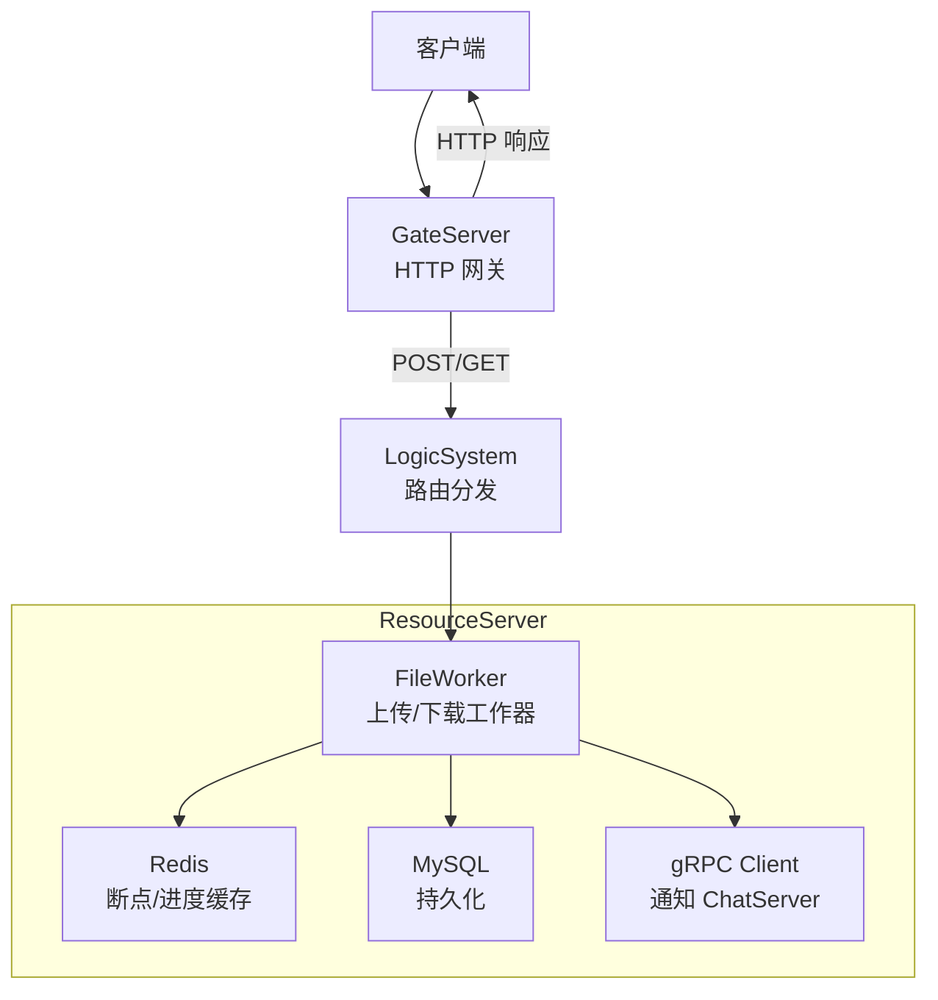
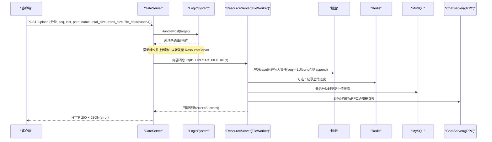
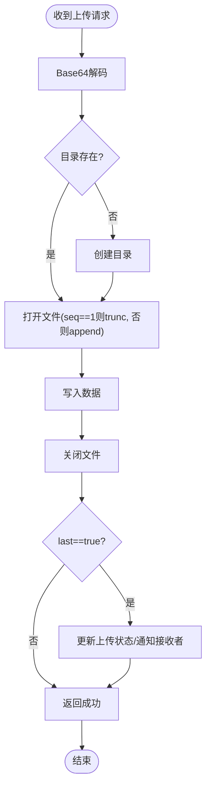
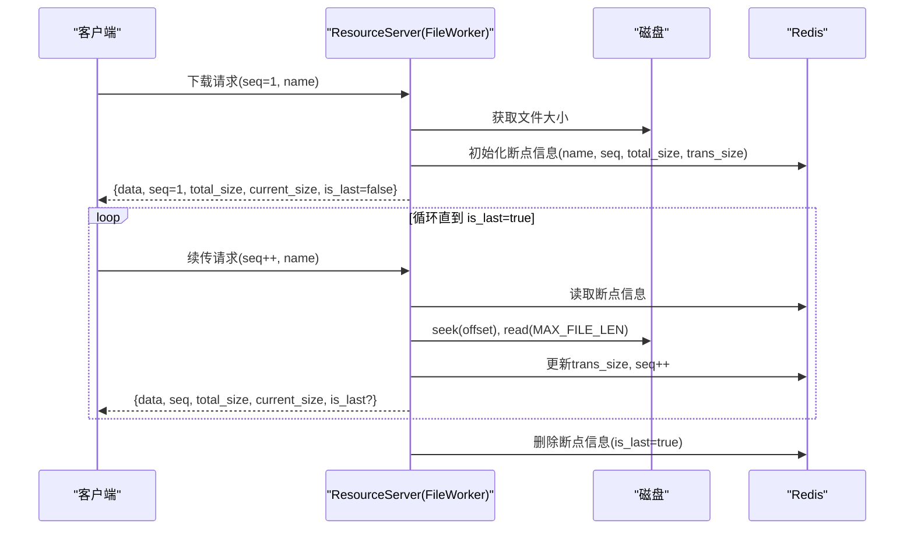
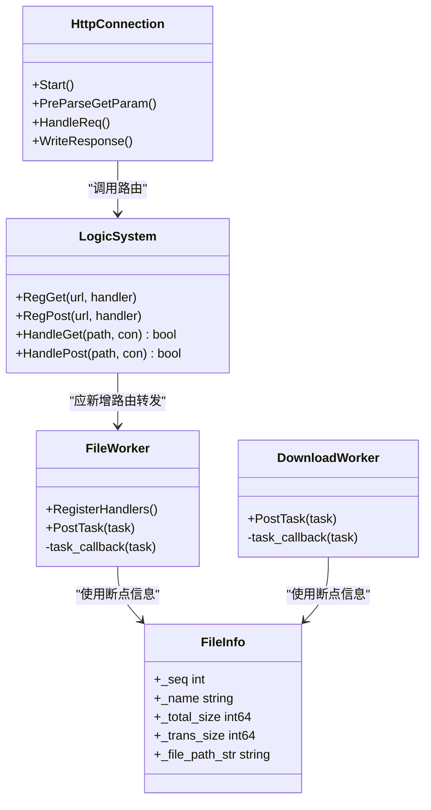

# 文件上传下载接口

<cite>
**本文引用的文件**   
- [FileWorker.h](file://server/ResourceServer/include/FileWorker.h)
- [FileWorker.cpp](file://server/ResourceServer/src/FileWorker.cpp)
- [const.h](file://server/ResourceServer/include/const.h)
- [FileInfo.h](file://server/ResourceServer/include/FileInfo.h)
- [HttpConnection.h](file://server/GateServer/include/HttpConnection.h)
- [HttpConnection.cpp](file://server/GateServer/src/HttpConnection.cpp)
- [LogicSystem.h](file://server/GateServer/include/LogicSystem.h)
- [LogicSystem.cpp](file://server/GateServer/src/LogicSystem.cpp)
- [config.ini](file://server/ResourceServer/config/config.ini)
</cite>

## 目录
1. [简介](#简介)
2. [项目结构](#项目结构)
3. [核心组件](#核心组件)
4. [架构总览](#架构总览)
5. [详细组件分析](#详细组件分析)
6. [依赖关系分析](#依赖关系分析)
7. [性能考虑](#性能考虑)
8. [故障排查指南](#故障排查指南)
9. [结论](#结论)
10. [附录：客户端实现示例与协作模式](#附录客户端实现示例与协作模式)

## 简介
本文件为 LLFCChat 的文件传输 HTTP API 提供完整文档，覆盖以下能力：
- 文件上传（普通文件、头像、聊天图片）
- 文件下载（支持断点续传）
- 分块上传协议与进度回调机制
- 文件类型限制、大小限制与安全校验规则
- 文件存储路径规则、命名策略与元数据管理
- 与 TCP 文件传输服务的协作模式
- Python/JavaScript 客户端实现要点（错误处理、重试、进度显示）

说明：当前仓库中 GateServer 的 LogicSystem 未包含文件上传/下载的 HTTP 路由注册；实际文件上传/下载由 ResourceServer 的 FileWorker 通过内部消息 ID 驱动。本文档基于现有代码进行归纳与扩展设计，确保与既有实现一致并可指导客户端集成。

## 项目结构
- GateServer：HTTP 网关，负责解析请求、路由分发、CORS 设置、超时控制等。
- ResourceServer：资源服务，提供文件上传/下载的核心逻辑，包括分块写入、Base64 编解码、Redis 断点状态、MySQL 状态更新、gRPC 通知 ChatServer。
- 配置：ResourceServer 的配置文件定义了自身监听地址端口、数据库与缓存连接信息、静态资源目录等。

图表来源
- [HttpConnection.cpp:133-194](file://server/GateServer/src/HttpConnection.cpp#L133-L194)
- [LogicSystem.cpp:36-396](file://server/GateServer/src/LogicSystem.cpp#L36-L396)
- [FileWorker.cpp:46-455](file://server/ResourceServer/src/FileWorker.cpp#L46-L455)

章节来源
- [HttpConnection.h:1-36](file://server/GateServer/include/HttpConnection.h#L1-L36)
- [HttpConnection.cpp:1-225](file://server/GateServer/src/HttpConnection.cpp#L1-L225)
- [LogicSystem.h:1-24](file://server/GateServer/include/LogicSystem.h#L1-L24)
- [LogicSystem.cpp:1-467](file://server/GateServer/src/LogicSystem.cpp#L1-L467)
- [config.ini:1-27](file://server/ResourceServer/config/config.ini#L1-L27)

## 核心组件
- FileWorker：上传/下载任务队列与工作线程，按消息 ID 分发到具体处理器，完成 Base64 编解码、文件 IO、Redis 状态维护、MySQL 状态更新、gRPC 通知。
- FileInfo：下载断点续传的元数据结构（序列号、文件名、总大小、已传输大小、文件路径）。
- HttpConnection：Beast HTTP 连接封装，负责读取请求、解析 GET 参数、构造响应、超时控制。
- LogicSystem：路由注册与分发，将 URL 映射到处理函数（当前未注册文件相关路由）。

章节来源
- [FileWorker.h:15-91](file://server/ResourceServer/include/FileWorker.h#L15-L91)
- [FileWorker.cpp:46-455](file://server/ResourceServer/src/FileWorker.cpp#L46-L455)
- [FileInfo.h:1-26](file://server/ResourceServer/include/FileInfo.h#L1-L26)
- [HttpConnection.h:1-36](file://server/GateServer/include/HttpConnection.h#L1-L36)
- [HttpConnection.cpp:133-194](file://server/GateServer/src/HttpConnection.cpp#L133-L194)
- [LogicSystem.h:1-24](file://server/GateServer/include/LogicSystem.h#L1-L24)
- [LogicSystem.cpp:36-396](file://server/GateServer/src/LogicSystem.cpp#L36-L396)

## 架构总览
- 上传流程：客户端发送分块数据（Base64），服务器解码后按 seq 顺序写入目标文件；最后一个分块触发状态更新与 gRPC 通知。
- 下载流程：首次请求获取文件大小并初始化断点信息；后续请求携带 seq 从 Redis 恢复进度，按偏移量读取分块并返回 Base64 编码数据；完成后清理断点。
- 安全与校验：错误码统一在 const.h 定义；读写权限、路径创建、序列号与偏移量校验均在 FileWorker 中执行。

图表来源
- [FileWorker.cpp:46-109](file://server/ResourceServer/src/FileWorker.cpp#L46-L109)
- [const.h:72-95](file://server/ResourceServer/include/const.h#L72-L95)

章节来源
- [FileWorker.cpp:46-455](file://server/ResourceServer/src/FileWorker.cpp#L46-L455)
- [const.h:5-29](file://server/ResourceServer/include/const.h#L5-L29)

## 详细组件分析

### 文件上传接口规范
- 适用场景：普通文件、头像、聊天图片、文件信息同步、聊天图片续传。
- 请求体格式：multipart/form-data 或 application/json（建议采用 JSON 承载 base64 数据，便于服务端解码）。
- 字段说明：
  - msg_id：消息标识（ID_UPLOAD_FILE_REQ、ID_UPLOAD_HEAD_ICON_REQ、ID_IMG_CHAT_UPLOAD_REQ、ID_FILE_INFO_SYNC_REQ、ID_IMG_CHAT_CONTINUE_UPLOAD_REQ）
  - uid：用户ID
  - seq：分块序号（从1开始递增）
  - total_size：文件总大小（字节）
  - trans_size：本次传输大小（字节）
  - last：是否最后一个分块（布尔）
  - path：目标文件路径（含文件名）
  - name：文件名（含扩展名）
  - file_data：二进制数据的 base64 编码字符串
  - chat_msg_id：聊天消息ID（用于图片上传后状态更新）
  - sender/receiver：发送者与接收者ID（用于图片通知）
- 响应体：JSON，包含 error 字段（成功为 Success 对应值）。

图表来源
- [FileWorker.cpp:46-109](file://server/ResourceServer/src/FileWorker.cpp#L46-L109)
- [FileWorker.cpp:112-193](file://server/ResourceServer/src/FileWorker.cpp#L112-L193)
- [FileWorker.cpp:196-280](file://server/ResourceServer/src/FileWorker.cpp#L196-L280)
- [FileWorker.cpp:283-366](file://server/ResourceServer/src/FileWorker.cpp#L283-L366)
- [FileWorker.cpp:369-453](file://server/ResourceServer/src/FileWorker.cpp#L369-L453)

章节来源
- [FileWorker.cpp:46-455](file://server/ResourceServer/src/FileWorker.cpp#L46-L455)
- [const.h:72-95](file://server/ResourceServer/include/const.h#L72-L95)

### 文件下载接口规范（支持断点续传）
- 首次请求：seq=1，服务器返回 total_size、current_size、is_last=false，并在 Redis 中初始化断点信息。
- 续传请求：携带上次 seq，服务器从 Redis 恢复进度，计算 offset=(seq-1)*MAX_FILE_LEN，读取分块并返回 base64 数据。
- 完成标志：当 current_pos >= total_size 时 is_last=true，随后清理 Redis 中的断点信息。
- 响应字段：data（base64）、seq、total_size、current_size、is_last、error。

图表来源
- [FileWorker.cpp:525-659](file://server/ResourceServer/src/FileWorker.cpp#L525-L659)
- [FileInfo.h:1-26](file://server/ResourceServer/include/FileInfo.h#L1-L26)
- [const.h:114](file://server/ResourceServer/include/const.h#L114)

章节来源
- [FileWorker.cpp:525-659](file://server/ResourceServer/src/FileWorker.cpp#L525-L659)
- [FileInfo.h:1-26](file://server/ResourceServer/include/FileInfo.h#L1-L26)

### 分块上传协议与进度回调
- 分块协议：每个分块包含 seq、last、path、name、total_size、trans_size、file_data(base64)。
- 进度回调：FileWorker 使用 std::function<void(const json&)> 作为回调，在每分块处理后调用，上层可据此更新 UI 进度。
- 并发模型：FileWorker 与 DownloadWorker 各自维护独立的工作线程与任务队列，通过条件变量唤醒。

章节来源
- [FileWorker.h:15-91](file://server/ResourceServer/include/FileWorker.h#L15-L91)
- [FileWorker.cpp:457-478](file://server/ResourceServer/src/FileWorker.cpp#L457-L478)
- [FileWorker.cpp:480-523](file://server/ResourceServer/src/FileWorker.cpp#L480-L523)

### 文件类型限制、大小限制与安全校验
- 大小限制：MAX_FILE_LEN 定义单分块最大长度（默认 32KB），下载按此分块读取。
- 类型限制：当前实现未对文件扩展名做白名单校验，建议在客户端与服务端共同约定允许的类型（如 image/*、application/pdf 等）。
- 安全校验：
  - 路径创建失败、写权限不足、读权限不足、文件不存在、序列号无效、偏移量无效、读取失败等均有明确错误码。
  - 头像上传成功后会更新用户图标并刷新 Redis 缓存。
  - 聊天图片上传完成后通过 gRPC 通知 ChatServer 推送给接收者。

章节来源
- [const.h:5-29](file://server/ResourceServer/include/const.h#L5-L29)
- [const.h:114](file://server/ResourceServer/include/const.h#L114)
- [FileWorker.cpp:112-193](file://server/ResourceServer/src/FileWorker.cpp#L112-L193)
- [FileWorker.cpp:196-280](file://server/ResourceServer/src/FileWorker.cpp#L196-L280)

### 文件存储路径规则、命名策略与元数据管理
- 路径规则：服务端根据 path 参数确定目标目录与文件名，若目录不存在则自动创建。
- 命名策略：直接使用传入的 name（含扩展名），建议客户端生成唯一文件名（如 UUID 前缀+原扩展名）以避免冲突。
- 元数据管理：
  - 下载断点信息存储在 Redis 中（key 为文件名，value 为 FileInfo 序列化）。
  - 聊天图片上传状态通过 MySQL 更新，并通过 gRPC 通知 ChatServer。

章节来源
- [FileWorker.cpp:46-109](file://server/ResourceServer/src/FileWorker.cpp#L46-L109)
- [FileWorker.cpp:525-659](file://server/ResourceServer/src/FileWorker.cpp#L525-L659)
- [FileInfo.h:1-26](file://server/ResourceServer/include/FileInfo.h#L1-L26)

### 与 TCP 文件传输服务的协作模式
- 当前实现中，文件上传/下载通过 HTTP 进入 GateServer，再由 ResourceServer 的 FileWorker 处理；ChatServer 通过 gRPC 被通知图片上传完成，以便向在线接收者推送。
- 若未来需要纯 TCP 大文件传输，可在 GateServer 增加 WebSocket 或自定义协议入口，将分块数据转发至 ResourceServer 或专用 TCP 服务，保持与现有断点续传一致的 Redis 状态管理。

章节来源
- [FileWorker.cpp:196-280](file://server/ResourceServer/src/FileWorker.cpp#L196-L280)
- [FileWorker.cpp:283-366](file://server/ResourceServer/src/FileWorker.cpp#L283-L366)
- [FileWorker.cpp:369-453](file://server/ResourceServer/src/FileWorker.cpp#L369-L453)

## 依赖关系分析
- GateServer 依赖 LogicSystem 进行路由分发；当前未注册文件相关路由，需在 LogicSystem 中新增上传/下载接口。
- ResourceServer 的 FileWorker 依赖 Redis 管理器、MySQL 管理器、gRPC 客户端（ChatServerGrpcClient）以及文件系统。
- 常量与错误码集中在 const.h，便于统一管理与扩展。

图表来源
- [HttpConnection.h:1-36](file://server/GateServer/include/HttpConnection.h#L1-L36)
- [LogicSystem.h:1-24](file://server/GateServer/include/LogicSystem.h#L1-L24)
- [FileWorker.h:15-91](file://server/ResourceServer/include/FileWorker.h#L15-L91)
- [FileInfo.h:1-26](file://server/ResourceServer/include/FileInfo.h#L1-L26)

章节来源
- [HttpConnection.cpp:133-194](file://server/GateServer/src/HttpConnection.cpp#L133-L194)
- [LogicSystem.cpp:36-396](file://server/GateServer/src/LogicSystem.cpp#L36-L396)
- [FileWorker.cpp:46-455](file://server/ResourceServer/src/FileWorker.cpp#L46-L455)

## 性能考虑
- 分块大小：MAX_FILE_LEN=32KB，适合网络传输与内存占用平衡；可根据带宽与设备性能调整。
- 并发模型：FileWorker 与 DownloadWorker 各持一个工作线程与任务队列，避免阻塞主 I/O 线程。
- 缓存策略：Redis 用于断点续传状态，减少磁盘随机访问；头像上传后刷新缓存以提升读取性能。
- I/O 优化：首包 trunc 创建文件，后续 append 写入；下载时直接 seek 定位偏移，避免全量读取。

章节来源
- [const.h:114](file://server/ResourceServer/include/const.h#L114)
- [FileWorker.cpp:46-109](file://server/ResourceServer/src/FileWorker.cpp#L46-L109)
- [FileWorker.cpp:525-659](file://server/ResourceServer/src/FileWorker.cpp#L525-L659)

## 故障排查指南
- 常见错误码：
  - Error_Json：JSON 解析失败
  - FileNotExists：文件不存在
  - FileWritePermissionFailed：写权限不足
  - FileReadPermissionFailed：读权限不足
  - FileSeqInvalid：序列号不匹配
  - FileOffsetInvalid：偏移量超出范围
  - FileReadFailed：读取失败
  - RedisReadErr：Redis 读取失败
- 排查步骤：
  - 检查请求字段是否完整（msg_id、uid、seq、last、path、name、file_data）。
  - 确认目录权限与磁盘空间。
  - 验证 Redis 中是否存在断点信息（下载续传）。
  - 查看 MySQL 状态更新是否成功（聊天图片上传）。
  - 检查 gRPC 通知是否到达 ChatServer（图片推送）。

章节来源
- [const.h:5-29](file://server/ResourceServer/include/const.h#L5-L29)
- [FileWorker.cpp:525-659](file://server/ResourceServer/src/FileWorker.cpp#L525-L659)

## 结论
LLFCChat 的文件传输功能以 ResourceServer 的 FileWorker 为核心，实现了稳定的分块上传与断点续传下载。GateServer 目前未注册文件相关路由，需在 LogicSystem 中补充上传/下载接口以打通端到端流程。通过 Redis 与 MySQL 的状态管理，结合 gRPC 通知机制，系统具备良好的可扩展性与可靠性。

## 附录：客户端实现示例与协作模式

### Python 客户端示例（上传）
- 使用 requests 库发送 multipart/form-data 或 application/json（base64 数据）。
- 分块上传：循环读取文件，每次取 MAX_FILE_LEN 字节，base64 编码后发送，seq 自增，last 标记最后一个分块。
- 进度回调：根据返回的 error 与 current_size 更新 UI 进度条。
- 错误处理：捕获网络异常与业务错误码，实现指数退避重试。

参考路径
- [FileWorker.cpp:46-109](file://server/ResourceServer/src/FileWorker.cpp#L46-L109)
- [const.h:114](file://server/ResourceServer/include/const.h#L114)

### JavaScript 客户端示例（下载）
- 使用 fetch 或 XMLHttpRequest 发起下载请求，seq=1 获取 total_size。
- 循环续传：每次请求 seq++，接收 data 并解码为二进制，追加写入本地文件。
- 进度显示：根据 current_size 与 total_size 计算百分比。
- 错误处理：遇到 RedisReadErr 或 FileSeqInvalid 时重置 seq 并重试。

参考路径
- [FileWorker.cpp:525-659](file://server/ResourceServer/src/FileWorker.cpp#L525-L659)
- [FileInfo.h:1-26](file://server/ResourceServer/include/FileInfo.h#L1-L26)

### 与 TCP 文件传输服务的协作模式
- 信令通道：通过 HTTP/Gateway 进行认证与路由。
- 数据通道：大文件可通过 WebSocket 或自定义 TCP 协议传输，保持与 HTTP 一致的断点续传状态（Redis）。
- 通知机制：上传完成后通过 gRPC 通知 ChatServer，以便向在线用户推送。

章节来源
- [HttpConnection.cpp:133-194](file://server/GateServer/src/HttpConnection.cpp#L133-L194)
- [FileWorker.cpp:196-280](file://server/ResourceServer/src/FileWorker.cpp#L196-L280)
- [config.ini:1-27](file://server/ResourceServer/config/config.ini#L1-L27)