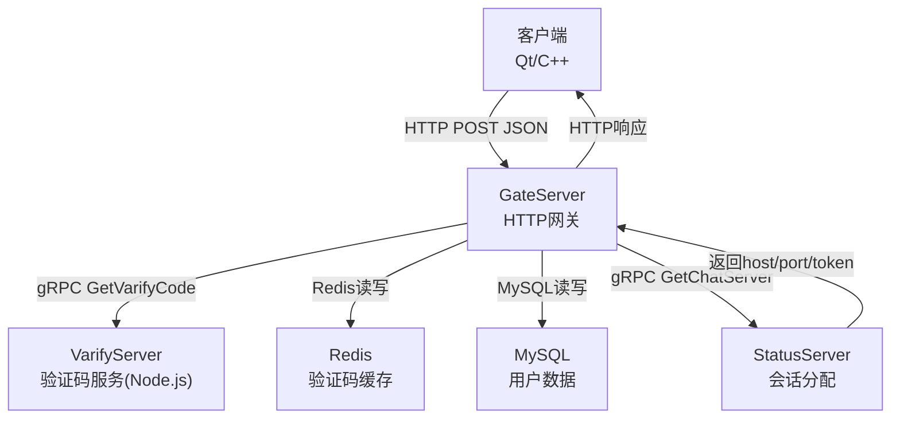
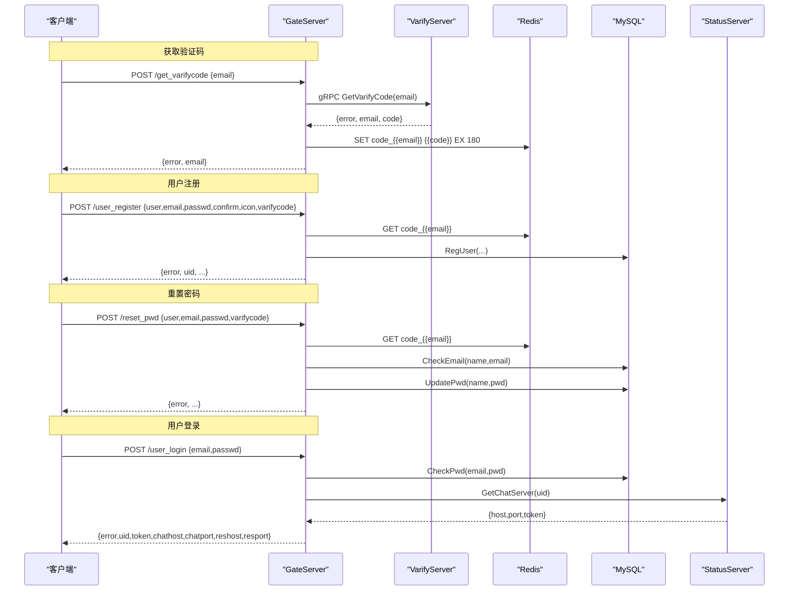
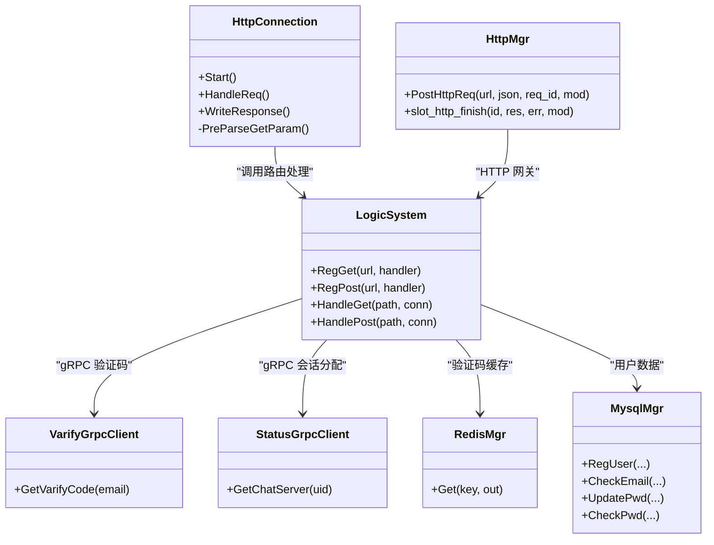

# 用户认证接口

<cite>
**本文引用的文件**   
- [HttpConnection.h](file://server/GateServer/include/HttpConnection.h)
- [HttpConnection.cpp](file://server/GateServer/src/HttpConnection.cpp)
- [LogicSystem.h](file://server/GateServer/include/LogicSystem.h)
- [LogicSystem.cpp](file://server/GateServer/src/LogicSystem.cpp)
- [const.h](file://server/GateServer/include/const.h)
- [verify.proto](file://proto/verify_service/verify.proto)
- [server.js](file://server/VarifyServer/server.js)
- [httpmgr.h](file://client/llfcchat/include/httpmgr.h)
- [httpmgr.cpp](file://client/llfcchat/src/httpmgr.cpp)
- [logindialog.cpp](file://client/llfcchat/src/logindialog.cpp)
- [registerdialog.cpp](file://client/llfcchat/src/registerdialog.cpp)
- [resetdialog.cpp](file://client/llfcchat/src/resetdialog.cpp)
- [global.h](file://client/llfcchat/include/global.h)
</cite>

## 目录
1. [简介](#简介)
2. [项目结构](#项目结构)
3. [核心组件](#核心组件)
4. [架构总览](#架构总览)
5. [详细接口规范](#详细接口规范)
6. [依赖关系分析](#依赖关系分析)
7. [性能与可用性建议](#性能与可用性建议)
8. [故障排查指南](#故障排查指南)
9. [结论](#结论)
10. [附录：调用示例](#附录调用示例)

## 简介
本文件为 LLFCChat 的用户认证相关 HTTP API 的完整技术文档，覆盖以下能力：
- 邮箱验证码发送与验证流程
- 用户注册、登录、密码重置
- 请求数据格式（JSON）、字段校验规则、错误码说明
- 客户端与服务端交互时序
- JWT/令牌机制说明（当前实现基于服务端分配的 TCP 连接 token）
- curl 与 JavaScript 客户端调用示例

## 项目结构
认证相关的 HTTP 入口位于 GateServer，负责接收并路由 GET/POST 请求；业务逻辑在 LogicSystem 中按 URL 注册处理函数；验证码服务由 VarifyServer（Node.js）提供，GateServer 通过 gRPC 调用。

**图表来源** 
- [HttpConnection.cpp:132-194](file://server/GateServer/src/HttpConnection.cpp#L132-L194)
- [LogicSystem.cpp:105-395](file://server/GateServer/src/LogicSystem.cpp#L105-L395)
- [verify.proto:1-19](file://proto/verify_service/verify.proto#L1-L19)
- [server.js:39-75](file://server/VarifyServer/server.js#L39-L75)

**章节来源**
- [HttpConnection.h:1-36](file://server/GateServer/include/HttpConnection.h#L1-L36)
- [HttpConnection.cpp:1-225](file://server/GateServer/src/HttpConnection.cpp#L1-L225)
- [LogicSystem.h:1-24](file://server/GateServer/include/LogicSystem.h#L1-L24)
- [LogicSystem.cpp:1-467](file://server/GateServer/src/LogicSystem.cpp#L1-L467)

## 核心组件
- HTTP 连接封装 HttpConnection：解析请求、设置响应头、统一写回响应体。
- 路由分发 LogicSystem：按 URL 注册 GET/POST 处理器，完成参数校验、跨服务调用与响应构造。
- 验证码服务 VarifyServer：生成随机验证码、发送邮件、将验证码写入 Redis（key 前缀 CODEPREFIX）。
- 客户端 HTTP 管理器 HttpMgr：封装 QNetworkAccessManager 的 POST 请求，统一错误回调与模块分发。
- 错误码定义 const.h：统一的 error 字段枚举值。

**章节来源**
- [HttpConnection.cpp:132-194](file://server/GateServer/src/HttpConnection.cpp#L132-L194)
- [LogicSystem.cpp:105-395](file://server/GateServer/src/LogicSystem.cpp#L105-L395)
- [server.js:39-75](file://server/VarifyServer/server.js#L39-L75)
- [httpmgr.cpp:1-62](file://client/llfcchat/src/httpmgr.cpp#L1-L62)
- [const.h:31-44](file://server/GateServer/include/const.h#L31-L44)

## 架构总览
GateServer 作为 HTTP 网关，将认证相关请求分派到对应处理器：
- /get_varifycode：调用 VarifyServer 发送验证码，验证码存入 Redis（key=CODEPREFIX+email）。
- /user_register：校验两次密码一致、Redis 验证码有效且匹配，再注册用户。
- /reset_pwd：校验 Redis 验证码有效且匹配，校验用户名与邮箱匹配后更新密码。
- /user_login：校验邮箱密码，调用 StatusServer 分配 ChatServer 并返回 host/port/token。

**图表来源**
- [LogicSystem.cpp:105-395](file://server/GateServer/src/LogicSystem.cpp#L105-L395)
- [verify.proto:1-19](file://proto/verify_service/verify.proto#L1-L19)
- [server.js:39-75](file://server/VarifyServer/server.js#L39-L75)

## 详细接口规范

### 通用约定
- 协议：HTTP/1.1
- 方法：POST
- Content-Type：application/json
- 响应体：JSON，包含字段 error（整数），以及各接口特定字段
- 成功时 error=0；失败时 error 为非零错误码

**章节来源**
- [httpmgr.cpp:10-18](file://client/llfcchat/src/httpmgr.cpp#L10-L18)
- [const.h:31-44](file://server/GateServer/include/const.h#L31-L44)

### 错误码定义
- Success = 0
- Error_Json = 1001
- RPCFailed = 1002
- VarifyExpired = 1003
- VarifyCodeErr = 1004
- UserExist = 1005
- PasswdErr = 1006
- EmailNotMatch = 1007
- PasswdUpFailed = 1008
- PasswdInvalid = 1009
- TokenInvalid = 1010
- UidInvalid = 1011

**章节来源**
- [const.h:31-44](file://server/GateServer/include/const.h#L31-L44)

### 接口一：发送邮箱验证码
- 路径：/get_varifycode
- 方法：POST
- 请求体：{"email": "xxx@xxx.com"}
- 响应体：{"error": 0, "email": "xxx@xxx.com"}
- 行为：
  - 校验请求 JSON
  - 调用 VarifyServer 生成验证码并发送邮件
  - 将验证码以 key=CODEPREFIX+email 写入 Redis（过期时间由服务配置决定）
  - 返回 error 与 email

**章节来源**
- [LogicSystem.cpp:105-147](file://server/GateServer/src/LogicSystem.cpp#L105-L147)
- [verify.proto:1-19](file://proto/verify_service/verify.proto#L1-L19)
- [server.js:39-75](file://server/VarifyServer/server.js#L39-L75)

### 接口二：用户注册
- 路径：/user_register
- 方法：POST
- 请求体：
  - user: 用户名（必填）
  - email: 邮箱（必填）
  - passwd: 密码（必填）
  - confirm: 确认密码（必填）
  - icon: 头像（可选）
  - varifycode: 验证码（必填）
- 响应体：{"error": 0, "uid": 数字, "email": "...", "user": "...", "passwd": "...", "confirm": "...", "icon": "...", "varifycode": "..."}
- 校验流程：
  - 校验 JSON 与必填字段
  - 校验 passwd == confirm
  - 从 Redis 读取 code_{{email}}，不存在则返回 VarifyExpired
  - 比对 varifycode 与 Redis 中的验证码，不一致返回 VarifyCodeErr
  - 调用 MySQL 注册用户，若已存在或异常返回相应错误
  - 成功返回 uid 及请求字段回显

**章节来源**
- [LogicSystem.cpp:148-233](file://server/GateServer/src/LogicSystem.cpp#L148-L233)

### 接口三：重置密码
- 路径：/reset_pwd
- 方法：POST
- 请求体：{"user": "...", "email": "...", "passwd": "...", "varifycode": "..."}
- 响应体：{"error": 0, "email": "...", "user": "...", "passwd": "...", "varifycode": "..."}
- 校验流程：
  - 校验 JSON 与必填字段
  - 从 Redis 读取 code_{{email}}，不存在则返回 VarifyExpired
  - 比对 varifycode 与 Redis 中的验证码，不一致返回 VarifyCodeErr
  - 校验 user 与 email 是否匹配数据库记录，不匹配返回 EmailNotMatch
  - 更新密码，失败返回 PasswdUpFailed
  - 成功返回 error=0 及字段回显

**章节来源**
- [LogicSystem.cpp:235-316](file://server/GateServer/src/LogicSystem.cpp#L235-L316)

### 接口四：用户登录
- 路径：/user_login
- 方法：POST
- 请求体：{"email": "...", "passwd": "..."}
- 响应体：{"error": 0, "email": "...", "uid": 数字, "token": "字符串", "chathost": "字符串", "chatport": "字符串", "reshost": "字符串", "resport": "字符串"}
- 处理流程：
  - 校验 JSON 与必填字段
  - 校验邮箱与密码，失败返回 PasswdInvalid
  - 调用 StatusServer 分配 ChatServer，返回 host/port/token
  - 从配置文件读取 ResourceServer 地址
  - 返回登录结果与连接信息

注意：当前登录返回的 token 是用于后续 TCP 连接认证的令牌，并非 JWT。系统未实现 JWT 签发与刷新策略。

**章节来源**
- [LogicSystem.cpp:318-395](file://server/GateServer/src/LogicSystem.cpp#L318-L395)

### 字段校验规则（客户端侧）
- 邮箱：符合正则表达式的基本邮箱格式
- 密码：长度 6~15，仅允许字母、数字与部分特殊字符
- 确认密码：与密码一致
- 验证码：非空
- 用户名：非空

这些校验在客户端界面层进行，服务端也会做基础校验与业务校验。

**章节来源**
- [registerdialog.cpp:142-214](file://client/llfcchat/src/registerdialog.cpp#L142-L214)
- [resetdialog.cpp:94-155](file://client/llfcchat/src/resetdialog.cpp#L94-L155)
- [logindialog.cpp:131-166](file://client/llfcchat/src/logindialog.cpp#L131-L166)

## 依赖关系分析
- GateServer 依赖：
  - Redis：验证码缓存（key 前缀 CODEPREFIX）
  - MySQL：用户数据持久化
  - gRPC：
    - VarifyService：发送验证码
    - StatusService：分配 ChatServer 并返回 token
- 客户端依赖：
  - QNetworkAccessManager：发起 HTTP POST
  - 信号槽：模块级回调分发（REGISTERMOD/RESETMOD/LOGINMOD）

**图表来源**
- [HttpConnection.h:1-36](file://server/GateServer/include/HttpConnection.h#L1-L36)
- [LogicSystem.h:1-24](file://server/GateServer/include/LogicSystem.h#L1-L24)
- [httpmgr.h:1-34](file://client/llfcchat/include/httpmgr.h#L1-L34)

**章节来源**
- [LogicSystem.cpp:1-467](file://server/GateServer/src/LogicSystem.cpp#L1-L467)
- [httpmgr.cpp:1-62](file://client/llfcchat/src/httpmgr.cpp#L1-L62)

## 性能与可用性建议
- 验证码有效期：建议在 Redis 设置合理过期时间（如 180 秒），避免长期占用资源。
- 限流与防刷：对 /get_varifycode 增加 IP/邮箱维度限流，防止恶意请求。
- 幂等性：注册与重置接口需保证重复提交的安全性（例如验证码一次性使用）。
- 超时控制：HTTP 连接设置合理的超时与重试策略，避免阻塞。
- 日志与监控：关键步骤输出必要日志，便于问题定位。

[本节为通用建议，无需代码引用]

## 故障排查指南
- JSON 解析失败：检查 Content-Type 与请求体格式，确保字段名正确。
- 验证码过期：重新发送验证码，确保在有效期内完成操作。
- 验证码错误：核对输入是否正确，必要时重新获取验证码。
- 用户已存在：注册时用户名或邮箱已被占用，请更换。
- 密码不匹配：确认两次输入的密码一致。
- 邮箱不匹配：重置密码时 user 与 email 必须与数据库一致。
- RPC 失败：检查 VarifyServer/StatusServer 是否可用。
- 网络错误：检查客户端网络状态与服务器可达性。

**章节来源**
- [const.h:31-44](file://server/GateServer/include/const.h#L31-L44)
- [httpmgr.cpp:20-36](file://client/llfcchat/src/httpmgr.cpp#L20-L36)

## 结论
LLFCChat 的认证体系以 GateServer 为中心，结合 VarifyServer、Redis、MySQL 与 StatusServer 完成验证码、注册、重置与登录流程。当前登录返回的 token 用于 TCP 连接认证，尚未采用 JWT。客户端通过 HttpMgr 统一发起 HTTP 请求并按模块分发回调。

[本节为总结，无需代码引用]

## 附录：调用示例

### curl 示例
- 发送验证码
  - 命令：curl -X POST http://<gate_host>:<gate_port>/get_varifycode -H "Content-Type: application/json" -d '{"email":"test@example.com"}'
  - 响应体示例：{"error":0,"email":"test@example.com"}

- 用户注册
  - 命令：curl -X POST http://<gate_host>:<gate_port>/user_register -H "Content-Type: application/json" -d '{"user":"alice","email":"alice@example.com","passwd":"Pass123!","confirm":"Pass123!","icon":"/res/head_1.jpg","varifycode":"123456"}'
  - 响应体示例：{"error":0,"uid":1001,"email":"alice@example.com","user":"alice","passwd":"Pass123!","confirm":"Pass123!","icon":"/res/head_1.jpg","varifycode":"123456"}

- 重置密码
  - 命令：curl -X POST http://<gate_host>:<gate_port>/reset_pwd -H "Content-Type: application/json" -d '{"user":"alice","email":"alice@example.com","passwd":"NewPass123!","varifycode":"123456"}'
  - 响应体示例：{"error":0,"email":"alice@example.com","user":"alice","passwd":"NewPass123!","varifycode":"123456"}

- 用户登录
  - 命令：curl -X POST http://<gate_host>:<gate_port>/user_login -H "Content-Type: application/json" -d '{"email":"alice@example.com","passwd":"Pass123!"}'
  - 响应体示例：{"error":0,"email":"alice@example.com","uid":1001,"token":"abc123","chathost":"chat.example.com","chatport":"9001","reshost":"res.example.com","resport":"8080"}

### JavaScript 客户端示例（Fetch）
- 发送验证码
  - 代码片段：
    - fetch('/get_varifycode', { method:'POST', headers:{'Content-Type':'application/json'}, body:JSON.stringify({email:'test@example.com'}) })
      .then(r=>r.json()).then(d=>console.log(d))

- 用户注册
  - 代码片段：
    - fetch('/user_register', { method:'POST', headers:{'Content-Type':'application/json'}, body:JSON.stringify({user:'alice',email:'alice@example.com',passwd:'Pass123!',confirm:'Pass123!',icon:'/res/head_1.jpg',varifycode:'123456'}) })
      .then(r=>r.json()).then(d=>console.log(d))

- 重置密码
  - 代码片段：
    - fetch('/reset_pwd', { method:'POST', headers:{'Content-Type':'application/json'}, body:JSON.stringify({user:'alice',email:'alice@example.com',passwd:'NewPass123!',varifycode:'123456'}) })
      .then(r=>r.json()).then(d=>console.log(d))

- 用户登录
  - 代码片段：
    - fetch('/user_login', { method:'POST', headers:{'Content-Type':'application/json'}, body:JSON.stringify({email:'alice@example.com',passwd:'Pass123!'}) })
      .then(r=>r.json()).then(d=>{
        // d.token 用于后续 TCP 连接认证
        console.log('token:', d.token);
      })

**章节来源**
- [httpmgr.cpp:10-18](file://client/llfcchat/src/httpmgr.cpp#L10-L18)
- [LogicSystem.cpp:105-395](file://server/GateServer/src/LogicSystem.cpp#L105-L395)