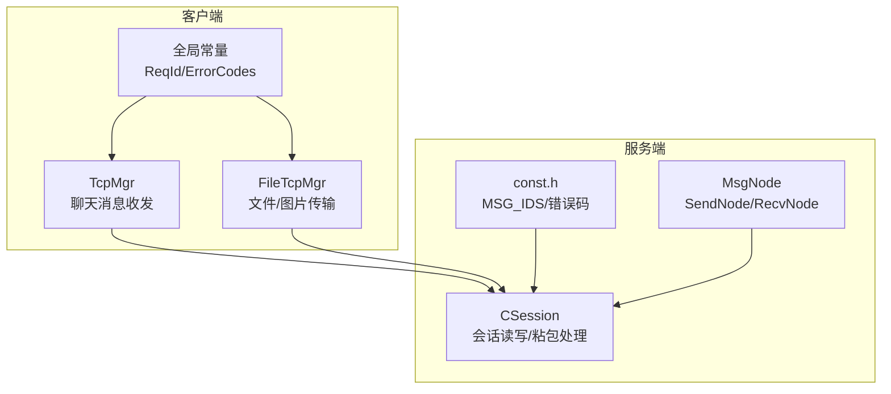
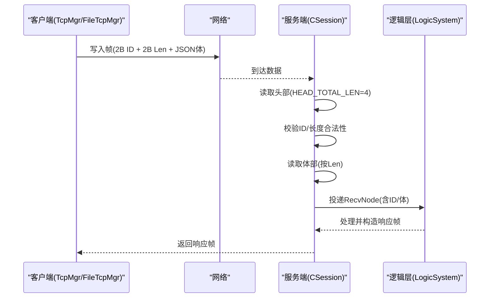
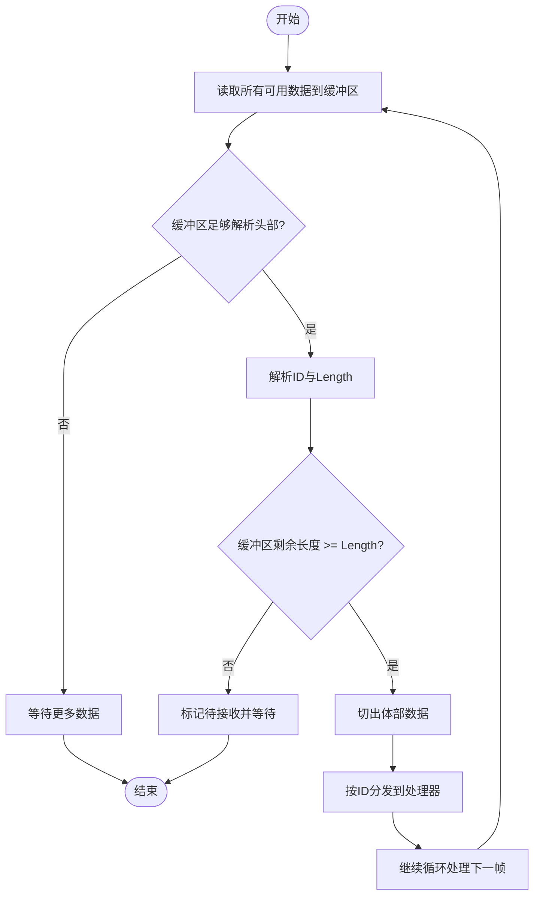
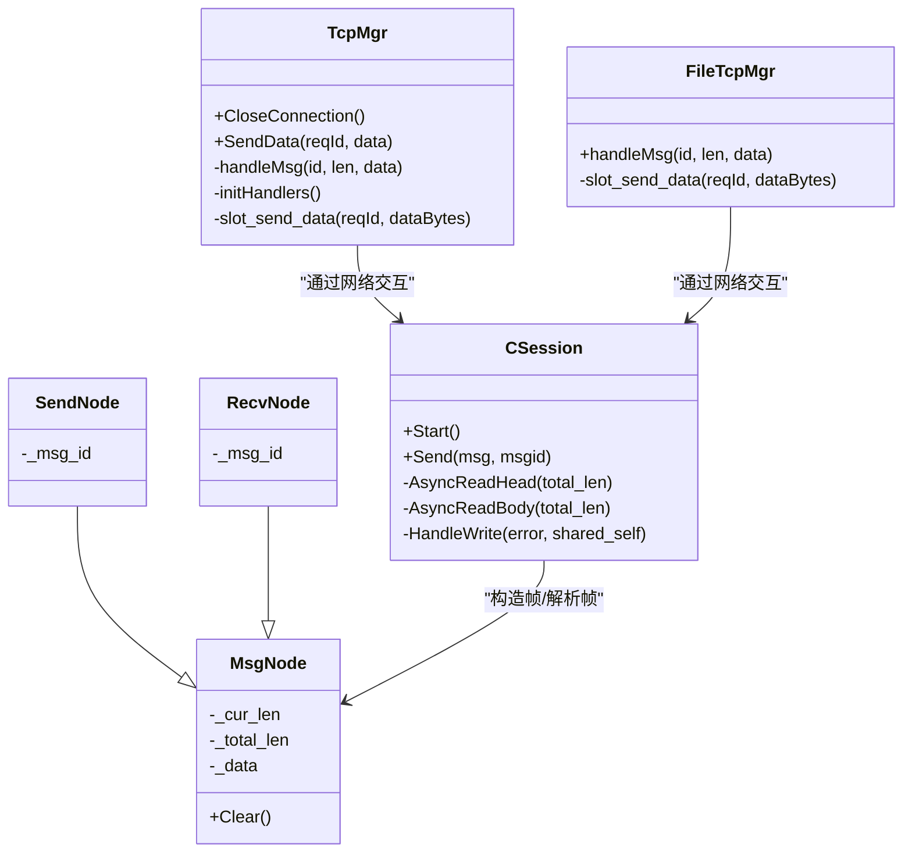
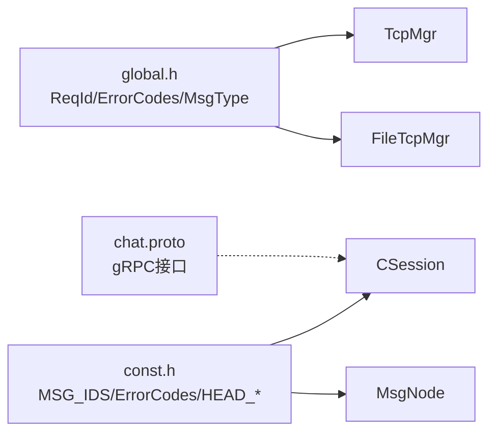

# TCP消息协议

<cite>
**本文引用的文件**   
- [tcpmgr.h](file://client/llfcchat/include/tcpmgr.h)
- [tcpmgr.cpp](file://client/llfcchat/src/tcpmgr.cpp)
- [global.h](file://client/llfcchat/include/global.h)
- [filetcpmgr.cpp](file://client/llfcchat/src/filetcpmgr.cpp)
- [CSession.h](file://server/ChatServer/include/CSession.h)
- [CSession.cpp](file://server/ChatServer/src/CSession.cpp)
- [MsgNode.h](file://server/ChatServer/include/MsgNode.h)
- [const.h](file://server/ChatServer/include/const.h)
- [data.h](file://server/ChatServer/include/data.h)
- [chat.proto](file://proto/chat_service/chat.proto)
</cite>

## 目录
1. [简介](#简介)
2. [项目结构](#项目结构)
3. [核心组件](#核心组件)
4. [架构总览](#架构总览)
5. [详细组件分析](#详细组件分析)
6. [依赖关系分析](#依赖关系分析)
7. [性能考虑](#性能考虑)
8. [故障排查指南](#故障排查指南)
9. [结论](#结论)
10. [附录：消息格式与示例](#附录消息格式与示例)

## 简介
本文件为 LLFCChat 的 TCP 消息协议规范文档，覆盖以下要点：
- 帧格式定义：头部（ReqId、长度字段）、体部序列化格式（JSON）
- 请求-响应模式与消息类型标识
- 粘包/拆包解决方案
- 消息路由机制（按 ReqId 分发）
- 错误处理策略（状态码、异常连接处理）
- 完整消息格式示例与解析思路（文本、图片、文件传输）

该协议在客户端与服务端分别实现：
- 客户端使用 Qt 的 QTcpSocket 进行读写，采用“2字节ID + 2字节长度”的固定头，体部为 JSON。
- 服务端基于 Boost.Asio 实现异步 I/O，同样以“2字节ID + 2字节长度”的固定头，体部为 JSON。

## 项目结构
LLFCChat 的 TCP 通信相关代码主要分布在：
- 客户端：TcpMgr（聊天消息）、FileTcpMgr（文件/图片传输）
- 服务端：CSession（会话读写）、MsgNode（发送/接收节点封装）、const.h（常量与消息ID）
- 协议定义：proto/chat_service/chat.proto（服务间 gRPC 接口，非 TCP 帧协议）

图表来源
- [tcpmgr.h:22-87](file://client/llfcchat/include/tcpmgr.h#L22-L87)
- [tcpmgr.cpp:18-55](file://client/llfcchat/src/tcpmgr.cpp#L18-L55)
- [filetcpmgr.cpp:16-55](file://client/llfcchat/src/filetcpmgr.cpp#L16-L55)
- [CSession.h:28-76](file://server/ChatServer/include/CSession.h#L28-L76)
- [CSession.cpp:130-191](file://server/ChatServer/src/CSession.cpp#L130-L191)
- [MsgNode.h:9-46](file://server/ChatServer/include/MsgNode.h#L9-L46)
- [const.h:49-79](file://server/ChatServer/include/const.h#L49-L79)

章节来源
- [tcpmgr.h:22-87](file://client/llfcchat/include/tcpmgr.h#L22-L87)
- [tcpmgr.cpp:18-55](file://client/llfcchat/src/tcpmgr.cpp#L18-L55)
- [filetcpmgr.cpp:16-55](file://client/llfcchat/src/filetcpmgr.cpp#L16-L55)
- [CSession.h:28-76](file://server/ChatServer/include/CSession.h#L28-L76)
- [CSession.cpp:130-191](file://server/ChatServer/src/CSession.cpp#L130-L191)
- [MsgNode.h:9-46](file://server/ChatServer/include/MsgNode.h#L9-L46)
- [const.h:49-79](file://server/ChatServer/include/const.h#L49-L79)

## 核心组件
- 客户端 TcpMgr：负责聊天消息的 TCP 连接、粘包/拆包、发送队列、按 ReqId 路由到处理器。
- 客户端 FileTcpMgr：负责大文件/图片分片上传下载，复用相同帧格式。
- 服务端 CSession：基于 Asio 的异步读/写，读取固定长度的头部后按长度读取体部，投递至逻辑层。
- 服务端 MsgNode：封装发送/接收缓冲，构造带头的二进制帧。
- 常量定义：全局 ReqId、ErrorCodes、MSG_IDS、消息状态等。

章节来源
- [tcpmgr.h:22-87](file://client/llfcchat/include/tcpmgr.h#L22-L87)
- [tcpmgr.cpp:183-800](file://client/llfcchat/src/tcpmgr.cpp#L183-L800)
- [filetcpmgr.cpp:175-200](file://client/llfcchat/src/filetcpmgr.cpp#L175-L200)
- [CSession.h:28-76](file://server/ChatServer/include/CSession.h#L28-L76)
- [CSession.cpp:130-191](file://server/ChatServer/src/CSession.cpp#L130-L191)
- [MsgNode.h:9-46](file://server/ChatServer/include/MsgNode.h#L9-L46)
- [const.h:49-79](file://server/ChatServer/include/const.h#L49-L79)

## 架构总览
TCP 帧协议采用“固定长度头部 + 可变长度体部”的结构，体部统一为 JSON。客户端与服务端各自维护发送/接收缓冲区，通过 ReqId 路由到具体业务处理器。

图表来源
- [tcpmgr.cpp:18-55](file://client/llfcchat/src/tcpmgr.cpp#L18-L55)
- [filetcpmgr.cpp:16-55](file://client/llfcchat/src/filetcpmgr.cpp#L16-L55)
- [CSession.cpp:130-191](file://server/ChatServer/src/CSession.cpp#L130-L191)

## 详细组件分析

### 帧格式定义
- 头部（固定 4 字节，网络字节序）：
  - ReqId：2 字节，表示消息类型标识（客户端与服务端共用同一枚举值）
  - Length：2 字节，表示体部 JSON 的字节数
- 体部（变长）：JSON 字符串，包含业务字段与 error 状态码

说明：
- 客户端使用 QDataStream 设置 BigEndian 写入 ID 和 Length，随后拼接 JSON 体。
- 服务端使用 boost::asio 将 ID 与 Length 转为网络字节序后写入帧头。

章节来源
- [tcpmgr.cpp:1044-1069](file://client/llfcchat/src/tcpmgr.cpp#L1044-L1069)
- [filetcpmgr.cpp:186-200](file://client/llfcchat/src/filetcpmgr.cpp#L186-L200)
- [MsgNode.h:8-17](file://server/ChatServer/include/MsgNode.h#L8-L17)
- [const.h:38-44](file://server/ChatServer/include/const.h#L38-L44)

### 请求-响应模式与消息类型标识
- 客户端发送请求时，携带 ReqId 与 JSON 体；服务端根据 ReqId 路由到对应处理器，处理后返回响应帧。
- 常见 ReqId 包括登录、搜索用户、好友申请/认证、文本聊天、图片聊天、心跳、加载聊天线程/消息等。

章节来源
- [const.h:49-79](file://server/ChatServer/include/const.h#L49-L79)
- [global.h:43-88](file://client/llfcchat/include/global.h#L43-L88)

### 粘包/拆包解决方案
- 客户端：
  - 使用循环读取 readyRead 的数据追加到 _buffer，先解析头部（2B ID + 2B Len），再判断剩余数据是否满足体部长度，不足则等待更多数据，满足则切出体部并调用 handleMsg。
- 服务端：
  - AsyncReadHead 读取固定 HEAD_TOTAL_LEN=4 字节，解析 ID 与 Length，校验合法性后进入 AsyncReadBody 读取指定长度体部，完成后投递到逻辑层并继续监听头部。

图表来源
- [tcpmgr.cpp:18-55](file://client/llfcchat/src/tcpmgr.cpp#L18-L55)
- [filetcpmgr.cpp:16-55](file://client/llfcchat/src/filetcpmgr.cpp#L16-L55)
- [CSession.cpp:130-191](file://server/ChatServer/src/CSession.cpp#L130-L191)

### 消息路由机制
- 客户端 TcpMgr 内部维护一个映射表 handlers，键为 ReqId，值为处理函数。收到体部后，根据 ID 查找处理器并执行。
- 服务端 CSession 将 RecvNode（含 ID 与体部）投递给 LogicSystem，由逻辑层进一步分发。

章节来源
- [tcpmgr.h:47-47](file://client/llfcchat/include/tcpmgr.h#L47-L47)
- [tcpmgr.cpp:1019-1028](file://client/llfcchat/src/tcpmgr.cpp#L1019-L1028)
- [CSession.cpp:120-122](file://server/ChatServer/src/CSession.cpp#L120-L122)

### 错误处理策略
- 客户端：
  - JSON 解析失败或 error 字段非成功时，触发相应信号（如登录失败、搜索失败）。
  - Socket 错误分类处理（连接拒绝、远程关闭、主机未找到、超时、网络错误等）。
- 服务端：
  - 读取失败或长度不匹配时关闭连接并清理 Session。
  - 心跳过期检测与异常连接清理，结合分布式锁避免重复清理。

章节来源
- [tcpmgr.cpp:183-800](file://client/llfcchat/src/tcpmgr.cpp#L183-L800)
- [CSession.cpp:130-191](file://server/ChatServer/src/CSession.cpp#L130-L191)
- [CSession.cpp:285-333](file://server/ChatServer/src/CSession.cpp#L285-L333)

### 数据序列化格式（JSON）
- 所有体部均为 JSON 对象，至少包含 error 字段表示结果状态。
- 不同消息类型的 JSON 字段见各处理器解析逻辑（例如登录响应包含 uid、name、nick、icon、sex、desc、token、apply_list、friend_list 等）。

章节来源
- [tcpmgr.cpp:183-800](file://client/llfcchat/src/tcpmgr.cpp#L183-L800)

### 状态码定义
- 客户端 ErrorCodes：SUCCESS、ERR_JSON、ERR_NETWORK 等。
- 服务端 ErrorCodes：Success、Error_Json、RPCFailed、TokenInvalid、UidInvalid、CREATE_CHAT_FAILED、LOAD_CHAT_FAILED 等。
- 消息状态 MsgStatus：UN_READ、SEND_FAILED、READED、UN_UPLOAD。

章节来源
- [global.h:91-95](file://client/llfcchat/include/global.h#L91-L95)
- [const.h:5-20](file://server/ChatServer/include/const.h#L5-L20)
- [const.h:96-101](file://server/ChatServer/include/const.h#L96-L101)

### 类与数据结构关系

图表来源
- [tcpmgr.h:22-87](file://client/llfcchat/include/tcpmgr.h#L22-L87)
- [filetcpmgr.cpp:175-200](file://client/llfcchat/src/filetcpmgr.cpp#L175-L200)
- [CSession.h:28-76](file://server/ChatServer/include/CSession.h#L28-L76)
- [MsgNode.h:9-46](file://server/ChatServer/include/MsgNode.h#L9-L46)

## 依赖关系分析
- 客户端 TcpMgr/FileTcpMgr 依赖 global.h 中的 ReqId、ErrorCodes、MsgType、TransferType、TransferState 等。
- 服务端 CSession 依赖 const.h 中的 MSG_IDS、ErrorCodes、MAX_LENGTH、HEAD_* 常量。
- 服务端 MsgNode 依赖 const.h 中的 HEAD_* 常量用于构造帧头。
- 协议定义 chat.proto 用于服务间 gRPC 通信，与 TCP 帧协议解耦。

图表来源
- [global.h:43-88](file://client/llfcchat/include/global.h#L43-L88)
- [const.h:49-79](file://server/ChatServer/include/const.h#L49-L79)
- [chat.proto:1-105](file://proto/chat_service/chat.proto#L1-L105)

章节来源
- [global.h:43-88](file://client/llfcchat/include/global.h#L43-L88)
- [const.h:49-79](file://server/ChatServer/include/const.h#L49-L79)
- [chat.proto:1-105](file://proto/chat_service/chat.proto#L1-L105)

## 性能考虑
- 发送队列：客户端使用 QQueue 缓存待发送帧，避免阻塞 UI 线程；服务端使用队列与互斥锁保护并发写入。
- 粘包处理：双方均按固定头部长度解析，减少内存拷贝与解析开销。
- 心跳机制：服务端记录最后心跳时间，超过阈值判定为过期并清理 Session。
- 资源限制：MAX_LENGTH、MAX_SENDQUE、MAX_RECVQUE 控制最大帧大小与队列长度，防止内存溢出。

章节来源
- [tcpmgr.cpp:103-129](file://client/llfcchat/src/tcpmgr.cpp#L103-L129)
- [CSession.cpp:43-75](file://server/ChatServer/src/CSession.cpp#L43-L75)
- [CSession.cpp:285-299](file://server/ChatServer/src/CSession.cpp#L285-L299)
- [const.h:38-46](file://server/ChatServer/include/const.h#L38-L46)

## 故障排查指南
- 常见问题：
  - JSON 解析失败：检查 error 字段是否存在且为 SUCCESS。
  - 长度不匹配：确认客户端写入 Length 与服务端读取一致。
  - 连接断开：检查网络错误类型与心跳超时。
- 定位方法：
  - 客户端打印帧 ID、Length 与体部内容。
  - 服务端打印解析后的 ID、Length 与体部内容。
  - 查看错误码与日志输出。

章节来源
- [tcpmgr.cpp:183-800](file://client/llfcchat/src/tcpmgr.cpp#L183-L800)
- [CSession.cpp:130-191](file://server/ChatServer/src/CSession.cpp#L130-L191)

## 结论
LLFCChat 的 TCP 消息协议采用简洁高效的“固定头 + JSON 体”设计，配合严格的粘包/拆包处理与 ReqId 路由机制，实现了可靠的聊天、文件传输与状态同步。服务端通过 Asio 异步 I/O 与队列管理保证高吞吐与稳定性，客户端通过 Qt 事件驱动与发送队列确保 UI 流畅。

## 附录：消息格式与示例

### 帧格式示例（文本消息）
- 头部：2 字节 ReqId（例如 ID_TEXT_CHAT_MSG_REQ = 1017），2 字节 Length（JSON 体长度）
- 体部：JSON 对象，包含 fromuid、touid、thread_id、textmsgs 数组等

解析流程：
- 客户端：构造 JSON -> 写入 ID 与 Length -> 发送
- 服务端：读取头部 -> 校验 -> 读取体部 -> 解析 JSON -> 路由处理 -> 返回响应帧

章节来源
- [tcpmgr.cpp:452-498](file://client/llfcchat/src/tcpmgr.cpp#L452-L498)
- [const.h:49-79](file://server/ChatServer/include/const.h#L49-L79)

### 帧格式示例（图片消息）
- 头部：2 字节 ReqId（例如 ID_IMG_CHAT_MSG_REQ = 1035），2 字节 Length
- 体部：JSON 对象，包含 thread_id、sender_id、recv_id、name、msg_type、status、total_size 等

解析流程：
- 客户端：构造 JSON -> 写入 ID 与 Length -> 发送
- 服务端：读取头部 -> 校验 -> 读取体部 -> 解析 JSON -> 路由处理 -> 返回响应帧

章节来源
- [filetcpmgr.cpp:843-867](file://client/llfcchat/src/filetcpmgr.cpp#L843-L867)
- [const.h:49-79](file://server/ChatServer/include/const.h#L49-L79)

### 帧格式示例（文件传输）
- 头部：2 字节 ReqId（例如 ID_FILE_INFO_SYNC_REQ = 1041），2 字节 Length
- 体部：JSON 对象，包含文件元信息与分片序列号等

解析流程：
- 客户端：构造 JSON -> 写入 ID 与 Length -> 发送
- 服务端：读取头部 -> 校验 -> 读取体部 -> 解析 JSON -> 路由处理 -> 返回响应帧

章节来源
- [const.h:49-79](file://server/ChatServer/include/const.h#L49-L79)

### 状态码与消息状态
- 客户端 ErrorCodes：SUCCESS、ERR_JSON、ERR_NETWORK
- 服务端 ErrorCodes：Success、Error_Json、RPCFailed、TokenInvalid、UidInvalid、CREATE_CHAT_FAILED、LOAD_CHAT_FAILED
- 消息状态 MsgStatus：UN_READ、SEND_FAILED、READED、UN_UPLOAD

章节来源
- [global.h:91-95](file://client/llfcchat/include/global.h#L91-L95)
- [const.h:5-20](file://server/ChatServer/include/const.h#L5-L20)
- [const.h:96-101](file://server/ChatServer/include/const.h#L96-L101)