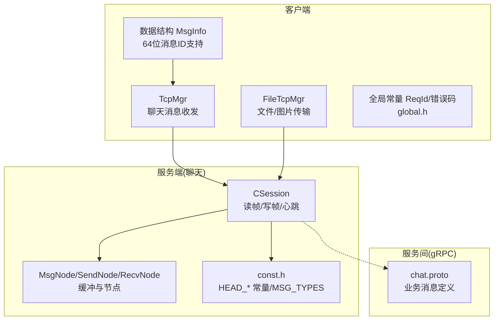
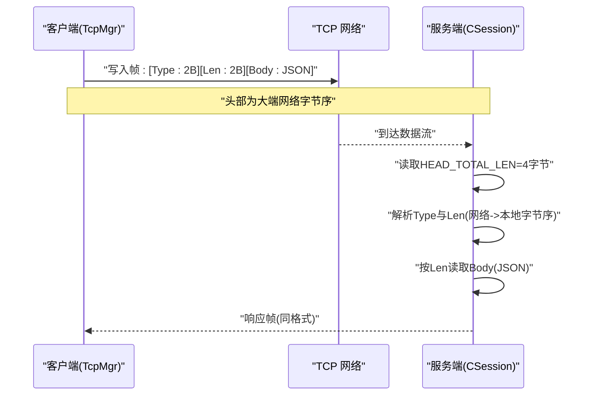
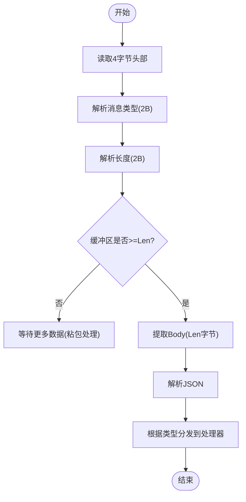
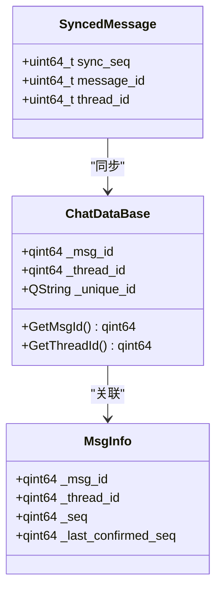
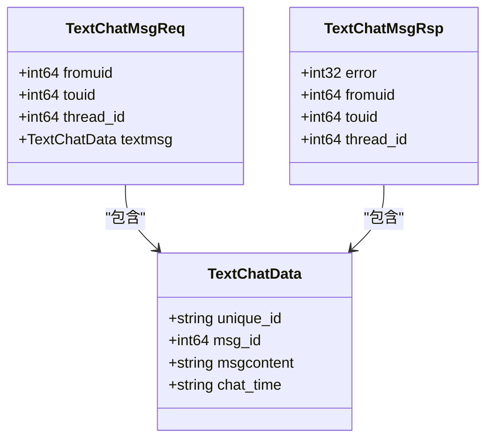
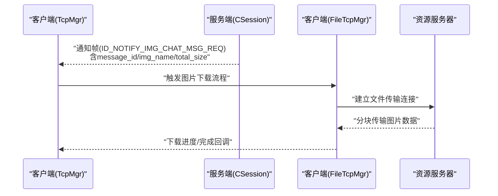
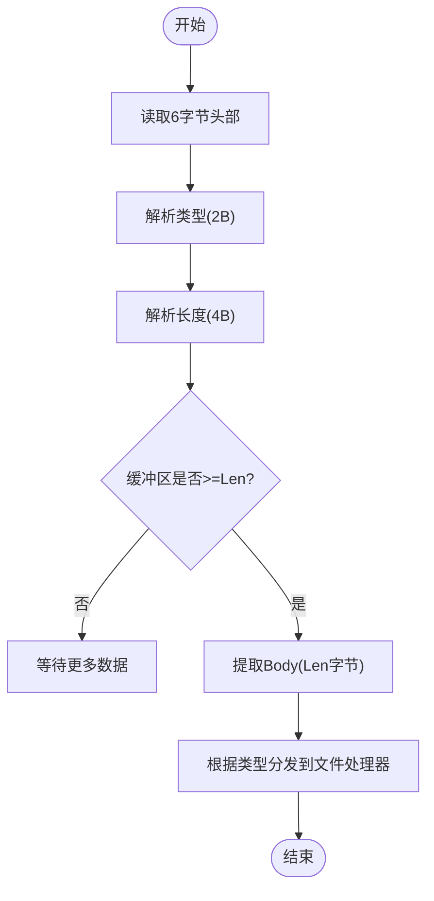
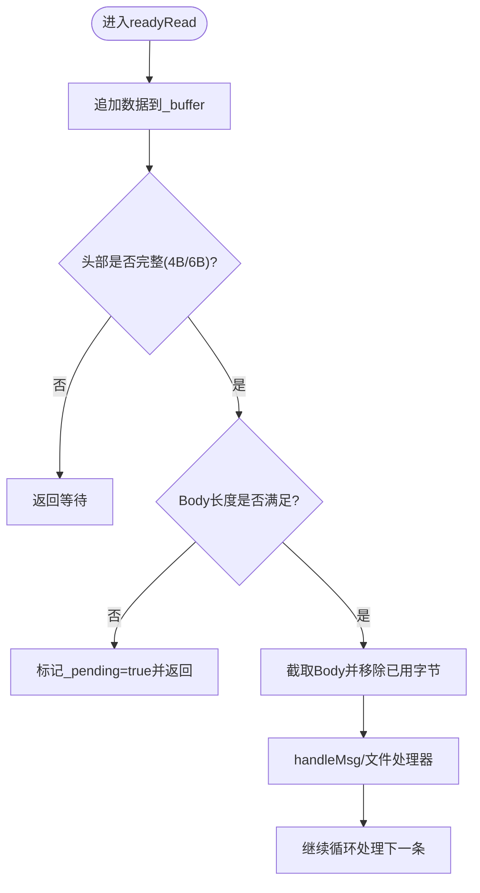
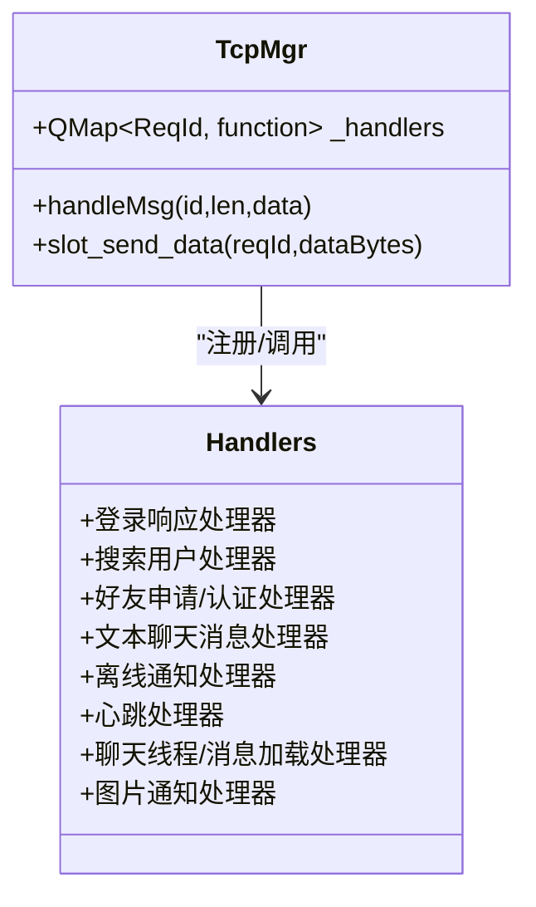

# 消息帧格式规范

<cite>
**本文引用的文件**   
- [tcpmgr.h](file://client/llfcchat/include/tcpmgr.h)
- [tcpmgr.cpp](file://client/llfcchat/src/tcpmgr.cpp)
- [global.h](file://client/llfcchat/include/global.h)
- [filetcpmgr.h](file://client/llfcchat/include/filetcpmgr.h)
- [CSession.h](file://server/ChatServer/include/CSession.h)
- [CSession.cpp](file://server/ChatServer/src/CSession.cpp)
- [MsgNode.h](file://server/ChatServer/include/MsgNode.h)
- [const.h](file://server/ChatServer/include/const.h)
- [chat.proto](file://proto/chat_service/chat.proto)
- [im_frame.h](file://tests/integration/im_frame.h)
- [userdata.h](file://client/llfcchat/include/userdata.h)
</cite>

## 更新摘要
**变更内容**   
- 更新了TCP帧头字段命名：从`msg_id`重命名为`msg_type`，消除了消息类型标识符与唯一消息ID之间的混淆
- 增强了64位消息ID、线程ID和同步序列号的支持
- 完善了消息帧格式的详细说明和技术实现细节
- 更新了粘包拆包处理机制和字节序转换说明

## 目录
1. [简介](#简介)
2. [项目结构](#项目结构)
3. [核心组件](#核心组件)
4. [架构总览](#架构总览)
5. [详细组件分析](#详细组件分析)
6. [依赖关系分析](#依赖关系分析)
7. [性能考量](#性能考量)
8. [故障排查指南](#故障排查指南)
9. [结论](#结论)
10. [附录](#附录)

## 简介
本规范定义 LLFCChat 的 TCP 消息帧格式，覆盖消息头、消息体、校验与字节序处理，并给出文本消息、图片消息、文件传输消息的帧差异。同时提供粘包/拆包的边界处理方法与解析流程，帮助开发者正确实现客户端与服务端的编解码逻辑。

**重要更新**：TCP帧头字段已从`msg_id`重命名为`msg_type`，这消除了消息类型标识符与唯一消息ID之间的混淆，支持64位消息ID、线程ID和同步序列号的完整实现。

## 项目结构
- 客户端使用 Qt 网络模块进行 TCP 通信，通过 TcpMgr/FileTcpMgr 管理连接、粘包/拆包、发送队列与消息分发。
- 服务端基于 Boost.Asio 实现异步 I/O，CSession 负责读写帧、心跳检测与异常会话清理。
- 协议常量（消息类型、头部长度等）在服务端 const.h 中统一定义；业务消息体采用 JSON 序列化，部分服务间通信使用 gRPC（chat.proto）。



**图示来源** 
- [tcpmgr.h:22-87](file://client/llfcchat/include/tcpmgr.h#L22-L87)
- [filetcpmgr.h:26-82](file://client/llfcchat/include/filetcpmgr.h#L26-L82)
- [CSession.h:28-76](file://server/ChatServer/include/CSession.h#L28-L76)
- [MsgNode.h:9-48](file://server/ChatServer/include/MsgNode.h#L9-L48)
- [const.h:38-79](file://server/ChatServer/include/const.h#L38-L79)
- [chat.proto:1-106](file://proto/chat_service/chat.proto#L1-L106)

**章节来源**
- [tcpmgr.h:22-87](file://client/llfcchat/include/tcpmgr.h#L22-L87)
- [filetcpmgr.h:26-82](file://client/llfcchat/include/filetcpmgr.h#L26-L82)
- [CSession.h:28-76](file://server/ChatServer/include/CSession.h#L28-L76)
- [MsgNode.h:9-48](file://server/ChatServer/include/MsgNode.h#L9-L48)
- [const.h:38-79](file://server/ChatServer/include/const.h#L38-L79)
- [chat.proto:1-106](file://proto/chat_service/chat.proto#L1-L106)

## 核心组件
- 客户端：
  - TcpMgr：聊天消息的 TCP 收发、粘包/拆包、请求 ID 映射到处理器。
  - FileTcpMgr：文件/图片传输的独立 TCP 通道，支持断点续传与拥塞控制。
  - global.h：ReqId 枚举、错误码、消息类型与传输状态等全局定义。
  - userdata.h：包含64位消息ID支持的ChatDataBase及相关数据结构。
- 服务端：
  - CSession：基于 Boost.Asio 的会话层，负责读取固定长度的头部与变长消息体，维护心跳与异常清理。
  - MsgNode/SendNode/RecvNode：封装消息缓冲与节点信息。
  - const.h：HEAD_TOTAL_LEN、HEAD_TYPE_LEN、HEAD_DATA_LEN、MAX_LENGTH、MSG_TYPES 等协议常量。
  - chat.proto：服务间 gRPC 消息定义（用于跨服务通知与转发）。

**章节来源**
- [tcpmgr.cpp:10-136](file://client/llfcchat/src/tcpmgr.cpp#L10-L136)
- [filetcpmgr.h:26-82](file://client/llfcchat/include/filetcpmgr.h#L26-L82)
- [global.h:43-88](file://client/llfcchat/include/global.h#L43-L88)
- [CSession.cpp:10-41](file://server/ChatServer/src/CSession.cpp#L10-L41)
- [MsgNode.h:9-48](file://server/ChatServer/include/MsgNode.h#L9-L48)
- [const.h:38-79](file://server/ChatServer/include/const.h#L38-L79)
- [userdata.h:140-291](file://client/llfcchat/include/userdata.h#L140-L291)

## 架构总览
LLFCChat 的 TCP 帧采用"固定长度头部 + 变长消息体"的结构，头部包含消息类型和消息体长度，消息体为 JSON 字符串。客户端与服务端在各自侧完成字节序转换与粘包/拆包处理。

**更新**：现在使用`msg_type`字段明确标识消息类型，避免与64位消息ID混淆。



**图示来源** 
- [tcpmgr.cpp:1044-1069](file://client/llfcchat/src/tcpmgr.cpp#L1044-L1069)
- [CSession.cpp:130-191](file://server/ChatServer/src/CSession.cpp#L130-L191)
- [const.h:38-44](file://server/ChatServer/include/const.h#L38-L44)

## 详细组件分析

### 通用 TCP 帧格式（聊天消息）
- 头部（固定 4 字节）：
  - 字段1：**消息类型（msg_type）**，2 字节，大端网络字节序（原msg_id已重命名）
  - 字段2：消息体长度（Body Length），2 字节，大端网络字节序
- 消息体：
  - 变长 JSON 字符串，具体字段由业务决定（登录、搜索、好友、聊天消息等）
- 字节序：
  - 客户端发送时设置 QDataStream 为大端（BigEndian）
  - 服务端接收后使用 socket_ops::network_to_host_short 转换为本地字节序
- 校验机制：
  - 当前实现未包含显式校验和或 CRC，依赖 JSON 中的 error 字段与长度匹配进行一致性检查
- 内存对齐：
  - 头部为两个 2 字节无符号整数，无需额外对齐；消息体为原始字节流

**更新**：字段名称从`msg_id`改为`msg_type`，更准确地反映其作为消息类型标识符的作用。



**图示来源** 
- [tcpmgr.cpp:18-55](file://client/llfcchat/src/tcpmgr.cpp#L18-L55)
- [CSession.cpp:130-191](file://server/ChatServer/src/CSession.cpp#L130-L191)

**章节来源**
- [tcpmgr.cpp:1044-1069](file://client/llfcchat/src/tcpmgr.cpp#L1044-L1069)
- [CSession.cpp:130-191](file://server/ChatServer/src/CSession.cpp#L130-L191)
- [const.h:38-44](file://server/ChatServer/include/const.h#L38-L44)

### 64位消息ID、线程ID和同步序列号支持
**新增功能**：系统现在全面支持64位消息ID、线程ID和同步序列号，提供更好的消息追踪和同步能力。

- **64位消息ID**：
  - 使用`qint64`类型存储，支持更大的消息空间
  - 在ChatDataBase和相关数据结构中统一使用64位ID
  - 数据库层面使用`message_id`字段存储64位消息ID

- **64位线程ID**：
  - 会话ID使用`qint64 thread_id`表示
  - 支持大规模并发会话管理

- **同步序列号**：
  - 增量消息同步使用`sync_seq`字段
  - 支持高效的增量消息同步机制



**图示来源** 
- [userdata.h:140-291](file://client/llfcchat/include/userdata.h#L140-L291)
- [global.h:190-221](file://client/llfcchat/include/global.h#L190-L221)

**章节来源**
- [userdata.h:140-291](file://client/llfcchat/include/userdata.h#L140-L291)
- [global.h:190-221](file://client/llfcchat/include/global.h#L190-L221)

### 文本消息帧（ID_TEXT_CHAT_MSG_REQ/RSP/NOTIFY）
- 消息体 JSON 关键字段（示例）：
  - thread_id：会话 ID（64位）
  - fromuid/sender：发送者 UID
  - chat_datas：消息数组，元素包含 message_id（64位）、unique_id、content、chat_time、status 等
- 用途：
  - 请求/回复加载历史消息
  - 实时推送新消息



**图示来源** 
- [chat.proto:54-74](file://proto/chat_service/chat.proto#L54-L74)

**章节来源**
- [tcpmgr.cpp:452-498](file://client/llfcchat/src/tcpmgr.cpp#L452-L498)
- [tcpmgr.cpp:501-548](file://client/llfcchat/src/tcpmgr.cpp#L501-L548)
- [chat.proto:54-74](file://proto/chat_service/chat.proto#L54-L74)

### 图片消息帧（ID_IMG_CHAT_MSG_REQ/RSP/NOTIFY）
- 消息体 JSON 关键字段（示例）：
  - thread_id（64位）、sender_id/receiver_id、message_id（64位）、img_name、total_size
- 用途：
  - 通知客户端存在图片资源，随后走独立的文件传输通道下载
- 注意：
  - 图片内容不直接放在聊天帧 Body 中，而是通过 FileTcpMgr 的专用帧传输



**图示来源** 
- [tcpmgr.cpp:799-800](file://client/llfcchat/src/tcpmgr.cpp#L799-L800)
- [filetcpmgr.h:26-82](file://client/llfcchat/include/filetcpmgr.h#L26-L82)

**章节来源**
- [tcpmgr.cpp:799-800](file://client/llfcchat/src/tcpmgr.cpp#L799-L800)
- [filetcpmgr.h:26-82](file://client/llfcchat/include/filetcpmgr.h#L26-L82)

### 文件传输帧（FileTcpMgr）
- 头部（固定 6 字节）：
  - 字段1：消息类型（msg_type），2 字节
  - 字段2：消息体长度（Body Length），4 字节
- 消息体：
  - 变长 JSON 或二进制分片（依据具体 ReqId 而定）
- 特点：
  - 支持断点续传、拥塞窗口控制、批量发送
  - 与聊天帧不同，长度字段为 4 字节以支持更大载荷



**图示来源** 
- [filetcpmgr.h:50-62](file://client/llfcchat/include/filetcpmgr.h#L50-L62)
- [global.h:15-22](file://client/llfcchat/include/global.h#L15-L22)

**章节来源**
- [filetcpmgr.h:26-82](file://client/llfcchat/include/filetcpmgr.h#L26-L82)
- [global.h:15-22](file://client/llfcchat/include/global.h#L15-L22)

### 字节序与大小端转换
- 客户端发送：
  - 使用 QDataStream 设置 BigEndian 后写入类型和长度
- 服务端接收：
  - 使用 boost::asio::detail::socket_ops::network_to_host_short 将 2 字节字段从网络字节序转为本机字节序
- 建议：
  - 所有多字节整数字段统一采用网络字节序（大端）
  - 避免依赖平台默认字节序

**更新**：现在正确处理`msg_type`字段的字节序转换。

**章节来源**
- [tcpmgr.cpp:1044-1069](file://client/llfcchat/src/tcpmgr.cpp#L1044-L1069)
- [CSession.cpp:160-175](file://server/ChatServer/src/CSession.cpp#L160-L175)

### 粘包与拆包边界处理
- 客户端（TcpMgr）：
  - 循环读取 readyRead 数据追加到缓冲区
  - 先解析 4 字节头部，再判断剩余缓冲区是否满足 Body 长度
  - 不足则继续等待，满足则截取 Body 并调用 handleMsg
- 客户端（FileTcpMgr）：
  - 头部 6 字节，解析 Type(2B)+Len(4B)，同样按长度边界拆分
- 服务端（CSession）：
  - 使用 asyncReadFull 保证读取完整 HEAD_TOTAL_LEN 与 Body 长度
  - 若长度不匹配或错误，关闭会话并清理



**图示来源** 
- [tcpmgr.cpp:18-55](file://client/llfcchat/src/tcpmgr.cpp#L18-L55)
- [filetcpmgr.cpp:24-33](file://client/llfcchat/src/filetcpmgr.cpp#L24-L33)
- [CSession.cpp:220-248](file://server/ChatServer/src/CSession.cpp#L220-L248)

**章节来源**
- [tcpmgr.cpp:18-55](file://client/llfcchat/src/tcpmgr.cpp#L18-L55)
- [filetcpmgr.cpp:24-33](file://client/llfcchat/src/filetcpmgr.cpp#L24-L33)
- [CSession.cpp:220-248](file://server/ChatServer/src/CSession.cpp#L220-L248)

### 消息处理器与分发
- 客户端：
  - _handlers 映射 ReqId 到 lambda 处理器，handleMsg 查找并调用对应处理器
  - 常见处理器：登录响应、搜索用户、好友申请/认证、文本聊天消息、离线通知、心跳、聊天线程/消息加载、图片通知等
- 服务端：
  - CSession 将收到的 RecvNode 投递到 LogicSystem 进行业务处理



**图示来源** 
- [tcpmgr.cpp:182-798](file://client/llfcchat/src/tcpmgr.cpp#L182-L798)
- [tcpmgr.cpp:1019-1028](file://client/llfcchat/src/tcpmgr.cpp#L1019-L1028)

**章节来源**
- [tcpmgr.cpp:182-798](file://client/llfcchat/src/tcpmgr.cpp#L182-L798)
- [tcpmgr.cpp:1019-1028](file://client/llfcchat/src/tcpmgr.cpp#L1019-L1028)

## 依赖关系分析
- 客户端依赖：
  - QTcpSocket、QDataStream、QByteArray、QJsonDocument
  - global.h 中的 ReqId、错误码、消息类型
  - userdata.h 中的64位消息ID支持
- 服务端依赖：
  - Boost.Asio（async_read_some、async_write）、socket_ops 字节序转换
  - const.h 中的 HEAD_* 常量与 MSG_TYPES
  - MsgNode/SendNode/RecvNode 缓冲与节点管理
- 服务间依赖：
  - gRPC（chat.proto）用于跨服务通知与转发（如图片通知、好友认证等）

```mermaid
graph LR
Client["客户端(TcpMgr/FileTcpMgr)"] --> |TCP帧| Server["服务端(CSession)"]
Server --> |LogicSystem| DB["数据库/缓存"]
Server --> |gRPC| OtherSrv["其他服务(资源/状态)"]
Client --> |gRPC(可选)| OtherSrv
```

**图示来源** 
- [tcpmgr.h:22-87](file://client/llfcchat/include/tcpmgr.h#L22-L87)
- [filetcpmgr.h:26-82](file://client/llfcchat/include/filetcpmgr.h#L26-L82)
- [CSession.h:28-76](file://server/ChatServer/include/CSession.h#L28-L76)
- [chat.proto:1-106](file://proto/chat_service/chat.proto#L1-L106)

**章节来源**
- [tcpmgr.h:22-87](file://client/llfcchat/include/tcpmgr.h#L22-L87)
- [filetcpmgr.h:26-82](file://client/llfcchat/include/filetcpmgr.h#L26-L82)
- [CSession.h:28-76](file://server/ChatServer/include/CSession.h#L28-L76)
- [chat.proto:1-106](file://proto/chat_service/chat.proto#L1-L106)

## 性能考量
- 粘包/拆包：
  - 使用缓冲区与长度字段精确切分，避免重复拷贝与不必要的分配
- 发送队列：
  - 客户端维护 _send_queue 与 _pending 标志，确保有序发送且不阻塞
- 并发与锁：
  - 服务端使用互斥锁保护发送队列，防止并发写入冲突
- 心跳与超时：
  - 服务端记录最后心跳时间，超过阈值判定过期并清理会话
- 拥塞控制：
  - 文件传输支持拥塞窗口与序列号确认，提升大文件传输稳定性
- **64位ID优化**：
  - 使用64位消息ID和线程ID提供更好的扩展性和唯一性保证
  - 同步序列号支持高效的消息增量同步

## 故障排查指南
- 常见问题：
  - 头部长度不匹配：检查 HEAD_TOTAL_LEN 与解析逻辑
  - 字节序错误：确认客户端 BigEndian 与服务端 network_to_host_short 使用一致
  - JSON 解析失败：检查 error 字段与关键字段是否存在
  - 粘包未处理：确保循环读取与长度边界判断
  - **64位ID溢出**：确保所有相关字段都使用64位类型
- 定位方法：
  - 打印 _buffer 长度与已解析的类型/长度
  - 检查 _send_queue 与 _pending 状态
  - 服务端日志输出 read length not match 等提示

**章节来源**
- [tcpmgr.cpp:18-55](file://client/llfcchat/src/tcpmgr.cpp#L18-L55)
- [CSession.cpp:130-191](file://server/ChatServer/src/CSession.cpp#L130-L191)
- [tcpmgr.cpp:1044-1069](file://client/llfcchat/src/tcpmgr.cpp#L1044-L1069)

## 结论
LLFCChat 的 TCP 帧采用简洁可靠的"固定头部 + 变长 JSON 体"设计，配合严格的粘包/拆包与字节序处理，保证了跨平台与高并发场景下的稳定通信。**最新改进包括**：将TCP帧头字段从`msg_id`重命名为`msg_type`，消除了消息类型标识符与唯一消息ID之间的混淆；全面支持64位消息ID、线程ID和同步序列号，提供更好的消息追踪和同步能力。文本、图片与文件传输分别采用不同的帧结构与通道，既满足功能需求又兼顾性能与可维护性。

## 附录

### 帧结构示例（文本消息）
- 头部：
  - 类型：2 字节（例如 ID_TEXT_CHAT_MSG_REQ）
  - 长度：2 字节（Body 长度）
- 消息体（JSON 片段）：
  - thread_id（64位）、fromuid、chat_datas[]（包含 message_id（64位）、unique_id、content、chat_time、status）

**章节来源**
- [tcpmgr.cpp:452-498](file://client/llfcchat/src/tcpmgr.cpp#L452-L498)
- [chat.proto:54-74](file://proto/chat_service/chat.proto#L54-L74)

### 帧结构示例（图片通知）
- 头部：
  - 类型：2 字节（ID_NOTIFY_IMG_CHAT_MSG_REQ）
  - 长度：2 字节（Body 长度）
- 消息体（JSON 片段）：
  - thread_id（64位）、sender_id、receiver_id、message_id（64位）、img_name、total_size

**章节来源**
- [tcpmgr.cpp:799-800](file://client/llfcchat/src/tcpmgr.cpp#L799-L800)

### 帧结构示例（文件传输）
- 头部：
  - 类型：2 字节（例如 ID_IMG_CHAT_DOWN_REQ）
  - 长度：4 字节（Body 长度）
- 消息体：
  - 根据 ReqId 不同，可能为 JSON 元数据或二进制分片

**章节来源**
- [filetcpmgr.h:50-62](file://client/llfcchat/include/filetcpmgr.h#L50-L62)
- [global.h:15-22](file://client/llfcchat/include/global.h#L15-L22)

### 解析代码实现要点（路径引用）
- 客户端发送帧（聊天）：
  - [tcpmgr.cpp:1044-1069](file://client/llfcchat/src/tcpmgr.cpp#L1044-L1069)
- 客户端接收帧（聊天）：
  - [tcpmgr.cpp:18-55](file://client/llfcchat/src/tcpmgr.cpp#L18-L55)
- 服务端读取头部与消息体：
  - [CSession.cpp:130-191](file://server/ChatServer/src/CSession.cpp#L130-L191)
  - [CSession.cpp:220-248](file://server/ChatServer/src/CSession.cpp#L220-L248)
- 文件传输帧解析（客户端）：
  - [filetcpmgr.h:50-62](file://client/llfcchat/include/filetcpmgr.h#L50-L62)
  - [filetcpmgr.cpp:24-33](file://client/llfcchat/src/filetcpmgr.cpp#L24-L33)
- **64位消息ID支持**：
  - [userdata.h:140-291](file://client/llfcchat/include/userdata.h#L140-L291)
  - [global.h:190-221](file://client/llfcchat/include/global.h#L190-L221)

### 64位消息ID、线程ID和同步序列号技术细节
- **数据类型选择**：
  - 使用`qint64`类型确保跨平台兼容性
  - 数据库层面使用`INT64`或`BIGINT`类型
- **内存布局优化**：
  - 64位字段自然对齐，避免填充字节浪费
  - 合理组织数据结构以减少内存碎片
- **同步机制**：
  - `sync_seq`字段支持增量消息同步
  - 支持bootstrap模式的全量同步
- **向后兼容性**：
  - 保持与现有32位系统的兼容
  - 提供版本检测和自动升级机制

**章节来源**
- [userdata.h:140-291](file://client/llfcchat/include/userdata.h#L140-L291)
- [global.h:190-221](file://client/llfcchat/include/global.h#L190-L221)
- [MysqlDao.cpp:1110-1263](file://server/ChatServer/src/MysqlDao.cpp#L1110-L1263)