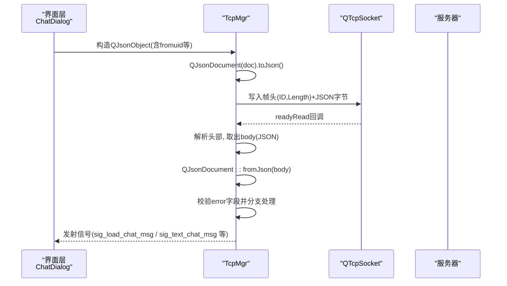
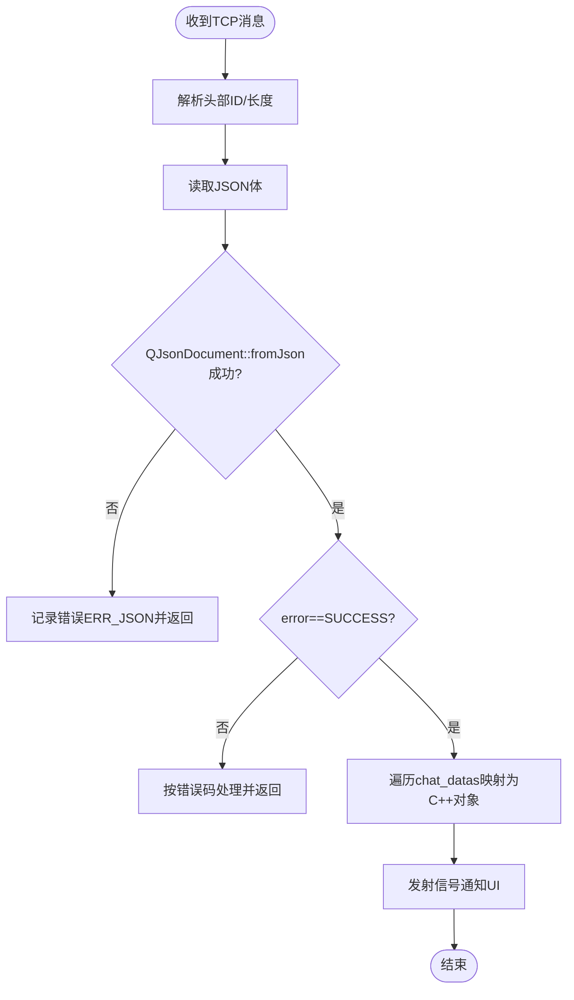
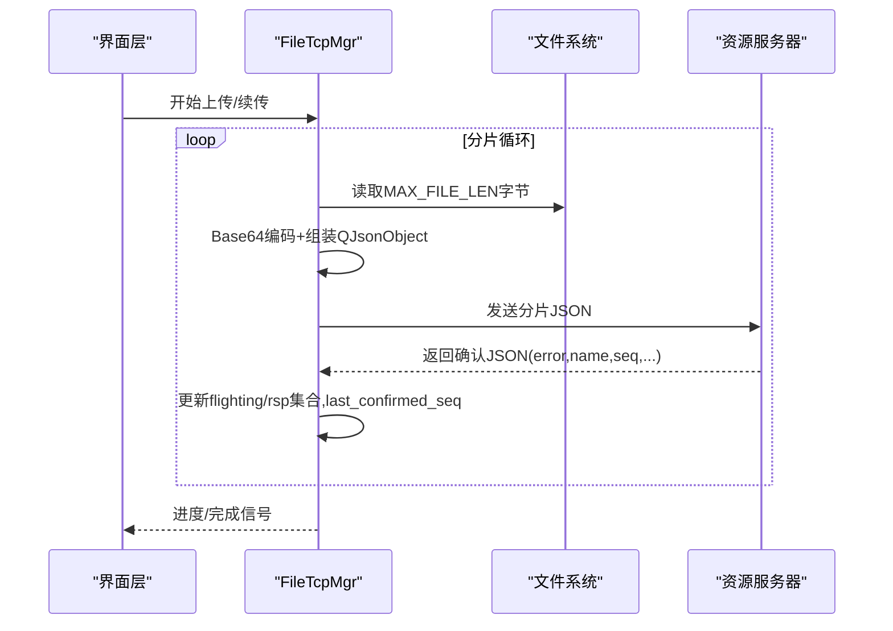
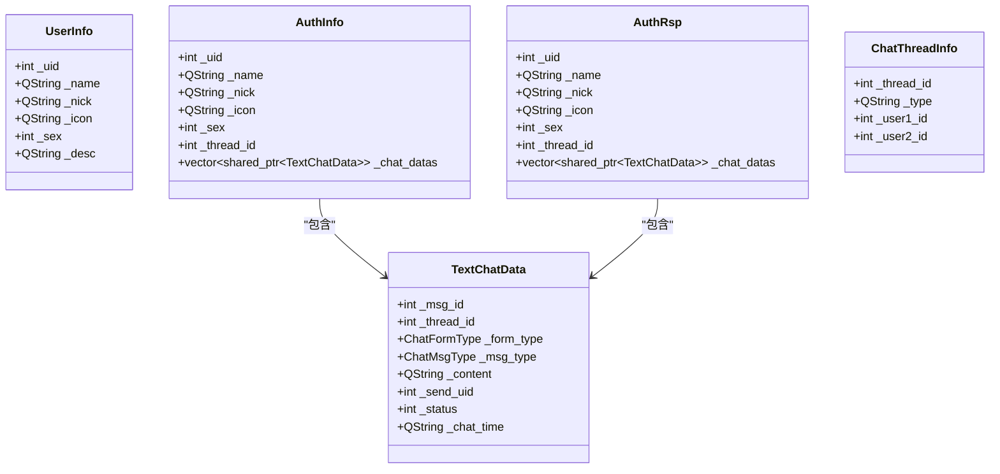
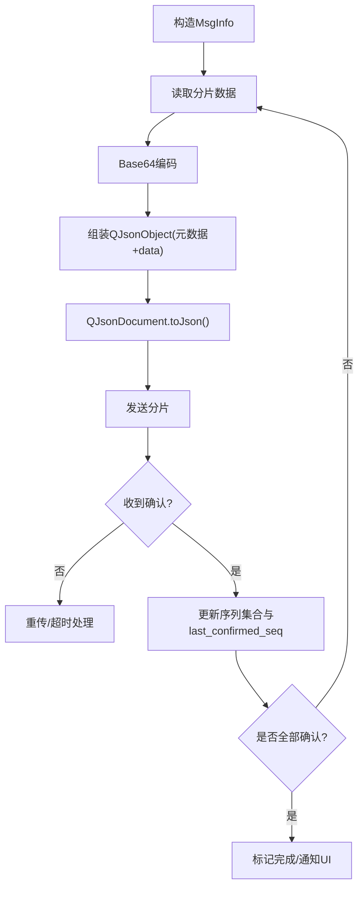
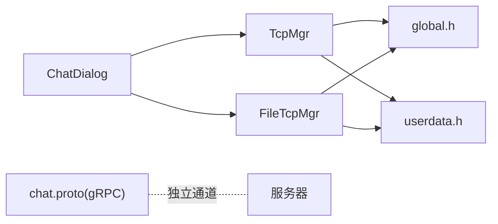

# 消息序列化与反序列化

<cite>
**本文引用的文件**   
- [tcpmgr.h](file://client/llfcchat/include/tcpmgr.h)
- [tcpmgr.cpp](file://client/llfcchat/src/tcpmgr.cpp)
- [filetcpmgr.cpp](file://client/llfcchat/src/filetcpmgr.cpp)
- [global.h](file://client/llfcchat/include/global.h)
- [userdata.h](file://client/llfcchat/include/userdata.h)
- [chatdialog.cpp](file://client/llfcchat/src/chatdialog.cpp)
- [registerdialog.cpp](file://client/llfcchat/src/registerdialog.cpp)
- [resetdialog.cpp](file://client/llfcchat/src/resetdialog.cpp)
- [chat.proto](file://proto/chat_service/chat.proto)
</cite>

## 目录
1. [简介](#简介)
2. [项目结构](#项目结构)
3. [核心组件](#核心组件)
4. [架构总览](#架构总览)
5. [详细组件分析](#详细组件分析)
6. [依赖关系分析](#依赖关系分析)
7. [性能考虑](#性能考虑)
8. [故障排查指南](#故障排查指南)
9. [结论](#结论)
10. [附录](#附录)

## 简介
本文面向 LLFCChat 客户端的消息序列化机制，系统性说明基于 Qt JSON（QJsonDocument/QJsonObject）的序列化和反序列化流程，覆盖：
- 文本聊天、图片/文件传输等场景的数据结构与字段映射
- QJsonDocument 的使用方式、类型转换策略与错误处理
- 复杂对象（如 MsgInfo、用户信息、聊天消息）的序列化格式与策略
- 完整的代码示例路径与性能优化建议

## 项目结构
LLFCChat 客户端通过 TCP 管理模块（TcpMgr）和文件传输模块（FileTcpMgr）分别处理文本/控制消息与文件分片数据。JSON 序列化贯穿以下环节：
- 发送端：业务层构造 QJsonObject，使用 QJsonDocument::toJson() 生成字节流，经 TcpMgr/FileTcpMgr 封装为自定义 TCP 帧后发出
- 接收端：从 socket 读取原始字节，解析头部后交由各 ReqId 处理器进行 QJsonDocument::fromJson() 反序列化，再映射到 C++ 数据结构

```mermaid
graph TB
UI["界面层<br/>ChatDialog / UserInfoPage"] --> MGR["网络管理层<br/>TcpMgr / FileTcpMgr"]
MGR --> NET["TCP Socket<br/>QTcpSocket"]
NET --> SRV["服务器<br/>ChatServer / ResourceServer"]
subgraph "序列化位置"
UI --> |构造QJsonObject| MGR
MGR --> |QJsonDocument.toJson()| NET
end
subgraph "反序列化位置"
NET --> MGR
MGR --> |QJsonDocument.fromJson()| UI
end
```

**图示来源** 
- [tcpmgr.cpp:1044-1079](file://client/llfcchat/src/tcpmgr.cpp#L1044-L1079)
- [filetcpmgr.cpp:186-200](file://client/llfcchat/src/filetcpmgr.cpp#L186-L200)
- [chatdialog.cpp:158-166](file://client/llfcchat/src/chatdialog.cpp#L158-L166)

**章节来源**
- [tcpmgr.h:1-90](file://client/llfcchat/include/tcpmgr.h#L1-L90)
- [tcpmgr.cpp:1044-1079](file://client/llfcchat/src/tcpmgr.cpp#L1044-L1079)
- [filetcpmgr.cpp:186-200](file://client/llfcchat/src/filetcpmgr.cpp#L186-L200)

## 核心组件
- 网络管理器 TcpMgr
  - 负责文本/控制类消息的收发、ReqId 分发、JSON 反序列化与领域对象构建
  - 统一封装 TCP 帧（ID + Length + Body），Body 为 JSON 字符串
- 文件管理器 FileTcpMgr
  - 负责大文件分片上传/下载，JSON 中携带 Base64 分片数据及元信息（seq、total_size、md5 等）
- 全局数据结构 global.h
  - 定义 MsgInfo、MsgType、TransferType、TransferState、ChatMsgType 等枚举与结构体
- 用户与聊天数据 userdata.h
  - 定义 UserInfo、AuthInfo、AuthRsp、TextChatData、ImgChatData、ChatThreadInfo 等实体

**章节来源**
- [tcpmgr.h:1-90](file://client/llfcchat/include/tcpmgr.h#L1-L90)
- [global.h:145-200](file://client/llfcchat/include/global.h#L145-L200)
- [userdata.h:108-145](file://client/llfcchat/include/userdata.h#L108-L145)
- [userdata.h:188-234](file://client/llfcchat/include/userdata.h#L188-L234)

## 架构总览
下图展示“文本聊天消息”的完整序列化/反序列化流程，包括心跳、加载聊天线程、加载聊天消息、认证回复等关键路径。



**图示来源** 
- [chatdialog.cpp:158-166](file://client/llfcchat/src/chatdialog.cpp#L158-L166)
- [tcpmgr.cpp:1044-1079](file://client/llfcchat/src/tcpmgr.cpp#L1044-L1079)
- [tcpmgr.cpp:182-234](file://client/llfcchat/src/tcpmgr.cpp#L182-L234)
- [tcpmgr.cpp:615-658](file://client/llfcchat/src/tcpmgr.cpp#L615-L658)
- [tcpmgr.cpp:699-798](file://client/llfcchat/src/tcpmgr.cpp#L699-L798)

## 详细组件分析

### 文本聊天消息序列化与反序列化
- 发送侧
  - 构造 QJsonObject（包含 fromuid、thread_id、message_id 等）
  - 使用 QJsonDocument::toJson(QJsonDocument::Compact) 压缩输出
  - 由 TcpMgr::slot_send_data 封装为 TCP 帧发送
- 接收侧
  - TcpMgr 根据 ReqId 路由到对应处理器
  - QJsonDocument::fromJson(data) 反序列化
  - 校验 error 字段，非 SUCCESS 则上报错误
  - 将 chat_datas 数组逐项映射为 TextChatData 或 ImgChatData，并触发 UI 更新



**图示来源** 
- [tcpmgr.cpp:182-234](file://client/llfcchat/src/tcpmgr.cpp#L182-L234)
- [tcpmgr.cpp:699-798](file://client/llfcchat/src/tcpmgr.cpp#L699-L798)
- [tcpmgr.cpp:500-548](file://client/llfcchat/src/tcpmgr.cpp#L500-L548)

**章节来源**
- [tcpmgr.cpp:182-234](file://client/llfcchat/src/tcpmgr.cpp#L182-L234)
- [tcpmgr.cpp:699-798](file://client/llfcchat/src/tcpmgr.cpp#L699-L798)
- [tcpmgr.cpp:500-548](file://client/llfcchat/src/tcpmgr.cpp#L500-L548)

### 图片/文件分片传输序列化
- 发送侧（分片上传）
  - 每次读取固定大小分片，转 Base64
  - 构造 QJsonObject（name、seq、trans_size、total_size、last、data、token、uid、md5、message_id、sender、receiver 等）
  - QJsonDocument::toJson() 后通过 FileTcpMgr::SendData 发送
- 接收侧（分片确认）
  - 解析 JSON，校验 error
  - 维护 seq 集合（flighting_seqs/rsp_seqs）、计算 last_confirmed_seq
  - 当全部确认完成，触发完成逻辑



**图示来源** 
- [filetcpmgr.cpp:944-996](file://client/llfcchat/src/filetcpmgr.cpp#L944-L996)
- [filetcpmgr.cpp:614-656](file://client/llfcchat/src/filetcpmgr.cpp#L614-L656)
- [tcpmgr.cpp:800-909](file://client/llfcchat/src/tcpmgr.cpp#L800-L909)

**章节来源**
- [filetcpmgr.cpp:944-996](file://client/llfcchat/src/filetcpmgr.cpp#L944-L996)
- [filetcpmgr.cpp:614-656](file://client/llfcchat/src/filetcpmgr.cpp#L614-L656)
- [tcpmgr.cpp:800-909](file://client/llfcchat/src/tcpmgr.cpp#L800-L909)

### 用户信息与聊天线程数据映射
- 登录/认证响应
  - JSON 中包含 uid、name、nick、icon、sex、desc、token、apply_list、friend_list 等
  - 映射为 UserInfo/AuthInfo/AuthRsp，并缓存至 UserMgr
- 聊天线程列表
  - threads 数组每项映射 ChatThreadInfo（thread_id、type、user1_id、user2_id）
  - load_more、next_last_id 用于分页



**图示来源** 
- [userdata.h:108-145](file://client/llfcchat/include/userdata.h#L108-L145)
- [userdata.h:188-234](file://client/llfcchat/include/userdata.h#L188-L234)
- [tcpmgr.cpp:200-234](file://client/llfcchat/src/tcpmgr.cpp#L200-L234)
- [tcpmgr.cpp:615-658](file://client/llfcchat/src/tcpmgr.cpp#L615-L658)

**章节来源**
- [tcpmgr.cpp:200-234](file://client/llfcchat/src/tcpmgr.cpp#L200-L234)
- [tcpmgr.cpp:615-658](file://client/llfcchat/src/tcpmgr.cpp#L615-L658)
- [userdata.h:108-145](file://client/llfcchat/include/userdata.h#L108-L145)
- [userdata.h:188-234](file://client/llfcchat/include/userdata.h#L188-L234)

### 复杂对象 MsgInfo 的序列化策略
- 本地内存模型
  - MsgInfo 包含消息类型、URL/文本、预览图、唯一名、总大小、当前大小、序列号、MD5、传输状态等
- 网络序列化
  - 图片/文件分片时，将二进制内容 Base64 编码放入 data 字段
  - 元数据字段：name、seq、trans_size、total_size、last、md5、token、uid、message_id、sender、receiver 等
- 反序列化与状态机
  - 接收确认包后更新 flighting_seqs/rsp_seqs，推进 last_confirmed_seq
  - 达到最大序列后认为传输完成



**图示来源** 
- [global.h:167-200](file://client/llfcchat/include/global.h#L167-L200)
- [filetcpmgr.cpp:944-996](file://client/llfcchat/src/filetcpmgr.cpp#L944-L996)
- [filetcpmgr.cpp:614-656](file://client/llfcchat/src/filetcpmgr.cpp#L614-L656)

**章节来源**
- [global.h:167-200](file://client/llfcchat/include/global.h#L167-L200)
- [filetcpmgr.cpp:944-996](file://client/llfcchat/src/filetcpmgr.cpp#L944-L996)
- [filetcpmgr.cpp:614-656](file://client/llfcchat/src/filetcpmgr.cpp#L614-L656)

### HTTP 请求中的 JSON 使用（参考）
- 注册/重置密码等 HTTP 接口同样采用 QJsonObject 构造请求体，QJsonDocument::toJson() 发送
- 响应解析遵循相同的 error 校验与字段映射模式

**章节来源**
- [registerdialog.cpp:128-139](file://client/llfcchat/src/registerdialog.cpp#L128-L139)
- [resetdialog.cpp:59-92](file://client/llfcchat/src/resetdialog.cpp#L59-L92)

## 依赖关系分析
- 模块耦合
  - ChatDialog 依赖 TcpMgr/FileTcpMgr 的信号槽机制，解耦 UI 与网络层
  - TcpMgr/FileTcpMgr 依赖 global.h/userdata.h 的类型定义，保持数据结构一致性
- 外部协议
  - proto/chat_service/chat.proto 定义了 gRPC 层面的消息结构，与 TCP JSON 层互补（不同通道）



**图示来源** 
- [tcpmgr.h:1-90](file://client/llfcchat/include/tcpmgr.h#L1-L90)
- [global.h:145-200](file://client/llfcchat/include/global.h#L145-L200)
- [userdata.h:188-234](file://client/llfcchat/include/userdata.h#L188-L234)
- [chat.proto:52-104](file://proto/chat_service/chat.proto#L52-L104)

**章节来源**
- [tcpmgr.h:1-90](file://client/llfcchat/include/tcpmgr.h#L1-L90)
- [chat.proto:52-104](file://proto/chat_service/chat.proto#L52-L104)

## 性能考虑
- 序列化格式
  - 使用 QJsonDocument::toJson(QJsonDocument::Compact) 减少体积（心跳、聊天消息等）
- 分片传输
  - MAX_FILE_LEN 控制分片大小，避免单次过大导致内存峰值
  - 拥塞窗口_cwnd_size 限制并发分片数，降低网络拥塞
- Base64 开销
  - 二进制数据 Base64 编码会增加约 33% 体积；在带宽敏感场景可评估替代方案（如二进制帧）
- 解析效率
  - 每个处理器内仅做一次 fromJson，避免重复解析
  - 对数组遍历采用直接迭代，减少中间拷贝

[本节为通用指导，不直接分析具体文件]

## 故障排查指南
- JSON 解析失败
  - 现象：QJsonDocument::fromJson 返回空文档
  - 处理：记录 ERR_JSON，打印日志，终止当前处理器
- 业务错误码
  - 现象：error 字段不为 SUCCESS
  - 处理：按错误码分支，必要时向 UI 提示失败
- 类型不匹配
  - 现象：toInt()/toString() 得到默认值
  - 处理：增加字段存在性检查与类型断言，必要时回退默认值并告警
- 分片丢失/乱序
  - 现象：flighting_seqs 未清空，last_confirmed_seq 停滞
  - 处理：实现超时重传与去重逻辑，确保 seq 单调递增

**章节来源**
- [tcpmgr.cpp:182-234](file://client/llfcchat/src/tcpmgr.cpp#L182-L234)
- [tcpmgr.cpp:615-658](file://client/llfcchat/src/tcpmgr.cpp#L615-L658)
- [filetcpmgr.cpp:614-656](file://client/llfcchat/src/filetcpmgr.cpp#L614-L656)

## 结论
LLFCChat 客户端以 QJsonDocument 为核心，构建了稳定可靠的 JSON 序列化/反序列化体系：
- 统一的 error 校验与字段映射规范
- 针对大文件的 Base64 分片传输与序列号确认机制
- 清晰的模块边界与信号槽通信，便于扩展与维护

建议在后续演进中：
- 对高频小消息继续采用 Compact 序列化
- 评估二进制传输替代 Base64，降低带宽与 CPU 开销
- 完善异常恢复与监控指标（解析失败率、分片重传率等）

[本节为总结性内容，不直接分析具体文件]

## 附录
- 关键代码片段路径（序列化/反序列化示例）
  - 心跳发送：[chatdialog.cpp:158-166](file://client/llfcchat/src/chatdialog.cpp#L158-L166)
  - 加载聊天线程请求：[chatdialog.cpp:206-219](file://client/llfcchat/src/chatdialog.cpp#L206-L219)
  - 加载聊天消息请求：[chatdialog.cpp:222-243](file://client/llfcchat/src/chatdialog.cpp#L222-L243)
  - 登录响应解析：[tcpmgr.cpp:182-234](file://client/llfcchat/src/tcpmgr.cpp#L182-L234)
  - 聊天消息响应解析：[tcpmgr.cpp:699-798](file://client/llfcchat/src/tcpmgr.cpp#L699-L798)
  - 图片消息响应与分片发送：[tcpmgr.cpp:800-909](file://client/llfcchat/src/tcpmgr.cpp#L800-L909)
  - 文件分片上传：[filetcpmgr.cpp:944-996](file://client/llfcchat/src/filetcpmgr.cpp#L944-L996)
  - 文件分片确认处理：[filetcpmgr.cpp:614-656](file://client/llfcchat/src/filetcpmgr.cpp#L614-L656)
  - HTTP 注册/重置 JSON 处理：[registerdialog.cpp:128-139](file://client/llfcchat/src/registerdialog.cpp#L128-L139), [resetdialog.cpp:59-92](file://client/llfcchat/src/resetdialog.cpp#L59-L92)