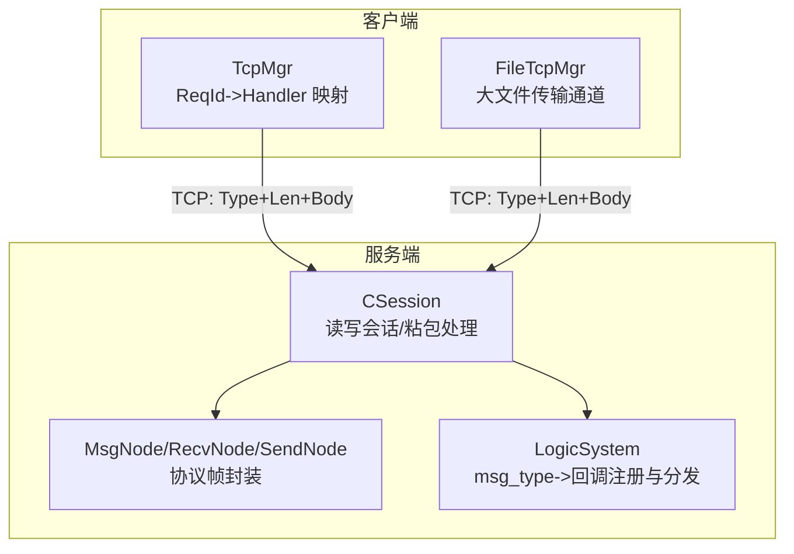
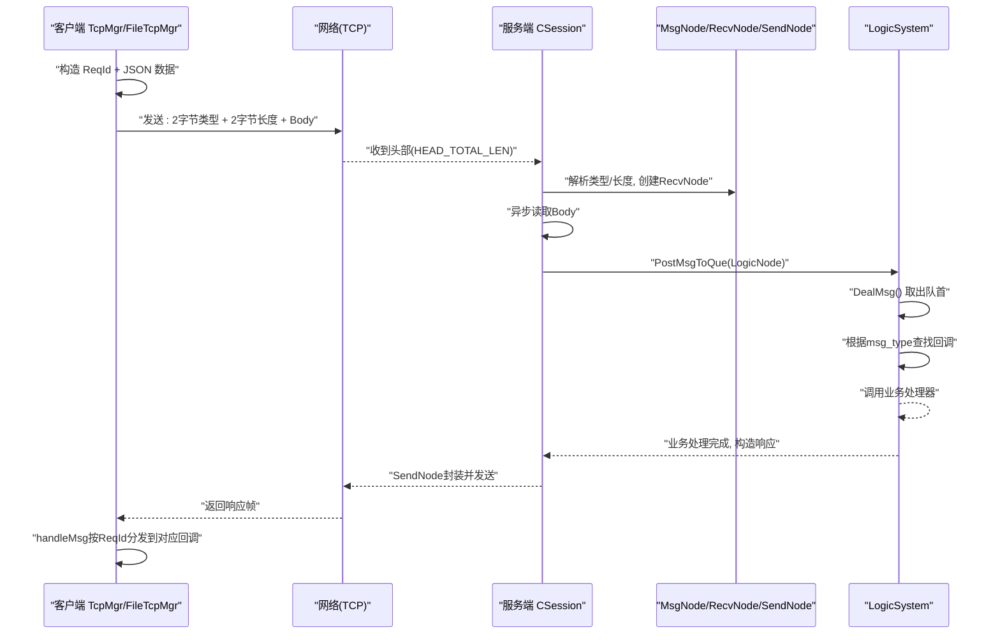
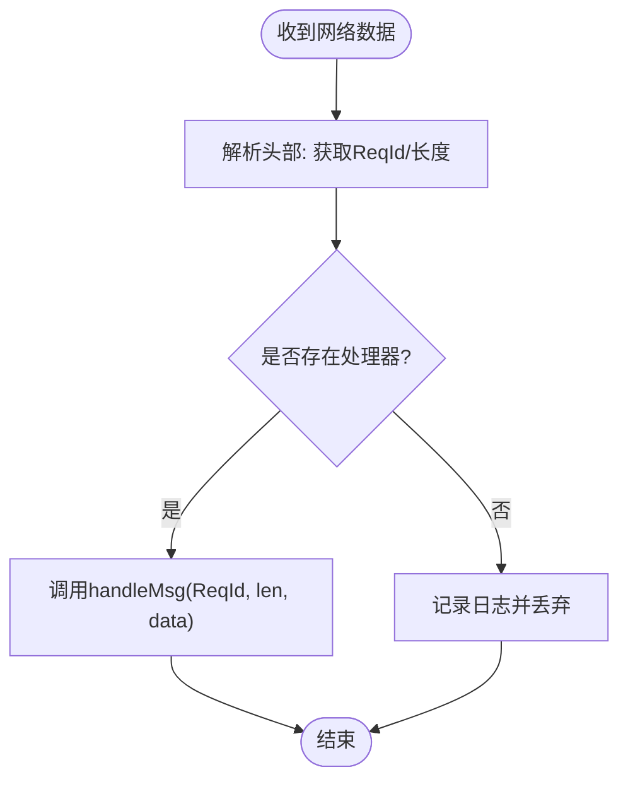
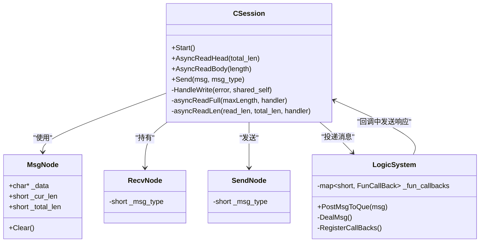
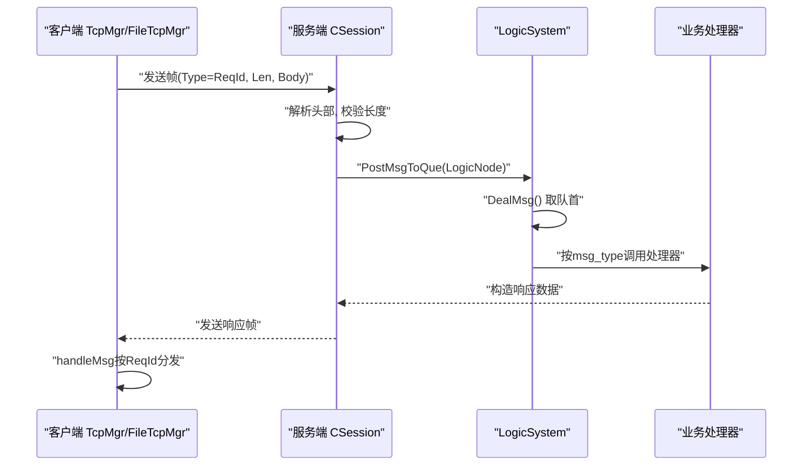
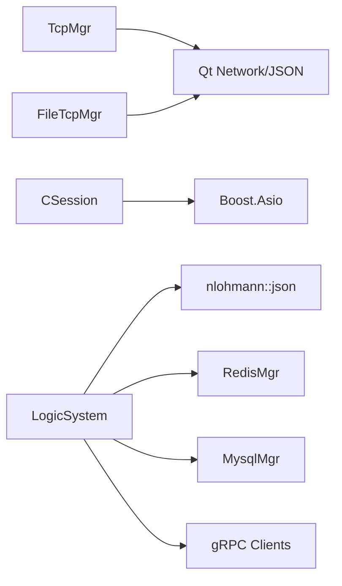

# 消息路由与分发

<cite>
**本文引用的文件**   
- [server/ChatServer/include/LogicSystem.h](file://server/ChatServer/include/LogicSystem.h)
- [server/ChatServer/src/LogicSystem.cpp](file://server/ChatServer/src/LogicSystem.cpp)
- [server/ChatServer/include/CSession.h](file://server/ChatServer/include/CSession.h)
- [server/ChatServer/src/CSession.cpp](file://server/ChatServer/src/CSession.cpp)
- [server/ChatServer/include/MsgNode.h](file://server/ChatServer/include/MsgNode.h)
- [server/ChatServer/src/MsgNode.cpp](file://server/ChatServer/src/MsgNode.cpp)
- [server/ChatServer/include/const.h](file://server/ChatServer/include/const.h)
- [client/llfcchat/include/tcpmgr.h](file://client/llfcchat/include/tcpmgr.h)
- [client/llfcchat/src/tcpmgr.cpp](file://client/llfcchat/src/tcpmgr.cpp)
- [client/llfcchat/include/filetcpmgr.h](file://client/llfcchat/include/filetcpmgr.h)
- [client/llfcchat/src/filetcpmgr.cpp](file://client/llfcchat/src/filetcpmgr.cpp)
- [开发文档/day29-好友认证和聊天通信.md](file://开发文档/day29-好友认证和聊天通信.md)
</cite>

## 目录
1. [简介](#简介)
2. [项目结构](#项目结构)
3. [核心组件](#核心组件)
4. [架构总览](#架构总览)
5. [详细组件分析](#详细组件分析)
6. [依赖关系分析](#依赖关系分析)
7. [性能考量](#性能考量)
8. [故障排查指南](#故障排查指南)
9. [结论](#结论)
10. [附录](#附录)

## 简介
本文件面向 LLFCChat 的消息路由与分发系统，重点说明基于 ReqId 的客户端侧请求-响应路由机制，以及服务器端基于 msg_type 的消息分发流程。内容涵盖：
- 客户端 ReqId 映射表、处理器注册、异步回调处理
- 服务器端 msg_type 到业务处理器的注册与调用
- 从网络数据接收到具体业务逻辑调用的完整路径
- 错误路由处理、超时清理、心跳与优先级等高级特性
- 路由配置示例与调试方法

## 项目结构
本项目采用多服务架构（GateServer、ChatServer、ResourceServer、StatusServer、VarifyServer），其中 ChatServer 负责即时通讯的核心消息路由与分发；客户端通过 Qt TCP 管理器进行请求发送与响应接收。

图表来源
- [server/ChatServer/include/CSession.h:28-86](file://server/ChatServer/include/CSession.h#L28-L86)
- [server/ChatServer/include/MsgNode.h:1-48](file://server/ChatServer/include/MsgNode.h#L1-L48)
- [server/ChatServer/src/MsgNode.cpp:1-17](file://server/ChatServer/src/MsgNode.cpp#L1-L17)
- [client/llfcchat/include/tcpmgr.h:22-87](file://client/llfcchat/include/tcpmgr.h#L22-L87)
- [client/llfcchat/include/filetcpmgr.h:26-82](file://client/llfcchat/include/filetcpmgr.h#L26-L82)

章节来源
- [server/ChatServer/include/CSession.h:28-86](file://server/ChatServer/include/CSession.h#L28-L86)
- [server/ChatServer/include/MsgNode.h:1-48](file://server/ChatServer/include/MsgNode.h#L1-L48)
- [client/llfcchat/include/tcpmgr.h:22-87](file://client/llfcchat/include/tcpmgr.h#L22-L87)
- [client/llfcchat/include/filetcpmgr.h:26-82](file://client/llfcchat/include/filetcpmgr.h#L26-L82)

## 核心组件
- 客户端 TcpMgr/FileTcpMgr：维护 ReqId 到处理函数的映射表，负责网络收发、粘包处理、发送队列与拥塞控制，并通过信号槽将结果回传到 UI 层。
- 服务端 CSession：基于 Boost.Asio 的非阻塞 I/O，完成头部读取、长度校验、体部分片读取、发送队列与写回调。
- 服务端 MsgNode/RecvNode/SendNode：定义协议帧头（类型、长度）与缓冲管理，统一编解码格式。
- 服务端 LogicSystem：维护 msg_type 到业务回调的映射表，单线程消费队列并调用对应处理器，实现解耦与顺序执行。

章节来源
- [client/llfcchat/include/tcpmgr.h:22-87](file://client/llfcchat/include/tcpmgr.h#L22-L87)
- [client/llfcchat/include/filetcpmgr.h:26-82](file://client/llfcchat/include/filetcpmgr.h#L26-L82)
- [server/ChatServer/include/CSession.h:28-86](file://server/ChatServer/include/CSession.h#L28-L86)
- [server/ChatServer/include/MsgNode.h:1-48](file://server/ChatServer/include/MsgNode.h#L1-L48)
- [server/ChatServer/include/LogicSystem.h:1-60](file://server/ChatServer/include/LogicSystem.h#L1-L60)

## 架构总览
下图展示从客户端发送数据到服务器业务处理的端到端流程，包括 ReqId/msg_type 的映射、协议帧封装、I/O 读写、队列投递与回调分发。

图表来源
- [client/llfcchat/src/tcpmgr.cpp:1019-1069](file://client/llfcchat/src/tcpmgr.cpp#L1019-L1069)
- [server/ChatServer/src/CSession.cpp:1-49](file://server/ChatServer/src/CSession.cpp#L1-L49)
- [server/ChatServer/src/CSession.cpp:51-224](file://server/ChatServer/src/CSession.cpp#L51-L224)
- [server/ChatServer/src/MsgNode.cpp:1-17](file://server/ChatServer/src/MsgNode.cpp#L1-L17)
- [server/ChatServer/src/LogicSystem.cpp:1-200](file://server/ChatServer/src/LogicSystem.cpp#L1-L200)

## 详细组件分析

### 客户端 ReqId 路由机制（TcpMgr / FileTcpMgr）
- 处理器注册：在初始化时向 _handlers 映射表插入 ReqId 与处理函数（lambda）。
- 发送流程：构造 ReqId 与数据块，写入网络字节序的类型与长度，进入发送队列并发出信号。
- 接收流程：解析头部后，根据 ReqId 查找处理器并调用 handleMsg 分发。
- 错误处理：未找到处理器时打印日志并丢弃；发送拥塞时使用队列暂存。

图表来源
- [client/llfcchat/src/tcpmgr.cpp:1019-1069](file://client/llfcchat/src/tcpmgr.cpp#L1019-L1069)
- [client/llfcchat/src/filetcpmgr.cpp:175-189](file://client/llfcchat/src/filetcpmgr.cpp#L175-L189)

章节来源
- [client/llfcchat/include/tcpmgr.h:22-87](file://client/llfcchat/include/tcpmgr.h#L22-L87)
- [client/llfcchat/src/tcpmgr.cpp:1019-1069](file://client/llfcchat/src/tcpmgr.cpp#L1019-L1069)
- [client/llfcchat/include/filetcpmgr.h:26-82](file://client/llfcchat/include/filetcpmgr.h#L26-L82)
- [client/llfcchat/src/filetcpmgr.cpp:175-189](file://client/llfcchat/src/filetcpmgr.cpp#L175-L189)

### 服务器端 msg_type 路由机制（CSession + LogicSystem）
- 协议帧：头部包含 msg_type（短整型，网络字节序）与数据长度（短整型或长整型，依服务而定）。
- 读流程：CSession 先读 HEAD_TOTAL_LEN，校验合法性后创建 RecvNode，再异步读取 Body。
- 投递：将 (session, recvnode) 封装为 LogicNode，投递至 LogicSystem 队列。
- 分发：LogicSystem 单线程消费队列，按 msg_type 查找回调并调用业务处理器。
- 写流程：业务处理器构造响应，经 SendNode 封装后由 CSession 异步写出。

图表来源
- [server/ChatServer/include/CSession.h:28-86](file://server/ChatServer/include/CSession.h#L28-L86)
- [server/ChatServer/include/MsgNode.h:1-48](file://server/ChatServer/include/MsgNode.h#L1-L48)
- [server/ChatServer/src/MsgNode.cpp:1-17](file://server/ChatServer/src/MsgNode.cpp#L1-L17)
- [server/ChatServer/include/LogicSystem.h:1-60](file://server/ChatServer/include/LogicSystem.h#L1-L60)

章节来源
- [server/ChatServer/src/CSession.cpp:1-49](file://server/ChatServer/src/CSession.cpp#L1-L49)
- [server/ChatServer/src/CSession.cpp:51-224](file://server/ChatServer/src/CSession.cpp#L51-L224)
- [server/ChatServer/include/MsgNode.h:1-48](file://server/ChatServer/include/MsgNode.h#L1-L48)
- [server/ChatServer/src/MsgNode.cpp:1-17](file://server/ChatServer/src/MsgNode.cpp#L1-L17)
- [server/ChatServer/include/LogicSystem.h:1-60](file://server/ChatServer/include/LogicSystem.h#L1-L60)
- [server/ChatServer/src/LogicSystem.cpp:1-200](file://server/ChatServer/src/LogicSystem.cpp#L1-L200)

### 消息分发流程（从网络到业务）
- 客户端发送：TcpMgr/FileTcpMgr 将 ReqId 与数据序列化后写入网络。
- 服务端接收：CSession 解析头部，校验长度与类型，构建 RecvNode。
- 队列投递：CSession 将 LogicNode 投递给 LogicSystem。
- 业务处理：LogicSystem 按 msg_type 查找回调并执行，必要时调用外部服务（如 Redis/Mysql/gRPC）。
- 响应返回：业务处理器构造响应，CSession 通过 SendNode 写出，客户端 handleMsg 按 ReqId 分发。

图表来源
- [client/llfcchat/src/tcpmgr.cpp:1019-1069](file://client/llfcchat/src/tcpmgr.cpp#L1019-L1069)
- [server/ChatServer/src/CSession.cpp:51-224](file://server/ChatServer/src/CSession.cpp#L51-L224)
- [server/ChatServer/src/LogicSystem.cpp:1-200](file://server/ChatServer/src/LogicSystem.cpp#L1-L200)

章节来源
- [client/llfcchat/src/tcpmgr.cpp:1019-1069](file://client/llfcchat/src/tcpmgr.cpp#L1019-L1069)
- [server/ChatServer/src/CSession.cpp:51-224](file://server/ChatServer/src/CSession.cpp#L51-L224)
- [server/ChatServer/src/LogicSystem.cpp:1-200](file://server/ChatServer/src/LogicSystem.cpp#L1-L200)

### 错误路由处理
- 客户端：当 _handlers 未找到对应 ReqId 时，打印日志并丢弃该消息。
- 服务端：若 msg_type 非法或长度超限，关闭会话并清理资源；若未找到回调，记录日志并丢弃。
- 异常连接：CSession 在读写失败时触发 DealExceptionSession，清理 session 并释放分布式锁。

章节来源
- [client/llfcchat/src/tcpmgr.cpp:1019-1069](file://client/llfcchat/src/tcpmgr.cpp#L1019-L1069)
- [client/llfcchat/src/filetcpmgr.cpp:175-189](file://client/llfcchat/src/filetcpmgr.cpp#L175-L189)
- [server/ChatServer/src/CSession.cpp:184-224](file://server/ChatServer/src/CSession.cpp#L184-L224)
- [server/ChatServer/src/LogicSystem.cpp:1-200](file://server/ChatServer/src/LogicSystem.cpp#L1-L200)

### 超时消息清理与心跳
- 心跳：服务端 CSession 维护 _last_heartbeat，提供 IsHeartbeatExpired/UpdateHeartbeat 接口；客户端需定期发送心跳请求（ID_HEART_BEAT_REQ）。
- 超时清理：当连接异常或心跳过期，服务端清理 session 并从 Redis 删除用户会话信息，防止僵尸连接。

章节来源
- [server/ChatServer/include/CSession.h:46-51](file://server/ChatServer/include/CSession.h#L46-L51)
- [server/ChatServer/src/CSession.cpp:184-224](file://server/ChatServer/src/CSession.cpp#L184-L224)
- [server/ChatServer/include/const.h:49-79](file://server/ChatServer/include/const.h#L49-L79)

### 消息优先级管理
- 当前实现中，LogicSystem 使用单队列顺序消费，无显式优先级字段。
- 如需优先级，可在 LogicNode 中引入优先级字段，并在投递时按优先级排序或使用多队列策略。

章节来源
- [server/ChatServer/include/LogicSystem.h:51-58](file://server/ChatServer/include/LogicSystem.h#L51-L58)
- [server/ChatServer/src/LogicSystem.cpp:1-200](file://server/ChatServer/src/LogicSystem.cpp#L1-L200)

### 路由配置示例与调试方法
- 客户端处理器注册：在 initHandlers 中向 _handlers 插入 ReqId 与 lambda 处理函数。
- 服务器回调注册：在 RegisterCallBacks 中将 msg_type 绑定到业务处理器。
- 调试建议：
  - 客户端：打印 handleMsg 的 ReqId 与数据，确认映射是否正确。
  - 服务端：打印 DealMsg 中的 msg_type 与回调查找结果，定位未注册或解析错误。
  - 参考开发文档中的示例代码片段路径。

章节来源
- [client/llfcchat/include/tcpmgr.h:34-36](file://client/llfcchat/include/tcpmgr.h#L34-L36)
- [client/llfcchat/src/tcpmgr.cpp:1019-1069](file://client/llfcchat/src/tcpmgr.cpp#L1019-L1069)
- [server/ChatServer/include/LogicSystem.h:27-33](file://server/ChatServer/include/LogicSystem.h#L27-L33)
- [server/ChatServer/src/LogicSystem.cpp:83-114](file://server/ChatServer/src/LogicSystem.cpp#L83-L114)
- [开发文档/day29-好友认证和聊天通信.md:984-1016](file://开发文档/day29-好友认证和聊天通信.md#L984-L1016)

## 依赖关系分析
- 客户端依赖 Qt 网络模块与 JSON 库，用于数据序列化与信号槽通信。
- 服务端依赖 Boost.Asio 进行非阻塞 I/O，nlohmann/json 进行 JSON 解析，Redis/Mysql/gRPC 作为后端存储与服务调用。
- 协议层通过 MsgNode/RecvNode/SendNode 统一封装，避免各模块直接操作原始缓冲区。

图表来源
- [client/llfcchat/include/tcpmgr.h:1-12](file://client/llfcchat/include/tcpmgr.h#L1-L12)
- [server/ChatServer/include/LogicSystem.h:1-14](file://server/ChatServer/include/LogicSystem.h#L1-L14)
- [server/ChatServer/src/LogicSystem.cpp:1-12](file://server/ChatServer/src/LogicSystem.cpp#L1-L12)

章节来源
- [client/llfcchat/include/tcpmgr.h:1-12](file://client/llfcchat/include/tcpmgr.h#L1-L12)
- [server/ChatServer/include/LogicSystem.h:1-14](file://server/ChatServer/include/LogicSystem.h#L1-L14)
- [server/ChatServer/src/LogicSystem.cpp:1-12](file://server/ChatServer/src/LogicSystem.cpp#L1-L12)

## 性能考量
- 发送队列：CSession 维护 _send_que，限制最大长度，避免内存溢出；TcpMgr/FileTcpMgr 也使用 QQueue 控制发送速率。
- 粘包处理：CSession 分步读取头部与体部，确保完整性；客户端同理。
- 单线程逻辑消费：LogicSystem 单线程顺序处理，降低竞争开销，但需注意耗时操作应异步化。
- 拥塞控制：FileTcpMgr 引入拥塞窗口 _cwnd_size 控制批量发送。

章节来源
- [server/ChatServer/include/CSession.h:64-76](file://server/ChatServer/include/CSession.h#L64-L76)
- [client/llfcchat/include/tcpmgr.h:48-55](file://client/llfcchat/include/tcpmgr.h#L48-L55)
- [client/llfcchat/include/filetcpmgr.h:55-64](file://client/llfcchat/include/filetcpmgr.h#L55-L64)

## 故障排查指南
- 常见问题：
  - 客户端未找到处理器：检查 initHandlers 是否注册对应 ReqId。
  - 服务端未找到回调：检查 RegisterCallBacks 是否绑定 msg_type。
  - 粘包/半包：确认头部长度与体部读取一致。
  - 心跳超时：检查客户端心跳发送频率与服务端过期判断。
- 调试步骤：
  - 在 handleMsg 与 DealMsg 中增加日志输出。
  - 使用 Wireshark 抓包验证协议帧结构。
  - 检查 Redis/Mysql/gRPC 调用返回值与异常码。

章节来源
- [client/llfcchat/src/tcpmgr.cpp:1019-1069](file://client/llfcchat/src/tcpmgr.cpp#L1019-L1069)
- [server/ChatServer/src/LogicSystem.cpp:1-200](file://server/ChatServer/src/LogicSystem.cpp#L1-L200)
- [server/ChatServer/src/CSession.cpp:184-224](file://server/ChatServer/src/CSession.cpp#L184-L224)

## 结论
LLFCChat 的消息路由与分发系统通过客户端 ReqId 与服务端 msg_type 的双映射机制，实现了清晰、可扩展的请求-响应路由。CSession 与 LogicSystem 的职责分离确保了高内聚低耦合，结合队列与异步 I/O 提升了吞吐与稳定性。未来可在此基础上扩展优先级、重试与熔断等高级特性。

## 附录
- 协议常量：MSG_TYPES 定义了所有消息类型，便于统一管理与扩展。
- 错误码：ErrorCodes 统一定义了业务错误码，便于前后端一致性处理。

章节来源
- [server/ChatServer/include/const.h:49-79](file://server/ChatServer/include/const.h#L49-L79)
- [server/ChatServer/include/const.h:5-20](file://server/ChatServer/include/const.h#L5-L20)