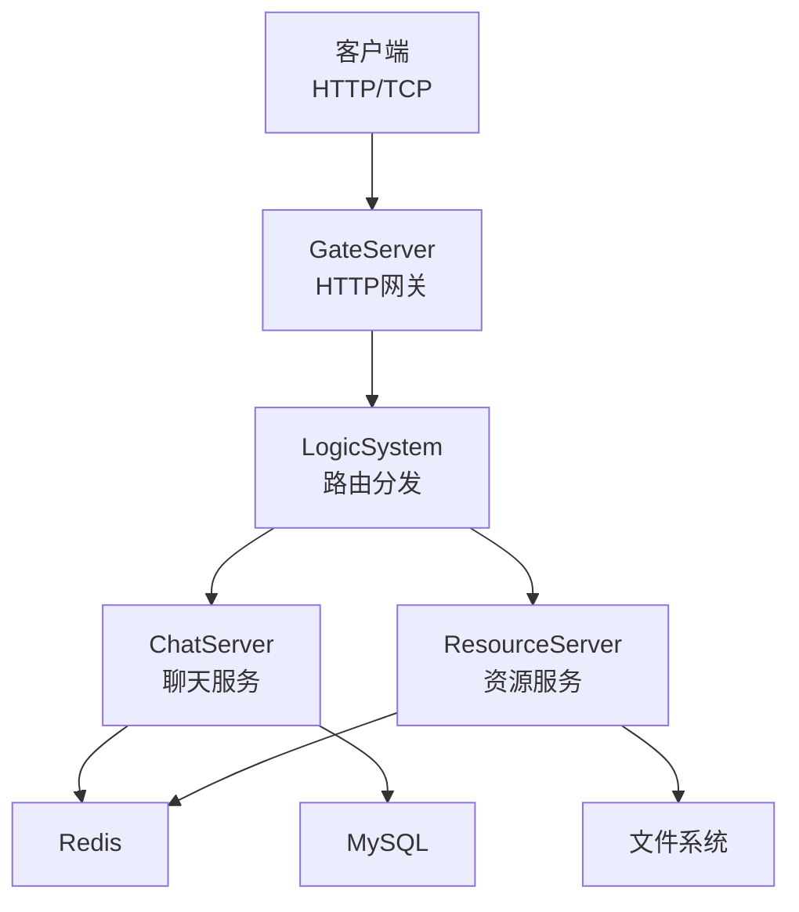
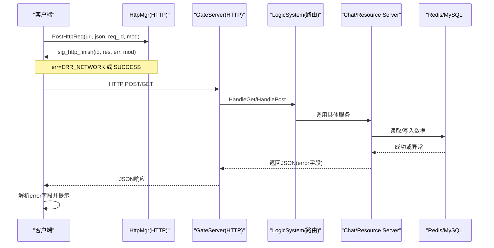
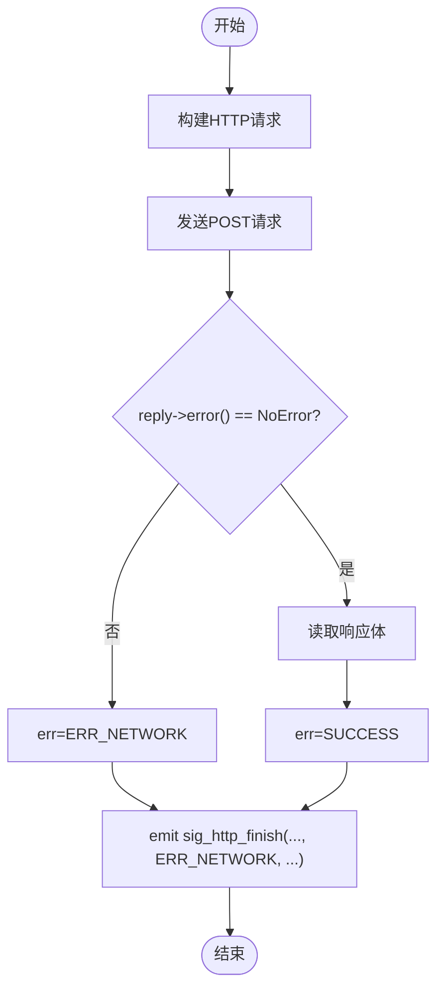
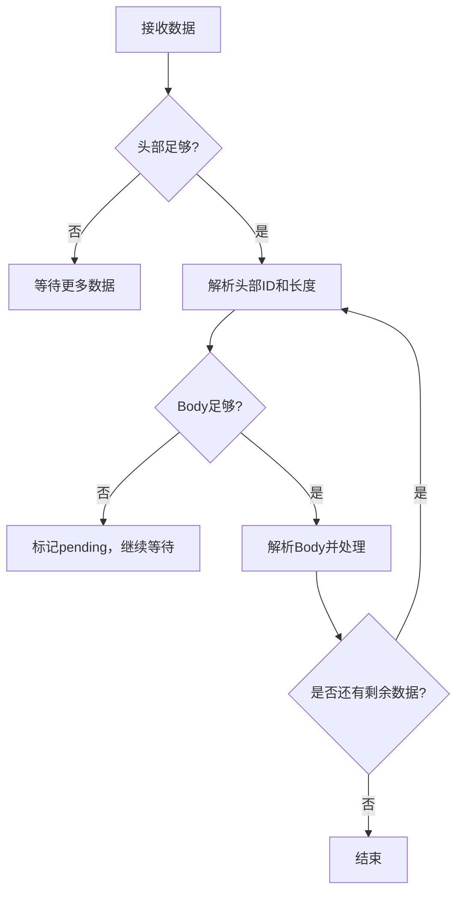
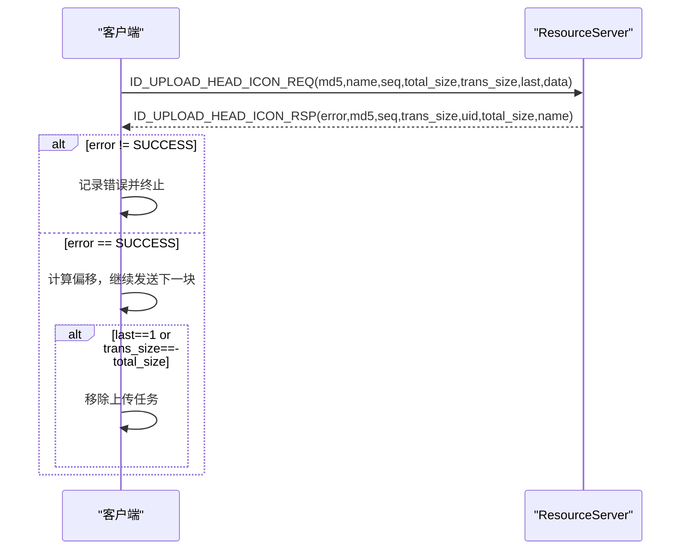
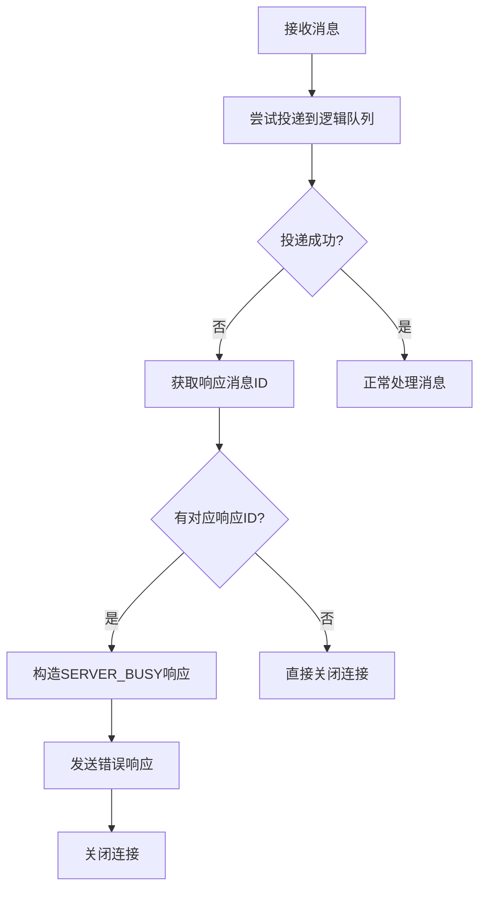
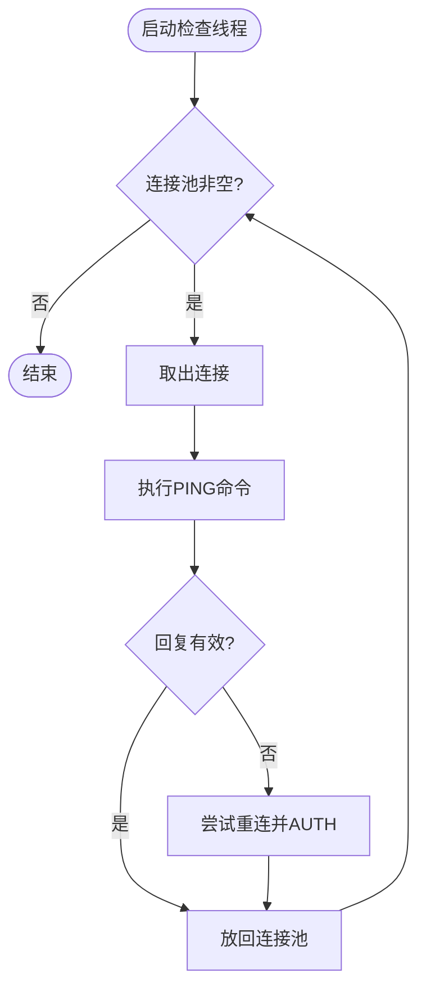
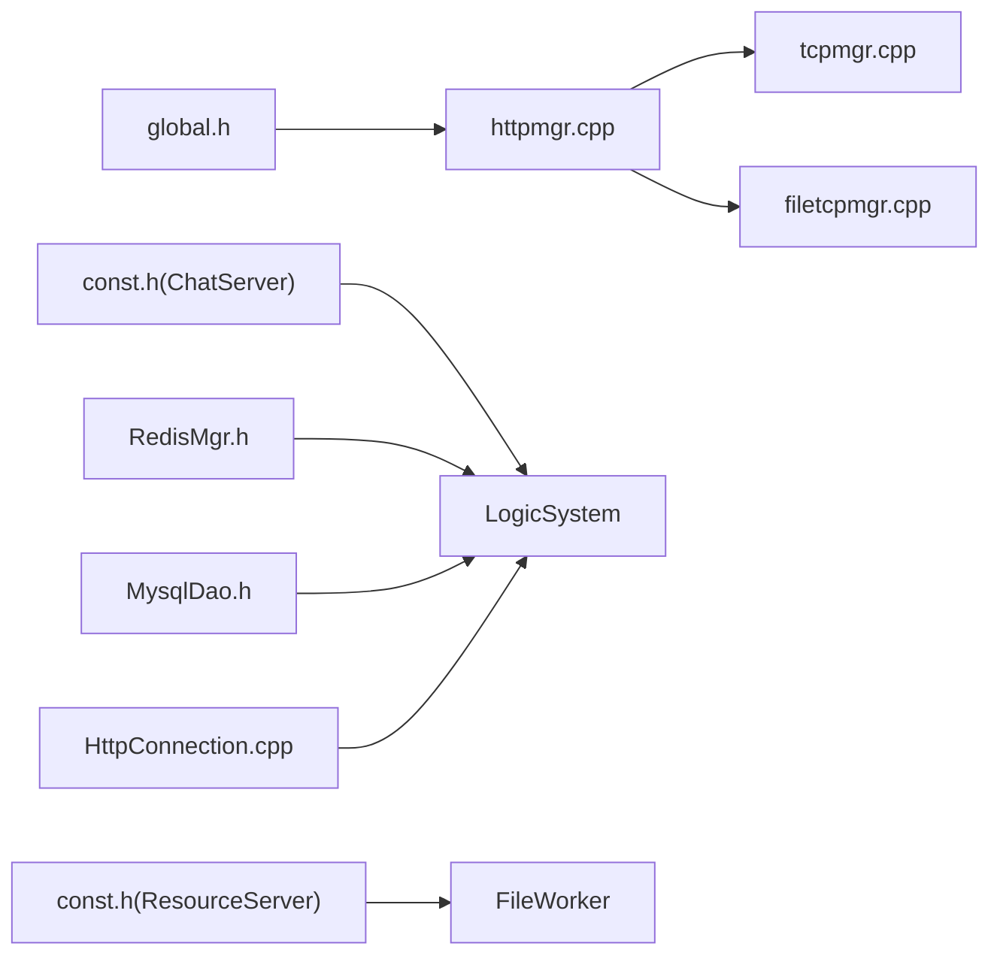

# 错误处理与状态码

<cite>
**本文引用的文件**   
- [global.h](file://client/llfcchat/include/global.h)
- [httpmgr.h](file://client/llfcchat/include/httpmgr.h)
- [httpmgr.cpp](file://client/llfcchat/src/httpmgr.cpp)
- [tcpmgr.cpp](file://client/llfcchat/src/tcpmgr.cpp)
- [filetcpmgr.cpp](file://client/llfcchat/src/filetcpmgr.cpp)
- [const.h（ChatServer）](file://server/ChatServer/include/const.h)
- [const.h（ResourceServer）](file://server/ResourceServer/include/const.h)
- [CSession.cpp（ChatServer）](file://server/ChatServer/src/CSession.cpp)
- [LogicWorker.cpp（ChatServer）](file://server/ChatServer/src/LogicWorker.cpp)
- [RedisMgr.h（ChatServer）](file://server/ChatServer/include/RedisMgr.h)
- [RedisMgr.h（GateServer）](file://server/GateServer/include/RedisMgr.h)
- [MysqlDao.h（ChatServer）](file://server/ChatServer/include/MysqlDao.h)
- [HttpConnection.cpp（GateServer）](file://server/GateServer/src/HttpConnection.cpp)
- [day38-断点续传.md](file://开发文档/day38-断点续传.md)
- [day42-Qt粘包引发的血案.md](file://开发文档/day42-Qt粘包引发的血案.md)
</cite>

## 更新摘要
**变更内容**   
- 新增 ChatServer 服务端的四个关键错误码：MESSAGE_STORE_FAILED(1014)、RECIPIENT_OFFLINE(1015)、SERVER_BUSY(1016)、MESSAGE_CONFLICT(1017)
- 完善了消息持久化失败的错误处理机制
- 增强了目标用户离线时的错误响应处理
- 改进了服务端繁忙状态下的请求拒绝逻辑
- 优化了消息冲突检测与处理流程

## 目录
1. [简介](#简介)
2. [项目结构](#项目结构)
3. [核心组件](#核心组件)
4. [架构总览](#架构总览)
5. [详细组件分析](#详细组件分析)
6. [依赖关系分析](#依赖关系分析)
7. [性能考虑](#性能考虑)
8. [故障排查指南](#故障排查指南)
9. [结论](#结论)
10. [附录](#附录)

## 简介
本文件系统化梳理 LLFCChat 的错误处理机制，覆盖客户端与服务端的错误码定义、错误传播路径、客户端提示策略、服务端日志记录、以及重试与恢复机制。重点包括：
- 客户端 ErrorCodes 枚举（SUCCESS、ERR_JSON、ERR_NETWORK 等）及其使用场景
- 服务器端 ErrorCodes 枚举（JSON 解析、RPC、验证码、用户、Token、文件、Redis、消息存储等）
- 从网络层到应用层的错误传播与统一封装
- 客户端 UI 提示与业务层重试策略
- 服务端连接池健康检查与自动重连
- 常见问题的定位与修复建议

## 项目结构
LLFCChat 采用"客户端 + 多服务"的分布式架构：
- 客户端（Qt/C++）：负责 HTTP 注册/登录/重置、TCP 聊天与文件传输、UI 交互与错误提示
- GateServer（C++/Boost.Beast）：HTTP 网关，路由请求至后端逻辑
- ChatServer（C++/Asio）：聊天会话、消息路由、Redis/MySQL 访问
- ResourceServer（C++/Asio）：文件上传/下载、图片资源管理
- StatusServer（C++/Asio）：状态同步
- VarifyServer（Node.js）：验证码派发与校验

图表来源
- [HttpConnection.cpp（GateServer）:1-223](file://server/GateServer/src/HttpConnection.cpp#L1-L223)
- [const.h（ChatServer）:1-104](file://server/ChatServer/include/const.h#L1-L104)
- [const.h（ResourceServer）:1-117](file://server/ResourceServer/include/const.h#L1-L117)

章节来源
- [global.h:1-296](file://client/llfcchat/include/global.h#L1-L296)
- [httpmgr.h:1-34](file://client/llfcchat/include/httpmgr.h#L1-L34)
- [httpmgr.cpp:1-62](file://client/llfcchat/src/httpmgr.cpp#L1-L62)
- [HttpConnection.cpp（GateServer）:1-223](file://server/GateServer/src/HttpConnection.cpp#L1-L223)

## 核心组件
- 客户端错误码与模块划分
  - ErrorCodes：SUCCESS、ERR_JSON、ERR_NETWORK
  - Modules：REGISTERMOD、RESETMOD、LOGINMOD
- 服务端错误码
  - ChatServer：Success、Error_Json、RPCFailed、验证码/用户/密码/Token、聊天创建/加载失败、**消息存储失败、目标用户离线、服务端繁忙、消息冲突**等
  - ResourceServer：Success、Error_Json、RPCFailed、验证码/用户/密码/Token、文件相关、Redis、IP/MsgId 错误等
- 网络与协议
  - HTTP：QNetworkAccessManager 异步请求，finished 回调统一错误码
  - TCP：自定义头部+Body 协议，粘包/半包处理，错误事件分类
- 存储与缓存
  - Redis：连接池保活、PING 检测、异常重建
  - MySQL：连接池、健康检查、自动重连

章节来源
- [global.h:90-111](file://client/llfcchat/include/global.h#L90-L111)
- [const.h（ChatServer）:5-29](file://server/ChatServer/include/const.h#L5-L29)
- [const.h（ResourceServer）:5-29](file://server/ResourceServer/include/const.h#L5-L29)
- [httpmgr.cpp:1-62](file://client/llfcchat/src/httpmgr.cpp#L1-L62)
- [tcpmgr.cpp:63-90](file://client/llfcchat/src/tcpmgr.cpp#L63-L90)

## 架构总览
下图展示从客户端发起请求到服务端处理的错误传播路径，以及关键错误码在各层的流转。

图表来源
- [httpmgr.cpp:1-62](file://client/llfcchat/src/httpmgr.cpp#L1-L62)
- [HttpConnection.cpp（GateServer）:132-194](file://server/GateServer/src/HttpConnection.cpp#L132-L194)
- [const.h（ChatServer）:5-29](file://server/ChatServer/include/const.h#L5-L29)
- [const.h（ResourceServer）:5-29](file://server/ResourceServer/include/const.h#L5-L29)

## 详细组件分析

### 客户端错误码与HTTP层
- ErrorCodes 定义
  - SUCCESS = 0：成功
  - ERR_JSON = 1：JSON 解析失败
  - ERR_NETWORK = 2：网络错误
- HttpMgr 实现要点
  - 发送 QNetworkRequest，设置 Content-Type 为 application/json
  - finished 回调中判断 reply->error()，若不为 NoError 则触发 sig_http_finish(req_id, "", ERR_NETWORK, mod)
  - 成功时触发 sig_http_finish(req_id, res, SUCCESS, mod)
  - slot_http_finish 根据 Modules 分发信号给对应模块（注册/重置/登录）

图表来源
- [httpmgr.cpp:1-62](file://client/llfcchat/src/httpmgr.cpp#L1-L62)
- [global.h:90-111](file://client/llfcchat/include/global.h#L90-L111)

章节来源
- [httpmgr.h:1-34](file://client/llfcchat/include/httpmgr.h#L1-L34)
- [httpmgr.cpp:1-62](file://client/llfcchat/src/httpmgr.cpp#L1-L62)
- [global.h:90-111](file://client/llfcchat/include/global.h#L90-L111)

### TCP层错误处理与粘包处理
- 错误事件分类
  - ConnectionRefusedError、RemoteHostClosedError、HostNotFoundError、SocketTimeoutError、NetworkError
- 粘包/半包处理
  - 先读固定长度头部，再按长度读取 Body
  - 循环处理缓冲区，避免 Stream 位置错乱
  - 出现异常需清空缓冲，防止连锁错误

图表来源
- [tcpmgr.cpp:63-90](file://client/llfcchat/src/tcpmgr.cpp#L63-L90)
- [day42-Qt粘包引发的血案.md:417-514](file://开发文档/day42-Qt粘包引发的血案.md#L417-L514)

章节来源
- [tcpmgr.cpp:63-90](file://client/llfcchat/src/tcpmgr.cpp#L63-L90)
- [day42-Qt粘包引发的血案.md:417-514](file://开发文档/day42-Qt粘包引发的血案.md#L417-L514)

### 文件传输错误处理与断点续传
- 上传流程
  - 首次请求包含 md5、name、seq、total_size、trans_size、last、data
  - 服务器返回 error、md5、seq、trans_size、uid、total_size、name
  - 客户端根据 trans_size 偏移续传，直到 total_size 相等
- 下载流程
  - 服务器返回 data（Base64）、client_path、seq、is_last、total_size、current_size、name、req_type
  - 客户端按 seq 顺序写入文件，is_last 为真时完成

图表来源
- [filetcpmgr.cpp:250-332](file://client/llfcchat/src/filetcpmgr.cpp#L250-L332)
- [filetcpmgr.cpp:334-433](file://client/llfcchat/src/filetcpmgr.cpp#L334-L433)
- [day38-断点续传.md:948-1065](file://开发文档/day38-断点续传.md#L948-1065)

章节来源
- [filetcpmgr.cpp:250-449](file://client/llfcchat/src/filetcpmgr.cpp#L250-L449)
- [day38-断点续传.md:948-1065](file://开发文档/day38-断点续传.md#L948-1065)

### 服务端错误码与日志记录

**更新** 新增了四个关键的 ChatServer 错误码，完善了消息处理的全链路错误处理机制：

- ChatServer ErrorCodes（已更新）
  - Success、Error_Json、RPCFailed、验证码过期/错误、用户存在、密码错误、邮箱不匹配、更新密码失败、密码无效、Token失效、Uid无效、创建聊天失败、加载聊天失败
  - **MESSAGE_STORE_FAILED (1014)**：消息持久化失败（MySQL 写失败）
  - **RECIPIENT_OFFLINE (1015)**：目标用户当前不在线（无可用 session）
  - **SERVER_BUSY (1016)**：服务端停机/队列拒绝，消息未入队未持久化
  - **MESSAGE_CONFLICT (1017)**：unique-id 相同但内容冲突，原消息不变
- ResourceServer ErrorCodes
  - Success、Error_Json、RPCFailed、验证码过期/错误、用户存在、密码错误、邮箱不匹配、更新密码失败、密码无效、Token失效、Uid无效、文件不存在、Redis存储失败、路径创建失败、读写权限不足、序列/偏移错误、文件读取失败、Redis读取失败、ServerIp错误、MsgId错误
- 日志记录
  - 网络层：打印错误信息并关闭连接
  - 业务层：设置 error 字段并返回 JSON
  - 存储层：捕获异常并记录堆栈

章节来源
- [const.h（ChatServer）:5-29](file://server/ChatServer/include/const.h#L5-L29)
- [const.h（ResourceServer）:5-29](file://server/ResourceServer/include/const.h#L5-L29)
- [HttpConnection.cpp（GateServer）:132-194](file://server/GateServer/src/HttpConnection.cpp#L132-L194)

### 服务端繁忙状态处理与队列拒绝机制

**新增** 实现了完善的服务端繁忙状态检测和请求拒绝机制：

- 队列拒绝处理
  - 当 LogicSystem::PostMsgToQue 返回 false 时，表示服务处于停机或队列已满状态
  - 系统会立即返回 SERVER_BUSY 错误码给客户端
  - 该消息不会被入队处理，也不会被持久化存储
  - 连接会被主动关闭，确保资源释放

图表来源
- [CSession.cpp:170-185](file://server/ChatServer/src/CSession.cpp#L170-L185)
- [LogicWorker.cpp:15-25](file://server/ChatServer/src/LogicWorker.cpp#L15-L25)

章节来源
- [CSession.cpp:170-185](file://server/ChatServer/src/CSession.cpp#L170-L185)
- [LogicWorker.cpp:15-25](file://server/ChatServer/src/LogicWorker.cpp#L15-L25)

### 连接池健康检查与自动重连
- Redis 连接池
  - 定期 PING 检测连接存活
  - 异常时重建连接并重新认证
  - 失败计数控制重连次数
- MySQL 连接池
  - 周期性检查连接时间戳
  - 异常时尝试重连并加入池

图表来源
- [RedisMgr.h（ChatServer）:210-246](file://server/ChatServer/include/RedisMgr.h#L210-L246)
- [RedisMgr.h（GateServer）:210-246](file://server/GateServer/include/RedisMgr.h#L210-L246)
- [MysqlDao.h（ChatServer）:148-160](file://server/ChatServer/include/MysqlDao.h#L148-L160)

章节来源
- [RedisMgr.h（ChatServer）:210-246](file://server/ChatServer/include/RedisMgr.h#L210-L246)
- [RedisMgr.h（GateServer）:210-246](file://server/GateServer/include/RedisMgr.h#L210-L246)
- [MysqlDao.h（ChatServer）:148-160](file://server/ChatServer/include/MysqlDao.h#L148-L160)

## 依赖关系分析
- 客户端依赖
  - global.h：定义 ErrorCodes、Modules、ReqId 等
  - httpmgr.*：HTTP 请求与错误码传播
  - tcpmgr.cpp / filetcpmgr.cpp：TCP 错误处理与文件传输
- 服务端依赖
  - const.h（ChatServer/ResourceServer）：错误码定义
  - RedisMgr.h：Redis 连接池与健康检查
  - MysqlDao.h：MySQL 连接池与健康检查
  - HttpConnection.cpp：HTTP 请求处理与错误响应

图表来源
- [global.h:90-111](file://client/llfcchat/include/global.h#L90-L111)
- [httpmgr.cpp:1-62](file://client/llfcchat/src/httpmgr.cpp#L1-L62)
- [tcpmgr.cpp:63-90](file://client/llfcchat/src/tcpmgr.cpp#L63-L90)
- [filetcpmgr.cpp:250-449](file://client/llfcchat/src/filetcpmgr.cpp#L250-L449)
- [const.h（ChatServer）:5-29](file://server/ChatServer/include/const.h#L5-L29)
- [const.h（ResourceServer）:5-29](file://server/ResourceServer/include/const.h#L5-L29)
- [RedisMgr.h（ChatServer）:210-246](file://server/ChatServer/include/RedisMgr.h#L210-L246)
- [MysqlDao.h（ChatServer）:148-160](file://server/ChatServer/include/MysqlDao.h#L148-L160)
- [HttpConnection.cpp（GateServer）:132-194](file://server/GateServer/src/HttpConnection.cpp#L132-L194)

章节来源
- [global.h:90-111](file://client/llfcchat/include/global.h#L90-L111)
- [httpmgr.cpp:1-62](file://client/llfcchat/src/httpmgr.cpp#L1-L62)
- [tcpmgr.cpp:63-90](file://client/llfcchat/src/tcpmgr.cpp#L63-L90)
- [filetcpmgr.cpp:250-449](file://client/llfcchat/src/filetcpmgr.cpp#L250-L449)
- [const.h（ChatServer）:5-29](file://server/ChatServer/include/const.h#L5-L29)
- [const.h（ResourceServer）:5-29](file://server/ResourceServer/include/const.h#L5-L29)
- [RedisMgr.h（ChatServer）:210-246](file://server/ChatServer/include/RedisMgr.h#L210-L246)
- [MysqlDao.h（ChatServer）:148-160](file://server/ChatServer/include/MysqlDao.h#L148-L160)
- [HttpConnection.cpp（GateServer）:132-194](file://server/GateServer/src/HttpConnection.cpp#L132-L194)

## 性能考虑
- 客户端
  - 避免频繁 mid() 操作，优先使用 remove() 减少内存拷贝
  - 合理设置 MAX_FILE_LEN，平衡网络吞吐与内存占用
  - 使用零拷贝技术处理大数据（如 fromRawData）
- 服务端
  - Redis/MySQL 连接池大小与超时参数调优
  - 文件分片大小与并发度调整
  - 日志级别与输出频率控制，避免 I/O 瓶颈
  - **队列容量限制，防止内存溢出**

[本节为通用指导，无需特定文件引用]

## 故障排查指南
- 常见问题
  - JSON 解析失败：检查响应体是否为合法 JSON，确认 error 字段存在
  - 网络错误：检查网络连接、防火墙、代理设置
  - 粘包/半包：确保每次解析前创建新 Stream，正确处理缓冲区
  - 文件传输中断：检查 md5、seq、trans_size、total_size 一致性
  - Redis/MySQL 连接失败：查看连接池健康检查日志，确认认证信息
  - **消息存储失败：检查数据库连接状态和磁盘空间**
  - **目标用户离线：确认用户登录状态和会话有效性**
  - **服务端繁忙：检查队列负载和服务状态**
- 定位步骤
  - 客户端：查看 qDebug/qWarning 输出，定位错误码与模块
  - 服务端：查看错误日志与堆栈，确认错误码来源
  - 存储层：检查连接池状态与命令执行结果

章节来源
- [httpmgr.cpp:1-62](file://client/llfcchat/src/httpmgr.cpp#L1-L62)
- [tcpmgr.cpp:63-90](file://client/llfcchat/src/tcpmgr.cpp#L63-L90)
- [filetcpmgr.cpp:250-449](file://client/llfcchat/src/filetcpmgr.cpp#L250-L449)
- [day42-Qt粘包引发的血案.md:417-514](file://开发文档/day42-Qt粘包引发的血案.md#L417-L514)

## 结论
LLFCChat 的错误处理机制通过统一的错误码体系、分层错误传播、客户端友好提示、服务端详细日志、以及连接池自动重连，构建了健壮可靠的错误处理能力。**新增的四个关键错误码进一步完善了消息处理的全链路错误处理机制**，特别是在消息持久化失败、目标用户离线、服务端繁忙和消息冲突等场景下提供了明确的错误反馈。建议在后续迭代中进一步完善错误码文档化、增加重试退避策略、优化日志结构化输出，以提升可维护性与用户体验。

[本节为总结性内容，无需特定文件引用]

## 附录
- 错误码速查表
  - 客户端：SUCCESS=0、ERR_JSON=1、ERR_NETWORK=2
  - ChatServer：Success=0、Error_Json=1001、RPCFailed=1002、VarifyExpired=1003、VarifyCodeErr=1004、UserExist=1005、PasswdErr=1006、EmailNotMatch=1007、PasswdUpFailed=1008、PasswdInvalid=1009、TokenInvalid=1010、UidInvalid=1011、CREATE_CHAT_FAILED=1012、LOAD_CHAT_FAILED=1013、**MESSAGE_STORE_FAILED=1014、RECIPIENT_OFFLINE=1015、SERVER_BUSY=1016、MESSAGE_CONFLICT=1017**
  - ResourceServer：Success=0、Error_Json=1001、RPCFailed=1002、VarifyExpired=1003、VarifyCodeErr=1004、UserExist=1005、PasswdErr=1006、EmailNotMatch=1007、PasswdUpFailed=1008、PasswdInvalid=1009、TokenInvalid=1010、UidInvalid=1011、FileNotExists=1012、FileSaveRedisFailed=1013、CreateFilePathFailed=1014、FileWritePermissionFailed=1015、FileReadPermissionFailed=1016、FileSeqInvalid=1017、FileOffsetInvalid=1018、FileReadFailed=1019、RedisReadErr=1020、ServerIpErr=1021、MsgIdErr=1022

章节来源
- [global.h:90-111](file://client/llfcchat/include/global.h#L90-L111)
- [const.h（ChatServer）:5-29](file://server/ChatServer/include/const.h#L5-L29)
- [const.h（ResourceServer）:5-29](file://server/ResourceServer/include/const.h#L5-L29)