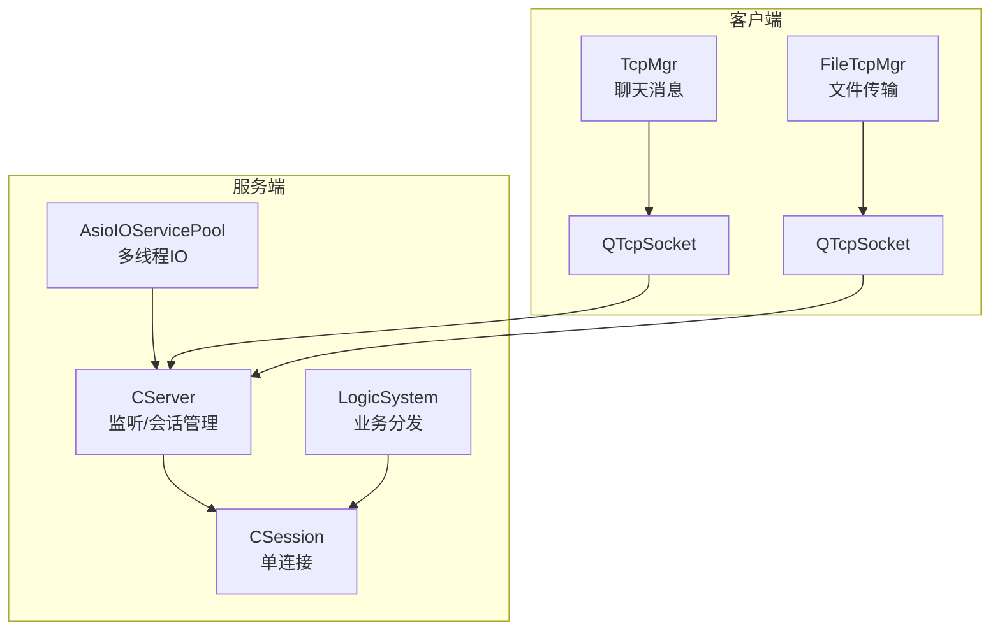
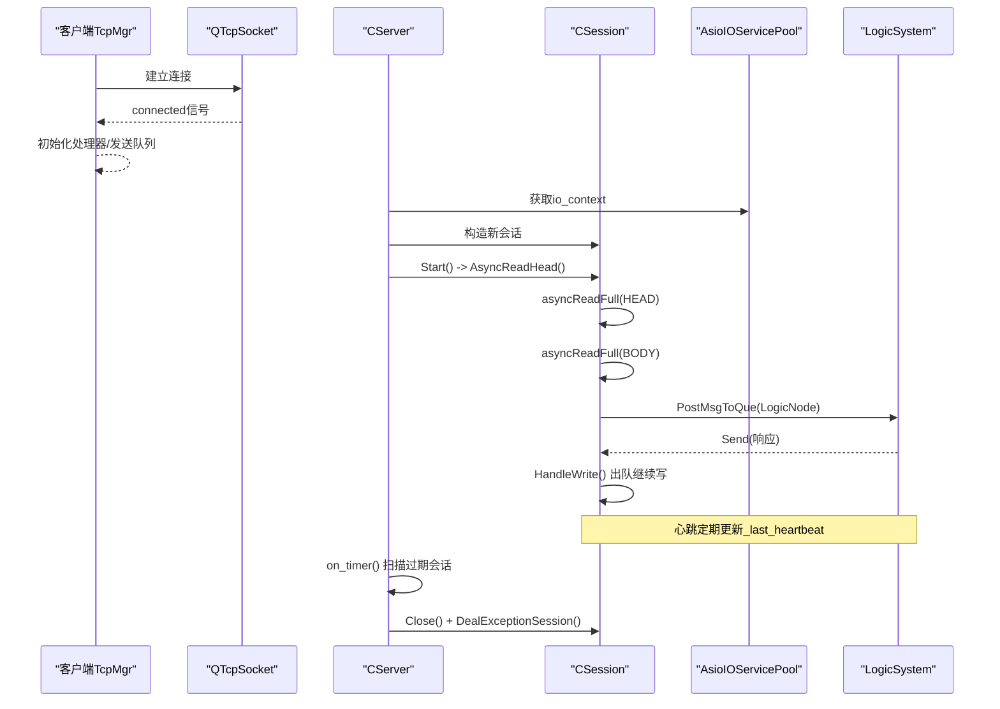
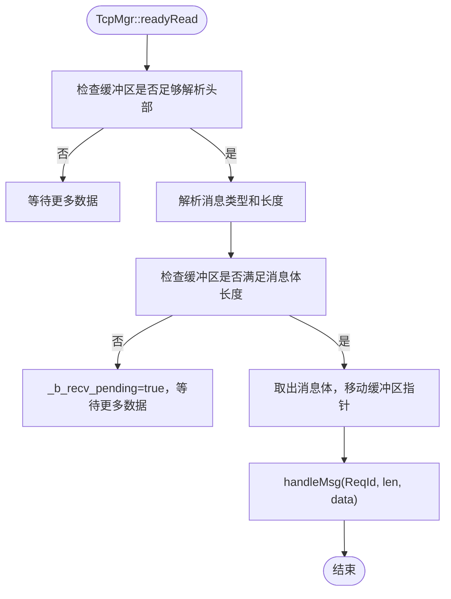
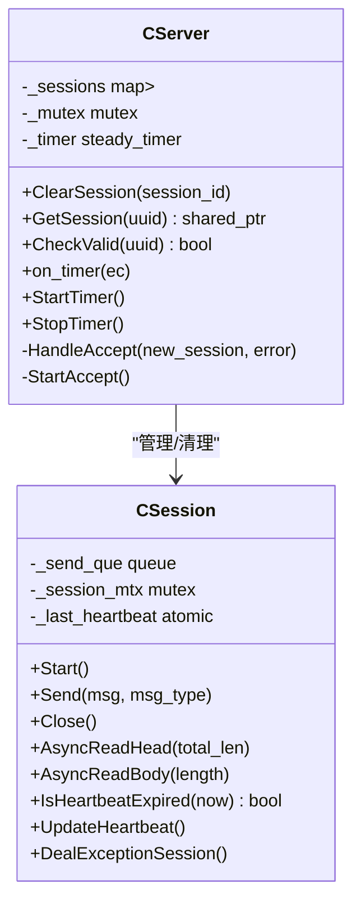
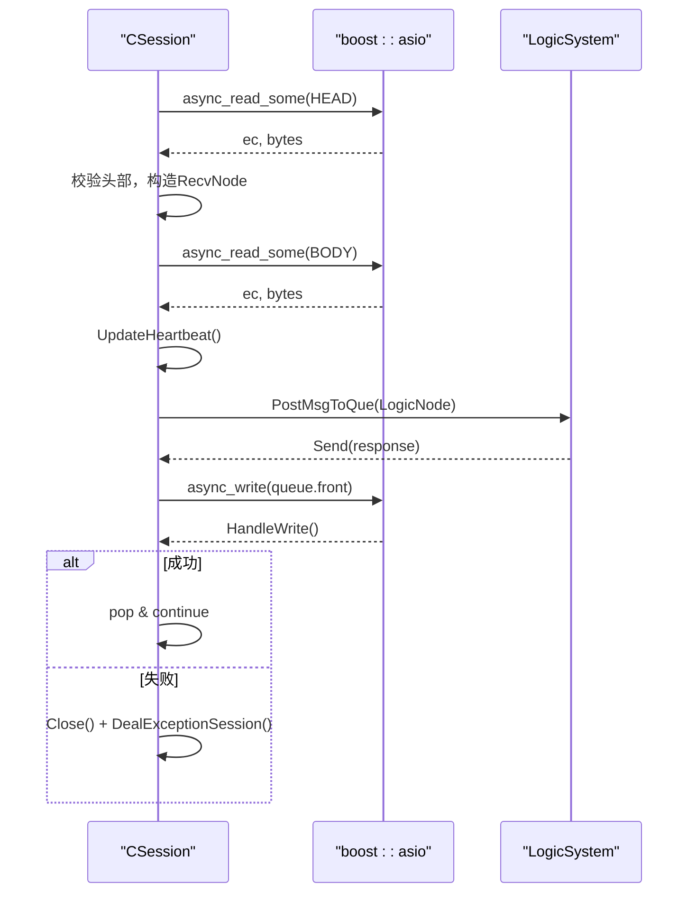
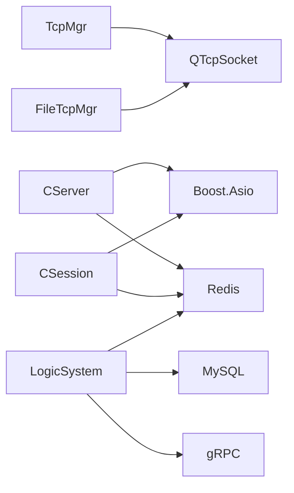
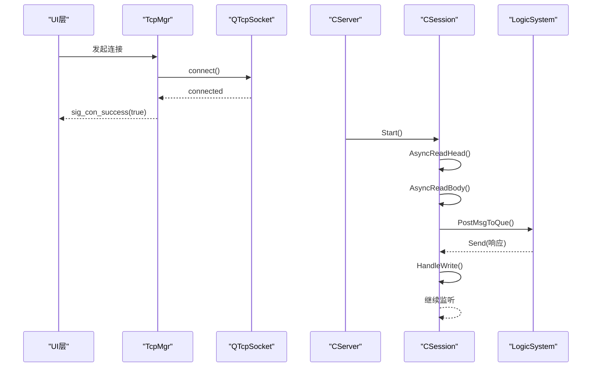
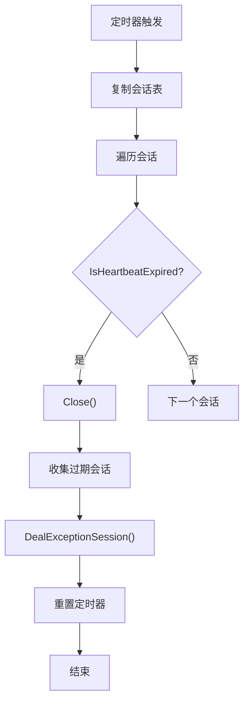
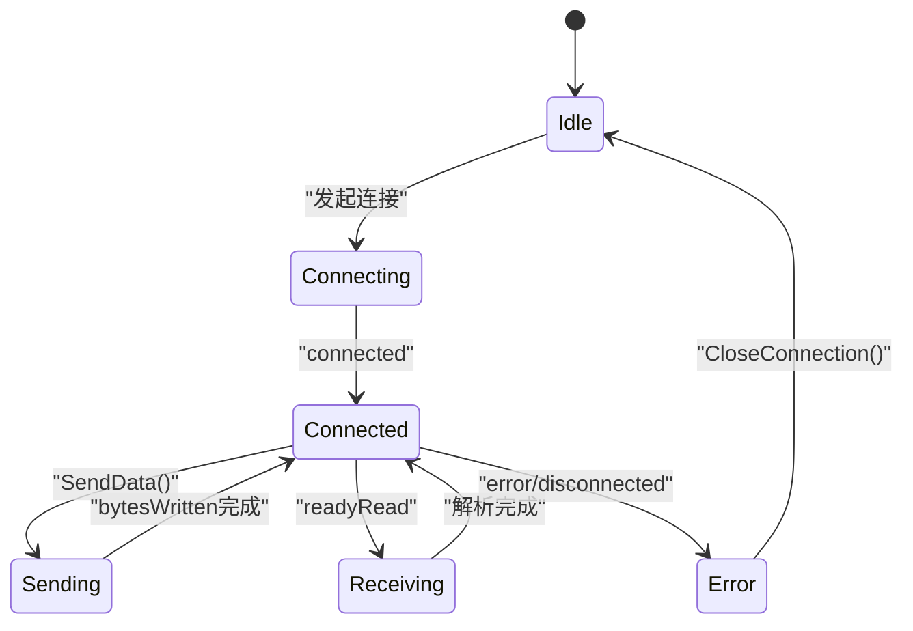

# TCP连接管理

<cite>
**本文引用的文件**   
- [tcpmgr.h](file://client/llfcchat/include/tcpmgr.h)
- [tcpmgr.cpp](file://client/llfcchat/src/tcpmgr.cpp)
- [filetcpmgr.h](file://client/llfcchat/include/filetcpmgr.h)
- [filetcpmgr.cpp](file://client/llfcchat/src/filetcpmgr.cpp)
- [CSession.h](file://server/ChatServer/include/CSession.h)
- [CSession.cpp](file://server/ChatServer/src/CSession.cpp)
- [CServer.h](file://server/ChatServer/include/CServer.h)
- [CServer.cpp](file://server/ChatServer/src/CServer.cpp)
- [AsioIOServicePool.h](file://server/ChatServer/include/AsioIOServicePool.h)
- [AsioIOServicePool.cpp](file://server/ChatServer/src/AsioIOServicePool.cpp)
- [LogicSystem.cpp](file://server/ChatServer/src/LogicSystem.cpp)
</cite>

## 目录
1. [简介](#简介)
2. [项目结构](#项目结构)
3. [核心组件](#核心组件)
4. [架构总览](#架构总览)
5. [详细组件分析](#详细组件分析)
6. [依赖关系分析](#依赖关系分析)
7. [性能考量](#性能考量)
8. [故障排查指南](#故障排查指南)
9. [结论](#结论)
10. [附录：连接生命周期与示例流程](#附录连接生命周期与示例流程)

## 简介
本文件面向LLFCChat的TCP连接管理系统，系统性梳理客户端TcpMgr与服务端CSession的连接建立、维护与销毁机制，覆盖连接池管理、连接状态监控、自动重连策略（客户端侧）、异步IO处理模型、线程安全设计、资源清理机制等。文档同时给出连接生命周期管理的完整流程图与关键路径说明，帮助读者快速理解并扩展该子系统。

## 项目结构
- 客户端（Qt）：
  - TcpMgr：负责聊天消息的TCP连接、粘包/拆包解析、发送队列、错误处理与信号转发。
  - FileTcpMgr：负责文件传输的独立TCP连接，具备独立的收发缓冲、拥塞控制与断点续传能力。
- 服务端（Boost.Asio）：
  - CServer：监听端口、接受连接、会话管理与定时心跳检测。
  - CSession：单连接的生命周期、异步读写、发送队列、心跳更新与异常清理。
  - AsioIOServicePool：多I/O服务线程池，轮询分配io_context，提升并发吞吐。
  - LogicSystem：业务逻辑处理器，通过消息类型分发到具体处理函数。

图表来源
- [tcpmgr.h:22-87](file://client/llfcchat/include/tcpmgr.h#L22-L87)
- [filetcpmgr.h:26-82](file://client/llfcchat/include/filetcpmgr.h#L26-L82)
- [CServer.h:10-37](file://server/ChatServer/include/CServer.h#L10-L37)
- [CSession.h:28-76](file://server/ChatServer/include/CSession.h#L28-L76)
- [AsioIOServicePool.h:8-27](file://server/ChatServer/include/AsioIOServicePool.h#L8-L27)

章节来源
- [tcpmgr.h:22-87](file://client/llfcchat/include/tcpmgr.h#L22-L87)
- [filetcpmgr.h:26-82](file://client/llfcchat/include/filetcpmgr.h#L26-L82)
- [CServer.h:10-37](file://server/ChatServer/include/CServer.h#L10-L37)
- [CSession.h:28-76](file://server/ChatServer/include/CSession.h#L28-L76)
- [AsioIOServicePool.h:8-27](file://server/ChatServer/include/AsioIOServicePool.h#L8-L27)

## 核心组件
- 客户端TcpMgr
  - 职责：维护一个QTcpSocket，实现消息头解析（消息类型+长度），粘包处理，发送队列与bytesWritten回调驱动连续发送，错误分类与信号上报。
  - 关键点：接收缓冲区循环使用；发送采用QQueue串行化；错误分支区分拒绝、超时、主机未找到等。
- 客户端FileTcpMgr
  - 职责：独立文件传输通道，支持分片上传/下载、断点续传、进度回调与拥塞窗口控制。
  - 关键点：与TcpMgr类似的粘包解析，但头部长度字段为quint32，支持大文件。
- 服务端CServer
  - 职责：监听端口，Accept新连接，注册到会话表，启动定时器周期性检测心跳过期。
  - 关键点：会话表加锁保护；定时器每60s扫描一次，关闭过期连接并触发异常清理。
- 服务端CSession
  - 职责：单连接的异步读（头/体）、写队列、心跳时间戳更新、异常时清理Redis与用户映射。
  - 关键点：async_read_some递归拼装完整报文；发送队列互斥保护；DealExceptionSession分布式清理。
- AsioIOServicePool
  - 职责：创建N个io_context与对应工作线程，轮询返回io_context给新连接，避免单点瓶颈。
  - 关键点：每个io_context持有work_guard确保run()不退出；Stop时stop并join所有线程。

章节来源
- [tcpmgr.cpp:1-137](file://client/llfcchat/src/tcpmgr.cpp#L1-L137)
- [filetcpmgr.cpp:1-143](file://client/llfcchat/src/filetcpmgr.cpp#L1-L143)
- [CServer.cpp:8-38](file://server/ChatServer/src/CServer.cpp#L8-L38)
- [CSession.cpp:10-41](file://server/ChatServer/src/CSession.cpp#L10-L41)
- [AsioIOServicePool.cpp:4-16](file://server/ChatServer/src/AsioIOServicePool.cpp#L4-L16)

## 架构总览
下图展示从客户端发起连接到服务端处理消息的关键调用链，包括心跳与离线通知。

图表来源
- [CServer.cpp:34-38](file://server/ChatServer/src/CServer.cpp#L34-L38)
- [CSession.cpp:39-41](file://server/ChatServer/src/CSession.cpp#L39-L41)
- [CSession.cpp:130-191](file://server/ChatServer/src/CSession.cpp#L130-L191)
- [CSession.cpp:193-217](file://server/ChatServer/src/CSession.cpp#L193-L217)
- [CServer.cpp:75-118](file://server/ChatServer/src/CServer.cpp#L75-L118)
- [AsioIOServicePool.cpp:22-28](file://server/ChatServer/src/AsioIOServicePool.cpp#L22-L28)

## 详细组件分析

### 客户端TcpMgr：连接、收发与错误处理
- 连接建立
  - 构造函数中绑定connected、readyRead、error、disconnected、bytesWritten等信号。
  - connected后发出sig_con_success(true)，供上层切换界面或进入主流程。
- 数据接收
  - readyRead将全部可读数据追加到_buffer，循环解析：先读固定长度的头部（消息类型+长度），再按长度读取消息体。
  - _b_recv_pending标志用于处理半包场景，保证完整帧后再处理。
- 数据发送
  - SendData通过sig_send_data投递到slot_send_data，组装头部与载荷，入队_send_queue。
  - bytesWritten回调驱动发送：若当前块未发完则继续写；否则出队下一块，直到队列为空。
- 错误处理
  - error分支区分ConnectionRefusedError、RemoteHostClosedError、HostNotFoundError、SocketTimeoutError等，分别上报sig_con_success(false)或断开信号。
  - disconnected触发sig_connection_closed，通知UI层。
- 消息分发
  - initHandlers注册各ReqId对应的处理lambda，统一在handleMsg中根据类型路由。
  - 典型消息：登录响应、搜索响应、好友申请通知、认证结果、文本聊天消息、离线通知、心跳响应、聊天线程加载、私聊创建、聊天消息加载等。

图表来源
- [tcpmgr.cpp:18-55](file://client/llfcchat/src/tcpmgr.cpp#L18-L55)
- [tcpmgr.cpp:182-800](file://client/llfcchat/src/tcpmgr.cpp#L182-L800)

章节来源
- [tcpmgr.cpp:1-137](file://client/llfcchat/src/tcpmgr.cpp#L1-L137)
- [tcpmgr.cpp:182-800](file://client/llfcchat/src/tcpmgr.cpp#L182-L800)

### 客户端FileTcpMgr：文件传输通道
- 与TcpMgr类似，但头部长度为quint32，支持大文件分片。
- 提供批量发送、断点续传接口（ContinueUpload/Download），以及下载完成回调。
- 拥塞窗口_cwnd_size用于控制发送速率，避免阻塞网络。

章节来源
- [filetcpmgr.cpp:1-143](file://client/llfcchat/src/filetcpmgr.cpp#L1-L143)
- [filetcpmgr.h:26-82](file://client/llfcchat/include/filetcpmgr.h#L26-L82)

### 服务端CServer：会话管理与心跳检测
- 监听与Accept
  - 构造函数初始化acceptor与定时器（60s）。
  - StartAccept从AsioIOServicePool获取io_context，异步接受连接，成功后插入_sessions并Start会话。
- 会话清理
  - ClearSession移除会话并解绑用户映射（UserMgr）。
- 心跳检测
  - on_timer拷贝会话表，遍历判断IsHeartbeatExpired，关闭过期连接并收集待清理列表。
  - 单独遍历执行DealExceptionSession，避免死锁。
  - 统计在线会话数写入Redis，便于监控。

图表来源
- [CServer.h:10-37](file://server/ChatServer/include/CServer.h#L10-L37)
- [CServer.cpp:21-38](file://server/ChatServer/src/CServer.cpp#L21-L38)
- [CServer.cpp:75-118](file://server/ChatServer/src/CServer.cpp#L75-L118)
- [CSession.h:28-76](file://server/ChatServer/include/CSession.h#L28-L76)

章节来源
- [CServer.cpp:8-38](file://server/ChatServer/src/CServer.cpp#L8-L38)
- [CServer.cpp:75-118](file://server/ChatServer/src/CServer.cpp#L75-L118)

### 服务端CSession：异步IO与心跳
- 异步读
  - AsyncReadHead读取固定长度头部，校验msg_type与msg_len合法性，构造RecvNode后进入AsyncReadBody。
  - AsyncReadBody递归读取剩余字节，完成后更新心跳时间戳，投递到LogicSystem处理，再回到AsyncReadHead继续监听。
- 异步写
  - Send将消息封装为SendNode入队，若队列为空则立即开始async_write。
  - HandleWrite在成功时出队并继续写下一个；失败则Close并触发异常清理。
- 心跳与异常清理
  - UpdateHeartbeat每次收到数据更新_last_heartbeat。
  - IsHeartbeatExpired基于阈值（如20秒）判断是否过期。
  - DealExceptionSession使用分布式锁清理Redis中的会话、IP、Token信息，防止异地登录残留。

图表来源
- [CSession.cpp:130-191](file://server/ChatServer/src/CSession.cpp#L130-L191)
- [CSession.cpp:193-217](file://server/ChatServer/src/CSession.cpp#L193-L217)
- [CSession.cpp:285-333](file://server/ChatServer/src/CSession.cpp#L285-L333)

章节来源
- [CSession.cpp:10-41](file://server/ChatServer/src/CSession.cpp#L10-L41)
- [CSession.cpp:130-191](file://server/ChatServer/src/CSession.cpp#L130-L191)
- [CSession.cpp:193-217](file://server/ChatServer/src/CSession.cpp#L193-L217)
- [CSession.cpp:285-333](file://server/ChatServer/src/CSession.cpp#L285-L333)

### 业务逻辑分发（LogicSystem）
- 登录、搜索、好友申请、认证、文本/图片聊天、心跳、聊天线程加载、私聊创建、聊天消息加载等均由LogicSystem根据消息类型分发处理。
- 对于跨服通信，通过ChatGrpcClient进行gRPC通知；本地会话直接通过UserMgr查找并发送。

章节来源
- [LogicSystem.cpp:116-252](file://server/ChatServer/src/LogicSystem.cpp#L116-L252)
- [LogicSystem.cpp:277-352](file://server/ChatServer/src/LogicSystem.cpp#L277-L352)
- [LogicSystem.cpp:354-470](file://server/ChatServer/src/LogicSystem.cpp#L354-L470)
- [LogicSystem.cpp:472-566](file://server/ChatServer/src/LogicSystem.cpp#L472-L566)
- [LogicSystem.cpp:568-575](file://server/ChatServer/src/LogicSystem.cpp#L568-L575)
- [LogicSystem.cpp:775-815](file://server/ChatServer/src/LogicSystem.cpp#L775-L815)
- [LogicSystem.cpp:828-852](file://server/ChatServer/src/LogicSystem.cpp#L828-L852)
- [LogicSystem.cpp:854-894](file://server/ChatServer/src/LogicSystem.cpp#L854-L894)
- [LogicSystem.cpp:896-943](file://server/ChatServer/src/LogicSystem.cpp#L896-L943)

## 依赖关系分析
- 客户端依赖Qt网络模块与JSON库，通过信号槽与事件循环驱动IO。
- 服务端依赖Boost.Asio与Beast，使用std::thread与互斥量保证并发安全。
- Redis与MySQL作为外部存储，用于会话、用户信息与消息持久化。
- gRPC用于跨服务通信（如跨服踢人、跨服通知）。

图表来源
- [tcpmgr.h:22-87](file://client/llfcchat/include/tcpmgr.h#L22-L87)
- [filetcpmgr.h:26-82](file://client/llfcchat/include/filetcpmgr.h#L26-L82)
- [CServer.h:10-37](file://server/ChatServer/include/CServer.h#L10-L37)
- [CSession.h:28-76](file://server/ChatServer/include/CSession.h#L28-L76)
- [AsioIOServicePool.h:8-27](file://server/ChatServer/include/AsioIOServicePool.h#L8-L27)

章节来源
- [tcpmgr.h:22-87](file://client/llfcchat/include/tcpmgr.h#L22-L87)
- [filetcpmgr.h:26-82](file://client/llfcchat/include/filetcpmgr.h#L26-L82)
- [CServer.h:10-37](file://server/ChatServer/include/CServer.h#L10-L37)
- [CSession.h:28-76](file://server/ChatServer/include/CSession.h#L28-L76)
- [AsioIOServicePool.h:8-27](file://server/ChatServer/include/AsioIOServicePool.h#L8-L27)

## 性能考量
- 客户端
  - 发送队列与bytesWritten回调避免阻塞UI线程，提高吞吐。
  - 粘包处理采用循环解析与缓冲区切片，减少内存拷贝。
  - 文件传输拥塞窗口控制可调节发送速率，降低丢包率。
- 服务端
  - AsioIOServicePool多线程IO，轮询分配io_context，充分利用CPU核数。
  - 发送队列互斥保护，避免并发写冲突。
  - 心跳检测批量扫描，避免频繁锁竞争。
  - 异常清理使用分布式锁，防止重复清理与竞态条件。

[本节为通用指导，无需引用具体文件]

## 故障排查指南
- 连接失败
  - 客户端error分支会输出具体错误类型（拒绝、超时、主机未找到等），检查网络配置与服务器端口。
- 粘包/半包问题
  - 检查头部长度字段是否与协议一致（TcpMgr为quint16，FileTcpMgr为quint32）。
  - 确认_buffer切片与_b_recv_pending标志逻辑正确。
- 发送卡顿
  - 检查_send_queue是否为空，bytesWritten回调是否正常触发。
  - 观察_handle_write是否持续出队。
- 心跳超时
  - 服务端on_timer每60s扫描，若_is_expired为true则关闭连接并清理。
  - 客户端需定期发送心跳，确保_last_heartbeat更新。
- 异地登录
  - DealExceptionSession会清理Redis中的会话、IP、Token，确保旧连接失效。

章节来源
- [tcpmgr.cpp:64-98](file://client/llfcchat/src/tcpmgr.cpp#L64-L98)
- [filetcpmgr.cpp:65-99](file://client/llfcchat/src/filetcpmgr.cpp#L65-L99)
- [CSession.cpp:285-333](file://server/ChatServer/src/CSession.cpp#L285-L333)
- [CServer.cpp:75-118](file://server/ChatServer/src/CServer.cpp#L75-L118)

## 结论
LLFCChat的TCP连接管理以客户端TcpMgr/FileTcpMgr与服务端CSession为核心，结合AsioIOServicePool的多线程IO与LogicSystem的业务分发，实现了高并发、低延迟、可扩展的通信体系。通过严格的粘包处理、发送队列、心跳检测与分布式清理，系统具备良好的稳定性与健壮性。建议在生产环境中进一步细化错误码、增加指标监控与自适应重连策略，以提升用户体验与运维效率。

[本节为总结，无需引用具体文件]

## 附录：连接生命周期与示例流程

### 连接建立与消息收发序列图

图表来源
- [tcpmgr.cpp:12-16](file://client/llfcchat/src/tcpmgr.cpp#L12-L16)
- [CServer.cpp:34-38](file://server/ChatServer/src/CServer.cpp#L34-L38)
- [CSession.cpp:39-41](file://server/ChatServer/src/CSession.cpp#L39-L41)
- [CSession.cpp:130-191](file://server/ChatServer/src/CSession.cpp#L130-L191)
- [CSession.cpp:193-217](file://server/ChatServer/src/CSession.cpp#L193-L217)

### 心跳与超时断开流程

图表来源
- [CServer.cpp:75-118](file://server/ChatServer/src/CServer.cpp#L75-L118)
- [CSession.cpp:285-299](file://server/ChatServer/src/CSession.cpp#L285-L299)
- [CSession.cpp:301-333](file://server/ChatServer/src/CSession.cpp#L301-L333)

### 连接生命周期状态图

图表来源
- [tcpmgr.cpp:12-16](file://client/llfcchat/src/tcpmgr.cpp#L12-L16)
- [tcpmgr.cpp:103-129](file://client/llfcchat/src/tcpmgr.cpp#L103-L129)
- [tcpmgr.cpp:94-98](file://client/llfcchat/src/tcpmgr.cpp#L94-L98)