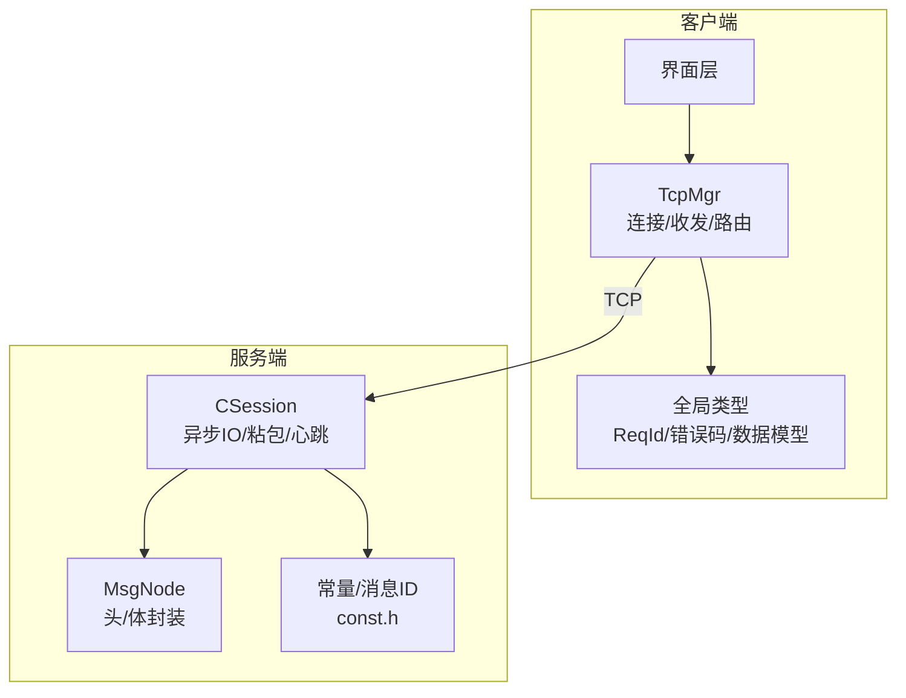
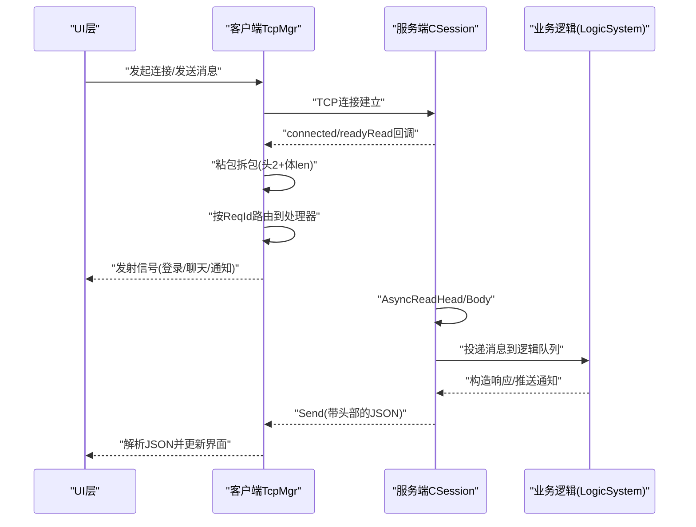
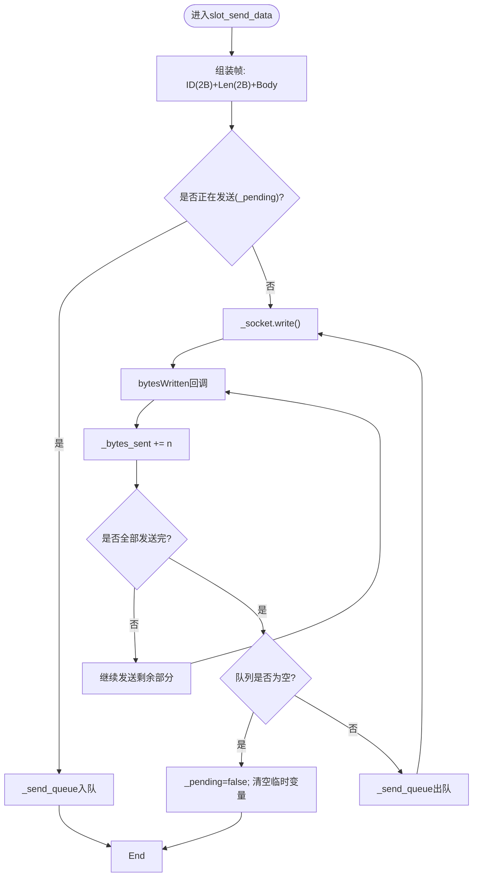
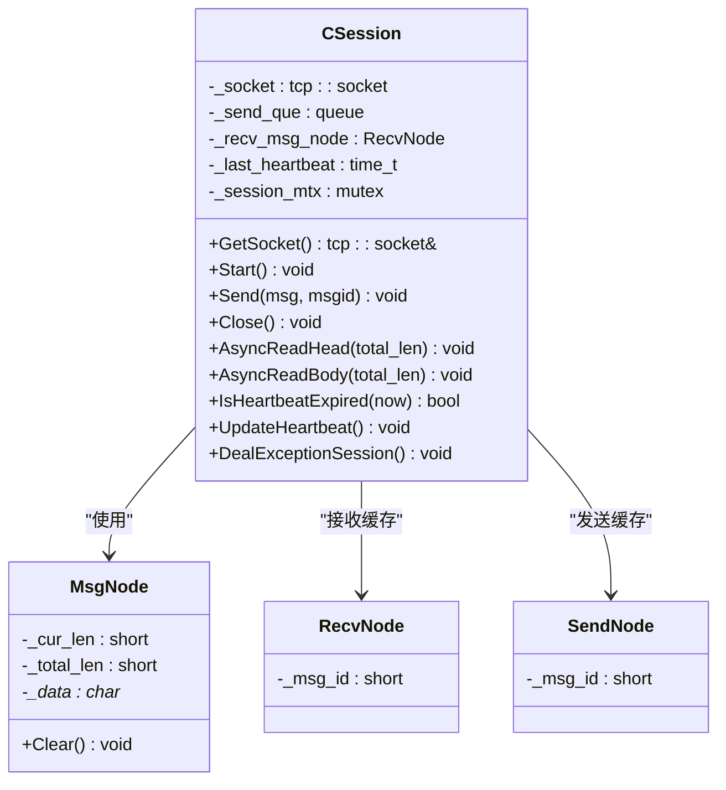
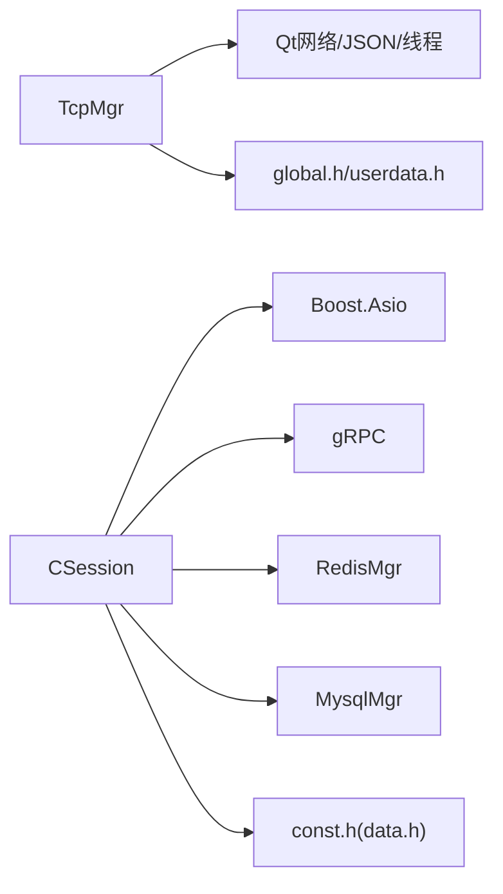

# TCP通信协议

<cite>
**本文引用的文件**   
- [tcpmgr.h](file://client/llfcchat/include/tcpmgr.h)
- [tcpmgr.cpp](file://client/llfcchat/src/tcpmgr.cpp)
- [global.h](file://client/llfcchat/include/global.h)
- [userdata.h](file://client/llfcchat/include/userdata.h)
- [CSession.h](file://server/ChatServer/include/CSession.h)
- [CSession.cpp](file://server/ChatServer/src/CSession.cpp)
- [MsgNode.h](file://server/ChatServer/include/MsgNode.h)
- [MsgNode.cpp](file://server/ChatServer/src/MsgNode.cpp)
- [const.h](file://server/ChatServer/include/const.h)
- [data.h](file://server/ChatServer/include/data.h)
- [day35心跳逻辑.md](file://开发文档/day35心跳逻辑.md)
</cite>

## 目录
1. [简介](#简介)
2. [项目结构](#项目结构)
3. [核心组件](#核心组件)
4. [架构总览](#架构总览)
5. [详细组件分析](#详细组件分析)
6. [依赖关系分析](#依赖关系分析)
7. [性能与优化](#性能与优化)
8. [故障排查指南](#故障排查指南)
9. [结论](#结论)
10. [附录：消息格式与状态码](#附录消息格式与状态码)

## 简介
本文件为 LLFCChat 的 TCP 通信系统提供完整的技术文档，覆盖客户端与服务端的核心实现、消息帧格式、粘包拆包、心跳机制、断线重连、异步 IO、消息路由、连接池与超时控制等。重点解析客户端 TcpManager（TcpMgr）与服务端 CSession 的设计与实现，并给出集成示例与排错建议。

## 项目结构
- 客户端（Qt + QtNetwork）
  - 核心模块：TcpMgr（单例），负责连接管理、发送队列、粘包拆包、消息分发与信号转发。
  - 类型定义：ReqId、错误码、聊天数据结构等位于 global.h 与 userdata.h。
- 服务端（Boost.Asio + gRPC）
  - 会话层：CSession 封装单个 TCP 连接的读写、粘包拆包、心跳更新与异常清理。
  - 消息节点：MsgNode/RecvNode/SendNode 用于头部与体组装、网络字节序转换。
  - 常量与消息ID：const.h 中统一定义 MSG_IDS、ErrorCodes 等。

图表来源
- [tcpmgr.h:22-87](file://client/llfcchat/include/tcpmgr.h#L22-L87)
- [tcpmgr.cpp:1-137](file://client/llfcchat/src/tcpmgr.cpp#L1-L137)
- [CSession.h:28-76](file://server/ChatServer/include/CSession.h#L28-L76)
- [CSession.cpp:1-41](file://server/ChatServer/src/CSession.cpp#L1-L41)
- [MsgNode.h:1-48](file://server/ChatServer/include/MsgNode.h#L1-L48)
- [const.h:1-104](file://server/ChatServer/include/const.h#L1-L104)

章节来源
- [tcpmgr.h:22-87](file://client/llfcchat/include/tcpmgr.h#L22-L87)
- [tcpmgr.cpp:1-137](file://client/llfcchat/src/tcpmgr.cpp#L1-L137)
- [CSession.h:28-76](file://server/ChatServer/include/CSession.h#L28-L76)
- [CSession.cpp:1-41](file://server/ChatServer/src/CSession.cpp#L1-L41)
- [MsgNode.h:1-48](file://server/ChatServer/include/MsgNode.h#L1-L48)
- [const.h:1-104](file://server/ChatServer/include/const.h#L1-L104)

## 核心组件
- 客户端 TcpMgr
  - 职责：建立/关闭连接、发送队列与并发写保护、接收缓冲与粘包拆包、按 ReqId 路由到处理器、向 UI 层发射信号。
  - 关键成员：QTcpSocket、发送队列 _send_queue、当前发送块 _current_block、已发送计数 _bytes_sent、标志 _pending、接收缓冲 _buffer、消息处理器映射 _handlers。
- 服务端 CSession
  - 职责：基于 Boost.Asio 的异步读/写、固定长度头部+变长体粘包处理、心跳时间戳维护、异常连接清理与分布式锁协作。
  - 关键成员：tcp::socket、发送队列 _send_que、互斥 _send_lock、接收节点 _recv_msg_node、头部节点 _recv_head_node、用户UID、心跳时间 _last_heartbeat。

章节来源
- [tcpmgr.h:22-87](file://client/llfcchat/include/tcpmgr.h#L22-L87)
- [tcpmgr.cpp:1044-1079](file://client/llfcchat/src/tcpmgr.cpp#L1044-L1079)
- [CSession.h:28-76](file://server/ChatServer/include/CSession.h#L28-L76)
- [CSession.cpp:43-75](file://server/ChatServer/src/CSession.cpp#L43-L75)

## 架构总览
下图展示客户端与服务端的端到端交互流程，包括连接建立、消息帧封装、异步读写、粘包拆包、心跳与异常处理。

图表来源
- [tcpmgr.cpp:18-55](file://client/llfcchat/src/tcpmgr.cpp#L18-L55)
- [CSession.cpp:130-191](file://server/ChatServer/src/CSession.cpp#L130-L191)
- [CSession.cpp:219-248](file://server/ChatServer/src/CSession.cpp#L219-L248)

## 详细组件分析

### 客户端 TcpMgr 分析
- 连接生命周期
  - 连接成功：触发 connected 信号，向上层返回连接结果。
  - 断开/错误：统一通过 disconnected/error 事件上报，上层可触发重连或提示。
- 发送流程
  - slot_send_data 将 ReqId 与 JSON 数据拼装成“2字节ID + 2字节长度 + 体”的帧。
  - 使用 _send_queue 与 _pending 保证顺序串行写入，避免半包/乱序。
  - bytesWritten 回调推进 _bytes_sent，完成则出队下一帧继续写。
- 接收与粘包拆包
  - readyRead 将所有可读数据追加到 _buffer。
  - 循环解析：先确保有足够字节解析头部（ID+Len），再校验体长度是否齐全，不足则等待。
  - 解析完成后调用 handleMsg 按 ReqId 分发给对应处理器。
- 消息路由
  - initHandlers 注册各 ReqId 对应的处理器，内部解析 JSON 并构造业务对象，再通过信号通知 UI。
- 线程模型
  - TcpThread 将 TcpMgr 移动到独立 QThread，避免阻塞 UI。

图表来源
- [tcpmgr.cpp:1044-1079](file://client/llfcchat/src/tcpmgr.cpp#L1044-L1079)
- [tcpmgr.cpp:103-129](file://client/llfcchat/src/tcpmgr.cpp#L103-L129)

章节来源
- [tcpmgr.cpp:18-55](file://client/llfcchat/src/tcpmgr.cpp#L18-L55)
- [tcpmgr.cpp:1044-1079](file://client/llfcchat/src/tcpmgr.cpp#L1044-L1079)
- [tcpmgr.cpp:103-129](file://client/llfcchat/src/tcpmgr.cpp#L103-L129)
- [tcpmgr.h:22-87](file://client/llfcchat/include/tcpmgr.h#L22-L87)

### 服务端 CSession 分析
- 异步IO与粘包拆包
  - AsyncReadHead：读取固定长度的头部（2字节ID + 2字节长度），进行网络字节序转换与合法性校验。
  - AsyncReadBody：根据头部长度读取完整体，拷贝到 RecvNode，更新心跳时间，投递到 LogicSystem 处理。
  - asyncReadFull/asyncReadLen：递归式读取直到达到目标长度，保证完整帧。
- 发送队列与并发写
  - Send(char*/string, msgid) 将帧压入 _send_que，若队列为空则立即异步写出；否则由 HandleWrite 在回调中依次出队写出。
  - 使用 _send_lock 保护队列操作，避免竞态。
- 心跳机制
  - 每次收到数据（头/体）时更新 _last_heartbeat。
  - IsHeartbeatExpired 判断是否超过阈值（默认20s，实际建议60s）。
  - 服务器侧定时器遍历 Session，对过期连接 Close 并清理资源。
- 异常连接清理
  - DealExceptionSession：获取分布式锁后校验 session_id 一致性，清理 Redis 中的会话、IP、Token 等信息，防止僵尸连接与异地登录冲突。

图表来源
- [CSession.h:28-76](file://server/ChatServer/include/CSession.h#L28-L76)
- [MsgNode.h:1-48](file://server/ChatServer/include/MsgNode.h#L1-L48)

章节来源
- [CSession.cpp:130-191](file://server/ChatServer/src/CSession.cpp#L130-L191)
- [CSession.cpp:219-248](file://server/ChatServer/src/CSession.cpp#L219-L248)
- [CSession.cpp:193-217](file://server/ChatServer/src/CSession.cpp#L193-L217)
- [CSession.cpp:285-333](file://server/ChatServer/src/CSession.cpp#L285-L333)
- [MsgNode.cpp:1-18](file://server/ChatServer/src/MsgNode.cpp#L1-L18)

### 消息帧格式与粘包拆包
- 帧结构
  - 头部：2字节消息ID（网络字节序）+ 2字节消息体长度（网络字节序）。
  - 体：JSON 字符串（UTF-8）。
- 客户端
  - 使用 QDataStream 设置 BigEndian 写入 ID 与 Len，随后拼接 JSON 体。
  - 接收时循环检查缓冲区是否满足头/体长度，不足则等待。
- 服务端
  - 使用 boost::asio 的 async_read_some 递归读取至 HEAD_TOTAL_LEN，再按长度读取体。
  - 发送时将 ID/Len 转为网络字节序，拼接体后一次性写出。

章节来源
- [tcpmgr.cpp:1044-1079](file://client/llfcchat/src/tcpmgr.cpp#L1044-L1079)
- [CSession.cpp:130-191](file://server/ChatServer/src/CSession.cpp#L130-L191)
- [MsgNode.cpp:8-17](file://server/ChatServer/src/MsgNode.cpp#L8-L17)
- [const.h:38-44](file://server/ChatServer/include/const.h#L38-L44)

### 心跳机制与断线重连
- 客户端
  - 定时发送 ID_HEART_BEAT_REQ（含 fromuid），收到 ID_HEARTBEAT_RSP 视为存活。
  - 连接断开或错误时发出 sig_connection_closed，上层可触发重连或提示。
- 服务端
  - 每次收到数据更新 _last_heartbeat；定时器周期检测 IsHeartbeatExpired，超期则 Close 并清理。
  - 异常清理使用分布式锁保证多进程安全，清理 Redis 会话/IP/Token。
- 重连策略（建议）
  - 客户端在断开后指数退避重试，失败次数上限与最大间隔可配置。
  - 重连前清理本地未确认发送队列，必要时重新登录。

章节来源
- [tcpmgr.cpp:584-612](file://client/llfcchat/src/tcpmgr.cpp#L584-L612)
- [tcpmgr.cpp:94-98](file://client/llfcchat/src/tcpmgr.cpp#L94-L98)
- [CSession.cpp:285-333](file://server/ChatServer/src/CSession.cpp#L285-L333)
- [day35心跳逻辑.md:272-316](file://开发文档/day35心跳逻辑.md#L272-L316)

### 消息路由与业务处理
- 客户端
  - _handlers 以 ReqId 为键，存储 lambda 处理器；handleMsg 查找并执行。
  - 典型处理器：登录、搜索、好友申请/认证、文本/图片聊天、离线通知、心跳等。
- 服务端
  - LogicSystem 注册各 MSG_IDS 的处理函数，CSession 将 RecvNode 投递到队列，由业务线程处理并回写。

章节来源
- [tcpmgr.cpp:182-987](file://client/llfcchat/src/tcpmgr.cpp#L182-L987)
- [CSession.cpp:117-128](file://server/ChatServer/src/CSession.cpp#L117-L128)

### 连接池与超时控制
- 服务端数据库连接池（MysqlDao）
  - 后台线程定期检测连接健康度，失败则重建连接，保证可用性。
- 客户端发送超时
  - 可在 bytesWritten 回调中增加累计超时判定，超时则触发重连或告警。
- 网络层超时
  - QTcpSocket 的 connect 超时可通过 QTimer 辅助实现；read/write 超时可由应用层计时器监控。

章节来源
- [MysqlDao.h:102-160](file://server/ChatServer/include/MysqlDao.h#L102-L160)

## 依赖关系分析
- 客户端
  - TcpMgr 依赖 Qt 网络模块、QJson、QThread、QQueue。
  - 业务数据模型集中在 global.h 与 userdata.h。
- 服务端
  - CSession 依赖 Boost.Asio、gRPC、Redis 管理器、MySQL 管理器。
  - 常量与消息ID集中定义于 const.h，数据模型在 data.h。

图表来源
- [tcpmgr.h:22-87](file://client/llfcchat/include/tcpmgr.h#L22-L87)
- [global.h:43-88](file://client/llfcchat/include/global.h#L43-L88)
- [CSession.h:28-76](file://server/ChatServer/include/CSession.h#L28-L76)
- [const.h:49-79](file://server/ChatServer/include/const.h#L49-L79)

章节来源
- [tcpmgr.h:22-87](file://client/llfcchat/include/tcpmgr.h#L22-L87)
- [global.h:43-88](file://client/llfcchat/include/global.h#L43-L88)
- [CSession.h:28-76](file://server/ChatServer/include/CSession.h#L28-L76)
- [const.h:49-79](file://server/ChatServer/include/const.h#L49-L79)

## 性能与优化
- 粘包拆包
  - 客户端使用循环解析与最小化内存拷贝（mid/remove）提升吞吐。
  - 服务端采用固定缓冲与递归读取，减少分配开销。
- 发送队列
  - 客户端 _send_queue 与 _pending 保障顺序写；服务端 _send_que 配合 HandleWrite 串行输出。
- 心跳与空闲检测
  - 服务端定时器批量检测，避免频繁加锁；客户端10s心跳保持中间设备活跃。
- I/O 模型
  - 客户端基于 Qt 事件循环，服务端基于 Asio 异步 IO，均避免阻塞。
- 连接池
  - MySQL 连接池后台健康检查与自动重连，降低连接抖动影响。

[本节为通用指导，不直接分析具体文件]

## 故障排查指南
- 常见问题
  - 粘包/半包：检查头部长度字段是否正确、网络字节序转换是否一致。
  - 连接中断：查看 error/disconnected 信号，确认心跳是否按时发送。
  - 消息丢失：检查发送队列是否被清空、HandleWrite 是否出错。
  - 死锁风险：确保分布式锁与线程锁顺序一致，参考心跳文档中的改造方案。
- 定位方法
  - 打印帧内容（ID/Len/Body）与发送/接收计数。
  - 观察 _pending/_bytes_sent 与 _send_queue 长度变化。
  - 服务端日志关注 read length not match、handle write failed 等。

章节来源
- [tcpmgr.cpp:64-91](file://client/llfcchat/src/tcpmgr.cpp#L64-L91)
- [CSession.cpp:193-217](file://server/ChatServer/src/CSession.cpp#L193-L217)
- [day35心跳逻辑.md:367-416](file://开发文档/day35心跳逻辑.md#L367-L416)

## 结论
LLFCChat 的 TCP 通信子系统以简洁可靠的帧格式与稳定的异步 IO 为核心，结合心跳与异常清理机制，实现了高可用的长连接通信。客户端 TcpMgr 与服务端 CSession 分工明确，消息路由清晰，具备可扩展性。建议在重连策略、超时控制与监控方面进一步完善，以提升整体鲁棒性与可观测性。

[本节为总结，不直接分析具体文件]

## 附录：消息格式与状态码
- 帧格式
  - 头部：2字节消息ID（网络字节序）+ 2字节消息体长度（网络字节序）。
  - 体：JSON 字符串，包含业务字段与 error 状态码。
- 常用消息ID（部分）
  - 登录：MSG_CHAT_LOGIN / MSG_CHAT_LOGIN_RSP
  - 搜索：ID_SEARCH_USER_REQ / ID_SEARCH_USER_RSP
  - 好友：ID_ADD_FRIEND_REQ/RSP、ID_NOTIFY_ADD_FRIEND_REQ
  - 认证：ID_AUTH_FRIEND_REQ/RSP、ID_NOTIFY_AUTH_FRIEND_REQ
  - 聊天：ID_TEXT_CHAT_MSG_REQ/RSP、ID_NOTIFY_TEXT_CHAT_MSG_REQ
  - 图片：ID_IMG_CHAT_MSG_REQ/RSP、ID_NOTIFY_IMG_CHAT_MSG_REQ
  - 心跳：ID_HEART_BEAT_REQ / ID_HEARTBEAT_RSP
  - 线程/消息加载：ID_LOAD_CHAT_THREAD_REQ/RSP、ID_CREATE_PRIVATE_CHAT_REQ/RSP、ID_LOAD_CHAT_MSG_REQ/RSP
- 错误码（节选）
  - Success=0、Error_Json=1001、RPCFailed=1002、TokenInvalid=1010、UidInvalid=1011、LOAD_CHAT_FAILED=1013 等。
- 消息状态
  - UN_READ=0、SEND_FAILED=1、READED=2、UN_UPLOAD=3。

章节来源
- [const.h:49-79](file://server/ChatServer/include/const.h#L49-L79)
- [const.h:5-20](file://server/ChatServer/include/const.h#L5-L20)
- [const.h:96-101](file://server/ChatServer/include/const.h#L96-L101)
- [global.h:43-88](file://client/llfcchat/include/global.h#L43-L88)
- [global.h:91-95](file://client/llfcchat/include/global.h#L91-L95)
- [global.h:257-262](file://client/llfcchat/include/global.h#L257-L262)