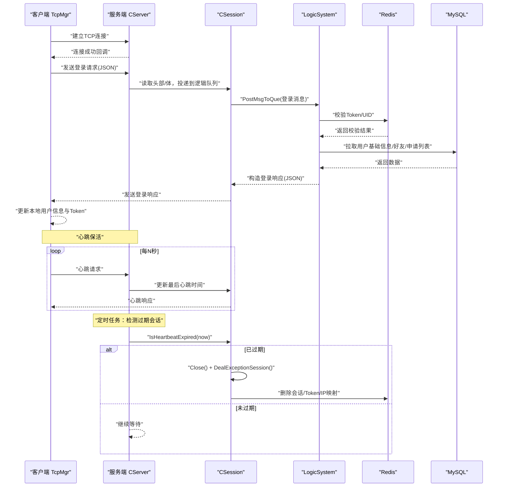
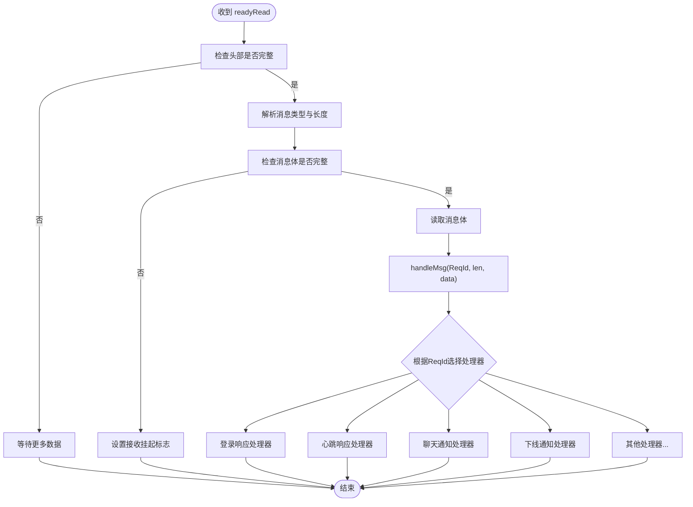
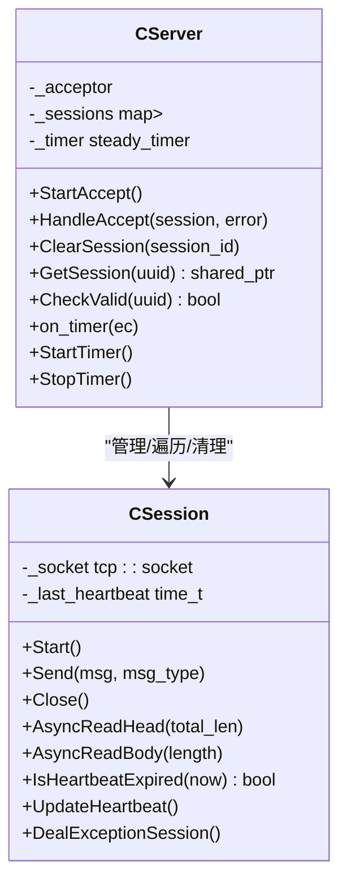
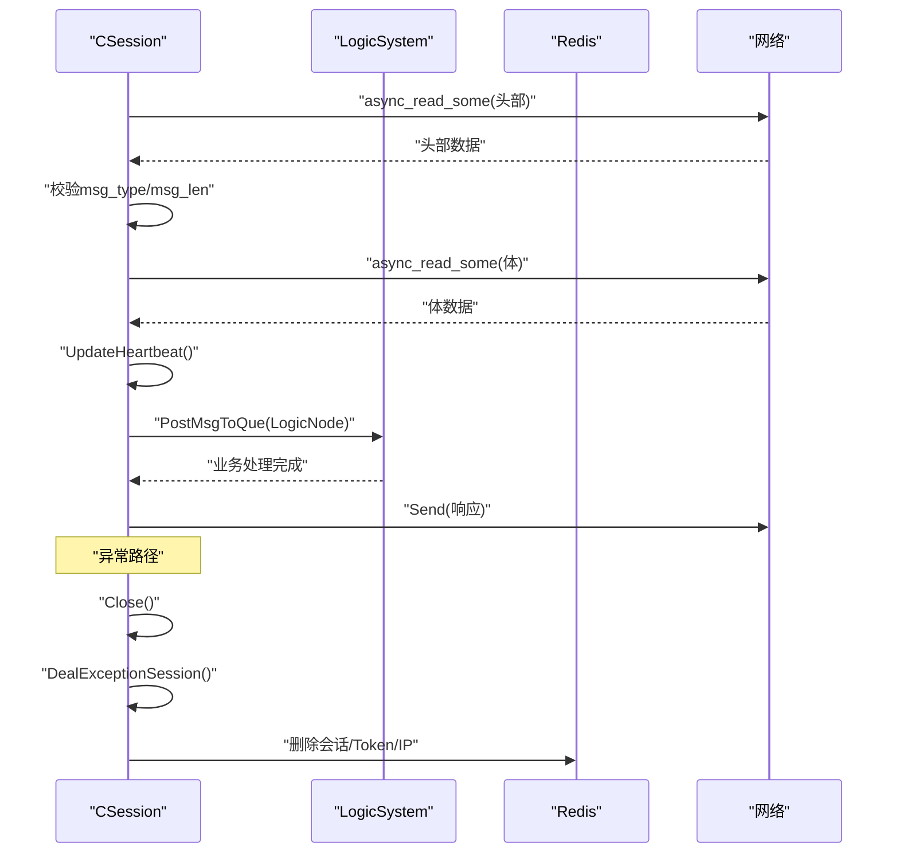
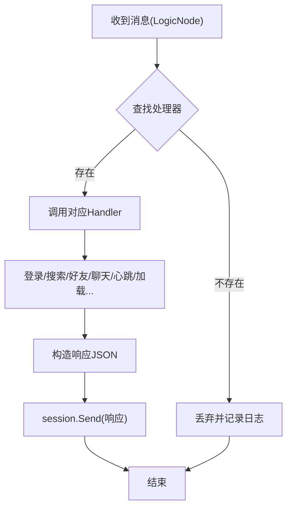
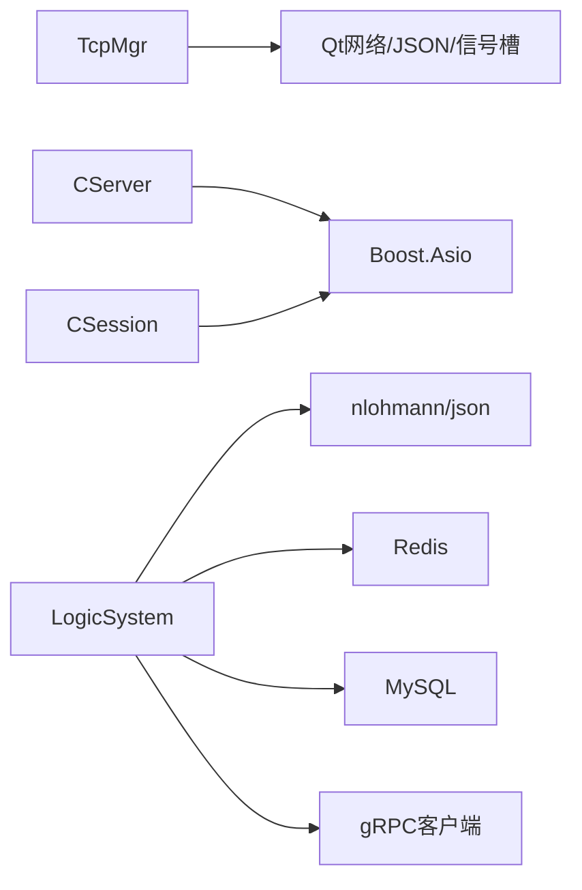
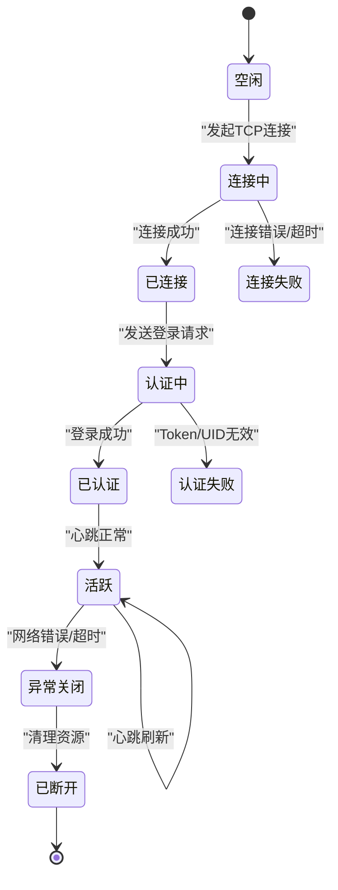

# 会话生命周期管理

<cite>
**本文引用的文件**   
- [tcpmgr.h](file://client/llfcchat/include/tcpmgr.h)
- [tcpmgr.cpp](file://client/llfcchat/src/tcpmgr.cpp)
- [CSession.h](file://server/ChatServer/include/CSession.h)
- [CSession.cpp](file://server/ChatServer/src/CSession.cpp)
- [CServer.h](file://server/ChatServer/include/CServer.h)
- [CServer.cpp](file://server/ChatServer/src/CServer.cpp)
- [LogicSystem.h](file://server/ChatServer/include/LogicSystem.h)
- [LogicSystem.cpp](file://server/ChatServer/src/LogicSystem.cpp)
- [const.h](file://server/ChatServer/include/const.h)
- [data.h](file://server/ChatServer/include/data.h)
- [global.h](file://client/llfcchat/include/global.h)
- [chat.proto](file://proto/chat_service/chat.proto)
</cite>

## 目录
1. [简介](#简介)
2. [项目结构](#项目结构)
3. [核心组件](#核心组件)
4. [架构总览](#架构总览)
5. [详细组件分析](#详细组件分析)
6. [依赖关系分析](#依赖关系分析)
7. [性能考量](#性能考量)
8. [故障排查指南](#故障排查指南)
9. [结论](#结论)
10. [附录](#附录)

## 简介
本文件面向LLFCChat的TCP会话生命周期管理，覆盖客户端与服务端在连接建立、认证登录、活跃状态维护（心跳与超时）、异常关闭、用户身份绑定、会话状态同步、多设备支持、资源清理等全流程。文档同时给出会话状态机设计与事件处理机制的实现示例，涵盖登录验证、权限检查、会话迁移（踢人）等关键场景。

## 项目结构
- 客户端使用Qt网络模块实现TCP收发、粘包处理、消息分发与UI信号桥接；服务端基于Boost.Asio实现高并发异步I/O、会话管理与逻辑处理队列。
- 协议层采用自定义二进制头+JSON体格式，跨进程通过gRPC进行服务间通知（如好友申请、聊天消息、图片通知、踢人）。

```mermaid
graph TB
subgraph "客户端"
UI["界面层"]
TCPMgr["TcpMgr<br/>连接/收发/解析/信号"]
end
subgraph "服务端"
CServer["CServer<br/>监听/接受/定时器"]
CSession["CSession<br/>读写/心跳/异常处理"]
Logic["LogicSystem<br/>消息路由/业务处理"]
Redis["Redis<br/>Token/IP/Session映射"]
DB["MySQL<br/>用户/好友/聊天记录"]
end
UI --> TCPMgr
TCPMgr < --> |TCP 二进制头+JSON体| CServer
CServer --> CSession
CSession --> Logic
Logic --> Redis
Logic --> DB
Logic --> |"gRPC 通知"| CServer
```

**图示来源** 
- [tcpmgr.h:22-87](file://client/llfcchat/include/tcpmgr.h#L22-L87)
- [CServer.h:10-37](file://server/ChatServer/include/CServer.h#L10-L37)
- [CSession.h:28-76](file://server/ChatServer/include/CSession.h#L28-L76)
- [LogicSystem.h:17-58](file://server/ChatServer/include/LogicSystem.h#L17-L58)

**章节来源**
- [tcpmgr.h:22-87](file://client/llfcchat/include/tcpmgr.h#L22-L87)
- [CServer.h:10-37](file://server/ChatServer/include/CServer.h#L10-L37)
- [CSession.h:28-76](file://server/ChatServer/include/CSession.h#L28-L76)
- [LogicSystem.h:17-58](file://server/ChatServer/include/LogicSystem.h#L17-L58)

## 核心组件
- 客户端 TcpMgr：封装QTcpSocket，负责连接、粘包解析、发送队列、错误处理、消息分发到业务信号。
- 服务端 CServer：Asio I/O上下文、Accept循环、会话集合管理、定时心跳检测与过期清理。
- 服务端 CSession：单连接读写、头部/体解析、心跳时间戳更新、异常会话清理、离线通知。
- 服务端 LogicSystem：消息队列+工作线程，按MSG_TYPE路由到具体处理器（登录、搜索、好友、聊天、心跳、加载聊天等）。
- 常量与数据结构：统一的消息ID、错误码、键前缀、消息类型等。

**章节来源**
- [tcpmgr.cpp:1-137](file://client/llfcchat/src/tcpmgr.cpp#L1-L137)
- [CServer.cpp:8-38](file://server/ChatServer/src/CServer.cpp#L8-L38)
- [CSession.cpp:10-41](file://server/ChatServer/src/CSession.cpp#L10-L41)
- [LogicSystem.cpp:16-40](file://server/ChatServer/src/LogicSystem.cpp#L16-L40)
- [const.h:49-79](file://server/ChatServer/include/const.h#L49-L79)
- [global.h:43-88](file://client/llfcchat/include/global.h#L43-L88)

## 架构总览
下图展示从客户端发起登录到服务端校验并返回结果的完整调用链，以及后续的心跳维持与异常清理流程。



**图示来源** 
- [tcpmgr.cpp:12-136](file://client/llfcchat/src/tcpmgr.cpp#L12-L136)
- [CSession.cpp:130-191](file://server/ChatServer/src/CSession.cpp#L130-L191)
- [LogicSystem.cpp:116-252](file://server/ChatServer/src/LogicSystem.cpp#L116-L252)
- [CServer.cpp:75-118](file://server/ChatServer/src/CServer.cpp#L75-L118)

## 详细组件分析

### 客户端 TcpMgr：连接、解析、发送与事件分发
- 连接与错误处理：
  - 连接成功、错误、断开分别触发信号，供上层UI或业务订阅。
  - 错误分支包含拒绝、远程关闭、主机未找到、超时、网络错误等。
- 接收与粘包处理：
  - 使用缓冲区累积数据，先读固定长度头部（消息类型+长度），再按长度读取体。
  - 解析后调用handleMsg按ReqId分派到对应处理器。
- 发送队列与流控：
  - bytesWritten回调驱动队列出队，避免阻塞写操作。
- 消息处理器：
  - 登录响应、搜索、好友申请/认证、文本聊天、离线通知、心跳、聊天线程/消息加载、图片消息等均有独立处理器。
  - 登录成功后更新UserMgr中的用户信息与Token，并触发界面切换。



**图示来源** 
- [tcpmgr.cpp:18-55](file://client/llfcchat/src/tcpmgr.cpp#L18-L55)
- [tcpmgr.cpp:182-234](file://client/llfcchat/src/tcpmgr.cpp#L182-L234)
- [tcpmgr.cpp:584-612](file://client/llfcchat/src/tcpmgr.cpp#L584-L612)
- [tcpmgr.cpp:550-582](file://client/llfcchat/src/tcpmgr.cpp#L550-L582)

**章节来源**
- [tcpmgr.cpp:1-137](file://client/llfcchat/src/tcpmgr.cpp#L1-L137)
- [tcpmgr.cpp:182-234](file://client/llfcchat/src/tcpmgr.cpp#L182-L234)
- [tcpmgr.cpp:584-612](file://client/llfcchat/src/tcpmgr.cpp#L584-L612)
- [tcpmgr.cpp:550-582](file://client/llfcchat/src/tcpmgr.cpp#L550-L582)

### 服务端 CServer：会话管理与心跳定时
- Accept循环：
  - 新连接创建CSession并启动读取头部。
  - 将session加入全局map，键为session_id。
- 会话清理：
  - ClearSession移除session并从UserMgr解绑uid-session。
- 心跳定时：
  - 每60s遍历所有session，调用IsHeartbeatExpired判断是否超过阈值（默认20s无活动即认为过期）。
  - 对过期会话执行Close与DealExceptionSession，并统计在线数写入Redis。



**图示来源** 
- [CServer.h:10-37](file://server/ChatServer/include/CServer.h#L10-L37)
- [CServer.cpp:21-38](file://server/ChatServer/src/CServer.cpp#L21-L38)
- [CServer.cpp:75-118](file://server/ChatServer/src/CServer.cpp#L75-L118)
- [CSession.h:28-76](file://server/ChatServer/include/CSession.h#L28-L76)
- [CSession.cpp:285-299](file://server/ChatServer/src/CSession.cpp#L285-L299)

**章节来源**
- [CServer.cpp:8-38](file://server/ChatServer/src/CServer.cpp#L8-L38)
- [CServer.cpp:75-118](file://server/ChatServer/src/CServer.cpp#L75-L118)
- [CSession.cpp:285-299](file://server/ChatServer/src/CSession.cpp#L285-L299)

### 服务端 CSession：读写、心跳与异常处理
- 异步读写：
  - AsyncReadHead读取固定长度头部，校验msg_type/msg_len合法性后分配RecvNode并进入AsyncReadBody。
  - AsyncReadBody累计读取至完整体，更新心跳时间，投递到LogicSystem队列，然后继续监听下一个头部。
- 发送队列：
  - Send将消息入队，若队列为空则立即开始async_write，完成后弹出并继续下一项。
- 异常处理：
  - 读失败或长度不匹配时Close并调用DealExceptionSession。
  - DealExceptionSession使用分布式锁保护，清理Redis中会话、IP、Token映射，确保多实例一致性。



**图示来源** 
- [CSession.cpp:130-191](file://server/ChatServer/src/CSession.cpp#L130-L191)
- [CSession.cpp:219-248](file://server/ChatServer/src/CSession.cpp#L219-L248)
- [CSession.cpp:295-333](file://server/ChatServer/src/CSession.cpp#L295-L333)

**章节来源**
- [CSession.cpp:130-191](file://server/ChatServer/src/CSession.cpp#L130-L191)
- [CSession.cpp:219-248](file://server/ChatServer/src/CSession.cpp#L219-L248)
- [CSession.cpp:295-333](file://server/ChatServer/src/CSession.cpp#L295-L333)

### 服务端 LogicSystem：消息路由与业务处理
- 注册回调：
  - 登录、搜索、好友申请/认证、文本聊天、心跳、加载聊天线程/消息、图片聊天等处理器均通过RegisterCallBacks注册。
- 登录处理：
  - 校验Token有效性，拉取用户基础信息、好友列表、申请列表，绑定session与uid，记录登录IP与服务器名，必要时踢掉旧连接（同服直接通知并清理，跨服通过gRPC踢人）。
- 聊天处理：
  - 文本聊天持久化后回复发送方，并通知接收方（同服直接发送，跨服通过gRPC转发）。
- 心跳处理：
  - 简单回包，保持连接活跃。



**图示来源** 
- [LogicSystem.cpp:83-114](file://server/ChatServer/src/LogicSystem.cpp#L83-L114)
- [LogicSystem.cpp:116-252](file://server/ChatServer/src/LogicSystem.cpp#L116-L252)
- [LogicSystem.cpp:472-566](file://server/ChatServer/src/LogicSystem.cpp#L472-L566)
- [LogicSystem.cpp:568-575](file://server/ChatServer/src/LogicSystem.cpp#L568-L575)

**章节来源**
- [LogicSystem.cpp:83-114](file://server/ChatServer/src/LogicSystem.cpp#L83-L114)
- [LogicSystem.cpp:116-252](file://server/ChatServer/src/LogicSystem.cpp#L116-L252)
- [LogicSystem.cpp:472-566](file://server/ChatServer/src/LogicSystem.cpp#L472-L566)
- [LogicSystem.cpp:568-575](file://server/ChatServer/src/LogicSystem.cpp#L568-L575)

### 协议与数据结构
- 消息类型与错误码：
  - 统一在const.h定义，包括登录、搜索、好友、聊天、心跳、加载聊天、图片消息等。
- 客户端ReqId：
  - global.h中与服务器MSG_TYPES保持一致，用于客户端侧消息分发。
- gRPC接口：
  - chat.proto定义了跨服务通知接口（好友申请、认证、文本聊天、图片通知、踢人）。

**章节来源**
- [const.h:49-79](file://server/ChatServer/include/const.h#L49-L79)
- [global.h:43-88](file://client/llfcchat/include/global.h#L43-L88)
- [chat.proto:6-12](file://proto/chat_service/chat.proto#L6-L12)
- [chat.proto:14-104](file://proto/chat_service/chat.proto#L14-L104)

## 依赖关系分析
- 客户端依赖：
  - QTcpSocket、QJsonDocument、QQueue、QThread、QObject信号槽。
- 服务端依赖：
  - Boost.Asio（网络与定时器）、nlohmann/json（JSON解析）、Redis（缓存与会话映射）、MySQL（持久化）、gRPC（跨服务通信）。
- 耦合与内聚：
  - CSession低耦合于CServer，通过接口方法交互；LogicSystem通过回调表解耦不同业务处理器。
  - 客户端TcpMgr通过信号与UI解耦，便于扩展新的消息类型。



**图示来源** 
- [tcpmgr.h:22-87](file://client/llfcchat/include/tcpmgr.h#L22-L87)
- [CServer.h:10-37](file://server/ChatServer/include/CServer.h#L10-L37)
- [CSession.h:28-76](file://server/ChatServer/include/CSession.h#L28-L76)
- [LogicSystem.h:17-58](file://server/ChatServer/include/LogicSystem.h#L17-L58)

**章节来源**
- [tcpmgr.h:22-87](file://client/llfcchat/include/tcpmgr.h#L22-L87)
- [CServer.h:10-37](file://server/ChatServer/include/CServer.h#L10-L37)
- [CSession.h:28-76](file://server/ChatServer/include/CSession.h#L28-L76)
- [LogicSystem.h:17-58](file://server/ChatServer/include/LogicSystem.h#L17-L58)

## 性能考量
- 客户端：
  - 发送队列避免阻塞写，bytesWritten回调驱动顺序发送，减少内存拷贝。
  - 粘包解析使用一次性缓冲与QDataStream，注意频繁创建stream的性能开销（当前实现每次头部解析都新建stream）。
- 服务端：
  - Asio异步读写提升吞吐；发送队列限制最大长度防止内存膨胀。
  - 心跳定时周期60s，会话超时阈值20s，平衡保活与资源占用。
  - 分布式锁保护异常清理，避免竞态条件。
- 建议优化：
  - 客户端可复用QDataStream对象以减少构造开销。
  - 服务端可考虑批量写入与零拷贝策略，降低序列化成本。
  - 心跳间隔与超时可根据网络质量动态调整。

[本节为通用指导，不直接分析具体文件]

## 故障排查指南
- 连接失败：
  - 检查客户端错误分支（拒绝、主机未找到、超时、网络错误），确认网关/聊天服务器地址与端口配置。
- 登录失败：
  - 查看登录响应error字段，常见为Token无效或UID无效；检查Redis中Token是否存在且匹配。
- 心跳超时：
  - 确认客户端是否定期发送心跳请求；服务端IsHeartbeatExpired阈值是否合理。
- 异常关闭：
  - 关注CSession异常路径（读失败、长度不匹配），检查DealExceptionSession是否正确清理Redis映射。
- 多设备冲突：
  - 登录时若检测到同用户已在别处登录，应触发踢人流程；检查同服直接通知与跨服gRPC踢人是否生效。

**章节来源**
- [tcpmgr.cpp:64-91](file://client/llfcchat/src/tcpmgr.cpp#L64-L91)
- [tcpmgr.cpp:182-234](file://client/llfcchat/src/tcpmgr.cpp#L182-L234)
- [CSession.cpp:130-191](file://server/ChatServer/src/CSession.cpp#L130-L191)
- [CSession.cpp:295-333](file://server/ChatServer/src/CSession.cpp#L295-L333)
- [LogicSystem.cpp:116-252](file://server/ChatServer/src/LogicSystem.cpp#L116-L252)

## 结论
LLFCChat的TCP会话生命周期管理通过客户端TcpMgr与服务端CServer/CSession/LogicSystem协同，实现了可靠的连接建立、认证登录、心跳保活、异常清理与多设备支持。借助Redis与分布式锁保证状态一致性，gRPC支撑跨服务通知。整体设计清晰、可扩展性强，适合大规模即时通讯场景。

[本节为总结性内容，不直接分析具体文件]

## 附录

### 会话状态机设计


[本图为概念性状态机，不直接映射具体代码文件]

### 关键事件处理示例
- 登录验证：
  - 客户端发送登录请求，服务端校验Token并返回用户信息与好友/申请列表。
- 权限检查：
  - 登录前后校验Token有效性，非法则拒绝并提示错误。
- 会话迁移（踢人）：
  - 同服直接通知旧连接下线并清理；跨服通过gRPC通知目标服务器踢人。

**章节来源**
- [LogicSystem.cpp:116-252](file://server/ChatServer/src/LogicSystem.cpp#L116-L252)
- [chat.proto:6-12](file://proto/chat_service/chat.proto#L6-L12)