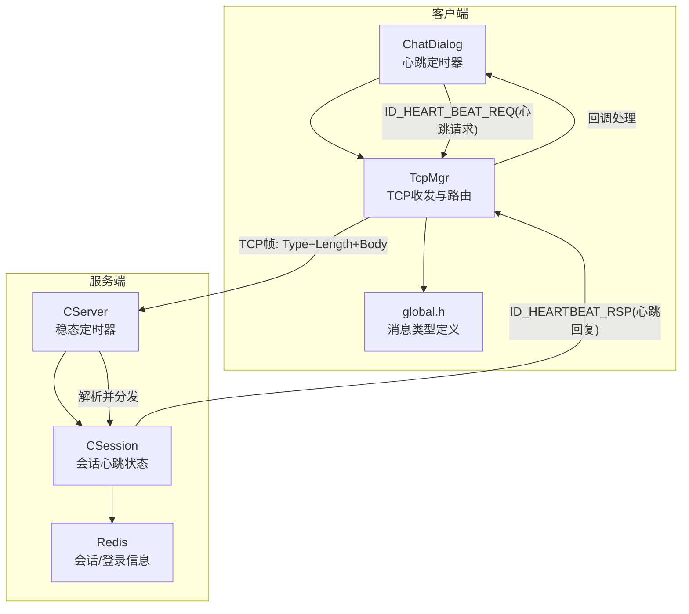
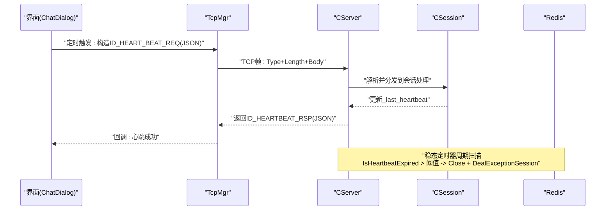
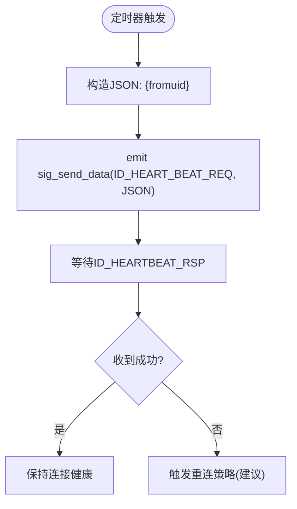
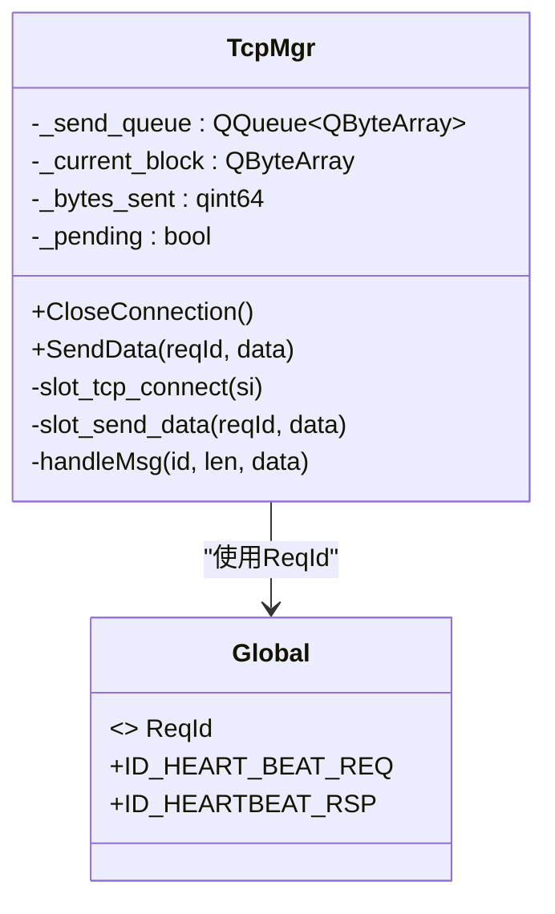
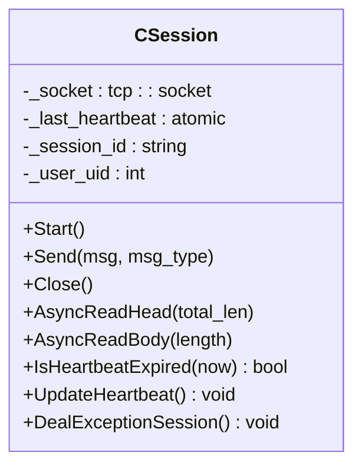
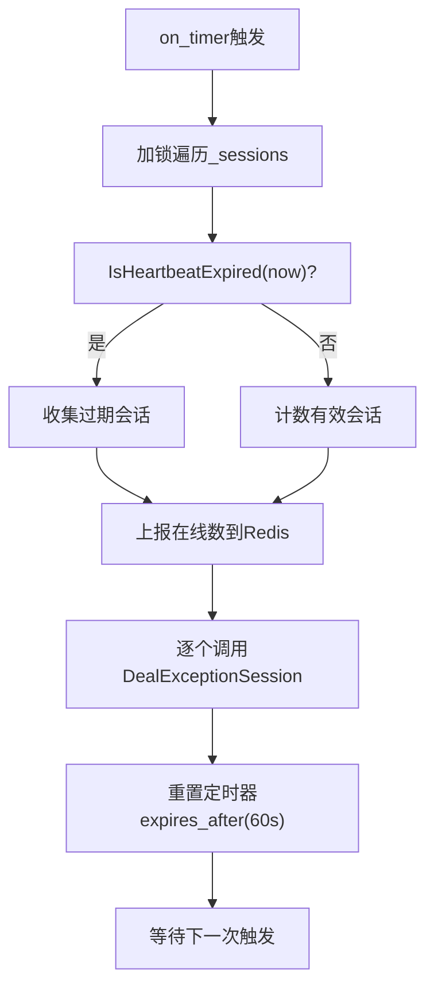
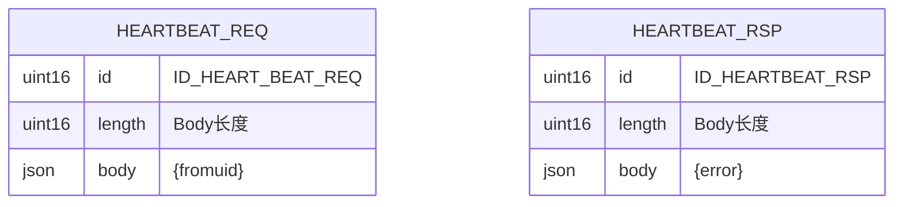
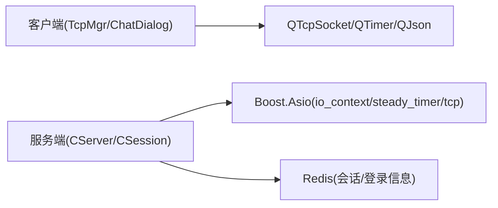

# 心跳机制

<cite>
**本文引用的文件**   
- [CSession.h](file://server/ChatServer/include/CSession.h)
- [CSession.cpp](file://server/ChatServer/src/CSession.cpp)
- [CServer.h](file://server/ChatServer/include/CServer.h)
- [global.h](file://client/llfcchat/include/global.h)
- [tcpmgr.h](file://client/llfcchat/include/tcpmgr.h)
- [tcpmgr.cpp](file://client/llfcchat/src/tcpmgr.cpp)
- [chatdialog.h](file://client/llfcchat/include/chatdialog.h)
- [day35心跳逻辑.md](file://开发文档/day35心跳逻辑.md)
</cite>

## 目录
1. [简介](#简介)
2. [项目结构](#项目结构)
3. [核心组件](#核心组件)
4. [架构总览](#架构总览)
5. [详细组件分析](#详细组件分析)
6. [依赖关系分析](#依赖关系分析)
7. [性能考量](#性能考量)
8. [故障排查指南](#故障排查指南)
9. [结论](#结论)
10. [附录：关键实现与示例路径](#附录关键实现与示例路径)

## 简介
本文件系统化梳理 LLFCChat 的 TCP 心跳机制，覆盖协议格式、客户端定时器管理、服务端检测与断线识别、失败处理与自动重连触发思路、以及网络质量监控建议。内容基于仓库中的 C++ 客户端与服务端代码及开发文档进行归纳与可视化说明，便于不同技术背景的读者理解与落地。

## 项目结构
- 客户端（Qt）负责周期性发送心跳请求，并在收到心跳回复后更新连接健康状态；同时提供统一的 TCP 收发封装与消息路由。
- 服务端（Boost.Asio）维护每个会话的最后活跃时间戳，周期扫描并判定是否过期，对过期会话执行清理与分布式锁保护下的资源释放。

**图示来源** 
- [CServer.h:1-39](file://server/ChatServer/include/CServer.h#L1-L39)
- [CSession.h:1-86](file://server/ChatServer/include/CSession.h#L1-L86)
- [CSession.cpp:1-335](file://server/ChatServer/src/CSession.cpp#L1-L335)
- [global.h:43-88](file://client/llfcchat/include/global.h#L43-L88)
- [tcpmgr.cpp:1-1094](file://client/llfcchat/src/tcpmgr.cpp#L1-L1094)

**章节来源**
- [CServer.h:1-39](file://server/ChatServer/include/CServer.h#L1-L39)
- [CSession.h:1-86](file://server/ChatServer/include/CSession.h#L1-L86)
- [CSession.cpp:1-335](file://server/ChatServer/src/CSession.cpp#L1-L335)
- [global.h:43-88](file://client/llfcchat/include/global.h#L43-L88)
- [tcpmgr.cpp:1-1094](file://client/llfcchat/src/tcpmgr.cpp#L1-L1094)

## 核心组件
- 客户端
  - ChatDialog：创建并管理 QTimer，按固定间隔构造心跳请求 JSON，通过 TcpMgr 发送。
  - TcpMgr：统一封装 QTcpSocket 的读写、粘包处理、消息路由；注册 ID_HEARTBEAT_RSP 处理器用于确认心跳成功。
  - global.h：统一定义 ReqId，包括 ID_HEART_BEAT_REQ 与 ID_HEARTBEAT_RSP。
- 服务端
  - CServer：持有 steady_timer，周期性遍历会话集合，调用 IsHeartbeatExpired 判断是否超时。
  - CSession：维护 _last_heartbeat 原子时间戳，在每次读取数据时更新；提供过期判断与异常会话清理接口。

**章节来源**
- [chatdialog.h:1-98](file://client/llfcchat/include/chatdialog.h#L1-L98)
- [tcpmgr.h:1-90](file://client/llfcchat/include/tcpmgr.h#L1-L90)
- [tcpmgr.cpp:1-1094](file://client/llfcchat/src/tcpmgr.cpp#L1-L1094)
- [global.h:43-88](file://client/llfcchat/include/global.h#L43-L88)
- [CServer.h:1-39](file://server/ChatServer/include/CServer.h#L1-L39)
- [CSession.h:1-86](file://server/ChatServer/include/CSession.h#L1-L86)
- [CSession.cpp:1-335](file://server/ChatServer/src/CSession.cpp#L1-L335)

## 架构总览
心跳流程由客户端定时触发，经 TCP 帧到达服务端，服务端根据最后活跃时间判断连接存活，并返回心跳响应。若长时间无响应或网络错误，客户端应触发重连策略；服务端侧则通过稳态定时器主动清理僵尸会话。

**图示来源** 
- [tcpmgr.cpp:1-1094](file://client/llfcchat/src/tcpmgr.cpp#L1-L1094)
- [CSession.cpp:1-335](file://server/ChatServer/src/CSession.cpp#L1-L335)
- [CServer.h:1-39](file://server/ChatServer/include/CServer.h#L1-L39)

## 详细组件分析

### 客户端心跳定时器管理（ChatDialog）
- 使用 QTimer 周期性触发，间隔为 10 秒（可配置）。
- 每次触发构造包含 fromuid 的 JSON 作为心跳请求体，通过信号发送到 TcpMgr。
- 析构时停止定时器，避免资源泄漏。

**图示来源** 
- [chatdialog.h:1-98](file://client/llfcchat/include/chatdialog.h#L1-L98)
- [tcpmgr.cpp:1-1094](file://client/llfcchat/src/tcpmgr.cpp#L1-L1094)

**章节来源**
- [chatdialog.h:1-98](file://client/llfcchat/include/chatdialog.h#L1-L98)
- [tcpmgr.cpp:1-1094](file://client/llfcchat/src/tcpmgr.cpp#L1-L1094)

### 客户端 TCP 收发与消息路由（TcpMgr）
- 接收 readyRead 事件，循环解析头部（类型、Length），再读取 Body，调用 handleMsg 分发给对应处理器。
- 注册 ID_HEARTBEAT_RSP 处理器，校验 error 字段，记录成功日志。
- 发送端将 Type 与 Length 以网络字节序写入，随后追加 Body，采用队列与 bytesWritten 回调保证顺序与完整性。

**图示来源** 
- [tcpmgr.h:1-90](file://client/llfcchat/include/tcpmgr.h#L1-L90)
- [tcpmgr.cpp:1-1094](file://client/llfcchat/src/tcpmgr.cpp#L1-L1094)
- [global.h:43-88](file://client/llfcchat/include/global.h#L43-L88)

**章节来源**
- [tcpmgr.h:1-90](file://client/llfcchat/include/tcpmgr.h#L1-L90)
- [tcpmgr.cpp:1-1094](file://client/llfcchat/src/tcpmgr.cpp#L1-L1094)
- [global.h:43-88](file://client/llfcchat/include/global.h#L43-L88)

### 服务端会话心跳状态与检测（CSession）
- 每个会话维护原子时间戳 _last_heartbeat，初始化为当前时间。
- 每次读取数据（AsyncReadHead/AsyncReadBody）成功后调用 UpdateHeartbeat 更新时间戳。
- IsHeartbeatExpired(now) 计算差值，超过阈值即认为过期；DealExceptionSession 负责清理 Redis 中会话与登录信息，并关闭 socket。

**图示来源** 
- [CSession.h:1-86](file://server/ChatServer/include/CSession.h#L1-L86)
- [CSession.cpp:1-335](file://server/ChatServer/src/CSession.cpp#L1-L335)

**章节来源**
- [CSession.h:1-86](file://server/ChatServer/include/CSession.h#L1-L86)
- [CSession.cpp:1-335](file://server/ChatServer/src/CSession.cpp#L1-L335)

### 服务端稳态定时器与过期清理（CServer）
- 使用 boost::asio::steady_timer 周期性触发 on_timer。
- 加锁遍历 _sessions，调用 IsHeartbeatExpired(now) 收集过期会话，统计在线数并上报 Redis。
- 对过期会话调用 DealExceptionSession 完成清理，然后重新设置定时器继续下一轮检测。

**图示来源** 
- [CServer.h:1-39](file://server/ChatServer/include/CServer.h#L1-L39)
- [CSession.cpp:1-335](file://server/ChatServer/src/CSession.cpp#L1-L335)
- [day35心跳逻辑.md:1-444](file://开发文档/day35心跳逻辑.md#L1-L444)

**章节来源**
- [CServer.h:1-39](file://server/ChatServer/include/CServer.h#L1-L39)
- [CSession.cpp:1-335](file://server/ChatServer/src/CSession.cpp#L1-L335)
- [day35心跳逻辑.md:1-444](file://开发文档/day35心跳逻辑.md#L1-L444)

### 心跳协议与帧格式
- 协议头：两个 uint16 字段，分别为消息类型与消息长度（网络字节序）。
- 消息体：JSON 字符串。
- 心跳请求（ID_HEART_BEAT_REQ）：包含 fromuid 字段。
- 心跳回复（ID_HEARTBEAT_RSP）：包含 error 字段，成功时为 SUCCESS。

**图示来源** 
- [global.h:43-88](file://client/llfcchat/include/global.h#L43-L88)
- [tcpmgr.cpp:1-1094](file://client/llfcchat/src/tcpmgr.cpp#L1-L1094)
- [day35心跳逻辑.md:1-444](file://开发文档/day35心跳逻辑.md#L1-L444)

**章节来源**
- [global.h:43-88](file://client/llfcchat/include/global.h#L43-L88)
- [tcpmgr.cpp:1-1094](file://client/llfcchat/src/tcpmgr.cpp#L1-L1094)
- [day35心跳逻辑.md:1-444](file://开发文档/day35心跳逻辑.md#L1-L444)

## 依赖关系分析
- 客户端依赖 Qt 的 QTcpSocket、QTimer、QJson 等库进行网络与定时控制。
- 服务端依赖 Boost.Asio 的 io_context、steady_timer、tcp::acceptor/socket 等。
- 服务端与 Redis 交互用于分布式锁与会话/登录信息的持久化清理。

**图示来源** 
- [tcpmgr.h:1-90](file://client/llfcchat/include/tcpmgr.h#L1-L90)
- [CServer.h:1-39](file://server/ChatServer/include/CServer.h#L1-L39)
- [CSession.cpp:1-335](file://server/ChatServer/src/CSession.cpp#L1-L335)

**章节来源**
- [tcpmgr.h:1-90](file://client/llfcchat/include/tcpmgr.h#L1-L90)
- [CServer.h:1-39](file://server/ChatServer/include/CServer.h#L1-L39)
- [CSession.cpp:1-335](file://server/ChatServer/src/CSession.cpp#L1-L335)

## 性能考量
- 客户端定时器间隔建议与服务器阈值协调：客户端 10 秒，服务器阈值建议 60 秒，避免频繁误判。
- 发送队列与 bytesWritten 回调确保有序发送，减少拥塞与重复写。
- 服务端稳态定时器批量收集过期会话后再清理，降低锁竞争与死锁风险。
- 心跳负载极低，但需考虑高并发下 Redis 操作与日志打印开销，必要时异步化与限流。

[本节为通用指导，不直接分析具体文件]

## 故障排查指南
- 客户端未收到心跳回复
  - 检查 TcpMgr 的 ID_HEARTBEAT_RSP 处理器是否正确注册与解析 JSON。
  - 查看网络连接错误回调（如 RemoteHostClosedError、SocketTimeoutError）是否触发。
- 服务端会话未更新心跳
  - 确认 AsyncReadHead/AsyncReadBody 成功分支调用了 UpdateHeartbeat。
  - 检查 IsHeartbeatExpired 阈值与日志输出，定位是否过早判定过期。
- 分布式清理失败
  - 检查 Redis 获取锁与 session_id 比对逻辑，确保异地登录与清理顺序正确。

**章节来源**
- [tcpmgr.cpp:1-1094](file://client/llfcchat/src/tcpmgr.cpp#L1-L1094)
- [CSession.cpp:1-335](file://server/ChatServer/src/CSession.cpp#L1-L335)
- [day35心跳逻辑.md:1-444](file://开发文档/day35心跳逻辑.md#L1-L444)

## 结论
LLFCChat 的心跳机制通过客户端定时器与服务端稳态扫描协同工作，结合轻量 JSON 帧与严格的序列化处理，实现了长连接的存活探测与中间设备保活。服务端在检测到过期会话后，借助分布式锁安全清理 Redis 中的会话与登录信息，保障多服环境下的状态一致性。建议在客户端增加失败重试与指数退避的重连策略，并结合 RTT/丢包率等指标进行网络质量监控，以提升整体健壮性。

[本节为总结性内容，不直接分析具体文件]

## 附录：关键实现与示例路径
- 客户端心跳定时器创建与启动
  - [chatdialog.h:1-98](file://client/llfcchat/include/chatdialog.h#L1-L98)
  - [tcpmgr.cpp:1-1094](file://client/llfcchat/src/tcpmgr.cpp#L1-L1094)
- 客户端心跳请求与回复处理
  - [global.h:43-88](file://client/llfcchat/include/global.h#L43-L88)
  - [tcpmgr.cpp:1-1094](file://client/llfcchat/src/tcpmgr.cpp#L1-L1094)
- 服务端会话心跳状态与过期判断
  - [CSession.h:1-86](file://server/ChatServer/include/CSession.h#L1-L86)
  - [CSession.cpp:1-335](file://server/ChatServer/src/CSession.cpp#L1-335)
- 服务端稳态定时器与清理流程
  - [CServer.h:1-39](file://server/ChatServer/include/CServer.h#L1-L39)
  - [day35心跳逻辑.md:1-444](file://开发文档/day35心跳逻辑.md#L1-L444)

**章节来源**
- [chatdialog.h:1-98](file://client/llfcchat/include/chatdialog.h#L1-L98)
- [tcpmgr.cpp:1-1094](file://client/llfcchat/src/tcpmgr.cpp#L1-L1094)
- [global.h:43-88](file://client/llfcchat/include/global.h#L43-L88)
- [CSession.h:1-86](file://server/ChatServer/include/CSession.h#L1-L86)
- [CSession.cpp:1-335](file://server/ChatServer/src/CSession.cpp#L1-L335)
- [CServer.h:1-39](file://server/ChatServer/include/CServer.h#L1-L39)
- [day35心跳逻辑.md:1-444](file://开发文档/day35心跳逻辑.md#L1-L444)