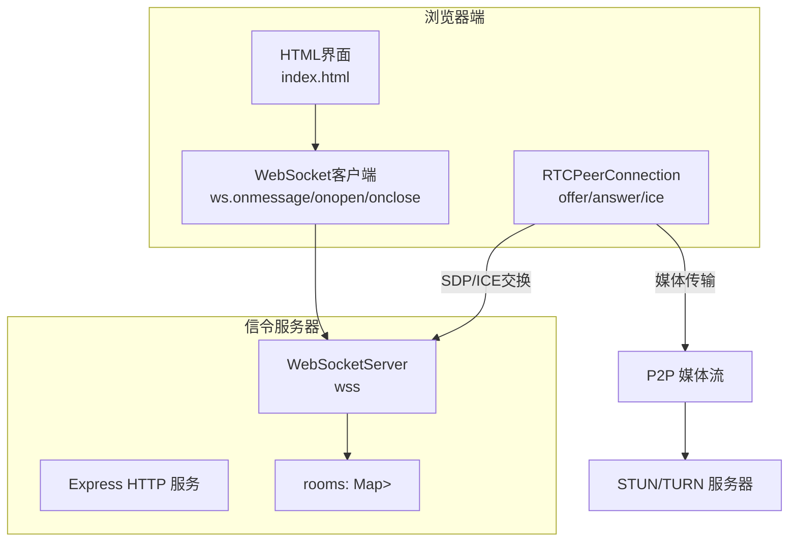
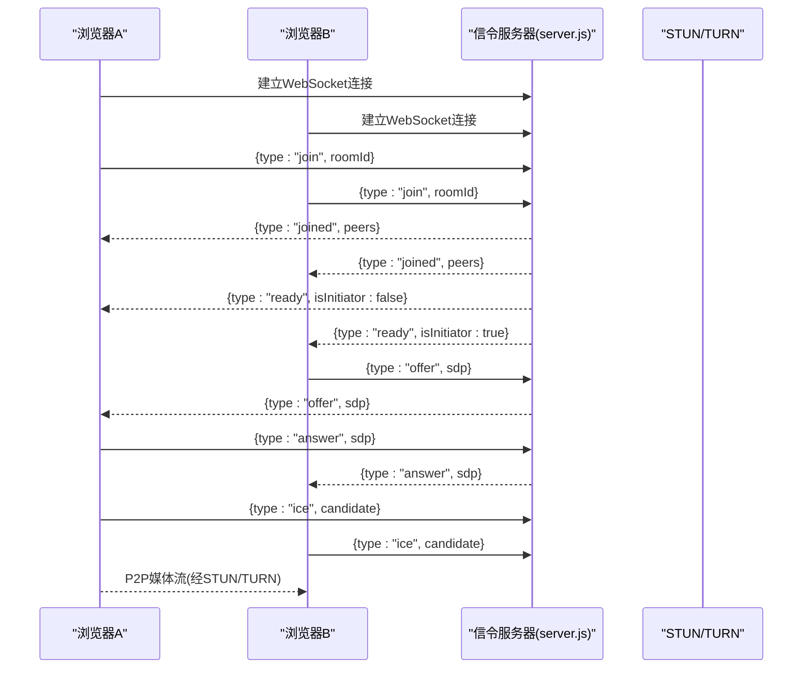
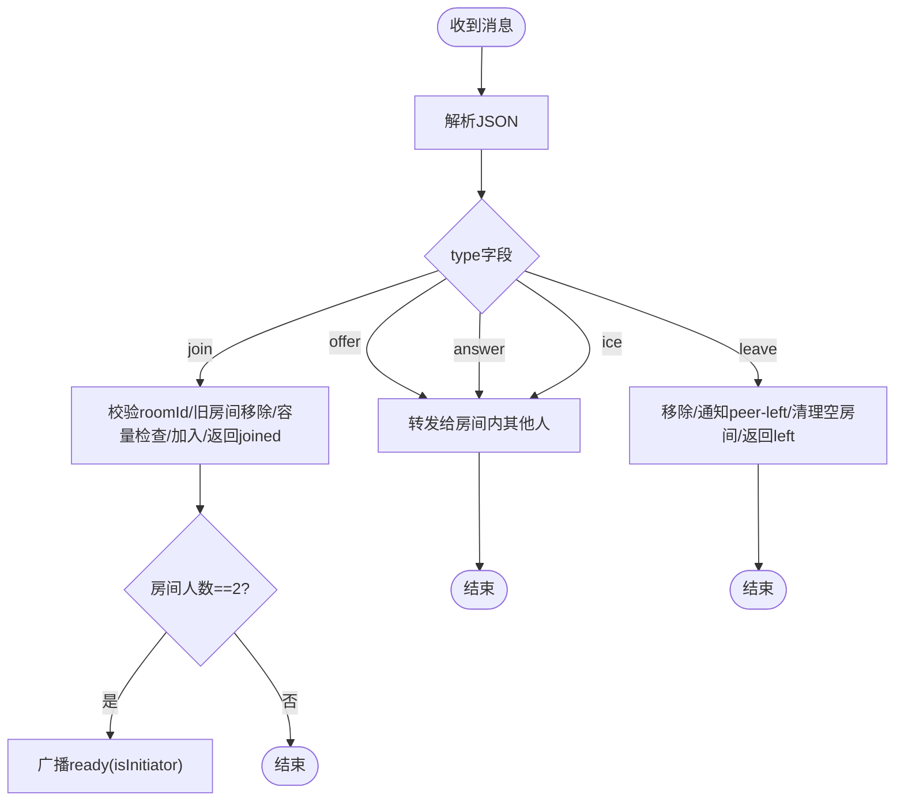
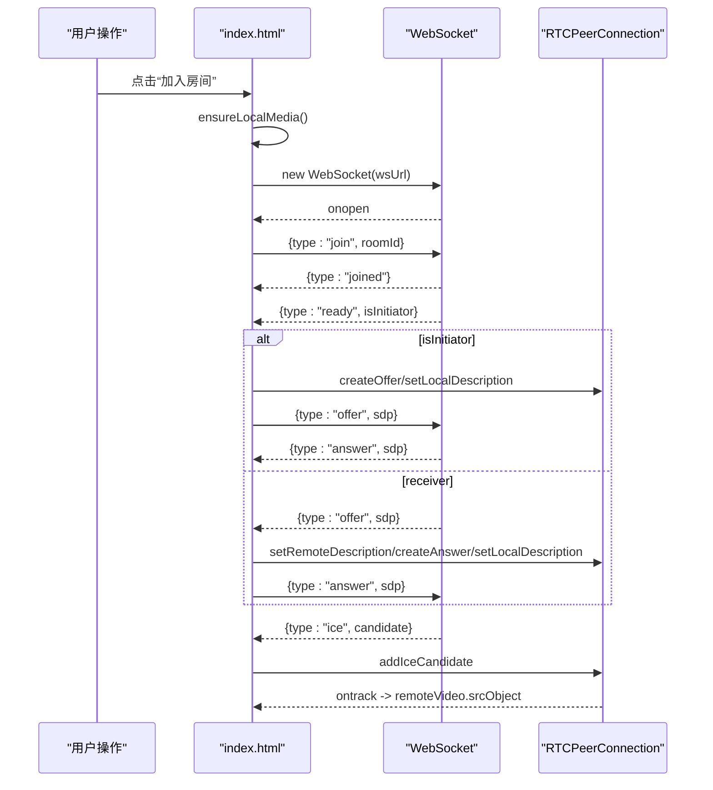
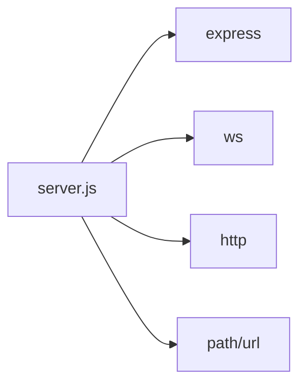

# WebSocket实时通信

<cite>
**本文引用的文件**   
- [server.js](file://webrtc-demo/server/server.js)
- [index.html](file://webrtc-demo/web/index.html)
- [package.json](file://webrtc-demo/server/package.json)
- [day44-webrtc信令服务器实现.md](file://开发文档/day44-webrtc信令服务器实现.md)
</cite>

## 目录
1. [简介](#简介)
2. [项目结构](#项目结构)
3. [核心组件](#核心组件)
4. [架构总览](#架构总览)
5. [详细组件分析](#详细组件分析)
6. [依赖关系分析](#依赖关系分析)
7. [性能与优化](#性能与优化)
8. [故障排查指南](#故障排查指南)
9. [结论](#结论)
10. [附录：消息协议与事件类型](#附录消息协议与事件类型)

## 简介
本文件面向LLFCChat的WebRTC信令与WebSocket实时通信能力，系统性说明信令服务器的实现原理、连接建立、消息转发、房间管理等核心功能；定义WebSocket协议与消息格式、事件类型及处理逻辑；并提供浏览器端与服务器端的完整实现要点、连接状态管理、错误与重试机制建议、性能优化技巧以及调试与监控方法。

## 项目结构
- webrtc-demo/server/server.js：Node.js实现的HTTP+WebSocket信令服务器，提供静态页面托管与WebSocket信令转发。
- webrtc-demo/web/index.html：浏览器端示例，负责媒体采集、RTCPeerConnection协商、WebSocket信令收发与UI状态展示。
- webrtc-demo/server/package.json：服务依赖声明（Express、ws）。
- 开发文档/day44-webrtc信令服务器实现.md：对信令服务器设计、流程与限制的详细说明。

图表来源
- [server.js:1-137](file://webrtc-demo/server/server.js#L1-L137)
- [index.html:41-272](file://webrtc-demo/web/index.html#L41-L272)

章节来源
- [server.js:1-137](file://webrtc-demo/server/server.js#L1-L137)
- [index.html:41-272](file://webrtc-demo/web/index.html#L41-L272)
- [package.json:1-18](file://webrtc-demo/server/package.json#L1-L18)
- [day44-webrtc信令服务器实现.md:1-468](file://开发文档/day44-webrtc信令服务器实现.md#L1-L468)

## 核心组件
- 信令服务器（server.js）
  - 使用Express提供静态资源（web/index.html）。
  - 基于ws创建WebSocketServer，复用HTTP端口。
  - rooms为Map<roomId, Set<ws>>，维护房间成员集合。
  - 核心函数：send、relayToOthers、removeFromRoom。
  - 事件处理：connection、message、close、error。
- 浏览器端（index.html）
  - 获取本地音视频流（getUserMedia）。
  - 创建RTCPeerConnection并配置ICE服务器（STUN/TURN）。
  - 通过WebSocket发送join/leave/offer/answer/ice等信令。
  - 根据ready消息决定发起方（initiator）或接收方（receiver），完成SDP协商与ICE候选交换。
- 依赖（package.json）
  - express：HTTP服务与静态资源托管。
  - ws：WebSocket服务端实现。

章节来源
- [server.js:1-137](file://webrtc-demo/server/server.js#L1-L137)
- [index.html:41-272](file://webrtc-demo/web/index.html#L41-L272)
- [package.json:1-18](file://webrtc-demo/server/package.json#L1-L18)

## 架构总览
信令服务器仅负责信令转发与房间管理，不参与媒体传输。媒体采用P2P直连，必要时通过TURN中继。

图表来源
- [server.js:62-132](file://webrtc-demo/server/server.js#L62-L132)
- [index.html:172-261](file://webrtc-demo/web/index.html#L172-L261)

章节来源
- [day44-webrtc信令服务器实现.md:153-181](file://开发文档/day44-webrtc信令服务器实现.md#L153-L181)

## 详细组件分析

### 信令服务器（server.js）
- 静态资源与HTTP服务
  - 使用express.static暴露web目录，便于直接访问index.html。
- WebSocket握手与会话
  - 复用HTTP server创建WebSocketServer。
  - 每个ws附加roomId字段，初始为null。
- 房间模型
  - rooms: Map<roomId, Set<ws>>，限制每房间最多2人。
- 消息分发
  - join：校验roomId，加入房间，返回joined；当人数=2时广播ready并指定isInitiator。
  - offer/answer/ice：透传至房间内其他成员。
  - leave：从房间移除，通知剩余成员peer-left，清理空房间。
- 生命周期
  - close/error事件触发removeFromRoom，保证一致性。

图表来源
- [server.js:65-132](file://webrtc-demo/server/server.js#L65-L132)

章节来源
- [server.js:26-60](file://webrtc-demo/server/server.js#L26-L60)
- [server.js:62-132](file://webrtc-demo/server/server.js#L62-L132)
- [day44-webrtc信令服务器实现.md:184-241](file://开发文档/day44-webrtc信令服务器实现.md#L184-L241)

### 浏览器端（index.html）
- 媒体采集
  - getUserMedia获取音视频轨道，绑定到本地video元素。
- PeerConnection
  - 配置ICE服务器（STUN/TURN），监听onicecandidate、ontrack、onconnectionstatechange。
  - initiator侧创建offer并发送；receiver侧创建answer并发送。
- WebSocket信令
  - onopen后发送join；收到ready后决定是否发起offer。
  - 处理offer/answer/ice消息，完成协商。
  - 离开时发送leave并清理资源。
- 状态与错误
  - 更新status文本显示连接与P2P状态。
  - 处理full、error等响应提示。

图表来源
- [index.html:80-151](file://webrtc-demo/web/index.html#L80-L151)
- [index.html:172-261](file://webrtc-demo/web/index.html#L172-L261)

章节来源
- [index.html:41-272](file://webrtc-demo/web/index.html#L41-L272)
- [day44-webrtc信令服务器实现.md:114-181](file://开发文档/day44-webrtc信令服务器实现.md#L114-L181)

### 房间管理与消息转发
- rooms数据结构：Map<roomId, Set<ws>>，O(1)查找房间，Set去重且无序。
- relayToOthers：遍历房间集合，排除发送者，逐个send。
- removeFromRoom：删除ws、广播peer-left、清理空房间、重置ws.roomId。

章节来源
- [server.js:21-60](file://webrtc-demo/server/server.js#L21-L60)
- [day44-webrtc信令服务器实现.md:87-112](file://开发文档/day44-webrtc信令服务器实现.md#L87-L112)

## 依赖关系分析
- Express：HTTP服务与静态资源托管。
- ws：WebSocket服务端实现。
- Node.js运行时：ES模块import语法支持。

图表来源
- [server.js:1-19](file://webrtc-demo/server/server.js#L1-L19)
- [package.json:13-16](file://webrtc-demo/server/package.json#L13-L16)

章节来源
- [package.json:1-18](file://webrtc-demo/server/package.json#L1-L18)

## 性能与优化
- 信令服务器无状态内存模型
  - rooms使用原生Map/Set，避免额外对象开销。
  - 单进程内房间数据一致，适合小规模演示。
- 消息转发最小化
  - 仅透传offer/answer/ice，不解析SDP，降低CPU与内存占用。
- 前端媒体与协商
  - 提前请求媒体权限，减少ready阶段阻塞。
  - 合理配置ICE服务器（优先STUN，失败回退TURN）。
- 可扩展性方向
  - 多房间并发：当前实现为内存级，生产需持久化与水平扩展。
  - 多人房间：Mesh架构需要为每个peer维护独立PeerConnection与动态UI。

章节来源
- [day44-webrtc信令服务器实现.md:371-431](file://开发文档/day44-webrtc信令服务器实现.md#L371-L431)

## 故障排查指南
- 常见问题定位
  - 无法加入房间：检查roomId是否为空、是否已满（full）、是否先join再发消息。
  - 协商失败：确认offer/answer顺序、ICE候选是否成功交换、STUN/TURN可达。
  - 媒体不可见：检查ontrack是否触发、remoteVideo.srcObject是否正确设置。
- 日志与调试
  - 浏览器控制台：打印ws.onmessage、pc.onconnectionstatechange、异常堆栈。
  - 服务器日志：启动端口、连接数、错误信息。
- 网络与安全
  - 公网环境建议使用HTTPS/WSS；TURN启用长期凭证或动态签名。
  - 防火墙与NAT穿透问题可通过TURN中继解决。

章节来源
- [index.html:248-261](file://webrtc-demo/web/index.html#L248-L261)
- [day44-webrtc信令服务器实现.md:434-466](file://开发文档/day44-webrtc信令服务器实现.md#L434-L466)

## 结论
该实现以极简方式完成了WebRTC 1v1视频通话的信令与房间管理，重点在于：
- 信令服务器只做转发与房间管理，保持轻量与高吞吐。
- 浏览器端负责媒体采集与协商，遵循标准WebRTC流程。
- 生产环境需补充认证、重连、心跳、监控与横向扩展能力。

[本节不直接分析具体文件]

## 附录：消息协议与事件类型
- 客户端→服务器
  - join：{type:"join", roomId:string}
  - offer：{type:"offer", sdp:object}
  - answer：{type:"answer", sdp:object}
  - ice：{type:"ice", candidate:object}
  - leave：{type:"leave"}
- 服务器→客户端
  - joined：{type:"joined", roomId:string, peers:number}
  - ready：{type:"ready", isInitiator:boolean}
  - full：{type:"full", roomId:string}
  - peer-left：{type:"peer-left"}
  - left：{type:"left"}
  - error：{type:"error", message:string}

章节来源
- [server.js:81-127](file://webrtc-demo/server/server.js#L81-L127)
- [index.html:200-251](file://webrtc-demo/web/index.html#L200-L251)
- [day44-webrtc信令服务器实现.md:116-181](file://开发文档/day44-webrtc信令服务器实现.md#L116-L181)