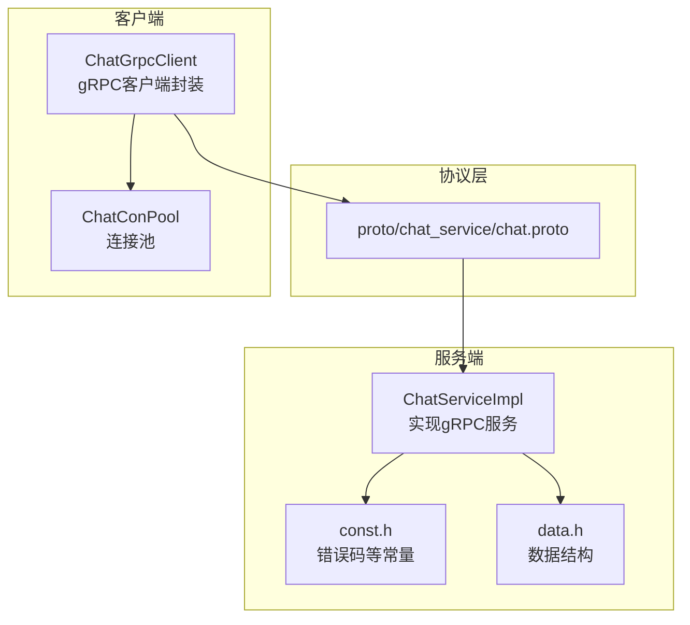
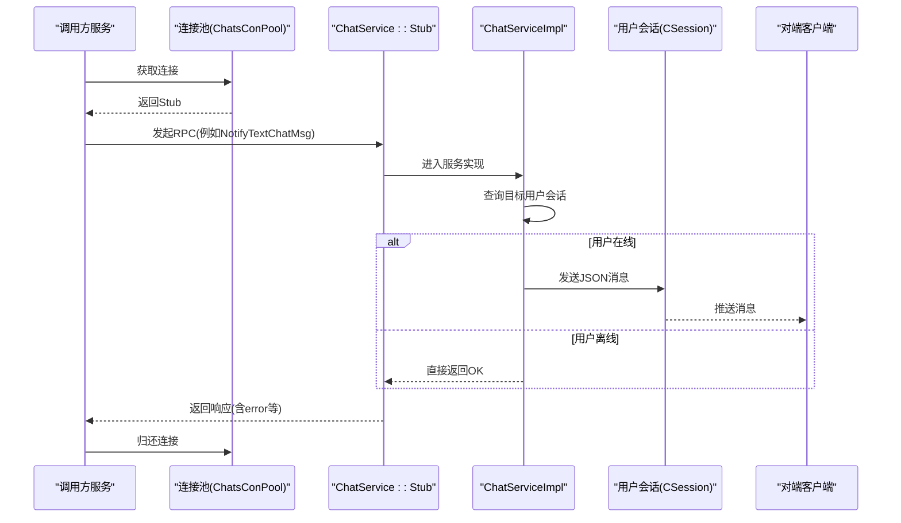

# ChatService聊天服务接口

<cite>
**本文档引用的文件**   
- [chat.proto](file://proto/chat_service/chat.proto)
- [ChatServiceImpl.h](file://server/ChatServer/include/ChatServiceImpl.h)
- [ChatServiceImpl.cpp](file://server/ChatServer/src/ChatServiceImpl.cpp)
- [ChatGrpcClient.h](file://server/ChatServer/include/ChatGrpcClient.h)
- [ChatGrpcClient.cpp](file://server/ChatServer/src/ChatGrpcClient.cpp)
- [const.h（ChatServer）](file://server/ChatServer/include/const.h)
- [data.h](file://server/ChatServer/include/data.h)
- [config.ini（客户端）](file://client/llfcchat/config/config.ini)
- [day27-分布式服务设计.md](file://开发文档/day27-分布式服务设计.md)
- [day41-通知客户端异步下载聊天图片.md](file://开发文档/day41-通知客户端异步下载聊天图片.md)
</cite>

## 目录
1. [简介](#简介)
2. [项目结构](#项目结构)
3. [核心组件](#核心组件)
4. [架构总览](#架构总览)
5. [详细接口说明](#详细接口说明)
6. [依赖关系分析](#依赖关系分析)
7. [性能与可靠性建议](#性能与可靠性建议)
8. [故障排查指南](#故障排查指南)
9. [结论](#结论)
10. [附录：C++客户端调用示例要点](#附录cpp客户端调用示例要点)

## 简介
本文件为 ChatService 聊天服务的 gRPC 接口规范，覆盖以下 RPC 方法：
- NotifyAddFriend（好友申请通知）
- NotifyAuthFriend（好友认证通知）
- NotifyTextChatMsg（文本消息通知）
- NotifyKickUser（踢人通知）
- NotifyChatImgMsg（图片消息通知）

文档包含各方法的请求/响应字段定义、错误码、参数校验规则、调用时序图与最佳实践，并提供 C++ 客户端实现要点（连接池、超时、错误处理）。

## 项目结构
ChatService 的协议定义位于 proto 目录；服务端实现位于 server/ChatServer；客户端调用封装在 ChatGrpcClient。



图表来源
- [chat.proto](file://proto/chat_service/chat.proto)
- [ChatServiceImpl.h](file://server/ChatServer/include/ChatServiceImpl.h)
- [ChatGrpcClient.h](file://server/ChatServer/include/ChatGrpcClient.h)

章节来源
- [chat.proto:1-105](file://proto/chat_service/chat.proto#L1-L105)
- [ChatServiceImpl.h:1-55](file://server/ChatServer/include/ChatServiceImpl.h#L1-L55)
- [ChatGrpcClient.h:1-116](file://server/ChatServer/include/ChatGrpcClient.h#L1-L116)

## 核心组件
- ChatService（gRPC服务）：定义5个Notify开头的RPC方法，用于跨服务或跨进程的消息推送与状态同步。
- ChatServiceImpl（服务实现）：根据目标用户是否在线，将消息通过TCP会话下发给客户端；离线则直接返回成功。
- ChatGrpcClient（客户端封装）：维护到ChatService的连接池，提供统一的RPC调用入口，统一错误码填充与资源释放。
- 错误码与常量：集中定义于 const.h，所有响应体中的 error 字段遵循该枚举。

章节来源
- [ChatServiceImpl.cpp:16-239](file://server/ChatServer/src/ChatServiceImpl.cpp#L16-L239)
- [ChatGrpcClient.cpp:32-203](file://server/ChatServer/src/ChatGrpcClient.cpp#L32-L203)
- [const.h（ChatServer）:1-46](file://server/ChatServer/include/const.h#L1-L46)

## 架构总览
下图展示典型调用路径：调用方（如Gate/Status/Resource等服务）构造请求，经连接池获取Stub，调用ChatService对应方法；服务端查找目标用户会话并转发至客户端。



图表来源
- [ChatGrpcClient.h:34-94](file://server/ChatServer/include/ChatGrpcClient.h#L34-L94)
- [ChatGrpcClient.cpp:32-60](file://server/ChatServer/src/ChatGrpcClient.cpp#L32-L60)
- [ChatServiceImpl.cpp:105-139](file://server/ChatServer/src/ChatServiceImpl.cpp#L105-L139)

## 详细接口说明

### 通用约定
- 包名：message
- 服务名：ChatService
- 错误码：响应体 error 字段使用统一错误码（见“错误码”小节）
- 传输格式：gRPC二进制；服务端内部向客户端推送采用JSON字符串+自定义头部ID

章节来源
- [chat.proto:1-12](file://proto/chat_service/chat.proto#L1-L12)
- [const.h（ChatServer）:5-20](file://server/ChatServer/include/const.h#L5-L20)

### 错误码
- Success = 0
- Error_Json = 1001（JSON解析错误）
- RPCFailed = 1002（RPC请求错误）
- VarifyExpired = 1003（验证码过期）
- VarifyCodeErr = 1004（验证码错误）
- UserExist = 1005（用户已存在）
- PasswdErr = 1006（密码错误）
- EmailNotMatch = 1007（邮箱不匹配）
- PasswdUpFailed = 1008（更新密码失败）
- PasswdInvalid = 1009（密码更新失败）
- TokenInvalid = 1010（Token失效）
- UidInvalid = 1011（uid无效）
- CREATE_CHAT_FAILED = 1012（创建聊天失败）
- LOAD_CHAT_FAILED = 1013（加载聊天失败）

章节来源
- [const.h（ChatServer）:5-20](file://server/ChatServer/include/const.h#L5-L20)

### 字段与消息类型定义
- AddFriendReq / AddFriendRsp：好友申请通知的请求与响应
- AuthFriendReq / AuthFriendRsp：好友认证通知的请求与响应
- TextChatMsgReq / TextChatMsgRsp / TextChatData：文本聊天消息
- KickUserReq / KickUserRsp：踢人通知
- NotifyChatImgReq / NotifyChatImgRsp：图片消息通知

章节来源
- [chat.proto:14-104](file://proto/chat_service/chat.proto#L14-L104)

### RPC方法详情

#### NotifyAddFriend（好友申请通知）
- 用途：当A向B发起好友申请时，由A所在服务器调用此方法通知B所在服务器进行推送。
- 请求字段（AddFriendReq）
  - applyuid: 申请人UID
  - name: 申请人姓名
  - desc: 描述
  - icon: 头像URL
  - nick: 昵称
  - sex: 性别
  - touid: 接收人UID
- 响应字段（AddFriendRsp）
  - error: 错误码
  - applyuid: 申请人UID
  - touid: 接收人UID
- 行为说明
  - 若接收人在线：服务端构造JSON并通过TCP会话下发通知
  - 若接收人离线：直接返回成功（无推送）
- 参数校验
  - touid 必须有效且存在
  - 其他字段按业务需要在前端或服务端做非空校验
- 调用示例（概念性）
  - 构造 AddFriendReq，设置 applyuid/touid/name/desc/icon/nick/sex
  - 调用后检查 response.error == Success
- 最佳实践
  - 幂等：重复申请应去重
  - 限流：防止恶意频繁申请
  - 日志：记录申请人与接收人UID及结果

章节来源
- [chat.proto:15-29](file://proto/chat_service/chat.proto#L15-L29)
- [ChatServiceImpl.cpp:16-47](file://server/ChatServer/src/ChatServiceImpl.cpp#L16-L47)

#### NotifyAuthFriend（好友认证通知）
- 用途：A同意B的好友申请后，A所在服务器调用此方法通知B所在服务器推送认证结果与历史消息片段。
- 请求字段（AuthFriendReq）
  - fromuid: 发起人UID
  - touid: 接收人UID
  - textmsgs: 认证相关消息列表（AddFriendMsg）
- 响应字段（AuthFriendRsp）
  - error: 错误码
  - fromuid: 发起人UID
  - touid: 接收人UID
- 行为说明
  - 若接收人在线：组装JSON（包含fromuid/touid、发件人基础信息、chat_datas数组等）并下发
  - 若接收人离线：直接返回成功
- 参数校验
  - fromuid/touid 必须有效
  - textmsgs 中每条需包含 sender_id/unique_id/msg_id/thread_id/msgcontent/status
- 调用示例（概念性）
  - 构造 AuthFriendReq，填充 fromuid/touid/textmsgs
  - 检查 response.error
- 最佳实践
  - 消息去重：基于 unique_id 或 msg_id
  - 时间戳：服务端生成 chat_time，保证一致性

章节来源
- [chat.proto:32-51](file://proto/chat_service/chat.proto#L32-L51)
- [ChatServiceImpl.cpp:49-103](file://server/ChatServer/src/ChatServiceImpl.cpp#L49-L103)

#### NotifyTextChatMsg（文本消息通知）
- 用途：发送文本聊天消息，由发送方服务器调用以推送到接收方服务器。
- 请求字段（TextChatMsgReq）
  - fromuid: 发送者UID
  - touid: 接收者UID
  - thread_id: 聊天线程ID
  - textmsgs: 文本消息数组（TextChatData）
- 响应字段（TextChatMsgRsp）
  - error: 错误码
  - fromuid: 发送者UID
  - touid: 接收者UID
  - thread_id: 聊天线程ID
  - textmsgs: 回显消息数组（TextChatData）
- 行为说明
  - 若接收人在线：构造JSON（包含fromuid/touid/thread_id/chat_datas数组）并下发
  - 若接收人离线：直接返回成功
- 参数校验
  - fromuid/touid 必须有效
  - textmsgs 中每条需包含 unique_id/msg_id/msgcontent/chat_time
- 调用示例（概念性）
  - 构造 TextChatMsgReq，填充 fromuid/touid/thread_id/textmsgs
  - 检查 response.error
- 最佳实践
  - 唯一性：unique_id 全局唯一，避免重复投递
  - 顺序：保持 thread_id 内消息顺序一致
  - 重试：网络异常可指数退避重试

章节来源
- [chat.proto:54-74](file://proto/chat_service/chat.proto#L54-L74)
- [ChatServiceImpl.cpp:105-139](file://server/ChatServer/src/ChatServiceImpl.cpp#L105-L139)

#### NotifyKickUser（踢人通知）
- 用途：强制下线指定用户（如异地登录、管理员操作）。
- 请求字段（KickUserReq）
  - uid: 被踢用户UID
- 响应字段（KickUserRsp）
  - error: 错误码
  - uid: 被踢用户UID
- 行为说明
  - 若用户在线：触发离线通知并清理会话
  - 若用户离线：直接返回成功
- 参数校验
  - uid 必须有效
- 调用示例（概念性）
  - 构造 KickUserReq，设置 uid
  - 检查 response.error
- 最佳实践
  - 权限控制：仅授权角色可调用
  - 审计：记录操作者与原因

章节来源
- [chat.proto:77-84](file://proto/chat_service/chat.proto#L77-L84)
- [ChatServiceImpl.cpp:187-210](file://server/ChatServer/src/ChatServiceImpl.cpp#L187-L210)

#### NotifyChatImgMsg（图片消息通知）
- 用途：通知接收方客户端有图片资源可供下载（通常由资源服务器触发）。
- 请求字段（NotifyChatImgReq）
  - from_uid: 发送方UID
  - to_uid: 接收方UID
  - message_id: 消息ID
  - file_name: 文件名
  - total_size: 文件大小
  - thread_id: 聊天线程ID
- 响应字段（NotifyChatImgRsp）
  - error: 错误码
  - from_uid: 发送方UID
  - to_uid: 接收方UID
  - message_id: 消息ID
  - file_name: 文件名
  - total_size: 文件大小
  - thread_id: 聊天线程ID
- 行为说明
  - 若接收人在线：调用 session->NotifyChatImgRecv(request) 通知客户端
  - 若接收人离线：直接返回成功
- 参数校验
  - message_id/file_name/total_size 需与资源一致
- 调用示例（概念性）
  - 构造 NotifyChatImgReq，设置 from_uid/to_uid/message_id/file_name/total_size/thread_id
  - 检查 response.error
- 最佳实践
  - 断点续传：结合 total_size 与客户端进度
  - 安全校验：校验 file_name 合法性，防注入

章节来源
- [chat.proto:87-104](file://proto/chat_service/chat.proto#L87-L104)
- [ChatServiceImpl.cpp:217-239](file://server/ChatServer/src/ChatServiceImpl.cpp#L217-L239)

### 数据模型与字段说明
- AddFriendMsg：认证消息片段，包含 sender_id/unique_id/msg_id/thread_id/msgcontent/status
- TextChatData：文本消息片段，包含 unique_id/msg_id/msgcontent/chat_time
- UserInfo：用户基本信息（name/pwd/email/nick/desc/sex/icon/back），用于补充认证消息中的发件人信息
- ChatThreadInfo/ChatMessage：聊天线程与消息结构，便于后端存储与分页

章节来源
- [chat.proto:32-39](file://proto/chat_service/chat.proto#L32-L39)
- [chat.proto:54-59](file://proto/chat_service/chat.proto#L54-L59)
- [data.h:4-65](file://server/ChatServer/include/data.h#L4-L65)

## 依赖关系分析
- ChatServiceImpl 依赖 UserMgr/CSession 进行会话管理与消息下发
- ChatGrpcClient 依赖 ConfigMgr 读取PeerServer配置，构建连接池
- 错误码统一来自 const.h
- 图片通知流程可能涉及 MysqlMgr/RedisMgr/ConfigMgr（资源路径）

```mermaid
classDiagram
class ChatService_Service {
+NotifyAddFriend()
+NotifyAuthFriend()
+NotifyTextChatMsg()
+NotifyKickUser()
+NotifyChatImgMsg()
}
class ChatServiceImpl {
+NotifyAddFriend()
+NotifyAuthFriend()
+NotifyTextChatMsg()
+NotifyKickUser()
+NotifyChatImgMsg()
-GetBaseInfo()
}
class ChatGrpcClient {
+NotifyAddFriend()
+NotifyAuthFriend()
+NotifyTextChatMsg()
+NotifyKickUser()
-_pools
}
class ChatConPool {
+getConnection()
+returnConnection()
}
ChatService_Service <|-- ChatServiceImpl : "实现"
ChatGrpcClient --> ChatConPool : "使用"
ChatServiceImpl --> "UserMgr/CSession" : "依赖"
```

图表来源
- [ChatServiceImpl.h:29-53](file://server/ChatServer/include/ChatServiceImpl.h#L29-L53)
- [ChatGrpcClient.h:34-112](file://server/ChatServer/include/ChatGrpcClient.h#L34-L112)

章节来源
- [ChatServiceImpl.cpp:16-239](file://server/ChatServer/src/ChatServiceImpl.cpp#L16-L239)
- [ChatGrpcClient.cpp:32-203](file://server/ChatServer/src/ChatGrpcClient.cpp#L32-L203)

## 性能与可靠性建议
- 连接池
  - 合理设置池大小（默认5），避免过多连接导致内存占用过高
  - 使用条件变量等待可用连接，避免忙轮询
- 超时与重试
  - 为 ClientContext 设置合理的超时（如3s~5s）
  - 对网络异常进行指数退避重试，限制最大重试次数
- 幂等与去重
  - 基于 unique_id/msg_id 去重，避免重复推送
- 序列化与负载
  - JSON体积较大时考虑压缩或分片
  - 批量消息合并减少往返
- 监控与告警
  - 统计错误码分布、延迟P95/P99
  - 关键路径埋点（会话查找、消息下发、资源访问）

[本节为通用指导，无需代码引用]

## 故障排查指南
- 常见问题
  - RPCFailed：检查目标ChatService地址、端口、防火墙与证书（若启用TLS）
  - UidInvalid：确认UID是否存在且有效
  - Json解析错误：检查服务端下发的JSON结构与字段名
- 定位步骤
  - 查看服务端日志（UserMgr.GetSession、Redis/Mysql访问）
  - 核对请求字段是否与proto定义一致
  - 检查客户端是否正确处理ID_NOTIFY_* 消息
- 恢复策略
  - 重试机制（带退避）
  - 降级策略（离线消息队列）

章节来源
- [const.h（ChatServer）:5-20](file://server/ChatServer/include/const.h#L5-L20)
- [ChatServiceImpl.cpp:16-239](file://server/ChatServer/src/ChatServiceImpl.cpp#L16-L239)

## 结论
ChatService 提供了稳定的跨服务消息推送能力，涵盖好友申请、认证、文本与图片消息以及踢人场景。通过统一的错误码与清晰的字段定义，配合连接池与超时重试机制，可实现高可靠、可扩展的聊天通信体系。

[本节为总结，无需代码引用]

## 附录：C++客户端调用示例要点
- 连接配置
  - 从配置文件读取 PeerServer 的 Host/Port，初始化 ChatConPool
  - 使用 grpc::InsecureChannelCredentials（生产环境建议使用TLS）
- 超时设置
  - 为每次 RPC 调用设置 ClientContext 的 deadline（如3秒）
- 错误处理
  - 检查 Status.ok()，失败时填充 RPCFailed
  - 检查响应体 error 字段，区分业务错误与网络错误
- 资源管理
  - 使用 Defer 或RAII确保连接归还
  - 析构时关闭连接池并唤醒等待线程
- 参考实现位置
  - 连接池与客户端封装：ChatGrpcClient.h/.cpp
  - 启动与服务注册：分布式服务设计文档中的main流程
  - 图片通知客户端：ResourceServer侧调用ChatService的图片通知示例

章节来源
- [ChatGrpcClient.h:34-112](file://server/ChatServer/include/ChatGrpcClient.h#L34-L112)
- [ChatGrpcClient.cpp:32-203](file://server/ChatServer/src/ChatGrpcClient.cpp#L32-L203)
- [day27-分布式服务设计.md:221-276](file://开发文档/day27-分布式服务设计.md#L221-L276)
- [day41-通知客户端异步下载聊天图片.md:61-215](file://开发文档/day41-通知客户端异步下载聊天图片.md#L61-L215)
- [config.ini（客户端）:1-4](file://client/llfcchat/config/config.ini#L1-L4)