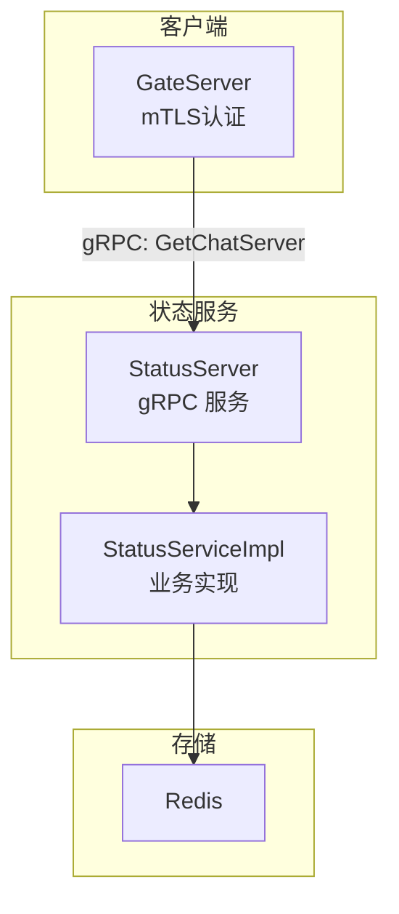
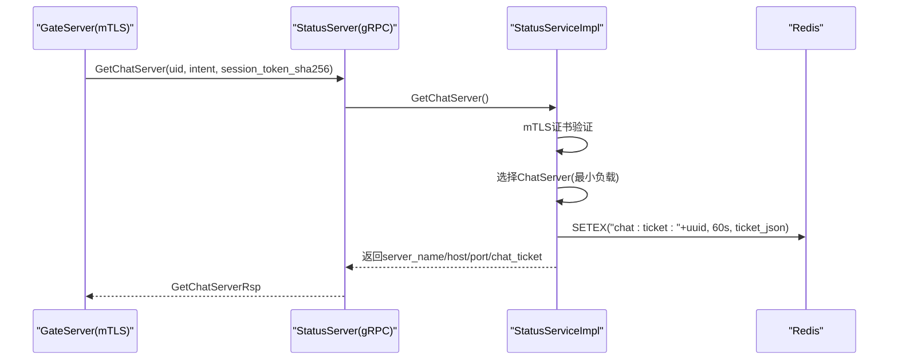
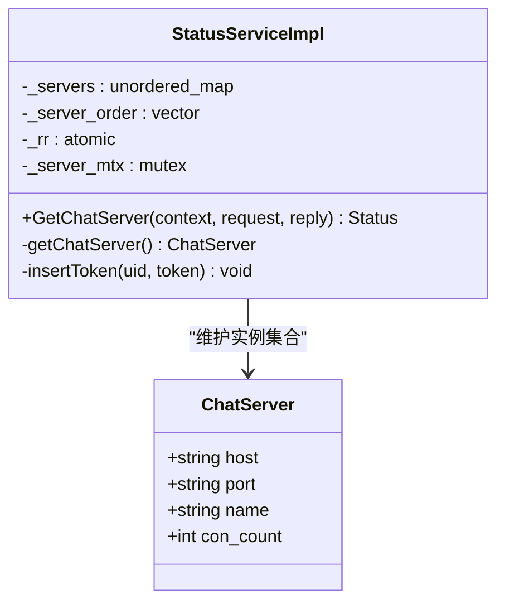
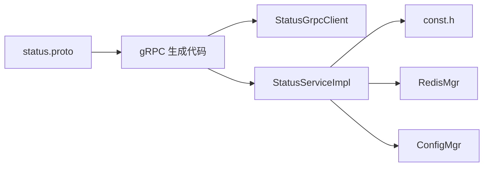

# StatusService状态服务接口

<cite>
**本文引用的文件**   
- [status.proto](file://proto/status_service/status.proto)
- [StatusServiceImpl.h](file://server/StatusServer/include/StatusServiceImpl.h)
- [StatusServiceImpl.cpp](file://server/StatusServer/src/StatusServiceImpl.cpp)
- [StatusServer.cpp](file://server/StatusServer/src/StatusServer.cpp)
- [const.h](file://server/ChatServer/include/const.h)
- [config.ini（StatusServer）](file://server/StatusServer/config/config.ini)
- [StatusGrpcClient.h（GateServer）](file://server/GateServer/include/StatusGrpcClient.h)
- [StatusGrpcClient.cpp（GateServer）](file://server/GateServer/src/StatusGrpcClient.cpp)
- [chatserver1.ini（ChatServer）](file://server/ChatServer/config/chatserver1.ini)
- [config.ini（GateServer）](file://server/GateServer/config/config.ini)
</cite>

## 更新摘要
**变更内容**   
- 移除了Login方法及相关实现，StatusService现在只保留GetChatServer方法
- 更新了API参考文档以反映接口变更
- 调整了客户端调用示例和错误处理逻辑
- 简化了服务架构描述

## 目录
1. [简介](#简介)
2. [项目结构](#项目结构)
3. [核心组件](#核心组件)
4. [架构总览](#架构总览)
5. [详细组件分析](#详细组件分析)
6. [依赖关系分析](#依赖关系分析)
7. [性能与并发控制](#性能与并发控制)
8. [部署与配置指南](#部署与配置指南)
9. [故障转移与高可用](#故障转移与高可用)
10. [多语言客户端调用示例](#多语言客户端调用示例)
11. [常见问题排查](#常见问题排查)
12. [结论](#结论)

## 简介
本文件为 StatusService 状态服务的 gRPC 接口文档，覆盖以下能力：
- **聊天服务器路由**：通过 GetChatServer 接口返回可用的 ChatServer 地址及一次性票据。
- **数据模型与错误码**：统一使用 proto 定义的消息体与全局错误码。
- **并发访问控制**：基于互斥锁与连接池的并发安全策略。
- **部署配置、负载均衡、故障转移机制与性能优化建议**。
- **多语言客户端调用示例与最佳实践**。

**重要更新**：StatusService 接口中 Login 方法已移除，当前仅保留 GetChatServer 方法用于聊天服务器分配。

## 项目结构
StatusService 位于 server/StatusServer，对外暴露一个 gRPC 方法；GateServer 作为客户端通过 mTLS 认证调用该服务。

**图表来源**
- [StatusServer.cpp:1-69](file://server/StatusServer/src/StatusServer.cpp#L1-L69)
- [StatusServiceImpl.h:1-51](file://server/StatusServer/include/StatusServiceImpl.h#L1-L51)
- [StatusServiceImpl.cpp:1-170](file://server/StatusServer/src/StatusServiceImpl.cpp#L1-L170)

## 核心组件
- **gRPC 接口定义**：service StatusService，仅包含 GetChatServer 一个 RPC。
- **服务端实现**：StatusServiceImpl，负责选择 ChatServer、生成并缓存票据、校验 mTLS 证书。
- **客户端封装**：StatusGrpcClient，提供 mTLS 认证与便捷调用。
- **配置与常量**：config.ini 提供端口与后端 ChatServer 列表；const.h 定义错误码与键前缀。

**章节来源**
- [status.proto:1-31](file://proto/status_service/status.proto#L1-L31)
- [StatusServiceImpl.h:1-51](file://server/StatusServer/include/StatusServiceImpl.h#L1-L51)
- [StatusGrpcClient.h（GateServer）:1-35](file://server/GateServer/include/StatusGrpcClient.h#L1-L35)
- [const.h:10-30](file://server/ChatServer/include/const.h#L10-L30)

## 架构总览
下图展示一次 GetChatServer 调用的完整流程：GateServer 通过 mTLS 认证获取 Stub，发起请求，服务端选择 ChatServer，生成一次性票据并写入 Redis，返回给客户端。

**图表来源**
- [StatusGrpcClient.cpp（GateServer）:27-48](file://server/GateServer/src/StatusGrpcClient.cpp#L27-L48)
- [StatusServiceImpl.cpp:36-80](file://server/StatusServer/src/StatusServiceImpl.cpp#L36-L80)

## 详细组件分析

### gRPC 接口定义与数据模型
- **Service**: StatusService
  - rpc GetChatServer(GetChatServerReq) returns (GetChatServerRsp)
- **消息体字段**
  - GetChatServerReq: uid(int32), intent(TicketIntent), session_token_sha256(string)
  - GetChatServerRsp: error(int32), server_name(string), host(string), port(string), chat_ticket(string)
- **TicketIntent 枚举**
  - INITIAL = 0: 密码验证后的首次登录
  - RESUME = 1: 持有效 session token 的恢复登录

**错误码**
- Success=0, NoAvailableChatServer=1018, RPCFailed=1002 等

**键前缀**
- CHAT_TICKET_PREFIX="chat:ticket:"

**章节来源**
- [status.proto:1-31](file://proto/status_service/status.proto#L1-L31)
- [const.h:160-161](file://server/ChatServer/include/const.h#L160-L161)

### 服务端实现：StatusServiceImpl
**职责**
- 初始化时读取配置中的 chatservers 列表，构建本地 ChatServer 映射。
- GetChatServer：进行 mTLS 证书验证，选择负载最小的 ChatServer，生成一次性票据，写入 Redis，并返回相关信息。
- getChatServer：基于 Redis 中的 lease 信息选择负载最小的节点。

**并发控制**
- _servers 访问使用 std::mutex 保护。
- Redis 操作通过 RedisMgr 单例进行。

**复杂度与性能**
- 选择 ChatServer 基于 Redis lease 统计，时间复杂度 O(n)。
- 票据生成使用 UUID，时间开销可忽略。

**图表来源**
- [StatusServiceImpl.h:16-49](file://server/StatusServer/include/StatusServiceImpl.h#L16-L49)
- [StatusServiceImpl.cpp:111-169](file://server/StatusServer/src/StatusServiceImpl.cpp#L111-L169)

**章节来源**
- [StatusServiceImpl.h:1-51](file://server/StatusServer/include/StatusServiceImpl.h#L1-L51)
- [StatusServiceImpl.cpp:1-170](file://server/StatusServer/src/StatusServiceImpl.cpp#L1-L170)

### 客户端封装：StatusGrpcClient
**职责**
- StatusGrpcClient：封装 GetChatServer 调用，支持 mTLS 认证。
- 自动处理超时与错误码转换。

**mTLS 认证**
- 从环境变量加载 CA 证书、客户端证书和私钥。
- 创建 SSL 凭据并建立安全连接。

**章节来源**
- [StatusGrpcClient.h（GateServer）:1-35](file://server/GateServer/include/StatusGrpcClient.h#L1-L35)
- [StatusGrpcClient.cpp（GateServer）:1-85](file://server/GateServer/src/StatusGrpcClient.cpp#L1-L85)

### 启动与服务监听
- 主进程读取配置，构造 ServerBuilder，注册服务，启动 gRPC 服务。
- 使用 Boost.Asio 捕获 SIGINT/SIGTERM 优雅退出。

**章节来源**
- [StatusServer.cpp:17-52](file://server/StatusServer/src/StatusServer.cpp#L17-L52)

## 依赖关系分析
- **外部依赖**
  - gRPC：服务框架与 Stub 生成。
  - Redis：存储一次性票据与会话信息。
- **内部依赖**
  - ConfigMgr：读取配置文件。
  - RedisMgr：Redis 操作封装。
  - const.h：错误码与键前缀。

**图表来源**
- [status.proto:1-31](file://proto/status_service/status.proto#L1-L31)
- [StatusServiceImpl.cpp:1-7](file://server/StatusServer/src/StatusServiceImpl.cpp#L1-L7)
- [StatusGrpcClient.cpp（GateServer）:1-5](file://server/GateServer/src/StatusGrpcClient.cpp#L1-L5)

**章节来源**
- [status.proto:1-31](file://proto/status_service/status.proto#L1-L31)
- [const.h:1-181](file://server/ChatServer/include/const.h#L1-L181)

## 性能与并发控制
- **连接管理**
  - 每个请求创建新的 Channel/Stub，避免连接池复杂性。
  - 设置 3 秒超时防止长时间阻塞。
- **服务端并发**
  - 使用互斥锁保护 ChatServer 集合访问。
  - Redis 操作通过单例集中管理，避免重复连接。
- **负载均衡**
  - 基于 Redis lease 统计选择负载最小的节点。
  - 使用原子计数器轮转起点，避免配置首项长期占优。

**章节来源**
- [StatusGrpcClient.cpp（GateServer）:27-48](file://server/GateServer/src/StatusGrpcClient.cpp#L27-L48)
- [StatusServiceImpl.cpp:111-169](file://server/StatusServer/src/StatusServiceImpl.cpp#L111-L169)

## 部署与配置指南
- **StatusServer**
  - 监听地址与端口：Host/Port（默认 0.0.0.0:50052）。
  - 后端 ChatServer 列表：chatservers.Name 逗号分隔，每个节点 Name/Host/Port。
  - Redis 连接参数。
- **GateServer**
  - StatusServer 的地址 Host/Port。
  - mTLS 证书路径通过环境变量配置：
    - LLFC_STATUS_CA_CERT_PATH
    - LLFC_GATE_CLIENT_CERT_PATH
    - LLFC_GATE_CLIENT_KEY_PATH

**章节来源**
- [config.ini（StatusServer）:1-23](file://server/StatusServer/config/config.ini#L1-L23)
- [config.ini（GateServer）:1-25](file://server/GateServer/config/config.ini#L1-L25)

## 故障转移与高可用
- **客户端侧**
  - 支持超时重试与降级逻辑（例如切换备用 StatusServer）。
  - mTLS 认证失败时快速失败，便于上层监控告警。
- **服务端侧**
  - 优雅退出：捕获信号后 Shutdown 并停止 io_context。
  - 健康检查：可通过独立探针接口或指标上报。
- **分布式一致性**
  - 票据以 uuid 为键写入 Redis，60s TTL 确保一次性使用。
  - ChatServer 通过 GETDEL 原子消费票据，避免重复使用。

**章节来源**
- [StatusServer.cpp:32-52](file://server/StatusServer/src/StatusServer.cpp#L32-L52)
- [StatusServiceImpl.cpp:68-72](file://server/StatusServer/src/StatusServiceImpl.cpp#L68-L72)

## 多语言客户端调用示例
以下为各语言的调用要点与步骤：
- **Go**
  - 使用 protoc-gen-go-grpc 生成代码，构造 channel 与 stub，调用 GetChatServer。
  - 设置 mTLS 证书与超时，解析 error 字段。
- **Java**
  - 使用 grpc-java 生成代码，创建 ManagedChannel，调用异步或同步方法。
  - 处理 Status 与错误码。
- **Python**
  - 使用 grpcio-tools 生成代码，建立 channel，调用 stub 方法。
  - 注意序列化与异常处理。
- **C++**
  - 使用项目中 StatusGrpcClient 模式，创建 mTLS 认证通道。
  - 参考 GateServer 的实现。

**章节来源**
- [status.proto:1-31](file://proto/status_service/status.proto#L1-L31)
- [StatusGrpcClient.cpp（GateServer）:27-48](file://server/GateServer/src/StatusGrpcClient.cpp#L27-L48)

## 常见问题排查
- **连接失败**
  - 检查 StatusServer 端口与防火墙规则。
  - 确认客户端配置的 Host/Port 正确。
  - 验证 mTLS 证书路径与环境变量配置。
- **认证失败**
  - 检查客户端证书的 SAN 是否包含 "llfc-gate"。
  - 验证 CA 证书、客户端证书和私钥匹配。
- **路由异常**
  - 检查 chatservers 配置是否正确加载。
  - 观察 Redis 中 lease 信息是否正常更新。
- **性能问题**
  - 调整超时时间与重试策略。
  - 评估 Redis 延迟与命中率。

**章节来源**
- [StatusServiceImpl.cpp:38-42](file://server/StatusServer/src/StatusServiceImpl.cpp#L38-L42)
- [StatusGrpcClient.cpp（GateServer）:50-85](file://server/GateServer/src/StatusGrpcClient.cpp#L50-L85)

## 结论
StatusService 经过简化后专注于聊天服务器分配功能，具备清晰的接口定义与可靠的 mTLS 认证机制。建议在后续版本中：
- 补充更完善的负载均衡与健康检查机制。
- 增强客户端容错（重试、熔断、降级）与可观测性（指标、日志）。
- 考虑扩展其他状态相关功能以满足业务需求。