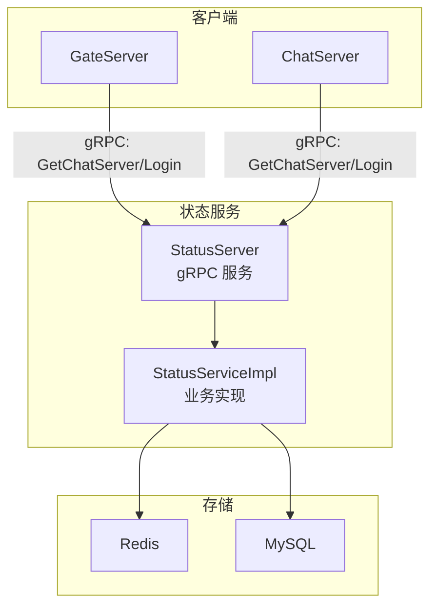
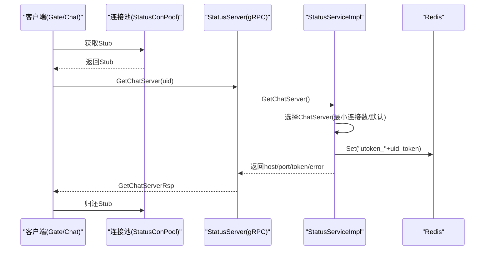
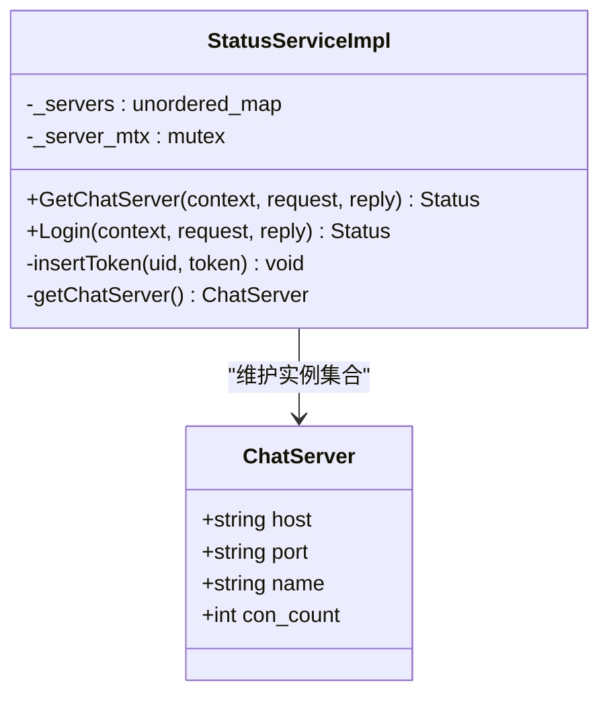
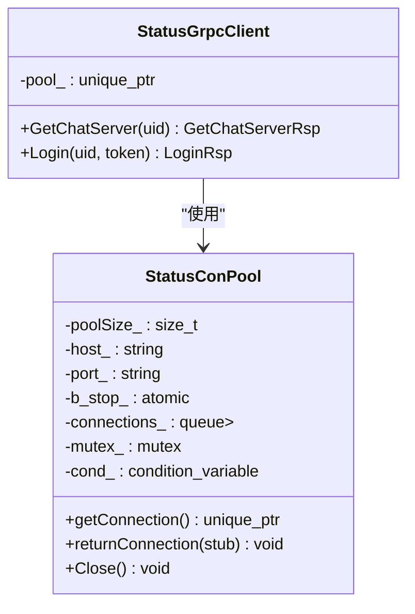
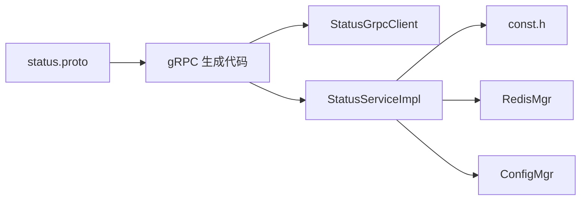

# StatusService状态服务接口

<cite>
**本文引用的文件**   
- [status.proto](file://proto/status_service/status.proto)
- [StatusServiceImpl.h](file://server/StatusServer/include/StatusServiceImpl.h)
- [StatusServiceImpl.cpp](file://server/StatusServer/src/StatusServiceImpl.cpp)
- [StatusServer.cpp](file://server/StatusServer/src/StatusServer.cpp)
- [const.h](file://server/StatusServer/include/const.h)
- [config.ini（StatusServer）](file://server/StatusServer/config/config.ini)
- [StatusGrpcClient.h（ChatServer）](file://server/ChatServer/include/StatusGrpcClient.h)
- [StatusGrpcClient.cpp（ChatServer）](file://server/ChatServer/src/StatusGrpcClient.cpp)
- [StatusGrpcClient.h（GateServer）](file://server/GateServer/include/StatusGrpcClient.h)
- [StatusGrpcClient.cpp（GateServer）](file://server/GateServer/src/StatusGrpcClient.cpp)
- [chatserver1.ini（ChatServer）](file://server/ChatServer/config/chatserver1.ini)
- [config.ini（GateServer）](file://server/GateServer/config/config.ini)
- [day35心跳逻辑.md](file://开发文档/day35心跳逻辑.md)
</cite>

## 目录
1. [简介](#简介)
2. [项目结构](#项目结构)
3. [核心组件](#核心组件)
4. [架构总览](#架构总览)
5. [详细组件分析](#详细组件分析)
6. [依赖关系分析](#依赖关系分析)
7. [性能与并发控制](#性能与并发控制)
8. [部署与配置指南](#部署与配置指南)
9. [故障转移与高可用](#故障转移与高可用)
10. [多语言客户端调用示例](#多语言客户端调用示例)
11. [常见问题排查](#常见问题排查)
12. [结论](#结论)

## 简介
本文件为 StatusService 状态服务的 gRPC 接口文档，覆盖以下能力：
- 用户在线状态管理：通过 Login 接口完成用户登录态校验与 Token 绑定。
- 聊天服务器路由：通过 GetChatServer 接口返回可用的 ChatServer 地址及一次性 Token。
- 数据模型与错误码：统一使用 proto 定义的消息体与全局错误码。
- 并发访问控制：基于互斥锁与连接池的并发安全策略。
- 部署配置、负载均衡、故障转移机制与性能优化建议。
- 多语言客户端调用示例与最佳实践。

说明：当前仓库中未包含“心跳检测”“用户信息同步”等 RPC 方法定义，相关能力由其他模块（如 ChatServer/GateServer 的心跳逻辑）实现。本文在“扩展建议”部分给出接入方案。

## 项目结构
StatusService 位于 server/StatusServer，对外暴露两个 gRPC 方法；GateServer 与 ChatServer 作为客户端通过连接池调用该服务。

图表来源
- [StatusServer.cpp:1-69](file://server/StatusServer/src/StatusServer.cpp#L1-L69)
- [StatusServiceImpl.h:1-52](file://server/StatusServer/include/StatusServiceImpl.h#L1-L52)
- [StatusServiceImpl.cpp:1-125](file://server/StatusServer/src/StatusServiceImpl.cpp#L1-L125)

章节来源
- [StatusServer.cpp:1-69](file://server/StatusServer/src/StatusServer.cpp#L1-L69)
- [config.ini（StatusServer）:1-23](file://server/StatusServer/config/config.ini#L1-L23)

## 核心组件
- gRPC 接口定义：service StatusService，包含 GetChatServer 与 Login 两个 RPC。
- 服务端实现：StatusServiceImpl，负责选择 ChatServer、生成并缓存 Token、校验登录态。
- 客户端封装：StatusGrpcClient + StatusConPool，提供连接池与便捷调用。
- 配置与常量：config.ini 提供端口与后端 ChatServer 列表；const.h 定义错误码与键前缀。

章节来源
- [status.proto:1-32](file://proto/status_service/status.proto#L1-L32)
- [StatusServiceImpl.h:1-52](file://server/StatusServer/include/StatusServiceImpl.h#L1-L52)
- [StatusGrpcClient.h（ChatServer）:1-99](file://server/ChatServer/include/StatusGrpcClient.h#L1-L99)
- [StatusGrpcClient.h（GateServer）:1-98](file://server/GateServer/include/StatusGrpcClient.h#L1-L98)
- [const.h:31-75](file://server/StatusServer/include/const.h#L31-L75)

## 架构总览
下图展示一次 GetChatServer 调用的完整流程：客户端从连接池获取 Stub，发起请求，服务端选择 ChatServer，生成 Token 并写入 Redis，返回给客户端。

图表来源
- [StatusGrpcClient.cpp（ChatServer）:1-53](file://server/ChatServer/src/StatusGrpcClient.cpp#L1-L53)
- [StatusGrpcClient.cpp（GateServer）:1-53](file://server/GateServer/src/StatusGrpcClient.cpp#L1-L53)
- [StatusServiceImpl.cpp:17-27](file://server/StatusServer/src/StatusServiceImpl.cpp#L17-L27)
- [StatusServiceImpl.cpp:118-123](file://server/StatusServer/src/StatusServiceImpl.cpp#L118-L123)

章节来源
- [StatusGrpcClient.cpp（ChatServer）:1-53](file://server/ChatServer/src/StatusGrpcClient.cpp#L1-L53)
- [StatusGrpcClient.cpp（GateServer）:1-53](file://server/GateServer/src/StatusGrpcClient.cpp#L1-L53)
- [StatusServiceImpl.cpp:17-27](file://server/StatusServer/src/StatusServiceImpl.cpp#L17-L27)

## 详细组件分析

### gRPC 接口定义与数据模型
- Service: StatusService
  - rpc GetChatServer(GetChatServerReq) returns (GetChatServerRsp)
  - rpc Login(LoginReq) returns (LoginRsp)
- 消息体字段
  - GetChatServerReq: uid(int32)
  - GetChatServerRsp: error(int32), host(string), port(string), token(string)
  - LoginReq: uid(int32), token(string)
  - LoginRsp: error(int32), uid(int32), token(string)

错误码（部分）
- Success=0, TokenInvalid=1010, UidInvalid=1011, RPCFailed=1002 等

键前缀
- USERTOKENPREFIX="utoken_"
- USERIPPREFIX="uip_"
- LOGIN_COUNT="logincount"

章节来源
- [status.proto:1-32](file://proto/status_service/status.proto#L1-L32)
- [const.h:31-75](file://server/StatusServer/include/const.h#L31-L75)

### 服务端实现：StatusServiceImpl
职责
- 初始化时读取配置中的 chatservers 列表，构建本地 ChatServer 映射。
- GetChatServer：选择一个 ChatServer，生成唯一 Token，写入 Redis，并返回 host/port/token。
- Login：校验 uid+token 是否匹配且未被占用，返回校验结果。
- insertToken：将 uid-token 映射写入 Redis。

并发控制
- _servers 访问使用 std::mutex 保护。
- Redis 操作通过 RedisMgr 单例进行。

复杂度与性能
- 选择 ChatServer 当前为 O(1) 取首个元素（预留了按连接数选择的注释代码）。
- Token 生成使用 UUID，时间开销可忽略。

图表来源
- [StatusServiceImpl.h:16-50](file://server/StatusServer/include/StatusServiceImpl.h#L16-L50)
- [StatusServiceImpl.cpp:29-92](file://server/StatusServer/src/StatusServiceImpl.cpp#L29-L92)

章节来源
- [StatusServiceImpl.h:1-52](file://server/StatusServer/include/StatusServiceImpl.h#L1-L52)
- [StatusServiceImpl.cpp:1-125](file://server/StatusServer/src/StatusServiceImpl.cpp#L1-L125)

### 客户端封装：StatusGrpcClient 与连接池
职责
- StatusConPool：创建固定数量的 gRPC Channel/Stub，线程安全地借还与关闭。
- StatusGrpcClient：封装 GetChatServer 与 Login 调用，自动归还连接。

并发与资源管理
- 使用条件变量等待可用连接，避免忙轮询。
- 析构时通知所有等待者并清理队列。

图表来源
- [StatusGrpcClient.h（ChatServer）:20-80](file://server/ChatServer/include/StatusGrpcClient.h#L20-L80)
- [StatusGrpcClient.h（GateServer）:19-79](file://server/GateServer/include/StatusGrpcClient.h#L19-L79)
- [StatusGrpcClient.cpp（ChatServer）:1-53](file://server/ChatServer/src/StatusGrpcClient.cpp#L1-L53)
- [StatusGrpcClient.cpp（GateServer）:1-53](file://server/GateServer/src/StatusGrpcClient.cpp#L1-L53)

章节来源
- [StatusGrpcClient.h（ChatServer）:1-99](file://server/ChatServer/include/StatusGrpcClient.h#L1-L99)
- [StatusGrpcClient.h（GateServer）:1-98](file://server/GateServer/include/StatusGrpcClient.h#L1-L98)
- [StatusGrpcClient.cpp（ChatServer）:1-53](file://server/ChatServer/src/StatusGrpcClient.cpp#L1-L53)
- [StatusGrpcClient.cpp（GateServer）:1-53](file://server/GateServer/src/StatusGrpcClient.cpp#L1-L53)

### 启动与服务监听
- 主进程读取配置，构造 ServerBuilder，注册服务，启动 gRPC 服务。
- 使用 Boost.Asio 捕获 SIGINT/SIGTERM 优雅退出。

章节来源
- [StatusServer.cpp:17-52](file://server/StatusServer/src/StatusServer.cpp#L17-L52)

## 依赖关系分析
- 外部依赖
  - gRPC：服务框架与 Stub 生成。
  - Redis：存储 uid-token 映射与计数（预留）。
  - MySQL：数据库访问（当前未直接调用）。
- 内部依赖
  - ConfigMgr：读取配置文件。
  - RedisMgr：Redis 操作封装。
  - const.h：错误码与键前缀。

图表来源
- [status.proto:1-32](file://proto/status_service/status.proto#L1-L32)
- [StatusServiceImpl.cpp:1-10](file://server/StatusServer/src/StatusServiceImpl.cpp#L1-L10)
- [StatusGrpcClient.cpp（ChatServer）:1-10](file://server/ChatServer/src/StatusGrpcClient.cpp#L1-L10)

章节来源
- [status.proto:1-32](file://proto/status_service/status.proto#L1-L32)
- [const.h:1-75](file://server/StatusServer/include/const.h#L1-L75)

## 性能与并发控制
- 连接池
  - 固定大小连接池减少握手开销，提升吞吐。
  - 条件变量避免忙等，降低 CPU 消耗。
- 服务端并发
  - 使用互斥锁保护 ChatServer 集合访问。
  - Redis 操作通过单例集中管理，避免重复连接。
- 可扩展点
  - 当前选择策略为 O(1)，可改为基于 Redis 的连接数统计做加权选择（代码中有注释预留）。
  - 可增加超时、重试、熔断等容错策略。

章节来源
- [StatusGrpcClient.h（ChatServer）:20-80](file://server/ChatServer/include/StatusGrpcClient.h#L20-L80)
- [StatusServiceImpl.cpp:57-92](file://server/StatusServer/src/StatusServiceImpl.cpp#L57-L92)

## 部署与配置指南
- StatusServer
  - 监听地址与端口：Host/Port（默认 0.0.0.0:50052）。
  - 后端 ChatServer 列表：chatservers.Name 逗号分隔，每个节点 Name/Host/Port。
  - Redis/MySQL 连接参数。
- GateServer / ChatServer
  - StatusServer 的地址 Host/Port。
  - 自身服务信息与对端 PeerServer 配置（用于后续扩展）。

章节来源
- [config.ini（StatusServer）:1-23](file://server/StatusServer/config/config.ini#L1-L23)
- [chatserver1.ini（ChatServer）:1-30](file://server/ChatServer/config/chatserver1.ini#L1-L30)
- [config.ini（GateServer）:1-25](file://server/GateServer/config/config.ini#L1-L25)

## 故障转移与高可用
- 客户端侧
  - 连接池支持 Close 与停止标志，便于快速释放资源。
  - 可在上层增加重试与降级逻辑（例如切换备用 StatusServer 或缓存上次成功路由）。
- 服务端侧
  - 优雅退出：捕获信号后 Shutdown 并停止 io_context。
  - 健康检查：可通过独立探针接口或指标上报（建议扩展）。
- 分布式一致性
  - Token 以 uid 为键写入 Redis，确保同一 uid 仅一个有效会话。
  - 异地登录冲突处理：结合会话 ID 与分布式锁（参考 ChatServer 的心跳与踢人逻辑）。

章节来源
- [StatusServer.cpp:32-52](file://server/StatusServer/src/StatusServer.cpp#L32-L52)
- [StatusServiceImpl.cpp:94-116](file://server/StatusServer/src/StatusServiceImpl.cpp#L94-L116)
- [day35心跳逻辑.md:272-316](file://开发文档/day35心跳逻辑.md#L272-L316)

## 多语言客户端调用示例
以下为各语言的调用要点与步骤（不展示具体代码内容，仅提供路径与步骤说明）：
- Go
  - 使用 protoc-gen-go-grpc 生成代码，构造 channel 与 stub，调用 GetChatServer/Login。
  - 设置超时与重试，解析 error 字段。
- Java
  - 使用 grpc-java 生成代码，创建 ManagedChannel，调用异步或同步方法。
  - 处理 Status 与错误码。
- Python
  - 使用 grpcio-tools 生成代码，建立 channel，调用 stub 方法。
  - 注意序列化与异常处理。
- C++
  - 使用项目中 StatusGrpcClient 模式，创建连接池，复用 Stub。
  - 参考 ChatServer/GateServer 的实现。

章节来源
- [status.proto:1-32](file://proto/status_service/status.proto#L1-L32)
- [StatusGrpcClient.cpp（ChatServer）:1-53](file://server/ChatServer/src/StatusGrpcClient.cpp#L1-L53)
- [StatusGrpcClient.cpp（GateServer）:1-53](file://server/GateServer/src/StatusGrpcClient.cpp#L1-L53)

## 常见问题排查
- 连接失败
  - 检查 StatusServer 端口与防火墙规则。
  - 确认客户端配置的 Host/Port 正确。
- 登录失败
  - 检查 Redis 中 utoken_<uid> 是否存在或是否与传入 token 一致。
  - 关注错误码 TokenInvalid/UidInvalid。
- 路由异常
  - 检查 chatservers 配置是否正确加载。
  - 观察 getChatServer 的选择逻辑是否符合预期。
- 性能问题
  - 调整连接池大小，监控阻塞与等待时间。
  - 评估 Redis 延迟与命中率。

章节来源
- [StatusServiceImpl.cpp:94-116](file://server/StatusServer/src/StatusServiceImpl.cpp#L94-L116)
- [StatusGrpcClient.cpp（ChatServer）:1-53](file://server/ChatServer/src/StatusGrpcClient.cpp#L1-L53)

## 结论
StatusService 当前提供稳定的路由与登录态管理能力，具备清晰的接口定义与可靠的并发控制。建议在后续版本中：
- 补充心跳检测与用户信息同步的 RPC 方法，完善在线状态生命周期。
- 引入更完善的负载均衡与健康检查机制。
- 增强客户端容错（重试、熔断、降级）与可观测性（指标、日志）。