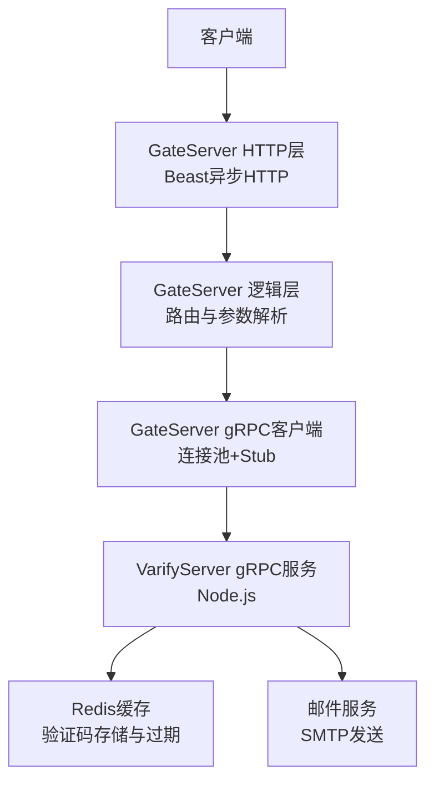
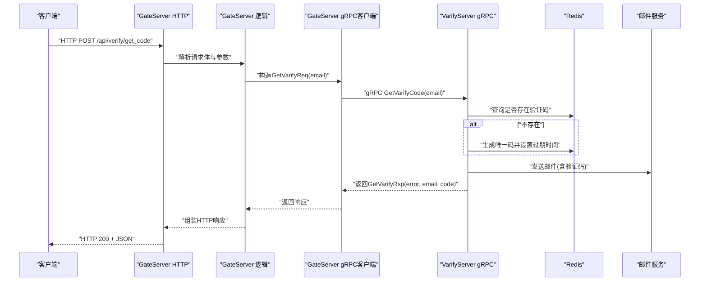
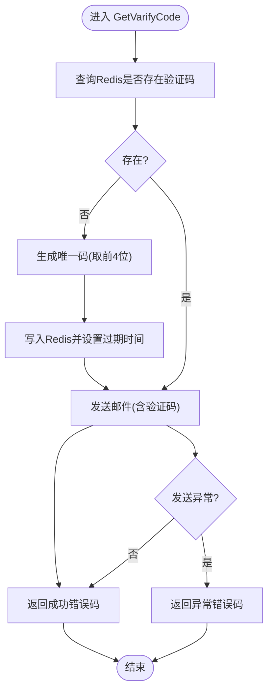
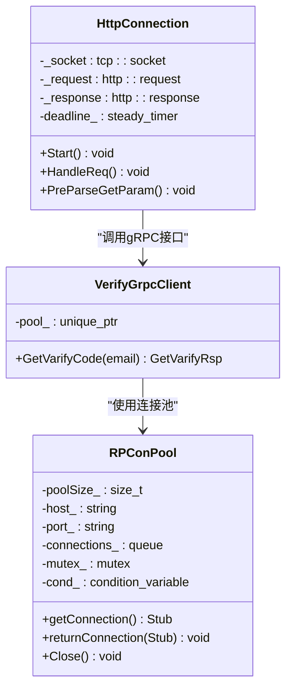
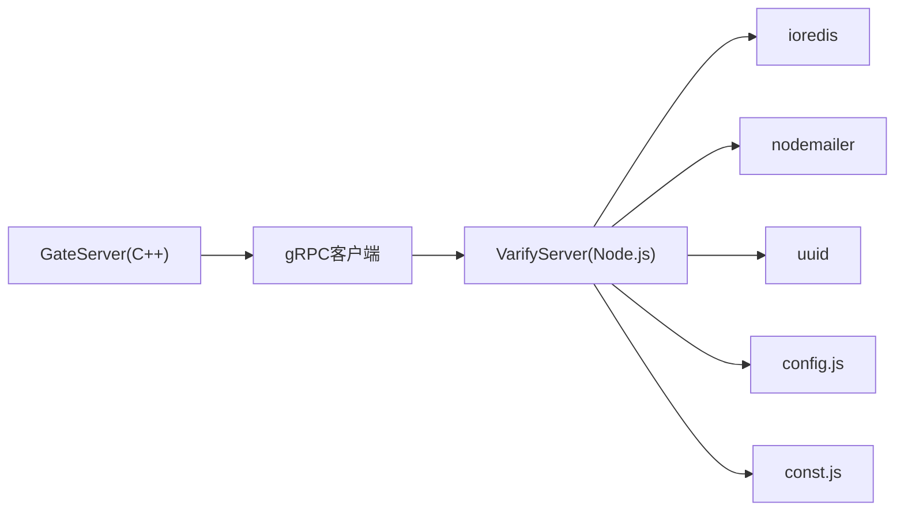

# VerifyService验证码服务接口

<cite>
**本文引用的文件**
- [verify.proto](file://proto/verify_service/verify.proto)
- [message.proto](file://server/VarifyServer/message.proto)
- [server.js](file://server/VarifyServer/server.js)
- [email.js](file://server/VarifyServer/email.js)
- [redis.js](file://server/VarifyServer/redis.js)
- [config.js](file://server/VarifyServer/config.js)
- [const.js](file://server/VarifyServer/const.js)
- [VerifyGrpcClient.h](file://server/GateServer/include/VerifyGrpcClient.h)
- [VerifyGrpcClient.cpp](file://server/GateServer/src/VerifyGrpcClient.cpp)
- [HttpConnection.h](file://server/GateServer/include/HttpConnection.h)
- [HttpConnection.cpp](file://server/GateServer/src/HttpConnection.cpp)
</cite>

## 目录
1. [简介](#简介)
2. [项目结构](#项目结构)
3. [核心组件](#核心组件)
4. [架构总览](#架构总览)
5. [详细组件分析](#详细组件分析)
6. [依赖关系分析](#依赖关系分析)
7. [性能与扩展性](#性能与扩展性)
8. [故障排查指南](#故障排查指南)
9. [结论](#结论)
10. [附录：接口定义与消息格式](#附录接口定义与消息格式)

## 简介
本文件为 VerifyService（验证码服务）的gRPC接口文档，覆盖邮箱验证码生成、验证、重置等能力的设计与实现说明。当前仓库实现了“获取验证码”的gRPC方法，并通过Node.js服务端完成验证码生成、Redis缓存与邮件发送；GateServer作为HTTP入口，将HTTP请求转换为gRPC调用。文档同时给出错误码、有效期管理、安全校验、防刷策略、重试机制与监控建议，帮助读者快速理解并扩展该服务。

## 项目结构
- proto层定义了跨语言的服务契约，供C++ GateServer与Node.js VarifyServer共同使用。
- Node.js VarifyServer提供gRPC服务，集成Redis与邮件发送。
- C++ GateServer提供HTTP接入，并将业务请求转发到VarifyServer的gRPC接口。

**图表来源**
- [HttpConnection.cpp:133-194](file://server/GateServer/src/HttpConnection.cpp#L133-L194)
- [VerifyGrpcClient.h:80-110](file://server/GateServer/include/VerifyGrpcClient.h#L80-L110)
- [server.js:66-73](file://server/VarifyServer/server.js#L66-L73)
- [redis.js:1-35](file://server/VarifyServer/redis.js#L1-L35)
- [email.js:1-37](file://server/VarifyServer/email.js#L1-L37)

**章节来源**
- [verify.proto:1-19](file://proto/verify_service/verify.proto#L1-L19)
- [message.proto:1-17](file://server/VarifyServer/message.proto#L1-L17)
- [server.js:1-76](file://server/VarifyServer/server.js#L1-L76)
- [HttpConnection.cpp:133-194](file://server/GateServer/src/HttpConnection.cpp#L133-L194)
- [VerifyGrpcClient.h:18-78](file://server/GateServer/include/VerifyGrpcClient.h#L18-L78)

## 核心组件
- gRPC服务契约：定义在proto文件中，包含服务名、方法与消息类型。
- Node.js VarifyServer：实现gRPC服务，负责验证码生成、Redis存取、邮件发送。
- C++ GateServer：HTTP网关，解析请求并调用VarifyServer的gRPC接口。
- Redis模块：封装连接、心跳、读写与过期控制。
- 邮件模块：基于SMTP封装发送邮件。
- 配置与常量：集中管理邮箱、Redis、错误码与前缀等。

**章节来源**
- [verify.proto:1-19](file://proto/verify_service/verify.proto#L1-L19)
- [message.proto:1-17](file://server/VarifyServer/message.proto#L1-L17)
- [server.js:15-64](file://server/VarifyServer/server.js#L15-L64)
- [redis.js:36-101](file://server/VarifyServer/redis.js#L36-L101)
- [email.js:1-37](file://server/VarifyServer/email.js#L1-L37)
- [config.js:1-15](file://server/VarifyServer/config.js#L1-L15)
- [const.js:1-10](file://server/VarifyServer/const.js#L1-L10)
- [VerifyGrpcClient.h:80-110](file://server/GateServer/include/VerifyGrpcClient.h#L80-L110)

## 架构总览
整体采用分层架构：
- 接入层：GateServer暴露HTTP API，统一处理请求与响应。
- 适配层：GateServer内部通过gRPC客户端调用VarifyServer。
- 业务层：VarifyServer实现验证码生成、缓存与邮件发送。
- 基础设施：Redis用于验证码存储与过期控制；SMTP用于邮件投递。

**图表来源**
- [HttpConnection.cpp:133-194](file://server/GateServer/src/HttpConnection.cpp#L133-L194)
- [VerifyGrpcClient.h:87-104](file://server/GateServer/include/VerifyGrpcClient.h#L87-L104)
- [server.js:15-64](file://server/VarifyServer/server.js#L15-L64)
- [redis.js:87-98](file://server/VarifyServer/redis.js#L87-L98)
- [email.js:22-35](file://server/VarifyServer/email.js#L22-L35)

## 详细组件分析

### gRPC接口定义与消息格式
- 服务名：VarifyService
- 方法：GetVarifyCode
- 请求消息：GetVarifyReq
  - email: string
- 响应消息：GetVarifyRsp
  - error: int32（错误码）
  - email: string（邮箱地址）
  - code: string（验证码，当前实现未返回，可在后续版本补充）

注意：proto中存在两套定义，proto/verify_service/verify.proto与server/VarifyServer/message.proto内容一致，但命名略有差异。建议统一以proto/verify_service/verify.proto为准，并在GateServer与VarifyServer之间保持契约一致性。

**章节来源**
- [verify.proto:1-19](file://proto/verify_service/verify.proto#L1-L19)
- [message.proto:1-17](file://server/VarifyServer/message.proto#L1-L17)

### Node.js VarifyServer实现要点
- 启动gRPC服务并绑定端口，注册GetVarifyCode处理器。
- 验证码生成与缓存：
  - 若Redis中不存在对应邮箱的验证码，则生成唯一码（截取前4位），写入Redis并设置过期时间（秒）。
  - 若已存在，则复用已有验证码。
- 邮件发送：
  - 构造邮件内容（包含验证码与提示语），通过SMTP发送。
- 错误处理：
  - Redis异常返回特定错误码。
  - 其他异常捕获后返回通用异常码。

**图表来源**
- [server.js:15-64](file://server/VarifyServer/server.js#L15-L64)
- [redis.js:87-98](file://server/VarifyServer/redis.js#L87-L98)
- [email.js:22-35](file://server/VarifyServer/email.js#L22-L35)

**章节来源**
- [server.js:15-64](file://server/VarifyServer/server.js#L15-L64)
- [redis.js:1-35](file://server/VarifyServer/redis.js#L1-L35)
- [email.js:1-37](file://server/VarifyServer/email.js#L1-L37)
- [const.js:1-10](file://server/VarifyServer/const.js#L1-L10)

### GateServer HTTP到gRPC转换层
- HTTP接入：
  - 使用Boost.Beast异步读取请求，支持GET/POST。
  - 解析URL与查询参数，交由LogicSystem进行路由处理。
- gRPC客户端：
  - 维护连接池（RPConPool），复用VarifyService::Stub。
  - 调用GetVarifyCode并返回响应，失败时填充错误码。
- 超时与资源管理：
  - 连接级超时定时器，避免长时间占用。
  - 连接池在析构时关闭并清理资源。

**图表来源**
- [VerifyGrpcClient.h:18-78](file://server/GateServer/include/VerifyGrpcClient.h#L18-L78)
- [VerifyGrpcClient.h:80-110](file://server/GateServer/include/VerifyGrpcClient.h#L80-L110)
- [VerifyGrpcClient.cpp:1-9](file://server/GateServer/src/VerifyGrpcClient.cpp#L1-L9)
- [HttpConnection.h:1-36](file://server/GateServer/include/HttpConnection.h#L1-L36)
- [HttpConnection.cpp:133-194](file://server/GateServer/src/HttpConnection.cpp#L133-L194)

**章节来源**
- [HttpConnection.cpp:133-194](file://server/GateServer/src/HttpConnection.cpp#L133-L194)
- [VerifyGrpcClient.h:80-110](file://server/GateServer/include/VerifyGrpcClient.h#L80-L110)
- [VerifyGrpcClient.cpp:1-9](file://server/GateServer/src/VerifyGrpcClient.cpp#L1-L9)

### 验证码有效期管理与Redis策略
- Key设计：code_prefix + email（例如 code_xxx@yyy.com）。
- 过期时间：固定秒数（如600秒），确保验证码短期有效。
- 原子性与一致性：先查询再写入，避免重复生成；写入失败需返回错误码。
- 心跳与健康检查：Redis客户端定期写入心跳键，便于监控可用性。

**章节来源**
- [redis.js:31-35](file://server/VarifyServer/redis.js#L31-L35)
- [redis.js:87-98](file://server/VarifyServer/redis.js#L87-L98)
- [config.js:11-14](file://server/VarifyServer/config.js#L11-L14)
- [const.js:1-10](file://server/VarifyServer/const.js#L1-L10)

### 邮件发送集成
- SMTP配置：主机、端口、安全模式、认证信息从配置文件加载。
- 发送流程：构造邮件选项（发件人、收件人、主题、正文），异步发送并返回结果。
- 错误处理：发送失败抛出异常，由上层捕获并返回错误码。

**章节来源**
- [email.js:1-37](file://server/VarifyServer/email.js#L1-L37)
- [config.js:1-15](file://server/VarifyServer/config.js#L1-L15)

### 错误码与状态约定
- 成功：0
- Redis异常：1
- 其他异常：2
- RPC失败（Gate侧）：ErrorCodes::RPCFailed（具体值见const.h，此处不展开）

建议在响应中始终携带error字段，便于调用方判断与重试。

**章节来源**
- [const.js:3-7](file://server/VarifyServer/const.js#L3-L7)
- [VerifyGrpcClient.h:95-103](file://server/GateServer/include/VerifyGrpcClient.h#L95-L103)

## 依赖关系分析
- GateServer依赖：
  - Boost.Beast（HTTP）
  - gRPC C++客户端（Stub与Channel）
  - ConfigMgr（配置管理）
  - Singleton（单例）
- VarifyServer依赖：
  - @grpc/grpc-js（gRPC服务）
  - ioredis（Redis客户端）
  - nodemailer（邮件发送）
  - uuid（唯一码生成）
  - 自定义模块（config、const、email、redis）

**图表来源**
- [VerifyGrpcClient.h:1-10](file://server/GateServer/include/VerifyGrpcClient.h#L1-L10)
- [server.js:1-8](file://server/VarifyServer/server.js#L1-L8)
- [redis.js:1-14](file://server/VarifyServer/redis.js#L1-L14)
- [email.js:1-3](file://server/VarifyServer/email.js#L1-L3)
- [config.js:1-15](file://server/VarifyServer/config.js#L1-L15)
- [const.js:1-10](file://server/VarifyServer/const.js#L1-L10)

**章节来源**
- [VerifyGrpcClient.h:1-10](file://server/GateServer/include/VerifyGrpcClient.h#L1-L10)
- [server.js:1-8](file://server/VarifyServer/server.js#L1-L8)

## 性能与扩展性
- 连接池与并发：
  - Gate侧gRPC客户端使用连接池，减少握手开销，提升吞吐。
  - 建议根据QPS调整池大小与超时策略。
- 缓存与过期：
  - Redis短过期时间降低内存占用，提高安全性。
  - 可引入分布式锁防止同一邮箱短时间内多次生成。
- 邮件发送：
  - 异步发送，避免阻塞主流程。
  - 建议增加队列与重试机制，保障可靠性。
- 监控与指标：
  - 记录关键指标：请求量、成功率、延迟、Redis命中率、邮件发送成功率。
  - 健康检查：Redis心跳、SMTP连通性检测。

[本节为通用指导，无需代码引用]

## 故障排查指南
- 常见问题定位：
  - Redis连接失败：检查网络、密码、端口与防火墙；查看Redis客户端错误日志。
  - 邮件发送失败：核对SMTP配置、授权码、域名白名单；查看邮件模块日志。
  - gRPC调用失败：检查Gate与VarifyServer地址、端口、协议版本；查看RPC状态码。
- 日志与调试：
  - VarifyServer打印请求与Redis查询结果，便于追踪验证码生成路径。
  - GateServer记录HTTP请求与gRPC调用结果，便于端到端排查。
- 恢复策略：
  - 对非幂等操作（如邮件发送）增加重试与退避。
  - 对Redis操作增加降级策略（如本地缓存或限流）。

**章节来源**
- [server.js:56-62](file://server/VarifyServer/server.js#L56-L62)
- [redis.js:16-28](file://server/VarifyServer/redis.js#L16-L28)
- [email.js:22-35](file://server/VarifyServer/email.js#L22-L35)
- [VerifyGrpcClient.h:95-103](file://server/GateServer/include/VerifyGrpcClient.h#L95-L103)

## 结论
VerifyService在当前仓库中实现了“获取验证码”的gRPC接口，结合Redis与邮件服务形成完整闭环。GateServer作为HTTP网关，提供了统一的接入点与gRPC转换能力。建议后续完善验证与重置接口、统一proto定义、增强安全与防刷策略，并完善监控与告警体系，以提升服务的稳定性与可观测性。

[本节为总结，无需代码引用]

## 附录：接口定义与消息格式

### gRPC方法
- 服务：VarifyService
- 方法：GetVarifyCode
- 请求：GetVarifyReq
  - email: string
- 响应：GetVarifyRsp
  - error: int32
  - email: string
  - code: string（当前实现未返回，可扩展）

**章节来源**
- [verify.proto:1-19](file://proto/verify_service/verify.proto#L1-L19)
- [message.proto:1-17](file://server/VarifyServer/message.proto#L1-L17)

### HTTP API与gRPC映射
- 建议HTTP端点：POST /api/verify/get_code
- 请求体示例（JSON）：
  - { "email": "user@example.com" }
- 响应体示例（JSON）：
  - { "error": 0, "email": "user@example.com", "code": "" }

注：GateServer的HTTP处理位于HttpConnection与LogicSystem中，实际路由与参数解析请参考相关实现。

**章节来源**
- [HttpConnection.cpp:133-194](file://server/GateServer/src/HttpConnection.cpp#L133-L194)
- [VerifyGrpcClient.h:87-104](file://server/GateServer/include/VerifyGrpcClient.h#L87-L104)

### 有效期与安全策略
- 有效期：Redis键设置过期时间（秒），建议3-5分钟。
- 安全校验：
  - 邮箱格式校验（客户端与服务端双重校验）。
  - 频率限制（按IP或邮箱维度限流）。
  - 验证码长度与复杂度（当前为4位数字，可升级为字母数字组合）。
- 防刷策略：
  - 同一邮箱N分钟内仅允许一次生成。
  - 同一IP短时间大量请求触发熔断或封禁。
  - 验证码使用后失效或标记已用。

**章节来源**
- [redis.js:87-98](file://server/VarifyServer/redis.js#L87-L98)
- [server.js:24-36](file://server/VarifyServer/server.js#L24-L36)
- [const.js:3-7](file://server/VarifyServer/const.js#L3-L7)

### 错误码与重试建议
- 错误码：
  - 0：成功
  - 1：Redis异常
  - 2：其他异常
  - RPCFailed：Gate侧RPC失败
- 重试建议：
  - 对网络抖动导致的RPC失败进行有限次重试（指数退避）。
  - 对邮件发送失败进行队列重试与告警。

**章节来源**
- [const.js:3-7](file://server/VarifyServer/const.js#L3-L7)
- [VerifyGrpcClient.h:95-103](file://server/GateServer/include/VerifyGrpcClient.h#L95-L103)